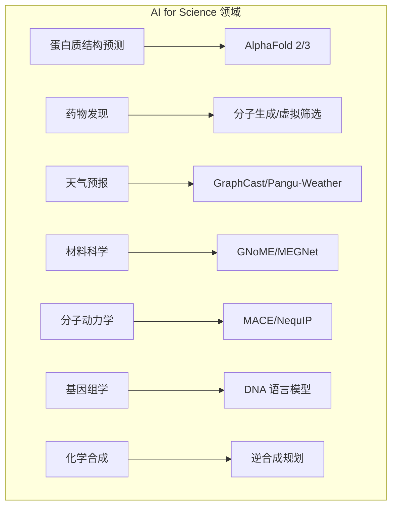

# AI for Science 深度解读: 从 AlphaFold 到科学基础模型

> **一句话理解**: AI for Science 是用深度学习解决自然科学的核心问题——预测蛋白质结构、发现新药、模拟天气、设计新材料，它正在重塑科学研究的方式，从「实验驱动」走向「AI 驱动的科学发现」。

---

## 1. 概述 (Overview)

### 1.1 为什么 AI for Science 是下一个范式转变

```
科学研究的三次范式转变:

┌─────────────────────────────────────────────────────────────────┐
│  范式1: 实验科学 (17-20世纪)                                     │
│  ──────────────────────────────                                 │
│  观察 → 假设 → 实验 → 验证                                      │
│  代表: 牛顿力学、达尔文进化论、门捷列夫周期表                      │
│  局限: 人力密集、周期长、试错成本高                                │
│                                                                 │
│  范式2: 计算科学 (20-21世纪)                                     │
│  ──────────────────────────────                                 │
│  建模 → 数值模拟 → 验证                                          │
│  代表: 有限元分析、分子动力学模拟、气候模型                        │
│  局限: 精度-效率 trade-off、无法处理高维问题                      │
│                                                                 │
│  范式3: AI 驱动的科学 (2020-)                                    │
│  ──────────────────────────────                                 │
│  数据 → AI 学习 → 预测/发现 → 实验验证                           │
│  代表: AlphaFold、GraphCast、GNoME                              │
│  优势: 速度快 10⁴-10⁶ 倍、可探索化学空间、发现人类未知规律          │
└─────────────────────────────────────────────────────────────────┘

AI for Science 的核心洞见:
├── 自然界存在大量可学习的模式 (蛋白质折叠规则、化学反应规律)
├── 传统计算方法 (DFT, MD) 精度够但速度太慢
├── AI 可以「蒸馏」传统计算的精度，达到近实时速度
└── AI 可以探索人类从未测试过的化学/物理空间
```

### 1.2 AI for Science 全景图



### 1.3 里程碑事件

| 年份 | 事件 | 意义 |
|------|------|------|
| 2020 | AlphaFold 2 在 CASP14 夺冠 | 解决生物学 50 年难题 |
| 2022 | AlphaFold 释放 2 亿蛋白质结构 | 结构生物学进入大数据时代 |
| 2023 | GraphCast 超越数值天气预报 | AI 首次在天气预报上超过传统方法 |
| 2023 | AlphaFold 3 多分子预测 | 蛋白质-药物-核酸-DNA 全模态 |
| 2023 | GNoMe 发现 220 万新晶体 | 人类已知晶体数量扩大 10 倍 |
| 2024 | AlphaProteo 蛋白质设计 | 从功能需求反向设计蛋白质 |
| 2025 | MatterGen (Microsoft) | 按需生成新材料 |
| 2025 | GenCast (DeepMind) | 概率天气预报 + 极端事件预警 |
| 2026 | 科学基础模型 (SciFM) | 跨领域统一科学 AI |

---

## 2. 蛋白质结构预测: AlphaFold

### 2.1 问题定义

```
蛋白质折叠问题:

输入: 氨基酸序列 (1D)
    M-V-L-S-P-A-D-K-T-N-V-K-A-A-W-G-K-V-G-A-H-A...

输出: 3D 原子坐标
    每个原子的 (x, y, z) 坐标
    
┌─────────────────────────────────────────────────────────┐
│  为什么重要:                                             │
│  ├── 蛋白质的 3D 结构决定其功能                           │
│  ├── 结构 → 理解疾病机制 → 设计药物                     │
│  └── 自然界有 ~2 亿种已知蛋白质，实验解析结构仅 ~20 万    │
│                                                         │
│  为什么困难:                                             │
│  ├── 氨基酸序列 → 3D 结构的映射极其复杂                  │
│  ├── 构象空间: 100 个氨基酸的蛋白质有 ~10^127 种构象     │
│  └── 传统方法 (X 射线/冷冻电镜): 每个结构需数月-数年     │
│                                                         │
│  Levinthal 悖论:                                        │
│  如果蛋白质随机探索所有构象，需要 > 宇宙年龄             │
│  但实际蛋白质在毫秒级折叠 → 存在确定性的折叠规则          │
└─────────────────────────────────────────────────────────┘
```

### 2.2 AlphaFold 2 架构 (2020)

```
AlphaFold 2 的核心创新:

┌─────────────────────────────────────────────────────────────────┐
│                                                                 │
│  1. 多序列比对 (MSA)                                            │
│     将目标序列与同源序列比对，提取进化信息                        │
│     "进化保守的氨基酸对 → 空间上靠近"                            │
│                                                                 │
│  2. Evoformer (48 层)                                           │
│     ├── MSA 表示: 行注意力 (序列间) + 列注意力 (位置间)          │
│     ├── Pair 表示: 三角形注意力 (三元组几何约束)                  │
│     └── 交叉信息: MSA ↔ Pair 双向信息流                         │
│                                                                 │
│  3. 结构模块 (Structure Module)                                  │
│     ├── 不变点注意力 (IPA): 在 3D 空间中做注意力                 │
│     ├── 逐步精化: 迭代更新原子坐标                               │
│     └── 输出: 每个残基的 backbone 原子坐标 + 置信度 (pLDDT)      │
│                                                                 │
│  4. 训练技巧                                                     │
│     ├── 回收 (Recycling): 将输出重新输入，迭代精化               │
│     ├── 自蒸馏: 用教师模型的输出训练学生模型                      │
│     └── 数据增强: 随机裁剪、MSA 采样                             │
│                                                                 │
│  性能:                                                          │
│  CASP14 GDT-TS: 92.4 (第二名 80.0)                             │
│  误差: ~1 Å (原子级精度，接近实验水平)                          │
│                                                                 │
└─────────────────────────────────────────────────────────────────┘
```

### 2.3 AlphaFold 3 (2024)

```
AlphaFold 3 的进化:

AF2 (2020)                          AF3 (2024)
──────────                          ──────────
仅蛋白质                            蛋白质+核酸+配体+离子
结构模块                            扩散去噪模块
SE(3) 等变性                        简化: 去掉结构模块
单构象预测                          多构象采样
无共价修饰                          支持翻译后修饰

AF3 架构:
┌──────────────────────────────────────────────────────┐
│  输入编码                                             │
│  ├── 序列: 蛋白质/RNA/DNA tokenization                │
│  ├── 配体: SMILES → 分子图 → 编码                     │
│  └── 离子: 原子类型 + 电荷                            │
│                                                      │
│  Evoformer (类似 AF2，但简化)                          │
│  └── Pairformer: 用 pair bias 替代三角注意力          │
│                                                      │
│  扩散去噪 (核心创新):                                 │
│  ├── 从纯噪声开始                                     │
│  ├── 逐步去噪 → 生成原子坐标                          │
│  ├── 类比: 与 Stable Diffusion 相同的扩散框架         │
│  └── 优势: 可处理任意分子类型，不再限于蛋白质          │
│                                                      │
│  输出:                                                │
│  ├── 多构象集合 (多种可能的 3D 结构)                  │
│  ├── 置信度: pLDDT + PAE (pair aligned error)        │
│  └── 蛋白质-配体相互作用细节                           │
└──────────────────────────────────────────────────────┘
```

---

## 3. AI 药物发现

### 3.1 药物发现全流程

```
传统药物发现 vs AI 加速:

┌─────────────────────────────────────────────────────────────────┐
│  传统流程 (10-15 年, $10-25 亿):                                │
│                                                                 │
│  靶点发现 → 先导化合物 → 优化 → 临床前 → I/II/III 期 → 上市    │
│  2-3 年     1-2 年       2 年   1-2 年   5-8 年                 │
│                                                                 │
│  AI 加速点:                                                     │
│  ├── 靶点发现: LLM 分析文献 + GNN 分析蛋白质互作网络             │
│  ├── 虚拟筛选: 深度学习评分替代分子对接 (1000x 加速)            │
│  ├── 分子生成: 扩散模型生成候选分子 (探索新化学空间)             │
│  ├── ADMET 预测: GNN 预测毒性/代谢/吸收 (减少动物实验)           │
│  ├── 临床试验: AI 患者分层 + 自适应试验设计                      │
│  └── 逆合成规划: AI 设计合成路线                                │
│                                                                 │
│  代表性公司/工具:                                                │
│  ├── Insilico Medicine: 首个 AI 药物进入临床 II 期 (2024)       │
│  ├── Recursion Pharma: AI + 自动化高通量筛选                    │
│  ├── Isomorphic Labs (DeepMind): AlphaFold 驱动的药物设计       │
│  └── Absci: AI 蛋白质设计 + 抗体优化                            │
└─────────────────────────────────────────────────────────────────┘
```

### 3.2 分子生成的扩散模型

```python
# 概念示意: 基于图的分子扩散生成
# 实际实现参考: DiffSBDD, DiffLinker, TargetDiff

import torch
import torch.nn as nn

class MolecularDiffusion(nn.Module):
    """
    分子扩散模型: 从噪声中生成 3D 分子
    类比: Stable Diffusion 生成图像 → Molecular Diffusion 生成分子
    """
    def __init__(self, n_atom_types=10, hidden_dim=256, n_layers=6):
        super().__init__()
        # 原子类型嵌入
        self.atom_emb = nn.Embedding(n_atom_types, hidden_dim)
        # 等变图神经网络 (保持旋转/平移等变性)
        self.gnn_layers = nn.ModuleList([
            EquivariantGNNLayer(hidden_dim) for _ in range(n_layers)
        ])
        # 坐标预测头
        self.coord_head = nn.Linear(hidden_dim, 1)
        # 原子类型预测头
        self.type_head = nn.Linear(hidden_dim, n_atom_types)
    
    def forward(self, x_noisy, coords_noisy, t, context=None):
        """
        x_noisy: 加噪的原子类型特征 [N, hidden]
        coords_noisy: 加噪的 3D 坐标 [N, 3]
        t: 扩散时间步 [1]
        """
        h = self.atom_emb(x_noisy)
        
        # 等变 GNN: 同时更新特征和坐标
        for layer in self.gnn_layers:
            h, coords_noisy = layer(h, coords_noisy, t)
        
        # 预测: 去噪方向
        coord_pred = self.coord_head(h)     # [N, 1] 坐标修正
        type_pred = self.type_head(h)       # [N, n_types] 原子类型
        
        return coord_pred, type_pred


class EquivariantGNNLayer(nn.Module):
    """E(n) 等变层: 输出随输入的旋转/平移而一致变化"""
    def __init__(self, hidden_dim):
        super().__init__()
        self.edge_mlp = nn.Sequential(
            nn.Linear(hidden_dim * 2 + 1, hidden_dim),
            nn.SiLU(),
            nn.Linear(hidden_dim, hidden_dim)
        )
        self.node_mlp = nn.Sequential(
            nn.Linear(hidden_dim * 2, hidden_dim),
            nn.SiLU(),
            nn.Linear(hidden_dim, hidden_dim)
        )
        self.coord_mlp = nn.Sequential(
            nn.Linear(hidden_dim, hidden_dim),
            nn.SiLU(),
            nn.Linear(hidden_dim, 1, bias=False)
        )
    
    def forward(self, h, coords, t):
        """h: [N, hidden], coords: [N, 3]"""
        # 计算边特征: 距离 + 节点特征拼接
        # 更新节点特征和坐标
        # (简化实现，完整版本参考 Equiformer/TensorNet)
        return h, coords
```

### 3.3 虚拟筛选: 深度学习打分

```
传统分子对接 vs 深度学习打分:

传统分子对接 (AutoDock):
├── 物理力场计算: 范德华力 + 静电 + 氢键 + 溶剂化
├── 搜索算法: 遗传算法/模拟退火寻找最优构象
├── 速度: ~10 秒/分子 → 100 万分子库需要 ~115 天
└── 精度: 中等 (打分函数不够准确)

深度学习打分 (DiffDock, EquiBind):
├── 图神经网络: 蛋白质口袋 + 分子 → 结合亲和力
├── 等变网络: 保持 3D 几何不变性
├── 速度: ~0.01 秒/分子 → 100 万分子库需要 ~3 小时
└── 精度: 高 (学习到更复杂的相互作用模式)

加速比: 1000x
```

---

## 4. AI 气象预测

### 4.1 GraphCast (DeepMind, 2023)

```
GraphCast 架构:

┌─────────────────────────────────────────────────────────────────┐
│  输入: 当前气象状态 (温度、湿度、风速、气压...)                  │
│  分辨率: 0.25° × 0.25° (约 28km 网格)                          │
│  时间步: 6 小时                                                  │
│                                                                 │
│  编码器 (Encoder):                                               │
│  ├── 经纬度网格 → 多尺度二十面体网格                             │
│  ├── 网格边: 大圆距离 + 相对位置编码                             │
│  └── GNN: 将网格特征映射到图节点                                 │
│                                                                 │
│  处理器 (Processor):                                             │
│  ├── 16 层 GNN (消息传递)                                       │
│  ├── 多尺度: 粗/中/细三个分辨率层                                │
│  └── 残差连接 + 层归一化                                         │
│                                                                 │
│  解码器 (Decoder):                                               │
│  ├── 图节点特征 → 经纬度网格                                     │
│  └── 输出: 未来 6 小时气象状态变化量 (残差预测)                   │
│                                                                 │
│  性能 (vs ECMWF HRES, 全球最高精度数值天气预报):                 │
│  ├── 90% 的气象变量上 GraphCast 更准确                           │
│  ├── 训练: 3 周 on TPU v4 (vs 数值模型需要超级计算机)            │
│  └── 推理: < 1 分钟 (vs 数值模型需要数小时)                      │
│                                                                 │
│  局限:                                                           │
│  ├── 不预测极端事件 (罕见事件训练数据不足)                        │
│  ├── 不保证物理守恒 (能量/质量可能不守恒)                        │
│  └── 自回归累积误差 (长期预测不准)                               │
└─────────────────────────────────────────────────────────────────┘
```

### 4.2 GenCast: 概率预报 (2024)

```
GenCast = GraphCast + 扩散模型

核心思想: 不是预测一个确定性未来，而是生成多个可能的天气预报

┌──────────────────────────────────────────────────────┐
│  GenCast 流程:                                       │
│                                                      │
│  1. 编码器: 当前 + 过去 12h 气象 → 条件向量          │
│  2. 扩散去噪: 从噪声中生成气象场扰动                  │
│  3. 采样 50 次 → 50 个可能的未来天气                  │
│  4. 集合统计: 均值 + 不确定性估计                     │
│                                                      │
│  优势:                                               │
│  ├── 概率预报: "明天降雨概率 70%"                    │
│  ├── 极端事件: 50 次采样中至少有 1 次捕捉到极端情况  │
│  └── 校准良好: 预测概率与实际频率匹配                │
│                                                      │
│  2024 实战:                                          │
│  ├── 成功预测飓风 Milton 的路径 (提前 15 天)          │
│  └── 成功预测欧洲热浪 (提前 10 天)                   │
└──────────────────────────────────────────────────────┘
```

---

## 5. AI 材料科学

### 5.1 GNoMe (Google DeepMind, 2023)

```
GNoMe (Graph Networks for Materials Exploration):

成果: 发现 220 万个新稳定晶体 (人类已知仅 ~2 万)

┌─────────────────────────────────────────────────────────────────┐
│  方法:                                                           │
│                                                                  │
│  1. 图表示: 晶体 → 原子图 (原子=节点, 键=边)                     │
│  2. GNN 势能面: 预测原子间相互作用能                              │
│  3. 主动学习循环:                                                │
│     ├── GNN 预测候选结构的稳定性                                  │
│     ├── 选最不确定的候选 → DFT 计算验证                           │
│     ├── 将验证结果加入训练集 → 更新 GNN                           │
│     └── 循环直到收敛                                              │
│                                                                  │
│  4. 稳定性判据:                                                  │
│     └── 形成能 < 凸包能量 + 容差 → 热力学稳定                    │
│                                                                  │
│  影响:                                                           │
│  ├── 锂电池材料: 发现新型固态电解质                               │
│  ├── 超导体: 筛选超导候选材料                                    │
│  └── 催化: 发现高效催化剂表面                                    │
└─────────────────────────────────────────────────────────────────┘
```

### 5.2 MatterGen (Microsoft, 2025)

```
MatterGen: 按需生成新材料

传统: 筛选已有材料 → 测试 → 优化
MatterGen: 给定约束条件 → 生成满足条件的新材料

┌──────────────────────────────────────────────────────┐
│  条件生成:                                            │
│  ├── "我需要一个带隙为 2.0 eV 的半导体"               │
│  ├── "我需要一个密度 < 2 g/cm³ 的高强度合金"         │
│  └── "我需要一个能吸附 CO₂ 的多孔材料"                │
│                                                      │
│  架构: 扩散模型 + 晶体图                              │
│  ├── 噪声: 随机原子 + 随机晶格                        │
│  ├── 条件: 目标属性嵌入                               │
│  └── 去噪: 逐步生成真实晶体结构                       │
│                                                      │
│  性能:                                               │
│  ├── 生成材料 83% 热力学稳定 (vs 基线 23%)           │
│  └── 条件满足率 > 70%                                │
└──────────────────────────────────────────────────────┘
```

---

## 6. 神经算子 (Neural Operators)

### 6.1 从函数逼近到算子学习

```
传统深度学习 vs 神经算子:

传统: f: R^n → R^m (有限维 → 有限维)
    例: 图像分类 (像素 → 类别)

神经算子: G: F₁ → F₂ (无穷维函数空间 → 无穷维函数空间)
    例: 求解偏微分方程 (初始条件函数 → 解函数)

┌─────────────────────────────────────────────────────────┐
│  核心优势: 分辨率不变性                                   │
│                                                         │
│  传统方法:                                               │
│  ├── 在 64×64 网格上训练                                │
│  ├── 在 128×128 上推理 → 需要重新训练                   │
│  └── 每次新分辨率 = 新问题                              │
│                                                         │
│  神经算子:                                               │
│  ├── 在 64×64 网格上训练                                │
│  ├── 在 1228×1028 上推理 → 直接可用 (零额外训练)        │
│  └── 学习的是算子本身，不依赖网格                       │
│                                                         │
│  代表模型:                                               │
│  ├── FNO (Fourier Neural Operator): 频域学习            │
│  ├── DeepONet: 双分支架构 (branch + trunk)              │
│  ├── U-NO: U-Net 风格的神经算子                         │
│  └── Geo-FNO: 处理不规则几何                            │
└─────────────────────────────────────────────────────────┘
```

### 6.2 FNO 代码示例

```python
import torch
import torch.nn as nn
import torch.nn.functional as F

class SpectralConv2d(nn.Module):
    """谱域卷积: 在傅里叶空间做线性变换"""
    def __init__(self, in_channels, out_channels, modes1, modes2):
        super().__init__()
        self.in_channels = in_channels
        self.out_channels = out_channels
        self.modes1 = modes1
        self.modes2 = modes2
        
        # 谱域权重 (只保留低频分量)
        self.weight1 = nn.Parameter(
            torch.randn(in_channels, out_channels, modes1, modes2, 2)
            / (in_channels * out_channels)
        )
    
    def forward(self, x):
        """x: [batch, channels, H, W]"""
        batch_size = x.shape[0]
        
        # 傅里叶变换
        x_ft = torch.fft.rfft2(x)
        
        # 谱域乘法 (只操作低频分量)
        out_ft = torch.zeros(batch_size, self.out_channels,
                            x.size(-2), x.size(-1)//2+1,
                            dtype=torch.cfloat, device=x.device)
        out_ft[:, :, :self.modes1, :self.modes2] = (
            torch.einsum("bixy,ioxy->boxy",
                        x_ft[:, :, :self.modes1, :self.modes2],
                        torch.view_as_complex(self.weight1))
        )
        
        # 逆傅里叶变换
        return torch.fft.irfft2(out_ft, s=(x.size(-2), x.size(-1)))


class FNO2d(nn.Module):
    """2D 傅里叶神经算子: 求解偏微分方程"""
    def __init__(self, modes=12, width=32, n_layers=4):
        super().__init__()
        self.lift = nn.Linear(2, width)  # 输入: (x_coord, value)
        
        self.spectral_convs = nn.ModuleList([
            SpectralConv2d(width, width, modes, modes)
            for _ in range(n_layers)
        ])
        self.spatial_convs = nn.ModuleList([
            nn.Conv2d(width, width, 1) for _ in range(n_layers)
        ])
        
        self.proj = nn.Linear(width, 1)  # 输出: 预测值
    
    def forward(self, x):
        """x: [batch, H, W] (初始条件/输入函数)"""
        # 添加坐标通道
        grid = self.get_grid(x.shape).to(x.device)
        x = torch.stack([x, grid[..., 0]], dim=-1)  # [B, H, W, 2]
        
        # 提升维度
        x = self.lift(x).permute(0, 3, 1, 2)  # [B, width, H, W]
        
        # 谱域 + 空间卷积
        for spec_conv, spat_conv in zip(self.spectral_convs, self.spatial_convs):
            x1 = spec_conv(x)
            x2 = spat_conv(x)
            x = F.gelu(x1 + x2)
        
        # 投影到输出
        x = x.permute(0, 2, 3, 1)  # [B, H, W, width]
        return self.proj(x).squeeze(-1)  # [B, H, W]
    
    def get_grid(self, shape):
        batch_size, H, W = shape
        grid_x = torch.linspace(0, 1, W).reshape(1, 1, W).repeat(batch_size, H, 1)
        grid_y = torch.linspace(0, 1, H).reshape(1, H, 1).repeat(batch_size, 1, W)
        return torch.stack([grid_x, grid_y], dim=-1)
```

---

## 7. 分子动力学与等变网络

### 7.1 等变性 (Equivariance)

```
为什么物理需要等变网络:

┌─────────────────────────────────────────────────────────────────┐
│  物理定律的对称性:                                               │
│                                                                 │
│  旋转等变性: 旋转输入 → 输出相应旋转                             │
│  "分子旋转 90° → 预测的力也旋转 90°"                            │
│                                                                 │
│  平移等变性: 平移输入 → 输出不变 (力) 或相应平移 (坐标)           │
│  "分子移动 5Å → 预测的力不变 (相对位置没变)"                    │
│                                                                 │
│  传统 GNN: 使用距离作为边特征 → 旋转不变 (只学标量)              │
│  等变 GNN: 使用向量/张量特征 → 旋转等变 (保留方向信息)           │
│                                                                 │
│  等变网络类型:                                                    │
│  ├── E(n) GNN (Satorras 2021): 坐标等变更新                     │
│  ├── Tensor Field Networks (Thomas 2018): 高阶张量               │
│  ├── NequIP (Batzinger 2022): 球谐函数展开                      │
│  ├── MACE (Batzinger 2023): 多体等变消息传递                    │
│  └── Equiformer (Liao 2023): 等变 Transformer                   │
│                                                                 │
│  应用: 分子动力学加速 1000-10000x                                │
│  传统 MD: 飞秒步长 × 纳秒模拟 = 10⁷ 步                          │
│  AI MD: 大步长 + 快速势能计算 → 10³-10⁴ 步                     │
└─────────────────────────────────────────────────────────────────┘
```

---

## 8. 科学基础模型 (Science Foundation Models)

### 8.1 2025-2026 前沿

```
从专用模型到通用科学 AI:

┌─────────────────────────────────────────────────────────────────┐
│  科学基础模型 (SciFM) 愿景:                                      │
│                                                                 │
│  专用 AI (2020-2024):                                            │
│  ├── AlphaFold → 蛋白质结构                                     │
│  ├── GraphCast → 天气                                           │
│  ├── GNoMe → 材料                                               │
│  └── 各自为战，无法跨领域协同                                    │
│                                                                 │
│  科学基础模型 (2025-2026):                                       │
│  ├── 统一表示: 原子/分子/蛋白质/天气 都用 token 表示              │
│  ├── 统一架构: Transformer + 等变性 + 物理约束                   │
│  ├── 多任务: 结构预测 + 动力学 + 性质预测 + 生成设计              │
│  └── 跨领域迁移: 蛋白质知识帮助材料设计                          │
│                                                                 │
│  代表工作:                                                       │
│  ├── MatterGen (Microsoft): 统一材料设计                         │
│  ├── SciBERT + 科学 KG: 科学知识增强的 LLM                       │
│  ├── Uni-Mol (DP Technology): 分子/蛋白质统一模型                │
│  └── 原子基础模型: 跨元素周期表的统一表示                        │
└─────────────────────────────────────────────────────────────────┘
```

---

## 9. 工具与数据集

| 工具/数据集 | 领域 | 说明 |
|------------|------|------|
| AlphaFold Server | 蛋白质 | 免费蛋白质结构预测 |
| ChEMBL | 药物 | 200 万化合物生物活性数据 |
| PDB (Protein Data Bank) | 结构生物学 | 20 万+ 实验蛋白质结构 |
| UniProt | 蛋白质 | 蛋白质序列与功能数据库 |
| ERA5 | 气象 | ECMWF 再分析气象数据 |
| Materials Project | 材料 | 15 万+ 材料计算数据 |
| Open Catalyst | 催化 | 催化剂表面吸附数据 |
| MACE | 分子动力学 | 开源等变势能模型 |
| PySCF / ASE | 计算化学 | 量子化学计算工具 |

---

## 相关资源

- [[Graph_Neural_Networks_Deep_Dive]] — 图神经网络 (AlphaFold/GNoMe 的核心技术)
- [[Diffusion_Models_Deep_Dive]] — 扩散模型 (AlphaFold 3/MatterGen 的核心技术)
- [[18_行业应用/03_Healthcare/AI_Healthcare_2026|AI 医疗深度解读]] — AI 医疗 (药物发现的下游应用)

---

*最后更新: 2026-06-04*
