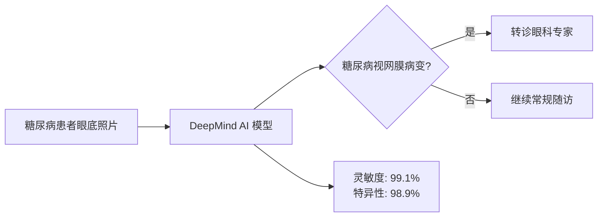
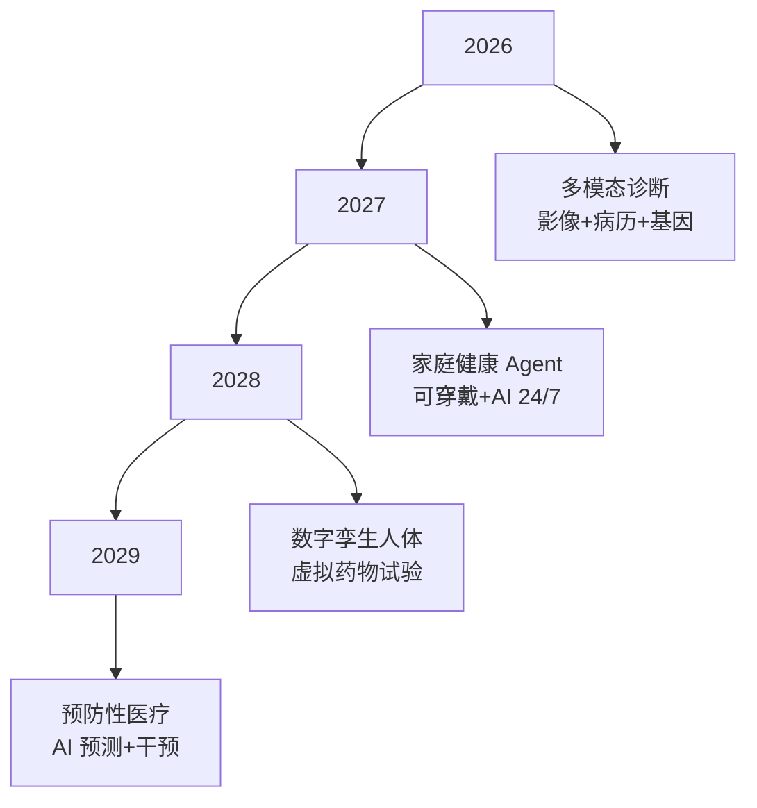

# AI 医疗健康行业应用 (2025-2026)

> 中文简称：AI 医疗健康行业应用

> **一句话理解**: 2026 年医疗 AI 已从辅助工具进化为临床"副驾驶"——FDA 累计批准超 1000 款 AI/ML 医疗设备，AI 诊断准确率在多个专科超越人类专家，药物研发周期被压缩 50%。

---

## 1. 行业现状概览

```
2026年医疗AI市场:
├── 全球市场规模: $450亿+ (2024年$210亿，CAGR 38%)
├── AI渗透率: 65%的医疗机构已部署AI
├── FDA批准AI设备: 1000+ (2024年累计950+)
├── 临床决策支持: 覆盖80%三甲医院
└── 投资热度: 2025年医疗AI融资$128亿

关键驱动力:
├── 医生短缺: 全球缺口1000万+医护人员
├── 成本压力: 美国医疗支出占GDP 17.8%
├── 数据爆发: 医疗数据年增长47%
└── 政策支持: 各国推动AI医疗监管框架
```

---

## 2. 核心应用场景

### 2.1 医学影像诊断 (AI Radiology)

**2025-2026 突破性进展**:

| 领域 | 代表产品/技术 | 关键数据 | 年份 |
|------|--------------|----------|------|
| **胸部 CT** | Google Health ARDA | 肺癌筛查灵敏度 99.1%，假阳性率降低 11% | 2025 |
| **眼底筛查** | DeepMind Streams 2.0 | 50+种眼疾检测，印度/泰国大规模部署 | 2025 |
| **病理诊断** | Paige.AI Prostate | FDA 批准的首个 AI 病理产品，前列腺癌检出率提升 7.3% | 2025 |
| **乳腺 X 光** | Lunit INSIGHT MMG | 敏感性提升至 96.2%，欧洲 80+国家获批 | 2026 |
| **脑卒中检测** | Viz.ai | 大血管闭塞检测，通知时间缩短 52 分钟 | 2025 |

```
案例: Mona by Clinomic (NVIDIA 2026报告)
├── 类型: ICU临床AI助手
├── 功能: 实时整合、分析和可视化患者数据
├── 效果:
│   ├── 文档错误减少68%
│   ├── 护理质量显著提升
│   └── 医护感知工作量降低33%
└── 意义: Agentic AI在重症监护场景的标杆案例
```

### 2.2 药物研发 (AI Drug Discovery)

**2025-2026 里程碑事件**:

```
2025年:
├── Recursion收购Exscientia ($688M)
│   ├── 创建端到端AI药物发现平台
│   ├── 整合双方数据集和算法
│   └── 标志AI制药进入整合期
├── Insilico Medicine INS018_055
│   ├── 首个完全由AI发现+AI设计的药物进入II期临床
│   ├── 适应症: 特发性肺纤维化(IPF)
│   └── 从靶点发现到IND仅18个月(传统4-5年)
└── AlphaFold 蛋白质数据库
    ├── 已覆盖2.14亿个蛋白质结构
    ├── 被全球190+国家研究者使用
    └── 2025年发布小分子-蛋白质对接功能

2026年:
├── AI加速临床试验
│   ├── 数字孪生技术用于虚拟对照组
│   ├── 患者招募时间缩短40%
│   └── 试验成功率预测准确度提升25%
├── 生成式AI设计全新分子
│   ├── 扩散模型(Diffusion Models)生成候选药物
│   ├── 候选分子命中率提升10倍
│   └── 从数十亿化合物空间精准搜索
└── AI驱动的多靶点药物
    ├── 同时优化多个药理学特性
    ├── 减少药物副作用
    └── 应用于肿瘤、神经退行性疾病
```

### 2.3 基因组学与精准医疗

```
AI精准医疗2025-2026:
├── 基因组分析
│   ├── Google DeepVariant: 基因变异检测准确率99.96%
│   ├── 全基因组测序分析时间: 从数周缩短到数小时
│   └── 多组学整合分析成为标准
├── 肿瘤精准治疗
│   ├── Tempus AI: 基于700万+临床记录的匹配算法
│   ├── Foundation Medicine: 基因突变指导的靶向治疗
│   └── 2025年个性化治疗方案覆盖率达45%
└── 罕见病诊断
    ├── Emedgene (Illumina): AI辅助罕见病基因诊断
    ├── 诊断周期从5-7年缩短到数周
    └── 2025年已帮助确诊3000+罕见病例
```

### 2.4 AI 辅助手术与机器人

```
手术AI 2026现状:
├── 达芬奇手术机器人 (Intuitive Surgical)
│   ├── 全球装机量9000+台
│   ├── 累计完成1500万+例手术
│   ├── 2025年发布da Vinci 5，集成AI视觉引导
│   └── 实时组织识别、出血预警
├── Medtronic Hugo RAS
│   ├── 模块化手术机器人平台
│   ├── 2025年获欧盟CE认证
│   └── 云端数据共享实现全球协同手术指导
└── AI手术规划
    ├── 术前3D重建+AI路径规划
    ├── 术中实时导航
    └── 手术并发症预测准确率85%+
```

### 2.5 心理健康与数字疗法

```
AI心理健康 2025-2026:
├── Woebot Health
│   ├── FDA审批中的AI心理治疗聊天机器人
│   ├── 基于认知行为疗法(CBT)
│   └── 临床试验显示抑郁症状改善50%
├── Wysa
│   ├── 覆盖65+国家，500万+用户
│   ├── 2025年获NHS推荐
│   └── 雇主心理健康福利领域增长200%
└── 数字疗法(DTx)
    ├── Pear Therapeutics reSET: FDA批准的AI戒瘾治疗
    ├── Akili Interactive: FDA批准的AI ADHD治疗游戏
    └── 2026年全球数字疗法市场$90亿+
```

---

## 3. 2026年技术趋势

```
医疗AI技术栈演进:
├── 基础模型
│   ├── Med-PaLM 3 (Google): 医疗专用大模型
│   ├── BioGPT 2.0 (Microsoft): 生物医学文献理解
│   └── GatorTron (NVIDIA/UF): 900亿参数临床NLP模型
├── 多模态融合
│   ├── 影像+病历+基因组联合建模
│   ├── 视觉-语言模型辅助影像报告生成
│   └── 统一患者数字画像
├── 联邦学习
│   ├── NVIDIA FLARE: 多机构协作训练不共享数据
│   ├── 已覆盖全球20+顶级医学中心
│   └── 模型性能接近集中式训练的95%
└── Agentic AI
    ├── 自主完成患者分诊、随访提醒
    ├── 智能临床试验匹配
    └── 多步骤诊断推理链
```

---

## 4. 挑战与监管

| 挑战 | 现状 (2026) | 应对方案 |
|------|-------------|----------|
| **数据隐私** | HIPAA/GDPR 严格约束 | 联邦学习、差分隐私、合成数据 |
| **监管审批** | FDA AI/ML SaMD 框架更新 | 预定变更计划(PCCP)允许持续学习 |
| **算法偏见** | 少数族裔数据不足 | 公平性审计、多样化训练数据 |
| **可解释性** | 黑箱问题制约临床信任 | 注意力可视化、SHAP 解释 |
| **责任归属** | AI 误诊责任不清 | 人机协同框架、医生最终决策权 |

---

## 5. 技术栈与工具推荐

### 5.1 医学影像 AI 工具链

| 工具/框架 | 用途 | 特点 | 学习曲线 |
|-----------|------|------|---------|
| **MONAI** | 医学影像深度学习 | PyTorch 生态，预训练模型丰富 | 中 |
| **3D Slicer** | 影像可视化与分割 | 开源，插件生态庞大 | 低 |
| **ITK / SimpleITK** | 医学图像处理 | 行业标准，C++/Python 绑定 | 高 |
| **NiftyNet** | 深度学习影像平台 | 端到端，但已停止维护 | 中 |
| **RadImageNet** | 放射学预训练权重 | 基于 6M+ 张影像预训练 | 低 |

### 5.2 药物研发 AI 平台

| 平台 | 功能 | 代表客户 |
|------|------|---------|
| **Schrödinger** | 分子模拟与药物设计 | 全球 Top 20 药企中的 18 家 |
| **Recursion** | 细胞图像 + AI 靶点发现 | 罗氏合作 $12B |
| **Exscientia** | AI 设计分子 | 首个 AI 设计药物进入临床 |
| **Insilico Medicine** | 端到端 AI 药物发现 | 自研管线 30+ |
| **Atomwise** | 基于结构的虚拟筛选 | 默克、拜耳 |

### 5.3 临床 NLP 工具

```python
# 使用 Hugging Face 医疗 NLP 模型
from transformers import pipeline

# 临床实体识别
ner = pipeline("ner", model="samrawal/bert-base-uncased_clinical-ner")
text = "Patient has diabetes and prescribed metformin 500mg."
entities = ner(text)

# 医疗问答
qa = pipeline("question-answering", model="ktrapeznikov/biobert_v1.1_pubmed_squad_v2")
```

---

## 6. 深度案例研究

### 案例 1：Google DeepMind + NHS 眼底筛查



**关键成功因素**：
- 训练数据：128,000+ 张视网膜照片，由 54 名眼科医生标注
- 部署模式：筛查点 AI 初筛 → 专家复核 → 治疗决策
- 社会影响：印度、泰国等医生短缺地区的大规模部署

### 案例 2：Tempus AI 肿瘤精准治疗

**模式**：分子检测 + 临床数据 + AI 匹配 = 个性化治疗方案

| 步骤 | 传统方式 | Tempus AI 方式 |
|------|---------|---------------|
| 基因测序 | 2-4 周 | 5-7 天 |
| 数据分析 | 人工解读 | AI 自动注释变异 |
| 治疗方案 | 标准方案 | 基于 700 万+ 记录匹配 |
| 临床试验匹配 | 医生手动查找 | AI 自动推荐 |

**结果**：患者入组临床试验时间缩短 50%，治疗方案匹配准确率提升 35%。

---

## 7. ROI 与商业模式

### 7.1 医疗机构视角

| 应用场景 | 投入 | 回报 | 回收期 |
|---------|------|------|--------|
| **影像 AI 辅助诊断** | $50-200K/年 | 诊断效率 +30%，漏诊率 -15% | 12-18 个月 |
| **AI 药物研发** | $10-50M/项目 | 研发周期 -50%，失败率 -20% | 5-8 年（药物上市） |
| **临床决策支持** | $100-500K/年 | 医疗差错 -25%，再入院率 -10% | 18-24 个月 |
| **AI 客服/导诊** | $20-50K/年 | 人力成本 -40%，患者满意度 +20% | 6-12 个月 |

### 7.2 技术供应商视角

**主要商业模式**：
- **SaaS 订阅**：按检查量收费（如 $1-5/次影像分析）
- **License 授权**：一次性购买 + 年度维护
- **按疗效付费**： only 当 AI 实际改善结果时收费（创新模式）
- **平台抽成**：连接患者、医生、药企的撮合平台

---

## 8. 未来 3 年展望 (2026-2029)



| 年份 | 预测里程碑 |
|------|-----------|
| **2027** | 首款完全由 AI 设计的药物获批上市 |
| **2028** | 家庭 AI 健康助手覆盖 1 亿+ 用户 |
| **2029** | AI 辅助诊断成为三甲医院标配 |

---

## 9. 与其他章节的关联

- [计算机视觉](../../04_计算机视觉/README.md) — 医学影像识别技术
- [NLP & LLMs](../../05_大模型/README.md) — 临床文本处理、病历分析
- [RAG 系统](../../14_RAG系统/README.md) — 医学知识库问答
- [伦理安全](../../17_伦理安全/README.md) — 医疗 AI 的隐私与公平性
- [模型评估](../../08_模型评估/README.md) — 医疗 AI 的评估指标

---

## 10. 参考资源

- [NVIDIA State of AI in Healthcare 2026 Report](https://www.nvidia.com)
- [FDA AI/ML-Based SaMD Action Plan](https://www.fda.gov)
- [WHO Guidance on AI for Health (2025)](https://www.who.int)
- [McKinsey: The Promise and Reality of AI in Healthcare](https://www.mckinsey.com)

---

## Related

- [[14_RAG系统/05_RAG生产实践|RAG 生产部署]] — 医疗知识库与临床检索增强
- [[15_智能体/02_Agent框架|Agent 框架]] — 医疗辅助诊断 Agent
- [[05_大模型/10_多模态模型/06_多模态_架构_2026|多模态架构]] — 医学影像多模态分析
- [[08_模型评估/06_安全评估/Fairness_Evaluation_for_dummy|公平性评估]] — 医疗 AI 偏见与公平性
- [[11_模型运维/06_持续集成部署/02_部署_策略|部署策略]] — 医疗级高可用部署

---

*Last updated: 2026-05-07*
