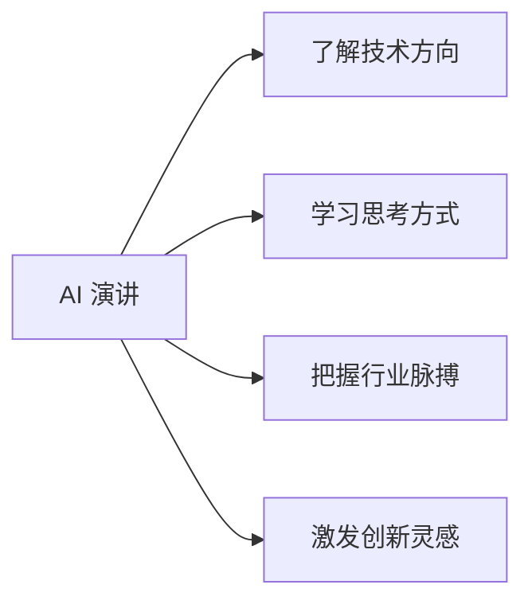
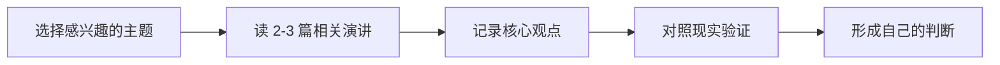
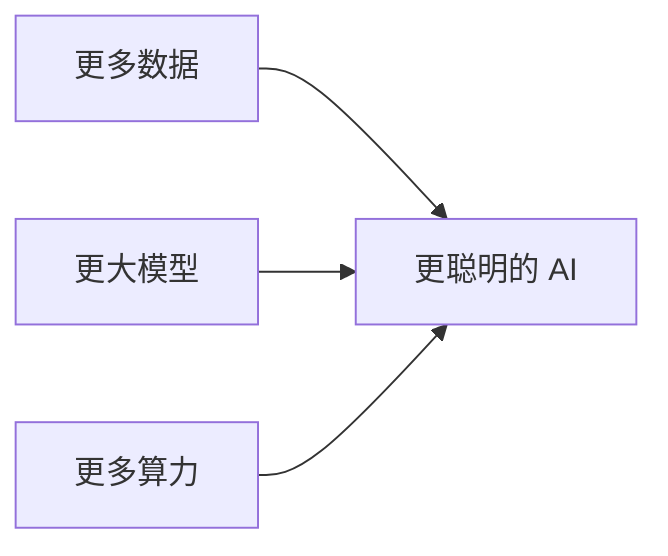
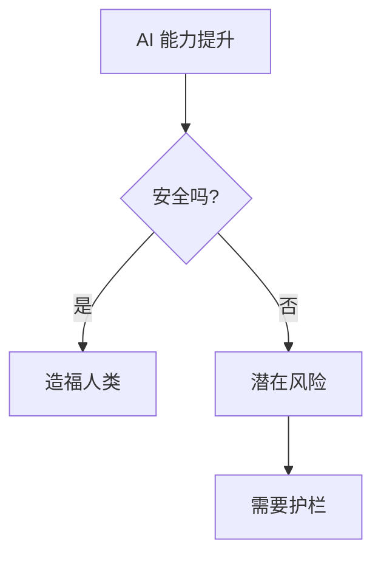
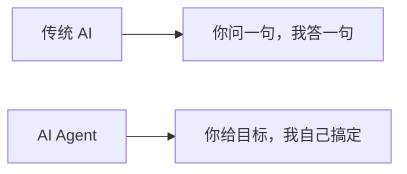
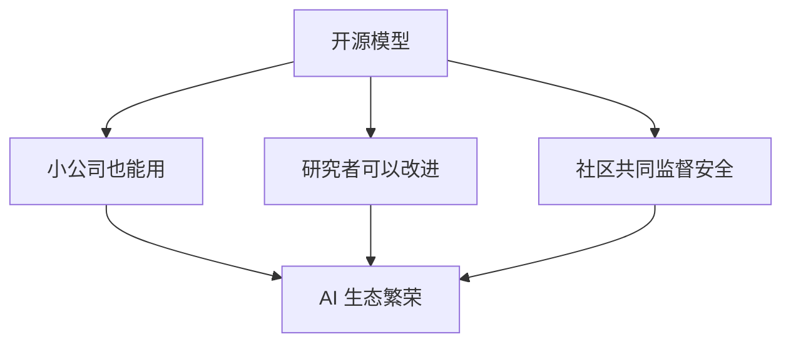
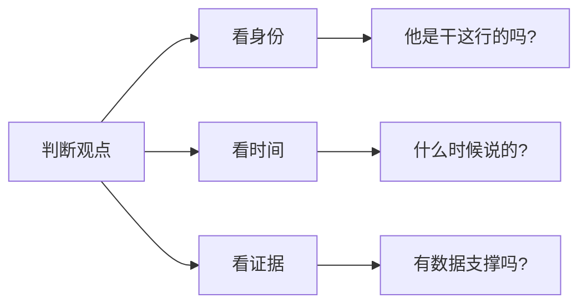
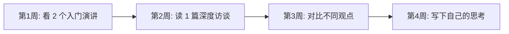

# AI 名人演讲与观点 - 小白版

> **一句话理解**: 读 AI 大牛的演讲就像站在巨人的肩膀上看世界——他们帮你把复杂的技术趋势浓缩成清晰的方向感。

---

## 🤔 为什么要读 AI 演讲？

想象你想学做菜：
- 看菜谱 = 读论文（详细但枯燥）
- 看大厨直播 = 听 AI 演讲（有故事、有洞察、有激情）



**大牛们帮你做了三件事**：
1. 🔍 **筛选信息** —— 从海量研究中提炼关键趋势
2. 🗺️ **连接知识** —— 把零散的技术点串成地图
3. 🔮 **预测未来** —— 基于经验给出方向判断

---

## 📖 如何使用这一章？

### 阅读建议



| 你的身份 | 推荐关注 | 为什么 |
|----------|----------|--------|
| **技术开发者** | 架构、训练、开源 | 提升工程能力 |
| **产品经理** | 应用、交互、商业化 | 找到产品机会 |
| **创业者** | 趋势、Agent、平台 | 发现创业方向 |
| **学生** | 基础、历史、未来 | 建立知识框架 |
| **投资者** | 商业、竞争、风险 | 判断投资价值 |

### 阅读技巧

```
✅ 要做:
- 先看演讲者背景（他是做什么的）
- 找演讲时间（AI 发展快，2 年前的观点可能过时）
- 做笔记：他看到了什么？我担心什么？
- 对比不同大牛的观点（他们意见一致吗？）

❌ 不要做:
- 把每一句话当真理（大牛也会判断错）
- 只看热闹不思考（"好厉害"之后要有"为什么"）
- 忽视反面观点（看看批评者怎么说）
```

---

## 🎯 四大核心主题

### 主题一：Scaling（规模 scaling 定律）

**核心观点**：模型越大、数据越多、算力越强，能力就越强。



**代表演讲者**：
- **Sam Altman (OpenAI)** —— GPT 系列的发展哲学
- **Dario Amodei (Anthropic)** —— Scaling 的安全边界
- **Ilya Sutskever (SSI)** —— 从预训练到超级智能

**💡 小白理解**：
> 就像小学生做题——
> 做 100 道题 vs 做 100 万道题，
> 显然做得多的更厉害。
> AI 也是一样，看得多、学得多，就更聪明。

---

### 主题二：Safety（安全与对齐）

**核心观点**：AI 越强大，安全越重要。



**代表演讲者**：
- **Geoffrey Hinton** —— AI 风险的早期预警
- **Yoshua Bengio** —— 安全研究的紧迫性
- **Stuart Russell** —— 可证明有益 AI

**💡 小白理解**：
> 就像核能——
> 用好了发电造福人类，
> 失控了就是灾难。
> 所以安全研究不是阻碍创新，而是确保创新可持续。

---

### 主题三：Agents（智能体）

**核心观点**：AI 不应该只是回答问题，应该能自主行动。



**代表演讲者**：
- **Jensen Huang (NVIDIA)** —— AI 工厂与 Agent 生态
- **Bill Gates** —— Agent 改变软件交互
- **Andrej Karpathy** —— 软件 2.0 到 Agent 时代

**💡 小白理解**：
> 传统 AI 像计算器——你输入，它输出。
> Agent 像秘书——你说"帮我订下周去上海的机票"，
> 它自己查航班、比价、填信息、下单。

---

### 主题四：Open Source（开源）

**核心观点**：开源 AI 模型让技术民主化。



**代表演讲者**：
- **Yann LeCun (Meta)** —— 开源是必经之路
- **Emad Mostaque (Stability AI)** —— 开源生成模型
- **马克·扎克伯格** —— Llama 开源战略

**💡 小白理解**：
> 闭源模型像可口可乐秘方——只有一家公司能做。
> 开源模型像菜谱——所有人都能做，还能改良创新。

---

## 🌟 演讲者速览

| 大牛 | 身份 | 关注重点 | 小白推荐指数 |
|------|------|----------|--------------|
| **Sam Altman** | OpenAI CEO | AGI 路线图 | ⭐⭐⭐ |
| **Demis Hassabis** | DeepMind CEO | 科学发现 AI | ⭐⭐⭐ |
| **Jensen Huang** | NVIDIA CEO | AI 算力与生态 | ⭐⭐⭐ |
| **Andrej Karpathy** | AI 研究员 | 技术科普 | ⭐⭐⭐⭐⭐ |
| **Andrew Ng** | AI 教育家 | AI 落地实践 | ⭐⭐⭐⭐⭐ |
| **李飞飞** | 斯坦福教授 | AI 人文视角 | ⭐⭐⭐⭐ |
| **Elon Musk** | xAI 创始人 | AI 未来预测 | ⭐⭐ |

---

## ❓ 小白常见问题

### Q1: 这些演讲会不会太深奥看不懂？

**A**: 分人分演讲！

```
推荐小白入门:
🟢 Andrej Karpathy 的 YouTube 视频 —— 像朋友聊天
🟢 Andrew Ng 的公开课 —— 系统化、循序渐进
🟢 李飞飞的 TED 演讲 —— 人文关怀，易懂

可以稍后再看:
🟡 技术发布会（有很多专业术语）
🔴 纯学术会议演讲（需要背景知识）
```

### Q2: 怎么判断一个观点靠不靠谱？

**A**: 三看原则：



| 检查项 | 靠谱信号 | 警惕信号 |
|--------|----------|----------|
| 身份 | 一线从业者 | 纯评论家 |
| 时间 | 近期演讲 | 2 年前对现在的预测 |
| 证据 | 有数据/案例 | 纯感觉/口号 |
| 一致性 | 观点一贯 | 今天说 A 明天说 B |

### Q3: 演讲里的预测都准吗？

**A**: 大牛也是人，预测经常不准！

```
历史打脸案例:
- "AI 冬天不会再来了" → 来了好几次
- "自动驾驶 2020 年普及" → 2026 还在试点
- "大模型只是噱头" → 现在改变了一切

所以:
✅ 学习他们的推理逻辑
❌ 不要盲目相信预测
```

### Q4: 时间有限，优先看谁？

**A**: 按你的目标选：

| 如果你想... | 先看谁 |
|-------------|--------|
| 理解技术原理 | Andrej Karpathy |
| 了解商业趋势 | Sam Altman, Jensen Huang |
| 学习落地方法 | Andrew Ng |
| 思考 AI 与社会 | 李飞飞, Geoffrey Hinton |
| 找创业灵感 | Bill Gates, Dario Amodei |

---

## 🎓 推荐学习路径



| 阶段 | 任务 | 产出 |
|------|------|------|
| 输入 | 每周看 1-2 个演讲/访谈 | 笔记 |
| 消化 | 整理核心观点 | 思维导图 |
| 对比 | 找不同演讲者的分歧 | 对比表 |
| 输出 | 写一段自己的理解 | 博客/笔记 |

---

## 🔗 想深入了解？

- [Andrej Karpathy 演讲集](Andrej_Karpathy/) —— 最易懂的技术讲解
- [Andrew Ng 演讲集](Andrew_Ng/) —— 实用的落地建议
- [Sam Altman 演讲集](Sam_Altman/) —— OpenAI 的发展方向
- [AI 基础 - 小白版](../01_Fundamentals/README_for_dummy.md) —— 补充基础知识

---

*Last updated: 2026-05-07*

## Related

- [[19_Talks/Andrej_Karpathy/about]] — Andrej Karpathy 简介 (Andrej Karpathy) (共享: insights, leaders, speeches, talks)
- [[19_Talks/Andrew_Ng/about]] — Andrew Ng 简介 (Andrew Ng) (共享: insights, leaders, speeches, talks)
- [[19_Talks/Andrew_Ng/sayings]] — Andrew Ng 关于 AI 的观点与格言 (共享: insights, leaders, speeches, talks)
- [[19_Talks/Bill_Gates/about]] — Bill Gates 简介 (Bill Gates) (共享: insights, leaders, speeches, talks)
