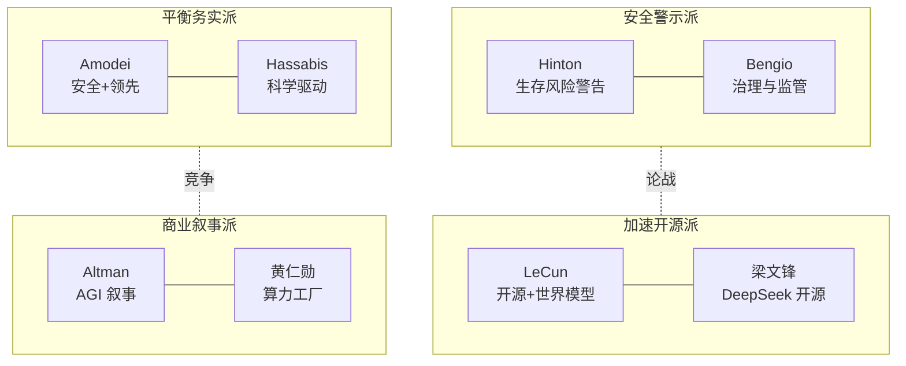

# 业界观点速览 (Industry Voices in a Nutshell)

> 中文简称：业界观点速览

> **一句话理解**: 看懂 AI 行业往哪走，最快的方式不是读论文，而是看清"谁在说什么、为什么这么说"——立场决定观点。

---

## TL;DR

- **三大论战主线**: AI 安全 vs 加速发展、开源 vs 闭源、世界模型 vs 纯语言模型
- **安全警示派**: Hinton、Bengio 公开警告生存风险；Amodei 走"安全前提下领先"路线
- **开源加速派**: LeCun 坚持开源 + 世界模型；梁文锋用 DeepSeek 证明开源可以追平闭源
- **算力叙事**: 黄仁勋定义"AI 工厂"，算力即新时代生产力
- **AGI 时间线**: 预测从 2027（激进）到 2040+（保守）分布极广，立场与商业利益强相关
- **看观点先看屁股**: 实验室领袖、学术元老、云厂商 CEO、开源社区的话语动机各不相同

---

## 1. 观点阵营速查

| 阵营 | 代表人物 | 核心主张 | 一句话立场 |
|------|----------|----------|-----------|
| 安全警示派 | Hinton、Bengio | 生存风险真实存在，需全球治理 | "我们可能造出无法控制的东西" |
| 平衡务实派 | Amodei、Hassabis | 安全与能力并进，负责任扩展 | "领先者才有资格定义安全" |
| 加速开源派 | LeCun、梁文锋 | 开源民主化，LLM 不是终点 | "封闭才是最大的风险" |
| 商业叙事派 | Altman、Nadella、Pichai | AGI 即将到来，全力投入 | "这是新的电力革命" |
| 算力基建派 | 黄仁勋 | 算力是 AI 时代的生产资料 | "买得越多，省得越多" |
| 教育布道派 | Andrew Ng、Karpathy、3Blue1Brown | 降低门槛，人人可学 AI | "AI 是新的读写能力" |

---

## 2. 三大论战一览

| 论战 | 正方 | 反方 | 现状 (2026) |
|------|------|------|-------------|
| 安全 vs 加速 | Hinton/Bengio：先治理再冲刺 | Altman/Musk：竞争中解决问题 | 监管落地缓慢，能力持续跃进 |
| 开源 vs 闭源 | LeCun/梁文锋：开源是安全阀 | Amodei：强模型开源有扩散风险 | DeepSeek/Llama 已逼近闭源第一梯队 |
| 世界模型 vs LLM | LeCun：LLM 无法通向 AGI | Sutskever：压缩即智能 | 多模态 + 世界模型成为共同押注 |

深入阅读: [[19_业界观点/25_Talks_Synthesis_综合演讲/05_Hinton_vs_LeCun_世界模型_Debate.md|Hinton vs LeCun 世界模型之辩]] · [[19_业界观点/25_Talks_Synthesis_综合演讲/07_Open_Source_vs_Closed_Source_AI_2026|开源 vs 闭源 2026]]

---

## 3. 关键人物导航

| 人物 | 身份 | 必读入口 |
|------|------|----------|
| Geoffrey Hinton | 深度学习之父，转向安全警示 | [[19_业界观点/10_Geoffrey_Hinton_辛顿/INDEX|Hinton 专页]] |
| Yann LeCun | Meta 首席科学家，开源旗手 | [[19_业界观点/28_Yann_LeCun_杨立昆/INDEX|LeCun 专页]] |
| Sam Altman | OpenAI CEO，AGI 叙事者 | [[19_业界观点/21_Sam_Altman_奥特曼/INDEX|Altman 专页]] |
| Dario Amodei | Anthropic CEO，安全路线 | [[19_业界观点/05_Dario_Amodei_阿莫迪/INDEX|Amodei 专页]] |
| Ilya Sutskever | SSI 创始人，"压缩即智能" | [[19_业界观点/11_Ilya_Sutskever_苏茨克维/INDEX|Sutskever 专页]] |
| 黄仁勋 (Jensen Huang) | NVIDIA CEO，算力叙事 | [[19_业界观点/12_Jensen_Huang_黄仁勋/INDEX|黄仁勋专页]] |
| 梁文锋 (Wenfeng Liang) | DeepSeek 创始人，开源黑马 | [[19_业界观点/27_Wenfeng_Liang_梁文锋/INDEX|梁文锋专页]] |
| 杨植麟 (Zhilin Yang) | 月之暗面创始人 | [[19_业界观点/30_Zhilin_Yang_杨植麟/INDEX|杨植麟专页]] |
| Andrej Karpathy | 独立教育者，"Software 2.0" | [[19_业界观点/02_Andrej_Karpathy_卡帕西/INDEX|Karpathy 专页]] |
| 李飞飞 (Fei-Fei Li) | 空间智能，World Labs | [[19_业界观点/09_Fei_Fei_Li_李飞飞/INDEX|李飞飞专页]] |

---

## 4. AGI 时间线预测谱系

| 预测区间 | 代表人物 | 依据 |
|----------|----------|------|
| 2027-2028（激进） | Altman、Amodei | Scaling 未见天花板 + 推理模型突破 |
| 2030 前后（中性） | Hassabis、Musk | 需要 1-2 次架构级突破 |
| 2035+（保守） | LeCun、Andrew Ng | LLM 缺世界模型与持续学习 |
| 拒绝预测 | Hinton | "不确定性本身就是最大的风险" |

> 规律：**离商业融资越近，时间线越激进**。完整矩阵见 [[19_业界观点/README.md|AGI 时间线预测矩阵]]。

---

## 5. 中美视角对照

| 维度 | 美国声音 | 中国声音 |
|------|----------|----------|
| 竞争叙事 | "必须保持领先"（Altman/国会证词） | "开源追平，成本取胜"（梁文锋） |
| 技术路线 | 闭源前沿 + 巨额算力 | 开源权重 + 工程效率（DeepSeek/Qwen） |
| 人才观点 | 顶尖实验室垄断 | 王慧文"人才密度"、杨植麟"长期主义" |
| 详细对比 | [[19_业界观点/25_Talks_Synthesis_综合演讲/04_China_US_AI_Race_Leaders_Views|中美 AI 竞赛领袖观点]] | 同左 |

---

## 延伸阅读 (Further Reading)

| 主题 | 说明 | 入口 |
|------|------|------|
| 综合演讲精粹 | 跨人物观点综合 | [[19_业界观点/25_Talks_Synthesis_综合演讲/08_演讲_综合_2026|Talks Synthesis 2026]] |
| 安全立场矩阵 | 各领袖安全立场对照 | [[19_业界观点/25_Talks_Synthesis_综合演讲/03_AI安全_Stance_矩阵|AI 安全立场矩阵]] |
| 学术领袖观点 | 学界视角综述 | [[19_业界观点/25_Talks_Synthesis_综合演讲/01_Academic_Leaders_2026|学术领袖 2026]] |
| 观点洞察笔记 | 演讲要点速记 | [[19_业界观点/25_Talks_Synthesis_综合演讲/09_talks_insights|Talks Insights]] |

---

*Last updated: 2026-07-27*

## 相关链接

- [[19_业界观点/index|业界观点首页]] — 章节总览与人物全表
- [[19_业界观点/README|业界观点小白指南]] — 零基础版
- [[17_伦理安全/index|伦理安全]] — 安全论战的技术落地
- [[05_大模型/index|大模型]] — 观点背后的技术主线
- [[20_论文精读/index|论文精读]] — 观点的论文依据

## 核心知识体系

| 知识层 | 核心内容 | 深度要求 | 学习优先级 |
|--------|----------|----------|------------|
| 基础理论 | 核心概念/数学原理/基本定义 | 深入理解并能推导 | P0 |
| 核心方法 | 主流算法/技术路线/框架工具 | 熟练掌握并能应用 | P0 |
| 工程实践 | 系统设计/性能优化/生产部署 | 独立完成项目 | P1 |
| 前沿研究 | 最新论文/技术趋势/开放问题 | 了解并跟踪 | P2 |
| 行业应用 | 落地案例/最佳实践/经验教训 | 参考并借鉴 | P1 |

## 技术路线对比

| 维度 | 经典方法 | 深度学习方法 | 大模型方法 | 选型建议 |
|------|----------|--------------|------------|----------|
| 数据需求 | 少量标注 | 大量标注 | 海量预训练 | 按数据规模 |
| 计算成本 | 低 | 中-高 | 极高 | 按预算约束 |
| 泛化能力 | 有限 | 良好 | 优秀 | 按任务复杂度 |
| 可解释性 | 高 | 低 | 极低 | 按合规要求 |
| 部署难度 | 简单 | 中等 | 复杂 | 按运维能力 |
| 迭代速度 | 快 | 中 | 慢 | 按业务节奏 |

## 常见问题FAQ

| 问题 | 解答 |
|------|------|
| 如何快速入门该领域? | 先建立直觉(可视化/类比)，再学数学原理，最后代码实现 |
| 需要哪些前置知识? | 线性代数+概率统计+微积分+Python编程基础 |
| 如何选择学习资源? | 经典教材打基础+顶会论文跟前沿+开源项目练实战 |
| 理论学习和实践如何平衡? | 7:3比例——70%时间理解原理，30%时间动手验证 |
| 如何评估自己的掌握程度? | 能向他人清晰解释+能独立实现+能解决变体问题 |

## 核心术语速查

| 术语 | 含义 | 关联概念 |
|------|------|----------|
| Loss Function | 衡量预测与真实值差距 | 交叉熵/MSE/对比损失 |
| Gradient Descent | 沿负梯度方向更新参数 | SGD/Adam/学习率 |
| Overfitting | 模型在训练集过好但泛化差 | 正则化/Dropout/早停 |
| Batch Size | 每次更新的样本数 | 收敛速度/显存/噪声 |
| Epoch | 完整遍历训练集一次 | 训练轮次/早停 |
| Fine-tuning | 在预训练模型上继续训练 | 迁移学习/LoRA/全量 |
| Inference | 模型前向传播产生输出 | 延迟/吞吐/量化 |
| Token | 文本处理的最小单元 | BPE/SentencePiece |

## 推荐资源

| 类型 | 资源 | 适用阶段 |
|------|------|----------|
| 教材 | 领域经典教材(花书/CS229等) | 入门-基础 |
| 课程 | Stanford/MIT在线课程 | 入门-进阶 |
| 论文 | 顶会最佳论文+综述 | 进阶-精通 |
| 代码 | PyTorch/HuggingFace官方示例 | 基础-实战 |
| 社区 | 技术博客+论文读书会 | 全阶段 |
| 竞赛 | Kaggle/天池/学术竞赛 | 基础-进阶 |

## 检查清单

- [ ] 核心概念能向他人清晰解释
- [ ] 数学原理能独立推导
- [ ] 核心算法能手写实现
- [ ] 主流框架和工具已掌握
- [ ] 完成至少一个端到端项目
- [ ] 能阅读和理解领域论文
- [ ] 了解最新技术趋势和开放问题
- [ ] 知识已文档化沉淀
