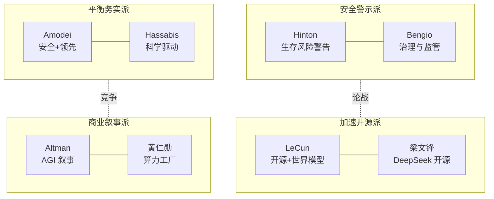

# 业界观点速览 (Industry Voices in a Nutshell)

> 中文简称：业界观点速览

> **一句话理解**: 看懂 AI 行业往哪走，最快的方式不是读论文，而是看清"谁在说什么、为什么这么说"——立场决定观点。

---

## TL;DR

- **三大论战主线**: AI 安全 vs 加速发展、开源 vs 闭源、世界模型 vs 纯语言模型
- **安全警示派**: Hinton、Bengio 公开警告生存风险；Amodei 走"安全前提下领先"路线
- **开源加速派**: LeCun 坚持开源 + 世界模型；梁文锋用 DeepSeek 证明开源可以追平闭源
- **算力叙事**: 黄仁勋定义"AI 工厂"，算力即新时代生产力
- **AGI 时间线**: 预测从 2027（激进）到 2040+（保守）分布极广，立场与商业利益强相关
- **看观点先看屁股**: 实验室领袖、学术元老、云厂商 CEO、开源社区的话语动机各不相同

---

## 1. 观点阵营速查

| 阵营 | 代表人物 | 核心主张 | 一句话立场 |
|------|----------|----------|-----------|
| 安全警示派 | Hinton、Bengio | 生存风险真实存在，需全球治理 | "我们可能造出无法控制的东西" |
| 平衡务实派 | Amodei、Hassabis | 安全与能力并进，负责任扩展 | "领先者才有资格定义安全" |
| 加速开源派 | LeCun、梁文锋 | 开源民主化，LLM 不是终点 | "封闭才是最大的风险" |
| 商业叙事派 | Altman、Nadella、Pichai | AGI 即将到来，全力投入 | "这是新的电力革命" |
| 算力基建派 | 黄仁勋 | 算力是 AI 时代的生产资料 | "买得越多，省得越多" |
| 教育布道派 | Andrew Ng、Karpathy、3Blue1Brown | 降低门槛，人人可学 AI | "AI 是新的读写能力" |

---

## 2. 三大论战一览

| 论战 | 正方 | 反方 | 现状 (2026) |
|------|------|------|-------------|
| 安全 vs 加速 | Hinton/Bengio：先治理再冲刺 | Altman/Musk：竞争中解决问题 | 监管落地缓慢，能力持续跃进 |
| 开源 vs 闭源 | LeCun/梁文锋：开源是安全阀 | Amodei：强模型开源有扩散风险 | DeepSeek/Llama 已逼近闭源第一梯队 |
| 世界模型 vs LLM | LeCun：LLM 无法通向 AGI | Sutskever：压缩即智能 | 多模态 + 世界模型成为共同押注 |

深入阅读: [[19_业界观点/Talks_Synthesis/Hinton_vs_LeCun_World_Model_Debate|Hinton vs LeCun 世界模型之辩]] · [[19_业界观点/Talks_Synthesis/Open_Source_vs_Closed_Source_AI_2026|开源 vs 闭源 2026]]

---

## 3. 关键人物导航

| 人物 | 身份 | 必读入口 |
|------|------|----------|
| Geoffrey Hinton | 深度学习之父，转向安全警示 | [[19_业界观点/Geoffrey_Hinton/index\|Hinton 专页]] |
| Yann LeCun | Meta 首席科学家，开源旗手 | [[19_业界观点/Yann_LeCun/index\|LeCun 专页]] |
| Sam Altman | OpenAI CEO，AGI 叙事者 | [[19_业界观点/Sam_Altman/index\|Altman 专页]] |
| Dario Amodei | Anthropic CEO，安全路线 | [[19_业界观点/Dario_Amodei/index\|Amodei 专页]] |
| Ilya Sutskever | SSI 创始人，"压缩即智能" | [[19_业界观点/Ilya_Sutskever/index\|Sutskever 专页]] |
| 黄仁勋 (Jensen Huang) | NVIDIA CEO，算力叙事 | [[19_业界观点/Jensen_Huang/index\|黄仁勋专页]] |
| 梁文锋 (Wenfeng Liang) | DeepSeek 创始人，开源黑马 | [[19_业界观点/Wenfeng_Liang/index\|梁文锋专页]] |
| 杨植麟 (Zhilin Yang) | 月之暗面创始人 | [[19_业界观点/Zhilin_Yang/index\|杨植麟专页]] |
| Andrej Karpathy | 独立教育者，"Software 2.0" | [[19_业界观点/Andrej_Karpathy/index\|Karpathy 专页]] |
| 李飞飞 (Fei-Fei Li) | 空间智能，World Labs | [[19_业界观点/Fei_Fei_Li/index\|李飞飞专页]] |

---

## 4. AGI 时间线预测谱系

| 预测区间 | 代表人物 | 依据 |
|----------|----------|------|
| 2027-2028（激进） | Altman、Amodei | Scaling 未见天花板 + 推理模型突破 |
| 2030 前后（中性） | Hassabis、Musk | 需要 1-2 次架构级突破 |
| 2035+（保守） | LeCun、Andrew Ng | LLM 缺世界模型与持续学习 |
| 拒绝预测 | Hinton | "不确定性本身就是最大的风险" |

> 规律：**离商业融资越近，时间线越激进**。完整矩阵见 [[19_业界观点/Talks_Synthesis/AGI_Timeline_Predictions_Matrix|AGI 时间线预测矩阵]]。

---

## 5. 中美视角对照

| 维度 | 美国声音 | 中国声音 |
|------|----------|----------|
| 竞争叙事 | "必须保持领先"（Altman/国会证词） | "开源追平，成本取胜"（梁文锋） |
| 技术路线 | 闭源前沿 + 巨额算力 | 开源权重 + 工程效率（DeepSeek/Qwen） |
| 人才观点 | 顶尖实验室垄断 | 王慧文"人才密度"、杨植麟"长期主义" |
| 详细对比 | [[19_业界观点/Talks_Synthesis/China_US_AI_Race_Leaders_Views|中美 AI 竞赛领袖观点]] | 同左 |

---

## 延伸阅读 (Further Reading)

| 主题 | 说明 | 入口 |
|------|------|------|
| 综合演讲精粹 | 跨人物观点综合 | [[19_业界观点/Talks_Synthesis/Talks_Synthesis_2026|Talks Synthesis 2026]] |
| 安全立场矩阵 | 各领袖安全立场对照 | [[19_业界观点/Talks_Synthesis/AI_Safety_Stance_Matrix|AI 安全立场矩阵]] |
| 学术领袖观点 | 学界视角综述 | [[19_业界观点/Talks_Synthesis/Academic_Leaders_2026|学术领袖 2026]] |
| 观点洞察笔记 | 演讲要点速记 | [[19_业界观点/Talks_Synthesis/talks-insights|Talks Insights]] |

---

*Last updated: 2026-07-27*

## 相关链接

- [[19_业界观点/index|业界观点首页]] — 章节总览与人物全表
- [[19_业界观点/README_for_dummy|业界观点小白指南]] — 零基础版
- [[17_伦理安全/index|伦理安全]] — 安全论战的技术落地
- [[05_大模型/index|大模型]] — 观点背后的技术主线
- [[20_论文精读/index|论文精读]] — 观点的论文依据
