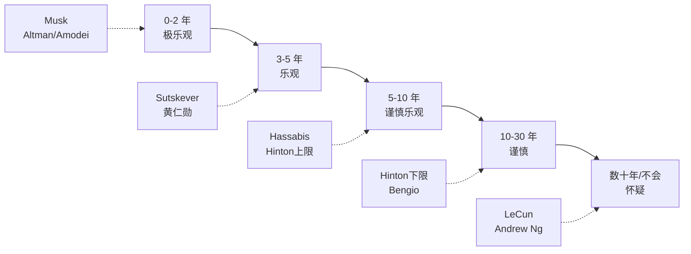

# AGI 时间表预测矩阵：领袖们都说还有几年

> **一句话概括**: 把 Altman / Musk / LeCun / Hassabis / 黄仁勋 / Bengio / Hinton 等 12 位领袖对 AGI 到来时间表的公开预测做成一张矩阵——从"几年内"到"几十年甚至不会"，跨度横跨 50 年，本篇分析他们乐观与悲观的底层逻辑。

---

## 一、为什么 AGI 时间表是 2026 年最受关注的问题

AGI（通用人工智能，Artificial General Intelligence）何时实现，直接决定了三件事：

1. **投资节奏**：如果 AGI 在 3-5 年内到来，现在的算力军备竞赛就是"最后一公里"，必须 all in；如果还要 30 年，投资回报模型完全不同。
2. **安全紧迫性**：[[业界观点/Geoffrey_Hinton/about|Hinton]] 警告"AI 能力提升速度超出安全研究跟进速度"——AGI 越近，安全研究越紧迫。
3. **政策框架**：各国 AI 立法（如欧盟 AI Act、美国行政令）的时间窗口设计，取决于 AGI 何时构成系统性风险。

但这里有个根本困难：**没有人就"什么是 AGI"达成共识**。Altman 把它定义为"在大多数有经济价值的工作中超越人类的系统"；Hassabis 强调"解决智能以解决其他问题"；LeCun 则认为现在的 AI 连猫都不如。定义不同，预测自然南辕北辙。本篇在第二节的矩阵中明确标注每个人使用的定义。

---

## 二、AGI 时间表预测矩阵（核心表格）

下表汇总 12 位领袖在 2023-2026 年间公开的 AGI 预测。时间统一换算为"距 2026 年还有几年"。

| 领袖 | AGI 定义 | 公开预测 | 距 2026 | 立场倾向 | 关键依据 |
|------|----------|----------|---------|----------|----------|
| [[业界观点/Elon_Musk/about|Elon Musk]] | "比最聪明的人更聪明" | 2025-2026 | 0-1 年 | 极乐观 | xAI 算力 + Grok 进展 |
| [[业界观点/Sam_Altman/about|Sam Altman]] | "多数有经济价值工作超越人类" | 2025-2030 | 0-5 年 | 乐观 | Scaling Laws + Test-Time Compute |
| [[业界观点/Dario_Amodei/about|Dario Amodei]] | "强大 AI" (Machines of Loving Grace) | 2026-2027 | 1-2 年 | 谨慎乐观 | Claude 能力曲线 + RSP |
| [[业界观点/Jensen_Huang/about|黄仁勋]] | "具竞争力的人类水平 AI" | 5 年内（即 ~2030 前） | ~5 年 | 乐观 | 算力增长曲线 |
| [[业界观点/Demis_Hassabis/about|Demis Hassabis]] | "通用智能，能跨领域学习" | "几年到十年" | 3-10 年 | 谨慎 | 世界模型 + 强化学习 |
| [[业界观点/Ilya_Sutskever/about|Ilya Sutskever]] | "超级智能" (Superintelligence) | "这个十年" | ~5 年 | 乐观但聚焦安全 | GPT 路线 + SSI 使命 |
| [[业界观点/Geoffrey_Hinton/about|Geoffrey Hinton]] | "超越人类一般智能" | 5-20 年 | 5-20 年 | 担忧为主 | 数字智能可共享知识 |
| [[业界观点/Sundar_Pichai/about|Sundar Pichai]] | "比火或电更深远的 技术" | 不给具体年份 | 不定 | 务实 | Google 全栈布局 |
| [[业界观点/Bill_Gates/about|Bill Gates]] | "GUI 级别的革命性技术" | 不给具体年份 | 不定 | 务实乐观 | 关注应用而非时间 |
| [[业界观点/Andrew_Ng/about|Andrew Ng]] | "多项人类任务超越人类" | "还有几十年" | ~30 年 | 谨慎 | 反对炒作 |
| [[业界观点/Yann_LeCun/about|Yann LeCun]] | "像人一样理解和规划" | "离我们还很远" | 数十年 | 怀疑 | LLM 不是路径，需世界模型 |
| [[业界观点/Yoshua_Bengio/about|Yoshua Bengio]] | "超越人类能力的系统" | "不确定但可能比想象快" | 5-30 年 | 担忧 | LawZero 安全研究 |

> 注：Musk 的预测最激进且最不稳定——他多次声称"明年实现 AGI"（从 2023 推迟到 2024 再到 2025-2026），其预测需打折看待。Altman 拒绝给精确定义和日期，但反复暗示"我们可能离 AGI 只有几年之遥"。

---

## 三、乐观派：为什么他们说"很快"

### 1. Scaling Laws 信仰派（Altman / Amodei / Sutskever）

核心逻辑：**只要继续扩大模型、数据、算力，智能就会涌现**。

- [[业界观点/Sam_Altman/about|Altman]] 在 2024-2025 访谈中表示"预训练的规模扩展仍未触顶"，同时认可推理时计算扩展（Test-Time Compute，如 o1/o3/R1）是新的增长维度。他把 AGI 定义为"在大多数有经济价值的工作中超越人类的系统"，这是一个相对可操作的定义。
- [[业界观点/Dario_Amodei/about|Amodei]] 在 "Machines of Loving Grace" (2024) 中提出"强大 AI"可能在 2026-2027 到来，能消除贫困、治愈疾病，但也可能是"最危险的技术"。
- [[业界观点/Ilya_Sutskever/about|Sutskever]] 作为 GPT 路线灵魂人物，2024 年离开 OpenAI 创立 Safe Superintelligence Inc. (SSI)，名字本身就宣示了对"超级智能即将到来"的信念，同时把全部精力转向如何让它安全。

> **关键引述**："We might be only a few years away from AGI."（Altman）——我们可能离 AGI 只有几年之遥。

### 2. 算力推演派（黄仁勋）

[[业界观点/Jensen_Huang/about|Jensen Huang]] 的逻辑最"硬件化"：他根据 GPU 性能增长曲线（每代提升数倍，加上集群规模扩大）推算"AI 算力每两年提升一个数量级"，认为在当前轨迹下 5 年内（~2030 前）可实现具竞争力的人类水平 AI。他的立场天然乐观——因为 NVIDIA 是这场军备竞赛的最大受益者。

> **关键引述**："Accelerated computing and generative AI mark a new industrial revolution."（黄仁勋，GTC 2023）

### 3. 工程进度派（Musk）

[[业界观点/Elon_Musk/about|Musk]] 的预测最激进但也最不可靠——他多次声称"明年 AGI"。其依据是 xAI 的 Colossus 超算（Memphis）和 Grok 模型的快速迭代。外界普遍认为 Musk 的预测带有营销和股价驱动成分。

---

## 四、谨慎/怀疑派：为什么他们说"还早"

### 1. 架构怀疑派（LeCun）

[[业界观点/Yann_LeCun/about|LeCun]] 是最坚定的"AGI 还远"派。他的核心论点：

- **LLM 不是 AGI 路径**：自回归模型缺少世界理解、持久记忆、规划能力。
- **AI 至今不如猫**：在 2026 India AI Impact Summit 演讲中他说"AI 至今连像 17 岁孩子那样学开车都做不到……我们漏掉了什么大东西"。
- **需要世界模型**：他主张用 JEPA / 世界模型替代纯 LLM，但这需要全新架构突破，不是简单扩大规模能解决的。
- **缺乏常识**：LeCun 反复强调，人类小孩通过少量观察就能建立物理常识（物体持久性、重力、因果），而 LLM 需要海量数据仍无法稳定掌握。

> **关键引述**："Current LLMs are not the path to AGI. We need world models."（LeCun，2022）

### 2. 务实派（Andrew Ng）

[[业界观点/Andrew_Ng/about|Andrew Ng]] 反对 AGI 炒作。他多次公开表示"AGI 还有几十年"，认为当前 LLM 的能力被夸大，真正的通用智能需要多项根本性突破。他主张把注意力放在"狭义 AI 的工业落地"上，而不是追逐遥远的 AGI。他的 DeepLearning.AI 和 Landing AI 都聚焦于制造业等传统行业的 AI 应用，而非 AGI 研究。

### 3. 安全驱动的谨慎派（Bengio / Hinton）

[[业界观点/Yoshua_Bengio/about|Bengio]] 和 [[业界观点/Geoffrey_Hinton/about|Hinton]] 的预测范围较宽（5-30 年），但其立场特点不是"乐观或悲观"，而是**安全紧迫性**——无论 AGI 何时到来，安全研究现在就必须 Scaling，否则会落后于能力研究。Hinton 在 2023 年说"数字智能可能优于生物智能"，暗示他认为 AGI 可能比想象中快，因此更担忧。Bengio 创立 LawZero 基金会，正是为了"在 AI 达到或超越人类能力之前确保安全"。

### 4. 务实观察派（Gates / Pichai）

[[业界观点/Bill_Gates/about|Gates]] 和 [[业界观点/Sundar_Pichai/about|Pichai]] 都拒绝给出具体 AGI 日期。Gates 把 AI 称为"GUI 级别的革命性技术"，关注应用而非时间；Pichai 称 AI"比火或电更深远"，但强调长期布局。两人的共同点是**不参与 AGI 日期炒作，专注把 AI 做成基础设施**。

### 预测准确度历史回测

| 预测者 | 早期预测 | 2026 现状 | 评价 |
|--------|----------|-----------|------|
| Musk | 2023-2024 AGI | 未实现 | 过早 |
| Altman | "几年内" | 接近但未明确 | 偏乐观 |
| LeCun | "离远" | LLM 仍未达 AGI | 暂时正确 |
| Andrew Ng | "几十年" | 待验证 | 暂时正确 |
| Kurzweil | 2029 AGI | 待验证 | 接近验证期 |

历史规律再次印证：**乐观派的短期预测常过早，怀疑派的长期预测常被进展打破**。

---

## 五、预测分布可视化

---

## 六、为什么预测分歧这么大？四个底层变量

| 变量 | 乐观派假设 | 怀疑派假设 |
|------|------------|------------|
| **Scaling 是否有天花板** | 没有，继续扩大 | 有，纯 Scaling 到顶 |
| **当前架构是否足够** | LLM + 微调即可 | 需新架构（世界模型/符号）|
| **算力增长是否持续** | 每年翻倍以上 | 受芯片/能耗/资本限制 |
| **数据是否充足** | 合成数据可补足 | 高质量人类数据将耗尽 |

每个领袖的预测，本质上是他对这四个变量的隐含假设的函数。

---

## 七、合成视角：如何理性看待这些预测

### 1. 区分"利益相关预测"与"中立预测"

Musk、Altman、黄仁勋的乐观预测与他们的公司利益高度相关（融资、股价、销售）。而 LeCun、Hinton、Bengio 作为已获图灵奖的学者，利益相关性较低，其预测更接近纯粹的技术判断。

### 2. 关注"能力里程碑"而非"AGI 日期"

与其争论 AGI 何时到来，不如关注具体里程碑：

| 里程碑 | 现状（2026） | 谁在做 |
|--------|--------------|--------|
| 通过图灵测试 | 已过 | GPT/Claude/Gemini |
| 编程超越中级工程师 | 部分（特定语言） | OpenAI / Anthropic |
| 自主完成博士级研究 | 早期（Deep Research） | OpenAI / DeepMind |
| 自主导航任意环境 | 未达 | Tesla / DeepMind |
| 自主发现新科学知识 | 部分（AlphaFold） | DeepMind |

### 3. 把预测与安全立场绑定看

- 乐观派（说很快）通常也偏向"加速/务实"安全立场（Altman、Musk、黄仁勋）。
- 担忧派（Hinton、Bengio）无论预测快慢都主张强监管。
- 怀疑派（LeCun、Andrew Ng）认为风险被高估，反对暂停。

完整的安全立场光谱见 [[业界观点/Talks_Synthesis/AI_Safety_Stance_Matrix|AI 安全立场矩阵]]。

---

## 八、中国领袖的 AGI 预测补充

中国 AI 领袖对 AGI 时间表的公开表态相对谨慎，但 2026 年逐渐增多：

| 领袖 | 机构 | AGI 预测 | 备注 |
|------|------|----------|------|
| [[业界观点/Wenfeng_Liang/about|梁文锋]] | DeepSeek | 不公开具体年份 | 强调"效率比规模重要"，暗示架构突破是关键变量 |
| [[业界观点/Zhilin_Yang/about|杨植麟]] | 月之暗面 | 坚信长上下文是 AGI 关键 | 技术路线专注，不给日期 |
| [[业界观点/Jie_Tang/about|唐杰]] | 智谱 GLM | 产学研渐进 | 强调学术底蕴 |
| [[业界观点/Junjie_Yan/about|闫俊杰]] | MiniMax | 全模态 + C 端 | 产品导向，不谈日期 |
| [[业界观点/Jinze_Bai/about|白金泽]] | 阿里 Qwen | 不公开 | 多语言生态扩张 |

中国领袖的共同特点是**更关注工程落地而非 AGI 日期**——这与美国领袖热衷于公开预测形成对比。一个解释是：美国领袖的预测常服务于融资和股价（Altman、Musk、黄仁勋），而中国领袖的叙事更内敛。完整中美竞赛分析见 [[业界观点/Talks_Synthesis/China_US_AI_Race_Leaders_Views|中美 AI 竞赛领袖观点]]。

---

## 九、历史回测：以前的 AGI 预测准吗？

| 年代 | 预测者 | 预测 | 结果 |
|------|--------|------|------|
| 1956 | Dartmouth 会议 | "一个夏天解决 AI" | 严重过早 |
| 1970 | Minsky | "8 年内造出通用 AI" | 严重过早 |
| 2000 | Kurzweil | 2029 年 AGI | 待验证 |
| 2015 | 多数专家 | 2050+ | 可能过晚（GPT 改变预期）|

历史规律：**短期预测普遍过早，长期预测常被颠覆性进展打破**。当前（2026）的乐观预测有重蹈覆辙的风险，但 GPT 系列确实打破了 2015 年的悲观共识。

---

## 九、里程碑式预测的演变

AGI 预测不是静态的，它会随技术突破而剧烈波动。下表展示几个改变预测共识的关键事件：

| 事件 | 年份 | 对预测共识的影响 |
|------|------|------------------|
| AlexNet | 2012 | 深度学习可信度大增，但 AGI 仍被认为遥远 |
| AlphaGo 击败李世石 | 2016 | 公众开始相信 AI 潜力，预测缩短 |
| Transformer 论文 | 2017 | 序列建模突破，为 LLM 铺路 |
| GPT-3 | 2020 | 涌现能力出现，预测大幅缩短 |
| ChatGPT | 2022 | 公众觉醒，乐观预测激增 |
| o1/R1 测试时计算 | 2024-2025 | 推理能力飞跃，Amodei 类预测获支持 |
| DeepSeek-V3 开源 | 2025 | 效率路线证明可行，弱化"算力决定论" |
| World Model / Agent 进展 | 2026 | 世界模型成为共识，但 AGI 日期仍争议 |

规律：**每次重大突破都会让乐观派更乐观，但怀疑派会指出"还有下一个墙"**。

---

## 十、对不同利益相关者的建议

| 角色 | 如何使用这些预测 |
|------|------------------|
| 投资者 | 关注黄仁勋/Altman 的乐观预测，但用 LeCun/Andrew Ng 的谨慎对冲 |
| 政策制定者 | 假设 AGI 在 5-10 年内到来来设计法规，留弹性 |
| 安全研究者 | 按 Bengio/Hinton 的紧迫性全力推进，无论 AGI 何时到 |
| 创业者 | 不赌 AGI 日期，专注当下可落地的应用 |
| 学生 | 按 Andrew Ng 的务实路线学习，不被炒作左右 |
| 普通公众 | 关注里程碑而非日期，理解风险但不恐慌 |

---

## 十一、AGI 定义的深层争议

预测分歧的根源之一是**定义不统一**。下表汇总主流定义及其影响：

| 定义 | 提出者 | 含义 | 对预测的影响 |
|------|--------|------|--------------|
| 经济价值定义 | Altman | "在多数有经济价值的工作中超越人类" | 偏宽松，预测偏早 |
| 超越最聪明人类 | Musk | "比最聪明的人更聪明" | 主观，难验证 |
| 强大 AI | Amodei | 能完成博士级研究、治愈疾病 | 偏严格 |
| 通用学习智能 | Hassabis | 跨领域学习迁移 | 偏严格 |
| 超级智能 | Sutskever | 远超人类 | 最严格 |
| 像人一样理解规划 | LeCun | 具世界模型与物理常识 | 最严格 |
| 通过图灵测试 | 经典 | 行为不可区分 | 已被 GPT 突破，过时 |

**关键洞察**：用宽松定义（Altman）的预测自然更早，用严格定义（LeCun）的预测自然更晚。比较预测时必须先对齐定义。这解释了为什么 Musk 说"明年 AGI"而 LeCun 说"还远"——他们可能在说不同的事。

---

## 十二、四大学派综合判断

把所有领袖按"AGI 路径信念"×"时间预期"二维分类：

| | 路径已确定（Scaling 够）| 路径未定（需新突破）|
|---|---|---|
| **时间近（<5 年）** | Musk / Altman / Amodei / 黄仁勋 | （少数 Sutskever）|
| **时间远（>10 年）** | （少数）| LeCun / Andrew Ng |
| **不给时间** | Hassabis / Gates / Pichai | Bengio / Hinton（聚焦安全）|

多数乐观派相信"路径已定 + 时间近"，多数怀疑派相信"路径未定 + 时间远"。Bengio/Hinton 的独特之处是不在路径上站队，而把全部精力放在"无论何时到来都要先解决安全"。

---

## 十三、AGI 后的世界：领袖们的愿景差异

即使 AGI 到来，领袖们对"之后会发生什么"也有截然不同的愿景：

| 领袖 | AGI 后愿景 | 关键关切 |
|------|------------|----------|
| Altman | "AGI 造福全人类"，UBI + 富足 | 利益分配公平 |
| Amodei | "Machines of Loving Grace"，治愈疾病消除贫困 | 负责任部署 |
| Musk | 警惕但乐观，人机融合 (Neuralink) | 存在性风险 |
| Hassabis | "解决智能以解决其他问题"，科学突破 | 科学导向 |
| 黄仁勋 | "AI 工厂"普及，每行业都有 | 产业升级 |
| Hinton | 谨慎，担忧失控 | 安全治理 |
| Bengio | 需先确保安全 | 防止滥用 |
| LeCun | 渐进，不会一夜突变 | 务实 |
| Sutskever | 超级智能必然到来 | 对齐 |

这些愿景差异深刻影响他们的预测——乐观愿景的人倾向预测更早，悲观/谨慎愿景的人倾向预测更晚或附加条件。

---

## 十四、对赌：谁最可能正确？

一个有趣的思维实验：如果必须在 2030 年验证，谁的预测最可能正确？

| 预测 | 2030 验证 | 概率判断 |
|------|-----------|----------|
| Musk："2025-2026 AGI" | 已部分验证（未实现）| 低 |
| Altman："2025-2030" | 待验证 | 中 |
| Amodei："2026-2027" | 待验证 | 中 |
| 黄仁勋："~2030 前" | 待验证 | 中-高 |
| LeCun："数十年" | 2030 仍非 AGI | 中 |
| Andrew Ng："几十年" | 2030 仍非 AGI | 中-高 |

综合判断：**最可能正确的是"中间派"（黄仁勋/Andrew Ng 的区间）**，因为乐观派的短期预测常过早，怀疑派的长期预测常被进展打破。

---

## 十五、术语表

| 术语 | 英文 | 简释 |
|------|------|------|
| 通用人工智能 | AGI | 在多数认知任务上达到/超越人类水平的 AI |
| 超级智能 | Superintelligence | 远超人类最聪明个体的智能 |
| 缩放定律 | Scaling Laws | 模型越大、数据越多、算力越强，能力越强 |
| 测试时计算 | Test-Time Compute | 推理时扩展计算量，o1/R1 路线 |
| 涌现能力 | Emergent Abilities | 模型规模到一定程度突然出现的新能力 |
| 强大 AI | Powerful AI | Amodei 在 Machines of Loving Grace 中用的术语 |
| 图灵测试 | Turing Test | 判断机器是否表现出智能的经典测试 |

---

## 十六、延伸阅读：AGI 经典文献

| 文献 | 作者 | 重要性 |
|------|------|--------|
| The Singularity Is Near | Kurzweil | 早期 AGI 预测 |
| Life 3.0 | Max Tegmark | AGI 哲学 |
| Human Compatible | Stuart Russell | 对齐视角 |
| Superintelligence | Bostrom | 存在性风险 |
| Planning for AGI and Beyond | OpenAI | 行业路线 |
| Machines of Loving Grace | Amodei | 强大 AI 愿景 |
| A Path Towards Autonomous Machine Intelligence | LeCun | 架构怀疑 |

---

## 十七、关联导航

- [[业界观点/Sam_Altman/about|Altman 简介]] · [[业界观点/Dario_Amodei/about|Amodei 简介]]
- [[业界观点/Yann_LeCun/about|LeCun 简介]] · [[业界观点/Demis_Hassabis/about|Hassabis 简介]]
- [[业界观点/Jensen_Huang/about|黄仁勋 简介]] · [[业界观点/Elon_Musk/about|Musk 简介]]
- [[业界观点/Geoffrey_Hinton/about|Hinton 简介]] · [[业界观点/Yoshua_Bengio/about|Bengio 简介]]
- [[业界观点/Andrew_Ng/about|Andrew Ng 简介]]
- [[业界观点/Ilya_Sutskever/about|Sutskever 简介]]
- [[业界观点/Talks_Synthesis/AI_Safety_Stance_Matrix|AI 安全立场矩阵]]
- [[业界观点/Talks_Synthesis/Open_Source_vs_Closed_Source_AI_2026|开源 vs 闭源之争]]
- [[业界观点/Talks_Synthesis/Hinton_vs_LeCun_World_Model_Debate|Hinton vs LeCun 之争]]
- [[业界观点/index|业界观点首页]]

---

*Last updated: 2026-07-23*
