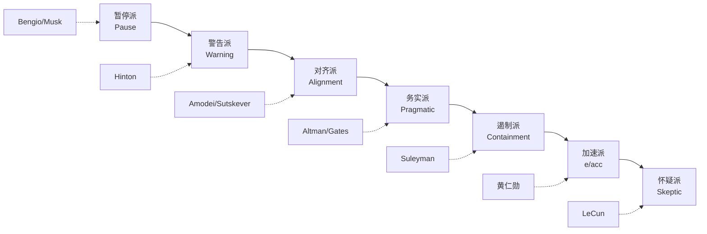

# AI 安全立场矩阵：加速派 vs 对齐派 vs 暂停派

> **一句话概括**: 把 Altman / Musk / Bengio / Hinton / Amodei / LeCun / 黄仁勋 / Sutskever 等 11 位领袖在 AI 安全议题上的立场做成一张矩阵——从 e/acc 加速派到彻底暂停派，本篇呈现谁主张强监管、谁相信技术自治、以及他们各自的利益与哲学根源。

---

## 一、为什么 AI 安全是 2026 年最分裂的话题

在 2023 年 ChatGPT 引爆全球之前，AI 安全还是一个相对小众的学术话题。但 2023 年 3 月 "Pause Giant AI Experiments" 公开信（[[19_业界观点/Yoshua_Bengio/about|Bengio]]、[[19_业界观点/Elon_Musk/about|Musk]] 等签署）和 5 月 [[19_业界观点/Geoffrey_Hinton/about|Hinton]] 从 Google 离职，把"AI 是否威胁人类生存"推上了全球议程。到 2026 年，这场争论不仅没有平息，反而随 Agent、自主武器、Deep Research 的普及愈演愈烈。

分歧的核心不在"AI 安全是否重要"——几乎所有人都同意重要——而在四个子问题：

1. **紧迫性**：风险是迫在眉睫（几年内），还是遥远假设（几十年）？
2. **方法**：靠技术迭代解决，还是靠政策监管？
3. **开源**：开源促进安全（更多眼睛审查），还是加剧风险（可被去安全）？
4. **行动**：继续加速、负责任扩展，还是暂停？

本篇用一张矩阵呈现领袖们在这些问题上的真实立场。

---

## 二、AI 安全立场矩阵（核心表格）

下表把 11 位领袖放入五个阵营。"风险等级"是该人对存在性风险 (existential risk) 的评估。

| 领袖 | 阵营 | 风险评估 | 监管立场 | 开源立场 | 代表行动 |
|------|------|----------|----------|----------|----------|
| [[19_业界观点/Yoshua_Bengio/about|Bengio]] | 暂停派 | 高，迫在眉睫 | 强监管 + 国际条约 | 谨慎 | 签 Pause 信，创 LawZero |
| [[19_业界观点/Geoffrey_Hinton/about|Hinton]] | 谨慎/警告派 | 高 | 国际机构 (类 IAEA) | 谨慎 | 从 Google 离职 |
| [[19_业界观点/Elon_Musk/about|Musk]] | 警告 + 矛盾派 | 高（存在性） | 先发制人监管 | 选择性开源 | 签 Pause 信，起诉 OpenAI |
| [[19_业界观点/Dario_Amodei/about|Amodei]] | 对齐/负责任扩展派 | 中-高 | 行业自律 + 评估 | 反对开源前沿 | RSP / ASL 分级 |
| [[19_业界观点/Ilya_Sutskever/about|Sutskever]] | 对齐派（聚焦） | 中-高 | 聚焦技术对齐 | 中立 | 创 SSI |
| [[19_业界观点/Sam_Altman/about|Altman]] | 务实/渐进派 | 中 | 分级监管 (类 FDA) | 延迟开源 | 参议院听证，呼吁监管 |
| [[19_业界观点/Bill_Gates/about|Gates]] | 务实乐观派 | 中 | 行业自律 + 轻监管 | 中立 | 关注应用而非限制 |
| [[19_业界观点/Mustafa_Suleyman/about|Suleyman]] | 遏制 (containment) 派 | 中-高 | 全球治理 | 谨慎 | 《The Coming Wave》 |
| [[19_业界观点/Jensen_Huang/about|黄仁勋]] | 加速/技术解决派 | 中-低 | 技术迭代优先 | 中立 | "用技术解决技术问题" |
| [[19_业界观点/Yann_LeCun/about|LeCun]] | 风险被高估派 | 低 | 反对暂停 | 坚决支持开源 | 公开反对末日论 |
| [[19_业界观点/Demis_Hassabis/about|Hassabis]] | 科学责任派 | 中 | 负责任部署 | 反对开源前沿 | Gemini 闭源 + 安全评估 |

---

## 三、阵营详解

### 1. 暂停派 (Pause)

**代表**：[[19_业界观点/Yoshua_Bengio/about|Bengio]]、[[19_业界观点/Elon_Musk/about|Musk]]（2023 年时）

**核心主张**：在解决对齐问题之前，应暂停超大型模型的训练。2023 年 3 月的 "Pause Giant AI Experiments" 公开信呼吁暂停 6 个月，签署者包括 Bengio、Musk、Steve Wozniak 等。

**Bengio 的演变**：Bengio 从纯学术研究全面转向 AI 安全治理，2025 年创立 LawZero 基金会，"聚焦于在 AI 系统达到或超越人类能力之前确保安全"。他认为安全研究必须与能力研究同步 Scaling，否则会落后。

**Musk 的矛盾**：Musk 既是 AI 存在性风险最直言不讳的警告者（2014 MIT 演讲称"召唤恶魔"），又是 xAI 的创始人——一边警告风险一边加速研发。这种矛盾使他常被批评为"用安全叙事打击竞争对手"。

> **关键引述**："It is hard to see how you can prevent bad actors from using AI for bad things."（Hinton）——很难阻止恶意行为者利用 AI 做坏事。

### 2. 谨慎/警告派 (Warning)

**代表**：[[19_业界观点/Geoffrey_Hinton/about|Hinton]]

Hinton 的独特之处：他不主张硬性暂停，但认为 AI 能力提升速度超出安全研究跟进速度。2023 年从 Google 离职是为了"自由地谈论风险"而不受商业利益束缚。他呼吁建立类似联合国原子能机构 (IAEA) 的国际 AI 监管机构，并研究"Mortal Computation"（终有一死的计算）从架构层面降低滥用风险。参见 [[19_业界观点/Geoffrey_Hinton/sayings|Hinton 语录]]。

### 3. 对齐/负责任扩展派 (Alignment / RSP)

**代表**：[[19_业界观点/Dario_Amodei/about|Amodei]]、[[19_业界观点/Ilya_Sutskever/about|Sutskever]]

这一派的核心是"继续研发，但用制度和技术保证安全"。

- **Amodei 的 RSP**：Anthropic 推出业界首个 Responsible Scaling Policy，将模型按能力分为 ASL 1-5 级，每个级别有对应的安全评估要求。开创了 Constitutional AI（宪法式 AI）对齐范式——通过一组原则让 AI 自我修正。参见 [[19_业界观点/Dario_Amodei/sayings|Amodei 语录]]。
- **Sutskever 的 SSI**：2024 年离开 OpenAI 创立 Safe Superintelligence Inc.，专注"安全 + 超级智能"——相信超级智能即将到来，全部精力转向如何让它安全。

> **关键引述**："Frontier models carry systemic risk; we need evaluations before deployment."（Amodei）——前沿模型带系统性风险，部署前需要评估。

### 4. 务实/渐进派 (Pragmatic)

**代表**：[[19_业界观点/Sam_Altman/about|Altman]]、[[19_业界观点/Bill_Gates/about|Gates]]

- **Altman** 在 2023 年参议院听证会上主动呼吁监管，提出"类似 FDA 的 AI 机构"和 AI 安全许可制度。他的立场是"渐进式安全"——通过 Red Teaming、RLHF 等技术手段逐步提升安全性，反对暂停。见 [[19_业界观点/Sam_Altman/sayings|Altman 语录]]。
- **Gates** 关注 AI 在全球健康、教育、气候中的应用，认为"风险真实但收益更大，关键是管理而非禁止"。

> **关键引述**："The bigger risk is deploying AI irresponsibly, not deploying it too slowly."（Altman）——更大的风险是不负责任地部署，而不是部署太慢。

### 5. 遏制派 (Containment)

**代表**：[[19_业界观点/Mustafa_Suleyman/about|Mustafa Suleyman]]

[[19_业界观点/Mustafa_Suleyman/about|Suleyman]] (Microsoft AI CEO、DeepMind 联合创始人) 在《The Coming Wave》中提出，AI 治理的核心挑战是"遏制" (containment)——如何在推动技术扩散的同时保持对其风险的控制。他主张全球治理框架，但承认遏立在技术上极难。

### 6. 加速/技术解决派 (e/acc / Technical)

**代表**：[[19_业界观点/Jensen_Huang/about|黄仁勋]]、e/acc 运动

黄仁勋主张"AI 安全应该通过技术迭代解决，不是暂停"。e/acc（effective accelerationism，有效加速主义）运动更激进，认为加速技术进步本身就能解决其带来的问题，反对任何形式的减速。这一派在硅谷有强大影响力，但被 Bengio/Hinton 批评为"不负责任"。

### 7. 风险被高估派 (Skeptic)

**代表**：[[19_业界观点/Yann_LeCun/about|LeCun]]

LeCun 是 AI 末日论最直言不讳的反对者。他认为当前 AI 连猫都不如，讨论"AI 接管世界"为时过早；主张开源是安全的最佳防线（更多眼睛审查）；认为暂停既不现实也会让坏人领先。他多次在 X 上与末日论者公开辩论。见 [[19_业界观点/Yann_LeCun/sayings|LeCun 语录]]。

---

## 四、立场光谱可视化

---

## 五、四个关键子问题的立场对比

### 子问题 1：风险紧迫性

| 紧迫度 | 领袖 |
|--------|------|
| 迫在眉睫（几年） | Bengio、Hinton、Musk |
| 中期（5-15 年） | Amodei、Sutskever、Suleyman |
| 遥远/被高估 | LeCun、黄仁勋 |

### 子问题 2：解决方法

| 方法 | 领袖 |
|------|------|
| 强监管 + 国际条约 | Bengio、Hinton |
| 行业自律 + 技术评估 | Amodei、Altman、Hassabis |
| 技术迭代 + 开源审查 | LeCun、黄仁勋 |
| 全球遏制框架 | Suleyman |

### 子问题 3：开源立场

| 立场 | 领袖 |
|------|------|
| 坚决支持（更安全） | LeCun、Zuckerberg |
| 反对开源前沿（更危险） | Amodei、Hassabis |
| 延迟开源 | Altman |
| 谨慎 | Bengio、Hinton |

> 完整开源 vs 闭源矩阵见 [[19_业界观点/Talks_Synthesis/Open_Source_vs_Closed_Source_AI_2026|开源 vs 闭源之争]]。

### 子问题 4：是否暂停

| 立场 | 领袖 |
|------|------|
| 支持暂停 | Bengio、Musk（2023）、Hinton（倾向） |
| 反对暂停 | LeCun、黄仁勋、Altman、Amodei（主张 RSP 替代暂停）|

---

## 六、利益与哲学根源分析

理解立场分歧，必须看每个人的利益与哲学根源。

| 领袖 | 利益相关 | 哲学根源 |
|------|----------|----------|
| Altman | OpenAI 商业 + 公众形象 | 技术乐观主义 + 务实治理 |
| Amodei | Anthropic 安全使命 | 安全优先 + 制度化对齐 |
| Musk | xAI 竞争 + 政治叙事 | 存在性忧虑 + 反 OpenAI |
| Hinton | 已离职，无商业利益 | 科学家的道德责任 |
| Bengio | 学术 + LawZero 公益 | 公共利益优先 |
| LeCun | Meta 开源战略 | 实证主义 + 反末日论 |
| 黄仁勋 | NVIDIA 卖 GPU | 加速主义 + 技术解决论 |
| Sutskever | SSI 安全使命 | 超级智能必然到来 + 必须安全 |
| Hassabis | Google DeepMind 科学声誉 | 科学责任 + 负责任部署 |
| Suleyman | Microsoft AI 商业 + 治理 | 遏制哲学 |
| Gates | 慈善 + 全球应用 | 务实乐观 + 反垄断经验 |

一个值得注意的规律：**有明确商业利益的人（Altman、Amodei、Musk、黄仁勋）的立场都与其公司战略一致**；而相对中立的学者（Hinton、Bengio）的立场更接近纯粹的技术/伦理判断。这并不意味着商人的立场无效，但需要打折看待。

### 立场与公司战略的对齐性

| 领袖 | 立场 | 公司战略 | 是否对齐 |
|------|------|----------|----------|
| Altman | 渐进监管 | OpenAI 商业化 | 是（监管可设门槛）|
| Amodei | 强安全 | Anthropic 安全品牌 | 是（差异化）|
| 黄仁勋 | 加速 | NVIDIA 卖 GPU | 是 |
| LeCun | 反末日 + 开源 | Meta 开源生态 | 是 |
| Musk | 警告 + 起诉 OpenAI | xAI 竞争 | 是（打压对手）|
| Hassabis | 负责任部署 | Gemini 闭源 | 是（护城河）|

几乎所有商业领袖的安全立场都与其公司战略高度对齐——这是理解其言论的必要滤镜。

理解立场分歧，必须看每个人的利益与哲学根源。

| 领袖 | 利益相关 | 哲学根源 |
|------|----------|----------|
| Altman | OpenAI 商业 + 公众形象 | 技术乐观主义 + 务实治理 |
| Amodei | Anthropic 安全使命 | 安全优先 + 制度化对齐 |
| Musk | xAI 竞争 + 政治叙事 | 存在性忧虑 + 反 OpenAI |
| Hinton | 已离职，无商业利益 | 科学家的道德责任 |
| Bengio | 学术 + LawZero 公益 | 公共利益优先 |
| LeCun | Meta 开源战略 | 实证主义 + 反末日论 |
| 黄仁勋 | NVIDIA 卖 GPU | 加速主义 + 技术解决论 |
| Sutskever | SSI 安全使命 | 超级智能必然到来 + 必须安全 |

一个值得注意的规律：**有明确商业利益的人（Altman、Amodei、Musk、黄仁勋）的立场都与其公司战略一致**；而相对中立的学者（Hinton、Bengio）的立场更接近纯粹的技术/伦理判断。这并不意味着商人的立场无效，但需要打折看待。

---

## 七、合成视角：是否存在共识？

尽管分歧巨大，2026 年仍出现了几个共识点：

| 议题 | 共识 | 仍分歧 |
|------|------|--------|
| AI 风险存在？ | 是 | 程度 |
| 需要监管？ | 是 | 形式（强/弱、国际/国内）|
| 需要安全研究？ | 是 | 是否暂停能力研究 |
| 需要评估前沿模型？ | 是 | 谁来评估（政府/行业/独立）|
| 现在就暂停？ | 否（多数） | Bengio/Hinton 倾向支持 |

最大的共识是：**所有人都同意需要某种形式的安全研究与评估机制**。分歧在于是用硬性法规、行业自律、还是技术迭代来实现。

---

## 八、e/acc 加速主义运动详解

有效加速主义 (effective accelerationism, e/acc) 是 2022-2026 年硅谷兴起的运动，主张加速技术进步本身就能解决其带来的问题。

| 维度 | e/acc 主张 | 反对派（末日论）主张 |
|------|------------|----------------------|
| 技术进步 | 加速，不应减速 | 需暂停或减速 |
| 风险 | 可被技术解决 | 不可控，需预防 |
| 监管 | 反对，扼杀创新 | 必需 |
| 市场 | 自由市场最优 | 市场失灵需干预 |
| AGI | 欢迎尽快到来 | 需先解决对齐 |

e/acc 的代表人物包括部分硅谷投资人（如 Marc Andreessen，《The Techno-Optimist Manifesto》作者）和创业者，与 [[19_业界观点/Jensen_Huang/about|黄仁勋]] 的"用技术解决技术问题"立场共鸣。但它被 Bengio/Hinton 批评为"不负责任的鲁莽"。

**与领袖立场的关联**：e/acc 不是单一领袖的运动，而是一种文化思潮。理解它有助于解释为什么硅谷对 AI 监管有强烈抵触——这不只是商业利益，也是深层的技术信仰。

---

## 九、全球监管格局

AI 安全立场最终要通过监管落地。下表对比主要监管框架：

| 地区 | 法规 | 特点 | 倾向阵营 |
|------|------|------|----------|
| 欧盟 | AI Act (2024) | 按风险分级，最严格 | 暂停/谨慎派 |
| 美国 | 行政令 + 州法 | 分散，偏轻 | 务实派 |
| 中国 | 生成式 AI 管理办法 | 内容合规 + 备案 | 国家主导 |
| 英国 | AI Safety Institute | 评估导向 | 谨慎派 |
| 国际 | G7 广岛进程 / 联合国 | 协调框架 | 务实派 |

监管格局的分裂反映了立场分歧——欧盟倾向 Bengio/Hinton 的谨慎，美国倾向 Altman 的务实，中国走自己的路。

---

## 十、关键事件时间线

AI 安全立场演变与几个关键公共事件紧密相关：

| 时间 | 事件 | 影响 |
|------|------|------|
| 2014.10 | Musk MIT 演讲"召唤恶魔" | 大科技领袖首次公开警告 |
| 2015 | OpenAI 创立（承诺开源） | 安全叙事的高点 |
| 2022.11 | ChatGPT 发布 | 安全担忧进入主流 |
| 2023.03 | Pause Giant AI 公开信 | Bengio/Musk 等呼吁暂停 |
| 2023.05 | Hinton 从 Google 离职 | "AI 之父的离开"轰动全球 |
| 2023.05 | Altman 参议院听证 | 行业领袖主动求监管 |
| 2023.07 | LLaMA 2 商用开源 | LeCun"开源更安全"论获实证 |
| 2023.10 | 拜登 AI 行政令 | 美国首次系统性 AI 立法 |
| 2024.03 | 欧盟 AI Act 通过 | 全球首部综合性 AI 法 |
| 2024.05 | Sutskever 离 OpenAI 创 SSI | 安全与超级智能结合 |
| 2024.10 | 加州 SB 1047 否决 | 强监管受挫 |
| 2025 | Bengio 创立 LawZero | 安全研究制度化 |
| 2026 | Agent / 自主武器扩散 | 安全议题升温 |

---

## 十一、对齐技术路线对比

安全不仅是立场，也是技术。下表对比主要对齐技术路线：

| 技术 | 提出者/代表 | 核心机制 | 局限 |
|------|-------------|----------|------|
| RLHF | OpenAI 早期 | 人类反馈强化学习 | 人类标注有偏见 |
| Constitutional AI | [[19_业界观点/Dario_Amodei/about|Amodei]] / Anthropic | 用"宪法"原则自我修正 | 依赖原则设计 |
| Red Teaming | 全行业 | 主动攻击发现漏洞 | 永远滞后于新攻击 |
| Superalignment | [[19_业界观点/Ilya_Sutskever/about|Sutskever]] / OpenAI | 用 AI 监督 AI | 早期，未验证 |
| Mechanistic Interpretability | Anthropic 等 | 理解模型内部机制 | 工程难度极高 |
| Mortal Computation | [[19_业界观点/Geoffrey_Hinton/about|Hinton]] | 架构层面限制复制 | 探索性，未工程化 |
| RSP / ASL 分级 | [[19_业界观点/Dario_Amodei/about|Amodei]] | 按能力分级管理 | 自律性，无强制力 |

---

## 十二、案例研究：几次标志性安全事件

| 事件 | 时间 | 涉及阵营 | 教训 |
|------|------|----------|------|
| GPT-4 发布前红队 | 2023.03 | OpenAI 闭源 | 红队测试制度化 |
| LLaMA 1 泄露 | 2023.02 | 开源 | 开源需求旺盛但失控 |
| Bing Chat "Sydney" 失控 | 2023.02 | 微软闭源 | 部署前需更长测试 |
| Deepfake 选举干预担忧 | 2024 | 全行业 | 滥用风险真实 |
| SB 1047 辩论 | 2024 | 开源 vs 监管 | 强监管遇阻 |
| OpenAI 董事会危机 | 2023.11 | 闭源内部 | 安全与商业的张力 |
| 欧盟 AI Act 通过 | 2024.03 | 监管派 | 全球首部综合 AI 法 |
| Bengio 创 LawZero | 2025 | 安全派 | 安全研究制度化 |

这些事件塑造了阵营立场——每次事件都被双方用来论证自己的主张。

---

## 十三、AI 安全的代际差异

有趣的是，AI 安全立场与代际/背景相关：

| 群体 | 倾向 | 代表 |
|------|------|------|
| 深度学习元老 | 谨慎/警告 | Hinton / Bengio |
| 深度学习元老（反） | 风险被高估 | LeCun |
| 前沿实验室创始人 | 务实/渐进 | Altman / Amodei |
| 硬件领袖 | 加速 | 黄仁勋 |
| 独立创业者 | 多元 | Musk（警告）/ Karpathy（教育）|
| 学术新生代 | 多元 | 因课题而异 |

元老级人物的立场权重更高——Hinton/Bengio/LeCun 三巨头的分化本身就是 AI 领域最重要的"内部分歧"。

---

## 十四、术语表

| 术语 | 英文 | 简释 |
|------|------|------|
| 对齐 | Alignment | 让 AI 目标与人类利益一致 |
| 存在性风险 | Existential Risk, x-risk | 威胁人类生存的灾难性风险 |
| 负责任扩展政策 | Responsible Scaling Policy, RSP | Anthropic 的按能力分级安全框架 |
| 宪法式 AI | Constitutional AI, CAI | Amodei 提出的用原则自我修正的对齐方法 |
| 人类反馈强化学习 | RLHF | 用人类偏好训练模型对齐 |
| 有效加速主义 | e/acc | 主张加速技术进步的硅谷运动 |
| 红队测试 | Red Teaming | 主动攻击模型以发现漏洞 |
| 超级对齐 | Superalignment | OpenAI 控制比人聪明的系统的研究 |

---

## 十五、延伸阅读：安全经典文献

| 文献 | 作者 | 立场倾向 |
|------|------|----------|
| Superintelligence | Bostrom | 存在性风险 |
| Human Compatible | Stuart Russell | 对齐优先 |
| The Coming Wave | Suleyman | 遏制 |
| Machines of Loving Grace | Amodei | 负责任扩展 |
| The Techno-Optimist Manifesto | Andreessen | e/acc 加速 |
| Pause Giant AI Experiments 公开信 | 多人 | 暂停 |
| Constitutional AI 论文 | Anthropic | 技术对齐 |

---

## 十六、关联导航

- [[19_业界观点/Geoffrey_Hinton/about|Hinton 简介]] · [[19_业界观点/Yoshua_Bengio/about|Bengio 简介]]
- [[19_业界观点/Dario_Amodei/about|Amodei 简介]] · [[19_业界观点/Sam_Altman/about|Altman 简介]]
- [[19_业界观点/Elon_Musk/about|Musk 简介]] · [[19_业界观点/Yann_LeCun/about|LeCun 简介]]
- [[19_业界观点/Ilya_Sutskever/about|Sutskever 简介]] · [[19_业界观点/Mustafa_Suleyman/about|Suleyman 简介]]
- [[19_业界观点/Jensen_Huang/about|黄仁勋 简介]] · [[19_业界观点/Demis_Hassabis/about|Hassabis 简介]]
- [[19_业界观点/Talks_Synthesis/Hinton_vs_LeCun_World_Model_Debate|Hinton vs LeCun 之争]]
- [[19_业界观点/Talks_Synthesis/Open_Source_vs_Closed_Source_AI_2026|开源 vs 闭源之争]]
- [[19_业界观点/Talks_Synthesis/AGI_Timeline_Predictions_Matrix|AGI 时间表预测矩阵]]
- [[19_业界观点/Talks_Synthesis/China_US_AI_Race_Leaders_Views|中美 AI 竞赛领袖观点]]
- [[19_业界观点/index|业界观点首页]]

---

*Last updated: 2026-07-23*
