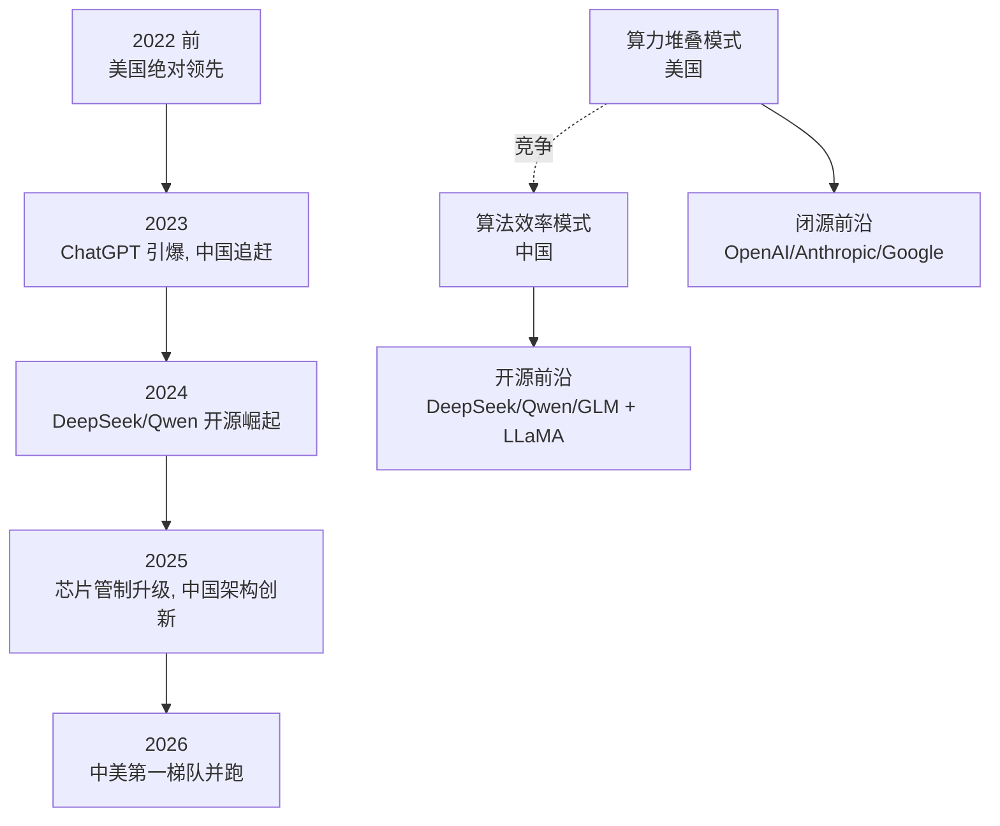

# 中美 AI 竞赛：领袖观点与格局汇总

> **一句话概括**: 2026 年中美 AI 竞赛已从"谁能造最大模型"演变为"谁能在芯片管制下持续创新"——美国领袖（黄仁勋/Altman/Gates）警告封锁适得其反，中国六小龙（DeepSeek/Qwen/GLM/MiniMax/月之暗面）以 MoE 效率和开源证明"创新能绕过算力墙"，本篇汇总双方领袖的核心判断。

---

## 一、2026 年中美 AI 竞赛的新现实

中美 AI 竞赛在 2026 年呈现三个新特征，与 2022-2023 年的叙事截然不同：

1. **中国已进入第一梯队**：DeepSeek、Qwen、GLM、Kimi 在多项基准上逼近甚至局部超越美国闭源前沿模型。"中国只会复制"的旧叙事被打破。
2. **芯片管制倒逼架构创新**：美国对华 H100/H200/B200 出口管制，反而逼迫中国在 MoE（混合专家）、MLA（多头潜在注意力）、GRPO、投机解码、FP8 训练等"效率优先"方向取得突破。[[19_业界观点/Wenfeng_Liang/about|梁文锋]] 的 DeepSeek-V3 用不到 $6M 训练 671B 参数模型，就是这种"倒逼创新"的标志性案例。
3. **开源成为中国的战略武器**：DeepSeek、Qwen、GLM 全面开源，与 Meta LLaMA 形成全球开源双引擎，使美国闭源阵营（OpenAI/Anthropic/Google）的技术护城河被持续侵蚀。

这场竞赛已不再是简单的"谁领先几个季度"，而是两种创新模式的较量——**算力堆叠（美国）vs 算法效率（中国）**。

---

## 二、领袖观点矩阵（核心表格）

下表汇总中美双方关键领袖对竞赛格局的核心判断。

| 领袖 | 国别/机构 | 核心判断 | 政策主张 |
|------|-----------|----------|----------|
| [[19_业界观点/Jensen_Huang/about|黄仁勋]] | 美 / NVIDIA | "中国 AI 进展迅速，全球需合作而非脱钩" | 反对芯片管制 |
| [[19_业界观点/Bill_Gates/about|Bill Gates]] | 美 / 微软 | "技术封锁适得其反，会加速中国自研" | 反对封锁 |
| [[19_业界观点/Sam_Altman/about|Sam Altman]] | 美 / OpenAI | "美国需保持领先，但应允许受控出口" | 中间路线 |
| [[19_业界观点/Sundar_Pichai/about|Sundar Pichai]] | 美 / Google | 务实，强调全球部署与本地化 | 不公开表态 |
| 美国政界 | 美 / 政府 | "AI 芯片出口管制是必要安全措施" | 强化管制 |
| [[19_业界观点/Wenfeng_Liang/about|梁文锋]] | 中 / DeepSeek | "效率比规模更重要，开源推动全行业" | 用开源换影响力 |
| [[19_业界观点/Jinze_Bai/about|白金泽]] | 中 / 阿里 Qwen | "开源 + 多语言服务全球" | 生态扩张 |
| [[19_业界观点/Jie_Tang/about|唐杰]] | 中 / 智谱 GLM | "产学研结合，学术底蕴是中国优势" | 走学术路线 |
| [[19_业界观点/Junjie_Yan/about|闫俊杰]] | 中 / MiniMax | "全模态 + C 端产品是差异化" | 产品导向 |
| [[19_业界观点/Zhilin_Yang/about|杨植麟]] | 中 / 月之暗面 | "长上下文是 AGI 关键" | 技术路线专注 |
| [[19_业界观点/Fei_Fei_Li/about|李飞飞]] | 中美桥梁 | "AI 应以人为本，跨国合作" | 推动全球合作 |
| [[19_业界观点/Andrew_Ng/about|Andrew Ng]] | 中美桥梁 | "中国 AI 落地能力强，曾任职百度" | 反对脱钩 |

---

## 三、美方领袖观点详解

### 黄仁勋：反对脱钩，主张合作

[[19_业界观点/Jensen_Huang/about|黄仁勋]] 是最直言不讳反对芯片管制的美国科技领袖。他的逻辑：

- **市场逻辑**：NVIDIA 一大块营收来自中国，管制直接损害其商业利益。
- **技术逻辑**：他认为封锁只会逼迫中国自研替代品（如华为昇腾），长远看反而培育了竞争对手——"技术封锁适得其反，会加速中国自研"。
- **全球逻辑**：AI 是全球性技术，脱钩会分裂生态，拖慢全人类进步。
- **产业逻辑**：他主张让每个国家都建自己的"AI 工厂"，NVIDIA 作为算力供应商反而受益于全球扩张而非分裂。

他在多次 GTC 演讲中强调"AI 工厂"是每个国家的基础设施，主张让更多国家（包括中国）参与 AI 经济。NVIDIA 为应对管制推出了特供版芯片（如 H20），但黄仁勋公开表示这些降级版本让 NVIDIA 在中国市场份额下滑，间接帮助了华为昇腾崛起。

### Bill Gates：封锁适得其反

[[19_业界观点/Bill_Gates/about|Bill Gates]] 与黄仁勋立场接近。他在 GatesNotes 多篇文章中暗示，对中国的技术封锁不仅难以奏效，还会促使中国加速自主研发，最终削弱美国的技术领导地位。他更关注 AI 在全球健康、教育中的应用，认为应让 AI 惠及发展中国家而非武器化。Gates 的视角更长远——他经历过微软反垄断和科技冷战，深知"封锁催生竞争者"的历史规律。

### Sam Altman：中间路线

[[19_业界观点/Sam_Altman/about|Altman]] 的立场更微妙——他主张美国保持前沿领先，但同时支持"受控出口"和与盟友合作。他在 2023 参议院听证中既强调国家安全，也警告过度管制会削弱竞争力。OpenAI 的策略是不直接进入中国市场，但通过 API 和合作伙伴间接影响，保持"技术领先但不挑衅"的姿态。

### Sundar Pichai：务实低调

[[19_业界观点/Sundar_Pichai/about|Sundar Pichai]] (Google/Alphabet CEO) 在中美议题上保持低调，强调"AI 是人类最深远的技术"。Google 的策略是在中国境外（如印度、东南亚）扩张 Gemini 部署，同时维持开源研究（虽 Gemini 闭源，但 TensorFlow、JAX 等工具开源）。Pichai 避免公开政治表态，专注全球部署与本地化。

### 美国政界：管制派

与科技领袖不同，美国政界主流倾向强化芯片管制，将 AI 芯片视为国家安全议题。这与科技企业的商业利益形成张力，也是 2026 年美国内部政策辩论的核心。管制派的核心论据是：高端 GPU 可被用于军事 AI（如无人机群、网络战），必须限制流向中国。

### 美方阵营立场细分表

| 领袖 | 对华态度 | 核心论据 | 商业利益 |
|------|----------|----------|----------|
| 黄仁勋 | 反对管制 | 封锁催生竞争者 | NVIDIA 中国营收 |
| Bill Gates | 反对管制 | 封锁适得其反 | 微软全球业务 |
| Altman | 中间 | 受控出口 | OpenAI 间接影响 |
| Pichai | 务实低调 | 全球部署 | Google 云扩张 |
| 政界 | 强化管制 | 国家安全 | (政治利益) |

### 黄仁勋：反对脱钩，主张合作

[[19_业界观点/Jensen_Huang/about|黄仁勋]] 是最直言不讳反对芯片管制的美国科技领袖。他的逻辑：

- **市场逻辑**：NVIDIA 一大块营收来自中国，管制直接损害其商业利益。
- **技术逻辑**：他认为封锁只会逼迫中国自研替代品（如华为昇腾），长远看反而培育了竞争对手——"技术封锁适得其反，会加速中国自研"。
- **全球逻辑**：AI 是全球性技术，脱钩会分裂生态，拖慢全人类进步。

他在多次 GTC 演讲中强调"AI 工厂"是每个国家的基础设施，主张让更多国家（包括中国）参与 AI 经济。

### Bill Gates：封锁适得其反

[[19_业界观点/Bill_Gates/about|Bill Gates]] 与黄仁勋立场接近。他在 GatesNotes 多篇文章中暗示，对中国的技术封锁不仅难以奏效，还会促使中国加速自主研发，最终削弱美国的技术领导地位。他更关注 AI 在全球健康、教育中的应用，认为应让 AI 惠及发展中国家而非武器化。

### Sam Altman：中间路线

[[19_业界观点/Sam_Altman/about|Altman]] 的立场更微妙——他主张美国保持前沿领先，但同时支持"受控出口"和与盟友合作。他在 2023 参议院听证中既强调国家安全，也警告过度管制会削弱竞争力。

### 美国政界：管制派

与科技领袖不同，美国政界主流倾向强化芯片管制，将 AI 芯片视为国家安全议题。这与科技企业的商业利益形成张力，也是 2026 年美国内部政策辩论的核心。

---

## 四、中方领袖观点详解

### 梁文锋（DeepSeek）：效率+开源的中国旗帜

[[19_业界观点/Wenfeng_Liang/about|梁文锋]] 是 2026 年全球最受关注的中国 AI 人物。他从量化交易巨头（幻方）转身 AI 创业，用不到 $6M 训练 671B 参数的 DeepSeek-V3，全面开源（MLA、MoE、GRPO、FP8 训练细节公开），证明"效率比规模更重要"。DeepSeek-R1 的开源直接把"测试时计算"能力开源化，被《华尔街日报》《Nature》等媒体视为"动摇美国 AI 优势叙事"的事件。

他的路线代表了一种典型的中国式创新：**在算力受限下，用算法和架构创新绕过算力墙**。

### 白金泽（Qwen）：开源生态扩张

[[19_业界观点/Jinze_Bai/about|白金泽]] 领导阿里云 Qwen 团队，从 Qwen-7B 到 Qwen3-Max（1M 上下文 + 256K 思考预算），以 Apache 2.0 许可 + 119 种语言覆盖，打造全球最活跃的开源大模型生态之一。Qwen 的战略是"用开源为阿里云生态引流"，把中国科技巨头的云能力推向全球。

### 唐杰（智谱 GLM）：产学研典范

[[19_业界观点/Jie_Tang/about|唐杰]] 是清华大学教授、智谱 AI 联合创始人，从 GLM-130B 到 GLM-5.2 (744B MoE)，打造了中国最具学术底蕴的大模型生态。他的路线强调"从论文到产品"的产学研结合，是中国 AI 六小龙中最具学术基因的公司。

### 闫俊杰（MiniMax）：全模态 + C 端

[[19_业界观点/Junjie_Yan/about|闫俊杰]]（前商汤 VP）创立的 MiniMax 用 Lightning Attention 实现百万 Token 上下文，打造覆盖文本/视频/语音/音乐的全模态产品线（Talkie、海螺 AI）。这是中国六小龙中唯一以 C 端产品起家并以全模态为核心战略的公司。

### 杨植麟（月之暗面）：长上下文信仰

[[19_业界观点/Zhilin_Yang/about|杨植麟]] 是 Transformer-XL、XLNet 共同发明人，29 岁创办月之暗面，坚信"长上下文是 AGI 关键"，打造了 Kimi 这款改变中国 AI 格局的产品。他是中国六小龙中最年轻的创始人，也是学术界最具影响力的青年 AI 研究者之一。

### 李飞飞 / Andrew Ng：跨国桥梁

[[19_业界观点/Fei_Fei_Li/about|李飞飞]]（斯坦福 HAI 联合主任、ImageNet 发起人）和 [[19_业界观点/Andrew_Ng/about|Andrew Ng]]（前百度首席科学家 2014-2017）是中美 AI 交流的关键桥梁。李飞飞倡导"以人为本 AI"，主张跨国合作；Andrew Ng 在百度期间证明了中国公司可以与硅谷竞争，他反对脱钩，认为 AI 应是全球公共产品。

---

## 五、中美 AI 能力对比表（2026）

| 维度 | 美国 | 中国 | 评述 |
|------|------|------|------|
| 前沿闭源模型 | GPT-5 / Claude 4.5 / Gemini 2.5 | (闭源较少) | 美国领先，差距小 |
| 开源前沿模型 | LLaMA 4 | DeepSeek-V3 / Qwen3 / GLM-5.2 | 中美并驾齐驱，中国略多 |
| 算力（高端 GPU） | 绝对优势 | 受管制，用国产替代 | 美国领先，但中国在追赶 |
| 算法效率创新 | 测试时计算 | MoE / MLA / GRPO | 中国在效率方向领先 |
| 多语言覆盖 | 英语为主 | 119 语言 (Qwen) | 中国在多语覆盖领先 |
| AI 应用落地 | 企业 SaaS | C 端产品 + 工业 | 各有优势 |
| AI for Science | AlphaFold / AlphaGeometry | (起步阶段) | 美国领先 |
| 芯片自主 | NVIDIA 垄断 | 华为昇腾 / 寒武纪 | 美国领先，中国在突破 |

---

## 六、格局演变可视化

---

## 七、合成视角：三种未来格局

| 格局 | 描述 | 驱动因素 | 概率 |
|------|------|----------|------|
| **中国反超** | 中国在效率+开源路线持续领先，美国闭源护城河被侵蚀 | 芯片管制持续 + 中国开源生态扩张 | 中 |
| **美国保持领先** | 算力优势 + 闭源前沿持续拉开差距 | 下一代 GPU 量产 + 测试时计算突破 | 中 |
| **平行发展** | 中美各自形成生态，标准分裂 | 地缘脱钩深化 | 中-高 |

一个关键变量是**芯片自主**：如果中国能在 2027-2028 年实现高端 AI 芯片国产替代，"算力墙"将不复存在，竞赛格局会被彻底重塑。

---

## 八、交叉议题

### 议题 1：开源 vs 闭源与地缘的交织

中国的开源战略（DeepSeek/Qwen）与 [[19_业界观点/Mark_Zuckerberg/about|Zuckerberg]] 的 LLaMA 开源形成了奇妙的合力——两者都通过开源挑战美国闭源阵营。完整分析见 [[19_业界观点/Talks_Synthesis/Open_Source_vs_Closed_Source_AI_2026|开源 vs 闭源之争]]。

### 议题 2：AI 安全与地缘的交织

[[19_业界观点/Geoffrey_Hinton/about|Hinton]] 呼吁的国际 AI 监管机构（类 IAEA）若成立，必然涉及中美协调——而地缘紧张使这种协调极难。安全议题与地缘议题深度纠缠，见 [[19_业界观点/Talks_Synthesis/AI_Safety_Stance_Matrix|AI 安全立场矩阵]]。

### 议题 3：AGI 时间表与竞赛节奏

竞赛节奏取决于双方对 AGI 何时到来的判断——若很近，军备竞赛会加速；若远，可能缓和。见 [[19_业界观点/Talks_Synthesis/AGI_Timeline_Predictions_Matrix|AGI 时间表预测矩阵]]。

---

## 九、六小龙深度对比

中国 AI 六小龙（智谱/MiniMax/月之暗面/DeepSeek/百川/阶跃）是竞赛的核心力量，下表对比其技术路线与领袖风格：

| 公司 | 领袖 | 技术路线 | 差异化 | 开放程度 |
|------|------|----------|--------|----------|
| DeepSeek | [[19_业界观点/Wenfeng_Liang/about|梁文锋]] | MoE + MLA + GRPO 效率 | 极致效率 + 全开源 | 完全开源 |
| 阿里 Qwen | [[19_业界观点/Jinze_Bai/about|白金泽]] | 全尺寸 + 多语言 | 119 语言生态 | Apache 2.0 |
| 智谱 GLM | [[19_业界观点/Jie_Tang/about|唐杰]] | GLM 架构 + 产学研 | 学术底蕴 | 部分开源 |
| MiniMax | [[19_业界观点/Junjie_Yan/about|闫俊杰]] | Lightning Attention + 全模态 | C 端产品 (Talkie/海螺) | 部分开源 |
| 月之暗面 | [[19_业界观点/Zhilin_Yang/about|杨植麟]] | 长上下文 (Kimi) | 超长上下文信仰 | 部分闭源 |
| 百川 | 王小川 | 通用 LLM | 搜索基因 | 部分开源 |

六小龙的共同策略是**用开源/效率对抗美国算力优势**，但各自切入点不同——DeepSeek 走效率极致，Qwen 走多语言生态，GLM 走学术路线，MiniMax 走全模态产品，月之暗面走长上下文，百川走搜索融合。

---

## 十、关键技术指标对比（2026 基准）

| 指标 | 美国闭源前沿 | 中国开源前沿 | 评述 |
|------|--------------|--------------|------|
| 综合推理 (MMLU-Pro) | 领先 | 逼近 (3-6 月) | 美国略胜 |
| 数学 (AIME) | 领先 | 逼近 (DeepSeek-R1) | 接近持平 |
| 代码 (SWE-Bench) | 领先 | 逼近 | 美国略胜 |
| 中文理解 | 一般 | 领先 | 中国优势 |
| 多语言 | 英语为主 | 119 语言 (Qwen) | 中国优势 |
| 长上下文 | 1-2M (Gemini) | 1M+ (Kimi/Qwen) | 持平 |
| 推理效率 | 测试时计算 | MLA/MoE 高效 | 中国优势 |
| 训练成本 | 高（算力充足） | 低（效率优化） | 中国优势 |

---

## 十一、常见误区与澄清

| 误区 | 澄清 |
|------|------|
| "中国只会复制，不会创新" | 错。DeepSeek MLA/GRPO 是原创架构创新 |
| "芯片管制能锁死中国 AI" | 争议。倒逼创新效应显著，长期可能培育竞争对手 |
| "中国 AI 全面超越美国" | 夸大。美国在算力、AI for Science 仍领先 |
| "开源是中国独有战略" | 错。Meta LLaMA 也是开源主力 |
| "中美 AI 完全脱钩" | 夸大。学术交流、开源社区仍高度互通 |

---

## 十二、监管与治理维度

中美 AI 竞赛不仅是技术竞赛，也是治理模式竞赛：

| 维度 | 美国模式 | 中国模式 |
|------|----------|----------|
| 监管风格 | 部门分散 + 行业自律 | 集中统一 + 内容审查 |
| 立法进程 | 慢（行政令 + 州法） | 快（中央统一部署）|
| 重点关切 | 国家安全 + 反垄断 | 社会稳定 + 内容合规 |
| 对外输出 | 与盟友协调（G7） | 一带一路 + 全球南方 |
| 开源态度 | 企业自决 | 鼓励开源换影响力 |
| 数据治理 | 隐私优先 | 数据要素市场化 |

两种治理模式都在向全球输出——美国通过 G7 和 OECD，中国通过一带一路和金砖机制。谁能吸引更多国家采用自己的治理框架，谁就在 AI 时代掌握更大话语权。

---

## 十三、教育与人才维度

人才是 AI 竞赛的根基。下表对比双方教育与人才生态：

| 维度 | 美国 | 中国 |
|------|------|------|
| 顶尖大学 | 斯坦福/MIT/伯克利 | 清华/北大/上海交大 |
| 顶尖华人学者 | 大量（李飞飞/吴恩达等） | 部分回流 |
| 人才流向 | 吸引全球（H1B） | 海归潮 + 本土培养 |
| AI 教育普及 | [[19_业界观点/Andrew_Ng/about|Ng]]/[[19_业界观点/Andrej_Karpathy/about|Karpathy]] 等在线课程 | 高校 + 企业内训 |
| 科研产出 | 论文质量领先 | 论文数量领先，质量追赶 |
| 工程人才储备 | 相对短缺 | 庞大，工程能力强 |

一个关键变量是**华人学者的流向**——大量顶尖 AI 研究者是华人（如李飞飞、吴恩达、孙韬等），他们在中美之间的流动深刻影响双方实力。地缘紧张若导致人才流动受阻，对双方都是损失。

---

## 十四、术语表

| 术语 | 英文 | 简释 |
|------|------|------|
| 混合专家 | Mixture of Experts, MoE | 只激活部分参数的稀疏架构 |
| 多头潜在注意力 | Multi-head Latent Attention, MLA | DeepSeek 的效率优化注意力 |
| 群组相对策略优化 | Group Relative Policy Optimization, GRPO | DeepSeek 的强化学习方法 |
| FP8 训练 | FP8 Training | 用 8 位浮点降低训练成本 |
| 投机解码 | Speculative Decoding | 用小模型加速大模型推理 |
| 测试时计算 | Test-Time Compute | 推理时扩展计算 |
| 中国 AI 六小龙 | Chinese AI Six Dragons | 智谱/MiniMax/月之暗面/DeepSeek/百川/阶跃 |
| 芯片出口管制 | Chip Export Control | 美国对华高端 GPU 出口限制 |

---

## 十五、产业生态对比

中美 AI 产业生态结构差异显著：

| 层级 | 美国 | 中国 |
|------|------|------|
| 芯片 | NVIDIA / AMD / Google TPU | 华为昇腾 / 寒武纪 / 海光 |
| 云算力 | AWS / Azure / GCP | 阿里云 / 腾讯云 / 华为云 |
| 基础模型 | OpenAI / Anthropic / Google | DeepSeek / Qwen / GLM / Kimi |
| 应用层 | SaaS (Copilot/Notion AI) | C 端 (豆包/Kimi/通义) |
| 数据 | 商业数据为主 | 数据要素市场化 |
| 资本 | VC + 上市 | 政府 + 互联网巨头 |
| 开发者生态 | Hugging Face / GitHub | ModelScope / Gitee |

美国的生态更"市场化+开放"，中国的生态更"政府引导+巨头主导"。两种模式各有优劣——美国模式创新活跃但风险高，中国模式执行快但同质化。

---

## 十六、未来 3 年关键变量

| 变量 | 若向美国倾斜 | 若向中国倾斜 |
|------|--------------|--------------|
| 芯片管制 | 升级，锁死中国 | 放松，中国获得先进 GPU |
| 国产芯片 | 进展缓慢 | 突破，替代 NVIDIA |
| 开源领导权 | LLaMA 主导 | DeepSeek/Qwen 主导 |
| AGI 突破 | 美国先实现 | 并跑或中国先 |
| 地缘关系 | 脱钩深化 | 缓和合作 |
| 监管 | 各自为政 | 国际协调 |

**最关键的单一变量是芯片自主**——如果中国在 2027-2028 年实现高端 AI 芯片国产替代，"算力墙"将不复存在，竞赛格局会被彻底重塑。

---

## 十七、延伸阅读：中美 AI 文献与报告

| 文献/报告 | 来源 | 焦点 |
|-----------|------|------|
| 斯坦福 AI Index | HAI | 全球 AI 年度报告 |
| 中国人工智能学会报告 | CAAI | 中国 AI 进展 |
| DeepSeek-V3 技术报告 | DeepSeek | MLA/MoE/GRPO |
| Qwen 技术报告 | 阿里 | 多语言 MoE |
| 美国 AI 行政令 | 白宫 | 国家安全视角 |
| 生成式 AI 管理办法 | 中国网信办 | 内容合规 |

---

## 十八、关联导航

- [[19_业界观点/Wenfeng_Liang/about|梁文锋 简介]] · [[19_业界观点/Jinze_Bai/about|白金泽 简介]]
- [[19_业界观点/Jie_Tang/about|唐杰 简介]] · [[19_业界观点/Junjie_Yan/about|闫俊杰 简介]]
- [[19_业界观点/Zhilin_Yang/about|杨植麟 简介]] · [[19_业界观点/Fei_Fei_Li/about|李飞飞 简介]]
- [[19_业界观点/Andrew_Ng/about|Andrew Ng 简介]] · [[19_业界观点/Jensen_Huang/about|黄仁勋 简介]]
- [[19_业界观点/Bill_Gates/about|Bill Gates 简介]] · [[19_业界观点/Sam_Altman/about|Altman 简介]]
- [[19_业界观点/Talks_Synthesis/Open_Source_vs_Closed_Source_AI_2026|开源 vs 闭源之争]]
- [[19_业界观点/Talks_Synthesis/AI_Safety_Stance_Matrix|AI 安全立场矩阵]]
- [[19_业界观点/Talks_Synthesis/AGI_Timeline_Predictions_Matrix|AGI 时间表预测矩阵]]
- [[19_业界观点/Talks_Synthesis/Hinton_vs_LeCun_World_Model_Debate|Hinton vs LeCun 之争]]
- [[19_业界观点/index|业界观点首页]]

---

*Last updated: 2026-07-23*
