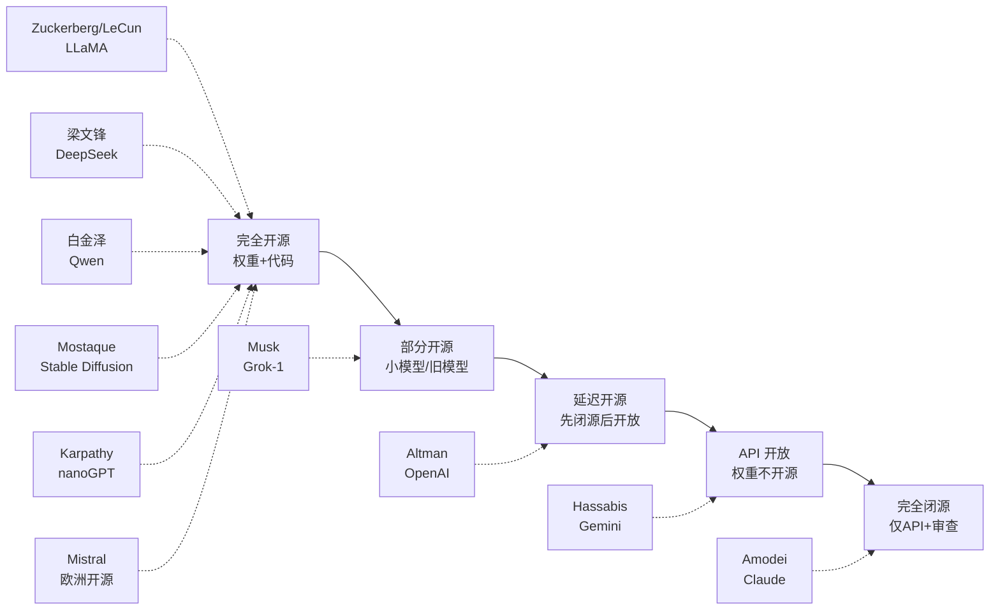

# 开源 vs 闭源 AI：2026 路线之争与立场矩阵

> 中文简称：开源 vs 闭源 AI：2026 路线之争与立场矩阵

> **一句话概括**: 2026 年 AI 行业最深刻的分裂——开源阵营 (Meta LLaMA / DeepSeek / Qwen / Mistral) 以权重开放推动生态民主化，闭源阵营 (OpenAI / Anthropic / Google) 以安全可控为由管制前沿模型，本篇用一张立场矩阵呈现十位领袖的真实态度与商业逻辑，并解析"去安全微调"、延迟开源等地缘与技术交织的新现象。

---

## 一、为什么"开不开源"是 2026 年的核心问题

在传统软件时代，开源 vs 闭源是商业模式之争（Linux vs Windows、MySQL vs Oracle）。但在大模型时代，这个问题被赋予了三层全新含义：

1. **安全含义**：开源权重意味着任何人（包括恶意行为者）都可以移除安全微调 (safety fine-tuning)，使模型"越狱"。这是闭源阵营（OpenAI、Anthropic）拒绝开源前沿模型的核心论据。
2. **地缘含义**：开源模型让无法获得最先进芯片的国家和公司也能获得接近前沿的能力。DeepSeek-V3 的开源被视为对芯片管制的回应。
3. **垄断含义**：开源是反垄断的天然武器。Meta 用 LLaMA 开源挑战 OpenAI/Google 的双寡头，[[19_业界观点/Mark_Zuckerberg/about|Zuckerberg]] 称之为"开源让 Meta 成为行业标准"。

因此，"开不开源"不再只是技术偏好，而是 2026 年 AI 治理、地缘政治和商业模式三重博弈的交汇点。

---

## 二、领袖立场矩阵（核心表格）

下表是十位关键领袖在开源/闭源议题上的完整立场矩阵。"开放程度"分四档：**权重完全开源** / **延迟开源**（先闭源后开放旧版）/ **API 开放** / **完全闭源**。

| 领袖 | 机构 | 旗舰模型 | 开放程度 | 公开理由 | 商业/战略动机 |
|------|------|----------|----------|----------|---------------|
| [[19_业界观点/Mark_Zuckerberg/about|Zuckerberg]] | Meta | LLaMA 2/3/4 | 权重完全开源 | "开放是构建安全 AI 的最佳方式" | 用开源建生态，对抗 OpenAI/Google 垄断 |
| [[19_业界观点/Yann_LeCun/about|LeCun]] | Meta FAIR | LLaMA / JEPA | 权重完全开源 | "开源是安全的，更多眼睛发现漏洞" | 学术信念 + 实证主义 |
| [[19_业界观点/Wenfeng_Liang/about|梁文锋]] | DeepSeek | DeepSeek-V3/R1 | 权重完全开源 | "效率比规模更重要，开源推动全行业" | 用开源换影响力，绕开芯片管制 |
| [[19_业界观点/Jinze_Bai/about|白金泽]] | 阿里云 | Qwen 系列 | 权重完全开源 (Apache 2.0) | "开源 + 119 种语言覆盖服务全球" | 云生态引流，ModelScope 平台 |
| [[19_业界观点/Emad_Mostaque/about|Mostaque]] | Stability AI | Stable Diffusion | 权重完全开源 | "去中心化生成 AI，人人可用" | 用开源撼动闭源图像生成垄断 |
| [[19_业界观点/Andrej_Karpathy/about|Karpathy]] | (独立) | nanoGPT / llm.c | 代码+权重开源 | "开源加速创新，降低准入门槛" | 教育信念，传播 AI 知识 |
| [[19_业界观点/Sam_Altman/about|Altman]] | OpenAI | GPT-4o / o3 | 延迟开源 + API 开放 | "前沿模型需谨慎管理" | 商业护城河 + 安全叙事 |
| [[19_业界观点/Dario_Amodei/about|Amodei]] | Anthropic | Claude 4 | 完全闭源 + API | "闭源是为了安全可控地释放能力" | 安全使命 + RSP 框架 |
| [[19_业界观点/Demis_Hassabis/about|Hassabis]] | Google DeepMind | Gemini 2.5 | 完全闭源 + API | "前沿研究需负责任部署" | Google 云商业护城河 |
| [[19_业界观点/Elon_Musk/about|Musk]] | xAI | Grok | 部分开源 (Grok-1 开源) | "OpenAI 背叛了开源初衷" | 差异化竞争 + 政治叙事 |

> 注：Musk 的立场最矛盾——他是 OpenAI 联合创始人（2015 最初承诺开源），2018 因方向分歧离开，2024 起诉 OpenAI"背叛开源使命"，但同时 xAI 的 Grok-2/3 又走向闭源 API，被外界批评为"选择性开源"。

补充：开源阵营还有一支重要力量——Mistral（法国），由前 DeepMind/Meta 研究者创立，坚持 Apache 2.0 开源，是欧洲开源 AI 的旗帜。[[19_业界观点/Richard_Socher/about|Richard Socher]] 的 You.com 则走"对话式搜索 + LLM"的产品路线，模型策略偏务实。

---

## 三、开源阵营：论点与代表人物

### 核心论点

**1. 安全论（开源更安全）**

[[19_业界观点/Yann_LeCun/about|LeCun]] 反复论证：开源让更多研究者审查模型，发现偏见、后门与漏洞，比闭源的"黑箱"更安全。他把闭源前沿实验室的"安全叙事"斥为"伪装成责任的商业护城河"。

> **关键引述**："开源是安全的，因为更多眼睛可以发现漏洞。"（LeCun）

**2. 创新论（开源加速创新）**

[[19_业界观点/Andrej_Karpathy/about|Karpathy]] 认为，LLaMA 开源直接催生了 Alpaca、Vicuna、Mistral 等整个开源生态，把最先进的能力"民主化"到每个研究者和创业公司，降低了准入门槛。[[19_业界观点/Emad_Mostaque/about|Mostaque]] 的 Stable Diffusion 让图像生成从闭源 API（如 Midjourney、DALL·E）走向人人可本地运行的开源工具，催生了整个 AIGC 创业潮。

**3. 反垄断论（开源打破寡头）**

[[19_业界观点/Mark_Zuckerberg/about|Zuckerberg]] 的战略最务实——Meta 在 LLM 领域无法直接靠 API 收费与 OpenAI 竞争，但通过开源 LLaMA，Meta 可以让整个行业依赖 Meta 的底座模型，从而确立生态主导权（类似 Google 用 Android 开源对抗 iOS）。他宣布 Meta 将拥有超过 60 万块 GPU 的算力，并把成果开源。

**4. 效率/地缘论（开源绕过封锁）**

[[19_业界观点/Wenfeng_Liang/about|梁文锋]] 的 DeepSeek 是这条路线的极致代表——用不到 $6M 训练 671B 参数的 DeepSeek-V3，证明"效率比规模更重要"，并用全面开源（MLA、MoE、GRPO、FP8 训练细节全部公开）震撼全球。[[19_业界观点/Jinze_Bai/about|白金泽]] 领导的 Qwen 则以 Apache 2.0 许可 + 119 种语言覆盖，成为中国科技巨头开源 AI 的标杆。两人的开源都带有"绕开芯片管制、用创新换影响力"的地缘色彩。

**5. 学术/教育论（开源传播知识）**

[[19_业界观点/Andrej_Karpathy/about|Karpathy]] 的 nanoGPT（约 300 行的 GPT 实现）和 llm.c（纯 C/CUDA 训练代码）是教育性开源的代表，让大众能理解大模型内部原理。[[19_业界观点/3Blue1Brown/about|3Blue1Brown]] 和 [[19_业界观点/Josh_Starmer/about|Josh Starmer]] 虽不开源模型，但用可视化教学内容呼应了开源精神。

> 关联阅读：中美 AI 竞赛的完整视角见 [[19_业界观点/Talks_Synthesis/China_US_AI_Race_Leaders_Views|中美 AI 竞赛领袖观点]]。

---

## 四、闭源阵营：论点与代表人物

### 核心论点

**1. 安全可控论**

[[19_业界观点/Dario_Amodei/about|Amodei]] 的论点最系统化。Anthropic 推出业界首个 Responsible Scaling Policy (RSP)，将模型按能力分为 ASL 1-5 级，每个级别有对应的安全评估要求和部署限制。他认为开源权重等于让任何人都能移除安全微调，这在模型能力达到"生物武器辅助、网络攻击自动化"级别时是不可接受的风险。

> **关键引述**："Anthropic 选择闭源是为了安全可控地释放能力。"（Amodei）

**2. 谨慎管理论**

[[19_业界观点/Sam_Altman/about|Altman]] 采取务实中间路线：GPT-4 级别的模型不应完全开源，但 OpenAI 释放了部分较小模型的权重（如 2025 年的部分开放），被视为"延迟开源"策略——先闭源保护商业利益，待模型不再前沿后再开放旧版本。这与 OpenAI 2015 年"完全开源"的初衷形成鲜明对比，也是 Musk 起诉 OpenAI 的核心依据。

**3. 负责任部署论**

[[19_业界观点/Demis_Hassabis/about|Hassabis]] 的 Google DeepMind 走的是"科学负责任"路线——Gemini 系列完全闭源，仅通过 API 和 Google 云提供服务。Google 的动机是商业护城河，但叙事是"前沿研究需要负责任地部署"。

**4. 工程投入回报论**

闭源阵营一个不常明说但真实的动机是：训练前沿模型需要数十亿美元投入（算力 + 数据 + 人才），如果立即开源，竞争对手可以零成本复制，投资回报受损。这是 OpenAI/Anthropic/Google 保持闭源的根本商业逻辑。

---

## 五、立场光谱图

---

## 六、开源 vs 闭源辩论经典回合

下表整理 2023-2026 年间几场标志性公开辩论，帮助理解双方论据的交锋：

| 时间 | 辩论 | 开源方论据 | 闭源方论据 |
|------|------|------------|------------|
| 2023.02 | LLaMA 1 泄露事件 | 泄露证明需求旺盛，应正式开源 | 泄露证明开源失控，加剧风险 |
| 2023.07 | LLaMA 2 商用开源 | LeCun："开源是安全最佳防线" | Amodei："开源权重可被去安全" |
| 2024.03 | SB 1047 加州法案辩论 | LeCun 反对，称扼杀开源 | Bengio 支持，称需护栏 |
| 2024.06 | Musk 起诉 OpenAI | "OpenAI 背叛开源使命" | OpenAI："开源不再适用前沿" |
| 2025.01 | DeepSeek-V3 开源震撼 | 梁文锋："效率+开源推动全行业" | 部分美方："开源威胁国家安全" |
| 2025.03 | DeepSeek-R1 推理开源 | 测试时计算能力被开源化 | 闭源推理护城河被侵蚀 |
| 2026 | 开源逼近闭源共识 | "领先差距仅 3-6 月" | "但前沿仍在闭源" |

这些辩论的核心张力始终是：**安全叙事 vs 商业护城河**——两者难以分割。

---

## 七、不同角色的最优策略

| 角色 | 最优开源/闭源策略 | 理由 |
|------|-------------------|------|
| 科技巨头（有云业务） | 部分开源（旧模型）+ 闭源前沿 | 兼顾生态与护城河（Google/微软/阿里）|
| 纯模型公司 | 倾向闭源 API | 保护核心资产（OpenAI/Anthropic）|
| 平台公司（无直接 LLM 收入） | 完全开源 | 用生态换主导（Meta）|
| 学术/公益机构 | 完全开源 | 推动知识民主化（Stability/Karpathy）|
| 受管制国家公司 | 完全开源 | 用影响力绕过封锁（DeepSeek）|
| 创业公司 | 视定位而定 | 差异化竞争（Mistral/Qwen 子项目）|

---

## 八、技术新现象：去安全微调与"越狱"军备竞赛

开源 vs 闭源之争在 2026 年催生了一个新的技术现象：**去安全微调 (safety fine-tuning removal)**。

| 现象 | 描述 | 影响 |
|------|------|------|
| 去安全微调 | 开源权重可被任何人微调移除 RLHF 安全约束 | 闭源阵营拒绝开源的核心论据 |
| 越狱攻击 | 即使闭源 API 也被 prompt 工程绕过安全 | 闭源也并非绝对安全 |
| 对抗性微调 | 用少量有害数据快速破坏对齐 | 开源模型尤其脆弱 |
| 红队测试 | 主动攻击模型发现漏洞 | 闭源阵营部署前的标准流程 |

这个现象使争论更复杂——**开源确实让去安全更容易，但闭源也无法完全防止越狱**。LeCun 的反驳是：闭源黑箱让外部研究者无法审查偏见和漏洞，反而更危险；真正的安全应靠架构层面对齐，而非依赖可被移除的微调层。

> 关联阅读：完整安全立场见 [[19_业界观点/Talks_Synthesis/AI_Safety_Stance_Matrix|AI 安全立场矩阵]]。

---

## 七、2026 年态势：开源逼近闭源

2026 年最重要的趋势是**开源模型能力逼近闭源前沿**。下表对比 2026 年代表性模型：

| 类型 | 代表模型 | 参数规模 | 特点 | 开放程度 |
|------|----------|----------|------|----------|
| 闭源前沿 | GPT-5 / Claude 4.5 / Gemini 2.5 Pro | 未公开 | 综合能力最强 | API |
| 开源前沿 | LLaMA 4 | 400B+ MoE | 多模态、长上下文 | 权重完全开源 |
| 开源效率 | DeepSeek-V3 / R1 | 671B MoE (37B 激活) | MLA + GRPO，推理强 | 权重完全开源 |
| 开源多语 | Qwen3-Max | MoE + 1M 上下文 | 119 语言，Hybrid Thinking | Apache 2.0 |
| 开源欧洲 | Mistral Large | 稠密 + MoE | Apache 2.0，欧洲旗帜 | 权重开源 |
| 开源多模态 | GLM-5.2 (智谱) | 744B MoE | 全模态 | 部分开源 |

闭源阵营的应对是**"延迟开源 + 测试时计算"**：不再靠单纯扩大参数取胜，而是靠 o1/o3/R1 风格的推理时扩展计算拉开差距。但 DeepSeek-R1 的开源直接把"测试时计算"能力也开源化了，使闭源阵营的技术护城河被进一步削弱。

一个关键问题：**开源模型与闭源前沿的"领先差距"还有几个月？** 2024 年这个差距被认为有 6-12 个月，2026 年共识缩小到 3-6 个月，部分能力（如推理、多语言）已被开源追平甚至反超。

---

## 八、许可证矩阵

开源不等于免费商用。不同许可证对商业使用有不同限制。

| 许可证 | 代表模型 | 商用限制 | 兼容性 |
|--------|----------|----------|--------|
| Apache 2.0 | Qwen、Mistral | 无限制 | 最宽松 |
| LLaMA 许可 | LLaMA 2/3/4 | 有用户量门槛（>7 亿需授权） | 较宽松 |
| MIT | nanoGPT 等小项目 | 无限制 | 宽松 |
| 定制许可 | GLM（部分） | 视版本而定 | 不一 |
| 闭源 API | GPT/Claude/Gemini | 按 token 计费 | 不可自部署 |

许可证差异是企业选型的关键因素——Apache 2.0 最受企业欢迎，因为它明确允许商用且无用户量限制。

---

## 九、合成视角：三种未来走向

| 走向 | 描述 | 概率判断 | 支持者 |
|------|------|----------|--------|
| **开源主导** | 开源模型持续逼近闭源，闭源前沿仅剩"几个月领先" | 高 | LeCun / Zuckerberg / 梁文锋 |
| **闭源锁定** | 前沿能力因安全/管制被少数实验室垄断 | 中 | Amodei / Hassabis |
| **分级监管** | 政府按能力等级强制要求开源/闭源策略 | 中 | Altman（呼吁类似 FDA 的 AI 机构）|

> 关联阅读：AGI 何时到来会显著影响这场争论——若 AGI 在 2-5 年内实现，闭源锁定可能性上升；若更远，开源主导更可能。见 [[19_业界观点/Talks_Synthesis/AGI_Timeline_Predictions_Matrix|AGI 时间表预测矩阵]]。

---

## 十、交叉人物速查

| 人物 | 与本主题的关系 |
|------|----------------|
| [[19_业界观点/Mark_Zuckerberg/about|Zuckerberg]] | 开源战略总指挥，LLaMA 系列发布者 |
| [[19_业界观点/Yann_LeCun/about|LeCun]] | 开源安全论的理论旗手 |
| [[19_业界观点/Wenfeng_Liang/about|梁文锋]] | 用效率+开源撼动全球的中国代表 |
| [[19_业界观点/Jinze_Bai/about|白金泽]] | Qwen 开源生态负责人 |
| [[19_业界观点/Jie_Tang/about|唐杰]] | GLM 部分开源推动者 |
| [[19_业界观点/Emad_Mostaque/about|Mostaque]] | Stable Diffusion 开源推动者 |
| [[19_业界观点/Andrej_Karpathy/about|Karpathy]] | 开源教育布道者（nanoGPT） |
| [[19_业界观点/Sam_Altman/about|Altman]] | "延迟开源"策略代表 |
| [[19_业界观点/Dario_Amodei/about|Amodei]] | 闭源安全论代表 |
| [[19_业界观点/Demis_Hassabis/about|Hassabis]] | 科学负责任部署代表 |
| [[19_业界观点/Elon_Musk/about|Musk]] | 选择性开源的矛盾人物 |
| [[19_业界观点/Richard_Socher/about|Socher]] | 搜索+LLM 务实派 |

---

## 十一、常见误区与澄清

| 误区 | 澄清 |
|------|------|
| "开源 = 没有商业价值" | 错。Meta、阿里通过开源建立生态主导，云收入反而增长。 |
| "闭源 = 更安全" | 争议。LeCun 认为闭源黑箱更危险；Amodei 认为开源权重可被去安全。 |
| "开源阵营都无私" | 错。开源常是战略选择，背后有明确商业/地缘动机。 |
| "Musk 是开源派" | 部分错。Grok-1 开源，但 Grok-2/3 走向闭源 API。 |
| "中国模型都开源" | 大部分是（DeepSeek/Qwen/GLM），但也有闭源（部分通义 Max、Kimi 等）。 |
| "开源模型永远落后闭源" | 2026 年差距已缩小到 3-6 个月，部分能力反超。 |
| "Apache 2.0 和 LLaMA 许可一样" | 不同。Apache 2.0 无用户量限制，LLaMA 有 7 亿用户门槛。 |

---

## 十二、地区视角差异

开源 vs 闭源之争在不同地区有不同色彩：

| 地区 | 主流倾向 | 代表 | 原因 |
|------|----------|------|------|
| 美国 | 闭源 + 延迟开源 | OpenAI/Anthropic/Google | 商业护城河 + 安全叙事 |
| 中国 | 全面开源 | DeepSeek/Qwen/GLM | 绕过芯片管制 + 影响力 |
| 欧洲 | 开源 + 强监管 | Mistral + EU AI Act | 反垄断 + 主权 |
| 中东 | 投资 + 部署 | 沙特/阿联酋 | 财富主权基金布局 |
| 全球南方 | 开源受益方 | 印度/非洲创业公司 | 低成本获取前沿能力 |

欧洲的独特角色值得注意——Mistral 是欧洲开源旗帜，同时欧盟 AI Act 是全球最严格的 AI 法规，体现了"开源 + 强监管"的欧洲式平衡。

---

## 十三、企业采用决策框架

企业选型时如何在开源/闭源间决策：

| 考量 | 选开源 | 选闭源 |
|------|--------|--------|
| 数据隐私 | 本地部署，数据不出域 | 依赖供应商合规 |
| 成本 | 一次性部署成本 | 按 token 计费 |
| 定制化 | 可微调/去安全 | 受限 |
| 能力前沿 | 略落后（3-6 月）| 最强 |
| 合规 | 需自行证明安全 | 供应商提供评估 |
| 技术团队 | 需 MLOps 能力 | API 即用 |
| 供应商风险 | 无（自主可控）| 有（供应商锁定）|

**决策建议**：数据敏感、有 MLOps 团队、追求自主可控的企业选开源；追求最强能力、缺乏工程团队的企业选闭源 API。

---

## 十四、开源生态全景图

2026 年全球开源 LLM 生态的主要力量：

| 层级 | 代表 | 角色 |
|------|------|------|
| 底座模型 | LLaMA / Qwen / DeepSeek / Mistral / GLM | 提供基础能力 |
| 微调变体 | Alpaca / Vicuna / CodeLlama | 任务特化 |
| 工具链 | vLLM / TGI / Ollama / LM Studio | 推理与部署 |
| 训练框架 | PyTorch / DeepSpeed / Megatron | 训练基础设施 |
| 应用层 | LangChain / LlamaIndex / Dify | 应用开发 |
| 评测 | Hugging Face / OpenCompass | 基准测试 |

这张生态图的繁荣，正是 LeCun/Zuckerberg 力推开源的核心论据——开源不仅是模型，而是整个价值链的民主化。

---

## 十五、术语表

| 术语 | 英文 | 简释 |
|------|------|------|
| 权重 | Weights | 神经网络参数，开源权重 = 可本地运行模型 |
| 前沿模型 | Frontier Model | 当前最先进能力的模型 |
| 延迟开源 | Delayed Open Source | 先闭源，待模型旧了再开放 |
| 负责任扩展政策 | Responsible Scaling Policy, RSP | Anthropic 提出的按能力分级的安全框架 |
| 混合专家 | Mixture of Experts, MoE | 只激活部分参数的稀疏架构，DeepSeek/Qwen 主力 |
| 多头潜在注意力 | Multi-head Latent Attention, MLA | DeepSeek 的效率优化注意力机制 |
| 测试时计算 | Test-Time Compute | 推理时扩展计算，o1/R1 路线 |
| 去安全微调 | Safety Fine-tuning Removal | 移除 RLHF 安全约束的微调 |
| 红队测试 | Red Teaming | 主动攻击模型以发现漏洞 |
| Apache 2.0 | Apache License 2.0 | 最宽松的开源许可证之一，允许商用 |

---

## 十六、开源 vs 闭源的未来推演

| 年份 | 开源态势 | 闭源态势 | 关系 |
|------|----------|----------|------|
| 2024 | LLaMA 3 / DeepSeek 崛起 | GPT-4o 领先 | 闭源领先 6-12 月 |
| 2025 | DeepSeek-R1 推理开源 | o1/o3 测试时计算 | 差距缩至 3-6 月 |
| 2026 | Qwen3 / GLM-5.2 多模态开源 | GPT-5 / Claude 4.5 | 部分能力持平 |
| 2027 (预测) | 开源全面逼近 | 闭源转向 Agent/具身 | 闭源寻求新护城河 |
| 2028 (预测) | 开源可能反超部分能力 | 闭源聚焦安全/合规 | 角色分化 |

趋势判断：**开源在"模型能力"上将持续逼近闭源，闭源的护城河将转移到"安全合规 + Agent 生态 + 垂直整合"**。

---

## 十七、关键决策者的建议

| 角色 | 建议策略 |
|------|----------|
| 企业 CTO | 混合策略：开源做私有部署，闭源 API 做前沿能力 |
| 创业者 | 站在开源肩膀上做应用层差异化 |
| 政府监管者 | 按能力分级，不一刀切禁止开源 |
| 投资者 | 关注闭源前沿的护城河可持续性 |
| 研究者 | 优先用开源做可复现研究 |
| 学生 | 用开源（nanoGPT/Qwen）学习内部原理 |

---

## 十八、延伸阅读：关键开源项目清单

| 项目 | 机构 | 许可证 | 用途 |
|------|------|--------|------|
| LLaMA | Meta | LLaMA 许可 | 通用底座 |
| Qwen | 阿里 | Apache 2.0 | 多语言底座 |
| DeepSeek | DeepSeek | MIT | 推理/效率 |
| GLM | 智谱 | 部分开源 | 多模态 |
| Mistral | Mistral | Apache 2.0 | 欧洲底座 |
| Stable Diffusion | Stability | 开源 | 图像生成 |
| nanoGPT | Karpathy | MIT | 教育用 GPT |
| vLLM | 社区 | Apache 2.0 | 推理引擎 |
| Ollama | 社区 | MIT | 本地部署 |

---

## 十九、关联导航

- [[19_业界观点/Mark_Zuckerberg/about|Zuckerberg 简介]] · [[19_业界观点/Yann_LeCun/about|LeCun 简介]]
- [[19_业界观点/Wenfeng_Liang/about|梁文锋 简介]] · [[19_业界观点/Jinze_Bai/about|白金泽 简介]]
- [[19_业界观点/Jie_Tang/about|唐杰 简介]] · [[19_业界观点/Emad_Mostaque/about|Mostaque 简介]]
- [[19_业界观点/Sam_Altman/about|Altman 简介]] · [[19_业界观点/Dario_Amodei/about|Amodei 简介]]
- [[19_业界观点/Demis_Hassabis/about|Hassabis 简介]] · [[19_业界观点/Elon_Musk/about|Musk 简介]]
- [[19_业界观点/Andrej_Karpathy/about|Karpathy 简介]] · [[19_业界观点/Richard_Socher/about|Socher 简介]]
- [[19_业界观点/Talks_Synthesis/China_US_AI_Race_Leaders_Views|中美 AI 竞赛领袖观点]]
- [[19_业界观点/Talks_Synthesis/AI_Safety_Stance_Matrix|AI 安全立场矩阵]]
- [[19_业界观点/Talks_Synthesis/AGI_Timeline_Predictions_Matrix|AGI 时间表预测矩阵]]
- [[19_业界观点/Talks_Synthesis/Hinton_vs_LeCun_World_Model_Debate|Hinton vs LeCun 之争]]
- [[19_业界观点/index|业界观点首页]]

---

*Last updated: 2026-07-23*
