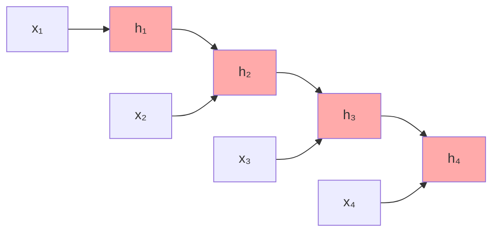
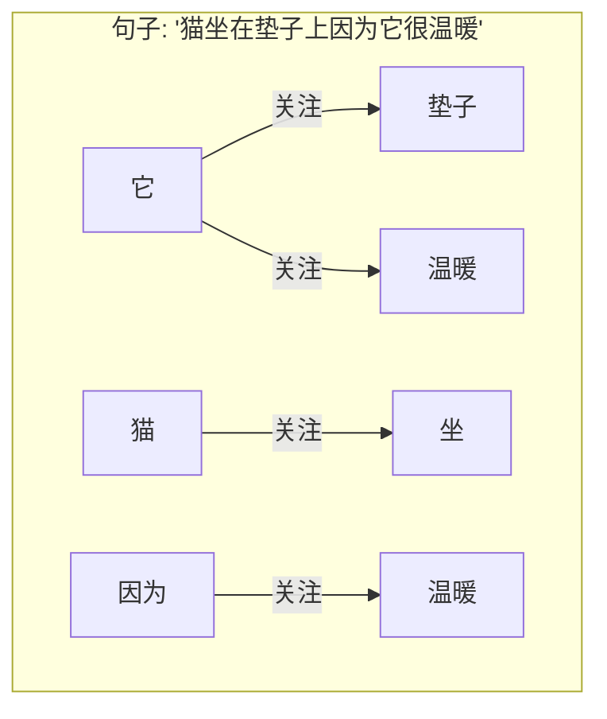
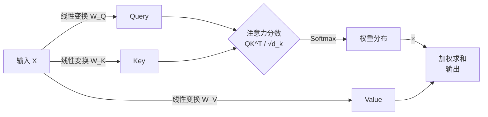
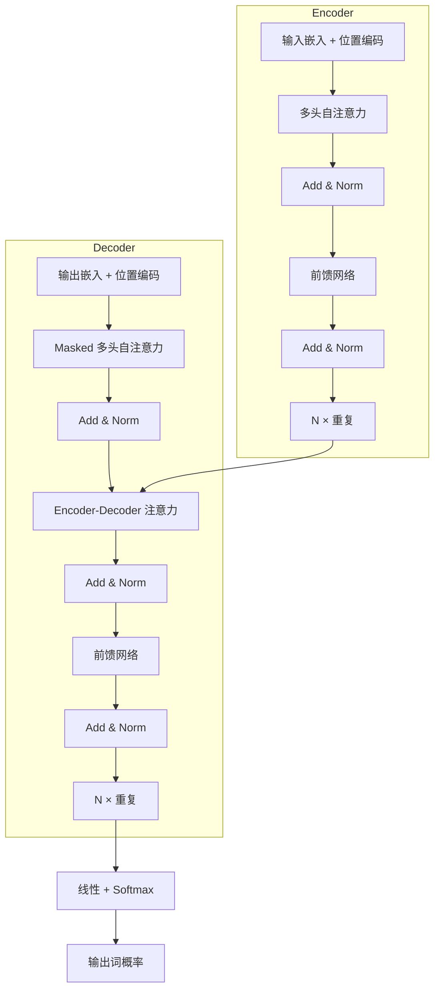
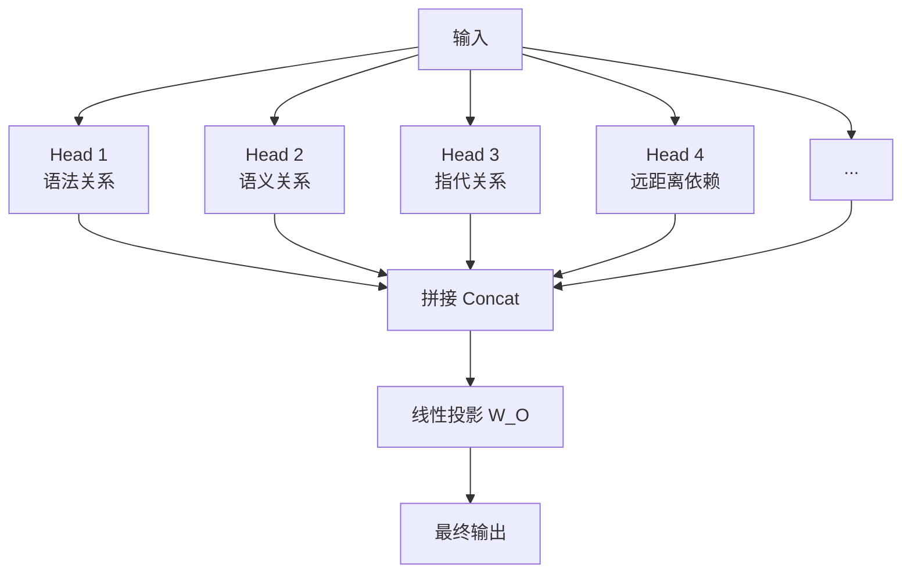
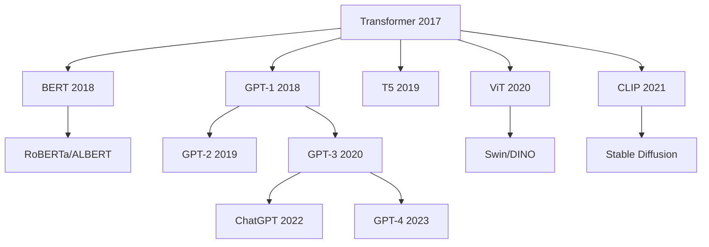

# Attention Is All You Need 深度解读

> **一句话理解**: 这篇论文就像 AI 领域的"相对论"——它证明了你不需要复杂的 RNN 或 CNN，只靠"注意力机制"就能理解序列中每个词与其他所有词的关系，从而彻底改变了自然语言处理乃至整个人工智能的架构范式。

---

## 论文基本信息

| 属性 | 内容 |
|------|------|
| **标题** | Attention Is All You Need |
| **作者** | Ashish Vaswani, Noam Shazeer, Niki Parmar, Jakob Uszkoreit, Llion Jones, Aidan N. Gomez, Łukasz Kaiser, Illia Polosukhin (Google Brain) |
| **发表** | NeurIPS 2017 |
| **引用量** | 150,000+ (截至 2026) |
| **论文链接** | [arXiv:1706.03762](https://arxiv.org/abs/1706.03762) |

---

## 1. 历史背景：为什么需要 Transformer？

### RNN 的困境

在 2017 年之前，序列建模的王者是 RNN（循环神经网络）和它的变体 LSTM/GRU：



**RNN 的核心问题**：

| 问题 | 说明 | 后果 |
|------|------|------|
| **串行计算** | 必须按顺序处理每个词 | 无法并行，训练极慢 |
| **长距离依赖** | 信息从句首传到句尾要穿过很多步 | 梯度消失/爆炸，远距离词"记不住" |
| **梯度路径长** | 第 100 个词想影响第 1 个词，要回溯 99 步 | 难以学习全局依赖 |

### 已有的尝试

- **CNN for Seq2Seq (2017)**：可以并行，但感受野有限，需要很多层才能看到远距离
- **Attention (Bahdanau 2014)**：已有注意力机制，但只是 RNN 的"辅助配件"

**Transformer 的革命性想法**：如果 Attention 已经这么好，为什么不**完全用 Attention 替代 RNN**？

---

## 2. 核心创新：Self-Attention

### 2.1 直观理解

Self-Attention 回答的问题是：**这句话中，每个词应该"关注"哪些其他词？**



**关键洞察**：模型自动学会"它"指的是"垫子"，因为"它"和"垫子"、"温暖"的关联度最高。

### 2.2 数学机制：Query, Key, Value



**Scaled Dot-Product Attention 公式**：

```
Attention(Q, K, V) = softmax(QK^T / √d_k) · V
```

| 符号 | 含义 | 直观理解 |
|------|------|---------|
| **Q (Query)** | 查询向量 | "我是谁？我在问什么？" |
| **K (Key)** | 键向量 | "我有什么信息？" |
| **V (Value)** | 值向量 | "我的实际内容是什么？" |
| **QK^T** | 相似度打分 | "我和你的相关度是多少？" |
| **√d_k** | 缩放因子 | 防止 softmax 进入饱和区 |
| **softmax** | 归一化 | 把分数变成概率分布 |

### 2.3 为什么除以 √d_k？

**直觉**：当 d_k 很大时（如 512），点积的数值会变得很大，导致 softmax 的梯度极小（饱和）。

```python
import torch
import math

d_k = 64
Q = torch.randn(1, d_k)
K = torch.randn(1, d_k)

# 不缩放：数值可能很大
scores_unscaled = torch.matmul(Q, K.transpose(-2, -1))
print(f"不缩放: {scores_unscaled.item():.2f}")  # 可能 > 10

# 缩放：数值适中
scores_scaled = scores_unscaled / math.sqrt(d_k)
print(f"缩放后: {scores_scaled.item():.2f}")  # 更合理
```

---

## 3. 完整架构解析

### 3.1 整体结构



### 3.2 多头注意力（Multi-Head Attention）

**核心思想**：与其用一个注意力函数，不如用多个不同的"视角"同时看。



**为什么多头有用？**

| Head | 学到的模式 | 例子 |
|------|----------|------|
| Head A | 相邻词关系 | "New" → "York" |
| Head B | 句法依存 | 动词 → 主语 |
| Head C | 远距离指代 | "它" → "猫" |
| Head D | 语义相似 | "国王" → "女王"（类比） |

### 3.3 位置编码（Positional Encoding）

**问题**：Attention 是"全连接"的，词的位置信息丢失了。

**解决方案**：给每个位置添加唯一的"位置指纹"。

```python
import torch
import math

def positional_encoding(max_len, d_model):
    pe = torch.zeros(max_len, d_model)
    position = torch.arange(0, max_len).unsqueeze(1).float()
    
    div_term = torch.exp(
        torch.arange(0, d_model, 2).float() *
        -(math.log(10000.0) / d_model)
    )
    
    pe[:, 0::2] = torch.sin(position * div_term)
    pe[:, 1::2] = torch.cos(position * div_term)
    
    return pe

# 可视化位置编码
pe = positional_encoding(100, 512)
# 每一行是一个位置，每一列是一个维度
# 不同位置在不同维度上有不同的"波动频率"
```

**正弦位置编码的特性**：
- 每个位置有唯一的编码
- 可以外推到训练时未见过的长度
- 相对位置可以通过线性变换得到

### 3.4 残差连接与层归一化

```
Output = LayerNorm(x + Sublayer(x))
```

| 组件 | 作用 |
|------|------|
| **残差连接 (+)** | 缓解梯度消失，让信息直接流过 |
| **层归一化 (LayerNorm)** | 稳定训练，每层的输出归一化到均值为 0、方差为 1 |

---

## 4. 为什么 Transformer 这么强？

### 4.1 复杂度对比

| 模型 | 每层复杂度 | 串行操作数 | 最大依赖距离 | 并行性 |
|------|----------|-----------|-------------|--------|
| **RNN** | O(n · d²) | O(n) | O(n) | ❌ 串行 |
| **CNN** | O(k · n · d²) | O(1) | O(log_k(n)) | ✅ 并行 |
| **Self-Attention** | O(n² · d) | O(1) | O(1) | ✅ 完全并行 |

**关键优势**：
- **并行性**：所有位置的 Attention 可以同时计算
- **全局依赖**：任何两个词的距离都是 O(1)，直接"对话"
- **可解释性**：Attention 权重直观展示了模型"在看什么"

### 4.2 实际效果

在 WMT 2014 英德翻译任务上：

| 模型 | BLEU | 训练时间 |
|------|------|---------|
| GNMT (RNN + Attention) | 24.6 | 6 天 (96 块 K80) |
| **Transformer (Base)** | **25.8** | **12 小时 (8 块 P100)** |
| Transformer (Big) | 28.4 | 3.5 天 (8 块 P100) |

**训练速度快了 12 倍，效果还更好。**

---

## 5. 代码实现（PyTorch 简化版）

```python
import torch
import torch.nn as nn
import math

class MultiHeadAttention(nn.Module):
    def __init__(self, d_model=512, num_heads=8):
        super().__init__()
        assert d_model % num_heads == 0
        
        self.d_model = d_model
        self.num_heads = num_heads
        self.d_k = d_model // num_heads
        
        self.W_q = nn.Linear(d_model, d_model)
        self.W_k = nn.Linear(d_model, d_model)
        self.W_v = nn.Linear(d_model, d_model)
        self.W_o = nn.Linear(d_model, d_model)
        
    def scaled_dot_product_attention(self, Q, K, V, mask=None):
        scores = torch.matmul(Q, K.transpose(-2, -1)) / math.sqrt(self.d_k)
        
        if mask is not None:
            scores = scores.masked_fill(mask == 0, -1e9)
        
        attn = torch.softmax(scores, dim=-1)
        output = torch.matmul(attn, V)
        return output, attn
    
    def forward(self, query, key, value, mask=None):
        batch_size = query.size(0)
        
        # 线性变换 + 分头
        Q = self.W_q(query).view(batch_size, -1, self.num_heads, self.d_k).transpose(1, 2)
        K = self.W_k(key).view(batch_size, -1, self.num_heads, self.d_k).transpose(1, 2)
        V = self.W_v(value).view(batch_size, -1, self.num_heads, self.d_k).transpose(1, 2)
        
        # Attention
        attn_output, attn = self.scaled_dot_product_attention(Q, K, V, mask)
        
        # 拼接 + 线性变换
        attn_output = attn_output.transpose(1, 2).contiguous().view(
            batch_size, -1, self.d_model
        )
        return self.W_o(attn_output)

class TransformerBlock(nn.Module):
    def __init__(self, d_model=512, num_heads=8, d_ff=2048, dropout=0.1):
        super().__init__()
        self.attention = MultiHeadAttention(d_model, num_heads)
        self.norm1 = nn.LayerNorm(d_model)
        self.norm2 = nn.LayerNorm(d_model)
        
        self.ff = nn.Sequential(
            nn.Linear(d_model, d_ff),
            nn.ReLU(),
            nn.Linear(d_ff, d_model)
        )
        self.dropout = nn.Dropout(dropout)
        
    def forward(self, x, mask=None):
        # Self-Attention + Add & Norm
        attn_out = self.attention(x, x, x, mask)
        x = self.norm1(x + self.dropout(attn_out))
        
        # Feed Forward + Add & Norm
        ff_out = self.ff(x)
        x = self.norm2(x + self.dropout(ff_out))
        
        return x
```

---

## 6. 后续影响与演进



| 演进方向 | 代表模型 | 关键改进 |
|---------|---------|---------|
| **Encoder-only** | BERT | 双向上下文，适合理解任务 |
| **Decoder-only** | GPT 系列 | 自回归生成，适合生成任务 |
| **Encoder-Decoder** | T5, BART | 统一框架，翻译/摘要 |
| **视觉 Transformer** | ViT, Swin | 将图像视为 patch 序列 |
| **多模态** | CLIP, GPT-4V | 统一处理文本和图像 |

---

## 7. 常见问题（FAQ）

**Q1: Transformer 的 O(n²) 复杂度不是瓶颈吗？**
> 对于长序列（如 100K token）确实是瓶颈。因此出现了 FlashAttention、Linear Attention、Ring Attention 等优化。但在 2017 年，翻译任务的句子长度通常 < 100，O(n²) 完全可接受。

**Q2: 为什么叫 "Attention Is All You Need"？**
> 标题是挑衅性的——作者在宣告：你不需要 RNN，不需要 CNN，只需要 Attention 就够了。这后来被证明是正确的。

**Q3: Self-Attention 和 Cross-Attention 有什么区别？**
> Self-Attention：Q/K/V 来自同一输入（自己关注自己）。Cross-Attention：Q 来自 Decoder，K/V 来自 Encoder（Decoder 关注 Encoder 的输出）。

**Q4: 为什么 Transformer 在 CV 领域也成功了？**
> ViT (2020) 证明：如果把图像切成 patch 当作"词"，Transformer 可以直接应用于视觉。全局注意力比 CNN 的局部感受野更适合某些任务。

**Q5: 这篇论文最难理解的部分是什么？**
> 多数初学者觉得 Multi-Head Attention 的"分头-计算-拼接"流程最绕。建议先理解单头 Attention 的 Q/K/V 机制，再看多头只是并行运行了多个单头。

---

## 8. 与其他章节的关联

- [Transformer 革命](../05_NLP_LLMs/Transformer_Revolution/) — Transformer 变体与演进
- [LLM 架构](../05_NLP_LLMs/LLM_Architectures/) — 现代大模型的架构选择
- [序列模型](../05_NLP_LLMs/Sequence_Models/) — RNN/LSTM 与 Transformer 的对比
- [Transformer 革命](../05_NLP_LLMs/Transformer_Revolution/Transformer_Revolution.md) — Attention 的数学细节

---

*Last updated: 2026-05-07*

## Related

- [[20_Papers/BERT_Deep_Dive]] — BERT 深度解读 (Bidirectional Encoder Representations from Transformers) (共享: google, nlp, transformer)
- [[_synthesis/transformer-llm-architecture]] — Transformer 架构 × LLM 架构 (共享: attention, nlp, transformer)
- [[05_NLP_LLMs/Fine_tuning_Techniques/PEFT_2026/README]] — PEFT 2026 (参数高效微调) (共享: nlp, transformer)
- [[_concepts/long-context-models.md|long-context-models]]
