# BERT 深度解读 (Bidirectional Encoder Representations from Transformers)

> **一句话理解**: BERT 就像一个能"左右开弓"的阅读天才——它同时看到句子的前后文来理解每个词的含义，通过"完形填空"和"句子接龙"两个自监督任务学会语言规律，彻底改变了 NLP 的游戏规则。

---

## 论文基本信息

| 属性 | 内容 |
|------|------|
| **标题** | BERT: Pre-training of Deep Bidirectional Transformers for Language Understanding |
| **作者** | Jacob Devlin, Ming-Wei Chang, Kenton Lee, Kristina Toutanova (Google AI Language) |
| **发表** | NAACL 2019 (Best Long Paper) |
| **引用量** | 120,000+ (截至 2026) |
| **论文链接** | [arXiv:1810.04805](https://arxiv.org/abs/1810.04805) |
| **代码** | [Google 官方](https://github.com/google-research/bert) |

---

## 1. 历史背景：为什么需要双向编码？

### 1.1 预训练语言模型的演进

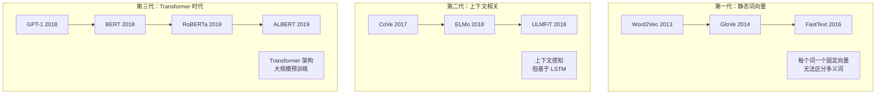

### 1.2 BERT 之前的世界

| 模型 | 年份 | 架构 | 方向性 | 主要局限 |
|------|------|------|--------|---------|
| **Word2Vec** | 2013 | 浅层 NN | 无方向 | 一词一向量，无法区分"苹果"（水果 vs 公司） |
| **ELMo** | 2018 | BiLSTM | 双向拼接 | LSTM 串行瓶颈，非真正联合双向 |
| **GPT-1** | 2018 | Transformer | 仅左→右 | 只能看到上文，无法利用下文信息 |

### 1.3 核心问题：为什么之前的模型不是真正的双向？

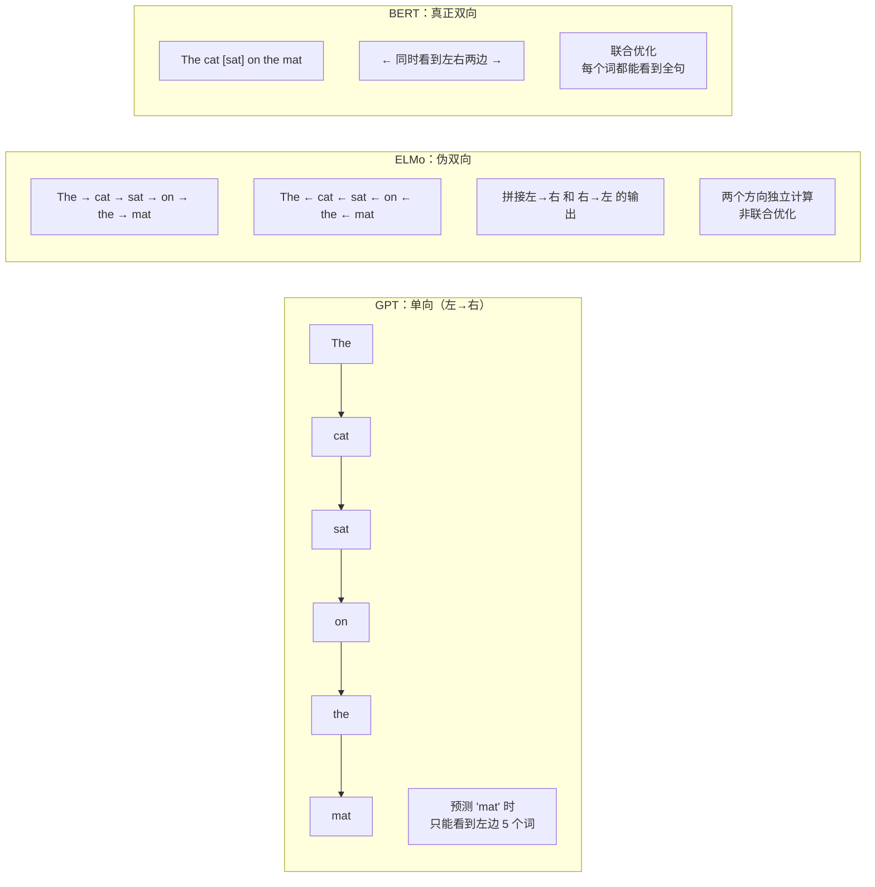

**关键洞察**：ELMo 将左→右和右→左的 LSTM 输出拼接，但两个方向是独立训练的，无法让两个方向的信息真正交互。BERT 通过掩码语言模型 (MLM) 实现了真正的双向联合编码。

---

## 2. 核心创新：MLM 与 NSP

### 2.1 掩码语言模型 (Masked Language Model, MLM)

**核心思想**：随机遮盖输入中的某些词，让模型根据上下文预测被遮盖的词——就像"完形填空"。

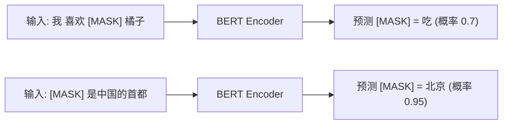

**MLM 的具体策略**：

| 操作 | 比例 | 示例 | 原因 |
|------|------|------|------|
| 替换为 `[MASK]` | 80% | "我喜欢**[MASK]**橘子" → 预测"吃" | 核心任务 |
| 替换为随机词 | 10% | "我喜欢**苹果**橘子" → 预测"吃" | 防止模型只关注 `[MASK]` 位置 |
| 保持原词不变 | 10% | "我喜欢**吃**橘子" → 预测"吃" | 保持输入分布一致性 |

**为什么需要 10% 随机替换 + 10% 保持不变？**

如果只使用 `[MASK]` 替换，存在两个问题：
1. **预训练-微调不一致**：微调时没有 `[MASK]` token，模型没见过真实输入
2. **位置过度关注**：模型可能只学会关注 `[MASK]` 位置而忽略其他词

### 2.2 下一句预测 (Next Sentence Prediction, NSP)

**核心思想**：给定两个句子 A 和 B，判断 B 是否是 A 的下一句。

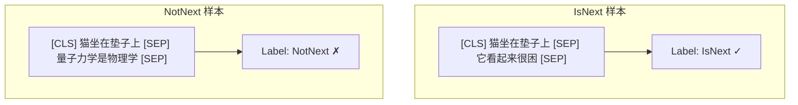

**NSP 的设计理由**：

| NLP 任务 | 需要句子关系理解 | NSP 是否帮助 |
|---------|----------------|-------------|
| 问答 (QA) | 问题与答案的匹配 | ✅ |
| 自然语言推断 (NLI) | 前提与假设的关系 | ✅ |
| 情感分类 | 单句理解即可 | ❌ 不太需要 |
| 命名实体识别 (NER) | 单句理解即可 | ❌ 不太需要 |

### 2.3 输入表示

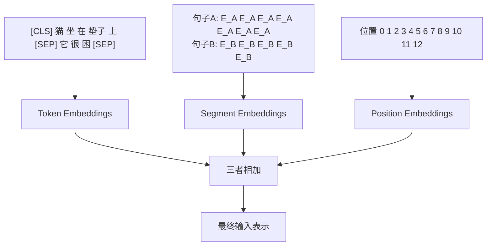

**三种嵌入的详细说明**：

| 嵌入类型 | 作用 | 维度 | 示例 |
|---------|------|------|------|
| **Token Embedding** | 词的语义表示 | 768/1024 | "猫" → [0.2, -0.1, ...] |
| **Segment Embedding** | 区分句子 A/B | 768/1024 | 句子A → E_A, 句子B → E_B |
| **Position Embedding** | 位置信息 | 768/1024 | 位置 0 → [0.1, 0.3, ...] |

**与 Transformer 原论文的区别**：原始 Transformer 使用固定的正弦位置编码，BERT 使用**可学习的位置嵌入**。

### 2.4 特殊 Token 的作用

| Token | 作用 | 出现位置 |
|-------|------|---------|
| `[CLS]` | 分类 token，其最终隐藏状态用于分类任务 | 句子最前面 |
| `[SEP]` | 句子分隔符 | 句子 A/B 之间，以及末尾 |
| `[MASK]` | 掩码标记，仅预训练时使用 | 替换被遮盖的词 |
| `[UNK]` | 未知词标记 | 词表外的词 |

---

## 3. 架构详解

### 3.1 整体架构

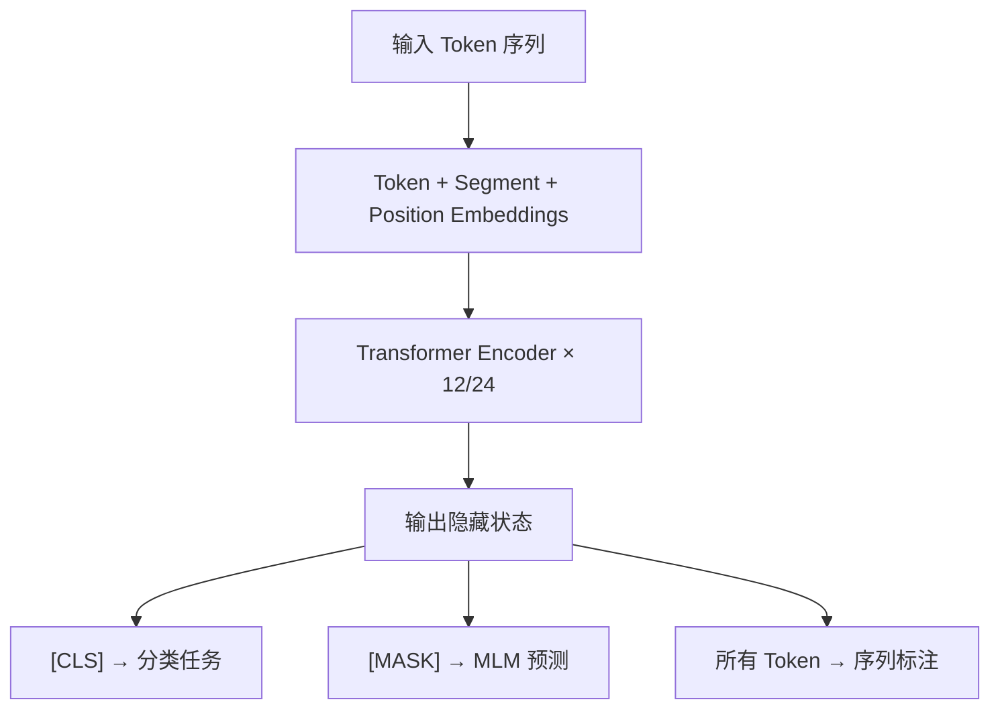

### 3.2 BERT 的两种配置

| 属性 | BERT-Base | BERT-Large |
|------|-----------|------------|
| **层数 (L)** | 12 | 24 |
| **隐藏维度 (H)** | 768 | 1024 |
| **注意力头数 (A)** | 12 | 16 |
| **每头维度 (H/A)** | 64 | 64 |
| **参数量** | 110M | 340M |
| **训练数据** | BooksCorpus + Wikipedia (16GB) | 同上 |
| **训练步数** | 1M | 1M |
| **训练时间** | 4 天 (4×Cloud TPU) | 4 天 (16×Cloud TPU) |

### 3.3 Transformer Encoder Block 详解

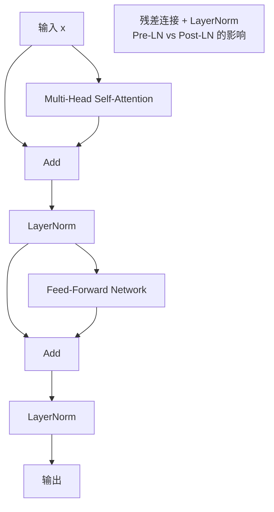

**数学表达**：

$$
\text{MultiHead}(Q, K, V) = \text{Concat}(\text{head}_1, ..., \text{head}_h) W^O
$$

$$
\text{head}_i = \text{Attention}(Q W_i^Q, K W_i^K, V W_i^V)
$$

$$
\text{FFN}(x) = \max(0, xW_1 + b_1) W_2 + b_2
$$

### 3.4 参数量计算 (BERT-Base)

```python
d_model = 768
num_layers = 12
num_heads = 12
vocab_size = 30522
max_position = 512
ffn_dim = 3072  # 4 * d_model

# 1. 嵌入层
token_emb = vocab_size * d_model          # 30522 * 768 ≈ 23.4M
position_emb = max_position * d_model     # 512 * 768 ≈ 0.4M
segment_emb = 2 * d_model                 # 2 * 768 ≈ 0.002M
embedding_total = token_emb + position_emb + segment_emb  # ≈ 23.8M

# 2. 每个 Transformer 层
#   Attention: 4 * d_model^2 (Q, K, V, O projections)
attn_params = 4 * d_model * d_model       # 4 * 768 * 768 ≈ 2.36M
#   FFN: d_model * ffn_dim + ffn_dim * d_model
ffn_params = d_model * ffn_dim + ffn_dim * d_model  # 768*3072*2 ≈ 4.72M
#   LayerNorm: 4 * d_model (2 per LN, 2 LN)
ln_params = 4 * d_model                   # ≈ 0.003M
layer_params = attn_params + ffn_params + ln_params  # ≈ 7.08M

# 3. 所有层
all_layers = num_layers * layer_params    # 12 * 7.08M ≈ 85.0M

# 4. MLM Head
mlm_head = d_model * d_model + d_model + d_model * vocab_size  # ≈ 25.4M

# 5. 总计
total = embedding_total + all_layers + mlm_head  # ≈ 134M (论文报告 110M 是不含 MLM Head)
print(f"嵌入层: {embedding_total / 1e6:.1f}M")
print(f"每层:   {layer_params / 1e6:.2f}M")
print(f"所有层: {all_layers / 1e6:.1f}M")
print(f"总参数: {total / 1e6:.1f}M")
```

### 3.5 MLM 预测头

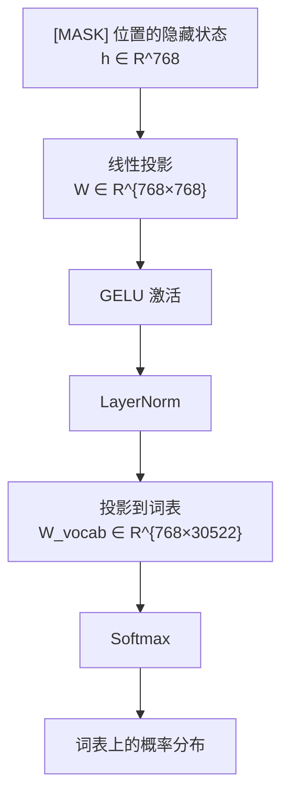

---

## 4. 预训练与微调

### 4.1 预训练阶段

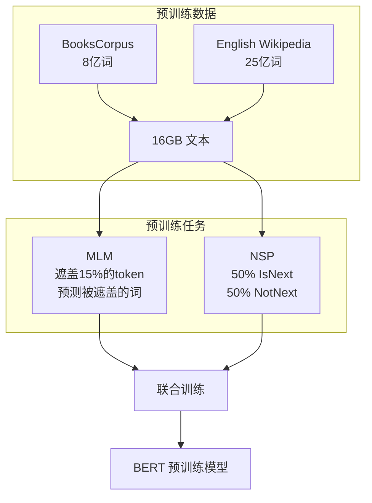

**预训练配置**：

| 配置项 | 值 |
|--------|-----|
| **优化器** | Adam (β₁=0.9, β₂=0.999) |
| **学习率** | 1e-4 (Base), 5e-5 (微调时) |
| **预热比例** | 前 10% 步数线性预热 |
| **Batch Size** | 256 序列 (512 token/序列) |
| **序列长度** | 512 tokens |
| **训练步数** | 1,000,000 步 |
| **Dropout** | 0.1 |
| **损失函数** | MLM 损失 + NSP 损失（取平均） |

### 4.2 微调阶段


**微调的关键洞察**：

| 方面 | 说明 |
|------|------|
| **额外参数** | 仅需在 BERT 顶部添加一个线性层（分类）或少量参数 |
| **训练方式** | 所有参数（包括 BERT）都参与微调 |
| **学习率** | 通常 2e-5 到 5e-5（比预训练小 2-20 倍） |
| **训练轮数** | 通常 3-4 个 epoch |
| **数据需求** | 远少于从头训练（通常几千到几万标注样本即可） |

---

## 5. 实验结果分析

### 5.1 GLUE 基准测试

| 任务 | 指标 | 之前 SOTA | BERT-Base | BERT-Large | 提升 |
|------|------|----------|-----------|------------|------|
| **MNLI** | Acc | 86.6 | 84.6 | 86.7 | +0.1 |
| **QQP** | F1 | 71.2 | 71.2 | 72.1 | +0.9 |
| **QNLI** | Acc | 88.1 | 90.5 | 92.7 | +4.6 |
| **SST-2** | Acc | 94.5 | 93.5 | 94.9 | +0.4 |
| **CoLA** | Matthews | 35.0 | 52.1 | 60.5 | +25.5 |
| **STS-B** | Spearman | 85.0 | 85.8 | 86.5 | +1.5 |
| **MRPC** | Acc | 86.0 | 84.9 | 87.6 | +1.6 |
| **RTE** | Acc | 61.7 | 66.4 | 70.1 | +8.4 |
| **平均** | — | 76.0 | 78.6 | 80.7 | +4.7 |

### 5.2 SQuAD 问答

| 模型 | SQuAD 1.1 EM/F1 | SQuAD 2.0 EM/F1 |
|------|-----------------|-----------------|
| **BiDAF+ELMo** | 75.4 / 83.1 | 62.0 / 69.3 |
| **BERT-Base** | 80.8 / 88.5 | 71.6 / 79.0 |
| **BERT-Large** | **84.2 / 91.1** | **78.7 / 86.5** |
| 人类表现 | 82.3 / 91.2 | 86.8 / 89.5 |

**里程碑**：BERT-Large 在 SQuAD 1.1 上首次超越人类表现（F1: 91.1 vs 91.2）。

### 5.3 消融实验

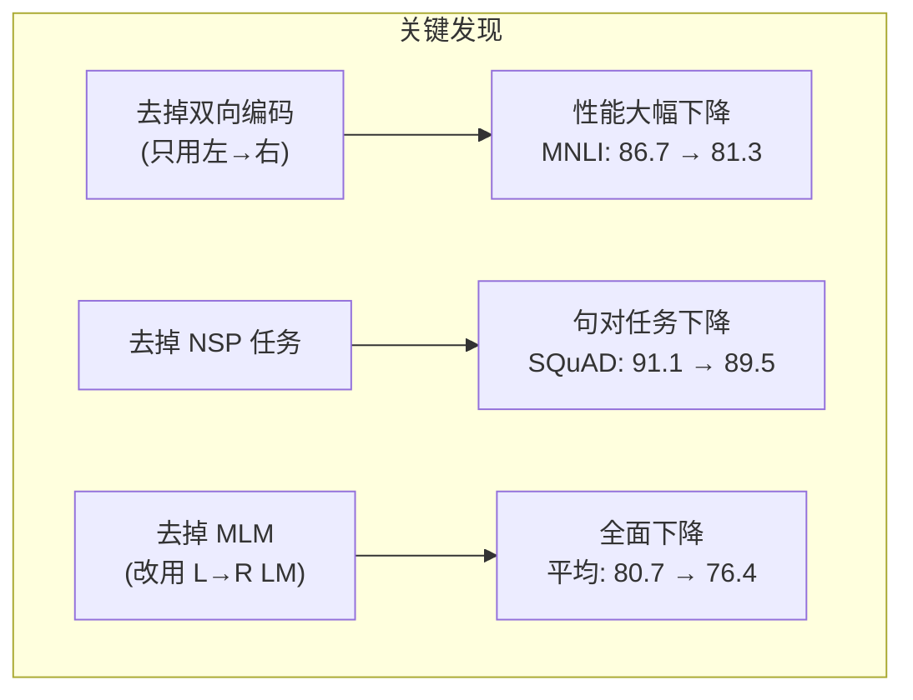

| 变体 | MNLI | SQuAD 1.1 F1 | 平均 GLUE |
|------|------|--------------|-----------|
| **BERT (完整)** | 86.7 | 91.1 | 80.7 |
| 去掉双向 (L→R only) | 81.3 | 83.2 | 76.4 |
| 去掉 NSP | 85.6 | 89.5 | 79.8 |
| 去掉 MLM | 82.1 | 85.7 | 77.2 |

**核心结论**：**双向编码是 BERT 成功的最关键因素**，贡献了最大的性能提升。

---

## 6. BERT 变体与后续工作

### 6.1 BERT 家族图谱

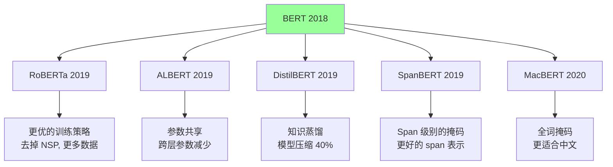

### 6.2 主要变体对比

| 变体 | 核心改进 | 参数量 | 相对 BERT 提升幅度 |
|------|---------|--------|------------------|
| **RoBERTa** | 去掉 NSP、动态掩码、更多数据 (160GB)、更长训练 | 125M/355M | +2-5% |
| **ALBERT** | 跨层参数共享、分解嵌入、句子顺序预测 | 12M-235M | 同等参数下更好 |
| **DistilBERT** | 知识蒸馏、去掉 token 类型和池化层 | 66M (BERT 的 40%) | 保留 97% 性能 |
| **SpanBERT** | 随机 span 掩码、span 边界目标 | 110M/340M | span 任务 +5% |
| **ELECTRA** | 替换 token 检测 (RTD) 代替 MLM | 110M | 计算效率 4× |
| **MacBERT** | 全词掩码 + 同义词替换 (中文) | 110M/340M | 中文 NER +1-2% |

### 6.3 RoBERTa：BERT 的正确打开方式

RoBERTa 的作者发现 BERT 的训练严重**欠训练 (undertrained)**，并提出了多项改进：

| 改进 | BERT 原始 | RoBERTa | 影响 |
|------|----------|---------|------|
| **NSP 任务** | 使用 | **去掉** | NSP 实际上是噪声，去掉更好 |
| **掩码策略** | 静态掩码（预处理一次） | **动态掩码**（每 epoch 随机） | 数据多样性提升 |
| **训练数据** | 16GB | **160GB** (10×) | 大幅提升 |
| **Batch Size** | 256 | **2K-8K** | 更稳定的梯度 |
| **训练步数** | 1M 步 | **500K 步**（更大 batch） | 更充分的训练 |
| **文本编码** | WordPiece (30K 词表) | **Byte-Pair (50K 词表)** | 更好的 Unicode 支持 |

### 6.4 ALBERT：参数效率的极致

ALBERT 通过两项创新减少了 90% 的参数：

**1. 分解嵌入参数 (Factorized Embedding)**：

$$
\text{原始}: E \in \mathbb{R}^{V \times H} \quad (V=30000, H=768)
$$

$$
\text{分解}: E \in \mathbb{R}^{V \times E}, \quad P \in \mathbb{R}^{E \times H} \quad (E=128)
$$

**2. 跨层参数共享**：

```
原始 BERT:  Layer 1 (独立参数)
            Layer 2 (独立参数)
            ...
            Layer 12 (独立参数)

ALBERT:     Layer 1 (共享参数) ─┐
            Layer 2 (共享参数) ─┤ 同一组参数
            ...                 │
            Layer 12 (共享参数)─┘
```

| 配置 | BERT-Large | ALBERT-xxLarge |
|------|-----------|----------------|
| **层数** | 24 | 12 |
| **隐藏维度** | 1024 | 4096 |
| **参数量** | 340M | **235M** |
| **GLUE 平均** | 80.7 | **90.8** |

---

## 7. 代码实战

### 7.1 使用 HuggingFace Transformers 加载 BERT

```python
from transformers import BertTokenizer, BertModel, BertForSequenceClassification
import torch

tokenizer = BertTokenizer.from_pretrained("bert-base-chinese")
model = BertModel.from_pretrained("bert-base-chinese")

text = "人工智能正在改变世界"
inputs = tokenizer(text, return_tensors="pt", padding=True, truncation=True)

with torch.no_grad():
    outputs = model(**inputs)

last_hidden_states = outputs.last_hidden_state
pooler_output = outputs.pooler_output

print(f"输入 IDs:       {inputs['input_ids'].shape}")
print(f"隐藏状态:       {last_hidden_states.shape}")
print(f"池化输出 [CLS]: {pooler_output.shape}")
```

### 7.2 情感分类微调

```python
from transformers import BertForSequenceClassification, Trainer, TrainingArguments
from datasets import load_dataset
import evaluate
import numpy as np

model = BertForSequenceClassification.from_pretrained(
    "bert-base-chinese", num_labels=2
)
tokenizer = BertTokenizer.from_pretrained("bert-base-chinese")

dataset = load_dataset("imsb/common_review_chinese", trust_remote_code=True)

def tokenize_function(examples):
    return tokenizer(
        examples["text"], padding="max_length", truncation=True, max_length=128
    )

tokenized_datasets = dataset.map(tokenize_function, batched=True)

accuracy = evaluate.load("accuracy")

def compute_metrics(eval_pred):
    logits, labels = eval_pred
    predictions = np.argmax(logits, axis=-1)
    return accuracy.compute(predictions=predictions, references=labels)

training_args = TrainingArguments(
    output_dir="./results",
    eval_strategy="epoch",
    learning_rate=2e-5,
    per_device_train_batch_size=16,
    per_device_eval_batch_size=32,
    num_train_epochs=3,
    weight_decay=0.01,
    warmup_ratio=0.1,
    logging_steps=100,
    save_strategy="epoch",
    load_best_model_at_end=True,
)

trainer = Trainer(
    model=model,
    args=training_args,
    train_dataset=tokenized_datasets["train"],
    eval_dataset=tokenized_datasets["test"],
    compute_metrics=compute_metrics,
)

trainer.train()
```

### 7.3 手动实现 MLM 前向传播

```python
import torch
import torch.nn as nn
import math

class BertEmbeddings(nn.Module):
    def __init__(self, vocab_size, hidden_size, max_position_embeddings, type_vocab_size):
        super().__init__()
        self.word_embeddings = nn.Embedding(vocab_size, hidden_size)
        self.position_embeddings = nn.Embedding(max_position_embeddings, hidden_size)
        self.token_type_embeddings = nn.Embedding(type_vocab_size, hidden_size)
        self.layer_norm = nn.LayerNorm(hidden_size, eps=1e-12)
        self.dropout = nn.Dropout(0.1)
    
    def forward(self, input_ids, token_type_ids=None):
        seq_length = input_ids.size(1)
        position_ids = torch.arange(seq_length, dtype=torch.long, device=input_ids.device)
        position_ids = position_ids.unsqueeze(0).expand_as(input_ids)
        
        if token_type_ids is None:
            token_type_ids = torch.zeros_like(input_ids)
        
        word_emb = self.word_embeddings(input_ids)
        pos_emb = self.position_embeddings(position_ids)
        type_emb = self.token_type_embeddings(token_type_ids)
        
        embeddings = word_emb + pos_emb + type_emb
        embeddings = self.layer_norm(embeddings)
        embeddings = self.dropout(embeddings)
        return embeddings


class BertSelfAttention(nn.Module):
    def __init__(self, hidden_size, num_attention_heads):
        super().__init__()
        self.num_heads = num_attention_heads
        self.head_dim = hidden_size // num_attention_heads
        
        self.query = nn.Linear(hidden_size, hidden_size)
        self.key = nn.Linear(hidden_size, hidden_size)
        self.value = nn.Linear(hidden_size, hidden_size)
        self.dropout = nn.Dropout(0.1)
    
    def forward(self, hidden_states, attention_mask=None):
        batch_size = hidden_states.size(0)
        
        Q = self.query(hidden_states).view(batch_size, -1, self.num_heads, self.head_dim).transpose(1, 2)
        K = self.key(hidden_states).view(batch_size, -1, self.num_heads, self.head_dim).transpose(1, 2)
        V = self.value(hidden_states).view(batch_size, -1, self.num_heads, self.head_dim).transpose(1, 2)
        
        scores = torch.matmul(Q, K.transpose(-2, -1)) / math.sqrt(self.head_dim)
        
        if attention_mask is not None:
            scores = scores + attention_mask
        
        attn_probs = torch.softmax(scores, dim=-1)
        attn_probs = self.dropout(attn_probs)
        
        context = torch.matmul(attn_probs, V)
        context = context.transpose(1, 2).contiguous().view(batch_size, -1, self.num_heads * self.head_dim)
        return context


class BertLayer(nn.Module):
    def __init__(self, hidden_size, num_attention_heads, intermediate_size):
        super().__init__()
        self.attention = BertSelfAttention(hidden_size, num_attention_heads)
        self.attention_output = nn.Linear(hidden_size, hidden_size)
        self.attn_ln = nn.LayerNorm(hidden_size, eps=1e-12)
        self.attn_dropout = nn.Dropout(0.1)
        
        self.intermediate = nn.Linear(hidden_size, intermediate_size)
        self.output = nn.Linear(intermediate_size, hidden_size)
        self.ffn_ln = nn.LayerNorm(hidden_size, eps=1e-12)
        self.ffn_dropout = nn.Dropout(0.1)
    
    def forward(self, hidden_states, attention_mask=None):
        attn_out = self.attention(hidden_states, attention_mask)
        attn_out = self.attention_output(attn_out)
        attn_out = self.attn_dropout(attn_out)
        hidden_states = self.attn_ln(attn_out + hidden_states)
        
        ffn_out = self.intermediate(hidden_states)
        ffn_out = torch.gelu(ffn_out)
        ffn_out = self.output(ffn_out)
        ffn_out = self.ffn_dropout(ffn_out)
        hidden_states = self.ffn_ln(ffn_out + hidden_states)
        
        return hidden_states
```

### 7.4 提取句向量用于相似度计算

```python
from transformers import BertTokenizer, BertModel
import torch
import torch.nn.functional as F

tokenizer = BertTokenizer.from_pretrained("bert-base-chinese")
model = BertModel.from_pretrained("bert-base-chinese")
model.eval()

def get_sentence_embedding(text):
    inputs = tokenizer(text, return_tensors="pt", padding=True, truncation=True, max_length=512)
    with torch.no_grad():
        outputs = model(**inputs)
    cls_embedding = outputs.last_hidden_state[:, 0, :]
    return cls_embedding.squeeze(0)

sentences = [
    "今天天气真好",
    "外面阳光明媚",
    "深度学习是人工智能的核心技术",
    "这个商品质量很差",
]

embeddings = [get_sentence_embedding(s) for s in sentences]

print("语义相似度矩阵:")
for i, s1 in enumerate(sentences):
    for j, s2 in enumerate(sentences):
        sim = F.cosine_similarity(embeddings[i].unsqueeze(0), embeddings[j].unsqueeze(0)).item()
        print(f"  '{s1[:10]}' vs '{s2[:10]}': {sim:.4f}")
```

---

## 8. 影响：NLP 范式的彻底改变

### 8.1 对 NLP 领域的影响

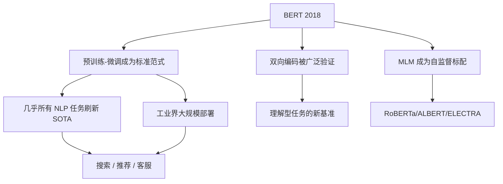

### 8.2 BERT 在工业界的应用

| 应用领域 | 具体场景 | BERT 的角色 |
|---------|---------|------------|
| **搜索引擎** | Google Search (2019 年部署) | 理解查询意图，改善搜索结果 |
| **推荐系统** | 内容理解、用户意图分析 | 文本特征提取 |
| **客服系统** | 意图识别、情感分析 | 分类 backbone |
| **金融风控** | 舆情分析、事件抽取 | NER + 关系抽取 |
| **医疗 AI** | 电子病历理解、辅助诊断 | 文本理解 backbone |

### 8.3 BERT vs GPT：两条路线的分野

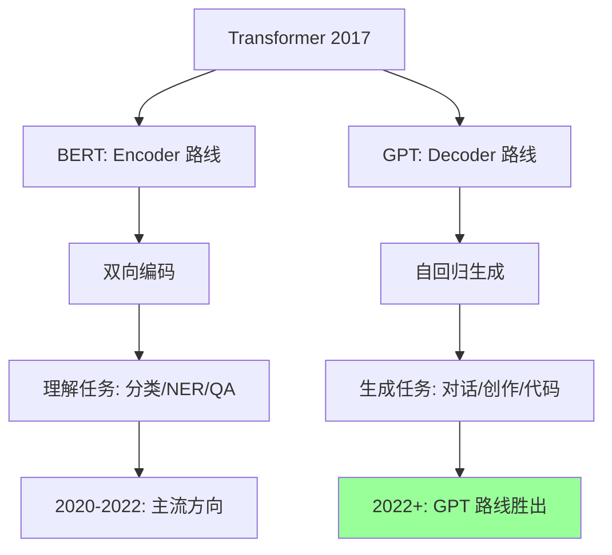

| 维度 | BERT (Encoder) | GPT (Decoder) |
|------|---------------|---------------|
| **注意力** | 双向 | 单向 (Causal) |
| **训练目标** | MLM (完形填空) | CLM (预测下一个词) |
| **擅长** | 理解、分类、抽取 | 生成、对话、推理 |
| **代表应用** | 搜索、NER、分类 | ChatGPT、代码生成 |
| **2026 地位** | 仍用于理解任务 | 生成式 AI 主流 |

---

## 9. 面试问题（FAQ）

### Q1: BERT 为什么用 [CLS] token 做分类而不是平均池化？

> **答**: [CLS] 在预训练时通过 NSP 任务学会了聚合整个句子的信息。它不受任何特定词的影响，是一个"全局"表示。平均池化也可以，但 [CLS] 的表现通常更好，因为它是专门为全局信息聚合而设计的。

### Q2: MLM 中为什么遮盖 15% 而不是更多或更少？

> **答**: 这是计算效率和训练信号的权衡：
> - **太少**（如 5%）：训练信号不足，模型学到太少
> - **太多**（如 50%）：上下文信息丢失太多，预测困难
> - **15%** 是实验得出的平衡点，既保证足够的训练信号，又不丢失太多上下文

### Q3: BERT 的 NSP 任务真的有用吗？

> **答**: 这是一个争议话题：
> - **BERT 论文**：消融实验显示 NSP 对句对任务（QNLI、SQuAD）有帮助
> - **RoBERTa 论文**：去掉 NSP 反而提升了性能！作者认为 NSP 太简单，模型主要靠 topic 信号而非逻辑连贯性判断
> - **ALBERT 论文**：将 NSP 改为句子顺序预测 (SOP)，效果更好
> 
> **结论**：NSP 的设计有缺陷，但句子关系建模本身是有价值的，关键在于任务设计。

### Q4: 为什么 BERT 使用 WordPiece 而不是 BPE？

> **答**: WordPiece 和 BPE 非常相似，主要区别在选择合并策略：
> - **BPE**：选择最频繁的 token 对
> - **WordPiece**：选择使语言模型似然最大化的 token 对
> 
> 实际上 BERT 的 WordPiece 和 GPT-2 的 BPE 效果差异很小。RoBERTa 后来切换到 BPE 并扩大词表到 50K。

### Q5: BERT 能处理多长的文本？

> **答**: BERT 的最大长度是 **512 tokens**（由位置嵌入决定）。处理更长文本的方法：
> 
> | 方法 | 原理 | 适用场景 |
> |------|------|---------|
> | **截断** | 只取前 512 token | 文本较短或关键信息在前 |
> | **滑动窗口** | 分段处理再合并 | 长文档分类 |
> | **Longformer** | 稀疏注意力替代全注意力 | 长文档理解 |
> | **BigBird** | 随机 + 窗口 + 全局注意力 | 长序列处理 |

### Q6: BERT 在中文场景下有什么特殊考量？

> **答**: 中文 BERT 有几个关键点：
> 1. **分词粒度**：bert-base-chinese 使用**字级别**分词，每个中文字符是一个 token
> 2. **全词掩码 (Whole Word Masking)**：MacBERT 建议掩码时遮盖整个词而非单个字
> 3. **预训练数据**：中文 Wikipedia 规模远小于英文，需要补充中文语料
> 4. **语义理解差异**：中文缺乏空格分隔，语法结构不同

### Q7: 如何选择 BERT 的变体？

> | 场景 | 推荐 | 原因 |
> |------|------|------|
> | 通用英文 NLP | **RoBERTa-Base** | BERT 的"正确训练"版 |
> | 资源受限/移动端 | **DistilBERT** 或 **MobileBERT** | 参数少、推理快 |
> | 中文 NLP | **MacBERT-Base/Large** | 全词掩码更适合中文 |
> | 追求极限性能 | **DeBERTa-v3** | BERT 系列的最终形态 |
> | 大规模部署 | **ELECTRA-Small** | 计算效率最高 |

---

## 10. 与其他章节的关联

### 前置知识
- [Attention Is All You Need 深度解读](./Attention_Is_All_You_Need_Deep_Dive.md) — Transformer 架构基础
- [Transformer 革命](../05_NLP_LLMs/Transformer_Revolution/) — Self-Attention 机制详解
- [深度学习优化](../03_Deep_Learning/Optimization/Optimization.md) — 预训练与微调的优化策略

### 横向关联
- [GPT-3 深度解读](./GPT3_Deep_Dive.md) — Encoder-only vs Decoder-only 的对比
- [NLP 与 LLMs](../05_NLP_LLMs/README.md) — NLP 任务全景
- [LLM 架构](../05_NLP_LLMs/LLM_Architectures/) — 现代大模型架构设计

### 进阶方向
- [Fine-tuning 技术](../05_NLP_LLMs/Fine_tuning_Techniques/) — 参数高效微调方法
- [RLHF 与 DPO 深度解读](./RLHF_DPO_Deep_Dive.md) — 从 BERT 微调到 RLHF 对齐
- [Mixture of Experts 深度解读](./Mixture_of_Experts_Deep_Dive.md) — 稀疏 MoE 架构

---

*Last updated: 2026-05-17*

## Related

- [[05_NLP_LLMs/Fine_tuning_Techniques/PEFT_2026/README]] — PEFT 2026 (参数高效微调) (共享: bert, nlp, transformer)
- [[05_NLP_LLMs/Fine_tuning_Techniques/README]] — 微调技术 (Fine-tuning Techniques) (共享: bert, nlp, transformer)
- [[05_NLP_LLMs/LLM_Architectures/LLM-Basics-in-nutshell]] — 大语言模型基础速成指南 (共享: bert, nlp, transformer)
- [[05_NLP_LLMs/Multimodal_Models/Multimodal_Architectures_2026]] — 多模态模型架构 2026：从 GPT-4V 到原生多模态 AGI (共享: bert, nlp, transformer)
