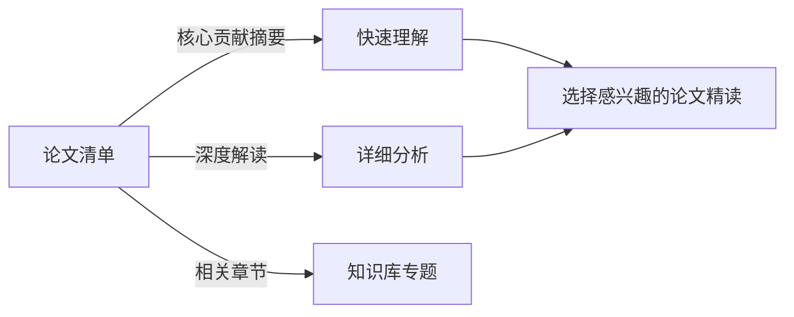
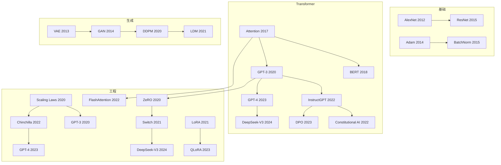

# 22 经典与必读 AI 论文清单 (Essential AI Papers)

> **一句话理解**: 本清单精选 22 篇"改变 AI 历史"的核心论文（含 22 篇深度解读），每篇附带"为什么必读"的解读和相关章节链接，帮你从论文源头理解现代 AI 的构建逻辑。

---

## 如何使用本章节

- **快速浏览**：阅读每篇论文的"核心贡献"摘要，建立知识地图
- **深度学习**：点击"深度解读"链接阅读完整分析（持续更新中）
- **按主题追踪**：通过"相关章节"跳转到知识库中的对应专题

---

## 阅读路径建议

1. **基础训练与优化** → 2. **视觉/表征学习** → 3. **NLP 与 Transformer** → 4. **生成式模型** → 5. **强化学习与智能体** → 6. **工程化与高效推理** → 7. **安全与对齐**

---

## 01 深度学习基础与优化

| 论文 | 核心贡献 | 为什么必读 | 相关章节 |
|------|---------|-----------|---------|
| **Deep Learning (2015)** LeCun et al. | 深度学习三大要素（深度网络、大规模数据、GPU 计算）的系统综述，定义了现代深度学习的研究范式 | 建立全局视野，理解深度学习为何在 2012 年后爆发 | [深度学习](../03_Deep_Learning/README.md) |
| **ImageNet Classification with Deep Convolutional Neural Networks (2012)** Krizhevsky et al. | AlexNet：ReLU + Dropout + GPU 训练的首次成功组合，ImageNet 2012 冠军，误差率降低 10.8% | 深度学习的"大爆炸"起点，计算机视觉的里程碑 | [计算机视觉](../04_Computer_Vision/README.md) |
| **Dropout (2014)** Srivastava et al. | 训练时随机丢弃神经元，防止共适应，成为 CNN 和全连接层的标准正则化方法 | 几乎每次训练模型都会用到，理解原理才能调好参数 | [深度学习优化](../03_Deep_Learning/Optimization/Optimization.md) |
| **Batch Normalization (2015)** Ioffe & Szegedy | 层输入标准化 + 可学习缩放/偏移，解决内部协变量偏移，允许使用更大学习率 | 现代网络训练的"默认配置"，ResNet 等架构的基础 | [深度学习优化](../03_Deep_Learning/Optimization/Optimization.md) |
| **Adam (2014)** Kingma & Ba | 一阶和二阶矩估计的自适应学习率，默认 β₁=0.9, β₂=0.999，成为最常用的优化器 | 训练神经网络时默认选择的优化器，理解其工作机制 | [深度学习优化](../03_Deep_Learning/Optimization/Optimization.md) |

---

## 02 视觉与表征学习

| 论文 | 核心贡献 | 为什么必读 | 相关章节 |
|------|---------|-----------|---------|
| **Deep Residual Learning for Image Recognition (2015)** He et al. | ResNet：残差连接解决梯度消失，成功训练 152+ 层网络，ImageNet 2015 冠军 | 几乎所有现代视觉模型都基于残差连接，CV 的必备基础 | [计算机视觉](../04_Computer_Vision/README.md) [图像分类](../04_Computer_Vision/Image_Classification_Detection/) |
| **U-Net (2015)** Ronneberger et al. | 编码器-解码器 + 跳跃连接，医学图像分割的经典架构，影响扩散模型 U-Net backbone | 分割任务的起点，也是 Stable Diffusion 的核心组件 | [分割](../04_Computer_Vision/Segmentation/) |
| **Faster R-CNN (2015)** Ren et al. | RPN + Fast R-CNN 端到端训练，两阶段检测的速度突破，mAP 73.2% | 目标检测的奠基工作，理解 R-CNN 系列演进的关键节点 | [目标检测](../04_Computer_Vision/Image_Classification_Detection/) |
| **An Image is Worth 16x16 Words (2020)** Dosovitskiy et al. | ViT：将图像切分为 patch 序列，纯 Transformer 超越 ResNet，开启视觉 Transformer 时代 | 2020 年后视觉领域最重要的架构转变，理解"CNN → Transformer"的迁移 | [计算机视觉](../04_Computer_Vision/README.md) [Transformer 革命](../05_NLP_LLMs/Transformer_Revolution/) |
| **Matryoshka Representation Learning (2022)** Kusupati et al. | MRL：训练可截断的多尺度向量表示，任意前缀维度都保持语义有效性 | 向量表示的"弹性维度"革命，RAG、向量数据库和端侧部署的核心技术 | [RAG 系统](../14_RAG_Systems/README.md) [嵌入模型](../_concepts/embedding-models.md) |

---

## 03 NLP 与 Transformer

| 论文 | 核心贡献 | 为什么必读 | 相关章节 |
|------|---------|-----------|---------|
| **Attention Is All You Need (2017)** Vaswani et al. | Transformer：完全基于自注意力，摒弃 RNN/CNN，并行训练 + 长距离依赖建模，奠定现代 NLP 基础 | 现代大模型的"圣经"，GPT、BERT、T5 的共同祖先 | [Transformer 革命](../05_NLP_LLMs/Transformer_Revolution/) [序列模型](../05_NLP_LLMs/Sequence_Models/) |
| **BERT (2018)** Devlin et al. | 双向 Transformer + MLM + NSP，预训练-微调范式，GLUE 基准大幅提升 | "预训练+微调"时代的开启，理解自监督学习的威力 | [NLP 与 LLMs](../05_NLP_LLMs/README.md) [LLM 架构](../05_NLP_LLMs/LLM_Architectures/) |
| **Language Models are Few-Shot Learners (GPT-3, 2020)** Brown et al. | 175B 参数，上下文学习（In-Context Learning）涌现，无需微调即可完成任务 | Scaling Laws 的首次大规模验证，"大模型时代"的标志性论文 | [LLM 架构](../05_NLP_LLMs/LLM_Architectures/) [Prompt Engineering](../05_NLP_LLMs/Prompt_Engineering/) |
| **Training language models to follow instructions with human feedback (InstructGPT, 2022)** Ouyang et al. | SFT + RLHF 三阶段训练，1.3B InstructGPT 超越 175B GPT-3，证明对齐的重要性 | ChatGPT 的技术基础，理解"有用、无害、诚实"的训练方法 | [Fine-tuning](../05_NLP_LLMs/Fine_tuning_Techniques/) [RL](../06_Reinforcement_Learning/) |
| **LLaMA (2023)** Touvron et al. | 开源高效大模型，7B-65B，仅使用公开数据训练，性能接近 GPT-3，引发开源大模型浪潮 | 开源大模型的分水岭，理解高效训练和数据质量的重要性 | [LLM 架构](../05_NLP_LLMs/LLM_Architectures/) [开源 Agent](../15_Agent_Production/AI_OpenSource_Projects_Overview.md) |
| **GPT-4 Technical Report (2023)** OpenAI | 多模态大模型（文本+图像输入），1.7T MoE 架构，在多项专业考试中达到人类水平 | 标志 LLM 进入"通用智能"阶段，MoE 架构在超大规模模型中的首次验证 | [LLM 架构](../05_NLP_LLMs/LLM_Architectures/) [Global LLM](../05_NLP_LLMs/Global_LLM_Ecosystem/) |
| **DeepSeek-V3 Technical Report (2024)** DeepSeek | 671B MoE + MLA + FP8 混合精度训练，$5.6M 训练成本达到 GPT-4 级性能 | 颠覆"只有巨头才能训练大模型"的认知，效率优先路线的里程碑 | [Chinese LLM](../05_NLP_LLMs/Chinese_LLM_Ecosystem/) [LLM 架构](../05_NLP_LLMs/LLM_Architectures/) |

### 深度解读（持续更新）

- [Attention Is All You Need 深度解读](./Attention_Is_All_You_Need_Deep_Dive.md) — Transformer 的完整技术剖析
- [ResNet 深度解读](./ResNet_Deep_Dive.md) — 残差学习的数学直觉与工程实现
- [GPT-3 深度解读](./GPT3_Deep_Dive.md) — 规模化、上下文学习与涌现能力
- [GPT-4 深度解读](./GPT4_Deep_Dive.md) — 多模态 MoE 架构、系统提示词与涌现能力跃迁
- [BERT 深度解读](./BERT_Deep_Dive.md) — 双向编码、MLM/NSP 与预训练-微调范式
- [LLaMA 深度解读](./LLaMA_Deep_Dive.md) — 开源 LLM 革命、RoPE/SwiGLU/RMSNorm 架构创新
- [DeepSeek-V3 技术报告](./DeepSeek_V3_Technical_Report.md) — MLA、MoE、FP8 训练与 $5.6M 成本奇迹
- [Diffusion Models 深度解读](./Diffusion_Models_Deep_Dive.md) — 从 DDPM 到 Stable Diffusion 再到 DiT
- [RLHF 与 DPO 深度解读](./RLHF_DPO_Deep_Dive.md) — InstructGPT 三阶段训练、DPO 数学推导与对齐方法
- [DPO 深度解读](./DPO_Deep_Dive.md) — 直接偏好优化的数学推导、与 RLHF 对比及对齐方法演进
- [Mixture of Experts 深度解读](./Mixture_of_Experts_Deep_Dive.md) — Switch Transformer、Mixtral、DeepSeek MoE 架构解析
- [DQN 深度解读](./DQN_Deep_Dive.md) — 深度强化学习开山之作，Atari 游戏与经验回放
- [AlphaGo 深度解读](./AlphaGo_Deep_Dive.md) — 围棋 AI 的突破，深度 RL 与蒙特卡洛树搜索
- [GAN 深度解读](./GAN_Deep_Dive.md) — 生成对抗网络：从 Goodfellow 到 StyleGAN 的对抗训练革命
- [CLIP 深度解读](./CLIP_Deep_Dive.md) — 视觉-语言多模态对齐基石，零样本分类与对比学习
- [LoRA 深度解读](./LoRA_Deep_Dive.md) — 低秩适配微调：从 LoRA 到 QLoRA 的参数高效训练
- [VAE 深度解读](./VAE_Deep_Dive.md) — 变分自编码器：重参数化技巧、潜空间生成、扩散模型前身
- [Chain-of-Thought 深度解读](./Chain_of_Thought_Deep_Dive.md) — 思维链提示：让 LLM 逐步推理，o1/R1 的思想源头
- [RAG 深度解读](./RAG_Deep_Dive.md) — 检索增强生成：先查后答，解决 LLM 知识过时和幻觉问题
- [Matryoshka Representation Learning 深度解读](./Matryoshka_Representation_Learning_Deep_Dive.md) — 可截断的多尺度向量表示，RAG 与向量数据库的弹性维度方案
- [Chinchilla 深度解读](./Chinchilla_Deep_Dive.md) — 计算最优训练：数据量比参数量更重要，重塑 Scaling Laws

---

## 04 生成式模型

| 论文 | 核心贡献 | 为什么必读 | 相关章节 |
|------|---------|-----------|---------|
| **Auto-Encoding Variational Bayes (2013)** Kingma & Welling | VAE：变分推断 + 神经网络编码器/解码器，可学习的潜在空间表示 | 生成模型的数学基础，理解 ELBO、重参数化技巧 | [生成模型](../04_Computer_Vision/Generative_Models/) |
| **Generative Adversarial Nets (2014)** Goodfellow et al. | GAN：生成器 vs 判别器对抗训练，开创对抗学习范式 | 2014-2018 年生成式 AI 的主流方法，理解 min-max 博弈 | [生成模型](../04_Computer_Vision/Generative_Models/) |
| **Denoising Diffusion Probabilistic Models (2020)** Ho et al. | DDPM：逐步去噪生成，T=1000 步马尔可夫链，图像质量首次媲美 GAN | Stable Diffusion 的理论基础，现代生成式 AI 的核心 | [生成模型](../04_Computer_Vision/Generative_Models/) [Diffusion](../04_Computer_Vision/Generative_Models/) |
| **Latent Diffusion Models (2021)** Rombach et al. | LDM：在潜在空间做扩散，降低计算复杂度 48×，Stable Diffusion 的实现基础 | 让扩散模型在消费级 GPU 上运行成为可能 | [生成模型](../04_Computer_Vision/Generative_Models/) |

---

## 05 强化学习与智能体

| 论文 | 核心贡献 | 为什么必读 | 相关章节 |
|------|---------|-----------|---------|
| **Playing Atari with Deep Reinforcement Learning (2013)** Mnih et al. | DQN：深度网络 + 经验回放 + 目标网络，首次实现端到端深度 RL | 深度 RL 的开山之作，Atari 游戏超越人类水平 | [深度 RL](../06_Reinforcement_Learning/Deep_RL/) |
| **Proximal Policy Optimization (2017)** Schulman et al. | PPO：裁剪替代目标，稳定性与样本效率的平衡，OpenAI 默认 RL 算法 | 工程上最实用的策略梯度方法，ChatGPT RLHF 的基础 | [深度 RL](../06_Reinforcement_Learning/Deep_RL/) |
| **Mastering the Game of Go (2016)** Silver et al. | AlphaGo：策略网络 + 价值网络 + MCTS，首次击败人类围棋世界冠军 | AI 战胜人类的标志性事件，理解搜索与学习的结合 | [深度 RL](../06_Reinforcement_Learning/Deep_RL/) [Agent](../06_Reinforcement_Learning/AI_Agents/) |

---

## 06 规模化与工程化

| 论文 | 核心贡献 | 为什么必读 | 相关章节 |
|------|---------|-----------|---------|
| **Scaling Laws for Neural Language Models (2020)** Kaplan et al. | 损失与计算量/参数量/数据量的幂律关系，预测 GPT-3 规模的可行性 | 大模型时代的"物理定律"，指导训练资源配置 | [模型训练](../07_Model_Training/README.md) [LLM 架构](../05_NLP_LLMs/LLM_Architectures/) |
| **Training Compute-Optimal Large Language Models (Chinchilla, 2022)** Hoffmann et al. | 计算最优训练：给定固定计算预算，数据量应与参数量等比增加，70B Chinchilla 击败 280B Gopher | 推翻"越大越好"的简单 Scaling，证明数据质量和训练效率同样重要 | [模型训练](../07_Model_Training/README.md) [LLM 架构](../05_NLP_LLMs/LLM_Architectures/) |
| **Switch Transformers (2021)** Fedus et al. | MoE 稀疏激活，1.6T 参数但每次只激活 200B，T5 的 7× 加速 | 超大规模模型的关键技术，GPT-4、Mixtral 的架构基础 | [LLM 架构](../05_NLP_LLMs/LLM_Architectures/) |
| **ZeRO (2020)** Rajbhandari et al. | 优化器状态/梯度/参数分片，单卡可训练 10× 大模型，DeepSpeed 核心 | 分布式训练的必备技术，理解显存优化的极限 | [分布式训练](../07_Model_Training/Distributed_Training_2026.md) |
| **LoRA (2021)** Hu et al. | 低秩适配，冻结原权重，只训练 A/B 低秩矩阵，显存节省 3× | 参数高效微调的标配方法，理解秩的选择与影响 | [Fine-tuning](../07_Model_Training/Fine_tuning_Strategies.md) |
| **QLoRA (2023)** Dettmers et al. | 4-bit NF4 量化 + 双量化 + 分页优化器，单卡 48GB 微调 65B 模型 | 让大模型微调民主化，消费级 GPU 也能玩大模型 | [Fine-tuning](../07_Model_Training/Fine_tuning_Strategies.md) |
| **FlashAttention (2022)** Dao et al. | IO-Aware 精确注意力，分块计算减少 HBM 访问，2-4× 加速无近似 | Transformer 训练和推理的必备优化，理解内存墙问题 | [训练优化](../07_Model_Training/Training_Optimization_2026.md) |

---

## 07 对齐与安全

| 论文 | 核心贡献 | 为什么必读 | 相关章节 |
|------|---------|-----------|---------|
| **Concrete Problems in AI Safety (2016)** Amodei et al. | 将 AI 安全分解为 5 个具体问题：避免负面副作用、避免奖励黑客等 | AI 安全研究的起点，理解安全问题的系统化框架 | [AI 安全](../17_Ethics_Safety/AI_Safety_RedTeaming/) |
| **AI Safety via Debate (2018)** Irving et al. | 用两个 AI 辩论来验证复杂声明，人类评判辩论结果 | 可扩展监督的创新思路，理解"辩论"作为对齐工具 | [价值对齐](../17_Ethics_Safety/Value_Alignment/Value_Alignment.md) |
| **Constitutional AI (2022)** Bai et al. | 用原则（宪法）自我批判和修订，减少对人工反馈的依赖 | Claude 的核心技术，理解"自我对齐"的可行性 | [价值对齐](../17_Ethics_Safety/Value_Alignment/Value_Alignment.md) |
| **Direct Preference Optimization (2023)** Rafailov et al. | 直接从偏好数据优化，无需显式奖励模型，简化 RLHF 流程 | DPO 正在取代 PPO 成为对齐首选，理解其数学简洁性 | [价值对齐](../17_Ethics_Safety/Value_Alignment/Value_Alignment.md) [Fine-tuning](../07_Model_Training/Fine_tuning_Strategies.md) |

---

## 论文关联图谱

---

## 持续更新计划

- [x] 论文清单与核心贡献摘要
- [ ] 论文深度解读系列（持续更新）
- [ ] 论文代码复现指南
- [ ] 论文阅读路径推荐（按角色：研究者/工程师/产品经理）

---

*Last updated: 2026-06-15*

## Related
- [[20_Papers/RAG_Deep_Dive|论文深度解读: RAG — 检索增强生成 (Retrieval-Augmented Generation)]]
- [[20_Papers/CLIP_Deep_Dive|CLIP 深度解读 (Learning Transferable Visual Models From Natural Language Supervision)]]
- [[20_Papers/GAN_Deep_Dive|GAN 深度解读 (Generative Adversarial Networks)]]
- [[20_Papers/Chain_of_Thought_Deep_Dive|论文深度解读: Chain-of-Thought — 让 LLM 逐步推理]]
- [[20_Papers/VAE_Deep_Dive|论文深度解读: VAE — 变分自编码器 (Auto-Encoding Variational Bayes)]]
- [[20_Papers/LoRA_Deep_Dive|LoRA 深度解读 (Low-Rank Adaptation of Large Language Models)]]

- [[20_Papers/README_for_dummy]] — 22 Papers — 小白版 📚 (共享: deep-dive, paper)

