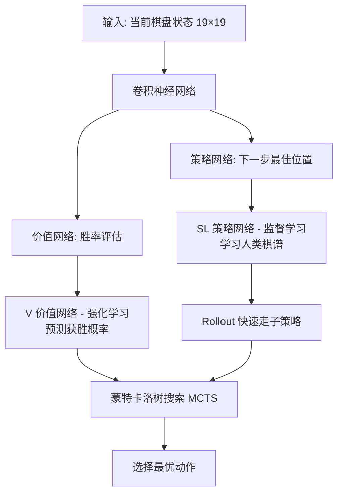
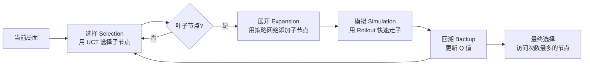
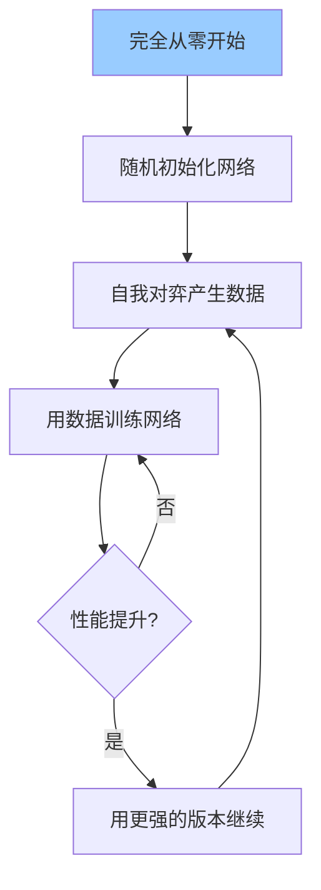
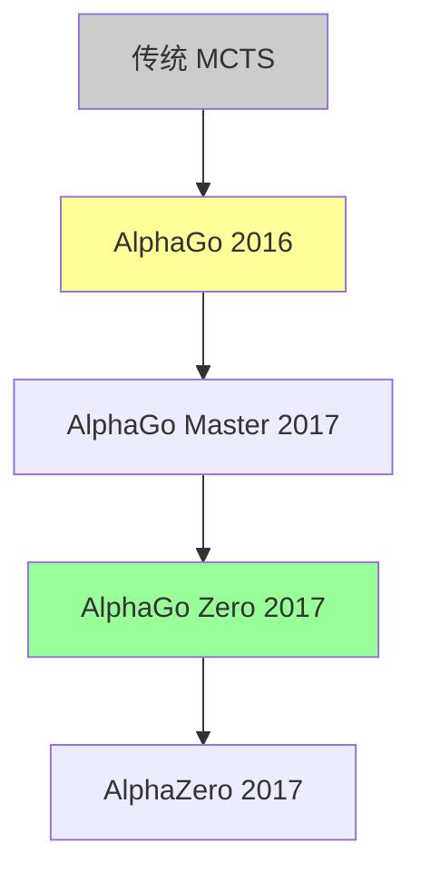
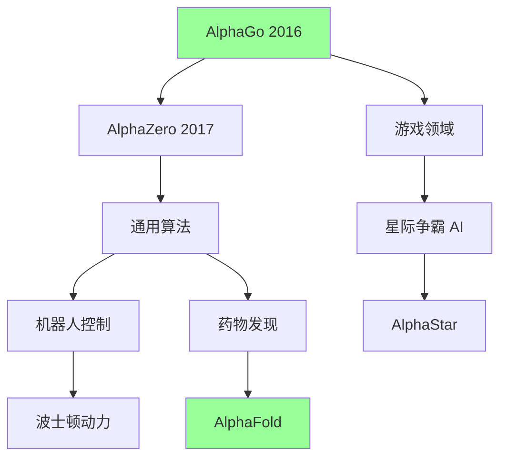

# AlphaGo 深度解读 (Mastering the Game of Go)

> **一句话理解**: AlphaGo 像是一位结合了"棋谱记忆"和"自我对弈"的天才围棋手——它既学习了人类几千年积累的围棋智慧，又通过与自己下棋发现了人类从未想到的新招数，最终在围棋上战胜了人类冠军。

---

## 论文基本信息

| 属性 | 内容 |
|------|------|
| **核心论文** | Mastering the Game of Go with Deep Neural Networks and Tree Search |
| **作者** | David Silver, Aja Huang 等 (DeepMind) |
| **发表** | Nature 2016 |
| **核心贡献** | 结合深度学习与蒙特卡洛树搜索，首次击败人类职业围棋冠军 |
| **影响** | AI 战胜人类的里程碑，深度 RL 的巅峰之作 |

---

## 1. 为什么围棋是 AI 的圣杯？

### 1.1 围棋为什么难？

| 对比 | 国际象棋 | 围棋 |
|------|---------|------|
| 棋盘大小 | 8×8 = 64 格 | 19×19 = 361 点 |
| 合法位置数 | ~20 | ~250 |
| 每步选择 | 约 35 种 | 约 250 种 |
| 搜索树大小 | ~35^80 | ~250^150 |
| 总游戏数 | ~10^47 | ~10^170 |

```
围棋的复杂度:
- 比宇宙中原子数量还多（10^170 vs 10^80）
- 无法用暴力搜索穷举
- 需要"直觉"和"大局观"
```

### 1.2 之前的方法为什么失败？

```
【传统 AI 方法】
暴力搜索 (Minimax): 在围棋上不可行（搜索树太大）
专家系统: 无法捕捉围棋的微妙之处

【之前最好的 AI】
Zen/CrazyStone: 蒙特卡洛树搜索 (MCTS) + 手工特征
业余水平: 约 5-6 段（远低于职业）

【人类水平】
职业九段: 顶尖高手
AlphaGo 之前: 没有 AI 能战胜职业选手
```

---

## 2. AlphaGo 的核心组件



### 2.1 策略网络 (Policy Network)

**任务**: 预测专业棋手会下在哪

```
输入: 棋盘 19×19 × 48 特征（我方棋子、敌方棋子、气、征子等）
  ↓
13 个卷积层 + ReLU
  ↓
输出: 19×19 概率分布（每个位置的概率）
```

| 策略网络类型 | 训练方式 | 速度 | 精度 |
|-------------|---------|------|------|
| SL 策略网络 | 监督学习（人类棋谱） | 3ms | 57% |
| Rollout 策略 | 线性 softmax | 2μs | 24% |

### 2.2 价值网络 (Value Network)

**任务**: 评估当前局面的胜率

```
输入: 与策略网络相同
  ↓
14 个卷积层 + ReLU
  ↓
单个标量输出: [0, 1] 胜率
```

---

## 3. 训练流程

### 阶段 1: 监督学习 (SL)

```
目标: 让 AI 学习人类的"棋感"

训练数据:
- 16万职业棋手对局
- 3000万步棋盘状态

损失函数: 交叉熵
最大化: P(人类下一步 | 当前局面)

结果:
- 网络能以 57% 准确率预测人类落子
- 但这还不够强（业余水平）
```

### 阶段 2: 强化学习 (RL)

```
目标: 让 AI 超越人类水平

自我对弈:
1. 用 SL 网络初始化
2. 让当前网络 vs 随机早期版本
3. 胜者 +1，败者 -1
4. 更新网络参数

关键: 通过自己和自己下棋，发现人类没走过的棋！

经过这个过程:
- RL 策略网络大幅超越 SL 网络
- 胜率从 0% 提升到 80%+ vs SL
```

### 阶段 3: 价值网络训练

```
目标: 评估局面好坏

训练数据:
- 自我对弈产生的 3000万 对局
- 每个局面 → 最终胜负标签

之前的问题:
- 直接从棋谱学习会导致过拟合（因为相邻局面高度相关）
- 解决: 用独立的对局数据

结果:
- 价值网络能准确预测胜率
- 误差: 约 0.3-0.4 子/局
```

### 阶段 4: 蒙特卡洛树搜索 (MCTS)

```
MCTS = 模拟 + 统计置信度

传统 MCTS 在围棋上效果不好（因为分支太多）
AlphaGo 的创新:

1. 用策略网络剪枝（减少搜索分支）
2. 用价值网络评估（减少模拟次数）
3. UCT 公式加入先验概率

公式:
a_t = argmax [Q(s,a) + u(s,a)]

其中 u(s,a) ∝ P(s,a) / (1 + N(s,a))

P(s,a) = 策略网络给出的先验概率
N(s,a) = 访问次数
Q(s,a) = 平均价值
```



---

## 4. 对战李世石

### 4.1 比赛结果

| 局数 | AlphaGo 胜 | 李世石 胜 | 备注 |
|------|-----------|----------|------|
| 第1局 | ✓ | | AlphaGo 复杂局面失误后逆转 |
| 第2局 | ✓ | | 著名的"神之一手" |
| 第3局 | ✓ | | 完美的全局控制 |
| 第4局 | | ✓ | 李世石第78手妙手 |
| 第5局 | ✓ | | 稳定的收官 |

**最终比分: 4:1**

### 4.2 第2局的神之一手 (第37手)

```
局面: AlphaGo 执黑

传统观念: 应该在右边上边落子
AlphaGo 选择: 左下角星位外侧

这手棋:
- 不符合任何人类定式
- 被认为"亏损"的位置
- 但 AlphaGo 的计算显示这是全局最优

后来被证明:
- 这手棋改变了棋局流向
- 成为经典手筋
- 人类棋手开始研究这手棋的含义

这说明: AI 能发现人类几千年来忽视的棋！
```

---

## 5. AlphaGo Zero (2017)

### 5.1 与 AlphaGo 的区别

| 对比 | AlphaGo (2016) | AlphaGo Zero (2017) |
|------|---------------|---------------------|
| 训练数据 | 人类棋谱 | 从零开始 |
| 特征 | 人工设计 48 个 | 原始棋盘 17 个 |
| 策略网络 | SL + RL | 只有一个 RL |
| 价值网络 | 单独训练 | 与策略共享部分 |
| 硬件 | 48 TPU | 4 TPU |
| 对战 AlphaGo | - | 100:0 |

### 5.2 AlphaGo Zero 的创新



```
关键创新:
1. 不使用任何人类棋谱
2. 只用规则和自我对弈
3. 40天后超越所有早期版本
4. 证明了: 人类知识可能是限制
```

---

## 6. 技术演进



| 版本 | 特点 | 成就 |
|------|------|------|
| AlphaGo | SL + RL + MCTS | 战胜李世石 |
| AlphaGo Master | 在线学习 | 战胜柯洁 60:0 |
| AlphaGo Zero | 完全自学 | 从零超越所有版本 |
| AlphaZero | 通用意图 | 围棋/象棋/将棋通用 |

---

## 7. 核心技术总结

| 技术 | 作用 | 创新点 |
|------|------|--------|
| 深度卷积网络 | 学习棋盘表示 | 首次用于围棋 |
| 策略网络 | 预测落子位置 | 降低搜索宽度 |
| 价值网络 | 评估局面胜率 | 减少搜索深度 |
| MCTS | 平衡探索利用 | 融合 RL 和搜索 |
| 自我对弈 | 超人类水平 | 发现新棋谱 |

---

## 8. 为什么必读？

```
【科学价值】
- 证明了深度 RL 可以达到超人类水平
- 展示了监督学习和强化学习结合的力量
- 为通用 AI 研究提供了思路

【工程价值】
- 第一个在复杂策略游戏上战胜人类的 AI
- 验证了"自我对弈"作为训练范式的可行性
- 启发了机器人、自动驾驶等领域

【哲学价值】
- AI 可以发现人类几千年没发现的真理
- "直觉"可以被深度网络近似
- 重新思考人类专家知识的作用
```

---

## 9. 后续影响



| 应用 | 项目 | 说明 |
|------|------|------|
| 蛋白质折叠 | AlphaFold | 预测蛋白质结构 |
| 数学 | AlphaTensor | 发现新矩阵算法 |
| 芯片设计 | AlphaChip | 优化芯片布局 |

---

*本文是 [README.md](../../README.md) 的补充，适合想深入理解 AlphaGo 和深度 RL 原理的读者。*
*原始论文: [Mastering the Game of Go with Deep Neural Networks and Tree Search](https://www.nature.com/articles/nature16961)*

## Related

- [[_concepts/reinforcement-learning]] — 强化学习基础
- [[_concepts/deep-reinforcement-learning]] — 深度强化学习
- [[_concepts/ai-agents]] — AI 智能体

- [[20_Papers_and_Research/README|22 经典与必读 AI 论文清单 (Essential AI Papers)]]
