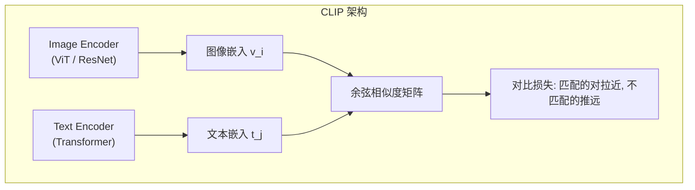

# CLIP 深度解读 (Learning Transferable Visual Models From Natural Language Supervision)

> **一句话理解**: CLIP 让 AI 同时「看懂」图片和「读懂」文字，并把它们放在同一个语义空间里——一张猫的照片和"一只猫"这句话在这个空间里很近，这就是多模态 AI 的基础。

---

## 论文基本信息

| 属性 | 内容 |
|------|------|
| **论文标题** | Learning Transferable Visual Models From Natural Language Supervision |
| **作者** | Alec Radford, Jong Wook Kim, Chris Hallacy, Aditya Ramesh 等 (OpenAI) |
| **发表** | ICML 2021 |
| **引用量** | 25,000+ (截至 2026) |
| **论文链接** | [arXiv:2103.00020](https://arxiv.org/abs/2103.00020) |
| **代码** | [github.com/openai/CLIP](https://github.com/openai/CLIP) |

---

## 1. 核心思想

### 1.1 从有监督到自然语言监督

```
传统图像分类:
├── 标签空间固定 (ImageNet 1000 类)
├── 只能识别训练过的类别
├── 需要人工标注 (昂贵)
└── 泛化到新类别 = 零能力

CLIP 的方法:
├── 用自然语言作为标签 ("一张狗的照片" / "a photo of a dog")
├── 标签空间 = 所有可能的文本 (无限!)
├── 利用互联网图文对 (不需要人工标注)
└── 零样本迁移到任意类别

训练数据来源:
├── 4 亿图文对 (从互联网收集)
├── WIT (Wikipedia image-text)
└── 无需人工标注 → 可扩展到任意规模
```

### 1.2 对比学习架构



```
对比学习损失 (InfoNCE):

给定一个 batch 的 N 个图文对: {(I₁,T₁), (I₂,T₂), ..., (Iₙ,Tₙ)}

正样本: (Iᵢ, Tᵢ) — 同一对
负样本: (Iᵢ, Tⱼ) 其中 i≠j — 不匹配的对

Loss = -1/N Σᵢ [log exp(sim(vᵢ,tᵢ)/τ) / Σⱼ exp(sim(vᵢ,tⱼ)/τ)
               + log exp(sim(tᵢ,vᵢ)/τ) / Σⱼ exp(sim(tᵢ,vⱼ)/τ)]

其中:
- vᵢ = ImageEncoder(Iᵢ) 归一化后的图像嵌入
- tⱼ = TextEncoder(Tⱼ) 归一化后的文本嵌入
- sim(v,t) = v·t (余弦相似度)
- τ = 可学习的温度参数

直觉:
┌──────────────────────────────────────────────────────┐
│  对比学习的直觉:                                       │
│                                                      │
│  "这张图片对应哪段文字？"                               │
│  "这段文字对应哪张图片？"                               │
│                                                      │
│  在 batch 内，只有正确的图文对应该相似                  │
│  其他所有组合都不应该相似                                │
│                                                      │
│  效果: 图像空间和文本空间被对齐                          │
│  → "猫的图片" ≈ "a photo of a cat"                   │
│  → "猫的图片" ≈ "一只可爱的猫咪"                       │
│  → "猫的图片" ≉ "一辆红色汽车"                         │
└──────────────────────────────────────────────────────┘
```

---

## 2. 零样本推理

### 2.1 零样本分类

```
CLIP 零样本分类流程:

1. 准备类别名称 → 转化为文本提示
   "狗" → "a photo of a dog"
   "猫" → "a photo of a cat"
   ...

2. 用 Text Encoder 编码所有类别文本
   t₁ = TextEncoder("a photo of a dog")
   t₂ = TextEncoder("a photo of a cat")
   ...

3. 用 Image Encoder 编码待分类图片
   v = ImageEncoder(image)

4. 计算余弦相似度
   s₁ = cos(v, t₁)   # 图片与"狗"的相似度
   s₂ = cos(v, t₂)   # 图片与"猫"的相似度
   ...

5. 选择相似度最高的类别
   预测 = argmax(s₁, s₂, ...)

优势: 不需要任何训练数据，只需类别名称!
```

```python
import clip
import torch
from PIL import Image

# 加载 CLIP
model, preprocess = clip.load("ViT-B/32", device="cpu")

# 准备图像
image = preprocess(Image.open("cat.jpg")).unsqueeze(0)

# 准备文本提示
text_prompts = [
    "a photo of a cat",
    "a photo of a dog",
    "a photo of a car",
    "a photo of a person",
]
text = clip.tokenize(text_prompts)

# 推理
with torch.no_grad():
    image_features = model.encode_image(image)
    text_features = model.encode_text(text)
    
    # 归一化
    image_features /= image_features.norm(dim=-1, keepdim=True)
    text_features /= text_features.norm(dim=-1, keepdim=True)
    
    # 相似度
    similarity = (image_features @ text_features.T)
    probs = similarity.softmax(dim=-1)

for prompt, prob in zip(text_prompts, probs[0]):
    print(f"{prompt}: {prob:.4f}")
# 输出: "a photo of a cat: 0.98" ← 正确!
```

---

## 3. CLIP 的影响

### 3.1 下游应用

```
CLIP 催生的技术生态:

┌─────────────────────────────────────────────────────────────────┐
│  文本生成图像 (Text-to-Image):                                    │
│  ├── DALL-E 2: CLIP 文本编码 + 扩散模型                          │
│  ├── Stable Diffusion: CLIP text encoder → U-Net 条件            │
│  └── Imagen: T5-XXL 文本编码 + 级联扩散                          │
│                                                                 │
│  图像编辑:                                                        │
│  ├── CLIP-guided StyleGAN: 文本控制生成图像的编辑                 │
│  ├── InstructPix2Pix: 文本指令编辑图像                             │
│  └── DragGAN: CLIP 特征引导图像操作                               │
│                                                                 │
│  视觉问答 / 图像描述:                                             │
│  ├── BLIP / BLIP-2: CLIP + 语言模型                              │
│  ├── LLaVA: CLIP 视觉编码 + LLM                                  │
│  └── Flamingo: CLIP + Perceiver Resampler + LLM                 │
│                                                                 │
│  检索:                                                            │
│  ├── 文本搜索图像 (用文字找图片)                                   │
│  ├── 图像搜索图像 (用图片找相似图片)                               │
│  └── 视频检索 (用文字找视频片段)                                   │
│                                                                 │
│  开放世界检测:                                                     │
│  ├── Grounding DINO: CLIP + 目标检测                             │
│  └── SAM (Segment Anything): CLIP 增强分割                       │
└─────────────────────────────────────────────────────────────────┘
```

### 3.2 CLIP 的变体与改进

| 模型 | 改进点 | 年份 |
|------|--------|------|
| ALIGN (Google) | 更大训练数据 (18 亿图文对) | 2021 |
| FILIP | 细粒度 token 级匹配 | 2021 |
| SigLIP (Google) | Sigmoid 替代 Softmax (更高效) | 2023 |
| EVA-CLIP | 更大 ViT + MIM 预训练 | 2023 |
| SigLIP-2 | 改进训练策略 + 自训练 | 2025 |
| InternVL | 中国团队大规模多模态 | 2024 |
| MetaCLIP | 开源复现 + 数据质量过滤 | 2023 |

---

## 4. 局限性

```
CLIP 的主要局限:

1. 组合性理解弱
   "红球上的蓝方块" vs "蓝球上的红方块" → CLIP 难以区分
   原因: 全局文本编码，不建模词序/空间关系

2. 计数不准
   "三只猫" vs "五只猫" → CLIP 难以区分
   原因: 对比学习不关注数量细节

3. 空间关系弱
   "猫在桌子上" vs "桌子在猫上" → CLIP 难以区分
   原因: 文本编码不建模空间语义

4. 偏见问题
   训练数据中的社会偏见会被学习到
   例: "doctor" 更匹配男性图片

5. 对抗攻击脆弱
   打印对抗补丁 → 让 CLIP 把图片分类为任意类别
```

---

## 相关资源

- [[05_NLP_LLMs/Multimodal_Models/Native_Multimodal_Architectures|多模态模型]] — 多模态模型
- [[Diffusion_Models_Deep_Dive]] — 扩散模型 (CLIP 在 Stable Diffusion 中的应用)
- [[Attention_Is_All_You_Need_Deep_Dive]] — Transformer (CLIP 的骨干架构)

---

*最后更新: 2026-06-04*
