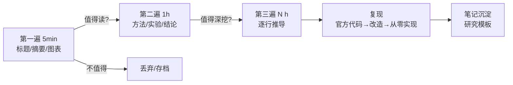

# 论文精读速览 (Paper Reading in a Nutshell)

> 中文简称：论文精读速览

> **一句话理解**: 读论文不是从头读到尾，而是"三遍过滤"——第一遍决定读不读，第二遍抓住主思路，第三遍才逐行推导和复现。

---

## TL;DR

- **三遍阅读法**: 5 分钟筛选（标题/摘要/图表）→ 1 小时理解（方法/实验）→ 数小时精读（推导/复现）
- **本章版图**: 11 个主题目录，从架构经典（Transformer/BERT）到前沿（DeepSeek-V3）
- **必读起点**: Attention Is All You Need 是现代 AI 的"创世论文"，值得逐行精读
- **复现优先级**: 先跑通官方代码 → 再改数据 → 最后从零实现核心模块
- **工具链**: Papers With Code 找基线，模板化笔记沉淀（本章提供研究模板）
- **选读原则**: 跟着引用链读上游，跟着 SOTA 榜单读下游

---

## 1. 三遍阅读法速查

| 遍数 | 时间 | 读什么 | 产出 |
|------|------|--------|------|
| 第一遍 | 5-10 分钟 | 标题、摘要、图 1、结论 | 读/不读的决定 |
| 第二遍 | 约 1 小时 | 方法主体、实验设置、消融 | 能向别人复述主思路 |
| 第三遍 | 数小时-数天 | 公式推导、附录、代码 | 能挑出假设漏洞、能复现 |

完整方法论: [[20_论文精读/01_研读指南/03_论文_Reading_and_Reproduction_指南|论文阅读与复现指南]]

---

## 2. 十一大主题版图

| 目录 | 主题 | 代表论文/内容 |
|------|------|---------------|
| [[20_论文精读/01_研读指南/INDEX|01 研究指南]] | 方法论与模板 | 阅读法、复现流程、笔记模板 |
| [[20_论文精读/02_模型架构/INDEX|02 架构]] | 模型架构经典 | Transformer、BERT、LLaMA、Mamba、MoE |
| [[20_论文精读/03_规模扩展/INDEX|03 扩展定律]] | Scaling Laws | Chinchilla、涌现能力 |
| [[20_论文精读/04_效率优化/INDEX|04 效率]] | 训练/推理效率 | FlashAttention、LoRA |
| [[20_论文精读/05_LLM推理研究/INDEX|05 推理研究]] | LLM 推理优化 | 投机解码、KV Cache |
| [[20_论文精读/06_对齐研究/INDEX|06 对齐]] | RLHF 与对齐 | InstructGPT、DPO |
| [[20_论文精读/07_强化学习/INDEX|07 强化学习]] | RL 经典 | DQN、PPO、AlphaGo 系 |
| [[20_论文精读/08_计算机视觉/INDEX|08 视觉]] | CV 经典 | ResNet、ViT、扩散模型 |
| [[20_论文精读/09_前沿探索/INDEX|09 前沿]] | 最新技术报告 | DeepSeek-V3 技术报告 |
| [[20_论文精读/10_检索技术/INDEX|10 检索]] | RAG 研究 | RAG 原始论文、检索增强 |
| [[20_论文精读/11_领域综述/INDEX|11 领域综述]] | Survey 精选 | 各领域系统综述 |

---

## 3. 必读经典 · 最小闭环

| 优先级 | 论文 | 为什么必读 | 精读入口 |
|--------|------|-----------|----------|
| ⭐⭐⭐ | Attention Is All You Need | 现代 AI 的地基 | [[20_论文精读/02_模型架构/01_注意力_Is_All_You_Need_深入分析|Transformer 精读]] |
| ⭐⭐⭐ | BERT | 预训练-微调范式确立 | [[20_论文精读/02_模型架构/02_BERT_深入分析|BERT 精读]] |
| ⭐⭐ | LLaMA | 开源 LLM 的起点 | [[20_论文精读/02_模型架构/04_LLaMA_深入分析|LLaMA 精读]] |
| ⭐⭐ | MoE | 稀疏化扩展主流路线 | [[20_论文精读/02_模型架构/Mixture_of_Experts_Deep_Dive|MoE 精读]] |
| ⭐⭐ | DeepSeek-V3 | 2026 开源效率标杆 | [[20_论文精读/09_前沿探索/DeepSeek_V3_Technical_Report|DeepSeek-V3 报告]] |
| ⭐ | Word2Vec | 理解 embedding 的源头 | [[20_论文精读/02_模型架构/07_Word2Vec_深入分析|Word2Vec 精读]] |

---

## 4. 复现工作流

| 阶段 | 动作 | 避坑点 |
|------|------|--------|
| 1. 跑通 | clone 官方仓库，复现 README 结果 | 锁定依赖版本，别急着改代码 |
| 2. 对齐 | 用小数据集验证指标趋势一致 | 随机种子、数据预处理差异是最大坑 |
| 3. 改造 | 换自己的数据/任务 | 一次只改一个变量 |
| 4. 从零 | 手写核心模块（如 attention） | 与官方实现逐层对拍数值 |

找代码基线: [[20_论文精读/01_研读指南/05_论文_With_Code_概览|Papers With Code 概览]]

---

## 5. 笔记沉淀

- 每篇精读用统一模板：问题 → 方法 → 实验 → 局限 → 可借鉴点
- 模板直接取用: [[20_论文精读/01_研读指南/Research_Template|研究笔记模板]]
- 读论文的方法论体系: [[20_论文精读/README.md|方法论索引]]

---

## 延伸阅读 (Further Reading)

| 主题 | 说明 | 入口 |
|------|------|------|
| 章节总览 | 全部主题与论文清单 | [[20_论文精读/index|论文精读首页]] |
| 研究入门 | 面向新手的研究指引 | [[20_论文精读/01_研读指南/Research_README|研究指南 README]] |
| 前沿追踪 | 最新技术报告精读 | [[20_论文精读/09_前沿探索/index|Frontier 目录]] |

---

*Last updated: 2026-07-27*

## 相关链接

- [[20_论文精读/index|论文精读首页]] — 章节总览
- [[20_论文精读/README|论文精读小白指南]] — 零基础版
- [[05_大模型/index|大模型]] — 论文对应的技术体系
- [[19_业界观点/index|业界观点]] — 论文作者们在说什么
- [[90_学习/index|学习中心]] — 配套学习路径

## 核心知识体系

| 知识层 | 核心内容 | 深度要求 | 学习优先级 |
|--------|----------|----------|------------|
| 基础理论 | 核心概念/数学原理/基本定义 | 深入理解并能推导 | P0 |
| 核心方法 | 主流算法/技术路线/框架工具 | 熟练掌握并能应用 | P0 |
| 工程实践 | 系统设计/性能优化/生产部署 | 独立完成项目 | P1 |
| 前沿研究 | 最新论文/技术趋势/开放问题 | 了解并跟踪 | P2 |
| 行业应用 | 落地案例/最佳实践/经验教训 | 参考并借鉴 | P1 |

## 技术路线对比

| 维度 | 经典方法 | 深度学习方法 | 大模型方法 | 选型建议 |
|------|----------|--------------|------------|----------|
| 数据需求 | 少量标注 | 大量标注 | 海量预训练 | 按数据规模 |
| 计算成本 | 低 | 中-高 | 极高 | 按预算约束 |
| 泛化能力 | 有限 | 良好 | 优秀 | 按任务复杂度 |
| 可解释性 | 高 | 低 | 极低 | 按合规要求 |
| 部署难度 | 简单 | 中等 | 复杂 | 按运维能力 |
| 迭代速度 | 快 | 中 | 慢 | 按业务节奏 |

## 常见问题FAQ

| 问题 | 解答 |
|------|------|
| 如何快速入门该领域? | 先建立直觉(可视化/类比)，再学数学原理，最后代码实现 |
| 需要哪些前置知识? | 线性代数+概率统计+微积分+Python编程基础 |
| 如何选择学习资源? | 经典教材打基础+顶会论文跟前沿+开源项目练实战 |
| 理论学习和实践如何平衡? | 7:3比例——70%时间理解原理，30%时间动手验证 |
| 如何评估自己的掌握程度? | 能向他人清晰解释+能独立实现+能解决变体问题 |

## 核心术语速查

| 术语 | 含义 | 关联概念 |
|------|------|----------|
| Loss Function | 衡量预测与真实值差距 | 交叉熵/MSE/对比损失 |
| Gradient Descent | 沿负梯度方向更新参数 | SGD/Adam/学习率 |
| Overfitting | 模型在训练集过好但泛化差 | 正则化/Dropout/早停 |
| Batch Size | 每次更新的样本数 | 收敛速度/显存/噪声 |
| Epoch | 完整遍历训练集一次 | 训练轮次/早停 |
| Fine-tuning | 在预训练模型上继续训练 | 迁移学习/LoRA/全量 |
| Inference | 模型前向传播产生输出 | 延迟/吞吐/量化 |
| Token | 文本处理的最小单元 | BPE/SentencePiece |

## 推荐资源

| 类型 | 资源 | 适用阶段 |
|------|------|----------|
| 教材 | 领域经典教材(花书/CS229等) | 入门-基础 |
| 课程 | Stanford/MIT在线课程 | 入门-进阶 |
| 论文 | 顶会最佳论文+综述 | 进阶-精通 |
| 代码 | PyTorch/HuggingFace官方示例 | 基础-实战 |
| 社区 | 技术博客+论文读书会 | 全阶段 |
| 竞赛 | Kaggle/天池/学术竞赛 | 基础-进阶 |

## 检查清单

- [ ] 核心概念能向他人清晰解释
- [ ] 数学原理能独立推导
- [ ] 核心算法能手写实现
- [ ] 主流框架和工具已掌握
- [ ] 完成至少一个端到端项目
- [ ] 能阅读和理解领域论文
- [ ] 了解最新技术趋势和开放问题
- [ ] 知识已文档化沉淀
