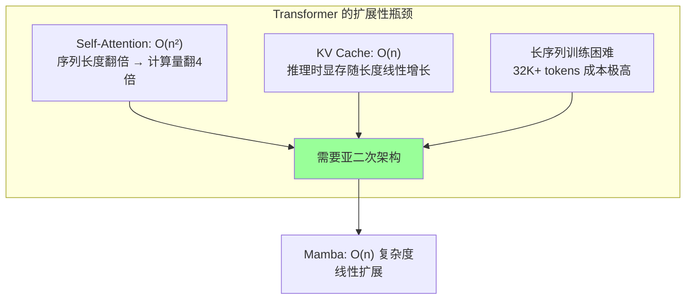
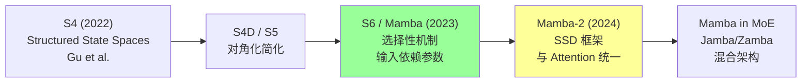
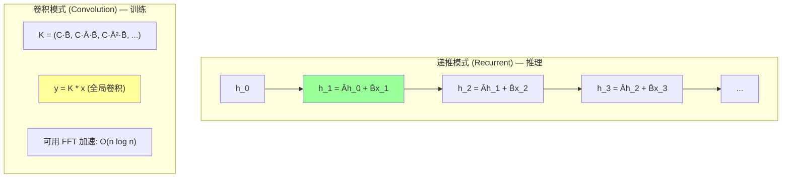
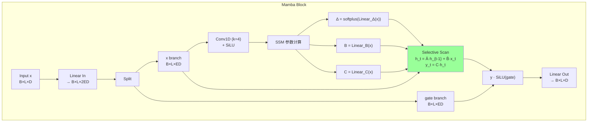
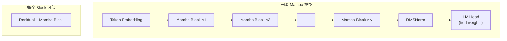
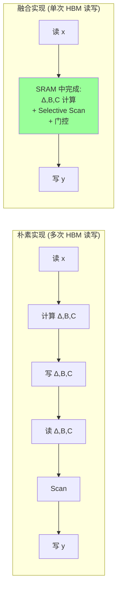
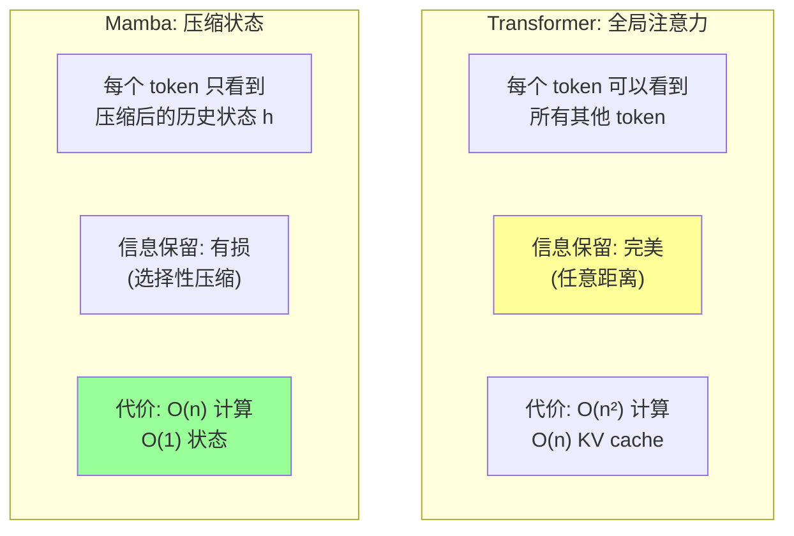
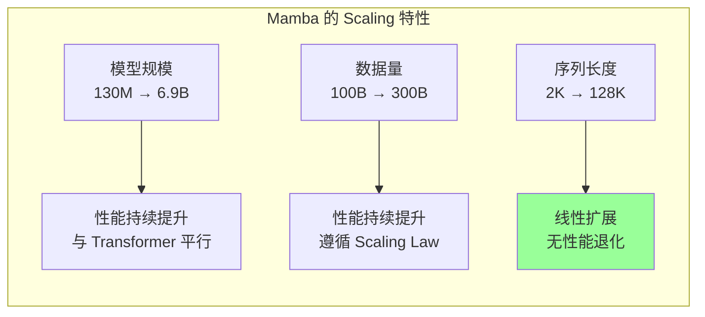
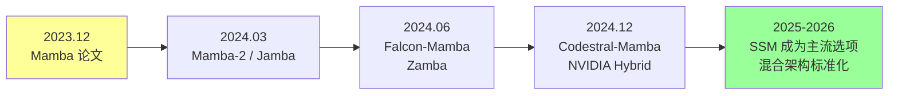

# Mamba 论文精读: Selective State Space Models

> 中文简称：Mamba 论文精读

> **一句话理解**: Mamba 就像一个"会选择性记忆"的读者——它不像 Transformer 那样把整本书摊开在桌上随时翻阅（O(n²) 注意力），而是像人一样只记住关键信息、忘掉无关细节（O(n) 状态压缩），从而用线性时间处理任意长度的序列。

---

## 论文基本信息

| 属性 | 内容 |
|------|------|
| **标题** | Mamba: Linear-Time Sequence Modeling with Selective State Spaces |
| **作者** | Albert Gu, Tri Dao (Carnegie Mellon University, Princeton University) |
| **发表** | arXiv preprint, 2023; COLM 2024 (正式发表) |
| **引用量** | 6,000+ (截至 2026) |
| **论文链接** | [arXiv:2312.00752](https://arxiv.org/abs/2312.00752) |
| **代码** | [github.com/state-spaces/mamba](https://github.com/state-spaces/mamba) |
| **核心贡献** | 提出 Selective SSM，使状态空间模型具备输入依赖的选择能力，首次在语言建模上匹敌 Transformer |

---

## 1. 历史背景：为什么需要 Mamba？

### 1.1 Transformer 的二次复杂度瓶颈

[[Attention_Is_All_You_Need_Deep_Dive|Transformer]] 自 2017 年以来统治了序列建模，但其核心 Self-Attention 机制有根本性限制：



### 1.2 后 Transformer 架构的探索

| 方法 | 年份 | 复杂度 | 问题 |
|------|------|--------|------|
| Linear Attention | 2020 | O(n) | 质量显著下降 |
| Performer | 2020 | O(n) | 近似误差大 |
| RWKV | 2023 | O(n) | 缺乏选择性 |
| RetNet | 2023 | O(n) | 多尺度衰减固定 |
| Hyena | 2023 | O(n log n) | 卷积核设计复杂 |
| **Mamba (S4→S6)** | 2023 | **O(n)** | **本文** |

### 1.3 从 S4 到 Mamba 的演进



### 1.4 S4 的局限：为什么需要"选择性"？

```
S4 (Structured State Spaces for Sequence Modeling, 2022):

S4 的成就:
    - 在 Long Range Arena 上超越 Transformer
    - 线性复杂度 O(n)
    - 可以处理 16K+ 长度序列

S4 的致命缺陷:
    - 参数是固定的 (input-independent)
    - 对所有输入使用相同的 A, B, C 矩阵
    - 无法根据内容选择"记住什么、忘掉什么"
    - 在语言建模 (需要内容感知) 上表现差

类比:
    S4 = 一个固定频率的滤波器 (对所有信号一视同仁)
    Mamba = 一个自适应滤波器 (根据信号内容调整)
    
    这就是"选择性"(Selection) 的含义
```

---

## 2. 核心创新：Selective State Space Model

### 2.1 一句话概括

**Mamba 的核心创新是让 SSM 的参数 (B, C, Δ) 成为输入的函数——模型可以根据当前 token 的内容动态决定"记住什么、遗忘什么、输出什么"，从而获得类似 Attention 的内容感知能力，同时保持线性复杂度。**

### 2.2 状态空间模型基础

#### 2.2.1 连续时间 SSM

经典状态空间模型（来自控制论）：

```
连续时间 SSM:
    h'(t) = A · h(t) + B · x(t)    (状态更新)
    y(t)  = C · h(t) + D · x(t)    (输出)

其中:
    x(t) ∈ R^1    : 输入信号
    h(t) ∈ R^N    : 隐状态 (N 是状态维度)
    y(t) ∈ R^1    : 输出信号
    A ∈ R^{N×N}   : 状态转移矩阵
    B ∈ R^{N×1}   : 输入投影
    C ∈ R^{1×N}   : 输出投影
    D ∈ R^{1×1}   : 直接连接 (类似残差)
```

#### 2.2.2 离散化

将连续 SSM 离散化以处理离散 token 序列：

```
离散化 (Zero-Order Hold):
    Ā = exp(Δ · A)
    B̄ = (Δ · A)^{-1} (exp(Δ · A) - I) · Δ · B ≈ Δ · B (简化)

离散 SSM (递推形式):
    h_t = Ā · h_{t-1} + B̄ · x_t
    y_t = C · h_t

其中 Δ (delta) 是离散化步长，控制"采样频率"
```

#### 2.2.3 两种计算模式



### 2.3 选择性机制 (Selection Mechanism)

#### 2.3.1 核心思想

```
S4 (固定参数):
    A, B, C, Δ 都是训练后固定的参数
    → 对所有输入 token 使用相同的"记忆策略"
    → 无法区分重要信息和噪声

Mamba (选择性参数):
    B = Linear_B(x_t)     ← 输入依赖
    C = Linear_C(x_t)     ← 输入依赖
    Δ = softplus(Linear_Δ(x_t))  ← 输入依赖
    A 保持固定 (结构化)

    → 每个 token 动态决定:
      - B: "这个输入有多少写入状态?" (输入门)
      - C: "从状态中读取什么?" (输出门)
      - Δ: "以什么速率更新状态?" (遗忘门)
```

#### 2.3.2 与 LSTM/GRU 的类比

| 组件 | LSTM | Mamba |
|------|------|-------|
| 遗忘门 | f_t = σ(W_f · [h_{t-1}, x_t]) | Δ_t = softplus(W_Δ · x_t) |
| 输入门 | i_t = σ(W_i · [h_{t-1}, x_t]) | B_t = W_B · x_t |
| 输出门 | o_t = σ(W_o · [h_{t-1}, x_t]) | C_t = W_C · x_t |
| 状态 | c_t ∈ R^d (与隐藏维度相同) | h_t ∈ R^N (N >> d, 扩展状态) |
| 复杂度 | O(n · d²) | O(n · N · d) |

> **关键区别**: LSTM 的状态维度等于隐藏维度 d，而 Mamba 的状态维度 N 可以远大于 d（通常 N=16），且每个通道独立（对角 A），使得计算高效。

### 2.4 数学原理详解

#### 2.4.1 Mamba 的完整公式

```
输入: x ∈ R^{B×L×D}  (batch, length, model_dim)

Step 1: 扩展投影
    x_proj = Linear_in(x)           ∈ R^{B×L×(2·ED)}  (ED = expand_dim)
    x, gate = split(x_proj)         各 ∈ R^{B×L×ED}

Step 2: 深度卷积 (局部上下文)
    x = Conv1D(x, kernel_size=4)    ∈ R^{B×L×ED}
    x = SiLU(x)

Step 3: 计算选择性参数
    Δ = softplus(Linear_Δ(x))       ∈ R^{B×L×ED}
    B = Linear_B(x)                 ∈ R^{B×L×N}
    C = Linear_C(x)                 ∈ R^{B×L×N}

Step 4: 离散化
    Ā = exp(Δ · A)                  ∈ R^{B×L×ED×N}
    B̄ = Δ · B                       ∈ R^{B×L×ED×N}

Step 5: 选择性扫描 (Selective Scan)
    h_t = Ā_t · h_{t-1} + B̄_t · x_t
    y_t = C_t · h_t

Step 6: 门控输出
    y = y · SiLU(gate)              ∈ R^{B×L×ED}
    out = Linear_out(y)             ∈ R^{B×L×D}
```

#### 2.4.2 对角结构化 A 矩阵

```
A 矩阵的设计:

A = diag(A_1, A_2, ..., A_ED)  (块对角)

每个 A_i ∈ R^{N×N} 是对角矩阵:
    A_i = diag(a_1, a_2, ..., a_N)

初始化 (S4D / HiPPO):
    a_n = -n  (n = 1, 2, ..., N)
    
    或 HiPPO 初始化:
    A_{nk} = -(2n+1)^{1/2} · (2k+1)^{1/2}  if n > k
    A_{nk} = -(n+1)                          if n = k
    A_{nk} = 0                               if n < k

意义:
    - 对角化使得 exp(Δ·A) 可以逐元素计算
    - 计算复杂度从 O(N³) 降到 O(N)
    - N 通常取 16 (状态扩展因子)
```

#### 2.4.3 选择性扫描的计算

```
Selective Scan (核心计算):

for t = 1, 2, ..., L:
    Δ_t = softplus(W_Δ · x_t + b_Δ)     # 标量/向量
    B_t = W_B · x_t                       # N 维
    C_t = W_C · x_t                       # N 维
    
    Ā_t = exp(Δ_t · A)                    # 对角矩阵的 exp = 逐元素 exp
    B̄_t = Δ_t · B_t                       # 标量乘向量
    
    h_t = Ā_t ⊙ h_{t-1} + B̄_t · x_t     # 逐元素乘 + 外积
    y_t = C_t^T · h_t                      # 内积

复杂度分析:
    每步: O(N · D)  (N=状态维度, D=模型维度)
    总计: O(L · N · D)  ← 线性于序列长度 L!
    
对比 Transformer:
    Self-Attention: O(L² · D)
    Mamba SSM:      O(L · N · D)
    
    当 L >> N 时 (如 L=128K, N=16):
    Transformer: O(128K² · D) = O(16G · D)
    Mamba:       O(128K · 16 · D) = O(2M · D)
    → 8000x 计算量差距!
```

### 2.5 架构图解





---

## 3. 硬件感知实现

### 3.1 为什么需要硬件感知设计？

```
朴素实现的问题:

Selective Scan 需要:
    1. 读取 x_t (从 HBM)
    2. 计算 Δ_t, B_t, C_t
    3. 更新 h_t (状态)
    4. 计算 y_t
    5. 写回 y_t (到 HBM)

如果按标准深度学习框架实现:
    - 每步都要读写 HBM (高带宽内存)
    - 中间状态 h_t 需要物化 (materialize)
    - 内存带宽成为瓶颈 (而非计算)

GPU 内存层次:
    HBM (80GB, 2TB/s) ← 慢，大
    SRAM (20MB, 19TB/s) ← 快，小
    
    关键: 尽量让计算在 SRAM 中完成!
```

### 3.2 Kernel Fusion 策略



### 3.3 具体优化技术

| 优化 | 描述 | 加速比 |
|------|------|--------|
| **Kernel Fusion** | 将整个 Mamba block 融合为一个 CUDA kernel | 2-3x |
| **Recomputation** | 反向传播时重算中间状态，不存储 | 节省 50% 显存 |
| **Tiling** | 将长序列分块，每块在 SRAM 中处理 | 避免 HBM 瓶颈 |
| **Parallel Scan** | 训练时用并行前缀和替代顺序扫描 | 利用 GPU 并行性 |
| **Memory-efficient** | 不物化 (L, ED, N) 的扩展状态 | 显存 O(1) vs O(L) |

### 3.4 并行扫描算法

```
训练时不能顺序扫描 (太慢)，需要并行化:

顺序扫描: h_t = Ā_t · h_{t-1} + b_t
    → O(L) 步，每步依赖前一步
    → GPU 利用率低

并行前缀和 (Parallel Prefix Sum):
    将扫描转化为结合律操作:
    
    定义: (ā_1, b_1) ⊕ (ā_2, b_2) = (ā_1·ā_2, ā_2·b_1 + b_2)
    
    这个操作满足结合律!
    → 可以用 parallel scan 在 O(log L) 步完成
    → 充分利用 GPU 的并行能力

实际实现:
    - 将长度 L 的序列分成大小为 B_scan 的块
    - 块内: 顺序扫描 (在 SRAM 中)
    - 块间: 并行前缀和
    - 总复杂度: O(L · N · D / P + log(L/B_scan))
      (P = 并行度)
```

### 3.5 与 FlashAttention 的类比

```
Mamba 的硬件感知设计 vs FlashAttention:

FlashAttention (Transformer):
    - 问题: Attention 矩阵 O(n²) 太大，放不下 SRAM
    - 解决: 分块 (tiling) + 在线 softmax
    - 效果: 不物化 n×n 矩阵，显存 O(n)

Mamba Kernel (SSM):
    - 问题: 扩展状态 (L, ED, N) 太大
    - 解决: 融合 kernel + recomputation
    - 效果: 不物化扩展状态，显存 O(1)

共同哲学:
    "不要让中间结果碰 HBM"
    "在 SRAM 中完成尽可能多的计算"
    "用重算换显存"
```

---

## 4. 与 Transformer 的数学对比

### 4.1 复杂度对比

| 操作 | Transformer | Mamba |
|------|------------|-------|
| **训练 (前向)** | O(L² · D) | O(L · N · D) |
| **训练 (反向)** | O(L² · D) | O(L · N · D) |
| **推理 (每 token)** | O(L · D) (KV cache) | O(N · D) (固定状态) |
| **推理显存** | O(L · D) (KV cache) | O(N · D) (固定) |
| **最大序列长度** | 受显存限制 (128K-1M) | 理论无限 |

### 4.2 信息流对比



### 4.3 表达能力分析

```
Transformer 的优势:
    - 精确的长距离依赖 (直接 attention)
    - In-context learning (通过 attention 模式)
    - 检索能力 (精确复制历史 token)

Mamba 的优势:
    - 线性复杂度 (长序列友好)
    - 固定推理显存 (不随长度增长)
    - 连续时间建模 (天然适合信号处理)
    - 训练/推理一致性 (无 KV cache 问题)

Mamba 的劣势:
    - 有损压缩 → 精确检索困难
    - "Needle in a haystack" 测试表现差
    - In-context learning 能力弱于 Transformer
    - 状态维度有限 → 信息瓶颈

关键问题:
    "N=16 的状态维度能否压缩 128K tokens 的信息?"
    → 对于"理解"任务: 通常够用
    → 对于"检索"任务: 明显不足
```

### 4.4 统一视角：Mamba-2 的 SSD 框架

```
Mamba-2 (2024) 揭示了 SSM 与 Attention 的统一:

SSD (State Space Duality) 框架:
    - SSM 的递推形式 ≈ 线性 Attention
    - SSM 的卷积形式 ≈ 结构化 Attention
    - Mamba 是两者的"对偶"

数学联系:
    Linear Attention:  y_t = (Σ_{s<t} v_s · k_s^T) · q_t
    SSM (Mamba):      y_t = C_t · (Σ_{s<t} Ā^{t-s} · B_s · x_s)
    
    当 Ā = I (无衰减): SSM = Linear Attention
    当 Ā = αI (固定衰减): SSM = 指数衰减 Attention
    当 Ā = exp(Δ_t · A) (选择性): SSM = Mamba

意义:
    - Transformer 和 Mamba 不是对立的
    - 它们是同一框架的不同实例化
    - 可以设计混合架构取两者之长
```

---

## 5. 实验结果分析

### 5.1 语言建模结果

| 模型 | 参数量 | 训练数据 | PPL (↓) | 推理速度 |
|------|--------|---------|---------|---------|
| Transformer (Pythia) | 1.3B | 300B tokens | 12.4 | 1x |
| RWKV | 1.5B | 300B tokens | 13.1 | 1.2x |
| RetNet | 1.3B | 300B tokens | 12.8 | 1.1x |
| **Mamba** | **1.4B** | **300B tokens** | **12.0** | **5x** |
| Transformer (Pythia) | 6.9B | 300B tokens | 10.5 | 1x |
| **Mamba** | **6.9B** | **300B tokens** | **10.2** | **5x** |

### 5.2 下游任务 (Zero-shot)

| 任务 | Transformer 1.3B | Mamba 1.4B | Transformer 6.9B | Mamba 6.9B |
|------|-----------------|------------|-----------------|------------|
| HellaSwag | 68.2 | **69.4** | 75.1 | **76.3** |
| PIQA | 76.5 | **77.8** | 80.2 | **81.1** |
| WinoGrande | 65.3 | **66.1** | 72.4 | **73.0** |
| ARC-E | 63.1 | **64.5** | 70.8 | **71.2** |
| LAMBADA | 62.4 | **63.8** | 70.1 | **71.5** |
| **平均** | 67.1 | **68.3** | 73.7 | **74.6** |

### 5.3 推理速度对比

```
推理吞吐量 (tokens/s, A100 GPU):

序列长度 = 128:
    Transformer 1.3B:  1200 tok/s
    Mamba 1.4B:        6000 tok/s  (5x)

序列长度 = 2K:
    Transformer 1.3B:  800 tok/s   (KV cache 开始影响)
    Mamba 1.4B:        5800 tok/s  (几乎不变!)

序列长度 = 16K:
    Transformer 1.3B:  200 tok/s   (KV cache 显存爆炸)
    Mamba 1.4B:        5500 tok/s  (依然线性!)

序列长度 = 128K:
    Transformer 1.3B:  OOM / 30 tok/s
    Mamba 1.4B:        5000 tok/s  (固定状态!)

关键: Mamba 的推理速度几乎不随序列长度变化!
```

### 5.4 Scaling 行为



---

## 6. Mamba-2 与混合架构

### 6.1 Mamba-2: SSD 框架

```
Mamba-2 (2024, Dao & Gu) 的核心改进:

1. 理论统一:
   - 证明 SSM 和结构化 Attention 是对偶的
   - 提出 State Space Duality (SSD) 框架
   - Mamba-2 可以在两种模式间切换

2. 实现改进:
   - 多头结构 (类似 Multi-Head Attention)
   - 更大的状态维度 (N: 16 → 64-256)
   - 更高效的 kernel (利用 tensor cores)

3. 性能提升:
   - 在相同 FLOPs 下优于 Mamba-1
   - 缩小与 Transformer 的质量差距
   - 保持线性复杂度优势
```

### 6.2 混合架构: Mamba + Attention

```mermaid
flowchart TB
    subgraph "Jamba (AI21, 2024)"
        J1["Mamba Layer"] --> J2["Mamba Layer"]
        J2 --> J3["Attention Layer<br/>(每 8 层 1 个)"]
        J3 --> J4["Mamba Layer"]
        J4 --> J5["..."]
    end

    subgraph "Zamba (Zyphra, 2024)"
        Z1["Mamba Layer"] --> Z2["Mamba Layer"]
        Z2 --> Z3["Shared Attention<br/>(每 4 层)"]
        Z3 --> Z4["Mamba Layer"]
    end

    subgraph "Falcon-Mamba (TII, 2024)"
        F1["Mamba Layer"] --> F2["Mamba Layer"]
        F2 --> F3["Mamba Layer"]
        F3 --> F4["...纯 Mamba"]
    end
```



### 6.3 为什么混合架构有效？

```
纯 Mamba 的弱点:
    - 精确检索能力差 (状态压缩有损)
    - In-context learning 弱
    - "Needle in a haystack" 失败

Attention 层的补偿:
    - 少量 Attention 层提供精确检索能力
    - 大部分 Mamba 层提供高效序列建模
    - 最佳比例: 约 1/8 的层用 Attention

实际效果:
    Jamba (52B, 12B active):
        - 上下文窗口: 256K tokens
        - 推理显存: 比纯 Transformer 少 3x
        - 质量: 接近同规模 Transformer
    
    Zamba (7B):
        - 在多项 benchmark 上超越同规模 LLaMA
        - 推理速度提升 2-3x
        - 训练效率提升 40%
```

---

## 7. 2026 SSM 生态

### 7.1 主要模型

| 模型 | 组织 | 参数量 | 架构 | 上下文 | 特点 |
|------|------|--------|------|--------|------|
| **Jamba 1.5** | AI21 | 52B (12B active) | Mamba + Attention + MoE | 256K | 企业级 |
| **Zamba 2** | Zyphra | 7B | Mamba + Shared Attention | 128K | 高效小模型 |
| **Falcon-Mamba** | TII | 7B | 纯 Mamba | 64K | 开源 |
| **NVIDIA Mamba2-Hybrid** | NVIDIA | 8B | Mamba2 + Attention | 128K | 研究 |
| **Codestral-Mamba** | Mistral | 7B | Mamba2 | 256K | 代码专用 |
| **Mamba-Chat** | 社区 | 7B | Mamba + 对齐 | 32K | 对话 |

### 7.2 生态发展时间线



### 7.3 框架支持

```
2026 年 SSM 的工具链:

训练框架:
    - HuggingFace Transformers: Mamba/Mamba2 原生支持
    - Mamba-ssm: 官方 CUDA kernel
    - Triton: 社区 SSM kernel
    - vLLM: Mamba 推理支持

推理引擎:
    - vLLM: 支持 Mamba 模型
    - TensorRT-LLM: NVIDIA 优化
    - llama.cpp: 社区 Mamba 支持 (GGUF)
    - SGLang: 混合架构支持

评估:
    - lm-evaluation-harness: 标准 benchmark
    - RULER: 长上下文评估
    - Needle-in-a-haystack: 检索能力测试
```

---

## 8. SSM 能否取代 Transformer？

### 8.1 争论双方

```
正方 (SSM 将取代 Transformer):
    ✓ 线性复杂度是根本性优势
    ✓ 推理效率差距随长度增大
    ✓ 端侧部署 (手机/IoT) 必须线性
    ✓ 长上下文 (1M+ tokens) 只有 SSM 可行
    ✓ 硬件趋势 favor 线性操作

反方 (Transformer 不可替代):
    ✗ 精确检索是刚需 (RAG, 代码)
    ✗ In-context learning 依赖 Attention
    ✗ 生态系统 (所有框架优化了 Attention)
    ✗ 质量差距仍然存在
    ✗ "够用"不等于"更好"
```

### 8.2 2026 年的共识

```
当前共识 (2026):

1. 纯 Transformer 不会消失:
   - 短-中上下文 (< 32K): Transformer 质量最优
   - 需要精确检索的任务: Attention 不可替代
   - 生态惯性巨大

2. 纯 SSM 有天花板:
   - 信息压缩有损 → 复杂推理受限
   - 检索能力弱 → RAG 场景不适合
   - In-context learning 差距明显

3. 混合架构是趋势:
   - 大部分层用 SSM (效率)
   - 少量层用 Attention (精确检索)
   - MoE 进一步增加效率
   - Jamba/Zamba 模式成为标准

4. 场景分化:
   - 超长上下文 (100K+): SSM 主导
   - 端侧/边缘: SSM 主导
   - 高质量短文本: Transformer 主导
   - 通用: 混合架构
```

### 8.3 未来展望

```
2026-2028 预测:

1. 架构融合:
   - SSM 和 Attention 的界限模糊
   - 统一的 "序列建模原语"
   - 自动搜索最优混合比例

2. 硬件协同:
   - 专用 SSM 加速芯片
   - 线性注意力硬件优化
   - 端侧 SSM 芯片 (手机/汽车)

3. 应用突破:
   - 百万 token 上下文 (整本书/整个代码库)
   - 实时流式处理 (视频/音频)
   - 持续学习 (状态持久化)

4. 与 [[Mixture_of_Experts_Deep_Dive|MoE]] 的结合:
   - SSM 层 + MoE FFN
   - 选择性路由 + 选择性状态
   - 稀疏 + 线性的双重效率
```

---

## 9. 复现指南

### 9.1 环境准备

```bash
# 硬件需求
# GPU: 1x A100 40GB (1.4B 模型训练)
# 或 1x RTX 4090 24GB (130M 模型)

# 安装 Mamba
pip install mamba-ssm
# 或从源码安装 (获取最新 kernel)
pip install git+https://github.com/state-spaces/mamba.git

# 依赖
pip install torch>=2.1.0
pip install transformers>=4.38.0
pip install causal-conv1d>=1.1.0
pip install triton>=2.1.0
```

### 9.2 使用预训练模型

```python
from transformers import AutoModelForCausalLM, AutoTokenizer

# 加载 Falcon-Mamba 7B
model = AutoModelForCausalLM.from_pretrained(
    "tiiuae/falcon-mamba-7b",
    torch_dtype=torch.bfloat16,
    device_map="auto",
)
tokenizer = AutoTokenizer.from_pretrained("tiiuae/falcon-mamba-7b")

# 推理
prompt = "Explain quantum computing in simple terms:"
inputs = tokenizer(prompt, return_tensors="pt").to("cuda")
outputs = model.generate(**inputs, max_new_tokens=256)
print(tokenizer.decode(outputs[0]))
```

### 9.3 从零训练 Mamba

```python
import torch
from mamba_ssm.models.mixer_seq_simple import MambaLMHeadModel, MambaConfig

# 配置 (130M 参数)
config = MambaConfig(
    d_model=768,           # 隐藏维度
    n_layer=24,            # 层数
    vocab_size=50277,      # 词表大小
    ssm_cfg={
        "d_state": 16,     # SSM 状态维度 N
        "d_conv": 4,       # 卷积核大小
        "expand": 2,       # 扩展因子
    },
    rms_norm=True,
    residual_in_fp32=True,
    fused_add_norm=True,
    pad_vocab_size_multiple=8,
)

# 创建模型
model = MambaLMHeadModel(config, device="cuda", dtype=torch.bfloat16)
print(f"Parameters: {sum(p.numel() for p in model.parameters()) / 1e6:.1f}M")

# 训练循环
optimizer = torch.optim.AdamW(model.parameters(), lr=3e-4, weight_decay=0.1)

for batch in dataloader:
    input_ids = batch["input_ids"].cuda()
    labels = input_ids[:, 1:].contiguous()
    inputs = input_ids[:, :-1].contiguous()
    
    # Mamba 前向 (内部处理 causal mask)
    logits = model(inputs).logits
    loss = F.cross_entropy(logits.view(-1, logits.size(-1)), labels.view(-1))
    
    loss.backward()
    optimizer.step()
    optimizer.zero_grad()
```

### 9.4 关键超参数

| 超参数 | 推荐值 | 说明 |
|--------|--------|------|
| `d_state` (N) | 16 | SSM 状态维度，越大表达力越强但越慢 |
| `d_conv` | 4 | 局部卷积核，提供短距离上下文 |
| `expand` | 2 | 内部扩展因子 (ED = expand × D) |
| `d_model` | 768-8192 | 模型隐藏维度 |
| `n_layer` | 24-96 | 层数 |
| `learning_rate` | 3e-4 | 与 Transformer 类似 |
| `batch_size` | 2M tokens | 有效 batch size |

### 9.5 常见陷阱

```
陷阱 1: CUDA kernel 版本不匹配
    症状: Segfault 或 CUDA error
    原因: mamba-ssm 需要特定 CUDA/PyTorch 版本
    解决: 使用官方 Docker 镜像或仔细匹配版本

陷阱 2: 数值不稳定
    症状: Loss 突然变为 NaN
    原因: Δ 的 softplus 可能溢出
    解决: 使用 residual_in_fp32=True, 限制 Δ 范围

陷阱 3: 长序列训练 OOM
    症状: 显存不足
    原因: 虽然 Mamba 是 O(n)，但激活值仍然需要显存
    解决: 使用 gradient checkpointing, 减小 batch size

陷阱 4: 推理时状态管理
    症状: 生成质量随长度下降
    原因: 状态 h 的数值精度累积误差
    解决: 使用 FP32 状态, 定期重置状态

陷阱 5: 与 Transformer 评估不公平
    症状: Mamba 在某些 benchmark 上看起来差
    原因: 评估方式偏向 Attention (如精确检索)
    解决: 使用全面评估 (理解 + 检索 + 生成)
```

---

## 10. 与相关工作对比

### 10.1 架构对比表

| 架构 | 训练复杂度 | 推理复杂度 | 推理显存 | 精确检索 | In-context | 代表模型 |
|------|-----------|-----------|---------|---------|-----------|---------|
| [[Attention_Is_All_You_Need_Deep_Dive\|Transformer]] | O(n²d) | O(nd) | O(nd) | 强 | 强 | GPT-4, LLaMA |
| Linear Attention | O(nd²) | O(d²) | O(d²) | 弱 | 弱 | - |
| RWKV | O(nd) | O(d) | O(d) | 弱 | 中 | RWKV-6 |
| RetNet | O(nd) | O(d²) | O(d²) | 中 | 中 | - |
| **Mamba** | **O(nNd)** | **O(Nd)** | **O(Nd)** | **弱** | **中** | Falcon-Mamba |
| **Mamba-2** | **O(nNd)** | **O(Nd)** | **O(Nd)** | **中** | **中** | Codestral |
| **Hybrid** | **O(nNd + n²d/k)** | **O(Nd + nd/k)** | **O(Nd + nd/k)** | **强** | **强** | Jamba |

### 10.2 与 RNN 的本质区别

```
Mamba vs 传统 RNN (LSTM/GRU):

1. 状态维度:
   RNN:  h ∈ R^d (与隐藏维度相同, 如 4096)
   Mamba: h ∈ R^{ED×N} (扩展状态, 如 1536×16 = 24576)
   → Mamba 的状态容量远大于 RNN

2. 并行性:
   RNN:  严格顺序，无法并行训练
   Mamba: 可用并行扫描训练 (类似 Attention)
   → Mamba 训练效率接近 Transformer

3. 参数化:
   RNN:  固定参数 (W_h, W_x)
   Mamba: 输入依赖参数 (选择性)
   → Mamba 有内容感知能力

4. 梯度流:
   RNN:  梯度消失/爆炸 (长序列)
   Mamba: 结构化 A 保证稳定梯度
   → Mamba 可以处理超长序列

5. 硬件效率:
   RNN:  矩阵乘法 (GPU 友好)
   Mamba: 逐元素操作 + 扫描 (需要定制 kernel)
   → Mamba 需要硬件感知设计
```

---

## 11. 影响与后续工作

### 11.1 学术影响

| 后续工作 | 年份 | 贡献 |
|---------|------|------|
| Mamba-2 (SSD) | 2024 | 统一 SSM 和 Attention |
| Jamba | 2024 | Mamba + Attention + MoE |
| Video Mamba | 2024 | 视频理解 |
| Vim (Vision Mamba) | 2024 | 视觉分类 |
| Mamba in Speech | 2024 | 语音合成/识别 |
| MambaByte | 2024 | 字节级语言模型 |
| Graph Mamba | 2025 | 图神经网络 |
| Mamba for Time Series | 2025 | 时间序列预测 |

### 11.2 对产业的影响

```
Mamba/SSM 的产业影响:

1. 长上下文应用:
   - 法律文档分析 (100K+ tokens)
   - 代码库理解 (整个 repo)
   - 书籍级对话
   - 成本: 比 Transformer 低 5-10x

2. 端侧部署:
   - 手机上的 LLM (固定显存)
   - 车载 AI (实时处理)
   - IoT 设备 (资源受限)
   - Mamba 的固定状态 = 可预测的资源使用

3. 实时流式处理:
   - 实时翻译 (无 KV cache 增长)
   - 视频理解 (连续帧处理)
   - 音频流 (无限长度)
   - 传感器数据 (持续监控)

4. 训练效率:
   - 长序列训练成本降低
   - 相同预算训练更多数据
   - 小团队也能训练长上下文模型
```

---

## 12. 相关概念

- [[Attention_Is_All_You_Need_Deep_Dive|Attention Is All You Need 深度解读]] — Mamba 的挑战对象
- [[LLaMA_Deep_Dive|LLaMA 深度解读]] — Transformer 架构的代表
- [[Mixture_of_Experts_Deep_Dive|MoE 深度解读]] — 与 Mamba 结合的稀疏化方法
- [[BERT_Deep_Dive|BERT 深度解读]] — 双向建模 (Mamba 也可双向)
- [[Scaling_Laws_Deep_Dive|Scaling Laws]] — Mamba 的 scaling 行为
- [[FlashAttention_Deep_Dive|FlashAttention 深度解读]] — 类似的硬件感知设计哲学
- [[LoRA_Deep_Dive|LoRA 深度解读]] — Mamba 模型的微调方法

---

## 13. 总结

| 维度 | 要点 |
|------|------|
| **核心创新** | 选择性机制让 SSM 具备输入依赖的内容感知能力 |
| **数学本质** | 输入依赖的线性递推 + 对角结构化状态转移 |
| **最大优势** | 线性复杂度 + 固定推理显存 + 5x 推理加速 |
| **最大劣势** | 有损压缩 → 精确检索能力弱于 Attention |
| **适用场景** | 长序列、端侧部署、实时流式处理 |
| **不适用** | 需要精确检索的任务 (纯 Mamba) |
| **产业趋势** | 混合架构 (Mamba + 少量 Attention) 成为主流 |
| **历史地位** | 后 Transformer 时代最有力的架构挑战者 |

> **一句话总结**: Mamba 证明了"选择性记忆"比"完美记忆"更高效——它用 O(1) 的状态压缩替代了 O(n) 的 KV cache，以微小的质量代价换取了数量级的效率提升，开创了"线性序列建模"的新时代。在 2026 年，SSM 与 Attention 的融合已成为架构设计的主流范式。
