# LLaMA 深度解读 (Open and Efficient Foundation Language Models)

> 中文简称：LLaMA 深度解读

> **一句话理解**: LLaMA 就像 AI 领域的"开源革命先锋"——Meta 用纯公开数据训练出媲美 GPT-3 的模型并开放权重，证明了数据质量比数量更重要、小模型也能打大模型，直接引爆了开源大模型的黄金时代。

---

## 论文基本信息

| 属性 | 内容 |
|------|------|
| **标题** | LLaMA: Open and Efficient Foundation Language Models |
| **作者** | Hugo Touvron, Thibaut Lavril, Gautier Izacard 等 (Meta AI) |
| **发表** | 2023 年 2 月 (arXiv 预印本) |
| **引用量** | 12,000+ (截至 2026) |
| **论文链接** | [arXiv:2302.13971](https://arxiv.org/abs/2302.13971) |
| **代码** | [Meta 官方](https://github.com/meta-llama/llama) |

---

## 1. 历史背景：开源 LLM 的黎明

### 1.1 LLaMA 之前的格局

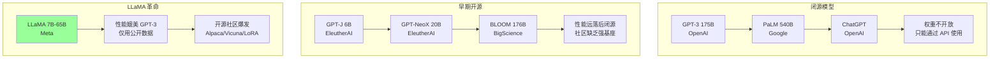

### 1.2 为什么 LLaMA 如此重要？

| 维度 | LLaMA 之前 | LLaMA 之后 |
|------|-----------|-----------|
| **模型获取** | 只有 API，无权重 | 权重开放，本地部署 |
| **研究自由度** | 受限于 API 功能 | 完全访问模型内部 |
| **定制化** | 无法修改 | LoRA/QLoRA 微调 |
| **社区创新** | 分散、低效 | 在 LLaMA 基础上快速迭代 |
| **数据透明度** | 训练数据未知 | 全部使用公开数据 |

### 1.3 LLaMA 的核心论点

> **"More data beats more parameters"**（更多数据胜过更多参数）

Chinchilla Scaling Laws (Hoffmann et al., 2022) 指出：给定计算预算，最优策略是**更小的模型 + 更多的训练数据**。LLaMA 是这一理论的工程验证。

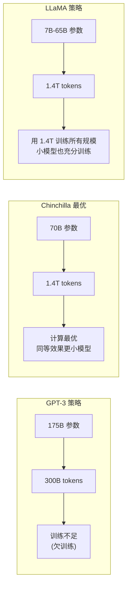

---

## 2. 核心创新：架构改进与数据工程

### 2.1 训练数据：数据质量的极致追求

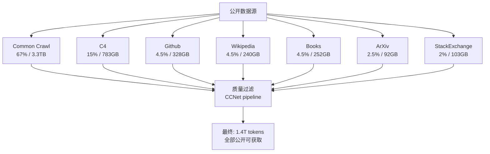

**数据处理关键步骤**：

| 步骤 | 方法 | 目的 |
|------|------|------|
| **语言识别** | fastText 分类器 | 保留英文为主的多语言数据 |
| **质量过滤** | CCNet + n-gram 困惑度 | 去除低质量网页内容 |
| **去重** | MinHash + LSH | 消除重复文档 |
| **有害内容过滤** | 安全分类器 | 移除仇恨/暴力/色情内容 |
| **代码数据** | GitHub 开源代码 | 编程能力 |

**数据比例的设计逻辑**：

```
为什么 Wikipedia 和 Books 占比高？
→ 这些是高质量、经过人工编辑的内容
→ 对知识密集型任务（问答、推理）帮助最大

为什么加入 GitHub 代码？
→ 代码训练提升逻辑推理能力
→ 帮助模型学习结构和规则

为什么 Common Crawl 占比最大但质量过滤最严？
→ 网页数据量巨大但质量参差
→ 过滤后只保留高质量部分
```

### 2.2 模型架构：三大关键改进

LLaMA 在标准 Transformer Decoder 基础上做了三项重要改进：

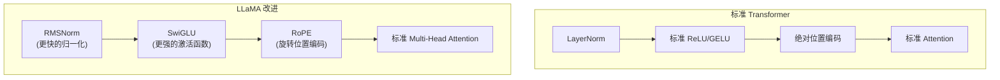

#### 2.2.1 RMSNorm（Root Mean Square Normalization）

$$
\text{RMSNorm}(x) = \frac{x}{\sqrt{\frac{1}{d}\sum_{i=1}^{d}x_i^2 + \epsilon}} \cdot g
$$

| 对比 | LayerNorm | RMSNorm |
|------|-----------|---------|
| **公式** | $\frac{x - \mu}{\sigma} \cdot \gamma + \beta$ | $\frac{x}{\text{RMS}(x)} \cdot g$ |
| **计算** | 需要计算均值和方差 | 只需计算 RMS |
| **参数** | $\gamma$ 和 $\beta$ | 只有 $g$ |
| **速度** | 基准 | **快 ~7-64%** |
| **效果** | 基准 | 基本相同 |

#### 2.2.2 SwiGLU 激活函数

$$
\text{SwiGLU}(x, W, V, b, c) = (\text{Swish}(xW + b) \otimes (xV + c))
$$

$$
\text{Swish}(x) = x \cdot \sigma(\beta x) = x \cdot \frac{1}{1 + e^{-\beta x}}
$$

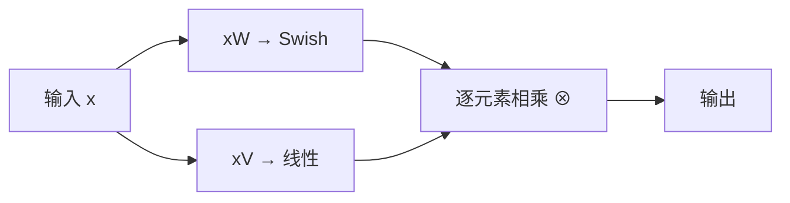

| 激活函数 | 公式 | 特点 |
|---------|------|------|
| **ReLU** | $\max(0, x)$ | 简单，但有"死亡 ReLU"问题 |
| **GELU** | $x \cdot \Phi(x)$ | BERT 使用，平滑但计算复杂 |
| **Swish** | $x \cdot \sigma(\beta x)$ | 自门控，无上界 |
| **SwiGLU** | $\text{Swish}(xW) \otimes (xV)$ | GLU 变体，PaLM 验证最优 |

#### 2.2.3 RoPE（Rotary Position Embedding）

$$
\begin{pmatrix} q_m \\ q_{m+1} \end{pmatrix} = \begin{pmatrix} \cos m\theta & -\sin m\theta \\ \sin m\theta & \cos m\theta \end{pmatrix} \begin{pmatrix} q_m \\ q_{m+1} \end{pmatrix}
$$

**RoPE 的核心优势**：

| 特性 | 绝对位置编码 (BERT) | RoPE (LLaMA) |
|------|-------------------|--------------|
| **位置信息** | 绝对位置 | 相对位置 |
| **外推性** | 差（固定长度） | 好（可外推） |
| **计算方式** | 加法 | 旋转矩阵乘法 |
| **长序列** | 受限于训练长度 | 理论上可扩展 |

```python
import torch
import torch.nn as nn
import math

class RotaryPositionEmbedding(nn.Module):
    def __init__(self, dim, max_seq_len=2048, base=10000):
        super().__init__()
        inv_freq = 1.0 / (base ** (torch.arange(0, dim, 2).float() / dim))
        self.register_buffer("inv_freq", inv_freq)
        self.max_seq_len = max_seq_len
        self._build_cache(max_seq_len)
    
    def _build_cache(self, seq_len):
        t = torch.arange(seq_len, device=self.inv_freq.device).type_as(self.inv_freq)
        freqs = torch.outer(t, self.inv_freq)
        emb = torch.cat([freqs, freqs], dim=-1)
        self.register_buffer("cos_cached", emb.cos())
        self.register_buffer("sin_cached", emb.sin())
    
    def forward(self, x, seq_len=None):
        if seq_len is None:
            seq_len = x.shape[2]
        return (
            self.cos_cached[:seq_len].to(x.dtype),
            self.sin_cached[:seq_len].to(x.dtype),
        )

def apply_rotary_emb(x, cos, sin):
    d = x.shape[-1] // 2
    x1, x2 = x[..., :d], x[..., d:]
    rotated = torch.cat([-x2, x1], dim=-1)
    return x * cos + rotated * sin
```

### 2.3 LLaMA 模型家族规格

| 模型 | 层数 | d_model | 注意力头数 | FFN 维度 | 参数量 | 训练 tokens |
|------|------|---------|-----------|---------|--------|------------|
| **LLaMA 7B** | 32 | 4096 | 32 | 11008 | 6.7B | 1.4T |
| **LLaMA 13B** | 40 | 5120 | 40 | 13824 | 13.0B | 1.4T |
| **LLaMA 33B** | 60 | 6656 | 52 | 17920 | 32.5B | 1.4T |
| **LLaMA 65B** | 80 | 8192 | 64 | 22016 | 65.2B | 1.4T |

---

## 3. 架构详解

### 3.1 LLaMA Transformer Block

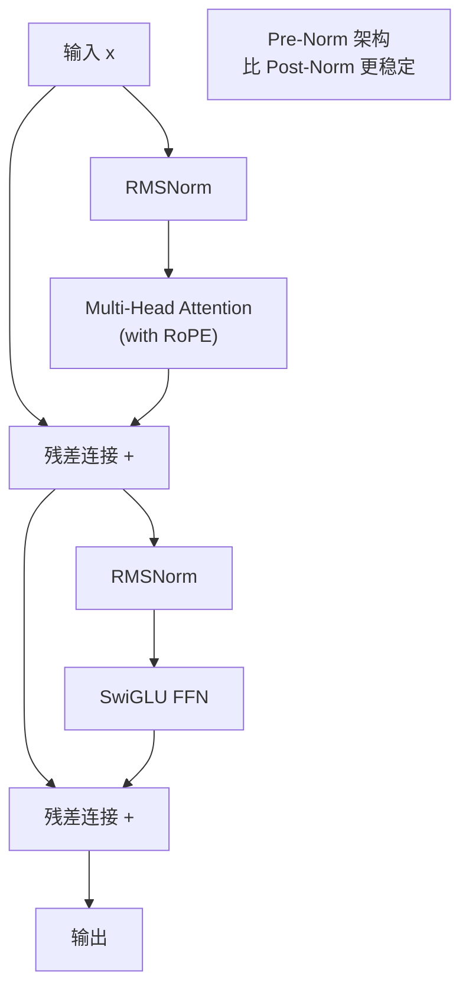

### 3.2 完整架构图

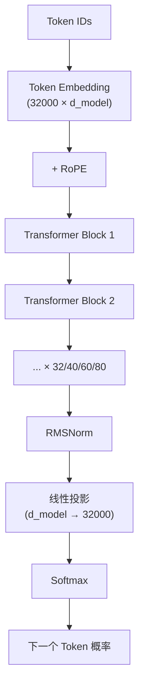

### 3.3 参数量计算 (LLaMA 7B)

```python
d_model = 4096
n_layers = 32
n_heads = 32
ffn_dim = 11008
vocab_size = 32000

# 1. Token Embedding
emb_params = vocab_size * d_model  # 32000 * 4096 = 131M

# 2. 每个 Transformer 层
# Attention: Q, K, V, O projections = 4 * d_model^2
attn_params = 4 * d_model * d_model  # 67.1M

# SwiGLU FFN: three projections (gate, up, down)
# gate: d_model → ffn_dim, up: d_model → ffn_dim, down: ffn_dim → d_model
ffn_params = 3 * d_model * ffn_dim  # 3 * 4096 * 11008 = 135.3M

# RMSNorm: 2 per layer, each d_model params
norm_params = 2 * d_model  # 8.2K

layer_total = attn_params + ffn_params + norm_params  # ≈ 202.4M
all_layers = n_layers * layer_total  # 32 * 202.4M ≈ 6.48B

# 3. Final RMSNorm + LM Head
final_norm = d_model  # 4.1K
lm_head = vocab_size * d_model  # 131M (or tied with embedding)

total = emb_params + all_layers + final_norm + lm_head
print(f"嵌入层:  {emb_params / 1e9:.2f}B")
print(f"每层:    {layer_total / 1e9:.3f}B")
print(f"所有层:  {all_layers / 1e9:.2f}B")
print(f"总参数:  {total / 1e9:.2f}B")
```

---

## 4. 训练细节

### 4.1 训练配置

| 配置项 | LLaMA 7B | LLaMA 65B |
|--------|----------|-----------|
| **GPU 数量** | 1,024 A100 | 2,048 A100 |
| **训练时长** | ~82,432 GPU 小时 | ~1,432,256 GPU 小时 |
| **Batch Size** | 4M tokens | 4M tokens |
| **学习率** | 3e-4 | 1.5e-4 |
| **学习率调度** | 余弦衰减至 10% 峰值 | 余弦衰减至 10% 峰值 |
| **预热** | 2000 步 | 2000 步 |
| **梯度裁剪** | 1.0 | 1.0 |
| **权重衰减** | 0.1 | 0.1 |
| **序列长度** | 2048 | 2048 |
| **Dropout** | 0.0 | 0.0 |

### 4.2 训练成本估算

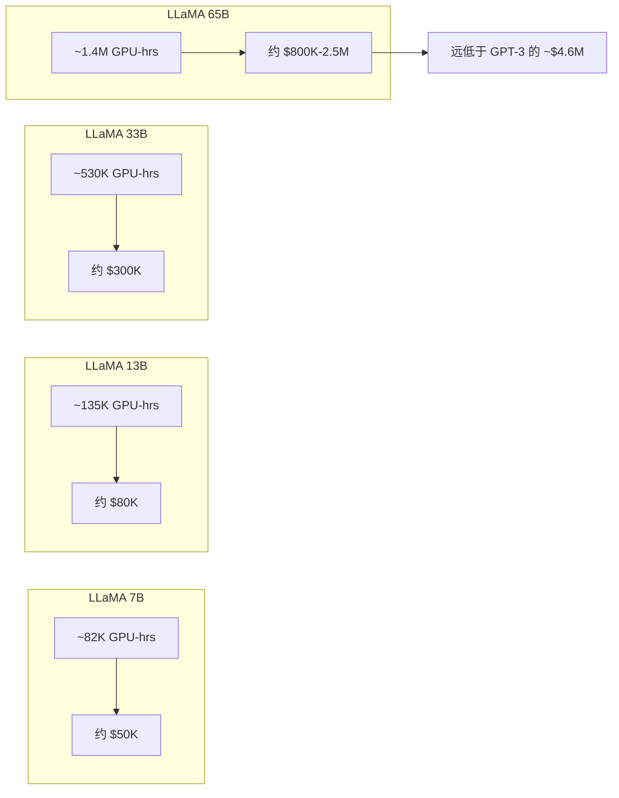

### 4.3 Scaling 行为

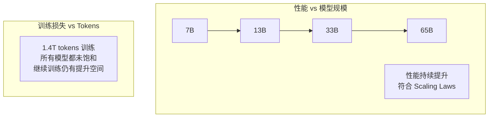

**关键发现**：

| 模型 | 在所有任务上的趋势 | 是否饱和 |
|------|-------------------|---------|
| LLaMA 7B | 持续下降 | 否 |
| LLaMA 13B | 持续下降 | 否 |
| LLaMA 33B | 持续下降 | 否 |
| LLaMA 65B | 持续下降 | 否 |

**结论**：即使经过 1.4T tokens 的训练，所有规模的模型仍能从更多训练数据中受益。

---

## 5. 性能对比

### 5.1 与 GPT-3 的对比

| 基准测试 | GPT-3 175B | LLaMA 13B | LLaMA 65B |
|---------|-----------|-----------|-----------|
| **BoolQ** | 60.5 | 73.3 | 79.6 |
| **PIQA** | 81.0 | 79.8 | 82.8 |
| **HellaSwag** | 78.9 | 76.2 | 81.2 |
| **WinoGrande** | 70.2 | 71.1 | 75.5 |
| **ARC-e** | 64.6 | 72.8 | 77.4 |
| **ARC-c** | 41.4 | 50.0 | 58.2 |
| **MMLU (5-shot)** | 43.9 | 47.0 | 63.4 |

**惊人结论**：LLaMA-13B 在多数基准上超越 GPT-3 (175B)，而参数量只有其 1/13！

### 5.2 性能-效率权衡

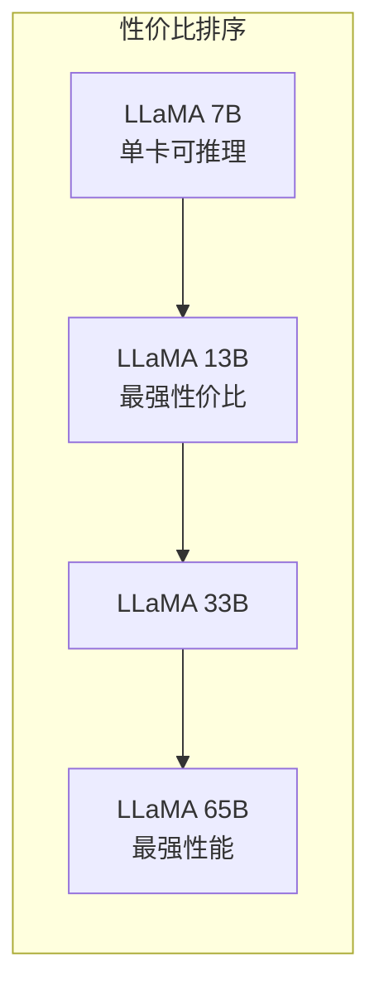

---

## 6. LLaMA 2：RLHF 与 GQA

### 6.1 LLaMA 2 的核心改进

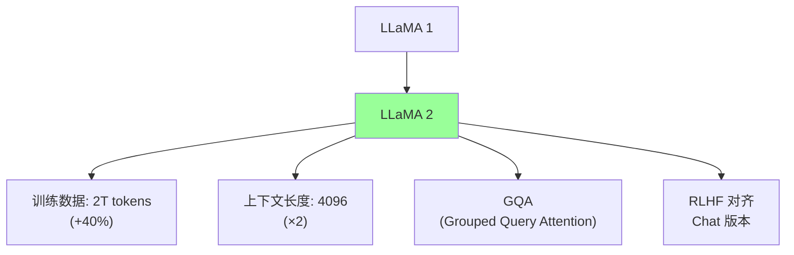

| 改进 | LLaMA 1 | LLaMA 2 | 影响 |
|------|---------|---------|------|
| **训练数据** | 1.4T tokens | 2T tokens | 更充分训练 |
| **上下文长度** | 2048 | 4096 | 处理更长文本 |
| **注意力机制** | MHA | GQA (34B/70B) | 推理加速 |
| **模型规模** | 7B/13B/33B/65B | 7B/13B/70B | 70B 替代 33B/65B |
| **对齐** | 无 | RLHF (Chat 版) | 对话能力 |
| **词表大小** | 32K | 32K | 不变 |

### 6.2 GQA (Grouped Query Attention)

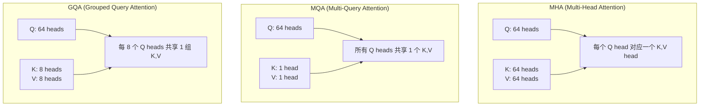

| 注意力类型 | KV Heads | 推理速度 | 质量 | 使用场景 |
|-----------|----------|---------|------|---------|
| **MHA** | 64 | 基准 | 最好 | 训练质量优先 |
| **MQA** | 1 | 最快 | 略降 | 极致推理速度 |
| **GQA** | 8 | 较快 | 接近 MHA | LLaMA 2 的平衡选择 |

### 6.3 LLaMA 2 Chat：RLHF 三阶段

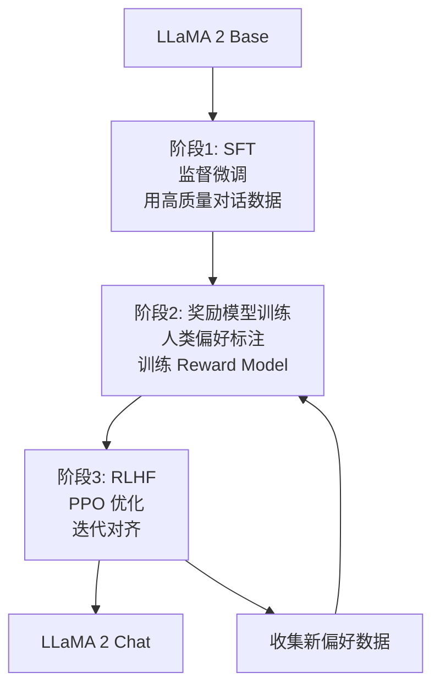

---

## 7. LLaMA 3：多模态与更大规模

### 7.1 LLaMA 3 的核心升级

| 属性 | LLaMA 2 | LLaMA 3 |
|------|---------|---------|
| **最大模型** | 70B | 405B |
| **词表大小** | 32K | **128K** |
| **上下文长度** | 4K | **8K → 128K** (RoPE 缩放) |
| **训练数据** | 2T tokens | **15T+ tokens** |
| **多语言** | 主要英文 | 30+ 语言 |
| **多模态** | 无 | 图像/视频/音频 |
| **GQA** | 34B/70B | 所有版本 |

### 7.2 LLaMA 3 的架构微调

```python
# LLaMA 3 的关键变化
llama3_changes = {
    "vocab_size": 128256,       # 32K → 128K (BPE with tiktoken)
    "rope_base": 500000.0,      # RoPE base 从 10000 提升到 500000
    "tie_embeddings": False,    # 不共享 embedding 和 lm_head
    "gqa": True,                # 所有规模使用 GQA
}
```

---

## 8. 代码实战

### 8.1 使用 HuggingFace Transformers 加载 LLaMA

```python
from transformers import LlamaTokenizer, LlamaForCausalLM
import torch

model_id = "meta-llama/Llama-2-7b-chat-hf"

tokenizer = LlamaTokenizer.from_pretrained(model_id)
model = LlamaForCausalLM.from_pretrained(
    model_id,
    torch_dtype=torch.float16,
    device_map="auto",
)

prompt = "解释量子计算的基本原理："
inputs = tokenizer(prompt, return_tensors="pt").to(model.device)

with torch.no_grad():
    outputs = model.generate(
        **inputs,
        max_new_tokens=256,
        temperature=0.7,
        top_p=0.9,
        do_sample=True,
    )

response = tokenizer.decode(outputs[0], skip_special_tokens=True)
print(response)
```

### 8.2 手动实现 LLaMA Block

```python
import torch
import torch.nn as nn
import torch.nn.functional as F
import math

class RMSNorm(nn.Module):
    def __init__(self, dim, eps=1e-6):
        super().__init__()
        self.eps = eps
        self.weight = nn.Parameter(torch.ones(dim))
    
    def forward(self, x):
        norm = torch.rsqrt(x.pow(2).mean(-1, keepdim=True) + self.eps)
        return x * norm * self.weight


class RotaryEmbedding(nn.Module):
    def __init__(self, dim, max_seq_len=4096, base=10000):
        super().__init__()
        self.dim = dim
        inv_freq = 1.0 / (base ** (torch.arange(0, dim, 2).float() / dim))
        self.register_buffer("inv_freq", inv_freq)
        t = torch.arange(max_seq_len).float()
        freqs = torch.outer(t, inv_freq)
        self.register_buffer("cos_cached", freqs.cos())
        self.register_buffer("sin_cached", freqs.sin())
    
    def forward(self, seq_len):
        return self.cos_cached[:seq_len], self.sin_cached[:seq_len]


def rotate_half(x):
    x1, x2 = x[..., :x.shape[-1] // 2], x[..., x.shape[-1] // 2:]
    return torch.cat([-x2, x1], dim=-1)

def apply_rotary_pos_emb(q, k, cos, sin):
    q_embed = (q * cos) + (rotate_half(q) * sin)
    k_embed = (k * cos) + (rotate_half(k) * sin)
    return q_embed, k_embed


class LlamaAttention(nn.Module):
    def __init__(self, d_model, n_heads):
        super().__init__()
        self.n_heads = n_heads
        self.head_dim = d_model // n_heads
        
        self.q_proj = nn.Linear(d_model, d_model, bias=False)
        self.k_proj = nn.Linear(d_model, d_model, bias=False)
        self.v_proj = nn.Linear(d_model, d_model, bias=False)
        self.o_proj = nn.Linear(d_model, d_model, bias=False)
        
        self.rotary_emb = RotaryEmbedding(self.head_dim)
    
    def forward(self, x, attention_mask=None):
        bsz, seq_len, _ = x.shape
        
        q = self.q_proj(x).view(bsz, seq_len, self.n_heads, self.head_dim).transpose(1, 2)
        k = self.k_proj(x).view(bsz, seq_len, self.n_heads, self.head_dim).transpose(1, 2)
        v = self.v_proj(x).view(bsz, seq_len, self.n_heads, self.head_dim).transpose(1, 2)
        
        cos, sin = self.rotary_emb(seq_len)
        cos = cos.unsqueeze(0).unsqueeze(0)
        sin = sin.unsqueeze(0).unsqueeze(0)
        q, k = apply_rotary_pos_emb(q, k, cos, sin)
        
        scores = torch.matmul(q, k.transpose(-2, -1)) / math.sqrt(self.head_dim)
        
        if attention_mask is not None:
            scores = scores + attention_mask
        
        attn = F.softmax(scores, dim=-1)
        output = torch.matmul(attn, v)
        output = output.transpose(1, 2).contiguous().view(bsz, seq_len, -1)
        return self.o_proj(output)


class LlamaMLP(nn.Module):
    def __init__(self, d_model, ffn_dim):
        super().__init__()
        self.gate_proj = nn.Linear(d_model, ffn_dim, bias=False)
        self.up_proj = nn.Linear(d_model, ffn_dim, bias=False)
        self.down_proj = nn.Linear(ffn_dim, d_model, bias=False)
    
    def forward(self, x):
        return self.down_proj(F.silu(self.gate_proj(x)) * self.up_proj(x))


class LlamaDecoderLayer(nn.Module):
    def __init__(self, d_model, n_heads, ffn_dim):
        super().__init__()
        self.input_layernorm = RMSNorm(d_model)
        self.self_attn = LlamaAttention(d_model, n_heads)
        self.post_attention_layernorm = RMSNorm(d_model)
        self.mlp = LlamaMLP(d_model, ffn_dim)
    
    def forward(self, x, attention_mask=None):
        residual = x
        x = self.input_layernorm(x)
        x = self.self_attn(x, attention_mask)
        x = residual + x
        
        residual = x
        x = self.post_attention_layernorm(x)
        x = self.mlp(x)
        x = residual + x
        return x


class LlamaModel(nn.Module):
    def __init__(self, vocab_size=32000, d_model=4096, n_layers=32, n_heads=32, ffn_dim=11008):
        super().__init__()
        self.embed_tokens = nn.Embedding(vocab_size, d_model)
        self.layers = nn.ModuleList([
            LlamaDecoderLayer(d_model, n_heads, ffn_dim) for _ in range(n_layers)
        ])
        self.norm = RMSNorm(d_model)
        self.lm_head = nn.Linear(d_model, vocab_size, bias=False)
    
    def forward(self, input_ids, attention_mask=None):
        x = self.embed_tokens(input_ids)
        for layer in self.layers:
            x = layer(x, attention_mask)
        x = self.norm(x)
        logits = self.lm_head(x)
        return logits


if __name__ == "__main__":
    model = LlamaModel()
    total = sum(p.numel() for p in model.parameters())
    print(f"总参数量: {total / 1e9:.2f}B")
    
    x = torch.randint(0, 32000, (1, 64))
    with torch.no_grad():
        out = model(x)
    print(f"输入: {x.shape} → 输出: {out.shape}")
```

### 8.3 使用 LoRA 微调 LLaMA

```python
from peft import LoraConfig, get_peft_model, TaskType
from transformers import LlamaForCausalLM

model = LlamaForCausalLM.from_pretrained(
    "meta-llama/Llama-2-7b-hf",
    torch_dtype=torch.float16,
    device_map="auto",
)

lora_config = LoraConfig(
    task_type=TaskType.CAUSAL_LM,
    r=16,
    lora_alpha=32,
    lora_dropout=0.05,
    target_modules=["q_proj", "v_proj", "k_proj", "o_proj", "gate_proj", "up_proj", "down_proj"],
)

peft_model = get_peft_model(model, lora_config)
peft_model.print_trainable_parameters()

trainable = sum(p.numel() for p in peft_model.parameters() if p.requires_grad)
total = sum(p.numel() for p in peft_model.parameters())
print(f"可训练参数: {trainable:,} / {total:,} ({100*trainable/total:.2f}%)")
```

---

## 9. 影响与后续工作

### 9.1 LLaMA 引发的开源生态

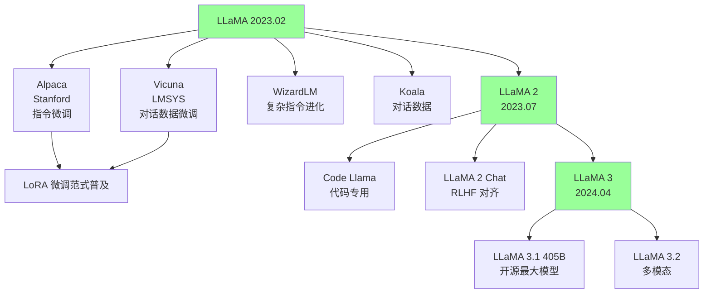

### 9.2 开源 LLM 生态对比

| 模型 | 发布时间 | 参数量 | 开放程度 | 特色 |
|------|---------|--------|---------|------|
| **LLaMA** | 2023.02 | 7B-65B | 权重 (研究) | 开源 LLM 起点 |
| **LLaMA 2** | 2023.07 | 7B-70B | 权重 + 商用许可 | RLHF, GQA |
| **Mistral 7B** | 2023.09 | 7B | 权重 + Apache 2.0 | 滑动窗口注意力 |
| **Mixtral 8x7B** | 2023.12 | 47B (13B 活跃) | 权重 + Apache 2.0 | MoE 架构 |
| **LLaMA 3** | 2024.04 | 8B/70B | 权重 + 许可 | 128K 词表 |
| **LLaMA 3.1** | 2024.07 | 8B/70B/405B | 权重 + 许可 | 开源最大 |
| **Qwen 2.5** | 2024.09 | 0.5B-72B | 权重 + Apache 2.0 | 中文最强开源 |
| **DeepSeek V3** | 2024.12 | 671B (37B 活跃) | 权重 + MIT | MoE + MLA |

### 9.3 LLaMA 对 AI 行业的深远影响

| 影响 | 说明 |
|------|------|
| **民主化** | 让学术界和小公司也能研究大模型 |
| **微调生态** | LoRA/QLoRA 的普及让定制化变得廉价 |
| **评估标准** | LMSYS Chatbot Arena 成为权威评估 |
| **数据质量** | 证明了数据质量 > 数据数量 |
| **开源文化** | 确立了"开源权重"的行业惯例 |

---

## 10. 面试问题（FAQ）

### Q1: LLaMA 为什么不用 BERT 的双向注意力？

> **答**: LLaMA 是**生成式**语言模型，使用因果 (Causal) 注意力——每个 token 只能看到之前的 token。这因为：
> 1. **生成任务需求**：自回归生成需要从左到右逐词预测
> 2. **通用性**：生成模型覆盖的任务范围比理解模型更广
> 3. **2024+ 共识**：Decoder-only 架构已成为 LLM 标准选择

### Q2: RoPE 相比绝对位置编码有什么优势？

> **答**: RoPE 的核心优势：
> 1. **相对位置编码**：Attention 分数只依赖相对位置 $m - n$，而非绝对位置
> 2. **长度外推**：通过 NTK-aware 缩放或 YaRN 可以处理比训练时更长的序列
> 3. **数学优雅**：通过旋转矩阵自然编码位置，无需额外参数
> 4. **远程衰减**：随相对距离增大，Attention 权重自然衰减

### Q3: SwiGLU 比 ReLU 好在哪里？

> **答**: SwiGLU 的优势来自两方面：
> - **Swish 激活**：平滑、非单调、自门控，没有 ReLU 的"死亡"问题
> - **GLU 门控**：通过可学习的门控机制动态控制信息流
> 
> 实验验证 (PaLM 论文)：SwiGLU 在同等计算预算下比 ReLU 和 GELU 都好。代价是 FFN 需要三个投影矩阵而非两个。

### Q4: LLaMA 2 的 GQA 为什么选择 8 个 KV 头？

> **答**: 这是速度与质量的平衡：
> - **1 个 KV 头 (MQA)**：推理最快，但质量下降较多
> - **8 个 KV 头 (GQA-8)**：推理速度提升 ~2×，质量接近 MHA
> - **64 个 KV 头 (MHA)**：质量最好，但 KV Cache 是推理瓶颈
> 
> 实验表明 GQA-8 几乎没有质量损失，但显著减少 KV Cache 大小。

### Q5: 为什么 LLaMA 不用 Dropout？

> **答**: LLaMA 所有模型都设置 Dropout = 0，原因：
> 1. **数据量巨大**：1.4T+ tokens 已经足够大，不太可能过拟合
> 2. **正则化效果**：SGD 噪声 + Batch 随机性已提供隐式正则化
> 3. **训练效率**：去掉 Dropout 加速收敛
> 4. **实验验证**：消融实验显示 Dropout=0 效果最好

### Q6: LLaMA 和 GPT-3 的关键区别是什么？

| 维度 | GPT-3 | LLaMA |
|------|-------|-------|
| **开放性** | 闭源 (仅 API) | 开源权重 |
| **训练数据** | 混合来源 (部分私有) | 全部公开数据 |
| **架构改进** | 标准 Transformer | RMSNorm + SwiGLU + RoPE |
| **数据效率** | 300B tokens | 1.4T tokens (4.7×) |
| **性价比** | $4.6M / 175B | $2.5M / 65B (更强) |

### Q7: 如何在消费级 GPU 上运行 LLaMA？

> **答**: 通过量化和优化技术：
> 
> | 方法 | 显存需求 (7B) | 显存需求 (70B) |
> |------|--------------|--------------|
> | FP16 | ~14 GB | ~140 GB |
> | 8-bit (GPTQ/AWQ) | ~7 GB | ~35 GB |
> | 4-bit (GGUF) | ~4 GB | ~20 GB |
> | **推荐工具** | llama.cpp / Ollama | vLLM / TGI |

---

## 11. 与其他章节的关联

### 前置知识
- [Attention Is All You Need 深度解读](./01_注意力_Is_All_You_Need_深入分析.md) — Transformer 基础架构
- [GPT-3 深度解读](../03_规模扩展/02_GPT3_深入分析.md) — Decoder-only 架构与 Scaling Laws
- [BERT 深度解读](./02_BERT_深入分析.md) — 预训练-微调范式的对比

### 横向关联
- [LLM 架构](../05_大模型/05_LLM架构/) — 现代大模型架构设计
- [RLHF 与 DPO 深度解读](../06_对齐研究/RLHF_03_DPO_深入分析.md) — LLaMA 2 Chat 的 RLHF 对齐
- [Mixture of Experts 深度解读](./06_混合专家_深入分析.md) — MoE 架构在 LLM 中的应用

### 进阶方向
- [模型训练](../../07_模型训练/README.md) — 大规模分布式训练策略
- [Fine-tuning 技术](../05_大模型/07_微调技术/) — LoRA/QLoRA 参数高效微调

---

*Last updated: 2026-05-17*

## Related

- [[05_大模型/07_微调技术/09_PEFT_2026]] — PEFT 2026 (参数高效微调) (共享: llm, nlp)
- [[05_大模型/07_微调技术/README]] — 微调技术 (Fine-tuning Techniques) (共享: llm, nlp)
- [[05_大模型/01_LLM基础/05_LLM_基础]] — 大语言模型基础速成指南 (共享: llm, nlp)
- [[05_大模型/10_多模态模型/06_多模态_架构_2026]] — 多模态模型架构 2026：从 GPT-4V 到原生多模态 AGI (共享: llm, nlp)
