# GPT-4 Technical Report 深度解读

> **一句话理解**: GPT-4 是第一个在律师考试、SAT、GRE 等人类专业测试中达到前 10% 水平的 AI 模型，标志着大模型从"语言能力"到"专业能力"的质变

---

## 论文基本信息

| 属性 | 内容 |
|------|------|
| **标题** | GPT-4 Technical Report |
| **作者** | OpenAI |
| **发表** | 2023 年 3 月 (arXiv:2303.08774) |
| **引用量** | 15,000+ (截至 2026) |
| **论文链接** | [arXiv:2303.08774](https://arxiv.org/abs/2303.08774) |
| **模型规模** | 未官方披露，估计 ~1.7T MoE (8×220B experts, 每次激活 2 个) |
| **训练成本** | 估计 $100M+ |
| **训练数据** | 估计 13T+ tokens |
| **输入模态** | 文本 + 图像 (GPT-4V 后续加入) |

---

## 1. 历史背景：从 GPT-3 到 GPT-4 的跃迁

### 1.1 GPT 系列的演进时间线

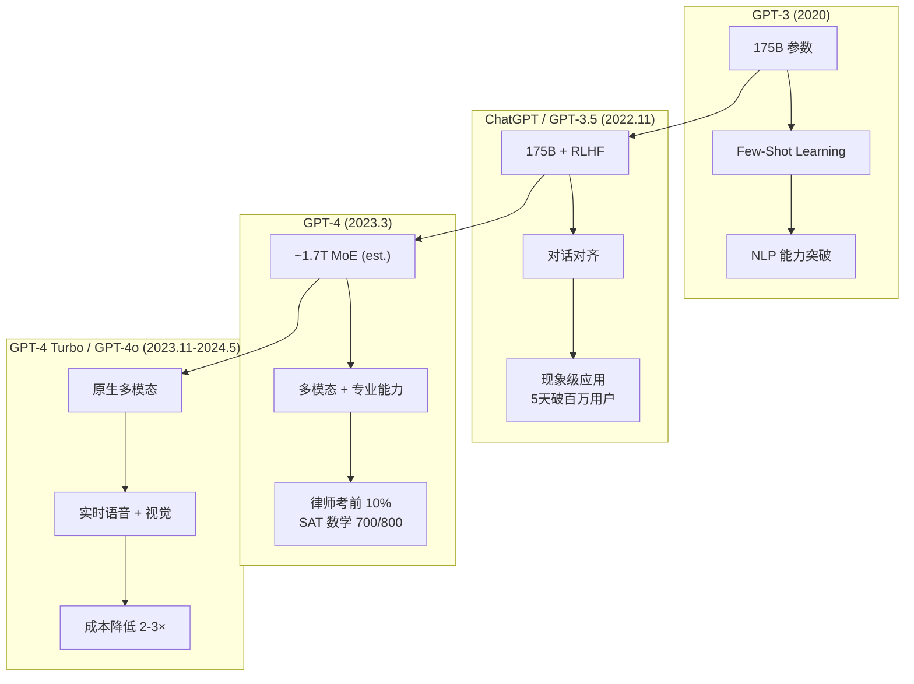

### 1.2 GPT-3.5 的局限性

GPT-3.5 (ChatGPT 背后的模型) 虽然引发了全球 AI 热潮，但存在明显短板：

| 局限 | 表现 | GPT-4 的改进 |
|------|------|-------------|
| **推理能力弱** | 复杂逻辑推理容易出错 | 推理准确率大幅提升 |
| **专业知识不足** | 在专业考试中表现平庸 | Bar Exam 前 10% |
| **单模态** | 仅支持文本 | 支持文本 + 图像输入 |
| **幻觉严重** | 经常编造事实 | 幻觉率降低 40% (内部评估) |
| **上下文窗口短** | 4K tokens | 8K → 32K → 128K (Turbo) |
| **对齐不够深** | 可被 jailbreak 绕过 | 更强安全性 + System Cards |

### 1.3 GPT-4 的发布背景

2022 年 11 月 ChatGPT 发布后，全球 AI 竞赛白热化：

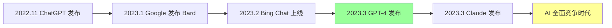

---

## 2. 架构推测：MoE 与大规模并行

### 2.1 估计架构：Sparse Mixture of Experts

OpenAI 从未官方披露 GPT-4 的架构细节，但业界共识指向 **Sparse MoE**：

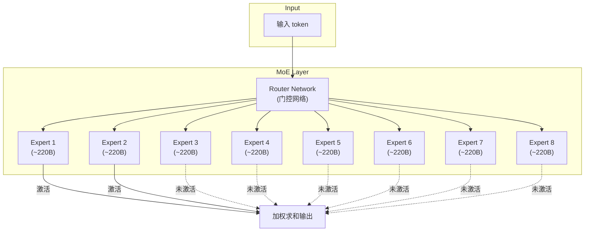

### 2.2 MoE 架构的优势

| 维度 | Dense 模型 (如 GPT-3) | Sparse MoE (GPT-4 est.) |
|------|----------------------|------------------------|
| **总参数** | 175B | ~1.7T (8×220B) |
| **每次推理激活参数** | 175B (全部) | ~440B (2/8 experts) |
| **训练成本** | 与参数量成正比 | 与激活参数成正比 (更高效) |
| **推理成本** | 高 | 中等 (仅激活部分) |
| **容量** | 受限于 175B | 1.7T 的存储容量 |
| **可扩展性** | 线性增加成本 | 可添加更多 experts |

### 2.3 为什么推测是 MoE？

多个间接证据支持 MoE 假设：

1. **训练成本估算**：如果 GPT-4 是 dense 1.7T 模型，训练成本将远超 $100M。MoE 让每次前向传播只激活 2 个 experts，成本可控
2. **推理速度**：GPT-4 的推理速度与 GPT-3.5 相当，暗示每次推理的计算量并未成倍增加
3. **微软泄露文件**：2023 年微软内部演示文稿暗示了 8 experts 的 MoE 架构
4. **工程合理性**：在 2023 年的硬件条件下，训练 dense 1.7T 模型极其困难

### 2.4 MoE 训练的工程挑战

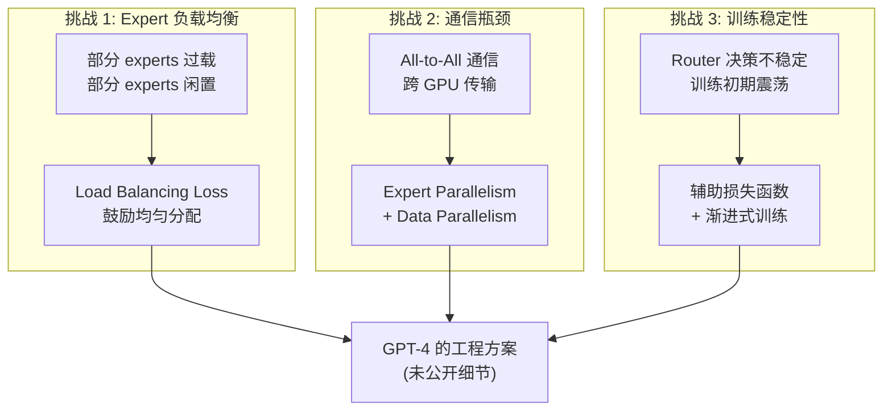

---

## 3. 多模态能力：从文本到视觉

### 3.1 GPT-4 的多模态演进

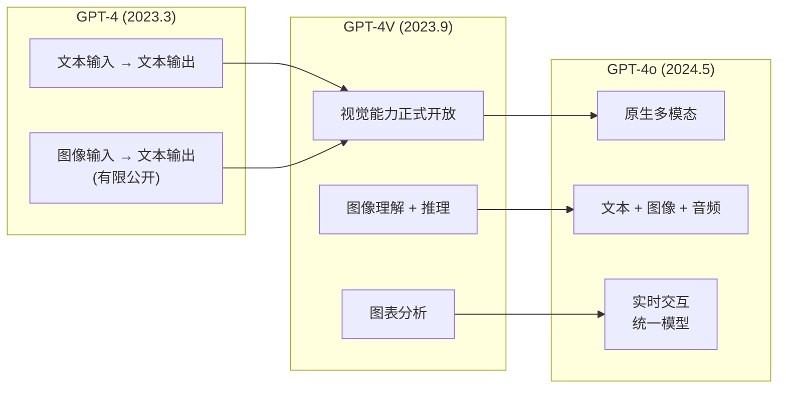

### 3.2 GPT-4V 的视觉能力

GPT-4V (ision) 于 2023 年 9 月正式开放，具备以下能力：

| 能力 | 描述 | 示例 |
|------|------|------|
| **图像描述** | 详细描述图像内容 | "这是一张日落时分的海滩照片..." |
| **图表理解** | 分析图表数据并推理 | 读取柱状图并计算增长率 |
| **文档 OCR** | 从图像中提取文字 | 识别手写笔记或印刷文档 |
| **视觉推理** | 基于图像进行逻辑推理 | 判断电路图是否正确连接 |
| **数学图形** | 理解几何图形和数学图示 | 分析几何证明题的图形 |

### 3.3 GPT-4o：原生多模态的飞跃

GPT-4o (2024 年 5 月) 代表了多模态的质变：

| 特性 | GPT-4V | GPT-4o |
|------|--------|--------|
| **模态** | 文本 + 图像 → 文本 | 文本 + 图像 + 音频 ↔ 文本 + 图像 + 音频 |
| **延迟** | 秒级 | 毫秒级 (实时语音对话) |
| **架构** | 视觉编码器 + LLM | 统一端到端模型 |
| **语音** | 需额外 TTS/STT | 原生语音输入输出 |
| **情感理解** | 无 | 可感知语音中的情感 |
| **成本** | 高 (多模型串联) | 低 (单一模型) |

---

## 4. 训练过程：$100M+ 的工程壮举

### 4.1 训练流程概览

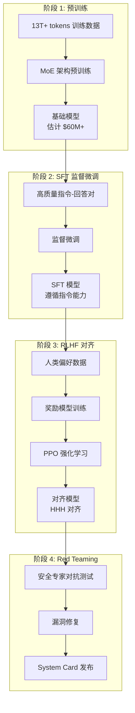

### 4.2 训练数据规模估计

| 来源 | 估计 token 数 | 占比 |
|------|--------------|------|
| **Common Crawl (过滤后)** | ~4-5T | 30-40% |
| **Books** | ~1-2T | 8-15% |
| **Wikipedia** | ~200B | 1-2% |
| **代码 (GitHub 等)** | ~1T | 8% |
| **学术论文** | ~500B | 4% |
| **社交媒体/论坛** | ~1T | 8% |
| **专业数据 (授权)** | ~1-2T | 8-15% |
| **合成数据** | ~1-2T | 8-15% |
| **总计** | ~13T+ | 100% |

### 4.3 训练基础设施

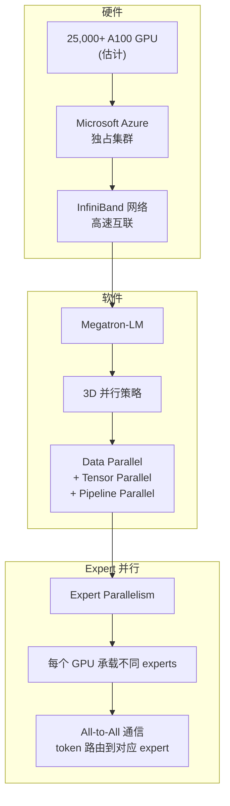

### 4.4 训练成本估算

| 成本项 | 估算 |
|--------|------|
| **GPU 算力** | $60-80M (A100 集群) |
| **数据收集与处理** | $10-15M |
| **RLHF 标注** | $5-10M (数千标注员) |
| **工程团队** | $10-20M |
| **Red Teaming / Safety** | $5M |
| **总计** | ~$100M+ |

> **对比**：GPT-3 训练成本约 $4.6M (2020)，GPT-4 成本增长约 20 倍。到 2025 年的 GPT-5 级别模型，训练成本可能达到 $1B+。

---

## 5. RLHF 与安全性：System Cards 的开创

### 5.1 GPT-4 的对齐流程

GPT-4 采用了比 GPT-3.5 更成熟的多层对齐策略：

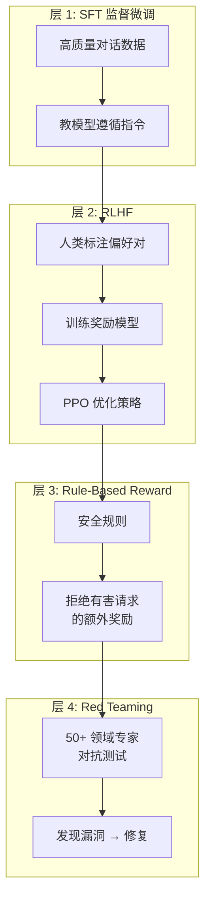

### 5.2 System Cards 的开创性

GPT-4 是第一个发布详细 **System Card** (系统卡) 的大模型，内容包括：

| System Card 内容 | 描述 |
|-----------------|------|
| **能力评估** | 详尽的 benchmark 测试结果 |
| **风险评估** | 模型可能造成的危害类型 |
| **红队测试** | 50+ 领域专家的对抗测试结果 |
| **缓解措施** | 针对每种风险的安全措施 |
| **局限性** | 模型已知的问题和不足 |
| **建议** | 部署时的安全建议 |

### 5.3 Red Teaming：AI 安全的新范式

GPT-4 的 Red Teaming 测试规模空前：

| 红队领域 | 测试内容 | 风险等级 |
|---------|---------|---------|
| **有害内容生成** | 暴力、色情、仇恨言论 | 高 |
| **虚假信息** | 幻觉、阴谋论 | 中 |
| **代码安全** | 恶意代码、漏洞利用 | 高 |
| **社会工程** | 钓鱼、欺骗 | 中 |
| **生物/化学武器** | 危险物质制作 | 极高 |
| **网络安全** | 攻击脚本生成 | 高 |
| **儿童安全** | 不当内容 | 极高 |

---

## 6. Benchmark 表现：全面超越人类基准

### 6.1 核心 Benchmark 对比表

| Benchmark | GPT-3.5 | GPT-4 | 人类基准 | GPT-4 相对排名 |
|-----------|---------|-------|---------|---------------|
| **MMLU** (多任务语言理解) | 70.0% | **86.4%** | ~90% (专家) | 接近专家水平 |
| **Bar Exam** (美国律师考试) | 后 10% | **前 10%** | 中位数 | 前 10% |
| **SAT Math** | 590/800 | **700/800** | 500 (平均) | 前 10% |
| **SAT Evidence-Based R&W** | 630/800 | **710/800** | 500 (平均) | 前 6% |
| **GRE Quantitative** | 69th %ile | **89th %ile** | 50th (平均) | 前 11% |
| **GRE Verbal** | 63rd %ile | **99th %ile** | 50th (平均) | 前 1% |
| **GRE Writing** | 54th %ile | **54th %ile** | 50th (平均) | 中等 |
| **LSAT** | 25th %ile | **88th %ile** | 50th (平均) | 前 12% |
| **USABO Semifinal** | 31st %ile | **99th %ile** | 50th (平均) | 前 1% |
| **LeetCode (coding)** | 15% pass | **67% pass** | - | 显著提升 |
| **HellaSwag** (常识推理) | 85.2% | **95.3%** | ~95% | 持平人类 |
| **WinoGrande** (常识推理) | 89.7% | **92.8%** | ~94% | 接近人类 |
| **ARC Challenge** (科学推理) | 85.2% | **96.3%** | - | 接近满分 |

### 6.2 Benchmark 表现可视化

```mermaid
xychart-beta
    title "GPT-4 vs GPT-3.5 主要 Benchmark 对比"
    x-axis ["MMLU", "Bar Exam", "SAT Math", "GRE Verbal", "LSAT", "USABO"]
    y-axis "百分位 / 得分率 (%)" 0 --> 100
    bar [70, 10, 74, 63, 25, 31]
    bar [86, 90, 88, 99, 88, 99]
```

### 6.3 语言能力 vs 专业能力的质变

GPT-4 在 MMLU 的 57 个学科中，23 个达到人类专家水平；Bar Exam 的 MBE (选择题) 部分从 GPT-3.5 的 ~50% 跃升至 ~76% (及格线 ~65%)。

| 能力层级 | GPT-3.5 水平 | GPT-4 水平 | 质变描述 |
|---------|-------------|-----------|---------|
| **基础语言** | 优秀 | 优秀 | 持平 |
| **常识推理** | 良好 | 优秀 | 显著提升 |
| **专业推理** | 一般 | 卓越 | **质变** |
| **代码能力** | 一般 | 强 | 显著提升 |
| **数学推理** | 弱 | 良好 | **质变** |
| **创意写作** | 良好 | 优秀 | 显著提升 |
| **多步推理** | 弱 | 良好 | **质变** |

---

## 7. 关键创新点

### 7.1 六大核心技术突破

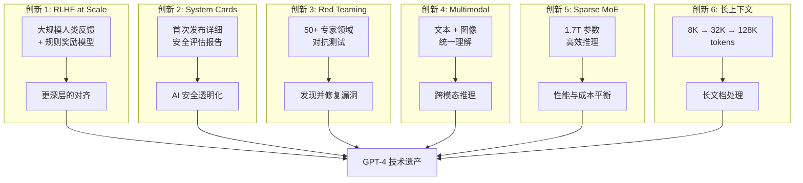

### 7.2 RLHF at Scale 的深入分析

GPT-4 的 RLHF 相比 GPT-3.5 有三大改进：

| 改进 | GPT-3.5 (InstructGPT) | GPT-4 |
|------|----------------------|-------|
| **奖励模型** | 单一人类反馈奖励 | 人类反馈 + 规则奖励 双模型 |
| **训练规模** | ~33K 标注对话 | 估计 100K+ 标注对话 |
| **安全对齐** | 基础 RLHF | RLHF + Constitutional AI 思路 + Red Teaming |
| **对抗鲁棒性** | 较弱 (jailbreak 容易) | 显著增强 |
| **多轮一致性** | 容易偏离指令 | 更强的多轮遵循 |

### 7.3 System Cards 对行业的深远影响

GPT-4 的 System Card 开创了 AI 模型透明化的先河：

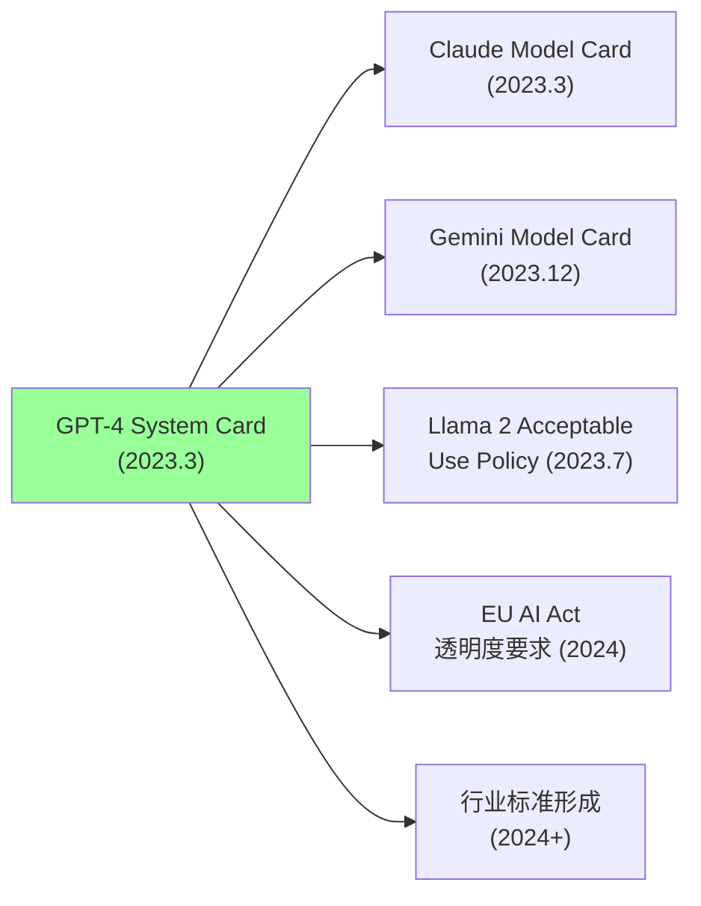

---

## 8. GPT-4 vs 竞品对比

### 8.1 2023 年大模型横向对比

| 模型 | 公司 | MMLU | Bar Exam | 多模态 | 开源 | 上下文 |
|------|------|------|----------|--------|------|--------|
| **GPT-4** | OpenAI | 86.4% | 前 10% | 文本+图像 | 否 | 8K-32K |
| **Claude 2** | Anthropic | 78.5% | - | 文本 | 否 | 100K |
| **Gemini Pro** | Google | 71.0% | - | 文本+图像 | 否 | 32K |
| **LLaMA 2 70B** | Meta | 68.9% | - | 文本 | 是 | 4K |
| **PaLM 2** | Google | 78.3% | - | 文本 | 否 | 8K |
| **GPT-3.5** | OpenAI | 70.0% | 后 10% | 文本 | 否 | 4K-16K |

### 8.2 GPT-4 的竞争护城河

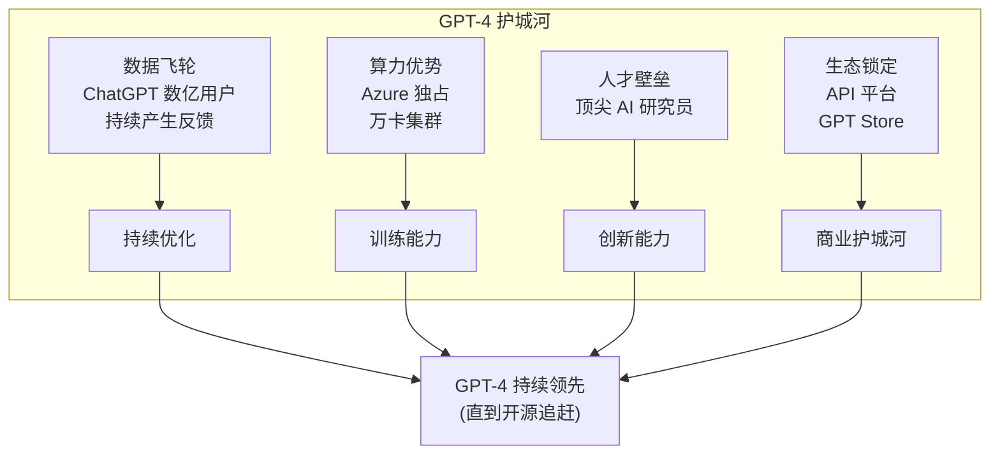

### 8.3 开源追赶时间线

| 时间 | 开源模型 | MMLU | 与 GPT-4 差距 |
|------|---------|------|--------------|
| 2023.3 | LLaMA 1 65B | 63.4% | -23.0 |
| 2023.7 | LLaMA 2 70B | 68.9% | -17.5 |
| 2024.1 | Mixtral 8x7B | 70.6% | -15.8 |
| 2024.4 | LLaMA 3 70B | 79.5% | -6.9 |
| 2024.8 | LLaMA 3.1 405B | 85.2% | -1.2 |
| 2024.12 | Qwen 2.5 72B | 86.1% | -0.3 |
| 2025.3 | DeepSeek-V3 | 87.1% | +0.7 |

---

## 9. GPT-4 后续变体

### 9.1 变体演进路线

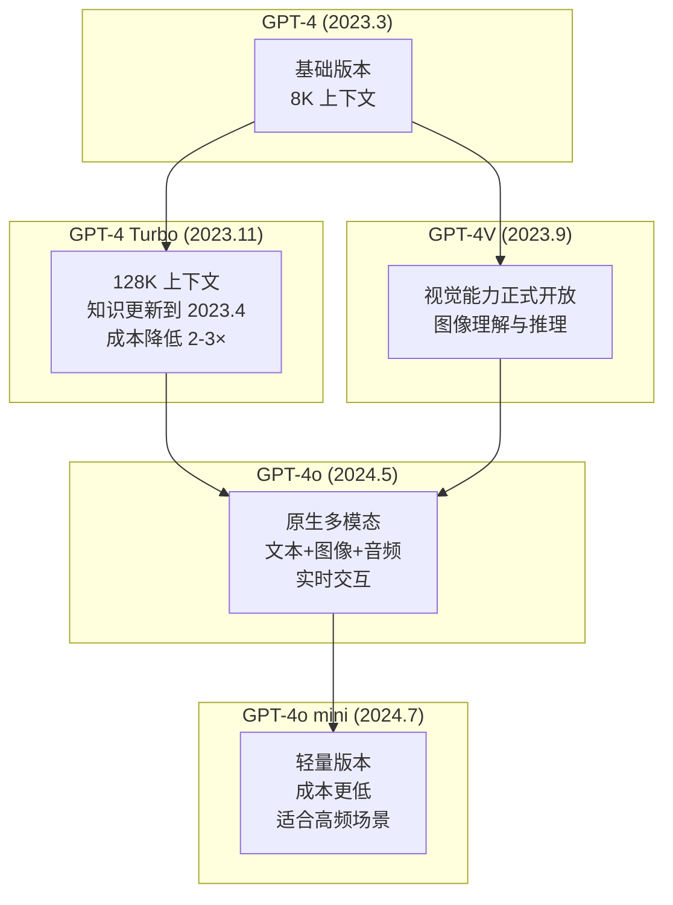

### 9.2 各变体详细对比

| 特性 | GPT-4 | GPT-4 Turbo | GPT-4V | GPT-4o | GPT-4o mini |
|------|-------|-------------|--------|--------|-------------|
| **发布时间** | 2023.3 | 2023.11 | 2023.9 | 2024.5 | 2024.7 |
| **上下文窗口** | 8K/32K | 128K | 8K/32K | 128K | 128K |
| **输入模态** | 文本 | 文本 | 文本+图像 | 文本+图像+音频 | 文本+图像 |
| **输出模态** | 文本 | 文本 | 文本 | 文本+图像+音频 | 文本 |
| **推理速度** | 基准 | 2× | 基准 | 2× | 5× |
| **输入价格** | $0.03/1K | $0.01/1K | $0.01/1K | $0.005/1K | $0.00015/1K |
| **输出价格** | $0.06/1K | $0.03/1K | $0.03/1K | $0.015/1K | $0.0006/1K |
| **知识截止** | 2021.9 | 2023.4 | 2023.4 | 2023.10 | 2023.10 |

### 9.3 GPT-4o 的原生多模态架构

GPT-4o 代表了从"拼接多模态"到"原生多模态"的范式转变：

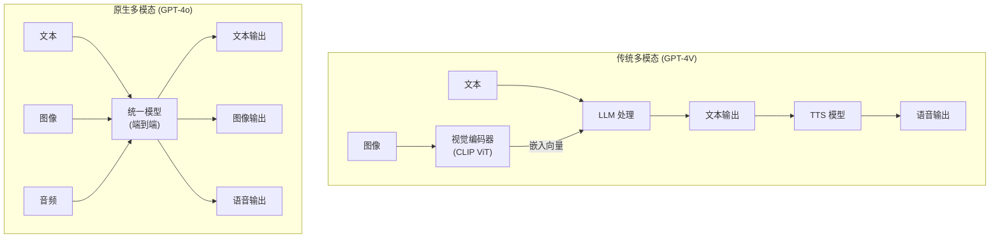

---

## 10. 行业影响：引发全球 AI 竞赛

### 10.1 GPT-4 引发的连锁反应

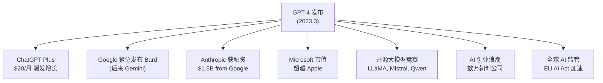

### 10.2 商业影响

| 领域 | GPT-4 前 | GPT-4 后 |
|------|---------|---------|
| **搜索** | Google 垄断 | Perplexity, Bing AI 崛起 |
| **编程** | Copilot (GPT-3.5) | Cursor, Devin 等新范式 |
| **教育** | 传统在线教育 | Khan Academy Khanmigo |
| **法律** | 手动法律检索 | Harvey AI, CoCounsel |
| **医疗** | 有限 AI 辅助 | Med-PaLM, 临床 AI 助手 |
| **企业** | 传统 SaaS | AI-native SaaS 重构 |

### 10.3 GPT-4 对 AI 研究的影响

| 研究方向 | GPT-4 前关注度 | GPT-4 后关注度 | 变化 |
|---------|--------------|--------------|------|
| **Scaling Laws** | 高 | 极高 | MoE 成为新焦点 |
| **多模态** | 中 | 极高 | 所有模型追赶多模态 |
| **RLHF / 对齐** | 中 | 极高 | 安全成为必选项 |
| **Agent / 工具** | 低 | 极高 | GPT-4 的 function calling 引爆 |
| **长上下文** | 低 | 高 | 128K 成为新标准 |
| **系统安全** | 低 | 高 | System Card 成为行业惯例 |

---

## 11. 局限性与争议

### 11.1 GPT-4 的已知局限

| 局限 | 描述 | 严重程度 |
|------|------|---------|
| **幻觉** | 仍然会编造事实，虽然比 GPT-3.5 少 40% | 高 |
| **知识截止** | 训练数据有截止日期 | 中 |
| **推理不稳定** | 同一问题多次回答可能不一致 | 中 |
| **数学推理** | 复杂数学仍有错误 (尽管大幅提升) | 中 |
| **偏见** | 虽然缓解但仍存在 | 中 |
| **上下文遗忘** | 长对话中可能遗忘早期信息 | 中 |
| **过度对齐** | 有时过度拒绝合理请求 | 低 |

### 11.2 架构不透明

OpenAI 不公开 GPT-4 架构细节，引发学术界争论：商业保护 vs 学术透明。这一问题在 2026 年仍未完全解决。

---

## 12. 实践指南：GPT-4 API 使用

### 12.1 API 调用示例

```python
import openai

# GPT-4 基本调用 (支持 "gpt-4", "gpt-4-turbo", "gpt-4o")
response = openai.chat.completions.create(
    model="gpt-4o",
    messages=[
        {"role": "system", "content": "You are a helpful assistant."},
        {"role": "user", "content": "解释量子纠缠的基本原理"}
    ],
    temperature=0.7,
    max_tokens=2000,
    tools=[...],  # Function Calling: 让模型调用外部 API
    response_format={"type": "json_object"}  # 结构化输出
)
```

### 12.2 最佳实践

| 实践 | 说明 |
|------|------|
| **选择合适模型** | 简单任务用 GPT-4o mini，复杂推理用 GPT-4 Turbo |
| **温度控制** | 确定性回答 temperature=0，创意写作 0.7-1.0 |
| **Function Calling** | 让模型调用外部工具，开启 Agent 能力 |
| **成本控制** | 利用缓存、batch API、合理设置 max_tokens |
| **错误处理** | 实现重试逻辑和 rate limiting |

---

## 13. FAQ

### Q1: GPT-4 到底有多少参数？

> **答**: OpenAI 从未官方披露。业界最广泛接受的估计是 ~1.7T 参数的 Sparse MoE 架构 (8 个 experts，每个约 220B 参数，每次推理激活 2 个)。这意味着每次推理实际激活约 440B 参数，但模型总容量是 1.7T。这个设计在保持高性能的同时控制了推理成本。

### Q2: GPT-4 为什么比 GPT-3.5 强这么多？

> **答**: 三个核心因素：
> 1. **规模提升**：参数量从 175B 提升到 ~1.7T (10×)，训练数据从 ~300B 到 13T+ tokens (40×)
> 2. **更好的对齐**：大规模 RLHF + 规则奖励 + Red Teaming
> 3. **架构创新**：MoE 让模型拥有更大的参数容量，可以"记住"更多知识模式

### Q3: GPT-4 的训练数据是否包含 GPT-3.5 的用户对话？

> **答**: OpenAI 声明 ChatGPT 免费版用户对话可能用于训练改进，但 Plus 用户和 API 用户的数据不用于训练。

### Q4: GPT-4o 和 GPT-4 Turbo 有什么区别？

> **答**: GPT-4 Turbo (2023.11) 是 GPT-4 的优化版本 (128K 上下文，成本降低)。GPT-4o (2024.5) 是全新的原生多模态模型，支持文本/图像/音频统一处理，速度更快。两者是不同的模型系列。

### Q5: 为什么 GPT-4 的 System Card 如此重要？

> **答**: 首次系统性公开模型风险、Red Teaming 结果，为后续所有大模型设立行业惯例，并推动了 EU AI Act 等 AI 监管立法。

### Q6: GPT-4 的 Function Calling 为什么重要？

> **答**: 让 LLM 能调用外部工具和 API，从"生成文本"升级为"执行动作"，催生了 LangChain、AutoGPT、CrewAI 等 Agent 框架，2024-2026 年的 AI Agent 热潮直接源于此。

### Q7: 开源模型什么时候追上了 GPT-4？

> **答**: 约 2 年时间。2023.3 LLaMA 1 落后 23 个 MMLU 点；2024.12 Qwen 2.5 72B 仅落后 0.3 点；2025.3 DeepSeek-V3 首次在 MMLU 上超越 GPT-4 (87.1% vs 86.4%)。但综合能力、安全性和多模态方面仍有差距。

---

## 14. 与其他章节的关联

| 相关文档 | 关系 | 详见 |
|---------|------|------|
| GPT-3 Deep Dive | GPT-4 的前代基础 | [GPT3_Deep_Dive.md](20_论文精读/03_Scaling/GPT3_Deep_Dive.md) |
| OpenAI Deep Dive | OpenAI 公司全景 | [../05_大模型/14_Global_LLM_Ecosystem/OpenAI_Deep_Dive.md](05_大模型/14_Global_LLM_Ecosystem/OpenAI_Deep_Dive.md) |
| MoE Deep Dive | GPT-4 推测架构 | [Mixture_of_Experts_Deep_Dive.md](20_论文精读/02_Architecture/Mixture_of_Experts_Deep_Dive.md) |
| RLHF & DPO | 对齐方法 | [RLHF_DPO_Deep_Dive.md](20_论文精读/06_Alignment/RLHF_DPO_Deep_Dive.md) |
| Scaling Laws | 规模扩展理论 | [Scaling_Laws_Deep_Dive.md](20_论文精读/03_Scaling/Scaling_Laws_Deep_Dive.md) |
| DeepSeek-V3 | 开源追赶者 | [DeepSeek_V3_Technical_Report.md](20_论文精读/09_Frontier/DeepSeek_V3_Technical_Report.md) |
| 多模态模型架构 | GPT-4o 原生多模态 | [../05_大模型/10_Multimodal_Models/Multimodal_Architectures_2026.md](05_大模型/10_Multimodal_Models/Multimodal_Architectures_2026.md) |
| GRPO 与新对齐方法 | GPT-4 之后的对齐演进 | [../07_模型训练/GRPO_and_New_Alignment_Methods.md](07_模型训练/06_Alignment/GRPO_and_New_Alignment_Methods.md) |
| AI Agent 架构 | 基于 GPT-4 的 Agent 开发 | [../06_强化学习/AI_Agents/](../06_强化学习/AI_Agents/) |

---

## 15. 总结

### 15.1 GPT-4 的五大历史遗产

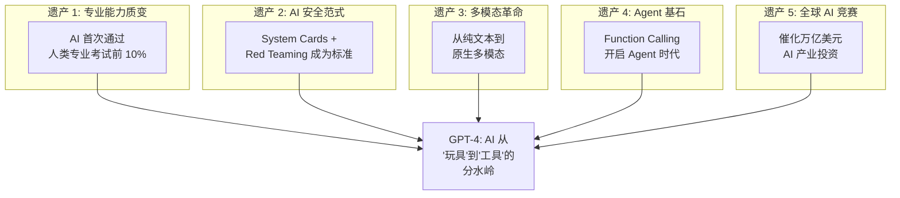

### 15.2 一句话总结

> **GPT-4 证明了大模型不仅仅是"鹦鹉学舌"——当规模足够大、对齐足够好时，AI 可以展现出真正的专业能力，这改变了整个科技产业的投资方向和研发重心。**

### 15.3 给实践者的建议

| 建议 | 说明 |
|------|------|
| 根据任务选择模型 | 简单任务用 GPT-4o mini，复杂推理用 GPT-4 Turbo |
| 重视 System Prompt | 好的 system prompt 可以显著提升输出质量 |
| 善用 Function Calling | 让模型通过 API 调用外部工具，而非纯文本生成 |
| 关注幻觉问题 | 即使 GPT-4 也会编造事实，关键场景需要验证 |
| 成本优化 | 利用缓存、batch API、短 system prompt 降低成本 |
| 关注开源替代 | Qwen、LLaMA 等开源模型在多数任务上已接近 GPT-4 |

---

## 参考资料

1. OpenAI. "GPT-4 Technical Report." arXiv:2303.08774, 2023.
2. OpenAI. "GPT-4 System Card." 2023.
3. Hendrycks, D. et al. "Measuring Massive Multitask Language Understanding." ICLR 2021.
4. Fedus, W. et al. "Switch Transformers: Scaling to Trillion Parameter Models with Simple and Efficient Sparsity." JMLR 2022.
5. Ouyang, L. et al. "Training Language Models to Follow Instructions with Human Feedback." NeurIPS 2022.

---

*Last updated: 2026-06-15*

## Related

- [[20_论文精读/README|22 经典与必读 AI 论文清单 (Essential AI Papers)]]
