# Scaling Laws for Neural Language Models (Kaplan et al.) 深度解读

> **一句话理解**: Scaling Laws 就像 AI 的"元素周期表"——它告诉你模型性能可以用简单的幂律公式预测，让训练从"炼金术"变成"工程学"

---

## 论文基本信息

| 属性 | 内容 |
|------|------|
| **标题** | Scaling Laws for Neural Language Models |
| **作者** | Jared Kaplan, Sam McCandlish, Tom Henighan, Tom B. Brown 等 (OpenAI) |
| **发表** | 2020 年 1 月 (arXiv 预印本) |
| **引用量** | 3,000+ (截至 2026) |
| **论文链接** | [arXiv:2001.08361](https://arxiv.org/abs/2001.08361) |
| **核心发现** | L(N) ∝ N^(-0.076), L(D) ∝ D^(-0.095), L(C) ∝ C^(-0.050) |
| **影响** | 直接推动了 GPT-3, GPT-4 的规模扩展决策 |

---

## 1. 历史背景：Scaling Laws 之前的 "炼金术"

### 1.1 Scaling Laws 之前的模型训练

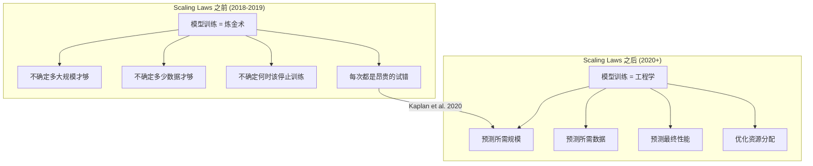

### 1.2 为什么这篇论文如此重要？

| 维度 | 之前 | 之后 |
|------|------|------|
| **训练决策** | "先试试，看看效果" | "先算一下 Scaling Law" |
| **资源规划** | 猜测需要多少 GPU | 公式计算所需 FLOPs |
| **性能预期** | 训练完才知道 | 训练前可预测 |
| **研究方向** | 分散尝试各种改进 | 集中力量扩大规模 |
| **行业影响** | 小规模实验 | GPT-3 → ChatGPT → GPT-4 |

### 1.3 论文的核心主张

> **"语言模型的性能可以用简单的幂律公式来预测，且这些规律跨越多个数量级保持稳定。"**

这意味着：
1. **可预测性**: 小模型的行为可以预测大模型的行为
2. **平滑性**: 没有突变，性能随规模平滑提升
3. **普适性**: 不同架构、数据集的 Scaling Laws 类似
4. **简单性**: 只需要幂律，不需要复杂模型

---

## 2. 核心 Scaling Laws

### 2.1 三个独立的幂律关系

论文发现了三个独立的 Scaling Law，分别描述性能与参数量、数据量、计算量的关系：

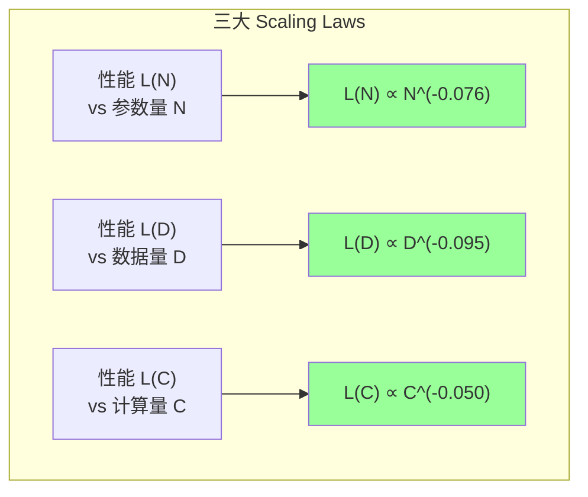

### 2.2 公式详解

**参数 Scaling Law:**

$$L(N) = \left(\frac{N_c}{N}\right)^{\alpha_N}, \quad \alpha_N = 0.076, \quad N_c = 8.8 \times 10^{13}$$

**数据 Scaling Law:**

$$L(D) = \left(\frac{D_c}{D}\right)^{\alpha_D}, \quad \alpha_D = 0.095, \quad D_c = 5.4 \times 10^{13}$$

**计算 Scaling Law:**

$$L(C) = \left(\frac{C_c}{C}\right)^{\alpha_C}, \quad \alpha_C = 0.050, \quad C_c = 3.1 \times 10^8$$

其中 L 是 cross-entropy loss (nats)，N 是非嵌入参数量，D 是训练 token 数，C 是 FLOPs。

### 2.3 指数对比与含义

| Scaling 关系 | 指数 α | 含义 | 增加 10× 的性能提升 |
|:----------:|:-----:|------|:------------------:|
| L(N) ∝ N^(-0.076) | 0.076 | 参数越多越好，但收益递减 | loss 降 0.18 nats |
| L(D) ∝ D^(-0.095) | 0.095 | 数据越多越好，但收益递减 | loss 降 0.22 nats |
| L(C) ∝ C^(-0.050) | 0.050 | 计算越多越好，但收益递减 | loss 降 0.12 nats |

> **关键洞察**: 数据的指数 (0.095) > 参数的指数 (0.076) > 计算的指数 (0.050)
> 这意味着**增加数据比增加参数更有效**，但 Kaplan 的最优分配建议却偏向参数。

### 2.4 数值示例

| 操作 | Loss 变化 | 说明 |
|------|:--------:|------|
| 参数 1B → 10B | -0.18 nats | 增加 10× 参数 |
| 数据 10B → 100B tokens | -0.22 nats | 增加 10× 数据 |
| 计算 10^21 → 10^22 FLOPs | -0.12 nats | 增加 10× 计算 |
| 参数 1B → 100B | -0.35 nats | 增加 100× 参数 |
| 数据 10B → 1T tokens | -0.43 nats | 增加 100× 数据 |

---

## 3. 实验方法

### 3.1 实验设计

论文进行了系统的大规模扫描实验：

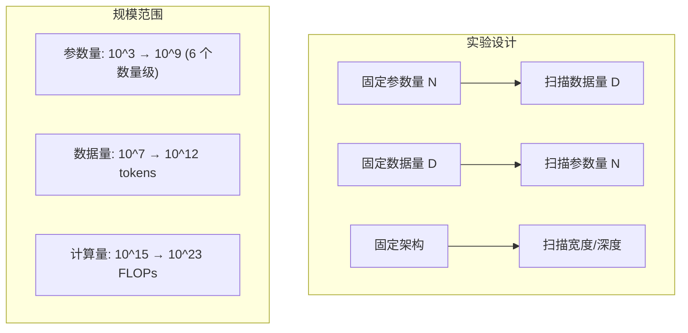

### 3.2 关键实验配置

| 参数 | 范围 | 说明 |
|------|------|------|
| **模型规模** | 770 → 1.5B 参数 | 覆盖 6 个数量级 |
| **训练数据** | WebText (约 40GB) | GPT-2 使用的数据集 |
| **词汇表** | BPE, 50257 tokens | GPT-2 词汇表 |
| **架构** | Decoder-only Transformer | 与 GPT-2 一致 |
| **评估** | 验证集 cross-entropy loss | 标准 NLP 指标 |

### 3.3 架构扫描

论文验证了 Scaling Laws 对不同架构变化的鲁棒性：

| 变化维度 | 发现 | 对 Scaling Law 的影响 |
|---------|------|---------------------|
| **宽度 vs 深度** | 宽而浅 ≈ 窄而深 (同参数量) | 几乎无影响 |
| **注意力头数** | 头数影响不大 | 几乎无影响 |
| **FFN 比率** | 4× 是甜蜜点 | 微小影响 |
| **激活函数** | GELU ≈ ReLU > Sigmoid | 微小影响 |
| **位置编码** | 学习型 > 正弦 | 微小影响 |
| **LayerNorm** | Pre-LN > Post-LN | 微小影响 |

> **核心结论**: Scaling Laws 主要取决于**总参数量**，对架构细节相对不敏感。

---

## 4. 计算最优分配

### 4.1 Kaplan 的最优策略

基于三个独立的 Scaling Laws，Kaplan 推导了在固定计算预算下的最优分配：

$$C \approx 6ND \quad \text{(Transformer 的 FLOPs 近似)}$$

在约束 C = 6ND 下最小化 L(N) + L(D)：

$$N_{opt} \propto C^{0.73}$$
$$D_{opt} \propto C^{0.27}$$

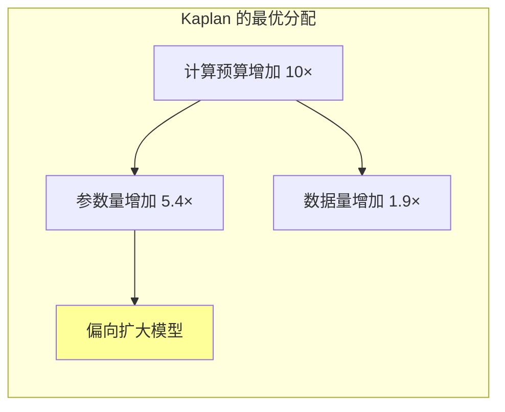

### 4.2 为什么 Kaplan 的结论偏向参数？

这是一个微妙但重要的数学问题：

| Scaling Law | 独立指数 | 最优分配指数 | 解释 |
|:----------:|:-------:|:----------:|------|
| L(N) | 0.076 | — | 参数单独增加时收益递减慢 |
| L(D) | 0.095 | — | 数据单独增加时收益递减快 |
| — | — | N: 0.73 | 在联合优化中偏向参数 |
| — | — | D: 0.27 | 在联合优化中偏向较少数据 |

**直觉解释**:
- L(N) 的指数 (0.076) 小 → 参数增加时 loss 下降**缓慢但持久**
- L(D) 的指数 (0.095) 大 → 数据增加时 loss 下降**快但迅速饱和**
- 因此在联合优化中，应该把更多预算给参数（因为它"用不完"）

> **这正是后来 Chinchilla 质疑的结论。**

---

## 5. 与 Chinchilla 的对比

### 5.1 Kaplan vs Chinchilla

Scaling Laws 论文最重要的"遗产"之一就是它被 Chinchilla 修正的故事：

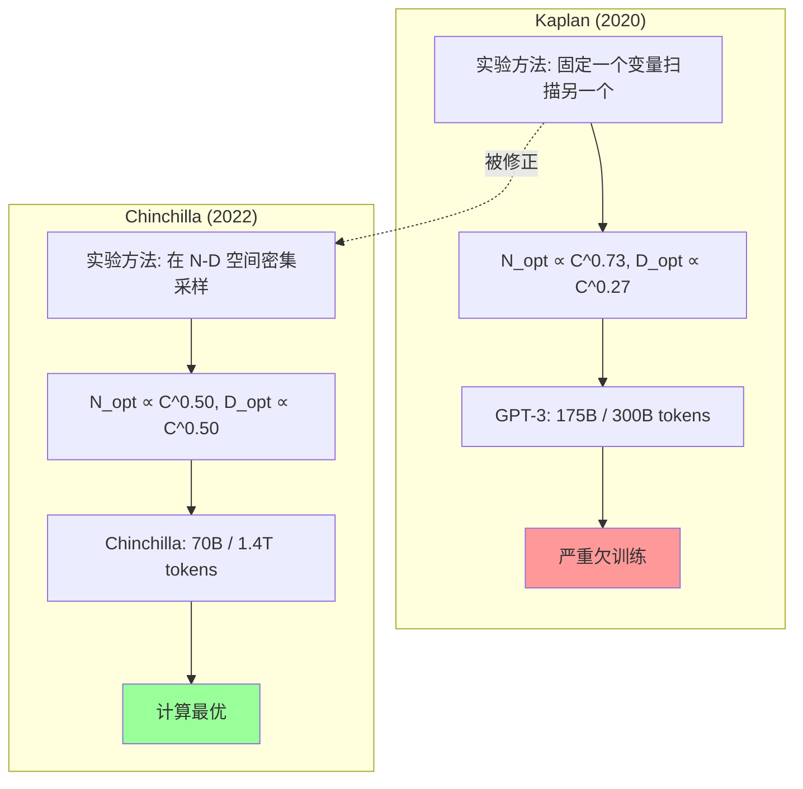

### 5.2 差异的根本原因

| 方面 | Kaplan 的方法 | Chinchilla 的方法 |
|------|:-----------:|:--------------:|
| **扫描策略** | 固定 N 扫 D / 固定 D 扫 N | 在 N-D 空间同时扫描 |
| **最优定义** | 分别优化 N 和 D | 联合优化 (N, D) |
| **数据假设** | 固定数据重复训练 | 不重复使用数据 |
| **模型规模** | 最大 1.5B | 最大 16B |
| **实验数量** | ~100 模型 | ~400 模型 |
| **关键问题** | 未充分探索 N-D 联合效应 | 更密集的采样 |

### 5.3 两个 Scaling Laws 的对比表

| Scaling 关系 | Kaplan 指数 | Chinchilla 指数 | 差异 | 影响 |
|:----------:|:----------:|:-------------:|:---:|------|
| L(N) ∝ N^(-α) | 0.076 | 0.34 | 4.5× | N 的作用被严重低估 |
| L(D) ∝ D^(-β) | 0.095 | 0.28 | 2.9× | D 的作用也被低估 |
| L(C) ∝ C^(-γ) | 0.050 | 0.17 | 3.4× | 综合效率大幅提升 |
| N_opt ∝ C^a | 0.73 | **0.50** | — | 参数增长应放缓 |
| D_opt ∝ C^b | 0.27 | **0.50** | — | 数据增长应加速 |

> **核心教训**: Kaplan 的 Scaling Laws 本身是正确的（性能确实遵循幂律），但**最优分配**的推导有问题。

---

## 6. Scaling Laws 的普适性

### 6.1 跨任务 Scaling

论文发现 Scaling Laws 不仅适用于语言建模，还适用于各种下游任务：

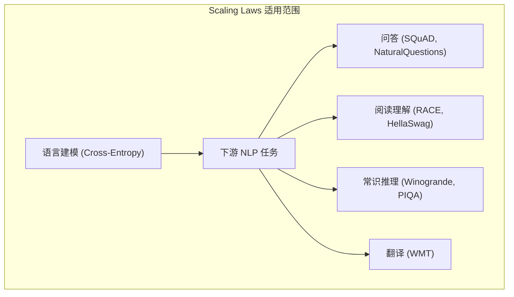

### 6.2 下游任务 vs 预训练 Loss 的关系

论文发现下游任务的表现与预训练 loss 之间存在**近似的幂律关系**：

| 任务 | 与预训练 Loss 的关系 | 说明 |
|------|:-----------------:|------|
| LAMBADA | 强线性 (r² > 0.95) | 续写任务，直接相关 |
| HellaSwag | 强线性 (r² > 0.9) | 常识推理 |
| Winogrande | 中等线性 (r² > 0.8) | 共指消解 |
| SQuAD | 中等线性 (r² > 0.8) | 问答 |
| 翻译 | 弱线性 (r² > 0.7) | 需要特定数据 |

> **核心洞察**: 预训练 loss 的改进可以**近似预测**下游任务的改进，即使模型没有在这些任务上微调。

### 6.3 跨模态 Scaling

后续工作将 Scaling Laws 推广到其他模态：

| 模态 | 论文 | 发现 |
|------|------|------|
| **图像** | Zhai et al. (2022) | ViT 也遵循幂律 Scaling Laws |
| **视频** | OpenAI Sora (2024) | 视频生成模型展现 Scaling 行为 |
| **多模态** | Flamingo (2022) | 多模态模型的性能与数据量成幂律 |
| **代码** | Chen et al. (2021) | Codex 遵循类似 Scaling Laws |
| **数学** | Azerbayev et al. (2023) | 数学推理模型也展现幂律行为 |

---

## 7. 涌现能力 (Emergent Abilities)

### 7.1 什么是涌现能力？

Scaling Laws 论文的一个隐含发现（后来被 Wei et al. 2022 系统研究）是**涌现能力**——某些能力在模型达到特定规模时突然出现：

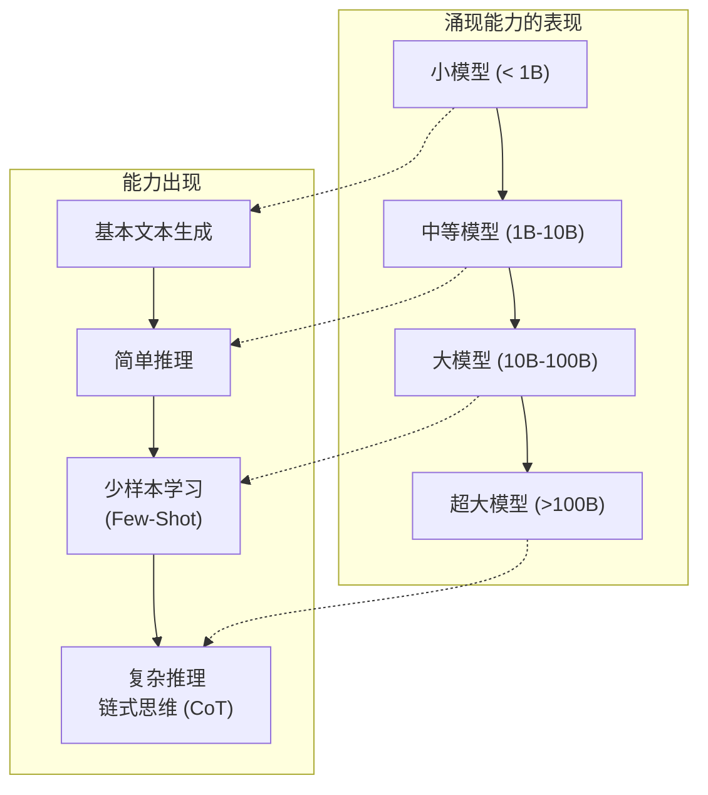

### 7.2 涌现能力的典型例子

| 能力 | 出现的模型规模 | 典型 Benchmark |
|------|:----------:|-------------|
| 基本文本生成 | ~100M | Perplexity |
| 简单算术 | ~1B | GSM8K (简单题) |
| Few-Shot 学习 | ~6B | 各种 Few-Shot 任务 |
| 思维链推理 | ~60B | GSM8K, MATH |
| 多步骤推理 | ~100B | MMLU, ARC |
| 代码生成 | ~10B | HumanEval |
| 工具使用 | ~50B | ToolBench |

### 7.3 涌现 vs 平滑 Scaling

关于涌现能力是否与 Scaling Laws 矛盾，存在争议：

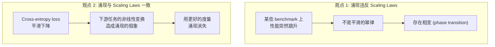

**最新共识** (Schaeffer et al. 2023):
- 涌现可能是**度量选择**的结果，而非真正的相变
- 使用连续度量（如 BLEU, edit distance）时，涌现通常消失
- Cross-entropy loss 始终是平滑的幂律

---

## 8. 数学深入

### 8.1 为什么是幂律？

论文探讨了 Scaling Laws 为什么是幂律形式（而非指数、对数等）：

| 函数形式 | 公式 | 拟合质量 | 问题 |
|---------|------|:-------:|------|
| **幂律** | L = aN^(-α) | **最佳** | 无 |
| 指数 | L = ae^(-αN) | 差 | 大 N 时下降太快 |
| 对数 | L = a - α log(N) | 中 | 大 N 时下降太慢 |
| 双曲线 | L = a/(N + b) | 中 | 不如幂律灵活 |

### 8.2 信息论视角

从信息论角度理解 Scaling Laws：

$$L(N) = H(X) - I(X; \theta_N)$$

其中：
- $H(X)$ 是文本的熵（不可约损失）
- $I(X; \theta_N)$ 是模型参数捕获的关于文本的互信息
- 幂律 Scaling 暗示 $I(X; \theta_N) \propto N^{\alpha}$

### 8.3 与神经 Scaling Laws 的关系

Hestness et al. (2017) 在更早的工作中发现了深度学习的通用 Scaling Laws：

$$\epsilon(m) = \left(\frac{m_c}{m}\right)^\beta + \epsilon_\infty$$

Kaplan 的贡献是：
1. 将这一发现**系统化**到语言模型
2. 发现了**跨数量级**的稳定性
3. 推导了**最优分配**策略
4. 证明了**架构无关性**

---

## 9. 对 GPT-3 和 GPT-4 的影响

### 9.1 GPT-3: Scaling Laws 的首次大规模验证

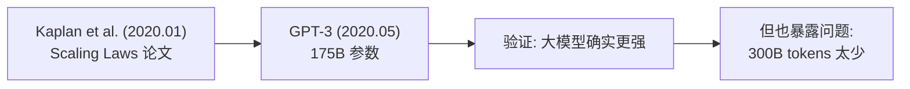

| 决策 | Kaplan 的建议 | GPT-3 的实际选择 | 评价 |
|------|:----------:|:--------------:|------|
| **模型大小** | 优先扩大 N | 175B (很大) | 遵循 Kaplan |
| **训练数据** | D_opt 较小 | 300B tokens | 遵循 Kaplan (但过少) |
| **Tokens/参数** | ~1.7 | 1.7 | 完美遵循 Kaplan |
| **Chinchilla 评价** | — | 严重欠训练 | Kaplan 误导了 |

### 9.2 GPT-4: 从 Kaplan 到 Chinchilla

GPT-4 的技术报告没有透露细节，但推测：

| 方面 | 推测 | 依据 |
|------|------|------|
| **模型大小** | 可能 > 1T 或 MoE | 性能和成本推测 |
| **训练数据** | ~13T tokens | 超过 Chinchilla 最优 |
| **训练策略** | 可能遵循 Chinchilla + 过训练 | 2022 年后的行业趋势 |
| **训练成本** | ~$100M+ | 公开报道 |

### 9.3 Scaling Laws 驱动的模型规模增长

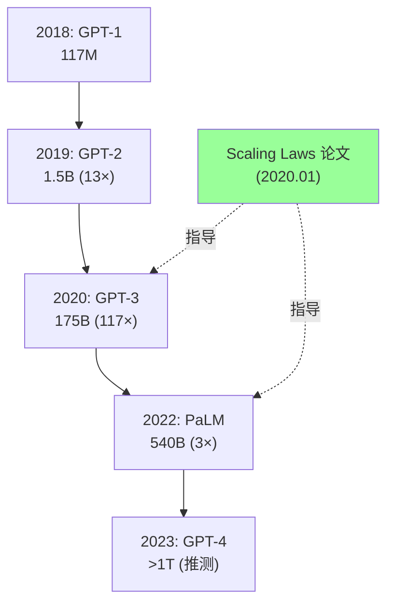

---

## 10. 实践应用

### 10.1 使用 Scaling Laws 预测模型性能

```python
import math

def kaplan_scaling_law(N=None, D=None, C=None):
    """
    使用 Kaplan et al. 的 Scaling Laws 预测语言模型 loss
    N: 非嵌入参数量
    D: 训练 token 数
    C: 计算量 (FLOPs)
    """
    # Kaplan 论文的参数
    N_c, alpha_N = 8.8e13, 0.076
    D_c, alpha_D = 5.4e13, 0.095
    C_c, alpha_C = 3.1e8, 0.050
    
    results = {}
    if N is not None:
        results['L_N'] = (N_c / N) ** alpha_N
    if D is not None:
        results['L_D'] = (D_c / D) ** alpha_D
    if C is not None:
        results['L_C'] = (C_c / C) ** alpha_C
    
    return results

# 示例：预测 GPT-3 175B 的 loss
loss_N = kaplan_scaling_law(N=175e9)
print(f"预测 Loss (by N): {loss_N['L_N']:.2f} nats")

# 预测需要多少参数才能达到 loss = 2.0
target_loss = 2.0
N_c, alpha_N = 8.8e13, 0.076
N_required = N_c * (1 / target_loss) ** (1 / alpha_N)
print(f"达到 loss=2.0 需要: {N_required/1e9:.1f}B 参数")
```

### 10.2 Kaplan 最优计算器

```python
def kaplan_optimal(C_flops: float):
    """
    使用 Kaplan 的最优分配公式
    """
    # Kaplan 的最优指数
    a = 0.73  # N_opt ∝ C^0.73
    b = 0.27  # D_opt ∝ C^0.27
    
    # 系数 (从论文估计)
    N_coeff = 0.6e9 / (3.8e23) ** a
    D_coeff = 4.2e9 / (3.8e23) ** b
    
    N_opt = N_coeff * C_flops ** a
    D_opt = D_coeff * C_flops ** b
    
    return N_opt, D_opt
```

### 10.3 Scaling Laws 决策流程

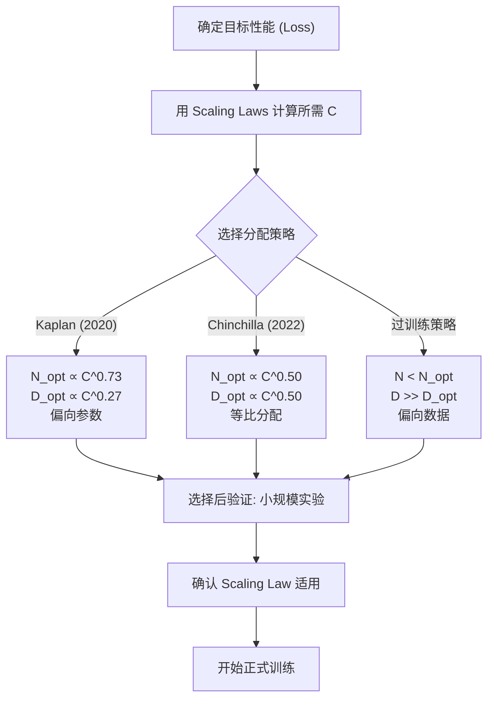

---

## 11. 后续发展与修正

### 11.1 Scaling Laws 研究时间线

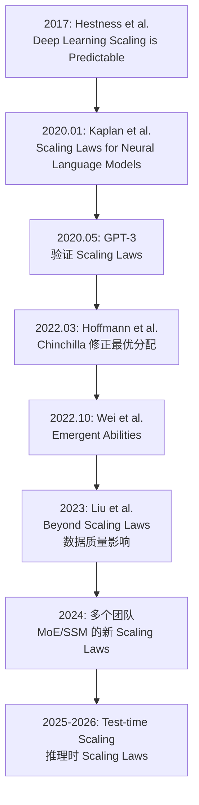

### 11.2 重要后续工作

| 论文 | 年份 | 贡献 | 对 Kaplan 的关系 |
|------|:----:|------|:--------------:|
| GPT-3 | 2020 | 验证 Scaling Laws 可预测 | 支持 |
| PaLM | 2022 | 验证 540B 规模 | 支持 |
| **Chinchilla** | 2022 | 修正最优分配 | **修正** |
| Emergent Abilities | 2022 | 发现涌现现象 | 补充 |
| Data Scaling Laws | 2023 | 数据质量的 Scaling | 扩展 |
| MoE Scaling Laws | 2024 | MoE 的特殊 Scaling | 扩展 |
| Test-time Scaling | 2024-2025 | 推理时计算的 Scaling | 新维度 |

### 11.3 Test-time Compute Scaling

2024-2025 年最重要的 Scaling Laws 发展是**测试时计算 (test-time compute)**：

| 维度 | Training Scaling | Test-time Scaling |
|------|:---------------:|:----------------:|
| **计算阶段** | 预训练 | 推理 |
| **增加计算方式** | 更多 FLOPs 训练 | 更多思考 (CoT, Tree Search) |
| **Scaling Law** | L ∝ C^(-0.050) | 仍在研究中 |
| **代表工作** | GPT-3, PaLM | o1, DeepSeek-R1 |
| **收益递减** | 是 (幂律) | 是 (但更陡) |

---

## 12. 局限性与批评

### 12.1 主要局限

| 局限 | 说明 | 影响 |
|------|------|------|
| **最优分配不准确** | N_opt ∝ C^0.73 被 Chinchilla 修正为 C^0.50 | 导致 GPT-3 欠训练 |
| **忽略数据质量** | 假设所有 token 等价 | 高质量数据效果更好 |
| **未预测涌现** | Scaling Laws 暗示平滑 | 涌现能力的存在有争议 |
| **架构假设** | 主要验证了 Transformer | 其他架构可能不同 |
| **小规模外推** | 最大实验 1.5B | 外推到 100B+ 有不确定性 |
| **固定数据集** | 使用 WebText | 不同数据集可能有不同 Laws |

### 12.2 常见误解

| 误解 | 实际 |
|------|------|
| "Scaling Laws 意味着越大一定越好" | Scaling Laws 说收益递减，需要成本效益分析 |
| "只需要按 Scaling Laws 扩大" | 架构、数据质量、训练技巧同样重要 |
| "Scaling Laws 预测一切" | 主要预测 cross-entropy，下游任务是近似 |
| "涌现违反 Scaling Laws" | Cross-entropy 始终平滑，涌现可能是度量问题 |

---

## 13. 与其他论文的关系

### 13.1 引用关系图

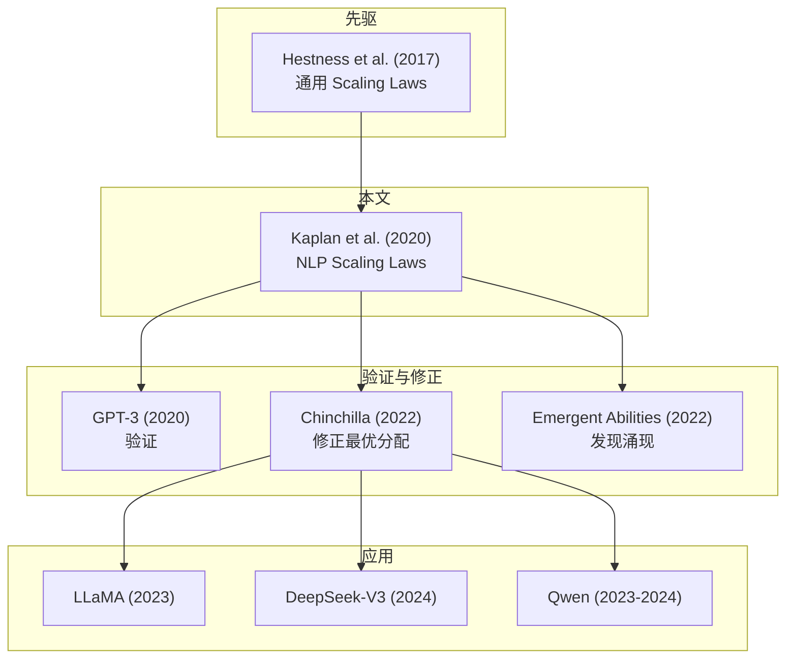

### 13.2 交叉引用

| 相关文档 | 关系 | 详见 |
|---------|------|------|
| Chinchilla 深度解读 | 修正了 Kaplan 的最优分配 | [Chinchilla_Deep_Dive.md](论文精读/Scaling/Chinchilla_Deep_Dive.md) |
| GPT-3 深度解读 | 首次大规模应用 Scaling Laws | [GPT3_Deep_Dive.md](论文精读/Scaling/GPT3_Deep_Dive.md) |
| Scaling Laws 与训练动力学 | 系统性综述所有 Scaling Laws 工作 | [../模型训练/Scaling_Laws_and_Training_Dynamics.md](模型训练/Optimization/Scaling_Laws_and_Training_Dynamics.md) |
| LLaMA 深度解读 | Chinchilla Scaling Laws 的开源实践 | [LLaMA_Deep_Dive.md](论文精读/Architecture/LLaMA_Deep_Dive.md) |
| DeepSeek-V3 深度解读 | 低成本验证 Scaling Laws 精神 | [DeepSeek_V3_Technical_Report.md](论文精读/DeepSeek_V3_Technical_Report.md) |

---

## 14. 总结

### 14.1 三大核心贡献

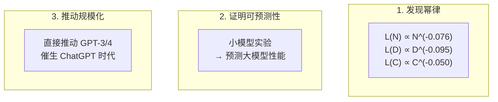

### 14.2 一句话总结

> **Kaplan 的 Scaling Laws 教会了 AI 行业一件事：模型性能是可以预测的——这让"训练大模型"从一场赌博变成了一门科学，直接催生了 GPT-3 到 GPT-4 的规模化竞赛。**

### 14.3 给实践者的建议

| 建议 | 说明 |
|------|------|
| Scaling Laws 仍然有效 | 但使用 Chinchilla 版本的最优分配 |
| 先做小规模实验 | 用小模型验证 Scaling Law 再扩大 |
| 关注 cross-entropy | 它是最可靠的 Scaling Law 指标 |
| 下游任务是近似 | 不同任务的 Scaling 可能有差异 |
| 数据质量很重要 | Scaling Laws 假设所有 token 等价，实际并非如此 |

---

## 参考资料

1. Kaplan, J. et al. "Scaling Laws for Neural Language Models." arXiv:2001.08361, 2020.
2. Hoffmann, J. et al. "Training Compute-Optimal Large Language Models." NeurIPS, 2022.
3. Brown, T. et al. "Language Models are Few-Shot Learners." NeurIPS, 2020.
4. Hestness, J. et al. "Deep Learning Scaling is Predictable, Extrapolatable." arXiv:1712.00409, 2017.
5. Wei, J. et al. "Emergent Abilities of Large Language Models." TMLR, 2022.
6. Schaeffer, R. et al. "Are Emergent Abilities of Large Language Models a Mirage?" NeurIPS, 2023.

---

## Related

- [[../../大模型/LLM_Training|LLM 训练]] — Scaling Laws 指导的训练实践
- [[../../大模型/LLM_Architectures/LLM_Internals_Training|LLM 训练内部机制]] — 训练计算最优策略
- [[../../模型训练/Training_Fundamentals|训练基础]] — 计算资源与训练规模
- [[../../概念/LLM/context-window|上下文窗口概念卡]] — 规模与上下文长度关系
- [[../../深度学习/Optimization/Optimization|优化方法]] — 大规模优化的理论基础

---

*Last updated: 2026-06-12*
