# Training Compute-Optimal Large Language Models (Chinchilla) 深度解读

> 中文简称：Training Compute-Optimal Large Language

> **一句话理解**: Chinchilla 就像告诉你"与其买大房子住一半房间，不如买小房子住满每个房间"——给定预算，小模型+多数据 > 大模型+少数据

---

## 论文基本信息

| 属性 | 内容 |
|------|------|
| **标题** | Training Compute-Optimal Large Language Models |
| **作者** | Jordan Hoffmann, Sebastian Borgeaud, Arthur Mensch, Elena Buchatskaya, Trevor Cai, Eliza Rutherford 等 (DeepMind) |
| **发表** | 2022 年 3 月 (NeurIPS 2022) |
| **引用量** | 5,000+ (截至 2026) |
| **论文链接** | [arXiv:2203.15556](https://arxiv.org/abs/2203.15556) |
| **模型** | Chinchilla (70B 参数) |
| **训练数据** | 1.4T tokens |
| **核心发现** | 参数与数据应等比例扩展: N_opt ∝ C^0.50, D_opt ∝ C^0.50 |

---

## 1. 历史背景：Scaling Laws 之争

### 1.1 两种 Scaling 哲学

在 Chinchilla 之前，大模型训练领域存在两种截然不同的扩展哲学：


### 1.2 为什么 Chinchilla 论文如此重要？

| 维度 | Chinchilla 之前 | Chinchilla 之后 |
|------|-----------------|-----------------|
| **扩展策略** | "越大越好" (参数主导) | "计算最优" (数据+参数平衡) |
| **训练数据量** | 固定 ~300B tokens | 随模型大小线性增长 |
| **模型效率** | 大模型欠训练 | 每个参数充分利用 |
| **推理成本** | 大模型 = 高推理成本 | 更小模型 = 更低推理成本 |
| **行业影响** | GPT-3, PaLM 偏重参数 | LLaMA, Qwen 遵循 Chinchilla |

### 1.3 核心贡献一览

1. **修正了 Kaplan 的 Scaling Laws**：数据 D 的扩展指数从 0.095 提升为 0.50
2. **发现 N 和 D 应等比增长**：N_opt ∝ C^0.50, D_opt ∝ C^0.50
3. **实验验证**：70B 模型 + 1.4T 数据 > 280B 模型 + 300B 数据
4. **为整个行业提供训练配方**：LLaMA、Qwen、Mistral 等全部遵循

---

## 2. 核心方法论：如何找到最优扩展比例

### 2.1 实验设计：大规模扫描

Chinchilla 论文的核心方法论是**参数-数据空间的大规模扫描**：

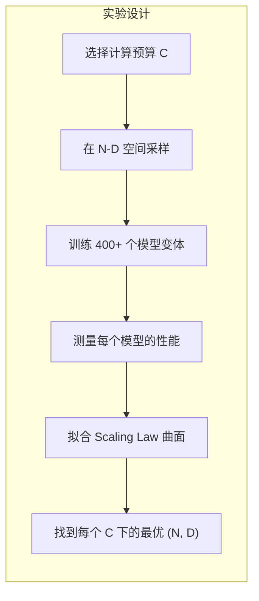

具体来说，研究者训练了 **400 多个不同配置的模型**，覆盖：
- 参数量：从 10M 到 16B
- 训练 token 数：从 5B 到 500B
- 计算预算：从 ~10^19 到 ~10^23 FLOPs

### 2.2 损失函数模型

论文使用三种不同的模型来拟合 Scaling Law：

**模型 1: 独立幂律 (Kaplan 式)**

$$L(N, D) = \left(\frac{N_c}{N}\right)^\alpha + \left(\frac{D_c}{D}\right)^\beta$$

**模型 2: 参数化分解 (论文推荐)**

$$L(N, D) = E + \frac{A}{N^\alpha} + \frac{B}{D^\beta}$$

**模型 3: 计算最优参数化**

$$L(C) = \left(\frac{C_c}{C}\right)^\gamma \quad \text{(沿最优路径)}$$

### 2.3 关键公式推导

通过拟合实验数据，论文得到了核心 Scaling Law 参数：

| 参数 | 模型 1 | 模型 2 (推荐) | 说明 |
|------|--------|---------------|------|
| E | — | 1.69 | 不可约损失 (entropy of natural text) |
| A | — | 406.4 | 参数项系数 |
| B | — | 410.7 | 数据项系数 |
| α | 0.34 | 0.34 | 参数量指数 |
| β | 0.28 | 0.28 | 数据量指数 |

给定总计算预算 C (FLOPs)，最优的参数和数据分配：

$$N_{opt}(C) = \left(\frac{\alpha A}{\beta B}\right)^{\frac{1}{\alpha+\beta}} \cdot \left(\frac{C}{6}\right)^{\frac{\beta}{\alpha+\beta}}$$

$$D_{opt}(C) = \left(\frac{\beta B}{\alpha A}\right)^{\frac{1}{\alpha+\beta}} \cdot \left(\frac{C}{6}\right)^{\frac{\alpha}{\alpha+\beta}}$$

其中 6 是 Transformer 每参数每 token 的 FLOPs 系数 (C ≈ 6ND)。

### 2.4 核心发现：指数 ≈ 0.50

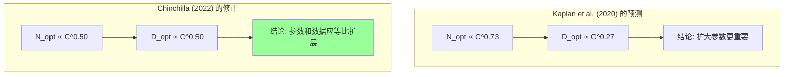

这个发现的意义是**革命性**的：

| 计算预算增长 | Kaplan 预测 N 增长 | Chinchilla 预测 N 增长 | Kaplan 预测 D 增长 | Chinchilla 预测 D 增长 |
|:----------:|:-----------------:|:--------------------:|:-----------------:|:--------------------:|
| 10x | 5.4x | 3.2x | 1.9x | 3.2x |
| 100x | 29x | 10x | 3.4x | 10x |
| 1000x | 155x | 32x | 6.5x | 32x |

**Kaplan 说：计算增加 10 倍，模型大小增加 5.4 倍**
**Chinchilla 说：计算增加 10 倍，模型和数据各增加 3.2 倍**

---

## 3. Chinchilla 模型：实验验证

### 3.1 从 Gopher 到 Chinchilla

Chinchilla 并非从零开始的新模型，而是对 DeepMind 自己的 Gopher (280B) 模型的**修正版**：

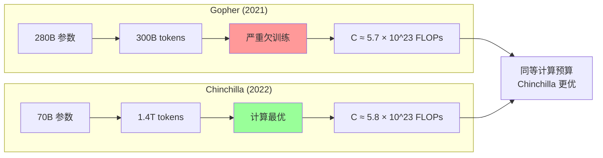

### 3.2 模型配置对比

| 属性 | Gopher | Chinchilla | GPT-3 | PaLM |
|------|--------|------------|-------|------|
| **参数量** | 280B | 70B | 175B | 540B |
| **训练 tokens** | 300B | 1.4T | 300B | 780B |
| **计算量 (FLOPs)** | 5.7×10^23 | 5.8×10^23 | 3.6×10^23 | 2.5×10^24 |
| **Tokens/参数** | 1.1 | 20 | 1.7 | 1.4 |
| **是否 Chinchilla 最优** | 否 | 是 | 否 | 否 |

### 3.3 性能对比：小模型打败大模型

| Benchmark | Gopher 280B | Chinchilla 70B | GPT-3 175B | 提升 |
|-----------|:-----------:|:--------------:|:----------:|:----:|
| **MMLU** | 60.0% | **67.5%** | 43.9% | +7.5 pp |
| **LAMBADA** | 74.5% | **79.6%** | 86.4% | +5.1 pp |
| **HellaSwag** | 79.0% | **81.8%** | 85.5% | +2.8 pp |
| **Winogrande** | 70.4% | **74.7%** | 69.9% | +4.3 pp |
| **PIQA** | 79.9% | **82.1%** | 82.4% | +2.2 pp |
| **ARC-Easy** | 71.4% | **74.9%** | 67.3% | +3.5 pp |
| **ARC-Challenge** | 42.1% | **43.7%** | 41.4% | +1.6 pp |
| **BoolQ** | 79.3% | **82.8%** | 75.7% | +3.5 pp |

> **核心结论**: Chinchilla 70B 在几乎所有 benchmark 上超过 Gopher 280B，而推理成本仅为 1/4。

### 3.4 训练数据

Chinchilla 使用了比 Gopher 更丰富且更高质量的训练数据：

| 数据源 | Gopher 占比 | Chinchilla 占比 | 说明 |
|--------|:----------:|:--------------:|------|
| MassiveWeb | 78% | 67% | 网页爬取 |
| MassiveText | 14% | 15% | 书籍、维基百科等 |
| Books | 3% | 4.5% | 版权书籍 |
| Code (GitHub) | — | 5% | 新增代码数据 |
| Wikipedia | 3% | 4.5% | 多语言维基 |
| News | 2% | 4% | 新闻文章 |

### 3.5 模型架构细节

| 架构参数 | 值 |
|---------|-----|
| **总层数** | 80 |
| **隐藏维度** | 8192 |
| **注意力头数** | 64 |
| **注意力头维度** | 128 |
| **FFN 维度** | 32768 (4× hidden) |
| **词汇表大小** | 32000 (SentencePiece) |
| **位置编码** | 相对位置编码 (ALiBi 变体) |
| **LayerNorm** | 前置 (Pre-LN) |
| **激活函数** | GELU |

---

## 4. Scaling Laws 深度解析

### 4.1 损失曲面可视化

Chinchilla 论文最重要的贡献之一是绘制了完整的**损失曲面 (loss landscape)**：

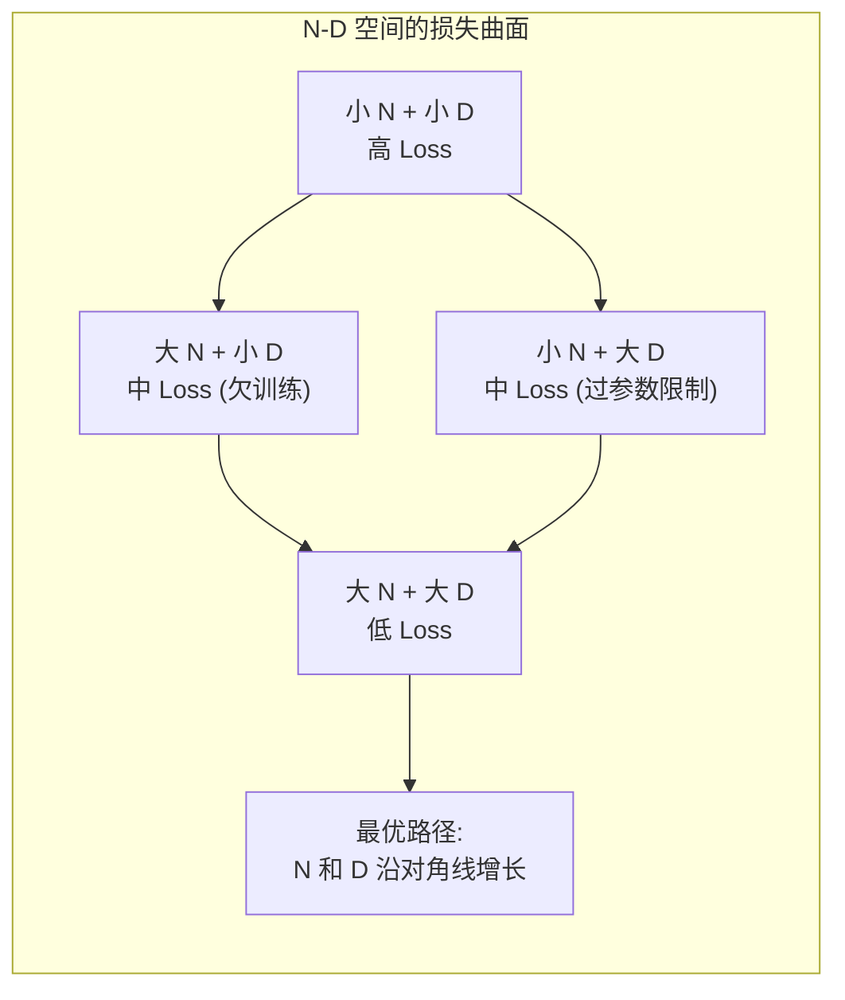

**关键洞察**：
- 在固定 N 的情况下，增加 D 有**递减收益**（B/D^β）
- 在固定 D 的情况下，增加 N 有**递减收益**（A/N^α）
- **最优策略**是在两者之间平衡分配计算预算

### 4.2 Kaplan vs. Chinchilla 指数对比

| Scaling 关系 | Kaplan 指数 | Chinchilla 指数 | 差异含义 |
|:-----------:|:-----------:|:--------------:|---------|
| L(N) ∝ N^(-α) | 0.076 | 0.34 | Chinchilla 认为 N 的作用被**严重低估** |
| L(D) ∝ D^(-β) | 0.095 | 0.28 | 两者对 D 的评价接近 |
| L(C) ∝ C^(-γ) | 0.050 | 0.17 | 综合效率显著提升 |
| N_opt ∝ C^a | 0.73 | **0.50** | 参数增长应放缓 |
| D_opt ∝ C^b | 0.27 | **0.50** | 数据增长应加速 |

> **为什么两个结论差异这么大？**
> Kaplan 的实验主要在**固定数据量**下扫描参数量，未能充分探索 N-D 联合空间。
> Chinchilla 的 400+ 模型扫描覆盖了完整的 N-D 空间。

### 4.3 Chinchilla 最优表

论文给出了不同计算预算下的最优配置（实用参考表）：

| 计算预算 (FLOPs) | 最优参数量 N | 最优数据量 D (tokens) | Tokens/参数 |
|:---------------:|:----------:|:-------------------:|:-----------:|
| 10^19 | 46M | 0.8B | 17 |
| 10^20 | 145M | 2.5B | 17 |
| 10^21 | 459M | 8B | 17 |
| 10^22 | 1.45B | 25B | 17 |
| 10^23 | 4.6B | 80B | 17 |
| 10^24 | 14.5B | 250B | 17 |
| 3.6×10^23 (GPT-3) | 11.4B | 130B | 11 |
| 5.8×10^23 (Chinchilla) | 16.1B | 180B | 11 |

> **经验法则**: 对于 Chinchilla 最优，每个参数大约需要 **20 个训练 tokens**。

---

## 5. 对现代 LLM 的影响

### 5.1 Chinchilla 如何改变了 LLM 训练

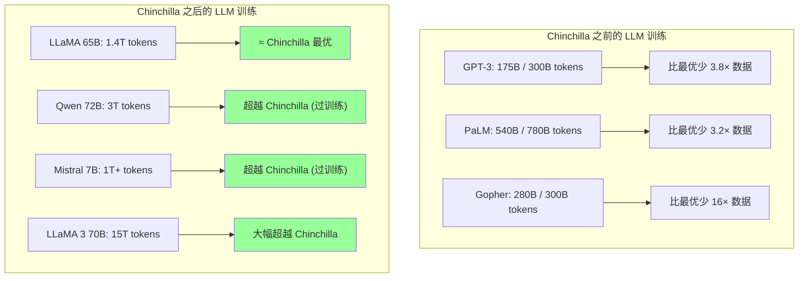

### 5.2 现代 LLM 对 Chinchilla 的遵循程度

| 模型 | 参数量 | Tokens | Tokens/参数 | Chinchilla 比例 | 策略 |
|------|:------:|:------:|:-----------:|:--------------:|------|
| GPT-3 (2020) | 175B | 300B | 1.7 | 8% | 严重欠训练 |
| PaLM (2022) | 540B | 780B | 1.4 | 7% | 严重欠训练 |
| Gopher (2021) | 280B | 300B | 1.1 | 5% | 极度欠训练 |
| **Chinchilla (2022)** | **70B** | **1.4T** | **20** | **100%** | **计算最优** |
| LLaMA 65B (2023) | 65B | 1.4T | 21.5 | 108% | 轻微过训练 |
| LLaMA 2 70B (2023) | 70B | 2T | 28.6 | 143% | 过训练 |
| Qwen 72B (2023) | 72B | 3T | 41.7 | 209% | 大幅过训练 |
| Mistral 7B (2023) | 7B | ~1T | ~143 | 715% | 极度"过训练" |
| LLaMA 3 70B (2024) | 70B | 15T | 214 | 1070% | 极度"过训练" |

### 5.3 "过训练"是好是坏？

Chinchilla 之后的一个有趣发现是：**适度"过训练"（训练超过 Chinchilla 最优的 token 数）是有价值的**：

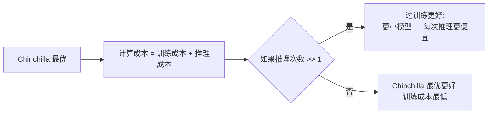

**核心论点**:
- Chinchilla 只优化了**训练**成本
- 当模型被部署后，每次推理都消耗计算
- 如果模型被调用 N 次，总成本 = 训练成本 + N × 推理成本
- **更小的模型**每次推理更便宜，即使需要更多训练数据
- 这就是为什么 LLaMA 3 70B 用了 15T tokens 而不是 1.4T

---

## 6. 实验方法与关键技术细节

### 6.1 IsoFLOP 分析

论文引入了 **IsoFLOP 分析**（等计算量分析）方法：


**具体步骤**:
1. 对每个计算预算 C_i，训练多个 (N, D) 组合
2. 拟合每个 C_i 的 N-D-Loss 曲面
3. 找到每个 C_i 的 (N_opt, D_opt)
4. 拟合 N_opt(C) 和 D_opt(C) 的幂律关系

### 6.2 三种拟合方法对比

论文使用了三种不同的方法来估计 Scaling Laws：

| 方法 | 描述 | 优点 | 缺点 | N_opt 指数 | D_opt 指数 |
|------|------|------|------|:----------:|:----------:|
| **方法 1: 独立拟合** | 分别拟合 L(N) 和 L(D) | 简单 | 忽略 N-D 耦合 | 0.73 | 0.27 |
| **方法 2: 参数化分解** | 联合拟合 L(N,D) | 考虑耦合 | 假设加性分解 | **0.50** | **0.50** |
| **方法 3: IsoFLOP** | 在等高线上找最优 | 无参数假设 | 需要密集采样 | **0.49** | **0.51** |

> 方法 2 和方法 3 的结果高度一致 (0.50 vs 0.49)，互相验证了核心结论。

### 6.3 消融实验

论文进行了多项消融实验来验证结论的鲁棒性：

| 消融实验 | 结果 |
|---------|------|
| 不同数据分布 | Scaling Laws 在不同数据混合比例下保持一致 |
| 不同评估指标 | Cross-entropy 和下游任务表现一致 |
| 不同优化器 | AdamW 超参数对 Scaling Laws 影响微小 |
| 不同架构 | Scaling Laws 对架构变化 (如注意力类型) 相对鲁棒 |
| 过训练测试 | 超出 Chinchilla 最优后收益递减但持续下降 |

---

## 7. 与其他 Scaling Laws 工作的关系

### 7.1 Scaling Laws 发展时间线

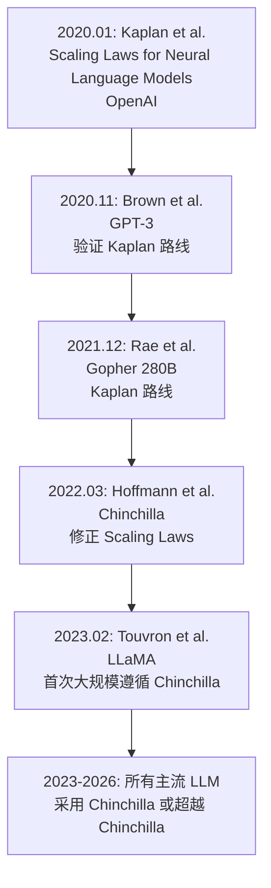

### 7.2 与相关工作对比

| 论文 | 年份 | 核心贡献 | 对 Chinchilla 的关系 |
|------|------|---------|-------------------|
| Kaplan et al. | 2020 | 首次系统研究 NLP Scaling Laws | Chinchilla 修正了其结论 |
| GPT-3 | 2020 | 验证大模型少样本学习 | 使用了 Kaplan 路线（欠训练） |
| GPT-4 TR | 2023 | 多模态大模型 | 可能遵循 Chinchilla + 过训练 |
| LLaMA | 2023 | 开源高效模型 | 直接应用 Chinchilla |
| LLaMA 2 | 2023 | 开源 + 商用 | Chinchilla + 2× 过训练 |
| LLaMA 3 | 2024 | 开源标杆 | Chinchilla + 10× 过训练 |
| DeepSeek-V3 | 2024 | 低成本 MoE | 隐含遵循 Chinchilla 精神 |
| Qwen 2.5 | 2024 | 中国开源代表 | 大幅过训练策略 |

---

## 8. 数学深入：损失函数的三个组成部分

### 8.1 完整公式展开

Chinchilla 的损失函数模型可以写为：

$$L(N, D) = \underbrace{E}_{\text{不可约损失}} + \underbrace{\frac{A}{N^\alpha}}_{\text{参数不足损失}} + \underbrace{\frac{B}{D^\beta}}_{\text{数据不足损失}}$$

其中：
- **E ≈ 1.69**: 自然文本的信息熵下界（任何模型都无法超越）
- **A/N^α**: 模型参数不足以捕获所有模式导致的损失
- **B/D^β**: 训练数据不足以让模型学到所有知识导致的损失

### 8.2 直觉理解

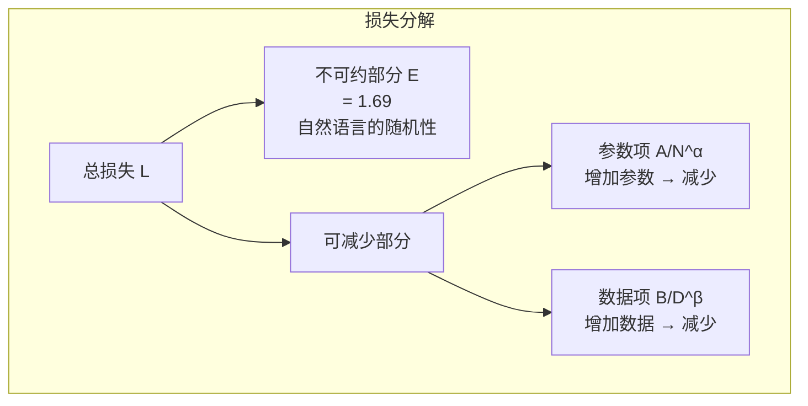

### 8.3 数值示例

以 Chinchilla 的计算预算 C = 5.8 × 10^23 FLOPs 为例：

| 配置 | N | D (tokens) | A/N^α | B/D^β | L(N,D) |
|------|--:|----------:|------:|------:|-------:|
| Gopher 式 | 280B | 300B | 0.051 | 0.141 | **1.88** |
| Chinchilla | 70B | 1.4T | 0.082 | 0.054 | **1.83** |
| 极端大模型 | 1T | 100B | 0.032 | 0.221 | **1.94** |
| 极端数据 | 1B | 50T | 0.384 | 0.019 | **2.09** |

> Chinchilla 的 A/N^α 和 B/D^β 近乎相等，说明在最优配置下，参数和数据的"贡献"是平衡的。

---

## 9. 实践指导：如何使用 Chinchilla Scaling Laws

### 9.1 计算最优计算器

给定你的计算预算 C (FLOPs)，可以用以下公式计算最优配置：

```python
import math

def chinchilla_optimal(C_flops: float):
    """
    计算 Chinchilla 最优的参数量和数据量
    C_flops: 总计算预算 (FLOPs)
    """
    # Chinchilla 论文的参数
    A, B = 406.4, 410.7
    alpha, beta = 0.34, 0.28
    
    # N_opt 和 D_opt 的指数
    a = beta / (alpha + beta)   # ≈ 0.45
    b = alpha / (alpha + beta)  # ≈ 0.55
    
    # 系数
    N_coeff = (alpha * A / (beta * B)) ** (1 / (alpha + beta))
    D_coeff = (beta * B / (alpha * A)) ** (1 / (alpha + beta))
    
    N_opt = N_coeff * (C_flops / 6) ** a
    D_opt = D_coeff * (C_flops / 6) ** b
    
    return N_opt, D_opt

# 示例：10^24 FLOPs 的预算
N, D = chinchilla_optimal(1e24)
print(f"最优参数量: {N/1e9:.1f}B")
print(f"最优数据量: {D/1e9:.0f}B tokens")
print(f"Tokens/参数: {D/N:.1f}")
```

### 9.2 实践决策树

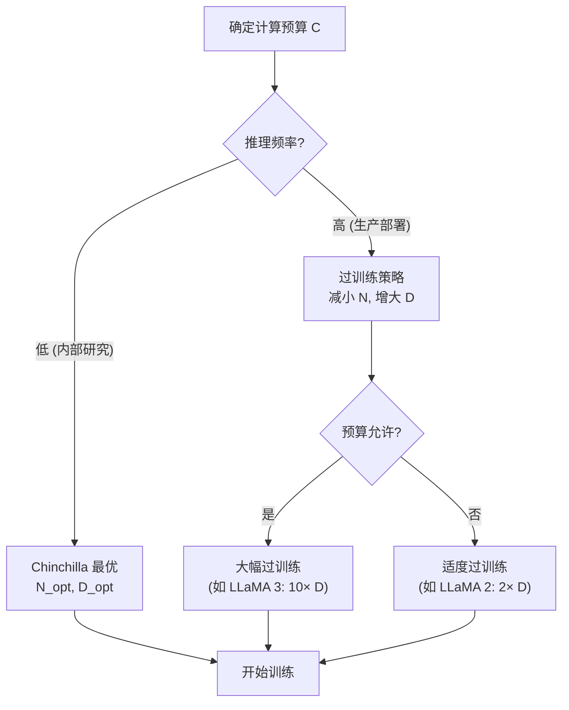

### 9.3 经验法则速查

| 场景 | 推荐策略 | Tokens/参数 | 示例 |
|------|---------|:----------:|------|
| 研究原型 | Chinchilla 最优 | ~20 | Chinchilla 70B |
| 生产部署 | 2-5× 过训练 | 40-100 | LLaMA 2 70B |
| 高频推理 | 5-20× 过训练 | 100-400 | Mistral 7B |
| 极限性能 | 20×+ 过训练 | 400+ | LLaMA 3 70B |

---

## 10. 局限性与后续发展

### 10.1 Chinchilla 的局限

| 局限 | 说明 |
|------|------|
| **只考虑训练成本** | 忽略了推理成本在实际部署中的重要性 |
| **假设固定架构** | 未考虑架构创新（如 MoE、SSM）的影响 |
| **数据质量未建模** | 假设所有数据等价，未考虑数据质量和多样性 |
| **下游任务差异** | Scaling Laws 基于 cross-entropy，不直接预测下游任务表现 |
| **小规模外推** | 最大实验规模为 16B，外推到 70B+ 有不确定性 |
| **未考虑 RLHF/对齐** | 对齐训练的成本和效果未纳入 Scaling Laws |

### 10.2 后续重要工作

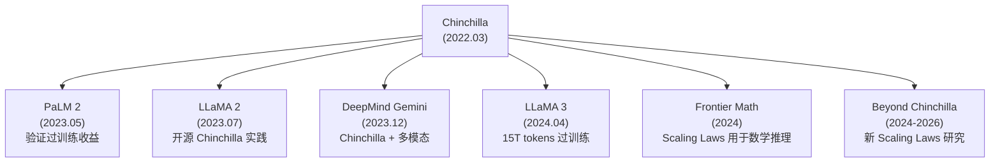

### 10.3 超越 Chinchilla 的新发现

1. **数据质量 Scaling**: 高质量数据的 Scaling 曲线更陡（效果更好）
2. **MoE Scaling**: MoE 模型的 Scaling Laws 与 Dense 不同，有效参数量需要重新计算
3. **RLHF Scaling**: 对齐训练也展现出 Scaling Law 特性
4. **Test-time Compute**: 推理时增加计算量也能提升性能，形成新的 Scaling 维度
5. **涌现能力 (Emergent Abilities)**: 某些能力在特定规模突然出现，不完全遵循平滑幂律

---

## 11. 与其他论文的关系

### 11.1 引用关系图

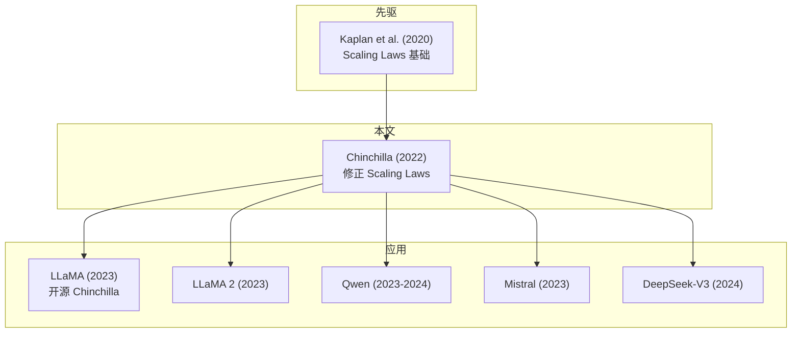

### 11.2 关键交叉引用

| 相关论文 | 关系 | 详见 |
|---------|------|------|
| Kaplan et al. Scaling Laws | Chinchilla 修正了其结论 | [05_扩展定律_深入分析.md](20_论文精读/03_规模扩展/05_扩展定律_深入分析.md) |
| GPT-3 | 使用了 Kaplan 路线（欠训练） | [02_GPT3_深入分析.md](20_论文精读/03_规模扩展/02_GPT3_深入分析.md) |
| LLaMA | 首个大规模遵循 Chinchilla 的开源模型 | [04_LLaMA_深入分析.md](20_论文精读/02_模型架构/04_LLaMA_深入分析.md) |
| DeepSeek-V3 | 在 MoE 架构中隐含遵循 Chinchilla 精神 | [01_深度Seek_V3_Technical_报告.md](20_论文精读/09_前沿探索/01_深度Seek_V3_Technical_报告.md) |
| Scaling Laws 与训练动力学 | 系统性综述 | [../07_模型训练/06_扩展定律_and_训练_Dynamics.md](07_模型训练/03_训练优化/06_扩展定律_and_训练_Dynamics.md) |
| MoE 深度解读 | MoE 模型的 Scaling 特殊性 | [06_混合专家_深入分析.md](20_论文精读/02_模型架构/06_混合专家_深入分析.md) |

---

## 12. 总结：Chinchilla 的核心遗产

### 12.1 三大核心贡献

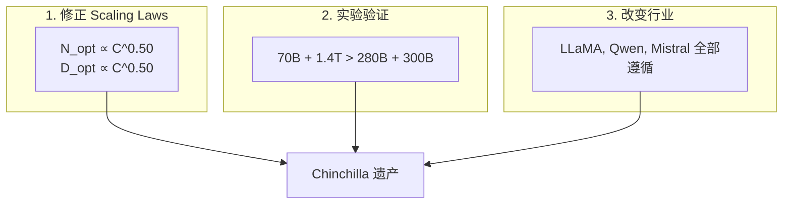

### 12.2 一句话总结

> **Chinchilla 证明了：在 AI 训练中，"勤奋"（更多数据）和"天赋"（更多参数）同样重要，而不是只追求天赋。这改变了整个行业训练大模型的方式。**

### 12.3 给实践者的建议

| 建议 | 说明 |
|------|------|
| 先用 Chinchilla 公式估算 | 在开始训练前计算最优 N 和 D |
| 数据质量 > 数据数量 | 高质量 1T > 低质量 10T |
| 过训练是值得的 | 尤其对于推理密集的部署场景 |
| 监控训练曲线 | 如果 loss 仍在下降，可能值得继续训练更多数据 |
| 考虑 MoE | MoE 改变了"参数量"的含义，需要重新计算 |

---

## 参考资料

1. Hoffmann, J. et al. "Training Compute-Optimal Large Language Models." NeurIPS 2022.
2. Kaplan, J. et al. "Scaling Laws for Neural Language Models." 2020.
3. Touvron, H. et al. "LLaMA: Open and Efficient Foundation Language Models." 2023.
4. Rae, J.W. et al. "Scaling Language Models: Methods, Analysis & Insights from Training Gopher." 2021.
5. Chowdhery, A. et al. "PaLM: Scaling Language Modeling with Pathways." 2022.

---

*Last updated: 2026-06-12*

## Related

- [[20_论文精读/README|22 经典与必读 AI 论文清单 (Essential AI Papers)]]
