# RLHF 与 DPO 深度解读 (从 InstructGPT 到 Direct Preference Optimization)

> **一句话理解**: RLHF 就像给一个博览群书但口无遮拦的天才请了一个"礼仪教练"——通过人类反馈的奖励信号，教会模型什么是"好回答"、什么是"坏回答"，而 DPO 则直接从偏好数据中学习，跳过了复杂的强化学习训练过程。

---

## 论文基本信息

| 属性 | 内容 |
|------|------|
| **核心论文 1** | Training language models to follow instructions with human feedback (InstructGPT) |
| **InstructGPT 作者** | Long Ouyang, Jeff Wu 等 (OpenAI) |
| **发表** | NeurIPS 2022 |
| **论文链接** | [arXiv:2203.02155](https://arxiv.org/abs/2203.02155) |
| **核心论文 2** | Direct Preference Optimization: Your Language Model is Secretly a Reward Model (DPO) |
| **DPO 作者** | Rafael Rafailov, Archit Sharma 等 (Stanford) |
| **发表** | NeurIPS 2023 |
| **论文链接** | [arXiv:2305.18290](https://arxiv.org/abs/2305.18290) |

---

## 1. 历史背景：为什么需要对齐？

### 1.1 基础模型的问题

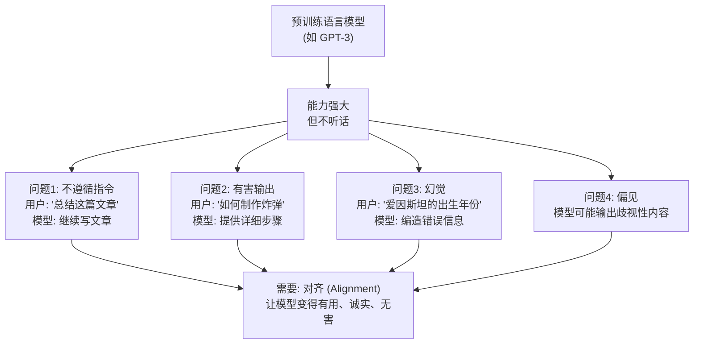

### 1.2 对齐的三个目标 (HHH)

| 目标 | 英文 | 含义 | 示例 |
|------|------|------|------|
| **有用** | Helpful | 准确理解用户意图并给出有用回答 | 用户问天气，给出准确预报 |
| **诚实** | Honest | 不编造信息，承认不确定性 | 不确定时说"我不确定" |
| **无害** | Harmless | 拒绝有害请求，避免歧视性输出 | 拒绝提供暴力指导 |

### 1.3 对齐方法的演进

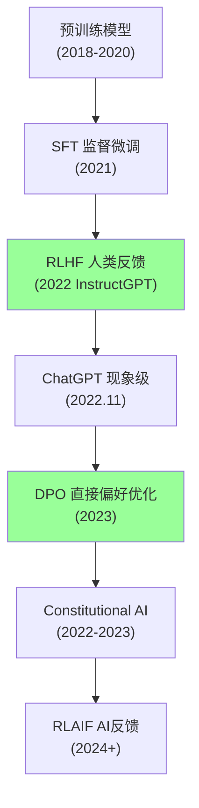

---

## 2. InstructGPT：三阶段 RLHF

### 2.1 整体流程

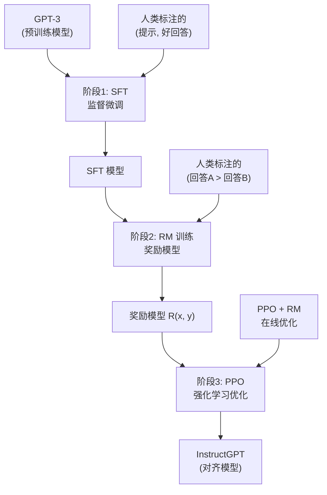

### 2.2 阶段 1：监督微调 (SFT)

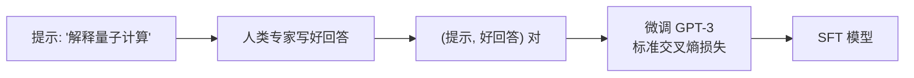

**SFT 数据**：

| 数据类型 | 数量 | 来源 |
|---------|------|------|
| **指令跟随** | ~13,000 | 人工编写的提示 + 优质回答 |
| **API 请求** | ~30,000 | OpenAI API 真实用户请求 |

**训练细节**：

| 配置 | 值 |
|------|-----|
| **基础模型** | GPT-3 (175B) |
| **训练轮数** | 16 epochs |
| **学习率** | 余弦衰减，峰值 5.73e-6 |
| **Batch Size** | 32 |
| **损失函数** | 标准自回归交叉熵 |

### 2.3 阶段 2：奖励模型 (RM) 训练

**核心思想**：训练一个模型，给它一个 (提示, 回答) 对，输出一个标量分数，代表回答的质量。

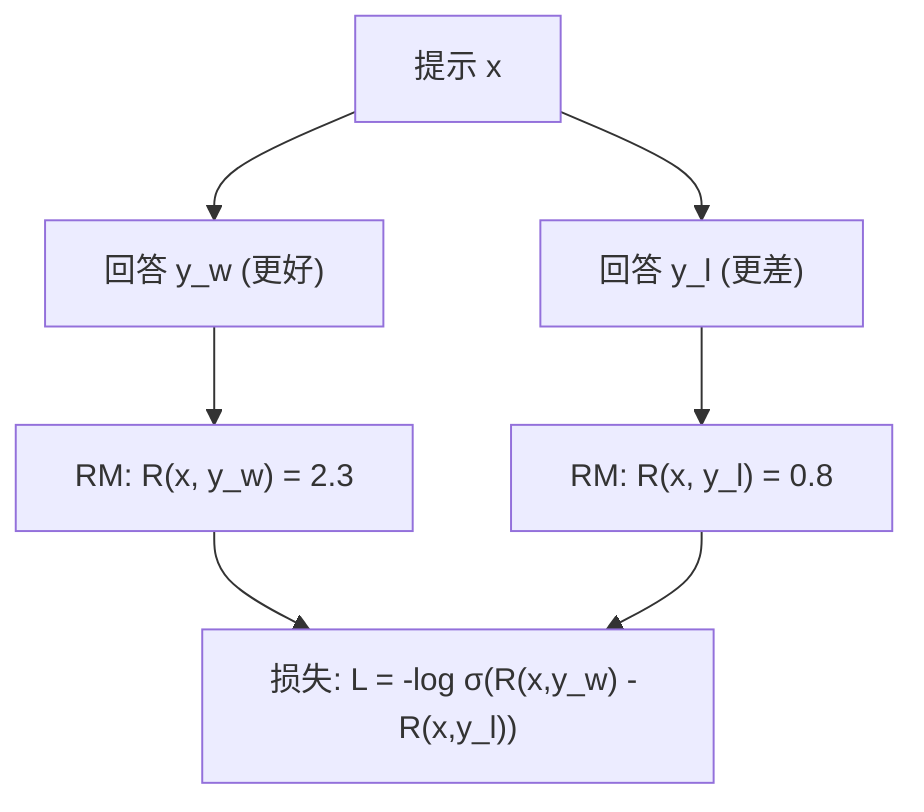

**RM 训练的 Bradley-Terry 模型**：

人类偏好假设：$y_w \succ y_l$（$y_w$ 比 $y_l$ 更好）的概率为：

$$
P(y_w \succ y_l | x) = \sigma(r_\theta(x, y_w) - r_\theta(x, y_l))
$$

$$
\mathcal{L}_{\text{RM}} = -\mathbb{E}_{(x, y_w, y_l)} \left[ \log \sigma(r_\theta(x, y_w) - r_\theta(x, y_l)) \right]
$$

其中 $\sigma$ 是 sigmoid 函数。

**RM 架构**：

```
GPT-3 (去掉最后的 unembedding 层)
    ↓
加上一个线性投影头: d_model → 1
    ↓
输出标量奖励值 R(x, y)
```

| 配置 | 值 |
|------|-----|
| **RM 基础模型** | GPT-3 6B |
| **训练数据** | ~50,000 对比数据 |
| **偏好标注** | 每个提示 4-9 个回答，人工排序 |
| **损失函数** | Bradley-Terry 排序损失 |

### 2.4 阶段 3：PPO 强化学习优化

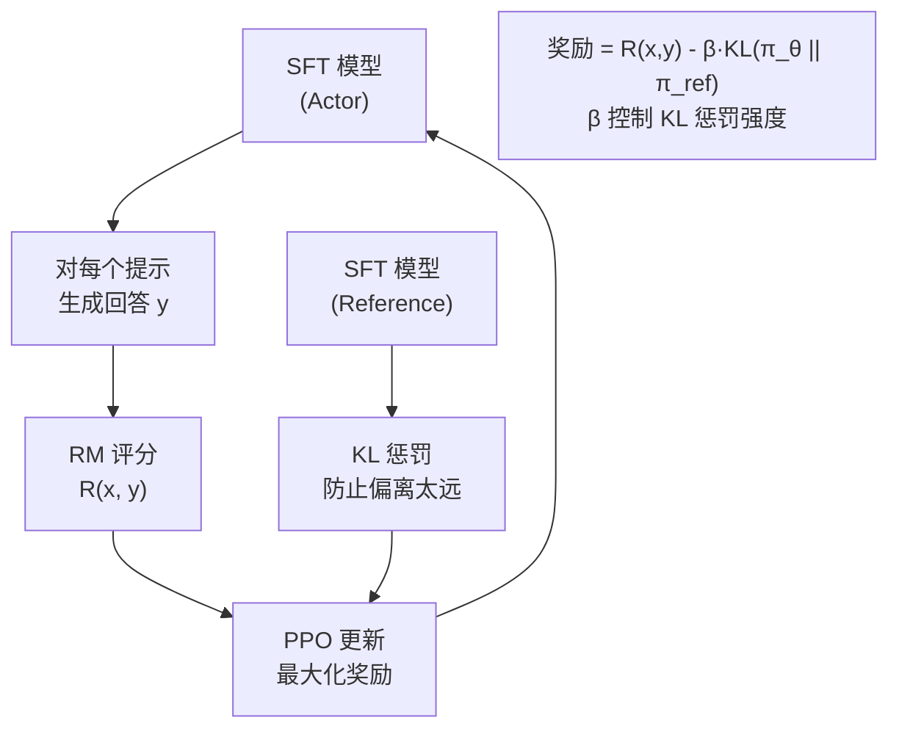

**PPO 目标函数**：

$$
\mathcal{L}_{\text{PPO}} = \mathbb{E}_{x \sim D, y \sim \pi_\theta} \left[ \min\left( r_t(\theta) \hat{A}_t, \text{clip}(r_t(\theta), 1-\epsilon, 1+\epsilon) \hat{A}_t \right) \right]
$$

其中 $r_t(\theta) = \frac{\pi_\theta(y|x)}{\pi_{\text{ref}}(y|x)}$ 是概率比。

**实际使用的奖励**（加上 KL 惩罚）：

$$
R(x, y) = r_\theta(x, y) - \beta \cdot \text{KL}(\pi_\theta(\cdot|x) \| \pi_{\text{ref}}(\cdot|x))
$$

| PPO 超参数 | 值 | 作用 |
|-----------|-----|------|
| **KL 惩罚系数 β** | 0.2 | 防止模型偏离 SFT 太远 |
| **PPO clip ε** | 0.2 | 限制策略更新幅度 |
| **折扣因子 γ** | 1.0 | 单步奖励，不需要折扣 |
| **Batch Size** | 1024 | 每个 PPO epoch |
| **PPO Epochs** | 更新多次 | 每批数据的迭代次数 |

### 2.5 InstructGPT 的惊人结果

**1.3B InstructGPT > 175B GPT-3**

| 模型 | 参数量 | 人类偏好胜率 |
|------|--------|------------|
| GPT-3 (175B) | 175B | 基准 |
| SFT (175B) | 175B | 比 GPT-3 好 |
| **InstructGPT (1.3B)** | **1.3B** | **比 175B GPT-3 更受欢迎** |

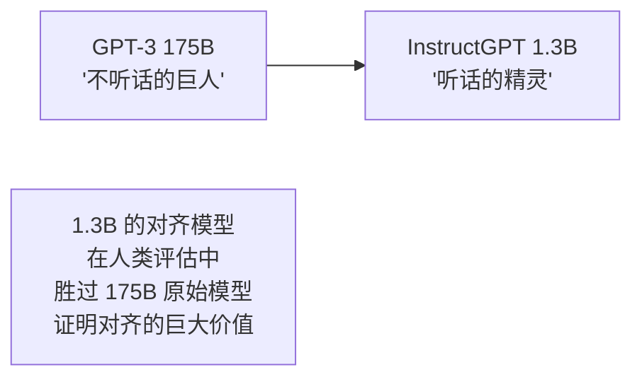

---

## 3. DPO：直接偏好优化

### 3.1 RLHF 的痛点

| RLHF 问题 | 说明 |
|-----------|------|
| **复杂** | 需要 3 个阶段（SFT → RM → PPO） |
| **不稳定** | PPO 训练超参数敏感 |
| **成本高** | 需要训练 RM + 在线采样 + PPO 更新 |
| **奖励黑客** | 模型可能利用 RM 的漏洞获得高分 |

### 3.2 DPO 的核心洞察

**关键数学推导**：从 RLHF 的 KL 约束奖励最大化问题出发：

$$
\max_{\pi_\theta} \mathbb{E}_{x \sim D, y \sim \pi_\theta} [r(x,y)] - \beta \text{KL}(\pi_\theta \| \pi_{\text{ref}})
$$

这个优化问题的**闭式最优解**为：

$$
\pi^*(y|x) = \frac{1}{Z(x)} \pi_{\text{ref}}(y|x) \exp\left(\frac{1}{\beta} r(x,y)\right)
$$

**重新排列**，用最优策略表示奖励函数：

$$
r(x,y) = \beta \log \frac{\pi^*(y|x)}{\pi_{\text{ref}}(y|x)} + \beta \log Z(x)
$$

**代入 Bradley-Terry 偏好模型**，配分函数 $Z(x)$ 被消掉：

$$
P(y_w \succ y_l | x) = \sigma\left(\beta \log \frac{\pi_\theta(y_w|x)}{\pi_{\text{ref}}(y_w|x)} - \beta \log \frac{\pi_\theta(y_l|x)}{\pi_{\text{ref}}(y_l|x)}\right)
$$

**DPO 损失函数**：

$$
\boxed{\mathcal{L}_{\text{DPO}} = -\mathbb{E}_{(x, y_w, y_l)} \left[ \log \sigma\left( \beta \log \frac{\pi_\theta(y_w|x)}{\pi_{\text{ref}}(y_w|x)} - \beta \log \frac{\pi_\theta(y_l|x)}{\pi_{\text{ref}}(y_l|x)} \right) \right]}
$$

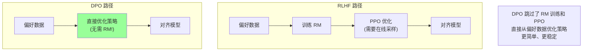

### 3.3 DPO vs RLHF 对比

| 维度 | RLHF | DPO |
|------|------|-----|
| **训练阶段** | 3 阶段 (SFT+RM+PPO) | **2 阶段 (SFT+DPO)** |
| **奖励模型** | 需要显式训练 | **不需要**（隐式在策略中） |
| **在线采样** | 需要（PPO 每步采样） | **不需要**（离线数据） |
| **训练稳定性** | 较差（PPO 超参敏感） | **更好**（标准监督学习） |
| **计算成本** | 高（多模型） | **低**（单模型） |
| **理论最优性** | 近似最优 | **理论等价**（相同目标） |
| **实现复杂度** | 高 | **低**（几十行代码） |

### 3.4 DPO 损失的梯度分析

$$
\nabla_\theta \mathcal{L}_{\text{DPO}} = -\beta \mathbb{E}_{(x,y_w,y_l)} \left[ \underbrace{\hat{r}(x,y_l) - \hat{r}(x,y_w)}_{\text{隐式奖励差}} \cdot \sigma(\cdot) \cdot \left( \nabla_\theta \log \pi_\theta(y_w|x) - \nabla_\theta \log \pi_\theta(y_l|x) \right) \right]
$$

**直觉解释**：
- 当 $\hat{r}(x, y_w) > \hat{r}(x, y_l)$（正确排序），梯度接近零 → 已学好
- 当 $\hat{r}(x, y_l) > \hat{r}(x, y_w)$（错误排序），梯度大 → 积极纠正
- 效果：**增加好回答的概率，降低坏回答的概率**

---

## 4. Constitutional AI (CAI)

### 4.1 核心思想

Constitutional AI 由 Anthropic 提出，核心是**用 AI 代替人类进行偏好标注**：

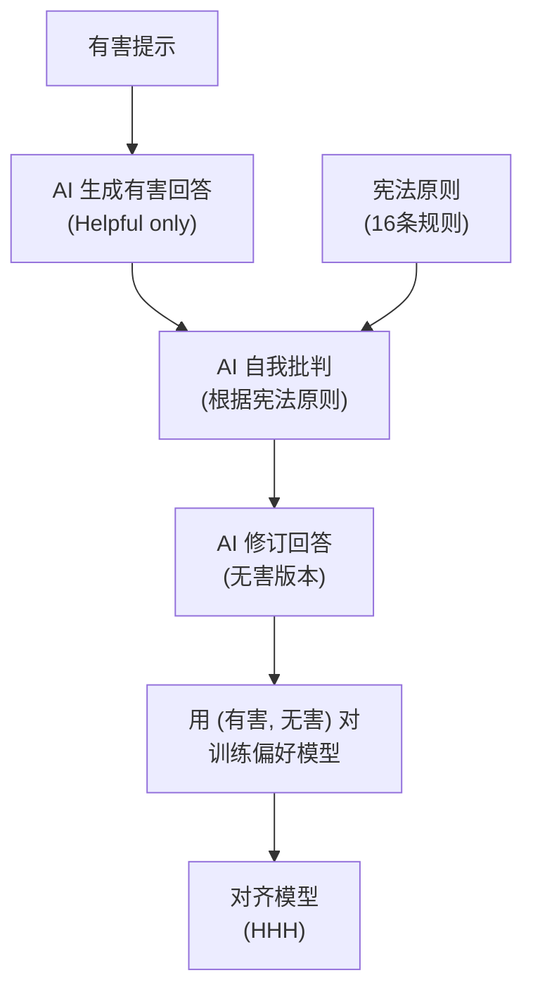

### 4.2 Constitutional AI 的两阶段流程

**阶段 1：监督学习 (SL)**
1. 用 Helpful 模型生成回答（可能有害）
2. 模型根据宪法原则**自我批判**
3. 模型**修订**回答为无害版本
4. 用修订后的回答微调模型

**阶段 2：RL from AI Feedback (RLAIF)**
1. 模型对两个回答进行**偏好评估**
2. 用 AI 偏好数据训练 RM
3. 用 PPO 优化策略

### 4.3 宪法原则示例

| # | 原则 |
|---|------|
| 1 | 选择最无害且最有帮助的回答 |
| 2 | 选择不鼓励非法活动的回答 |
| 3 | 选择最道德且尊重所有人的回答 |
| ... | ... |
| 16 | 选择最尊重隐私的回答 |

---

## 5. RLAIF：用 AI 代替人类标注

### 5.1 RLAIF 流程

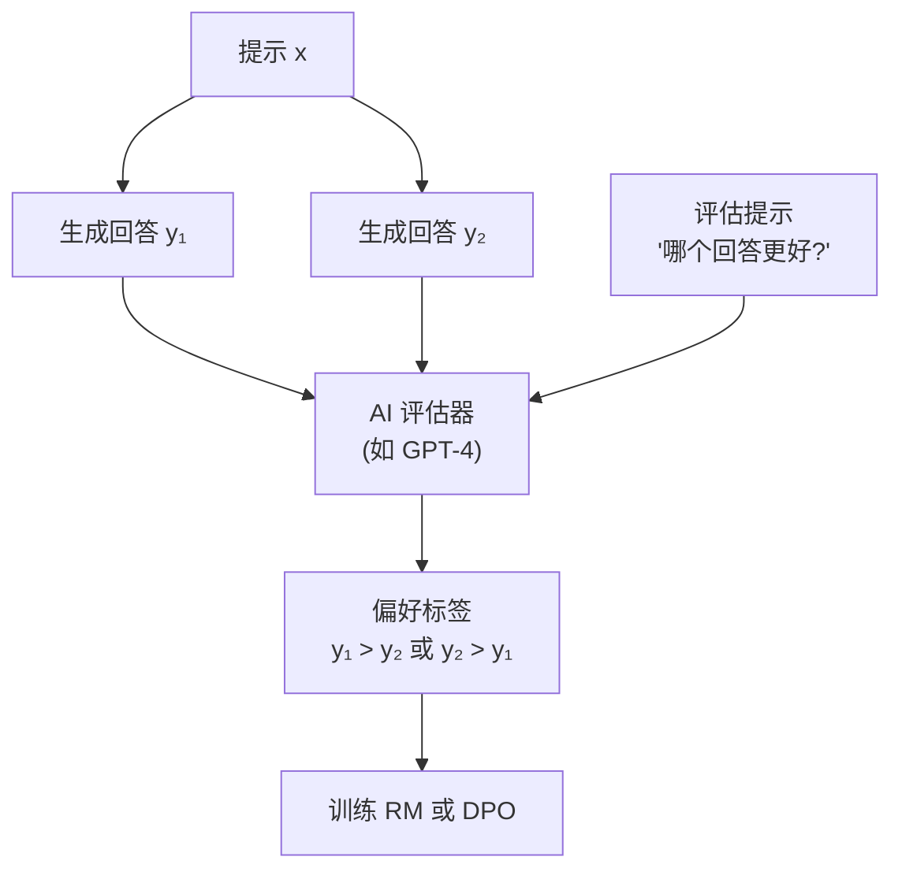

### 5.2 RLAIF vs RLHF

| 维度 | RLHF | RLAIF |
|------|------|-------|
| **标注者** | 人类 | AI 模型 |
| **成本** | 高（人力） | 低（API 调用） |
| **速度** | 慢（天/周） | 快（小时） |
| **一致性** | 中等（人类主观） | 高（AI 一致性） |
| **质量** | 高 | 接近人类（GPT-4） |
| **可扩展性** | 受限于人力 | 可无限扩展 |

---

## 6. 代码实战

### 6.1 DPO 训练实现

```python
import torch
import torch.nn.functional as F
from transformers import AutoModelForCausalLM, AutoTokenizer
from typing import Dict, List
import math

class DPOTrainer:
    def __init__(
        self,
        model_name_or_path: str,
        ref_model_name_or_path: str = None,
        beta: float = 0.1,
        learning_rate: float = 5e-7,
        max_length: int = 512,
    ):
        self.beta = beta
        self.max_length = max_length
        
        self.model = AutoModelForCausalLM.from_pretrained(
            model_name_or_path, torch_dtype=torch.float16, device_map="auto"
        )
        self.ref_model = AutoModelForCausalLM.from_pretrained(
            ref_model_name_or_path or model_name_or_path,
            torch_dtype=torch.float16,
            device_map="auto",
        )
        self.ref_model.eval()
        
        self.tokenizer = AutoTokenizer.from_pretrained(model_name_or_path)
        if self.tokenizer.pad_token is None:
            self.tokenizer.pad_token = self.tokenizer.eos_token
        
        self.optimizer = torch.optim.AdamW(self.model.parameters(), lr=learning_rate)
    
    def _get_log_probs(self, model, input_ids, attention_mask, labels):
        outputs = model(input_ids=input_ids, attention_mask=attention_mask)
        logits = outputs.logits
        
        shift_logits = logits[..., :-1, :].contiguous()
        shift_labels = labels[..., 1:].contiguous()
        
        loss_mask = shift_labels != -100
        
        log_probs = F.log_softmax(shift_logits, dim=-1)
        per_token_log_probs = torch.gather(
            log_probs, dim=-1, index=shift_labels.unsqueeze(-1)
        ).squeeze(-1)
        
        per_token_log_probs = per_token_log_probs * loss_mask
        return per_token_log_probs.sum(dim=-1) / loss_mask.sum(dim=-1).clamp(min=1)
    
    def dpo_loss(self, policy_chosen_logps, policy_rejected_logps,
                 ref_chosen_logps, ref_rejected_logps):
        chosen_rewards = self.beta * (policy_chosen_logps - ref_chosen_logps)
        rejected_rewards = self.beta * (policy_rejected_logps - ref_rejected_logps)
        
        logits = chosen_rewards - rejected_rewards
        losses = -F.logsigmoid(logits)
        
        reward_accuracies = (chosen_rewards > rejected_rewards).float()
        
        return losses.mean(), chosen_rewards.mean(), rejected_rewards.mean(), reward_accuracies.mean()
    
    def train_step(self, batch: Dict[str, torch.Tensor]):
        prompt_ids = batch["prompt_ids"]
        chosen_ids = batch["chosen_ids"]
        rejected_ids = batch["rejected_ids"]
        
        chosen_input_ids = torch.cat([prompt_ids, chosen_ids], dim=-1)
        rejected_input_ids = torch.cat([prompt_ids, rejected_ids], dim=-1)
        
        chosen_labels = torch.cat(
            [torch.full_like(prompt_ids, -100), chosen_ids], dim=-1
        )
        rejected_labels = torch.cat(
            [torch.full_like(prompt_ids, -100), rejected_ids], dim=-1
        )
        
        chosen_attention_mask = (chosen_input_ids != self.tokenizer.pad_token_id).long()
        rejected_attention_mask = (rejected_input_ids != self.tokenizer.pad_token_id).long()
        
        with torch.no_grad():
            ref_chosen_logps = self._get_log_probs(
                self.ref_model, chosen_input_ids, chosen_attention_mask, chosen_labels
            )
            ref_rejected_logps = self._get_log_probs(
                self.ref_model, rejected_input_ids, rejected_attention_mask, rejected_labels
            )
        
        policy_chosen_logps = self._get_log_probs(
            self.model, chosen_input_ids, chosen_attention_mask, chosen_labels
        )
        policy_rejected_logps = self._get_log_probs(
            self.model, rejected_input_ids, rejected_attention_mask, rejected_labels
        )
        
        loss, chosen_reward, rejected_reward, accuracy = self.dpo_loss(
            policy_chosen_logps, policy_rejected_logps,
            ref_chosen_logps, ref_rejected_logps
        )
        
        self.optimizer.zero_grad()
        loss.backward()
        torch.nn.utils.clip_grad_norm_(self.model.parameters(), 1.0)
        self.optimizer.step()
        
        return {
            "loss": loss.item(),
            "chosen_reward": chosen_reward.item(),
            "rejected_reward": rejected_reward.item(),
            "accuracy": accuracy.item(),
        }


def prepare_dpo_dataset(prompts: List[str], chosen: List[str], rejected: List[str], tokenizer, max_length=512):
    batch = {"prompt_ids": [], "chosen_ids": [], "rejected_ids": []}
    
    for p, c, r in zip(prompts, chosen, rejected):
        p_tokens = tokenizer(p, add_special_tokens=False)["input_ids"]
        c_tokens = tokenizer(c, add_special_tokens=False)["input_ids"]
        r_tokens = tokenizer(r, add_special_tokens=False)["input_ids"]
        
        max_resp = max_length - len(p_tokens)
        c_tokens = c_tokens[:max_resp]
        r_tokens = r_tokens[:max_resp]
        
        batch["prompt_ids"].append(p_tokens)
        batch["chosen_ids"].append(c_tokens)
        batch["rejected_ids"].append(r_tokens)
    
    def pad_sequences(sequences, pad_value):
        max_len = max(len(s) for s in sequences)
        return torch.tensor([s + [pad_value] * (max_len - len(s)) for s in sequences])
    
    pad_id = tokenizer.pad_token_id
    return {
        "prompt_ids": pad_sequences(batch["prompt_ids"], pad_id),
        "chosen_ids": pad_sequences(batch["chosen_ids"], pad_id),
        "rejected_ids": pad_sequences(batch["rejected_ids"], pad_id),
    }
```

### 6.2 使用 TRL 库简化 DPO 训练

```python
from transformers import AutoModelForCausalLM, AutoTokenizer
from trl import DPOConfig, DPOTrainer
from datasets import load_dataset

model = AutoModelForCausalLM.from_pretrained(
    "meta-llama/Llama-2-7b-hf",
    torch_dtype=torch.float16,
    device_map="auto",
)
tokenizer = AutoTokenizer.from_pretrained("meta-llama/Llama-2-7b-hf")
tokenizer.pad_token = tokenizer.eos_token

dataset = load_dataset("Anthropic/hh-rlhf", split="train")

def preprocess(example):
    prompt = example["chosen"].split("Assistant:")[0] + "Assistant:"
    chosen = example["chosen"].split("Assistant:")[-1].strip()
    rejected = example["rejected"].split("Assistant:")[-1].strip()
    return {"prompt": prompt, "chosen": chosen, "rejected": rejected}

dataset = dataset.map(preprocess)

training_args = DPOConfig(
    output_dir="./dpo_output",
    beta=0.1,
    per_device_train_batch_size=4,
    learning_rate=5e-7,
    num_train_epochs=1,
    max_length=512,
    logging_steps=10,
    save_steps=500,
    bf16=True,
    remove_unused_columns=False,
)

trainer = DPOTrainer(
    model=model,
    ref_model=None,
    args=training_args,
    train_dataset=dataset,
    processing_class=tokenizer,
)

trainer.train()
trainer.save_model("./dpo_output/final")
```

### 6.3 奖励模型训练

```python
import torch
import torch.nn as nn
from transformers import AutoModelForCausalLM

class RewardModel(nn.Module):
    def __init__(self, model_name, hidden_size=4096):
        super().__init__()
        self.backbone = AutoModelForCausalLM.from_pretrained(
            model_name, torch_dtype=torch.float16
        )
        self.value_head = nn.Linear(hidden_size, 1, bias=False)
    
    def forward(self, input_ids, attention_mask):
        outputs = self.backbone(
            input_ids=input_ids,
            attention_mask=attention_mask,
            output_hidden_states=True,
        )
        last_hidden = outputs.hidden_states[-1]
        last_token_hidden = last_hidden[:, -1, :]
        reward = self.value_head(last_token_hidden.to(torch.float32))
        return reward.squeeze(-1)


def compute_rm_loss(reward_model, chosen_ids, chosen_mask, rejected_ids, rejected_mask):
    chosen_rewards = reward_model(chosen_ids, chosen_mask)
    rejected_rewards = reward_model(rejected_ids, rejected_mask)
    
    loss = -nn.functional.logsigmoid(chosen_rewards - rejected_rewards).mean()
    
    accuracy = (chosen_rewards > rejected_rewards).float().mean()
    
    return loss, accuracy
```

---

## 7. 对齐税 (Alignment Tax)

### 7.1 什么是对齐税？

**对齐税** (Alignment Tax)：对齐过程导致的模型基础能力下降。

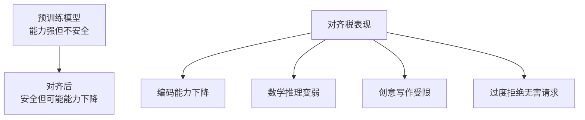

### 7.2 实验数据

| 能力 | 原始模型 | 对齐模型 | 变化 |
|------|---------|---------|------|
| **安全性** | 差 | 好 | ↑↑↑ |
| **指令跟随** | 差 | 好 | ↑↑↑ |
| **代码生成** | 好 | 略降 | ↓ |
| **数学推理** | 好 | 略降 | ↓ |
| **创意写作** | 好 | 略降 | ↓ |
| **知识问答** | 好 | 基本不变 | → |

### 7.3 减轻对齐税的方法

| 方法 | 原理 | 效果 |
|------|------|------|
| **KL 惩罚** | 限制策略偏离参考模型 | 基础方法 |
| **混合预训练** | 对齐时混入预训练数据 | 有效 |
| **迭代对齐** | 多轮偏好学习 | 渐进提升 |
| **在线 DPO** | 用当前策略生成对比数据 | 接近 RLHF |

---

## 8. 实际挑战与解决方案

### 8.1 偏好数据质量

| 挑战 | 解决方案 |
|------|---------|
| **标注不一致** | 多标注者投票 + 质量筛选 |
| **标注偏见** | 多样化标注者群体 |
| **成本高昂** | RLAIF / AI 辅助标注 |
| **数据覆盖** | 系统化设计提示分布 |

### 8.2 奖励黑客 (Reward Hacking)

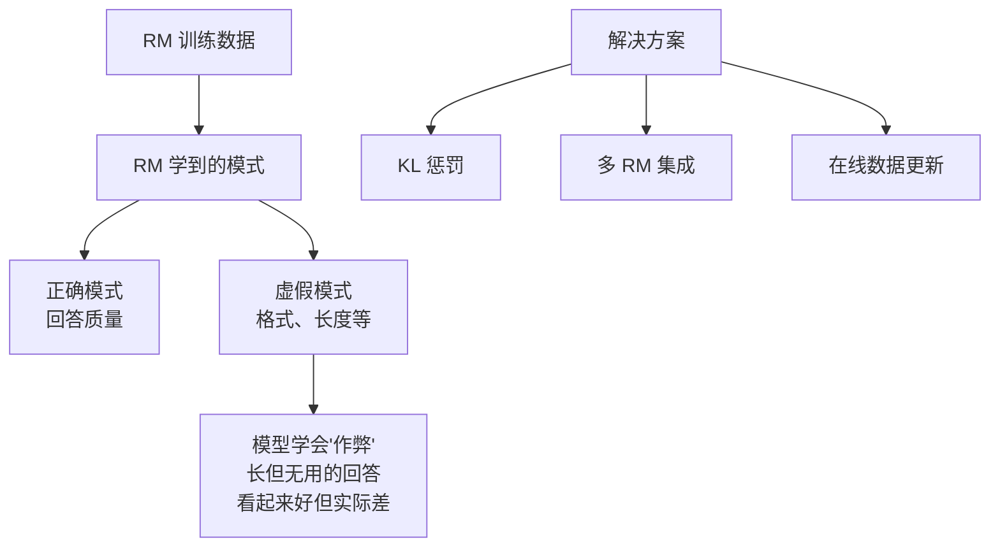

### 8.3 实践建议

| 方面 | 建议 |
|------|------|
| **数据** | 偏好数据质量 > 数量，确保覆盖多样场景 |
| **训练** | 先 SFT 再 DPO/RLHF，SFT 是基础 |
| **超参** | DPO β=0.1 是好的起点，根据任务调整 |
| **评估** | 安全性 + 能力双重评估 |
| **迭代** | 多轮迭代效果更好 |

---

## 9. 面试问题（FAQ）

### Q1: RLHF 中的 KL 惩罚为什么重要？

> **答**: KL 惩罚 $\beta \cdot \text{KL}(\pi_\theta \| \pi_{\text{ref}})$ 防止策略偏离参考模型太远：
> 1. **防止奖励黑客**：限制模型不能通过极端修改获得高奖励
> 2. **保持语言能力**：确保生成仍然"像自然语言"
> 3. **训练稳定性**：限制策略空间使 PPO 更稳定
> 4. **对齐税控制**：减轻对齐导致的能力下降

### Q2: DPO 真的等价于 RLHF 吗？

> **答**: 理论上等价，但实际有差异：
> - **理论等价**：DPO 优化的是相同的 KL 约束奖励最大化目标
> - **实际差异**：
> - DPO 使用**离线数据**，RLHF 使用**在线采样**
> - DPO 无法根据当前策略获取新反馈
> - Online DPO / IPO 等变体弥补了这一差距
> - **实践结论**：对于大多数场景，DPO 足够好且更实用

### Q3: SFT 阶段是否可以跳过？

> **答**: 通常不可以。SFT 的作用：
> 1. **基础格式**：教会模型基本的回答格式（对话、QA）
> 2. **领域适配**：让模型从续写模式转变为指令跟随模式
> 3. **初始化**：为 DPO/RLHF 提供好的初始化
> 4. **没有 SFT 的 DPO**：模型可能无法产生合理回答，偏好学习无从谈起

### Q4: 如何评估对齐效果？

> **答**: 多维度评估：
> 
> | 维度 | 评估方法 |
> |------|---------|
> | **安全性** | 有害提示测试集 + red teaming |
> | **有用性** | 人类评估 + 自动评估 (MT-Bench) |
> | **诚实性** | 事实性基准 (TruthfulQA) |
> | **能力保留** | MMLU, HumanEval 等 |
> | **综合** | Chatbot Arena 排名 |

### Q5: Constitutional AI 和 RLHF 的关系是什么？

> **答**: CAI 是 RLHF 的扩展：
> - CAI 的第二阶段本质上仍是 RLHF，但偏好数据由 AI 生成
> - CAI 的第一阶段是全新的：AI 自我批判和修订
> - CAI 减少了对人类标注的依赖，但引入了对 AI 评估器的依赖
> - 实际上 CAI ≈ RLAIF + 自我批判

### Q6: DPO 中的 β 参数如何选择？

> **答**: β 控制对偏好数据的"信任程度"：
> - **β 太小**（如 0.01）：模型对偏好数据反应不足，对齐效果弱
> - **β 太大**（如 1.0）：模型过度拟合偏好数据，可能不稳定
> - **推荐范围**：0.05 - 0.5，默认 0.1
> - **调参策略**：从小值开始，逐步增大，观察奖励准确率和生成质量

---

## 10. 与其他章节的关联

### 前置知识
- [GPT-3 深度解读](论文精读/Scaling/GPT3_Deep_Dive.md) — 预训练语言模型基础
- [LLaMA 深度解读](论文精读/Architecture/LLaMA_Deep_Dive.md) — LLaMA 2 Chat 的 RLHF 实践
- [深度学习优化](深度学习/Optimization/Optimization.md) — PPO 优化算法

### 横向关联
- [Fine-tuning 技术](../大模型/Fine_tuning_Techniques/) — SFT、LoRA 等微调方法
- [价值对齐](伦理安全/Value_Alignment/Value_Alignment.md) — AI 安全与对齐全景
- [强化学习](../../强化学习/README.md) — PPO 算法原理

### 进阶方向
- [AI 安全](../伦理安全/AI_Safety_RedTeaming/) — Red Teaming 和安全评估
- [Diffusion Models 深度解读](计算机视觉/Generative_Models/Diffusion_Models_Deep_Dive.md) — 扩散模型的对齐方法

---

*Last updated: 2026-05-17*

## Related

- [[论文精读/Scaling/GPT3_Deep_Dive]] — GPT-3 深度解读 (Language Models are Few-Shot Learners) (共享: gpt, openai)

- [[治理/alignment-rlhf|价值对齐 × RLHF：从人类反馈到可扩展监督]]
