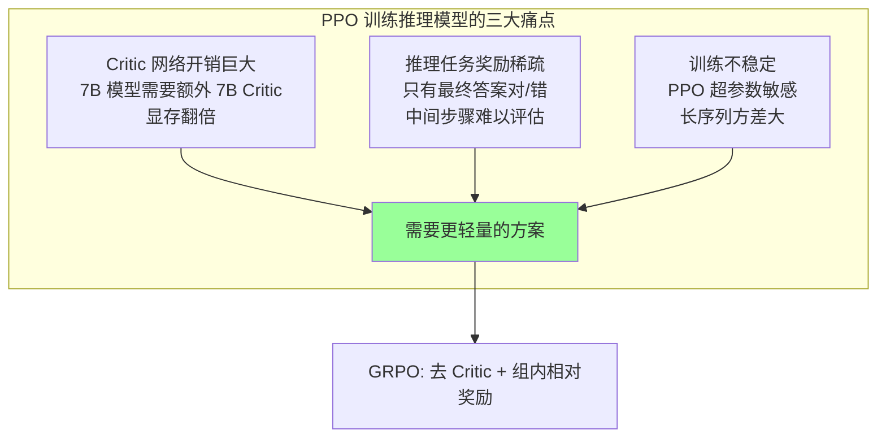
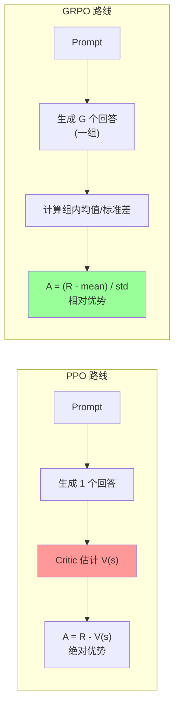
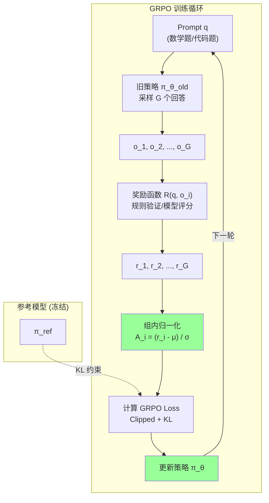
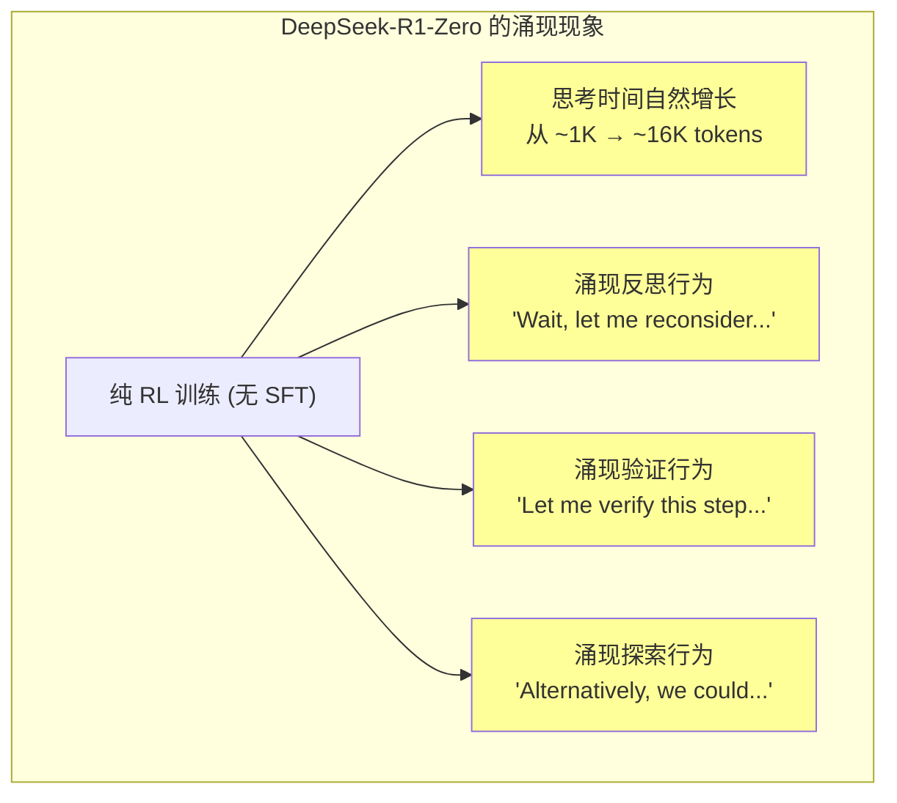
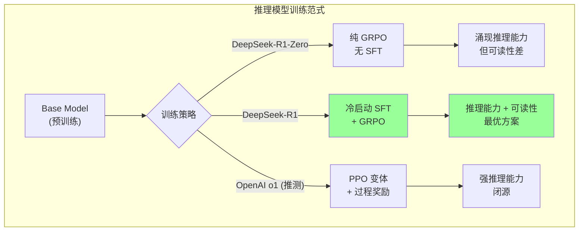
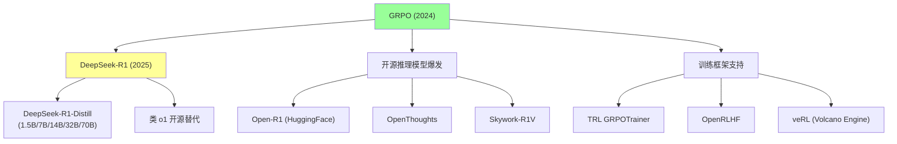

# GRPO 论文精读: Group Relative Policy Optimization

> 中文简称：GRPO 论文精读

> **一句话理解**: GRPO 就像一个"不用请裁判"的竞赛训练法——让模型对同一道题生成一组答案，用组内相对排名代替绝对评分，既省去了 Critic 网络的巨大开销，又天然适合推理任务中"答案有对错之分"的场景。

---

## 论文基本信息

| 属性 | 内容 |
|------|------|
| **标题** | DeepSeekMath: Pushing the Limits of Mathematical Reasoning in Open Language Models |
| **作者** | Zhihong Shao, Peiyi Wang, Qihao Zhu, Runxin Xu, Junxiao Song, Xiao Bi, Haowei Zhang, Mingchuan Zhang, Y.K. Li, Y. Wu, Daya Guo (DeepSeek-AI) |
| **发表** | arXiv preprint, 2024 (DeepSeekMath); GRPO 在 DeepSeek-R1 (2025) 中被进一步推广 |
| **引用量** | 3,000+ (截至 2026) |
| **论文链接** | [arXiv:2402.03300](https://arxiv.org/abs/2402.03300) (DeepSeekMath); [arXiv:2501.12948](https://arxiv.org/abs/2501.12948) (DeepSeek-R1) |
| **核心贡献** | 提出 Group Relative Policy Optimization，用组内相对奖励替代 Critic 网络，大幅降低 RL 训练成本 |

---

## 1. 历史背景：为什么需要 GRPO？

### 1.1 RLHF 训练推理模型的困境

2024 年，OpenAI o1 展示了强化学习在数学推理上的惊人效果，但传统 RLHF/PPO 方法面临严峻挑战：



### 1.2 从 PPO 到 GRPO 的演进

| 阶段 | 方法 | 代表工作 | 核心问题 |
|------|------|---------|---------|
| 2017 | PPO | OpenAI | 需要 Critic 网络 |
| 2022 | RLHF | InstructGPT | 4 个模型同时训练 |
| 2023 | [[20_论文精读/06_对齐研究/03_DPO_深入分析|DPO]] | Stanford | 无需 RL，但缺乏探索 |
| 2024 | GRPO | DeepSeek | 去 Critic，组内对比 |
| 2025 | GRPO + 长 CoT | DeepSeek-R1 | 推理能力涌现 |

### 1.3 推理模型的特殊需求

推理任务（数学、代码、逻辑）与通用对话有本质区别：

```
推理任务的特点:
    1. 答案可验证 → 奖励信号明确 (对/错)
    2. 过程多样 → 同一题有多种正确解法
    3. 长链推理 → 序列长度 2K-16K tokens
    4. 探索重要 → 需要尝试不同推理路径

通用对话的特点:
    1. 答案主观 → 需要人类偏好标注
    2. 风格统一 → 相对固定的回答模式
    3. 短序列 → 通常 < 1K tokens
    4. 一致性优先 → 不需要太多探索
```

> **关键洞察**: 推理任务的"可验证性"使得 GRPO 的组内相对排名天然适用——不需要 Critic 估计价值，只需要知道"这组答案里谁对谁错"。

---

## 2. 核心创新：Group Relative Policy Optimization

### 2.1 一句话概括

**GRPO 的核心思想：对同一个 prompt 采样一组 (group) 输出，用组内奖励的均值和标准差进行归一化，得到相对优势估计，从而完全不需要 Critic 网络。**

### 2.2 核心直觉



### 2.3 数学原理详解

#### 2.3.1 PPO 的回顾

标准 PPO 的目标函数（参见 [[20_论文精读/07_强化学习/04_PPO_深入分析|PPO 深度解读]]）：

```
L_PPO(θ) = E_t [ min( r_t(θ) · A_t,  clip(r_t(θ), 1-ε, 1+ε) · A_t ) ]

其中:
    r_t(θ) = π_θ(a_t|s_t) / π_θ_old(a_t|s_t)   (重要性采样比率)
    A_t = R_t - V_φ(s_t)                          (优势函数，需要 Critic)
```

**PPO 的问题**: 优势函数 A_t 依赖 Critic 网络 V_φ(s_t)，对于 LLM 来说：
- Critic 与 Policy 同等规模 → 显存翻倍
- 长序列中 V(s) 估计不准 → 高方差
- Critic 本身也需要训练 → 额外计算

#### 2.3.2 GRPO 的核心公式

GRPO 用**组内相对奖励**替代 Critic：

**Step 1: 组采样 (Group Sampling)**

对每个 prompt q，从旧策略 π_θ_old 采样 G 个输出：

```
{o_1, o_2, ..., o_G} ~ π_θ_old(·|q)
```

**Step 2: 奖励计算**

对每个输出 o_i 计算奖励 r_i（可以是规则奖励或模型奖励）：

```
r_i = R(q, o_i),  i = 1, 2, ..., G
```

**Step 3: 组内归一化 (核心创新)**

```
A_i = (r_i - mean(r_1, ..., r_G)) / std(r_1, ..., r_G)

其中:
    mean(r_1, ..., r_G) = (1/G) Σ r_i
    std(r_1, ..., r_G) = sqrt( (1/G) Σ (r_i - mean)² )
```

> **直觉**: 不需要知道"这个答案绝对有多好"，只需要知道"在这组答案中，它相对其他答案好多少"。

**Step 4: GRPO 目标函数**

```
L_GRPO(θ) = E_q [ (1/G) Σ_{i=1}^{G} (1/|o_i|) Σ_{t=1}^{|o_i|} 
    min( r_{i,t}(θ) · A_i,  clip(r_{i,t}(θ), 1-ε, 1+ε) · A_i )
    - β · D_KL(π_θ || π_ref) ]

其中:
    r_{i,t}(θ) = π_θ(o_{i,t} | q, o_{i,<t}) / π_θ_old(o_{i,t} | q, o_{i,<t})
```

#### 2.3.3 KL 约束的设计

GRPO 中的 KL 散度约束：

```
D_KL(π_θ || π_ref) = Σ_t [ π_θ(o_t|q,o_{<t}) / π_ref(o_t|q,o_{<t}) 
                         - log(π_θ(o_t|q,o_{<t}) / π_ref(o_t|q,o_{<t})) - 1 ]
```

这里使用的是 **Schulman KL 近似**（k3 estimator），比标准 KL 更稳定：

```
标准 KL:  D_KL = E[log(π_θ/π_ref)]
k3 估计:  D_KL ≈ E[π_θ/π_ref - log(π_θ/π_ref) - 1]

k3 的优势:
    - 始终非负 (标准估计可能为负)
    - 方差更低
    - 当 π_θ ≈ π_ref 时近似更准确
```

### 2.4 与 PPO/DPO 的数学对比

| 维度 | PPO | DPO | GRPO |
|------|-----|-----|------|
| **优势估计** | A = R - V(s) (Critic) | 隐式 (log ratio) | A = (R - μ) / σ (组内) |
| **是否需要 Critic** | 是 | 否 | 否 |
| **是否需要奖励模型** | 是 | 否 (用偏好数据) | 可选 (规则/模型) |
| **探索能力** | 强 (在线采样) | 弱 (离线数据) | 强 (在线采样) |
| **训练稳定性** | 中 (超参敏感) | 高 | 高 |
| **显存需求** | 4x 模型 | 2x 模型 | 2x 模型 |
| **适合任务** | 通用 | 偏好对齐 | 可验证推理 |
| **数学基础** | 策略梯度 + GAE | Bradley-Terry 模型 | 组内归一化策略梯度 |

#### 2.4.1 为什么 GRPO 不需要 Critic？

```
PPO 的逻辑:
    "我需要一个 Critic 来告诉我'当前状态值多少'，
     然后用实际奖励减去这个值，得到'惊喜程度'(优势)"

GRPO 的逻辑:
    "我不需要知道'绝对值多少'，
     我只需要在一组答案中做相对比较——
     比平均好的就是正优势，比平均差的就是负优势"

数学等价性:
    PPO:  A_i = r_i - V(s)         (V(s) 是 Critic 的估计)
    GRPO: A_i = (r_i - μ_G) / σ_G  (μ_G 是组内均值)

    当 G → ∞ 时，μ_G → E[R|q] ≈ V(s)
    即: 组内均值是 Critic 的无偏估计！
```

### 2.5 架构图解



---

## 3. 组内相对奖励设计

### 3.1 奖励函数的选择

GRPO 的灵活性在于奖励函数可以是多种形式：

| 奖励类型 | 适用场景 | 示例 |
|---------|---------|------|
| **规则奖励** | 数学/代码 | 答案正确=1, 错误=0 |
| **模型奖励** | 通用任务 | 奖励模型打分 |
| **混合奖励** | 复杂推理 | 格式分 + 正确性分 |
| **过程奖励** | 步骤验证 | 每步正确性 (PRM) |

### 3.2 DeepSeek-R1 的奖励设计

```
DeepSeek-R1 的奖励函数:

1. 准确性奖励 (Accuracy Reward):
   - 数学: 提取最终答案，与标准答案对比
   - 代码: 运行测试用例，通过率作为奖励
   - 格式: 答案必须在 \boxed{} 中

2. 格式奖励 (Format Reward):
   - 推理过程必须在 <think>...</think> 中
   - 最终答案必须在 <answer>...</answer> 中
   - 格式正确 +0.5, 格式错误 -0.5

3. 总奖励:
   r = r_accuracy + r_format
```

### 3.3 组大小 G 的影响

```
组大小 G 的权衡:

G 太小 (如 G=2):
    - 均值/标准差估计不准
    - 可能所有答案都对或都错 → A_i = 0，无梯度
    - 训练信号弱

G 太大 (如 G=128):
    - 计算开销大 (需要生成 G 个长序列)
    - 但统计估计更准确
    - DeepSeek-R1 使用 G=64 或 G=128

推荐:
    - 简单任务: G=16~32
    - 困难推理: G=64~128
    - 关键原则: 确保组内有对有错 (mixed outcomes)
```

### 3.4 组内全对/全错的处理

```python
# 当组内所有答案奖励相同时的处理策略
def compute_grpo_advantage(rewards, group_size):
    mean = sum(rewards) / group_size
    std = sqrt(sum((r - mean)**2 for r in rewards) / group_size)
    
    if std < 1e-8:  # 全对或全错
        # 策略 1: 跳过这个 prompt (DeepSeek 默认)
        return [0.0] * group_size
        # 策略 2: 使用全局均值/标准差
        # 策略 3: 丢弃并重新采样
    else:
        return [(r - mean) / std for r in rewards]
```

---

## 4. 无需 Critic 网络：显存与计算分析

### 4.1 显存对比

以 7B 模型为例（FP16 训练）：

| 组件 | PPO | GRPO | 节省 |
|------|-----|------|------|
| Policy 模型 | 14 GB | 14 GB | - |
| Reference 模型 | 14 GB | 14 GB | - |
| Reward 模型 | 14 GB | 0 (规则奖励) | 14 GB |
| Critic 模型 | 14 GB | 0 | 14 GB |
| Optimizer (Adam) | 28 GB | 28 GB | - |
| **总计 (模型)** | **56 GB** | **28 GB** | **50%** |
| **总计 (含优化器)** | **84 GB** | **56 GB** | **33%** |

### 4.2 计算流程对比


### 4.3 为什么去掉 Critic 不影响性能？

```
理论分析:

1. Critic 的本质: 估计 E[R|s] (状态价值函数)
   - 在 LLM 中，"状态"是 (prompt, 已生成 tokens)
   - 状态空间极大 → Critic 难以准确估计
   - 不准确的 V(s) → 高方差优势估计 → 训练不稳定

2. GRPO 的替代: 用组内均值近似 E[R|q]
   - 只估计 prompt 级别的期望奖励 (而非 token 级别)
   - 估计目标更简单 → 更准确
   - 代价: 需要多次采样 (G 个输出)

3. 关键假设:
   - 同一 prompt 下，不同输出的奖励差异主要来自"推理路径"
   - 组内对比已经捕获了"哪条路径更好"的信息
   - 不需要精确的 token 级价值估计
```

---

## 5. 实验结果分析

### 5.1 DeepSeekMath 结果

| 模型 | 方法 | MATH-500 | GSM8K | AIME 2024 |
|------|------|----------|-------|-----------|
| DeepSeekMath-7B-Base | - | 43.4 | 54.3 | - |
| DeepSeekMath-7B-SFT | SFT | 51.7 | 70.0 | - |
| DeepSeekMath-7B-RL (GRPO) | GRPO | **54.3** | **75.4** | - |
| GPT-4 (2023) | - | 52.9 | 92.0 | - |

### 5.2 DeepSeek-R1 结果 (2025)

| 模型 | AIME 2024 | MATH-500 | GPQA Diamond | Codeforces |
|------|-----------|----------|--------------|------------|
| DeepSeek-R1-Zero (纯 RL) | 71.0 | 71.0 | 49.0 | - |
| DeepSeek-R1 | **79.8** | **97.3** | **71.5** | 96.3% |
| OpenAI o1 | 79.2 | 96.4 | 75.7 | 96.6% |
| OpenAI o1-mini | 70.0 | 90.0 | 60.0 | 87.0% |
| Claude 3.5 Sonnet | 16.0 | 78.3 | 65.0 | 71.7% |

### 5.3 关键发现



### 5.4 GRPO vs PPO 消融实验

| 配置 | MATH-500 | 训练稳定性 | 显存使用 |
|------|----------|-----------|---------|
| PPO (标准) | 52.1 | 中 (需调参) | 84 GB |
| GRPO (G=16) | 53.0 | 高 | 56 GB |
| GRPO (G=32) | 53.8 | 高 | 56 GB |
| GRPO (G=64) | 54.3 | 高 | 56 GB |
| GRPO (无 KL) | 51.2 | 低 (reward hacking) | 56 GB |
| GRPO (β=0.01) | 53.5 | 中 | 56 GB |
| GRPO (β=0.04) | 54.3 | 高 | 56 GB |

### 5.5 训练曲线特征

```
GRPO 训练过程的典型特征:

Phase 1 (0-500 steps): 快速提升
    - 模型学会基本推理格式
    - 奖励从 ~0.2 快速上升到 ~0.5
    - 生成长度开始增长

Phase 2 (500-3000 steps): 稳步提升
    - 模型学会多步推理
    - 奖励缓慢上升到 ~0.7
    - 涌现 "self-verification" 行为

Phase 3 (3000+ steps): 精细优化
    - 奖励趋于稳定 ~0.75-0.85
    - 生成长度稳定在 4K-16K tokens
    - 推理路径更加多样化
```

---

## 6. 为什么 GRPO 特别适合推理模型？

### 6.1 推理任务的特性与 GRPO 的匹配

| 推理任务特性 | GRPO 的对应优势 |
|-------------|----------------|
| 答案可验证 (对/错) | 规则奖励，无需奖励模型 |
| 多种正确解法 | 组内采样自然探索多路径 |
| 长链推理 (2K-16K tokens) | 无需 token 级 Critic 估值 |
| 需要探索新策略 | 在线采样 + 组内对比 |
| 奖励稀疏 (只有最终对错) | 组内归一化放大微弱信号 |

### 6.2 与 o1/R1 训练范式的关系



### 6.3 GRPO 促进探索的机制

```
为什么 GRPO 比 DPO 更适合推理:

DPO 的局限:
    - 离线方法: 只能从固定数据集学习
    - 无法发现新的推理路径
    - 偏好数据标注成本高 (需要专家判断推理质量)

GRPO 的优势:
    - 在线方法: 模型自己生成训练数据
    - 组内采样 = 自然探索
    - 规则奖励 = 零标注成本
    - 模型可以发现人类未想到的解法

示例:
    题目: "证明 √2 是无理数"
    
    采样 G=8 个回答:
    o_1: 反证法 (标准) → 正确, r=1
    o_2: 连分数方法 → 正确, r=1
    o_3: 几何方法 → 错误, r=0
    o_4: 反证法 (计算错误) → 错误, r=0
    o_5: 唯一分解定理 → 正确, r=1
    ...
    
    A_1 = (1 - 0.375) / 0.518 = +1.21  (正强化)
    A_3 = (0 - 0.375) / 0.518 = -0.72  (负强化)
    
    → 模型学会: 反证法和唯一分解定理是好策略
    → 同时保留了多种正确路径的多样性
```

---

## 7. 复现指南

### 7.1 环境准备

```bash
# 硬件需求 (7B 模型)
# GPU: 8x A100 80GB (或 4x H100)
# RAM: 256GB+
# Storage: 500GB+ (数据集 + checkpoints)

# 软件环境
pip install torch>=2.1.0
pip install transformers>=4.37.0
pip install vllm>=0.3.0  # 高效推理
pip install deepspeed>=0.12.0
pip install trl>=0.7.0  # HuggingFace TRL 已支持 GRPO
```

### 7.2 使用 TRL 实现 GRPO

```python
from trl import GRPOConfig, GRPOTrainer
from transformers import AutoModelForCausalLM, AutoTokenizer
from datasets import load_dataset

# 1. 加载模型
model = AutoModelForCausalLM.from_pretrained(
    "deepseek-ai/deepseek-math-7b-base",
    torch_dtype=torch.bfloat16,
)
tokenizer = AutoTokenizer.from_pretrained("deepseek-ai/deepseek-math-7b-base")

# 2. 配置 GRPO
config = GRPOConfig(
    output_dir="./grpo-output",
    num_generations=64,          # 组大小 G
    max_prompt_length=512,
    max_completion_length=4096,  # 推理需要长输出
    per_device_train_batch_size=1,
    gradient_accumulation_steps=16,
    learning_rate=1e-6,
    beta=0.04,                   # KL 约束系数
    epsilon=0.2,                 # PPO clip 范围
    bf16=True,
    gradient_checkpointing=True,
)

# 3. 定义奖励函数
def math_reward(completions, prompts, **kwargs):
    """规则奖励: 检查答案是否正确"""
    rewards = []
    for completion, prompt in zip(completions, prompts):
        # 提取 \boxed{} 中的答案
        answer = extract_boxed_answer(completion)
        ground_truth = extract_ground_truth(prompt)
        if answer is not None and is_equivalent(answer, ground_truth):
            rewards.append(1.0)
        else:
            rewards.append(0.0)
    return rewards

# 4. 加载数据集
dataset = load_dataset("deepseek-ai/DeepSeekMath-RL", split="train")

# 5. 训练
trainer = GRPOTrainer(
    model=model,
    reward_funcs=math_reward,
    args=config,
    train_dataset=dataset,
)
trainer.train()
```

### 7.3 关键超参数

| 超参数 | 推荐值 | 说明 |
|--------|--------|------|
| `num_generations` (G) | 32-128 | 组大小，越大越稳定但越慢 |
| `beta` (KL) | 0.01-0.1 | 通常 0.04，太小会 reward hack |
| `epsilon` (clip) | 0.2 | 与 PPO 相同 |
| `learning_rate` | 1e-6 ~ 5e-6 | 比 SFT 小 10-100 倍 |
| `max_completion_length` | 4096-16384 | 推理需要长输出 |
| `temperature` (采样) | 0.7-1.0 | 保证探索多样性 |
| `gradient_accumulation` | 16-64 | 有效 batch size 要大 |

### 7.4 常见陷阱

```
陷阱 1: 组内全对/全错
    症状: 训练 loss 为 0，模型不更新
    原因: 题目太简单 (全对) 或太难 (全错)
    解决: 过滤数据，只保留 pass_rate ∈ (0.1, 0.9) 的题目

陷阱 2: Reward Hacking
    症状: 奖励上升但实际正确率下降
    原因: 模型学会利用奖励函数漏洞
    解决: 增大 β (KL 约束)，使用更严格的验证

陷阱 3: 长度爆炸
    症状: 生成长度不断增长，超过 max_length
    原因: 模型发现"写更多 = 更可能包含正确答案"
    解决: 添加长度惩罚，或设置 max_completion_length

陷阱 4: 模式坍塌
    症状: 所有输出变得雷同
    原因: KL 约束太强，或学习率太大
    解决: 减小 β，降低学习率，增加采样温度
```

### 7.5 数据准备

```python
# 数学推理数据格式
{
    "prompt": "Solve: Find all real x such that x^4 - 4x^3 + 5x^2 - 4x + 1 = 0.\nPlease put your final answer in \\boxed{}.",
    "ground_truth": "x = (3 + √5) / 2 or x = (3 - √5) / 2",
    "difficulty": "medium",  # 用于课程学习
    "source": "AIME"
}

# 数据筛选策略
def filter_for_grpo(dataset, model, G=32):
    """只保留难度适中的题目"""
    filtered = []
    for item in dataset:
        # 用当前模型采样 G 次
        outputs = model.generate(item["prompt"], num_return_sequences=G)
        rewards = [check_answer(o, item["ground_truth"]) for o in outputs]
        pass_rate = sum(rewards) / G
        # 保留 pass_rate 在 10%-90% 的题目
        if 0.1 < pass_rate < 0.9:
            filtered.append(item)
    return filtered
```

---

## 8. 与相关工作对比

### 8.1 方法对比表

| 方法 | 年份 | 需要 Critic | 需要 RM | 在线/离线 | 适合推理 | 代表工作 |
|------|------|------------|---------|----------|---------|---------|
| [[20_论文精读/07_强化学习/04_PPO_深入分析|PPO]] | 2017 | 是 | 是 | 在线 | 中 | InstructGPT |
| [[20_论文精读/06_对齐研究/03_DPO_深入分析|DPO]] | 2023 | 否 | 否 | 离线 | 弱 | Zephyr |
| REINFORCE | 1992 | 否 | 是 | 在线 | 弱 | - |
| RLOO | 2024 | 否 | 是 | 在线 | 中 | - |
| **GRPO** | 2024 | **否** | **可选** | **在线** | **强** | DeepSeek-R1 |
| PPO + PRM | 2023 | 是 | 是 (过程) | 在线 | 强 | Math-Shepherd |
| ReST | 2023 | 否 | 否 | 迭代 | 中 | Gemini |

### 8.2 GRPO vs RLOO (REINFORCE Leave-One-Out)

```
RLOO: A_i = r_i - (1/(G-1)) Σ_{j≠i} r_j
GRPO: A_i = (r_i - μ) / σ

区别:
    - RLOO 只减去均值 (无标准差归一化)
    - GRPO 额外除以标准差 → 梯度尺度更稳定
    - 实践中 GRPO 略优于 RLOO (因为归一化)
    - 两者都不需要 Critic
```

### 8.3 GRPO 的理论联系

```
GRPO 可以看作:
    1. REINFORCE with baseline (baseline = 组内均值)
    2. 自归一化策略梯度 (self-normalized policy gradient)
    3. 无 Critic 的 Actor-Only 方法
    4. 蒙特卡洛优势估计 (Monte Carlo advantage estimation)

与经典 RL 的联系:
    - 组内均值 ≈ 状态价值 V(s) 的蒙特卡洛估计
    - 标准差归一化 ≈ 自适应学习率
    - Clip 机制 ≈ TRPO 的简化版信任区域
```

---

## 9. 影响与后续工作

### 9.1 GRPO 的生态影响



### 9.2 后续改进方向

| 方向 | 方法 | 状态 (2026) |
|------|------|------------|
| 过程奖励 + GRPO | 每步给奖励而非只看最终答案 | 活跃研究 |
| 多轮 GRPO | 迭代式自我改进 | DeepSeek-R2 (预期) |
| 自适应组大小 | 根据难度动态调整 G | 实验阶段 |
| GRPO + 课程学习 | 从易到难训练 | 已验证有效 |
| 多模态 GRPO | 视觉推理 + 代码执行 | 早期探索 |
| 分布式 GRPO | 千卡规模训练 | 工业实践 |

### 9.3 对开源社区的影响

```
GRPO 降低了推理模型训练的门槛:

Before GRPO:
    - 训练推理模型需要 PPO + 奖励模型 + Critic
    - 至少需要 4x 模型显存
    - 超参数调试困难
    - 只有大厂能做

After GRPO:
    - 只需要 Policy + Reference (2x 显存)
    - 规则奖励 = 零标注成本
    - TRL 一行代码启动
    - 小团队/学术界可复现
    
实际影响:
    - HuggingFace Open-R1: 完全复现 R1 训练
    - 多个 7B-32B 开源推理模型达到 o1-mini 水平
    - 推理模型从"黑箱"变为"可研究"
```

---

## 10. 深入讨论

### 10.1 GRPO 的局限性

```
1. 依赖可验证奖励:
   - 数学/代码: 答案可自动验证 ✓
   - 开放对话: 无法自动判断质量 ✗
   - 创意写作: 无标准答案 ✗
   → 通用对齐仍需 RLHF/DPO

2. 计算效率:
   - 需要生成 G 个完整序列 (G=64 时开销大)
   - 长序列 (16K tokens) × G 次 = 巨大计算量
   - 比 DPO 慢很多 (DPO 是离线的)

3. 奖励设计:
   - 规则奖励覆盖范围有限
   - 复杂推理的"部分正确"难以量化
   - 格式奖励可能引入偏差

4. 理论保证:
   - 组内归一化引入偏差 (biased estimator)
   - G 有限时，优势估计有偏
   - 收敛性证明不如 PPO 完善
```

### 10.2 GRPO 与 Test-Time Compute 的关系

```
GRPO 训练出的模型天然适合 test-time compute scaling:

训练时: 模型学会"多想一会儿" (长 CoT)
推理时: 给更多 token 预算 → 更好性能

这与 [[Chain_of_Thought_Deep_Dive|Chain-of-Thought]] 的关系:
    - CoT: 人工设计 prompt 让模型思考
    - GRPO: 通过 RL 让模型自主学会思考
    - GRPO 是 CoT 的"内化"版本

Scaling Law:
    - 训练 compute ↑ → 模型更强 (传统)
    - 推理 compute ↑ → 同一模型表现更好 (新范式)
    - GRPO 训练的模型在推理 scaling 上效果最显著
```

### 10.3 未来展望 (2026)

```
GRPO 的发展方向:

1. 通用化:
   - 结合 LLM-as-Judge 作为奖励
   - 扩展到非可验证任务
   - 与 DPO/RLHF 混合使用

2. 效率优化:
   - Speculative decoding 加速采样
   - 异步 GRPO (生成与训练并行)
   - 更小的 G + 更好的归一化

3. 理论深化:
   - 收敛性证明
   - 最优 G 的理论分析
   - 与 information theory 的联系

4. 应用扩展:
   - 多模态推理 (视觉 + 语言)
   - Agent 训练 (多步决策)
   - 科学发现 (数学/物理/化学)
```

---

## 11. 相关概念

- [[20_论文精读/07_强化学习/04_PPO_深入分析|PPO 深度解读]] — GRPO 的前身，理解 clip 机制
- [[20_论文精读/06_对齐研究/03_DPO_深入分析|DPO 深度解读]] — 另一种去 Critic 方案，离线方法
- [[20_论文精读/06_对齐研究/06_RLHF_DPO_深入分析|RLHF 与 DPO 对比]] — 对齐方法全景
- [[Chain_of_Thought_Deep_Dive|Chain-of-Thought 深度解读]] — 推理模型的基础
- [[DeepSeek_V3_Technical_Report|DeepSeek-V3 技术报告]] — GRPO 的基座模型
- [[概念/LLM/chinchilla-scaling-laws|Scaling Laws]] — 训练/推理 compute 的权衡
- [[概念/General/mixture-of-experts|MoE 深度解读]] — DeepSeek 的架构选择

---

## 12. 总结

| 维度 | 要点 |
|------|------|
| **核心创新** | 用组内相对奖励替代 Critic 网络 |
| **数学本质** | 蒙特卡洛优势估计 + 自归一化 |
| **最大优势** | 显存减半 + 天然适合可验证推理 |
| **适用场景** | 数学/代码/逻辑等有明确答案的任务 |
| **不适用** | 开放对话/创意写作等主观任务 |
| **工业影响** | DeepSeek-R1 达到 o1 水平，开源可复现 |
| **学术影响** | 证明 RL 训练推理模型不需要 Critic |

> **一句话总结**: GRPO 是"用最简单的统计方法（均值和标准差）解决了最昂贵的工程问题（Critic 网络）"，它的成功证明了在推理任务中，**相对排名比绝对估值更有用**。
