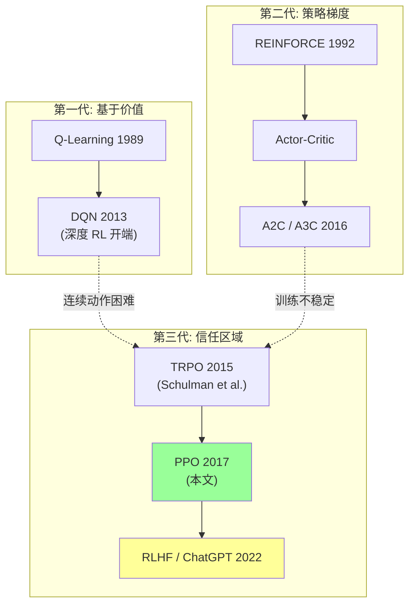
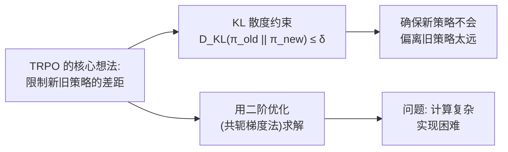
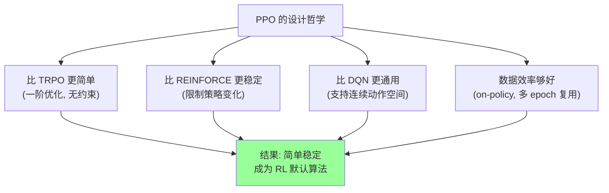
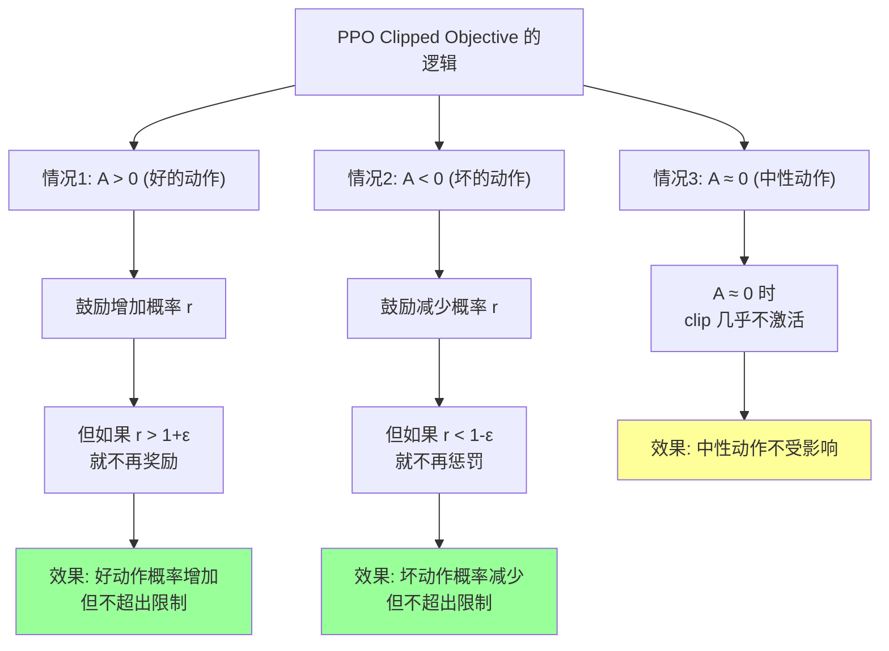
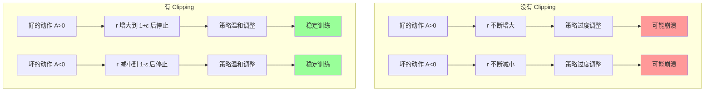
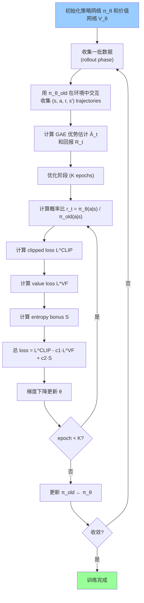
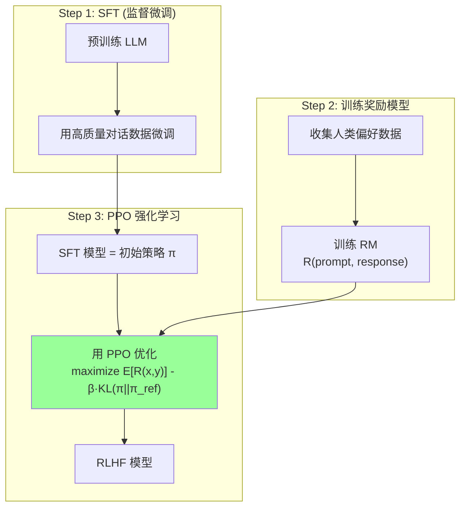
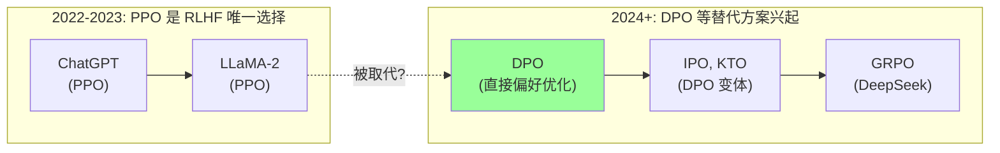
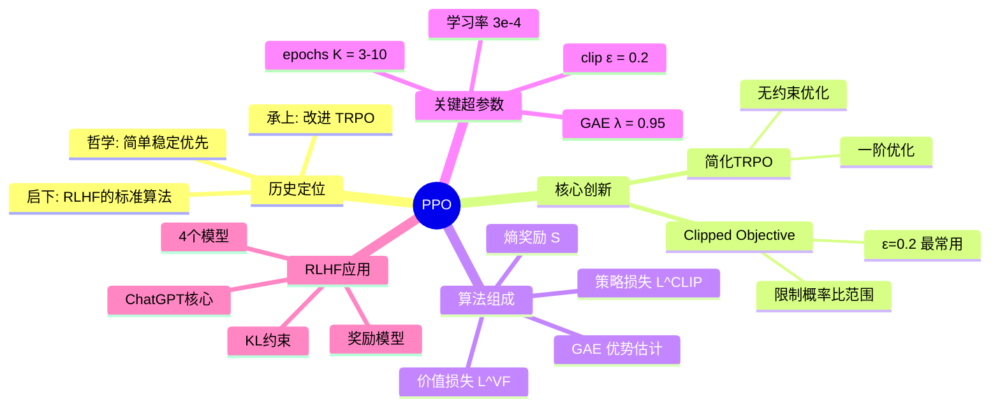

# PPO 深度解读 (Proximal Policy Optimization Algorithms)

> 中文简称：PPO 深度解读

> **一句话理解**: PPO 就像一个谨慎的学徒——每次只允许自己做一小步调整（clipped update），不会因为一次大跃进就把之前学好的本事搞砸。这个"限制单步更新幅度"的简单想法，让它成为 RLHF 的标准算法、ChatGPT 背后的核心技术之一。

---

## 论文基本信息

| 属性 | 内容 |
|------|------|
| **标题** | Proximal Policy Optimization Algorithms |
| **作者** | John Schulman, Filip Wolski, Prafulla Dhariwal, Alec Radford, Oleg Klimov (OpenAI) |
| **发表** | arXiv preprint, 2017 (无正式会议发表，但影响巨大) |
| **引用量** | 30,000+ (截至 2026) |
| **论文链接** | [arXiv:1707.06347](https://arxiv.org/abs/1707.06347) |
| **代码** | [OpenAI baselines](https://github.com/openai/baselines) / [Stable-Baselines3](https://github.com/DLR-RM/stable-baselines3) |
| **核心贡献** | 提出简单、稳定、样本效率合理的策略优化算法，成为 RL 领域的默认选择 |

---

## 1. 历史背景：从策略梯度到 PPO

### 1.1 强化学习算法的演进



### 1.2 PPO 之前的世界：策略梯度的困境

#### 1.2.1 基础策略梯度（REINFORCE）

策略梯度是最直观的 RL 方法——直接优化策略函数 π(a|s)：

```
REINFORCE 的核心思想:
    "如果某个动作导致了好的结果（高回报），就增加执行它的概率"
    "如果某个动作导致了坏的结果（低回报），就降低执行它的概率"

策略梯度定理:
    ∇J(θ) = E[ ∇_θ log π_θ(a|s) · A(s,a) ]

    其中 A(s,a) = 优势函数 = 实际回报 - 预期回报
```

**REINFORCE 的问题**：

| 问题 | 说明 | 后果 |
|------|------|------|
| **方差太大** | 每次用单个 trajectory 估计梯度 | 训练极不稳定 |
| **步长难选** | 学习率太大 → 策略崩溃；太小 → 学太慢 | 超参数敏感 |
| **没有安全性** | 一次糟糕的更新可能摧毁已学到的策略 | 不可恢复 |

#### 1.2.2 TRPO：信任区域策略优化

TRPO（Trust Region Policy Optimization, Schulman et al. 2015）试图解决步长问题：



**TRPO 的目标函数**：

$$\max_\theta \quad \hat{E}\left[\frac{\pi_\theta(a|s)}{\pi_{\theta_{old}}(a|s)} \hat{A}(s,a)\right]$$

$$\text{subject to} \quad \hat{E}[D_{KL}(\pi_{\theta_{old}}(\cdot|s) \| \pi_\theta(\cdot|s))] \le \delta$$

**TRPO 的问题**：

| 局限 | 说明 |
|------|------|
| **计算复杂** | 需要计算 Fisher 信息矩阵，使用共轭梯度法 |
| **实现困难** | 代码复杂，容易出 bug |
| **与近似架构不兼容** | 难以与参数共享、dropout 等技术结合 |
| **速度慢** | 二阶优化计算量大 |

### 1.3 PPO 的定位：简单、稳定、够用



| 对比维度 | REINFORCE | TRPO | **PPO** | DQN |
|---------|-----------|------|---------|-----|
| **稳定性** | ❌ 差 | ✅ 好 | ✅ 好 | ✅ 较好 |
| **实现难度** | ✅ 简单 | ❌ 复杂 | ✅ 简单 | ✅ 简单 |
| **连续动作** | ✅ | ✅ | ✅ | ❌ |
| **数据效率** | ❌ 低 | ✅ 较高 | ✅ 较高 | ✅ 高 |
| **速度** | ✅ 快 | ❌ 慢 | ✅ 快 | ✅ 快 |
| **适用范围** | 教学 | 研究 | **通用** | 离散动作 |

---

## 2. 核心创新：Clipped Surrogate Objective

### 2.1 从 TRPO 到 PPO 的关键洞察

PPO 保留了 TRPO 的核心思想——**限制策略更新幅度**——但用一种更简单的方式实现。

TRPO 使用硬约束（KL 散度 ≤ δ），PPO 使用**软惩罚（clipping）**。


### 2.2 概率比（Importance Ratio）

PPO 的核心量是新旧策略的概率比：

$$r_t(\theta) = \frac{\pi_\theta(a_t|s_t)}{\pi_{\theta_{old}}(a_t|s_t)}$$

| 值 | 含义 |
|----|------|
| r > 1 | 新策略比旧策略更倾向于选择动作 a |
| r = 1 | 新旧策略无差异 |
| r < 1 | 新策略比旧策略更不倾向于选择动作 a |

### 2.3 TRPO 的目标函数（PPO 的起点）

TRPO 的目标（无约束版本）：

$$L^{CPI}(\theta) = \hat{E}_t\left[\frac{\pi_\theta(a_t|s_t)}{\pi_{\theta_{old}}(a_t|s_t)} \hat{A}_t\right] = \hat{E}_t[r_t(\theta) \hat{A}_t]$$

这个函数的问题是：如果 r 可以无限制增大，一次更新就可能毁掉策略。

### 2.4 PPO 的 Clipped 目标函数（核心创新）

PPO 通过 clipping 限制概率比的取值范围：

$$L^{CLIP}(\theta) = \hat{E}_t\left[\min\left(r_t(\theta) \hat{A}_t, \; \text{clip}(r_t(\theta), 1-\epsilon, 1+\epsilon) \hat{A}_t\right)\right]$$

其中 ε 是一个超参数（论文中取 0.1 或 0.2）。



### 2.5 Clip 函数的图示

```
PPO Loss vs 概率比 r (以 ε=0.2 为例):

  Loss
   ↑
   |         ╱
   |        ╱  ← r·A 部分 (无 clip)
   |       ╱
1+ε| ─ ─ ╱────────  ← clip 上界 (A>0 时)
   |    ╱|
   |   ╱ |
   |  ╱  |
  1|─╱───┼────────  ← r=1 (新旧策略相同)
   | ╲   |
   |  ╲  |
1-ε|───╲─┴───────  ← clip 下界 (A<0 时)
   |    ╲
   |     ╲  ← r·A 部分 (无 clip)
   |      ╲
   ↓       ╲
           r

当 A > 0 (好动作): 损失随 r 增大到 1+ε 后被截断
当 A < 0 (坏动作): 损失随 r 减小到 1-ε 后被截断
```

### 2.6 为什么 Clipping 有效？



---

## 3. PPO 完整算法

### 3.1 PPO-Penalty vs PPO-Clip

论文提出了两种 PPO 变体：

| 变体 | 方法 | 特点 |
|------|------|------|
| **PPO-Clip** (主要) | 对概率比做 clip | 更简单、更常用 |
| **PPO-Penalty** | 在目标函数中加入 KL 惩罚 | 自适应调整惩罚系数 |

> **实践中，PPO-Clip 是标准选择。以下我们主要讨论 PPO-Clip。**

### 3.2 完整目标函数

PPO 的完整目标函数包含三部分：

$$L^{PPO}(\theta) = L^{CLIP}(\theta) - c_1 L^{VF}(\theta) + c_2 S[\pi_\theta](s_t)$$

| 组成 | 名称 | 作用 | 系数 |
|------|------|------|------|
| $L^{CLIP}$ | Clipped Policy Loss | 策略优化（核心） | 1 |
| $L^{VF}$ | Value Function Loss | 价值函数训练 | $c_1 = 0.5$ |
| $S$ | Entropy Bonus | 鼓励探索 | $c_2 = 0.01$ |

**三个部分的详细说明**：

```
1. L^CLIP: 策略损失 (已在 2.4 节详述)

2. L^VF: 价值函数损失 (回归损失)
    L^VF = (V_θ(s_t) - R_t)²
    
    其中 R_t 是实际回报（GAE 估计）
    训练 Critic 网络准确预测状态价值

3. S[π]: 策略熵奖励
    S[π_θ](s_t) = -Σ π_θ(a|s_t) log π_θ(a|s_t)
    
    熵高 = 策略不确定 = 探索
    加入熵奖励防止策略过早收敛（premature convergence）
```

### 3.3 GAE：广义优势估计

PPO 使用 **Generalized Advantage Estimation (GAE)** 来估计优势函数：

$$\hat{A}_t^{GAE(\gamma,\lambda)} = \sum_{l=0}^{\infty}(\gamma\lambda)^l \delta_{t+l}$$

其中 $\delta_t = r_t + \gamma V(s_{t+1}) - V(s_t)$ 是 TD 误差。

| 参数 | 名称 | 典型值 | 效果 |
|------|------|--------|------|
| $\gamma$ | 折扣因子 | 0.99 | 未来奖励的重要性 |
| $\lambda$ | GAE 参数 | 0.95 | 偏差-方差权衡 |

```
GAE 的偏差-方差权衡:

λ=0:  Â_t = δ_t
      → 只有一步 TD 误差
      → 偏差大, 方差小

λ=1:  Â_t = Σ γ^l δ_{t+l} = R_t - V(s_t)  (Monte Carlo)
      → 完整的 Monte Carlo 回报
      → 偏差小, 方差大

λ=0.95: 在两者之间取得平衡
        → 实践中最常用
```

### 3.4 PPO 完整训练流程



### 3.5 关键超参数

| 超参数 | 典型值 | 说明 |
|--------|--------|------|
| **ε (clip ratio)** | 0.1 - 0.2 | clipping 范围，最关键的超参数 |
| **K (epochs per update)** | 3 - 10 | 每批数据重复使用的次数 |
| **batch size** | 64 - 2048 | 每次梯度更新的样本数 |
| **γ (discount)** | 0.99 | 折扣因子 |
| **λ (GAE)** | 0.95 | GAE 的偏差-方差权衡 |
| **c₁ (value coef)** | 0.5 | 价值损失系数 |
| **c₂ (entropy coef)** | 0.01 | 熵奖励系数 |
| **learning rate** | 3e-4 | Adam 优化器 |

---

## 4. 代码实现

### 4.1 PyTorch PPO 简化实现

```python
import torch
import torch.nn as nn
import torch.optim as optim
from torch.distributions import Categorical
import numpy as np

class ActorCritic(nn.Module):
    """PPO 的 Actor-Critic 网络 (参数共享)"""
    def __init__(self, obs_dim, act_dim, hidden_dim=64):
        super().__init__()
        # 共享特征提取层
        self.feature = nn.Sequential(
            nn.Linear(obs_dim, hidden_dim),
            nn.Tanh(),
            nn.Linear(hidden_dim, hidden_dim),
            nn.Tanh()
        )
        # 策略头 (Actor)
        self.actor = nn.Linear(hidden_dim, act_dim)
        # 价值头 (Critic)
        self.critic = nn.Linear(hidden_dim, 1)

    def forward(self, obs):
        feat = self.feature(obs)
        logits = self.actor(feat)
        value = self.critic(feat)
        return logits, value

    def get_action(self, obs):
        logits, value = self.forward(obs)
        dist = Categorical(logits=logits)
        action = dist.sample()
        log_prob = dist.log_prob(action)
        return action.item(), log_prob, value

    def evaluate(self, obs, actions):
        logits, values = self.forward(obs)
        dist = Categorical(logits=logits)
        log_probs = dist.log_prob(actions)
        entropy = dist.entropy()
        return log_probs, values.squeeze(-1), entropy


class PPO:
    def __init__(self, obs_dim, act_dim, lr=3e-4, clip_eps=0.2,
                 k_epochs=10, gamma=0.99, gae_lambda=0.95,
                 c1=0.5, c2=0.01):
        self.policy = ActorCritic(obs_dim, act_dim)
        self.optimizer = optim.Adam(self.policy.parameters(), lr=lr)
        self.clip_eps = clip_eps
        self.k_epochs = k_epochs
        self.gamma = gamma
        self.gae_lambda = gae_lambda
        self.c1 = c1  # value loss coefficient
        self.c2 = c2  # entropy coefficient
        self.mse_loss = nn.MSELoss()

    def compute_gae(self, rewards, values, dones, last_value):
        """计算 Generalized Advantage Estimation"""
        advantages = []
        gae = 0
        values = list(values) + [last_value]
        for t in reversed(range(len(rewards))):
            delta = rewards[t] + self.gamma * values[t + 1] * (1 - dones[t]) - values[t]
            gae = delta + self.gamma * self.gae_lambda * (1 - dones[t]) * gae
            advantages.insert(0, gae)
        advantages = torch.tensor(advantages, dtype=torch.float32)
        returns = advantages + torch.tensor(values[:-1], dtype=torch.float32)
        return advantages, returns

    def update(self, states, actions, log_probs_old,
               advantages, returns):
        """PPO 核心更新逻辑"""
        # 标准化优势 (减少方差)
        advantages = (advantages - advantages.mean()) / (advantages.std() + 1e-8)

        for _ in range(self.k_epochs):
            # 评估当前策略
            log_probs_new, values_new, entropy = self.policy.evaluate(states, actions)

            # 计算概率比 r(θ)
            ratio = torch.exp(log_probs_new - log_probs_old)

            # PPO Clipped Surrogate Objective
            surr1 = ratio * advantages
            surr2 = torch.clamp(ratio, 1 - self.clip_eps, 1 + self.clip_eps) * advantages
            policy_loss = -torch.min(surr1, surr2).mean()

            # 价值函数损失
            value_loss = self.mse_loss(values_new, returns)

            # 熵奖励 (鼓励探索)
            entropy_loss = -entropy.mean()

            # 总损失
            total_loss = policy_loss + self.c1 * value_loss + self.c2 * entropy_loss

            # 梯度更新
            self.optimizer.zero_grad()
            total_loss.backward()
            nn.utils.clip_grad_norm_(self.policy.parameters(), 0.5)  # 梯度裁剪
            self.optimizer.step()

        return policy_loss.item(), value_loss.item(), entropy_loss.item()


# 完整训练循环 (伪代码)
def train_ppo(env, agent, total_timesteps=1000000, batch_size=2048):
    timestep = 0
    while timestep < total_timesteps:
        # === 收集数据 ===
        states, actions, rewards, log_probs, values, dones = [], [], [], [], [], []
        obs = env.reset()
        for _ in range(batch_size):
            action, log_prob, value = agent.policy.get_action(
                torch.FloatTensor(obs))
            next_obs, reward, done, _ = env.step(action)
            states.append(obs)
            actions.append(action)
            rewards.append(reward)
            log_probs.append(log_prob)
            values.append(value.item())
            dones.append(done)
            obs = next_obs
            if done:
                obs = env.reset()
            timestep += 1

        # === 计算优势 ===
        with torch.no_grad():
            _, last_value = agent.policy(torch.FloatTensor(obs))
        advantages, returns = agent.compute_gae(
            rewards, values, dones, last_value.item())

        # === 更新策略 ===
        agent.update(
            torch.FloatTensor(np.array(states)),
            torch.LongTensor(actions),
            torch.stack(log_probs),
            advantages,
            returns
        )
```

### 4.2 使用 Stable-Baselines3

```python
# pip install stable-baselines3
from stable_baselines3 import PPO
from stable_baselines3.ppo import MlpPolicy
import gymnasium as gym

# 创建环境
env = gym.make("CartPole-v1")

# 创建 PPO 模型 (一行搞定!)
model = PPO(
    MlpPolicy, env,
    learning_rate=3e-4,
    n_steps=2048,
    batch_size=64,
    n_epochs=10,
    gamma=0.99,
    gae_lambda=0.95,
    clip_range=0.2,
    ent_coef=0.01,
    vf_coef=0.5,
    verbose=1
)

# 训练
model.learn(total_timesteps=1_000_000)

# 测试
obs, _ = env.reset()
for _ in range(1000):
    action, _ = model.predict(obs)
    obs, reward, done, truncated, info = env.step(action)
    if done or truncated:
        obs, _ = env.reset()
```

---

## 5. PPO 在 RLHF 中的应用

### 5.1 ChatGPT 的训练流程



### 5.2 RLHF 中 PPO 的具体配置

```python
# RLHF 中 PPO 的特殊配置 (概念性代码)
# 比传统 RL 复杂得多!

class RLHF_PPO:
    def __init__(self):
        self.policy_model = SFT_Model       # 正在训练的 LLM
        self.reference_model = SFT_Model    # 冻结的 SFT 模型 (KL 约束)
        self.reward_model = Reward_Model    # 训练好的奖励模型
        # 注意: 没有价值网络 → 使用简化版 PPO

    def compute_reward(self, prompt, response):
        # 奖励 = RM 打分 - KL 惩罚
        rm_score = self.reward_model(prompt, response)
        kl_penalty = compute_kl(
            self.policy_model(response | prompt),
            self.reference_model(response | prompt)
        )
        return rm_score - self.beta * kl_penalty

    def ppo_update(self, batch):
        # 与标准 PPO 相同的 clipped objective
        # 但 "环境" = 语言模型生成
        # "奖励" = RM + KL
        pass
```

### 5.3 RLHF 中 PPO 的挑战

| 挑战 | 说明 | 缓解方案 |
|------|------|---------|
| **4 个模型同时运行** | Policy + Reference + Reward + (Value) | 需要 4× 显存 |
| **序列生成是离散的** | token 级别的动作空间 | 逐 token 计算 log prob |
| **奖励稀疏** | 只在序列末尾给奖励 | 每个 token 都给部分奖励 |
| **KL 约束** | 防止策略偏离太远（生成乱码） | 在奖励中加入 KL 惩罚 |
| **训练不稳定** | 超参数极其敏感 | 精心调参 + 多种 trick |

### 5.4 PPO vs DPO 在 RLHF 中的对比

| 维度 | PPO | DPO |
|------|-----|-----|
| **训练阶段** | 需要 RM + PPO 两阶段 | 直接从偏好数据训练 |
| **模型数量** | 4 个 (Policy, Ref, RM, Value) | 2 个 (Policy, Ref) |
| **稳定性** | 较差，超参数敏感 | 较好 |
| **性能上限** | 理论上更高 (RL 探索) | 略低于 PPO |
| **实现难度** | 高 | 低 |
| **推理时** | 不需要 RM | 不需要 RM |
| **适用场景** | 大规模 RLHF (ChatGPT) | 资源受限的 RLHF |

> **详见**: [[20_论文精读/06_对齐研究/03_DPO_深入分析]]

---

## 6. 实验结果

### 6.1 连续控制 (MuJoCo)

| 环境 | TRPO | PPO | ACKTR | A2C |
|------|------|-----|-------|-----|
| HalfCheetah | 1810 | 1820 | 1720 | 1620 |
| Hopper | 3300 | 3400 | 3200 | 2500 |
| Walker2d | 1500 | 1600 | 1550 | 1200 |
| Ant | 700 | 720 | 680 | 600 |

> PPO 在大多数环境中与 TRPO 持平或略好，但训练速度更快。

### 6.2 离散控制 (Atari)

| 指标 | DQN | A3C | PPO |
|------|-----|-----|-----|
| 平均得分 (49 games) | 122% | 165% | **182%** |
| 训练时间 | 8 天 | 4 天 | **2 天** |
| 超参数敏感度 | 中 | 高 | **低** |

### 6.3 关键发现

```
PPO 论文的消融实验关键发现:

1. Clipping 比 KL Penalty 更好
   - PPO-Clip 在所有环境中优于 PPO-Penalty
   - Clipping 更简单，无需自适应调整

2. 多 Epoch 复用数据至关重要
   - K=1 (每批只用一次): 性能差
   - K=4-10: 性能最好
   - K>15: 开始不稳定

3. ε = 0.2 是最佳 clip 范围
   - ε = 0.1: 太保守，学太慢
   - ε = 0.2: 最佳平衡
   - ε = 0.3: 太激进，不稳定

4. GAE λ = 0.95 效果最好
   - λ = 0.9: 偏差太大
   - λ = 0.95: 最佳
   - λ = 1.0: 方差太大
```

---

## 7. PPO 的变体与改进

```mermaid
flowchart TB
    PPO["PPO (2017)"] --> V1["PPO-Multi")
    PPO --> V2["GAE-PPO"]
    PPO --> V3["Maskable PPO"]
    PPO --> V4[" recurrent PPO"]
    PPO --> V5["RLHF-PPO"]

    V1 --> V1a["多环境并行<br/>A2C 风格"]
    V2 --> V2a["使用 GAE<br/>提升样本效率"]
    V3 --> V3a["支持无效动作掩码<br/>用于棋类等"]
    V4 --> V4a["加入 LSTM<br/>处理部分可观测"]
    V5 --> V5a["加入 KL 约束<br/>用于语言模型"]

    style PPO fill:#9cf
    style V5 fill:#ff9
```

| 变体 | 改进 | 适用场景 |
|------|------|---------|
| **Maskable PPO** | 支持无效动作掩码 | 棋类、约束优化 |
| **Recurrent PPO** | 加入 RNN/LSTM | 部分可观测 MDP |
| **Multi-Agent PPO** | 多智能体扩展 | 多智能体协作 |
| **RLHF-PPO** | 加入 KL 约束 | 语言模型对齐 |
| **PPO+World Model** | 结合世界模型 | 样本效率提升 |

---

## 8. 局限性与批评

| 局限 | 说明 | 现状 |
|------|------|------|
| **On-policy** | 每次更新后旧数据就失效，样本效率不如 off-policy 方法 | 这是 on-policy 的本质限制 |
| **超参数敏感** | 虽然 PPO 声称"robust"，但在新环境中仍需大量调参 | RL 通用问题 |
| **理论不够优雅** | Clipping 是一个 heuristic，没有 TRPO 那样的理论保证 | 但在实践中有效 |
| **在 RLHF 中复杂** | 4 个模型、超参数多、训练不稳定 | DPO 等替代方案出现 |
| **探索能力有限** | entropy bonus 不够强大 | 需要额外探索策略 |

### 8.1 PPO 已被取代？



> **事实**：PPO 仍然是 OpenAI、Google 等大厂 RLHF 的主力算法。DPO 等方法在学术界和小规模场景中更流行，但大规模 RLHF 中 PPO 的性能上限仍被认为更高。DeepSeek 的 GRPO 是 PPO 的简化变体。

---

## 9. 关键知识点总结



### 9.1 PPO 的核心直觉

```
PPO 的"一句话哲学":

    "每次只迈一小步，宁可慢一点也不要摔倒"

技术实现:
    用 clip(ratio, 1-ε, 1+ε) 限制每步更新幅度
    ε 控制步伐大小 (通常 0.2 = 允许 20% 的概率变化)
    
效果:
    ✓ 简单 (一阶优化, 无约束)
    ✓ 稳定 (不会一步崩溃)
    ✓ 通用 (连续/离散, 单/多智能体)
    ✓ 足够好 (性能接近 TRPO, 速度快得多)
```

### 9.2 为什么 PPO 成为默认选择？

| 因素 | 说明 |
|------|------|
| **实现简单** | ~100 行代码即可实现核心逻辑 |
| **性能可靠** | 几乎在所有 RL 任务中表现良好 |
| **调参容易** | 超参数不敏感，默认值即可工作 |
| **OpenAI 背书** | 作为 OpenAI 默认 RL 算法被广泛传播 |
| **RLHF 使能** | ChatGPT 的成功让 PPO 成为明星算法 |
| **生态完善** | SB3, RLlib, CleanRL 等框架都内置支持 |

---

## Related

- [[20_论文精读/06_对齐研究/03_DPO_深入分析]] — DPO: PPO 在 RLHF 中的主要替代方案
- [[20_论文精读/07_强化学习/02_DQN_深入分析]] — DQN: 另一类 RL 算法（基于价值），PPO 的前身之一
- [[20_论文精读/07_强化学习/01_AlphaGo_深入分析]] — AlphaGo: 使用了类似的策略梯度方法
- [[20_论文精读/06_对齐研究/06_RLHF_DPO_深入分析]] — RLHF 的完整流程详解
- [[20_论文精读/06_对齐研究/Chain_of_Thought_Deep_Dive]] — 推理能力与 RL 的关系
- [[概念/Training/policy-gradient|policy-gradient]] — 策略梯度方法基础
- [[概念/Training/gae|gae]] — GAE 详解
- [[概念/LLM/rlhf]] — RLHF 技术概览

---

*本文是 论文精读 系列的一部分，适合想深入理解强化学习和大模型对齐的读者。*
*原始论文: [Proximal Policy Optimization Algorithms](https://arxiv.org/abs/1707.06347)*
*OpenAI Baselines: [github.com/openai/baselines](https://github.com/openai/baselines)*
