# Diffusion Models 深度解读 (从 DDPM 到 Stable Diffusion 再到 DiT)

> **一句话理解**: 扩散模型就像"从噪声中雕刻出图像"——先给图片逐步添加噪声直到变成纯噪声，然后学习这个过程的逆过程，从纯噪声中一步步"雕刻"出清晰图片，最终击败 GAN 成为生成式 AI 的新王者。

---

## 论文基本信息

| 属性 | 内容 |
|------|------|
| **核心论文** | Denoising Diffusion Probabilistic Models (DDPM) |
| **DDPM 作者** | Jonathan Ho, Ajay Jain, Pieter Abbeel (UC Berkeley) |
| **发表** | NeurIPS 2020 |
| **引用量** | 15,000+ (截至 2026) |
| **论文链接** | [arXiv:2006.11239](https://arxiv.org/abs/2006.11239) |
| **核心论文 2** | High-Resolution Image Synthesis with Latent Diffusion Models (Stable Diffusion) |
| **LDM 作者** | Robin Rombach, Andreas Blattmann 等 (LMU Munich, Runway) |
| **LDM 发表** | CVPR 2022 |
| **LDM 链接** | [arXiv:2112.10752](https://arxiv.org/abs/2112.10752) |

---

## 1. 历史背景：从 GAN 到扩散模型

### 1.1 生成模型的演进

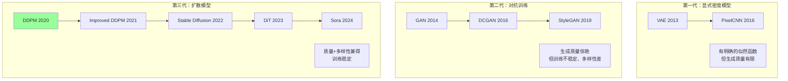

### 1.2 GAN 的困境

| GAN 的问题 | 说明 |
|-----------|------|
| **训练不稳定** | 生成器和判别器的 min-max 博弈难以平衡 |
| **模式崩溃** | 生成器可能只产生少数几种样本 |
| **多样性差** | 难以覆盖数据分布的所有模式 |
| **评估困难** | 没有 Good 的评估指标（FID 不够） |
| **可控性弱** | 潜空间不连续，难以精确控制 |

### 1.3 扩散模型的直觉

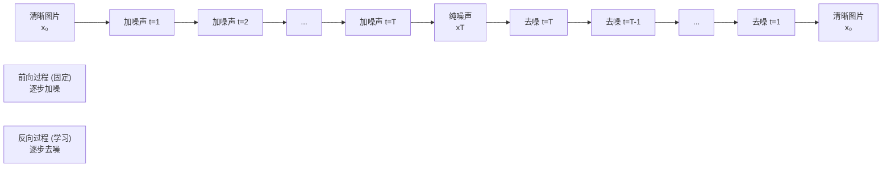

---

## 2. 数学基础：DDPM

### 2.1 前向过程 (Forward Process)

给定数据 $x_0 \sim q(x_0)$，前向过程定义了一个马尔可夫链，逐步添加高斯噪声：

$$
q(x_t | x_{t-1}) = \mathcal{N}(x_t; \sqrt{1 - \beta_t} x_{t-1}, \beta_t \mathbf{I})
$$

**关键性质——任意时刻的直接采样**：

$$
q(x_t | x_0) = \mathcal{N}(x_t; \sqrt{\bar{\alpha}_t} x_0, (1 - \bar{\alpha}_t) \mathbf{I})
$$

其中 $\alpha_t = 1 - \beta_t$，$\bar{\alpha}_t = \prod_{s=1}^{t} \alpha_s$。

**重参数化**：

$$
x_t = \sqrt{\bar{\alpha}_t} x_0 + \sqrt{1 - \bar{\alpha}_t} \epsilon, \quad \epsilon \sim \mathcal{N}(0, \mathbf{I})
$$

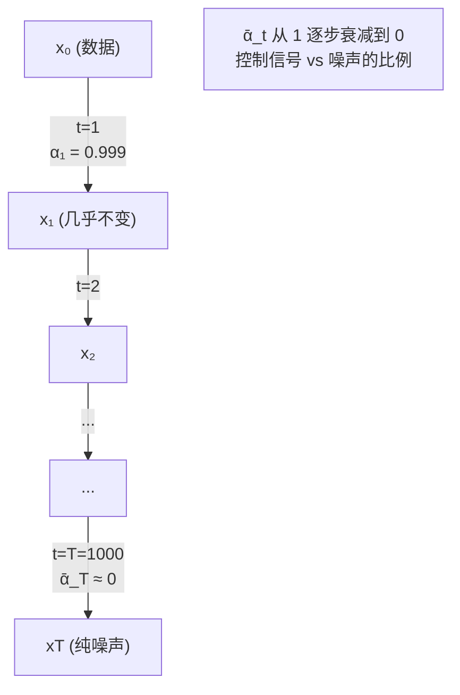

### 2.2 反向过程 (Reverse Process)

反向过程学习从 $x_T$ 逐步去噪到 $x_0$：

$$
p_\theta(x_{t-1} | x_t) = \mathcal{N}(x_{t-1}; \mu_\theta(x_t, t), \sigma_t^2 \mathbf{I})
$$

**核心推导**：利用贝叶斯定理，可以推导出：

$$
q(x_{t-1} | x_t, x_0) = \mathcal{N}(x_{t-1}; \tilde{\mu}_t(x_t, x_0), \tilde{\beta}_t \mathbf{I})
$$

其中：

$$
\tilde{\mu}_t(x_t, x_0) = \frac{\sqrt{\bar{\alpha}_{t-1}} \beta_t}{1 - \bar{\alpha}_t} x_0 + \frac{\sqrt{\alpha_t}(1 - \bar{\alpha}_{t-1})}{1 - \bar{\alpha}_t} x_t
$$

$$
\tilde{\beta}_t = \frac{1 - \bar{\alpha}_{t-1}}{1 - \bar{\alpha}_t} \beta_t
$$

### 2.3 训练目标

**简化目标**：将均值参数化，用 $x_0$ 表示：

$$
\mu_\theta(x_t, t) = \frac{1}{\sqrt{\alpha_t}} \left( x_t - \frac{\beta_t}{\sqrt{1 - \bar{\alpha}_t}} \epsilon_\theta(x_t, t) \right)
$$

**最终简化损失**（Ho et al., 2020 的关键发现）：

$$
\mathcal{L}_{\text{simple}} = \mathbb{E}_{t, x_0, \epsilon} \left[ \| \epsilon - \epsilon_\theta(x_t, t) \|^2 \right]
$$

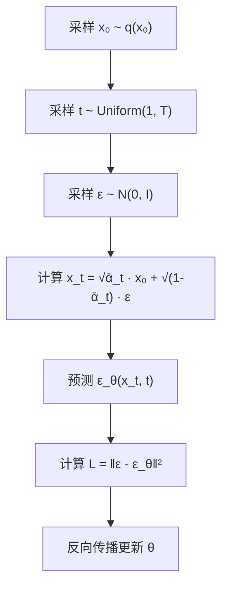

**直觉解释**：

| 步骤 | 说明 |
|------|------|
| 1. 采样真实数据 | 从训练集中取一张图片 |
| 2. 采样时间步 | 随机选择一个加噪程度 |
| 3. 添加噪声 | 得到带噪声的图片 $x_t$ |
| 4. 预测噪声 | 模型预测添加了什么噪声 |
| 5. 计算损失 | 预测噪声和真实噪声的差异 |

### 2.4 噪声调度 (Noise Schedule)

$$
\beta_t: \text{从 } \beta_1 \text{ 到 } \beta_T \text{ 的方差调度}
$$

| 调度类型 | 公式 | 特点 |
|---------|------|------|
| **线性** | $\beta_t$ 线性从 $\beta_1$ 到 $\beta_T$ | DDPM 原始方案 |
| **余弦** | $\bar{\alpha}_t = \frac{f(t)}{f(0)}$ | 改进的 DDPM 推荐 |
| **Sigmoid** | S 形曲线 | 平滑过渡 |

**余弦调度**（Improved DDPM 推荐）：

$$
\bar{\alpha}_t = \frac{f(t)}{f(0)}, \quad f(t) = \cos\left(\frac{t/T + s}{1 + s} \cdot \frac{\pi}{2}\right)^2
$$

---

## 3. Score-Based Models：统一视角

### 3.1 什么是 Score Function？

$$
\text{Score Function: } \nabla_x \log p(x)
$$

Score function 是对数概率密度的梯度——它指向密度增长最快的方向。

### 3.2 Score Matching 与扩散的关系

**关键洞察**（Song et al., 2021）：DDPM 中预测噪声 $\epsilon_\theta$ 等价于估计 score function：

$$
\epsilon_\theta(x_t, t) = -\sqrt{1 - \bar{\alpha}_t} \nabla_{x_t} \log p(x_t)
$$

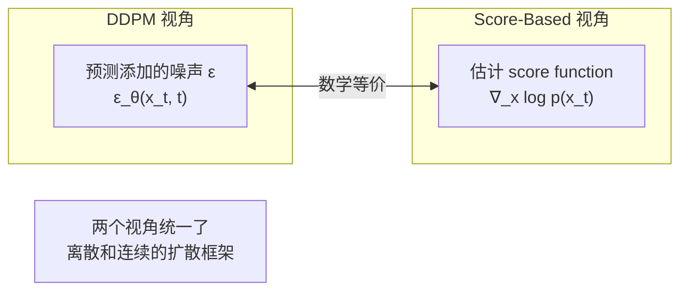

### 3.3 SDE (Stochastic Differential Equation) 统一框架

前向 SDE：

$$
dx = f(x, t) dt + g(t) dw
$$

反向 SDE：

$$
dx = [f(x, t) - g(t)^2 \nabla_x \log p_t(x)] dt + g(t) d\bar{w}
$$

| 符号 | 含义 |
|------|------|
| $f(x, t)$ | 漂移系数 |
| $g(t)$ | 扩散系数 |
| $w$ | 标准维纳过程 (布朗运动) |
| $\nabla_x \log p_t(x)$ | 时间依赖的 score function |

---

## 4. Latent Diffusion Models (Stable Diffusion)

### 4.1 动机：为什么在潜空间做扩散？

| 问题 | 像素空间扩散 | 潜空间扩散 |
|------|------------|-----------|
| **分辨率** | 512×512×3 = 786,432 维 | 64×64×4 = 16,384 维 |
| **计算量** | 极大 | **减少 ~48×** |
| **冗余信息** | 大量像素级冗余 | 高度压缩的语义表示 |
| **训练成本** | 需要巨大集群 | 消费级 GPU 可训练 |

### 4.2 Stable Diffusion 架构

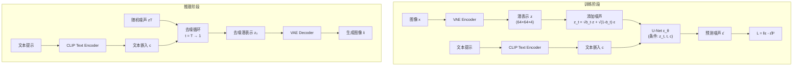

### 4.3 VAE：像素空间与潜空间的桥梁

```python
import torch
import torch.nn as nn

class VAEEncoder(nn.Module):
    def __init__(self, in_channels=3, latent_dim=4):
        super().__init__()
        self.encoder = nn.Sequential(
            nn.Conv2d(in_channels, 128, 3, stride=2, padding=1),
            nn.ReLU(),
            nn.Conv2d(128, 256, 3, stride=2, padding=1),
            nn.ReLU(),
            nn.Conv2d(256, 512, 3, stride=2, padding=1),
            nn.ReLU(),
            nn.Conv2d(512, 512, 3, stride=2, padding=1),
            nn.ReLU(),
        )
        self.fc_mu = nn.Conv2d(512, latent_dim, 1)
        self.fc_var = nn.Conv2d(512, latent_dim, 1)
    
    def forward(self, x):
        h = self.encoder(x)
        mu = self.fc_mu(h)
        log_var = self.fc_var(h)
        std = torch.exp(0.5 * log_var)
        eps = torch.randn_like(std)
        z = mu + eps * std
        return z, mu, log_var


class VAEDecoder(nn.Module):
    def __init__(self, latent_dim=4, out_channels=3):
        super().__init__()
        self.decoder = nn.Sequential(
            nn.Conv2d(latent_dim, 512, 3, padding=1),
            nn.ReLU(),
            nn.Upsample(scale_factor=2),
            nn.Conv2d(512, 512, 3, padding=1),
            nn.ReLU(),
            nn.Upsample(scale_factor=2),
            nn.Conv2d(512, 256, 3, padding=1),
            nn.ReLU(),
            nn.Upsample(scale_factor=2),
            nn.Conv2d(256, 128, 3, padding=1),
            nn.ReLU(),
            nn.Upsample(scale_factor=2),
            nn.Conv2d(128, out_channels, 3, padding=1),
            nn.Tanh(),
        )
    
    def forward(self, z):
        return self.decoder(z)
```

### 4.4 条件注入：Classifier-Free Guidance

**无条件 vs 有条件预测**：

$$
\hat{\epsilon}_\theta(x_t, t, c) = (1 + w) \cdot \epsilon_\theta(x_t, t, c) - w \cdot \epsilon_\theta(x_t, t, \emptyset)
$$

其中 $w$ 是引导尺度 (guidance scale)。

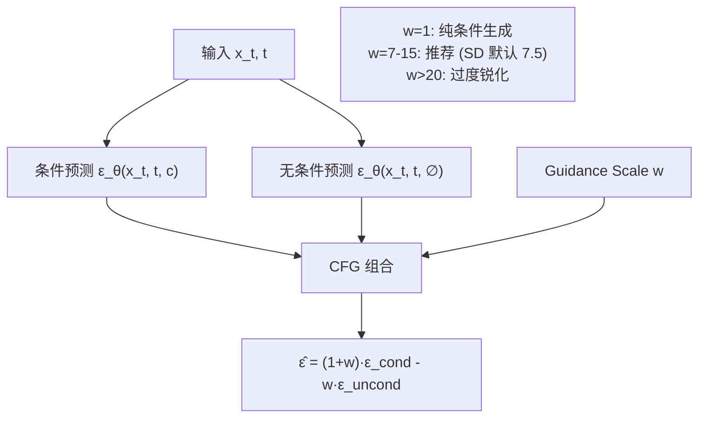

| Guidance Scale (w) | 效果 |
|-------------------|------|
| **1.0** | 完全条件，低质量 |
| **3.0-5.0** | 适度引导，自然 |
| **7.0-9.0** | SD 默认，质量好 |
| **12.0-20.0** | 强引导，细节增强但可能失真 |
| **>20** | 过度引导，伪影严重 |

**训练时的 CFG Dropout**：以概率 $p_{\text{uncond}}$（通常 10%）丢弃条件，训练模型同时学习有条件和无条件预测。

---

## 5. 采样方法

### 5.1 DDPM 采样（原始）

$$
x_{t-1} = \frac{1}{\sqrt{\alpha_t}} \left( x_t - \frac{\beta_t}{\sqrt{1 - \bar{\alpha}_t}} \epsilon_\theta(x_t, t) \right) + \sigma_t z
$$

其中 $z \sim \mathcal{N}(0, \mathbf{I})$。

**问题**：需要 $T=1000$ 步，速度极慢。

### 5.2 DDIM 采样（加速）

$$
x_{t-1} = \sqrt{\bar{\alpha}_{t-1}} \underbrace{\frac{x_t - \sqrt{1 - \bar{\alpha}_t} \epsilon_\theta(x_t, t)}{\sqrt{\bar{\alpha}_t}}}_{\text{预测 } x_0} + \sqrt{1 - \bar{\alpha}_{t-1}} \cdot \epsilon_\theta(x_t, t)
$$

**关键优势**：
- **确定性**：去掉随机项，$\eta=0$ 时完全确定
- **子序列采样**：可以从 $T=1000$ 步中均匀取 $S=20$ 或 $50$ 步

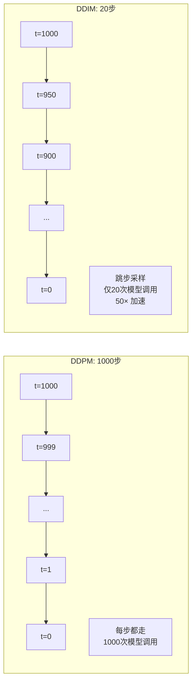

### 5.3 采样方法对比

| 方法 | 步数 | 质量 | 速度 | 特点 |
|------|------|------|------|------|
| **DDPM** | 1000 | 最好 | 最慢 | 原始方法 |
| **DDIM** | 20-50 | 好 | 快 | 确定性，广泛使用 |
| **DPM-Solver** | 10-20 | 好 | 很快 | 高阶 ODE 求解器 |
| **DPM-Solver++** | 10-20 | 很好 | 很快 | DPM-Solver 改进版 |
| **UniPC** | 10-20 | 很好 | 很快 | 统一预测校正 |
| **Euler** | 20-30 | 中等 | 快 | 简单欧拉方法 |
| **LMS** | 20-50 | 好 | 快 | 线性多步法 |

### 5.4 DPM-Solver 代码示例

```python
from diffusers import StableDiffusionPipeline, DPMSolverMultistepScheduler
import torch

pipe = StableDiffusionPipeline.from_pretrained(
    "runwayml/stable-diffusion-v1-5",
    torch_dtype=torch.float16,
).to("cuda")

pipe.scheduler = DPMSolverMultistepScheduler.from_config(pipe.scheduler.config)

image = pipe(
    prompt="a cat wearing a hat, digital art, highly detailed",
    num_inference_steps=20,
    guidance_scale=7.5,
    generator=torch.Generator("cuda").manual_seed(42),
).images[0]

image.save("output.png")
```

---

## 6. DiT (Diffusion Transformer)

### 6.1 从 U-Net 到 Transformer

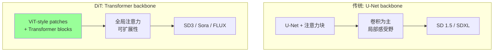

### 6.2 DiT 架构

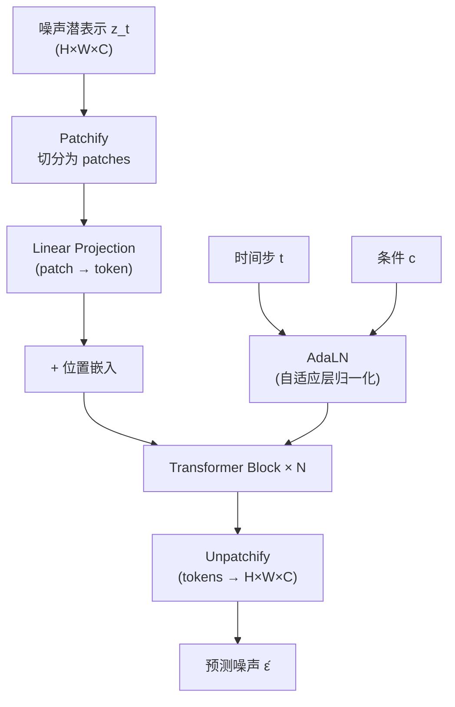

**DiT Block 的关键设计**：

$$
\text{AdaLN}(x, c) = \gamma_1(c) \cdot \text{LayerNorm}(x) + \beta_1(c)
$$

$$
x' = x + \text{MLP}(\gamma_2(c) \cdot \text{SelfAttn}(\text{AdaLN}(x, c)) + \beta_2(c))
$$

| 组件 | 作用 |
|------|------|
| **AdaLN** | 通过条件信息调制归一化参数 |
| **adaLN-Zero** | 残差连接初始为零，加速训练 |
| **Patch size** | 2×2 或 4×4，控制 token 数量 |

### 6.3 DiT 的 Scaling 行为

| DiT 变体 | 参数量 | GFLOPS | FID (256×256) |
|---------|--------|--------|--------------|
| **DiT-S/2** | 33M | 4.6 | 68.4 |
| **DiT-B/2** | 130M | 16.9 | 43.5 |
| **DiT-L/2** | 458M | 59.4 | 27.4 |
| **DiT-XL/2** | 675M | 87.6 | 19.5 |

**关键发现**：DiT 的性能与 Gflops 呈**可预测的幂律关系**——类似 LLM 的 Scaling Laws。

---

## 7. 视频生成

### 7.1 从图像到视频的扩展

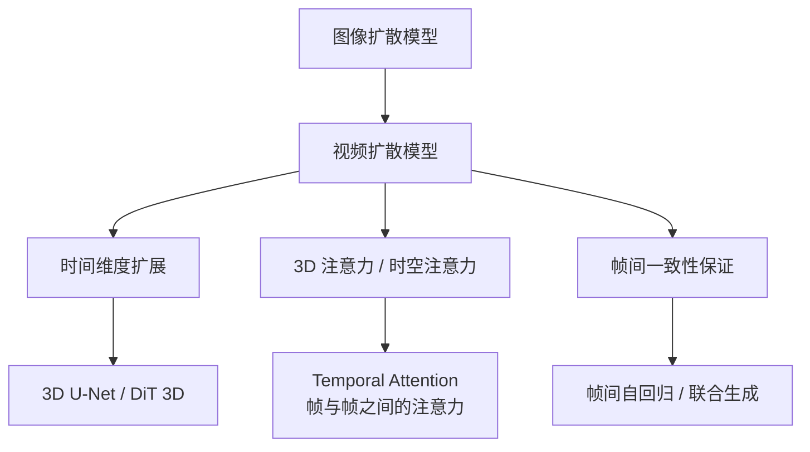

### 7.2 关键视频模型

| 模型 | 时间 | 方法 | 时长 | 特点 |
|------|------|------|------|------|
| **Video Diffusion Models** | 2022 | 3D U-Net | 短 | 视频扩散先驱 |
| **Make-A-Video** | 2022 | 时序层微调 | 短 | 基于预训练图像模型 |
| **Sora** | 2024 | DiT + 时空 patch | 60s+ | 突破性长视频生成 |
| **Kling** | 2024 | 潜空间 DiT | 2min | 中国版 Sora |
| **Runway Gen-3** | 2024 | DiT | 16s | 高质量短视频 |

### 7.3 Sora 的核心思想

```python
# Sora 的时空 patch 化概念
class SpacetimePatchEmbedding:
    """
    将视频 (T × H × W × C) 切分为时空 patches
    每个 patch: (t × h × w × c) → 一维 token
    
    类似 ViT 的 patch 化，但在 3D 时空中进行
    """
    def __init__(self, tubelet_size=(2, 16, 16), embed_dim=768):
        self.tubelet_size = tubelet_size
        self.embed_dim = embed_dim
    
    def patchify(self, video):
        # video shape: (B, T, H, W, C)
        t, h, w = self.tubelet_size
        # 切分为时空 tubes
        patches = video.unfold(1, t, t).unfold(2, h, h).unfold(3, w, w)
        # 展平并投影
        tokens = patches.reshape(video.shape[0], -1, t * h * w * video.shape[4])
        return tokens  # (B, num_patches, embed_dim)
```

---

## 8. 代码实战

### 8.1 从零实现简化版 DDPM

```python
import torch
import torch.nn as nn
import torch.nn.functional as F
import math
from tqdm import tqdm

class SinusoidalPositionEmbeddings(nn.Module):
    def __init__(self, dim):
        super().__init__()
        self.dim = dim
    
    def forward(self, t):
        half_dim = self.dim // 2
        emb = math.log(10000) / (half_dim - 1)
        emb = torch.exp(torch.arange(half_dim, device=t.device) * -emb)
        emb = t[:, None].float() * emb[None, :]
        return torch.cat([emb.sin(), emb.cos()], dim=-1)


class SimpleUNet(nn.Module):
    def __init__(self, in_channels=1, out_channels=1, time_emb_dim=128):
        super().__init__()
        
        self.time_mlp = nn.Sequential(
            SinusoidalPositionEmbeddings(time_emb_dim),
            nn.Linear(time_emb_dim, time_emb_dim),
            nn.GELU(),
            nn.Linear(time_emb_dim, time_emb_dim),
        )
        
        self.conv1 = nn.Conv2d(in_channels, 64, 3, padding=1)
        self.conv2 = nn.Conv2d(64, 128, 3, padding=1)
        self.conv3 = nn.Conv2d(128, 256, 3, padding=1)
        self.conv4 = nn.Conv2d(256, 128, 3, padding=1)
        self.conv5 = nn.Conv2d(128, 64, 3, padding=1)
        self.conv6 = nn.Conv2d(64, out_channels, 3, padding=1)
        
        self.time_proj1 = nn.Linear(time_emb_dim, 128)
        self.time_proj2 = nn.Linear(time_emb_dim, 256)
        
        self.pool = nn.MaxPool2d(2)
        self.up = nn.Upsample(scale_factor=2, mode="bilinear", align_corners=True)
    
    def forward(self, x, t):
        t_emb = self.time_mlp(t)
        
        x1 = F.relu(self.conv1(x))
        x2 = self.pool(F.relu(self.conv2(x1)))
        
        tp1 = self.time_proj1(t_emb)[:, :, None, None]
        x2 = x2 + tp1
        
        x3 = self.pool(F.relu(self.conv3(x2)))
        
        tp2 = self.time_proj2(t_emb)[:, :, None, None]
        x3 = x3 + tp2
        
        x4 = self.up(x3)
        x4 = F.relu(self.conv4(torch.cat([x4, x2], dim=1)))
        
        x5 = self.up(x4)
        x5 = F.relu(self.conv5(torch.cat([x5, x1], dim=1)))
        
        return self.conv6(x5)


class GaussianDiffusion:
    def __init__(self, model, timesteps=1000, beta_schedule="cosine"):
        self.model = model
        self.timesteps = timesteps
        
        if beta_schedule == "linear":
            betas = torch.linspace(1e-4, 0.02, timesteps)
        elif beta_schedule == "cosine":
            steps = torch.arange(timesteps + 1)
            f = torch.cos((steps / timesteps + 0.008) / 1.008 * math.pi / 2) ** 2
            alphas_cumprod = f / f[0]
            betas = 1 - (alphas_cumprod[1:] / alphas_cumprod[:-1])
            betas = torch.clamp(betas, 0, 0.999)
        
        alphas = 1 - betas
        self.alphas_cumprod = torch.cumprod(alphas, dim=0)
        self.sqrt_alphas_cumprod = torch.sqrt(self.alphas_cumprod)
        self.sqrt_one_minus_alphas_cumprod = torch.sqrt(1 - self.alphas_cumprod)
    
    def add_noise(self, x_0, t, noise=None):
        if noise is None:
            noise = torch.randn_like(x_0)
        
        sqrt_alpha = self.sqrt_alphas_cumprod[t][:, None, None, None]
        sqrt_one_minus_alpha = self.sqrt_one_minus_alphas_cumprod[t][:, None, None, None]
        
        return sqrt_alpha * x_0 + sqrt_one_minus_alpha * noise
    
    def train_loss(self, x_0):
        batch_size = x_0.shape[0]
        t = torch.randint(0, self.timesteps, (batch_size,), device=x_0.device)
        noise = torch.randn_like(x_0)
        
        x_t = self.add_noise(x_0, t, noise)
        predicted_noise = self.model(x_t, t)
        
        return F.mse_loss(predicted_noise, noise)
    
    @torch.no_grad()
    def sample(self, shape, device):
        x = torch.randn(shape, device=device)
        
        for t in reversed(range(self.timesteps)):
            t_batch = torch.full((shape[0],), t, device=device, dtype=torch.long)
            
            predicted_noise = self.model(x, t_batch)
            
            alpha_t = self.alphas_cumprod[t]
            alpha_t_prev = self.alphas_cumprod[t - 1] if t > 0 else torch.tensor(1.0)
            beta_t = 1 - alpha_t
            
            x0_pred = (x - torch.sqrt(beta_t) * predicted_noise) / torch.sqrt(alpha_t)
            
            if t > 0:
                noise = torch.randn_like(x)
                sigma_t = torch.sqrt((1 - alpha_t_prev) / (1 - alpha_t) * (1 - alpha_t / alpha_t_prev))
                x = torch.sqrt(alpha_t_prev) * x0_pred + torch.sqrt(1 - alpha_t_prev) * sigma_t * noise
            else:
                x = x0_pred
        
        return x


def train_ddpm(model, dataloader, epochs=10, lr=2e-4, device="cuda"):
    diffusion = GaussianDiffusion(model, timesteps=1000)
    optimizer = torch.optim.Adam(model.parameters(), lr=lr)
    
    for epoch in range(epochs):
        total_loss = 0
        for batch in tqdm(dataloader, desc=f"Epoch {epoch+1}"):
            images = batch[0].to(device)
            optimizer.zero_grad()
            loss = diffusion.train_loss(images)
            loss.backward()
            optimizer.step()
            total_loss += loss.item()
        
        avg_loss = total_loss / len(dataloader)
        print(f"Epoch {epoch+1}, Loss: {avg_loss:.4f}")
    
    return diffusion
```

### 8.2 条件生成 (Classifier-Free Guidance)

```python
class ConditionalDiffusion:
    def __init__(self, model, timesteps=1000, guidance_scale=7.5, uncond_prob=0.1):
        self.model = model
        self.timesteps = timesteps
        self.guidance_scale = guidance_scale
        self.uncond_prob = uncond_prob
        self.diffusion = GaussianDiffusion(model, timesteps)
    
    def train_loss(self, x_0, condition):
        batch_size = x_0.shape[0]
        t = torch.randint(0, self.timesteps, (batch_size,), device=x_0.device)
        noise = torch.randn_like(x_0)
        x_t = self.diffusion.add_noise(x_0, t, noise)
        
        mask = torch.rand(batch_size, device=x_0.device) < self.uncond_prob
        condition = condition.clone()
        condition[mask] = 0
        
        predicted_noise = self.model(x_t, t, condition)
        return F.mse_loss(predicted_noise, noise)
    
    @torch.no_grad()
    def sample_cfg(self, shape, condition, device):
        x = torch.randn(shape, device=device)
        
        for t in reversed(range(self.timesteps)):
            t_batch = torch.full((shape[0],), t, device=device, dtype=torch.long)
            
            noise_cond = self.model(x, t_batch, condition)
            noise_uncond = self.model(x, t_batch, torch.zeros_like(condition))
            
            predicted_noise = noise_uncond + self.guidance_scale * (noise_cond - noise_uncond)
            
            alpha_t = self.diffusion.alphas_cumprod[t]
            beta_t = 1 - alpha_t
            
            x0_pred = (x - torch.sqrt(beta_t) * predicted_noise) / torch.sqrt(alpha_t)
            
            if t > 0:
                noise = torch.randn_like(x)
                x = x0_pred + torch.sqrt(beta_t) * noise
        
        return x
```

---

## 9. 扩散模型 vs GAN vs VAE

| 维度 | GAN | VAE | Diffusion |
|------|-----|-----|-----------|
| **训练稳定性** | 差（min-max 博弈） | 好 | **最好** |
| **生成质量** | 高 | 中等 | **最高** |
| **多样性** | 差（模式崩溃） | 好 | **最好** |
| **训练成本** | 低 | 低 | 高（多步推理） |
| **推理速度** | 快（单次前向） | 快（单次前向） | 慢（多步迭代） |
| **可解释性** | 差 | 较好 | 好（概率框架） |
| **可控性** | 弱 | 中等 | **强（CFG）** |
| **数学基础** | 博弈论 | 变分推断 | 随机过程 |

---

## 10. 面试问题（FAQ）

### Q1: 扩散模型为什么比 GAN 训练更稳定？

> **答**: 扩散模型使用简单的 MSE 损失（预测噪声），避免了 GAN 的 min-max 博弈问题：
> 1. **单一损失函数**：不需要平衡生成器和判别器
> 2. **无对抗训练**：没有模式崩溃风险
> 3. **覆盖全分布**：L2 损失鼓励模型覆盖数据分布的所有模式
> 4. **课程学习**：从简单（低噪声）到困难（高噪声）逐步学习

### Q2: 为什么 Stable Diffusion 在潜空间而不是像素空间做扩散？

> **答**: 三个核心原因：
> 1. **计算效率**：潜空间维度是像素空间的 ~1/48
> 2. **语义压缩**：VAE 去除了像素级冗余，保留语义信息
> 3. **训练可行性**：让在消费级 GPU 上训练高分辨率模型成为可能

### Q3: Classifier-Free Guidance 为什么有效？

> **答**: CFG 通过放大有条件和无条件预测的差异来增强条件信号：
> - 无条件预测代表"平均"生成
> - 条件预测代表"定向"生成
> - 差异部分是**纯粹的信号**
> - 放大这个差异使生成更符合条件，质量更好
> 
> **代价**：过高的 guidance scale 会导致多样性下降和过饱和。

### Q4: DDPM 的 T=1000 步可以减少吗？

> **答**: 可以，多种方法：
> - **DDIM**：子序列采样，20-50 步即可
> - **DPM-Solver**：高阶 ODE 求解，10-20 步
> - **一致性模型**：1-2 步（ICLR 2024 Best Paper）
> - **LCM (Latent Consistency Models)**：1-4 步生成
> - **蒸馏**：用大模型指导小模型，1 步

### Q5: 扩散模型能用于 3D 生成吗？

> **答**: 可以，主要方法：
> 1. **DreamFusion** (2022)：SDS Loss，用 2D 扩散模型优化 3D 表示
> 2. **3D Native**：直接在 3D 数据上训练扩散模型
> 3. **视频转 3D**：用视频扩散模型生成多视角再重建
> 4. **Gaussian Splatting**：结合扩散模型生成 3D 高斯

---

## 11. 与其他章节的关联

### 前置知识
- [Attention Is All You Need 深度解读](20_论文精读/02_Architecture/Attention_Is_All_You_Need_Deep_Dive.md) — Transformer 架构基础
- [ResNet 深度解读](20_论文精读/08_Vision/ResNet_Deep_Dive.md) — U-Net 中的残差连接
- [计算机视觉](../../04_计算机视觉/README.md) — 生成模型基础

### 横向关联
- [生成模型](../04_计算机视觉/06_Generative_Models/) — GAN / VAE / Diffusion 对比
- [RLHF 与 DPO 深度解读](20_论文精读/06_Alignment/RLHF_DPO_Deep_Dive.md) — RLHF 用于对齐生成模型
- [LLaMA 深度解读](20_论文精读/02_Architecture/LLaMA_Deep_Dive.md) — DiT 与 LLM 架构的融合

### 进阶方向
- [Mixture of Experts 深度解读](20_论文精读/02_Architecture/Mixture_of_Experts_Deep_Dive.md) — MoE 在扩散模型中的应用
- [模型训练](../../07_模型训练/README.md) — 大规模扩散模型训练

---

*Last updated: 2026-05-17*

## Related

- [[概念/generative-vision-models]] — 视觉生成模型
- [[概念/computer-vision]] — 计算机视觉
- [[概念/video-generation]] — 视频生成
