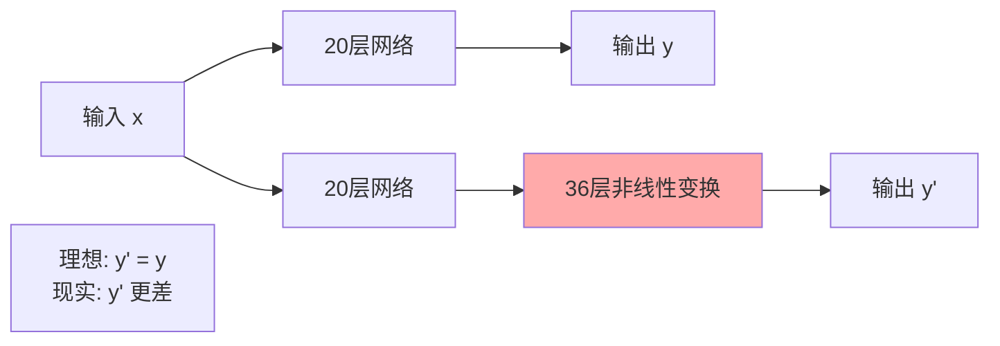
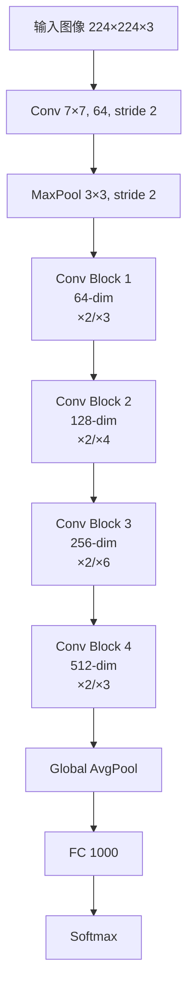
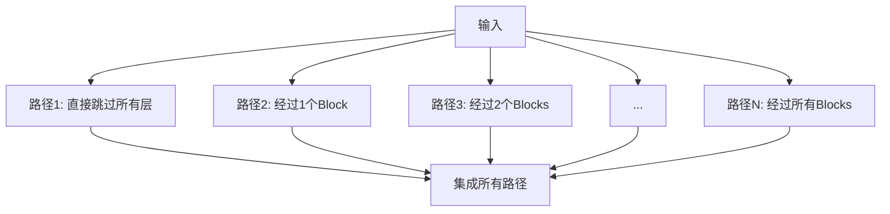
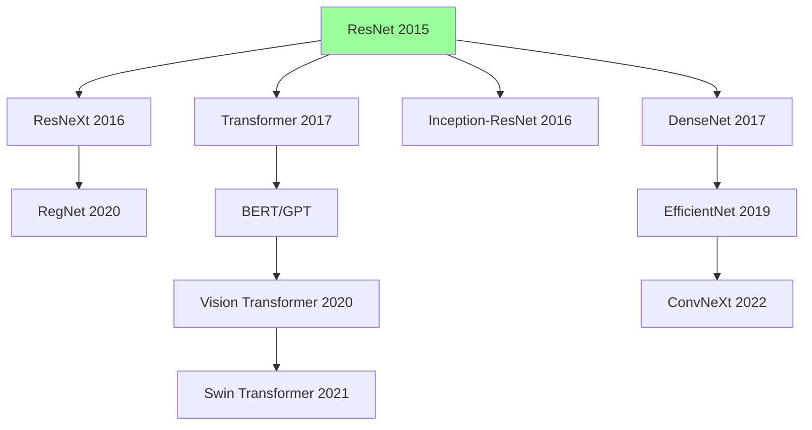
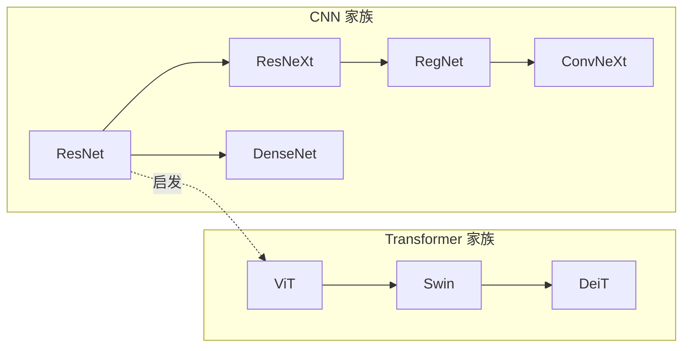
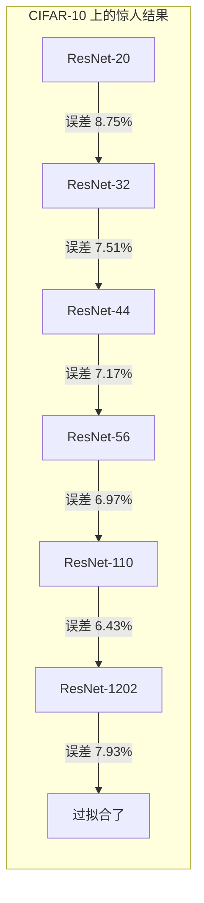

# ResNet 深度解读 (Deep Residual Learning for Image Recognition)

> **一句话理解**: ResNet 就像给深层神经网络修建了"高速公路"——通过跳跃连接让梯度直接流通，解决了网络越深反而越差的反直觉问题，让 152 层甚至上千层的网络训练成为可能。

---

## 论文基本信息

| 属性 | 内容 |
|------|------|
| **标题** | Deep Residual Learning for Image Recognition |
| **作者** | Kaiming He, Xiangyu Zhang, Shaoqing Ren, Jian Sun (Microsoft Research) |
| **发表** | CVPR 2016 (Best Paper) |
| **引用量** | 200,000+ (截至 2026) |
| **论文链接** | [arXiv:1512.03385](https://arxiv.org/abs/1512.03385) |
| **代码** | [官方 Caffe](https://github.com/KaimingHe/deep-residual-networks) |

---

## 1. 历史背景：为什么更深的网络在失败？

### 1.1 深度网络的诱惑与困境

2012 年 AlexNet (8 层) 在 ImageNet 上一鸣惊人后，深度学习社区形成共识：**更深的网络 = 更强的表达能力**。VGGNet (19 层) 验证了这一点，但当研究者尝试构建 30 层、50 层甚至 100 层的网络时，奇怪的事情发生了——


**不是过拟合！** 训练误差和测试误差都更高了。

### 1.2 两大杀手：梯度消失与退化问题

| 问题 | 现象 | 原因 | 影响阶段 |
|------|------|------|----------|
| **梯度消失 (Vanishing Gradient)** | 反向传播时梯度逐层衰减，浅层几乎不更新 | 激活函数导数 < 1，连乘导致指数衰减 | 训练阶段 |
| **梯度爆炸 (Exploding Gradient)** | 梯度指数增长，参数更新失控 | 权重初始化过大 | 训练阶段 |
| **退化问题 (Degradation Problem)** | 深层网络训练集误差反而高于浅层网络 | 非线性层难以学习恒等映射 | 训练阶段 |

**关键区分**：
- **梯度消失/爆炸**：可以通过更好的初始化、BatchNorm、ReLU 等缓解
- **退化问题**：即使梯度正常传播，深层网络也无法比浅层网络学得更好了

### 1.3 退化问题的核心洞察

假设我们有一个训练好的浅层网络（如 20 层），现在在其后叠加 36 层**恒等映射**（即输出=输入），得到一个 56 层网络：

```
理想情况：56 层网络至少应该和 20 层一样好
现实情况：56 层网络反而更差
```

**结论**：深层网络中的非线性层很难学习到"什么都不做"（恒等映射）这个简单的函数。



---

## 2. 核心创新：残差连接 (Residual Connection)

### 2.1 核心思想：让网络学习"残差"

ResNet 的突破性想法：**不要学习从 x 到 H(x) 的映射，而是学习残差 F(x) = H(x) - x**

```mermaid
flowchart LR
    subgraph "传统网络"
        A1[x] --> B1[堆叠层]
        B1 --> C1[H(x)]
        note1["目标: 学习 H(x)"]
    end
    
    subgraph "残差网络"
        A2[x] --> B2[堆叠层]
        B2 --> C2[F(x)]
        A2 --> D2[+]
        C2 --> D2
        D2 --> E2[H(x) = F(x) + x]
        note2["目标: 学习 F(x) = H(x) - x"]
    end
```

**数学表达**：

$$
\mathbf{y} = \mathcal{F}(\mathbf{x}, \{\mathbf{W}_i\}) + \mathbf{x}
$$

其中：
- $\mathbf{x}$：输入
- $\mathcal{F}(\mathbf{x}, \{\mathbf{W}_i\})$：残差映射（要学习的部分）
- $\mathbf{y}$：输出

### 2.2 为什么残差学习更容易？

**关键洞察**：如果最优映射就是恒等映射（即深层不需要做任何改变），传统网络需要将所有权重调整到使 $H(x) = x$，这很困难；而残差网络只需要将 $F(x)$ 推向 0，这容易得多。

| 场景 | 传统网络 | 残差网络 |
|------|---------|---------|
| **最优是恒等映射** | 学习 $H(x) = x$（困难） | 学习 $F(x) = 0$（简单，权重置零即可） |
| **最优需要变换** | 学习完整映射 | 学习"变化量"，保留原始信息 |
| **梯度回传** | 穿过所有层的连乘 | 有"捷径"直接回传 |

### 2.3 梯度高速公路

残差连接创造了一个**梯度高速公路**，让梯度可以直接从深层跳回浅层：

```mermaid
flowchart TB
    subgraph "传统网络反向传播"
        A1[Loss] --> B1[∂L/∂h_L]
        B1 --> C1[∂L/∂h_{L-1}] 
        C1 --> D1[...]
        D1 --> E1[∂L/∂h_1]
        note1["L 步连乘<br/>梯度衰减严重"]
    end
    
    subgraph "残差网络反向传播"
        A2[Loss] --> B2[∂L/∂h_L]
        B2 --> C2[∂L/∂h_{L-1}]
        C2 --> D2[...]
        D2 --> E2[∂L/∂h_1]
        B2 -.->|shortcut| E2
        C2 -.->|shortcut| E2
        note2["每步都有直达通道<br/>∂y/∂x = I + ∂F/∂x"]
    end
```

**数学推导**：

$$
\frac{\partial \mathcal{L}}{\partial \mathbf{x}} = \frac{\partial \mathcal{L}}{\partial \mathbf{y}} \cdot \frac{\partial \mathbf{y}}{\partial \mathbf{x}} = \frac{\partial \mathcal{L}}{\partial \mathbf{y}} \cdot \left( \mathbf{I} + \frac{\partial \mathcal{F}}{\partial \mathbf{x}} \right)
$$

即使 $\frac{\partial \mathcal{F}}{\partial \mathbf{x}}$ 很小（梯度消失），单位矩阵 $\mathbf{I}$ 仍然保证梯度可以流通！

---

## 3. 架构详解

### 3.1 整体架构



### 3.2 BasicBlock vs Bottleneck

ResNet 提供两种残差单元设计：

```mermaid
flowchart TB
    subgraph "BasicBlock (ResNet-18/34)"
        A1[x] --> B1[Conv 3×3, 64]
        B1 --> C1[BN + ReLU]
        C1 --> D1[Conv 3×3, 64]
        D1 --> E1[BN]
        A1 --> F1[+]
        E1 --> F1
        F1 --> G1[ReLU]
        G1 --> H1[输出]
    end
    
    subgraph "Bottleneck (ResNet-50/101/152)"
        A2[x] --> B2[Conv 1×1, 64]
        B2 --> C2[BN + ReLU]
        C2 --> D2[Conv 3×3, 64]
        D2 --> E2[BN + ReLU]
        E2 --> F2[Conv 1×1, 256]
        F2 --> G2[BN]
        A2 --> H2[+]
        G2 --> H2
        H2 --> I2[ReLU]
        I2 --> J2[输出]
    end
```



| 特性 | BasicBlock | Bottleneck |
|------|-----------|------------|
| **适用模型** | ResNet-18, ResNet-34 | ResNet-50, ResNet-101, ResNet-152 |
| **结构** | 两个 3×3 卷积 | 1×1 → 3×3 → 1×1（两头细中间粗） |
| **参数量** | 较多 | 更少（1×1 降维/升维） |
| **计算量** | 较大 | 较小 |
| **特征维度变化** | 保持不变 | 先降维再升维 |

**为什么叫 Bottleneck？**

```
输入: 256 channels
    ↓ Conv 1×1 (256→64)   ← 降维 "瓶口"
    ↓ Conv 3×3 (64→64)    ← 在更低维度计算
    ↓ Conv 1×1 (64→256)   ← 升维恢复
输出: 256 channels
```

1×1 卷积先降维到 64，在更低维度做 3×3 卷积，再升维回 256。这减少了约 50% 的计算量。

### 3.3 维度匹配：当输入输出维度不同时

残差连接要求 $F(x)$ 和 $x$ 可以相加，因此维度必须一致：

| 场景 | 解决方案 | 实现 |
|------|---------|------|
| **通道数不同** | 1×1 卷积投影 | `Conv 1×1, stride=1` 调整通道数 |
| **空间尺寸不同** | 步长为 2 的卷积 | `Conv 1×1, stride=2` 下采样 |
| **通道和空间都不同** | 投影 + 步长 | `Conv 1×1, stride=2` 同时处理 |

```mermaid
flowchart LR
    subgraph "Identity Shortcut (维度相同)"
        A1[x] --> B1[F(x)]
        A1 --> C1[+]
        B1 --> C1
        C1 --> D1[F(x) + x]
    end
    
    subgraph "Projection Shortcut (维度不同)"
        A2[x] --> B2[F(x)]
        A2 --> C2[W_s · x]
        B2 --> D2[+]
        C2 --> D2
        D2 --> E2[F(x) + W_s·x]
    end
```

**投影矩阵** $W_s$ 通常用 1×1 卷积实现。

### 3.4 五种标准配置

| 模型 | 层数 | 残差单元类型 | 各阶段块数 | 总参数量 | ImageNet Top-1 |
|------|------|-------------|-----------|---------|----------------|
| **ResNet-18** | 18 | BasicBlock | [2,2,2,2] | 11.7M | 69.6% |
| **ResNet-34** | 34 | BasicBlock | [3,4,6,3] | 21.8M | 73.3% |
| **ResNet-50** | 50 | Bottleneck | [3,4,6,3] | 25.6M | 76.1% |
| **ResNet-101** | 101 | Bottleneck | [3,4,23,3] | 44.5M | 77.4% |
| **ResNet-152** | 152 | Bottleneck | [3,8,36,3] | 60.2M | 78.3% |

**层数计算**（以 ResNet-50 为例）：
```
1 (初始 Conv) + 1 (MaxPool) + 
3×3 (Stage 1) + 4×3 (Stage 2) + 6×3 (Stage 3) + 3×3 (Stage 4) + 
1 (FC) = 1 + 1 + 9 + 12 + 18 + 9 + 1 = 51? 
```

实际上只统计**带权重的层**：
```
1 + 3×3 + 4×3 + 6×3 + 3×3 + 1 = 1 + 9 + 12 + 18 + 9 + 1 = 50
```

---

## 4. 为什么残差连接有效？深入分析

### 4.1 动态网络深度：隐式集成学习

ResNet 可以看作是一种**隐式的集成学习**（Ensemble）：



研究表明，ResNet 的行为更像**多个浅层网络的集成**，而不是一个真正的深层网络。在测试时随机丢弃一些残差块，性能下降很平滑——这证实了集成解释。

### 4.2 身份映射的重要性

论文作者后续研究 (He et al., 2016 ECCV) 发现：

> 残差连接中的恒等映射（即 $y = F(x) + x$）是关键。如果改成 $y = F(x) + \alpha x$（$\alpha \neq 1$），深层网络的训练会明显变差。

### 4.3 与 Highway Networks 的区别

| 特性 | Highway Networks (2015) | ResNet (2015) |
|------|------------------------|---------------|
| **门控机制** | 有学习的门控 $T(x)$ | 无门控，恒等连接 |
| **公式** | $y = T(x) \cdot F(x) + (1-T(x)) \cdot x$ | $y = F(x) + x$ |
| **参数量** | 更多（门控需要额外参数） | 无额外参数 |
| **梯度流动** | 依赖门控值 | 始终畅通 |
| **实际效果** | 深层提升有限 | 152 层仍能有效训练 |

**关键差异**：ResNet 去掉了门控，强制保留恒等路径，这是它能训练极深网络的原因。

---

## 5. 影响：残差连接成为现代 CV 的基础设施

### 5.1 残差连接的扩散



### 5.2 后续架构对比

| 架构 | 核心改进 | 与 ResNet 的关系 | 代表模型 |
|------|---------|----------------|---------|
| **ResNeXt** | 引入分组卷积， cardinality 维度 | 多路径残差连接 | ResNeXt-50 (32×4d) |
| **DenseNet** | 密集连接，每层连接所有后续层 | 极端化的跳跃连接 | DenseNet-121/161/201 |
| **EfficientNet** | 复合缩放（深度/宽度/分辨率） | 基于 MobileNetV2 的残差变体 | EfficientNet-B0~B7 |
| **ConvNeXt** | 将 Transformer 设计反哺 CNN | 现代化残差块 | ConvNeXt-T/S/B/L |
| **Transformer** | 自注意力替代卷积 | 每个子层都有残差连接 | ViT, Swin, DeiT |

### 5.3 现代视觉模型中的残差连接



**重要事实**：即使是纯 Transformer 架构（如 ViT、Swin），每个 Transformer Block 内部都保留了残差连接：

```
Transformer Block:
  x' = x + Attention(LN(x))      ← 残差连接 1
  y = x' + FFN(LN(x'))           ← 残差连接 2
```

---

## 6. 代码实现（PyTorch）

### 6.1 BasicBlock 实现

```python
import torch
import torch.nn as nn

class BasicBlock(nn.Module):
    """ResNet-18/34 使用的残差块
    
    结构: Conv3x3 -> BN -> ReLU -> Conv3x3 -> BN -> (+x) -> ReLU
    """
    expansion = 1  # 输出通道数相对输入的倍数
    
    def __init__(self, in_channels, out_channels, stride=1, downsample=None):
        super().__init__()
        
        # 第一个卷积层，可能下采样
        self.conv1 = nn.Conv2d(
            in_channels, out_channels, kernel_size=3, 
            stride=stride, padding=1, bias=False
        )
        self.bn1 = nn.BatchNorm2d(out_channels)
        
        # 第二个卷积层，保持尺寸
        self.conv2 = nn.Conv2d(
            out_channels, out_channels, kernel_size=3,
            stride=1, padding=1, bias=False
        )
        self.bn2 = nn.BatchNorm2d(out_channels)
        
        self.relu = nn.ReLU(inplace=True)
        self.downsample = downsample  # 维度匹配时的投影层
    
    def forward(self, x):
        identity = x  # 保存输入用于跳跃连接
        
        # 主路径
        out = self.conv1(x)
        out = self.bn1(out)
        out = self.relu(out)
        
        out = self.conv2(out)
        out = self.bn2(out)
        
        # 下采样（当维度不匹配时）
        if self.downsample is not None:
            identity = self.downsample(x)
        
        # 残差连接
        out += identity
        out = self.relu(out)
        
        return out
```

### 6.2 Bottleneck 实现

```python
class Bottleneck(nn.Module):
    """ResNet-50/101/152 使用的瓶颈块
    
    结构: Conv1x1(降维) -> BN -> ReLU -> Conv3x3 -> BN -> ReLU -> Conv1x1(升维) -> BN -> (+x) -> ReLU
    """
    expansion = 4  # 输出通道是输入的4倍 (如 64 -> 256)
    
    def __init__(self, in_channels, out_channels, stride=1, downsample=None):
        super().__init__()
        
        # 1x1 降维
        self.conv1 = nn.Conv2d(
            in_channels, out_channels, kernel_size=1, bias=False
        )
        self.bn1 = nn.BatchNorm2d(out_channels)
        
        # 3x3 卷积（实际计算层）
        self.conv2 = nn.Conv2d(
            out_channels, out_channels, kernel_size=3,
            stride=stride, padding=1, bias=False
        )
        self.bn2 = nn.BatchNorm2d(out_channels)
        
        # 1x1 升维
        self.conv3 = nn.Conv2d(
            out_channels, out_channels * self.expansion,
            kernel_size=1, bias=False
        )
        self.bn3 = nn.BatchNorm2d(out_channels * self.expansion)
        
        self.relu = nn.ReLU(inplace=True)
        self.downsample = downsample
    
    def forward(self, x):
        identity = x
        
        out = self.conv1(x)
        out = self.bn1(out)
        out = self.relu(out)
        
        out = self.conv2(out)
        out = self.bn2(out)
        out = self.relu(out)
        
        out = self.conv3(out)
        out = self.bn3(out)
        
        if self.downsample is not None:
            identity = self.downsample(x)
        
        out += identity
        out = self.relu(out)
        
        return out
```

### 6.3 完整 ResNet 网络

```python
class ResNet(nn.Module):
    """完整的 ResNet 实现"""
    
    def __init__(self, block, layers, num_classes=1000):
        """
        Args:
            block: BasicBlock 或 Bottleneck
            layers: 每个 stage 的块数，如 [3,4,6,3] 对应 ResNet-50
            num_classes: 分类类别数
        """
        super().__init__()
        self.in_channels = 64
        
        # 初始卷积层
        self.conv1 = nn.Conv2d(
            3, 64, kernel_size=7, stride=2, padding=3, bias=False
        )
        self.bn1 = nn.BatchNorm2d(64)
        self.relu = nn.ReLU(inplace=True)
        self.maxpool = nn.MaxPool2d(kernel_size=3, stride=2, padding=1)
        
        # 四个残差阶段
        self.layer1 = self._make_layer(block, 64, layers[0])
        self.layer2 = self._make_layer(block, 128, layers[1], stride=2)
        self.layer3 = self._make_layer(block, 256, layers[2], stride=2)
        self.layer4 = self._make_layer(block, 512, layers[3], stride=2)
        
        # 分类头
        self.avgpool = nn.AdaptiveAvgPool2d((1, 1))
        self.fc = nn.Linear(512 * block.expansion, num_classes)
        
        # 权重初始化 (He 初始化)
        self._initialize_weights()
    
    def _make_layer(self, block, out_channels, num_blocks, stride=1):
        """构建一个残差阶段"""
        downsample = None
        
        # 当输入输出维度不同时，需要投影
        if stride != 1 or self.in_channels != out_channels * block.expansion:
            downsample = nn.Sequential(
                nn.Conv2d(
                    self.in_channels, out_channels * block.expansion,
                    kernel_size=1, stride=stride, bias=False
                ),
                nn.BatchNorm2d(out_channels * block.expansion),
            )
        
        layers = []
        # 第一个块可能下采样
        layers.append(block(self.in_channels, out_channels, stride, downsample))
        
        self.in_channels = out_channels * block.expansion
        
        # 后续块保持维度
        for _ in range(1, num_blocks):
            layers.append(block(self.in_channels, out_channels))
        
        return nn.Sequential(*layers)
    
    def _initialize_weights(self):
        for m in self.modules():
            if isinstance(m, nn.Conv2d):
                # He (Kaiming) 初始化，适配 ReLU
                nn.init.kaiming_normal_(
                    m.weight, mode='fan_out', nonlinearity='relu'
                )
            elif isinstance(m, nn.BatchNorm2d):
                nn.init.constant_(m.weight, 1)
                nn.init.constant_(m.bias, 0)
    
    def forward(self, x):
        x = self.conv1(x)
        x = self.bn1(x)
        x = self.relu(x)
        x = self.maxpool(x)
        
        x = self.layer1(x)
        x = self.layer2(x)
        x = self.layer3(x)
        x = self.layer4(x)
        
        x = self.avgpool(x)
        x = torch.flatten(x, 1)
        x = self.fc(x)
        
        return x


# 构建不同版本的 ResNet
def resnet18(num_classes=1000):
    return ResNet(BasicBlock, [2, 2, 2, 2], num_classes)

def resnet34(num_classes=1000):
    return ResNet(BasicBlock, [3, 4, 6, 3], num_classes)

def resnet50(num_classes=1000):
    return ResNet(Bottleneck, [3, 4, 6, 3], num_classes)

def resnet101(num_classes=1000):
    return ResNet(Bottleneck, [3, 4, 23, 3], num_classes)

def resnet152(num_classes=1000):
    return ResNet(Bottleneck, [3, 8, 36, 3], num_classes)


# 测试
if __name__ == "__main__":
    model = resnet50(num_classes=1000)
    x = torch.randn(2, 3, 224, 224)
    y = model(x)
    print(f"Input shape:  {x.shape}")
    print(f"Output shape: {y.shape}")  # [2, 1000]
    
    # 统计参数量
    total = sum(p.numel() for p in model.parameters())
    trainable = sum(p.numel() for p in model.parameters() if p.requires_grad)
    print(f"Total params: {total / 1e6:.1f}M")
    print(f"Trainable:    {trainable / 1e6:.1f}M")
```

### 6.4 预激活 ResNet (Pre-activation ResNet)

```python
class PreActBasicBlock(nn.Module):
    """预激活版本: BN -> ReLU -> Conv (而不是 Conv -> BN -> ReLU)
    
    原论文发现预激活在极深网络 (>100层) 上表现更好
    """
    def __init__(self, in_channels, out_channels, stride=1, downsample=None):
        super().__init__()
        self.bn1 = nn.BatchNorm2d(in_channels)
        self.relu = nn.ReLU(inplace=True)
        self.conv1 = nn.Conv2d(
            in_channels, out_channels, kernel_size=3,
            stride=stride, padding=1, bias=False
        )
        self.bn2 = nn.BatchNorm2d(out_channels)
        self.conv2 = nn.Conv2d(
            out_channels, out_channels, kernel_size=3,
            stride=1, padding=1, bias=False
        )
        self.downsample = downsample
    
    def forward(self, x):
        identity = x
        
        # 预激活：先 BN + ReLU
        out = self.bn1(x)
        out = self.relu(out)
        
        # 下采样也应在激活后
        if self.downsample is not None:
            identity = self.downsample(out)
        
        out = self.conv1(out)
        
        out = self.bn2(out)
        out = self.relu(out)
        out = self.conv2(out)
        
        out += identity
        return out
```

---

## 7. 实验结果与启示

### 7.1 ImageNet 上的表现



**关键发现**：在 CIFAR-10 上，从 20 层到 110 层，误差持续下降。1202 层才出现过拟合——这说明残差连接几乎完全解决了退化问题。

### 7.2 ImageNet 对比

| 模型 | 层数 | Top-1 错误率 | Top-5 错误率 | 相对 VGG 提升 |
|------|------|-------------|-------------|--------------|
| VGG-16 | 16 | 28.1% | 9.9% | — |
| ResNet-34 | 34 | 26.7% | 8.6% | -1.4% |
| ResNet-50 | 50 | 24.0% | 7.0% | -4.1% |
| ResNet-101 | 101 | 22.4% | 6.4% | -5.7% |
| ResNet-152 | 152 | 21.3% | 5.9% | -6.8% |

---

## 8. 常见问题（FAQ）

### Q1: 什么时候用预激活 (Pre-activation) ResNet？

> **答**: 预激活（BN → ReLU → Conv）主要在**极深网络**（>100 层）中优于后激活（Conv → BN → ReLU）。原因：
> 1. 梯度路径更"纯净"：$\frac{\partial y}{\partial x} = I + \text{cleaner gradient}$
> 2. 恒等分支不受 BN 影响
> 
> **实践建议**：
> - 普通深度（18-50 层）：用标准后激活
> - 极深网络（>100 层）或训练不稳定：尝试预激活
> - 大多数场景使用 torchvision 标准实现即可

### Q2: ResNet vs ResNeXt vs DenseNet，如何选择？

| 维度 | ResNet | ResNeXt | DenseNet |
|------|--------|---------|----------|
| **核心思想** | 单路径残差 | 多路径残差 (分组) | 密集连接 |
| **参数量** | 中等 | 略多 | 较少 |
| **显存占用** | 中等 | 中等 | **较高**（特征复用） |
| **计算效率** | 基准 | 较好 | 一般 |
| **特征复用** | 弱 | 中 | **强** |
| **推荐场景** | 通用首选 | 追求精度 | 小数据集/特征传递重要 |

> **选择建议**：
> - 通用场景、生产部署 → **ResNet-50**
> - 需要更高精度、计算预算充足 → **ResNeXt-50 (32×4d)** 或 **ResNet-101**
> - 小数据集、需要强特征复用 → **DenseNet-121**

### Q3: 1×1 卷积在 Bottleneck 中的作用是什么？

> **答**: 1×1 卷积承担了两个关键角色：
> 1. **降维**：将高维特征（如 256 通道）压缩到低维（如 64 通道），减少后续 3×3 卷积的计算量
> 2. **升维**：将处理后的低维特征映射回高维空间
> 
> 计算量对比（输入 256 通道，输出 256 通道，空间尺寸 56×56）：
> - 直接 3×3 卷积：$256 \times 256 \times 3 \times 3 \times 56 \times 56 \approx 1.85$ GFLOPs
> - Bottleneck (1×1→64→3×3→64→1×1→256)：$256 \times 64 + 64 \times 64 \times 3 \times 3 + 64 \times 256 \approx 0.46$ GFLOPs
> - **节省约 75% 计算量**

### Q4: 为什么 BatchNorm 对 ResNet 至关重要？

> **答**: BatchNorm 和 ResNet 是"共生关系"：
> 1. **缓解内部协变量偏移**：残差块内的多层堆叠加剧了分布变化
> 2. **允许更大学习率**：加速收敛
> 3. **正则化效果**：mini-batch 统计噪声起到正则化作用
> 4. **保护恒等分支**：BN 将激活值控制在合理范围，防止残差信号淹没主信号
> 
> **实验证据**：去掉 BN 的 ResNet-50 在 ImageNet 上几乎无法训练。

### Q5: ResNet 可以无限加深吗？

> **答**: 不能。虽然残差连接大幅缓解了退化问题，但仍有极限：
> - **优化困难**：超过 1000 层后，即使残差连接也难以优化
> - **过拟合风险**：参数过多，在小数据集上容易过拟合
> - **计算成本**：推理速度随深度线性下降
> - **收益递减**：从 ResNet-101 到 ResNet-152 的提升已经很小
> 
> **实际最优区间**：大多数 CV 任务中，50-101 层是性价比最佳的选择。

### Q6: 残差连接在 Transformer 中的作用有何不同？

> **答**: Transformer 中的残差连接功能与 ResNet 类似，但有细微差别：
> - **相同点**：都创建梯度捷径，缓解深层训练困难
> - **不同点**：
>   - Transformer 还有 **LayerNorm**（ResNet 用 BatchNorm）
>   - Transformer 的残差通常配合 **Pre-Norm** 架构（LN 在残差之前）
>   - Transformer 的 FFN 子层可看作 1×1 卷积的等价物
> 
> **共同结论**：残差连接已成为深度网络的"基础设施"，无论是 CNN 还是 Transformer 都不可或缺。

---

## 9. 与其他章节的关联

### 前置知识
- [神经网络核心](深度学习/Neural_Network_Core/Neural_Network_Core.md) — 理解反向传播、梯度消失与激活函数
- [卷积神经网络](../计算机视觉/Image_Classification_Detection/) — CNN 基础架构
- [优化与正则化](深度学习/Optimization/Optimization.md) — BatchNorm、权重初始化

### 横向关联
- [计算机视觉](../../计算机视觉/README.md) — ResNet 在 CV 各任务中的应用
- [图像分类与检测](../计算机视觉/Image_Classification_Detection/) — 目标检测中的 ResNet Backbone

### 进阶方向
- [Vision Transformer](../计算机视觉/Image_Classification_Detection/) — Transformer 如何取代 CNN 成为视觉主干
- [生成模型](../计算机视觉/Generative_Models/) — 扩散模型中的 U-Net 也使用残差连接

---

*Last updated: 2026-05-07*

## Related

- [[计算机视觉/README]] — 05 计算机视觉 (Computer Vision) (共享: cnn, cv)
- [[计算机视觉/Segmentation/Segmentation_for_dummy]] — 图像分割 - 小白版 ✂️ (共享: cnn, cv)
- [[计算机视觉/Video_Generation/README]] — AI视频生成 (Video Generation) (共享: cnn, cv)
