# DeepSeek-V3 Technical Report 深度解读

> 中文简称：DeepSeek-V3 Technical Report 深度解读

> **一句话理解**: DeepSeek-V3 用 $5.6M 和 2048 张 H800 训练出了媲美 GPT-4o 的 671B 模型，证明了算法创新比 GPU 数量更重要

---

## 论文基本信息

| 属性 | 内容 |
|------|------|
| **标题** | DeepSeek-V3 Technical Report |
| **作者** | DeepSeek-AI 团队 |
| **发表** | 2024 年 12 月 (arXiv 预印本) |
| **论文链接** | [arXiv:2412.19437](https://arxiv.org/abs/2412.19437) |
| **模型** | DeepSeek-V3 (671B MoE, 37B 活跃参数) |
| **训练成本** | $5.576M, 2.788M H800 GPU-hours |
| **训练数据** | 14.8T tokens |
| **开源协议** | MIT License |

---

## 1. 历史背景：低成本高性能 LLM 的追求

### 1.1 DeepSeek 的演进路线

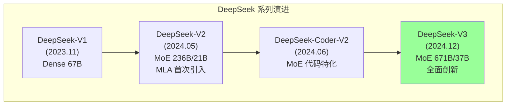

### 1.2 DeepSeek-V3 的定位

| 维度 | GPT-4o | Claude 3.5 Sonnet | LLaMA 3.1 405B | DeepSeek-V3 |
|------|:------:|:----------------:|:-------------:|:-----------:|
| **架构** | Dense (推测) | Dense (推测) | Dense | MoE |
| **参数量** | 未公开 | 未公开 | 405B | 671B (37B active) |
| **训练成本** | ~$100M+ | ~$50M+ | ~$30M+ | **$5.6M** |
| **开源** | 否 | 否 | 权重开放 | **MIT 开源** |
| **MMLU** | 88.7 | 88.7 | 87.3 | **88.5** |
| **HumanEval** | 90.2 | 92.0 | 89.0 | **82.6** |

### 1.3 为什么 DeepSeek-V3 如此重要？

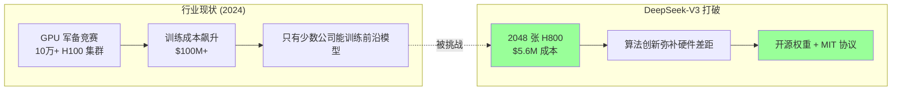

---

## 2. 架构设计：671B MoE 的创新

### 2.1 整体架构概览

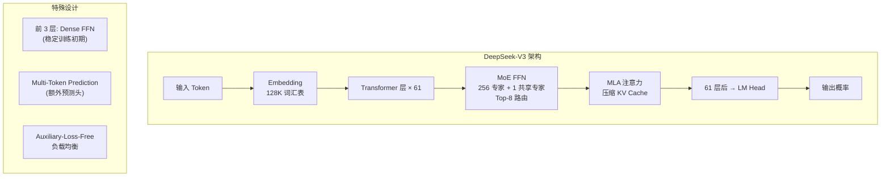

### 2.2 关键架构参数

| 参数 | 值 | 说明 |
|------|:---:|------|
| **总参数量** | 671B | 所有专家参数总和 |
| **活跃参数量** | 37B | 每次前向传播激活的参数 |
| **总层数** | 61 | Transformer 层数 |
| **隐藏维度** | 7168 | 模型隐藏状态维度 |
| **注意力头数** | 128 | 每个查询的注意力头 |
| **KV 头数** | 128 | KV 头数 (非 GQA) |
| **FFN 中间维度** | 2048 (每个专家) | 专家内部维度 |
| **专家总数** | 256 + 1 | 256 路由专家 + 1 共享专家 |
| **Top-K** | 8 | 每次选择 8 个专家 |
| **词汇表大小** | 128K | Byte-level BPE |
| **最大序列长度** | 128K tokens | 支持超长上下文 |

### 2.3 MoE 路由机制详解

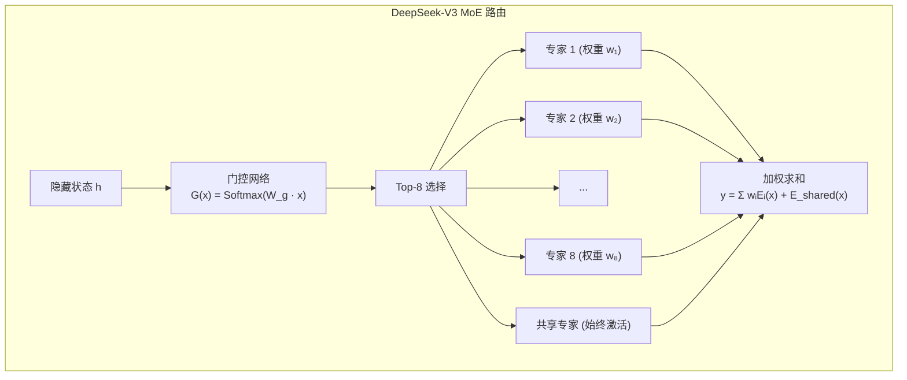

### 2.4 Auxiliary-Loss-Free 负载均衡

这是 DeepSeek-V3 最重要的创新之一。传统的 MoE 使用 auxiliary loss 来促进专家负载均衡，但这会干扰主任务的学习。

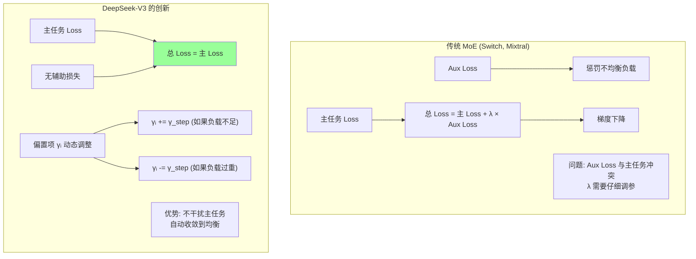

**具体机制**:

每个专家的路由分数变为：

$$s_i(x) = G(x)_i + \gamma_i$$

其中 $\gamma_i$ 是**无梯度的偏置项**，根据负载情况动态调整：
- 如果专家 $i$ 被选中次数少于目标 → $\gamma_i$ 增加
- 如果专家 $i$ 被选中次数多于目标 → $\gamma_i$ 减少
- 调整步长 $\gamma_{step}$ 随训练逐渐减小

**效果对比**:

| 方法 | 训练稳定性 | 主任务干扰 | 负载均匀度 | 调参难度 |
|------|:---------:|:---------:|:---------:|:-------:|
| Aux Loss (Switch) | 中 | 高 | 好 | 高 (λ) |
| 噪声 Top-K (GShard) | 中 | 低 | 一般 | 中 |
| **Aux-Loss-Free (V3)** | **高** | **零** | **好** | **低** |

---

## 3. Multi-head Latent Attention (MLA)

### 3.1 MLA 核心思想

MLA 是 DeepSeek-V2 引入并在 V3 中进一步优化的注意力机制，核心思想是用**低秩压缩**替代传统 KV Cache：

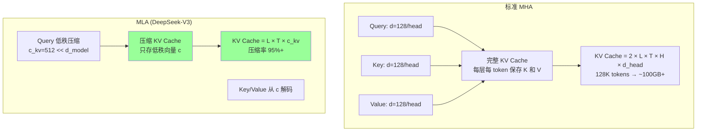

### 3.2 MLA 技术细节

**压缩过程**:

$$c_{kv} = W_{DKV} h, \quad c_{kv} \in \mathbb{R}^{d_{c_{kv}}}$$

其中 $d_{c_{kv}} = 512$，远小于 $d_{model} = 7168$。

**解码过程**:

$$K = W_{UK} c_{kv}, \quad V = W_{UV} c_{kv}$$

**查询压缩** (同样使用低秩):

$$c_q = W_{DQ} h, \quad c_q \in \mathbb{R}^{d_{c_q}}$$

$$Q = W_{UQ} c_q$$

### 3.3 MLA vs 其他注意力机制

| 特性 | MHA | GQA | MQA | **MLA (V3)** |
|------|:---:|:---:|:---:|:----------:|
| **KV Cache 大小** | 100% | 12.5% (8 KV heads) | 3.1% (1 KV head) | **~5%** |
| **模型性能** | 最佳 | 接近 MHA | 有损失 | **接近 MHA** |
| **推理吞吐** | 低 | 中 | 高 | **高** |
| **训练效率** | 标准 | 标准 | 标准 | **标准** |
| **实现复杂度** | 低 | 低 | 低 | 中 |

### 3.4 MLA + 无辅助损失优化

MLA 在 V3 中还引入了 **FP8 兼容的 MLA 实现**：
- 将 MLA 的投影矩阵分解为更小的块
- 使用 FP8 计算注意力时保持数值稳定性
- 通过重计算策略减少显存占用

---

## 4. Multi-Token Prediction (MTP)

### 4.1 MTP 核心思想

传统 Transformer 只预测下一个 token。DeepSeek-V3 使用额外的预测头**同时预测未来多个 token**：

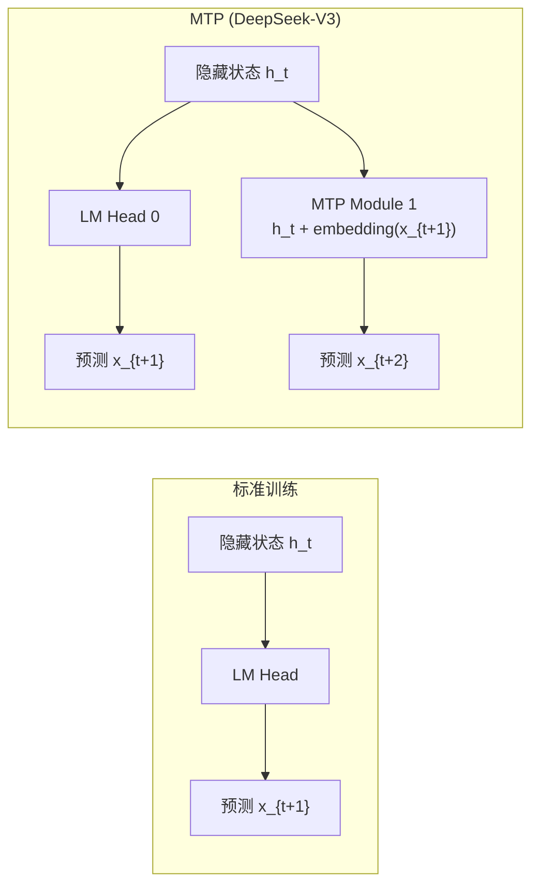

### 4.2 MTP 训练细节

- 使用**顺序预测**而非独立预测：第 k 个预测头接收前 k-1 个预测的信息
- 额外模块使用线性层 + ReLU 将当前隐藏状态与目标 token 的 embedding 融合
- MTP 损失权重设为 1.0（与主损失等权）
- **推理时丢弃 MTP 模块**，不增加推理成本

### 4.3 MTP 的效果

| 方面 | 无 MTP | 有 MTP | 提升 |
|------|:-----:|:-----:|:---:|
| 训练收敛速度 | 基准 | 快 ~20% | 减少训练时间 |
| 最终 Loss | 基准 | 低 0.02-0.05 | 微小但稳定 |
| 推理速度 | 基准 | 相同 (丢弃 MTP) | 无开销 |
| 推测解码 (Speculative Decoding) | 不支持 | 可作为草稿模型 | 推理加速 2-3× |

---

## 5. 训练：14.8T Tokens, $5.6M

### 5.1 训练数据

DeepSeek-V3 的训练数据量达到 **14.8T tokens**，是 DeepSeek-V2 (8.1T) 的 1.8 倍：

| 数据类别 | 占比 | Tokens | 说明 |
|---------|:----:|:------:|------|
| Common Crawl | ~40% | ~5.9T | 清洗后的网页数据 |
| 书籍 | ~10% | ~1.5T | 多语言书籍 |
| 代码 (GitHub) | ~12% | ~1.8T | 高质量代码 |
| 学术论文 | ~5% | ~0.7T | arXiv 等 |
| 维基百科 | ~5% | ~0.7T | 多语言维基 |
| 数学数据 | ~8% | ~1.2T | 数学推理数据 |
| 其他专业数据 | ~20% | ~3.0T | 法律、医疗、金融等 |

### 5.2 训练基础设施

| 资源 | 规格 | 说明 |
|------|------|------|
| **GPU 数量** | 2048 张 NVIDIA H800 | 国产替代版 (非 H100) |
| **互联** | NVLink + InfiniBand | 节点内 NVLink, 节点间 IB |
| **训练时间** | 2.788M GPU-hours | 约 57 天 |
| **总计算量** | ~14.8 × 10^24 FLOPs | 含 MoE 稀疏计算 |
| **训练成本** | **$5.576M** | 含 GPU 租用 + 电力 |
| **存储** | 数百 TB | 训练数据 + 检查点 |

### 5.3 成本对比

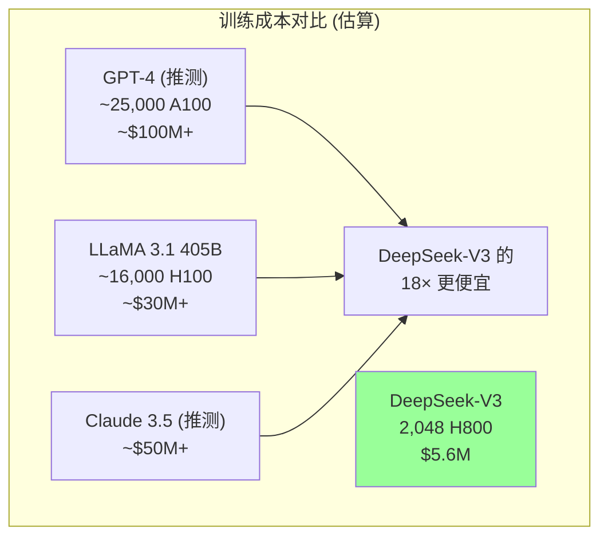

| 模型 | GPU 数量 | GPU 类型 | 训练成本 | 相对 V3 |
|------|:-------:|:-------:|:-------:|:------:|
| GPT-4 (推测) | ~25,000 | A100 | ~$100M+ | ~18× |
| LLaMA 3.1 405B | ~16,000 | H100 | ~$30M+ | ~5.4× |
| Claude 3.5 (推测) | ~10,000 | H100 | ~$50M+ | ~9× |
| **DeepSeek-V3** | **2,048** | **H800** | **$5.6M** | **1×** |

### 5.4 三阶段训练流程

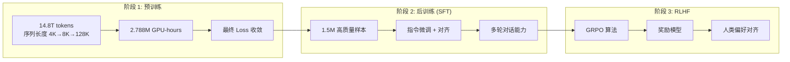

### 5.5 FP8 混合精度训练

DeepSeek-V3 是首个在**前沿模型**规模上成功使用 FP8 训练的系统：

| 计算部分 | 精度 | 说明 |
|---------|------|------|
| **线性层前向/反向** | FP8 (E4M3/E5M2) | 主要计算量，节省 50% 显存 |
| **注意力计算** | BF16 | 保持数值稳定性 |
| **嵌入层** | BF16 | 敏感操作保持高精度 |
| **LayerNorm** | BF16 | 归一化操作保持精度 |
| **梯度累加** | FP32 | 累加器使用高精度 |
| **主权重** | FP32 | 权重更新使用高精度 |

**FP8 带来的收益**:

| 指标 | BF16 | FP8 混合 | 提升 |
|------|:----:|:--------:|:---:|
| 显存占用 | 100% | ~60% | -40% |
| 训练速度 | 基准 | ~1.5× | +50% |
| 最终 Loss | 基准 | 相同 (±0.001) | 无损失 |
| 成本 | $9.3M | **$5.6M** | **-40%** |

---

## 6. 性能评估

### 6.1 通用基准测试

| Benchmark | GPT-4o | Claude 3.5 Sonnet | LLaMA 3.1 405B | DeepSeek-V3 |
|-----------|:------:|:----------------:|:-------------:|:-----------:|
| **MMLU** | 88.7 | 88.7 | 87.3 | **88.5** |
| **MMLU-Redux** | 88.0 | 88.3 | 85.1 | **89.0** |
| **GPQA** | 49.9 | 65.0 | 51.1 | **59.1** |
| **DROP** (F1) | 83.7 | 88.3 | 88.7 | **91.6** |
| **IFEval** (Strict) | 72.6 | 85.2 | 82.0 | **86.1** |
| **FRAMES** | 66.0 | 69.2 | 61.0 | **73.3** |
| **LongBench v2** | 52.3 | 53.6 | 48.7 | **48.7** |

### 6.2 代码能力

| Benchmark | GPT-4o | Claude 3.5 Sonnet | LLaMA 3.1 405B | DeepSeek-V3 |
|-----------|:------:|:----------------:|:-------------:|:-----------:|
| **HumanEval** | 90.2 | 92.0 | 89.0 | 82.6 |
| **MBPP** | 84.2 | 88.4 | 82.6 | **87.2** |
| **LiveCodeBench** | 40.6 | 52.5 | 27.6 | **42.8** |
| **Aider** | 75.9 | 79.7 | 30.6 | **72.0** |

### 6.3 数学能力

| Benchmark | GPT-4o | Claude 3.5 Sonnet | LLaMA 3.1 405B | DeepSeek-V3 |
|-----------|:------:|:----------------:|:-------------:|:-----------:|
| **GSM8K** | 94.8 | 96.4 | 96.8 | **93.6** |
| **MATH** | 74.6 | 78.3 | 73.8 | **90.2** |
| **AIME 2024** | 9.3 | 16.0 | 6.0 | **39.2** |
| **CNMO 2024** | 10.8 | 13.1 | 8.5 | **43.2** |

> **突出亮点**: 在 AIME 2024 上，DeepSeek-V3 以 39.2% 大幅领先 GPT-4o 的 9.3% 和 Claude 3.5 的 16.0%。

### 6.4 中文能力

| Benchmark | GPT-4o | Qwen 2.5 72B | DeepSeek-V3 |
|-----------|:------:|:-----------:|:-----------:|
| **CMMLU** | 78.2 | 85.6 | **88.3** |
| **CMMLU (STEM)** | 74.5 | 82.1 | **86.7** |
| **C-Eval** | 76.8 | 84.2 | **87.1** |
| **SuperCLUE** | 68.4 | 75.3 | **80.2** |

---

## 7. 推理部署

### 7.1 推理优化

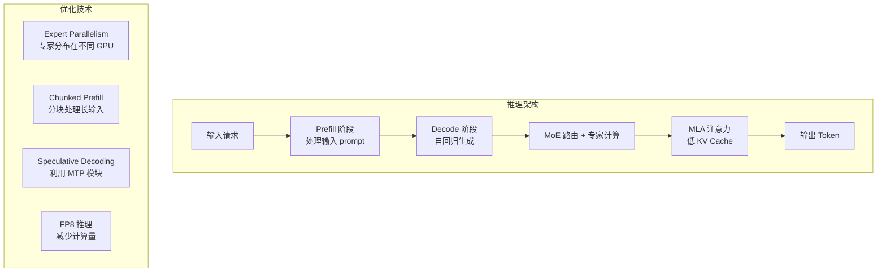

### 7.2 推理性能对比

| 指标 | LLaMA 3.1 405B | DeepSeek-V3 | 说明 |
|------|:-------------:|:-----------:|------|
| **总参数** | 405B | 671B | V3 更大 |
| **活跃参数** | 405B | 37B | V3 仅 9% 活跃 |
| **KV Cache/Token** | ~1GB | **~50MB** | MLA 压缩 95% |
| **推理 FLOPs/Token** | ~810T | **~74T** | V3 约 1/11 |
| **生成速度 (tokens/s)** | ~30 | **~60+** | V3 约 2× |

### 7.3 部署架构

| 组件 | 规格 | 功能 |
|------|------|------|
| **Prefill 节点** | 4× H800 | 处理输入 prompt |
| **Decode 节点** | 4× H800 | 自回归生成 |
| **Expert 分布** | 每 GPU ~8 专家 | Expert Parallelism |
| **通信** | NVLink (节点内) | 专家 All-to-All 通信 |
| **负载均衡** | 动态路由 | 根据请求量调整 |

---

## 8. 与 V2 的关键改进

### 8.1 V2 → V3 改进总结

| 维度 | DeepSeek-V2 | DeepSeek-V3 | 改进 |
|------|:----------:|:----------:|------|
| **总参数** | 236B | 671B | 2.8× |
| **活跃参数** | 21B | 37B | 1.8× |
| **专家数** | 160 | 256 + 1 | +60% + 共享专家 |
| **Top-K** | 6 | 8 | +33% |
| **训练数据** | 8.1T | 14.8T | 1.8× |
| **MLA 压缩维度** | 256 | 512 | 2× (更高表达力) |
| **负载均衡** | Aux Loss | Aux-Loss-Free | 消除干扰 |
| **MTP** | 无 | 有 | 新特性 |
| **训练精度** | BF16 | FP8 混合 | 节省 40% |
| **序列长度** | 128K | 128K | 持平 |
| **训练成本** | ~$6.3M | $5.6M | 更低 (更大模型) |

### 8.2 架构演进图

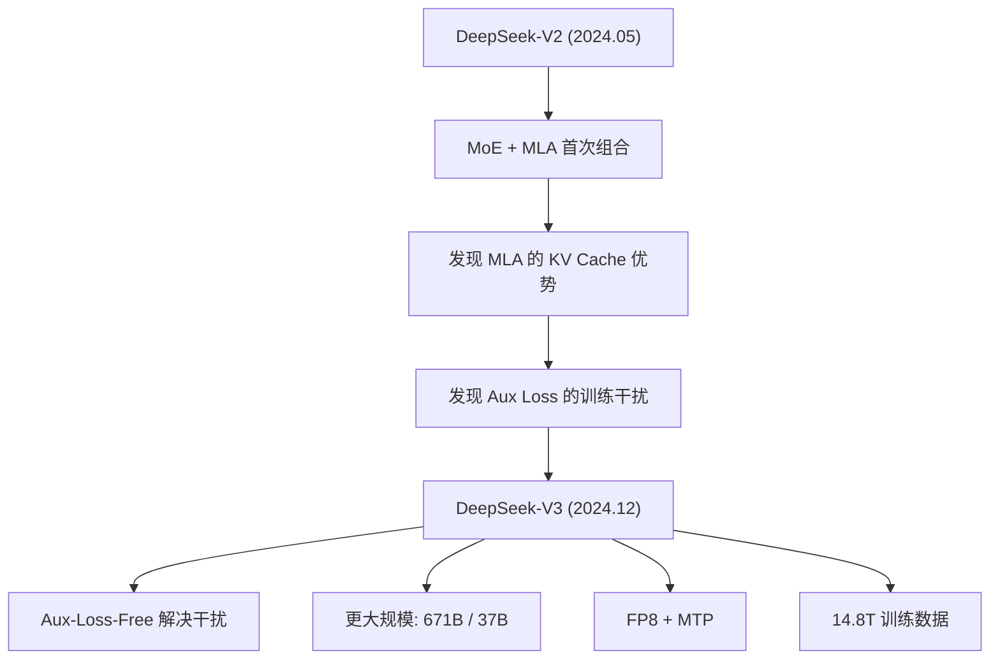

---

## 9. 开源贡献与生态影响

### 9.1 开源策略

| 维度 | 详情 |
|------|------|
| **模型权重** | MIT License, HuggingFace 开放下载 |
| **技术报告** | 完整公开训练细节 |
| **推理框架** | 开放 vLLM/SGLang 适配 |
| **蒸馏模型** | DeepSeek-R1 蒸馏版 (1.5B-70B) |
| **API 服务** | 低价 API 供开发者使用 |

### 9.2 对行业的影响

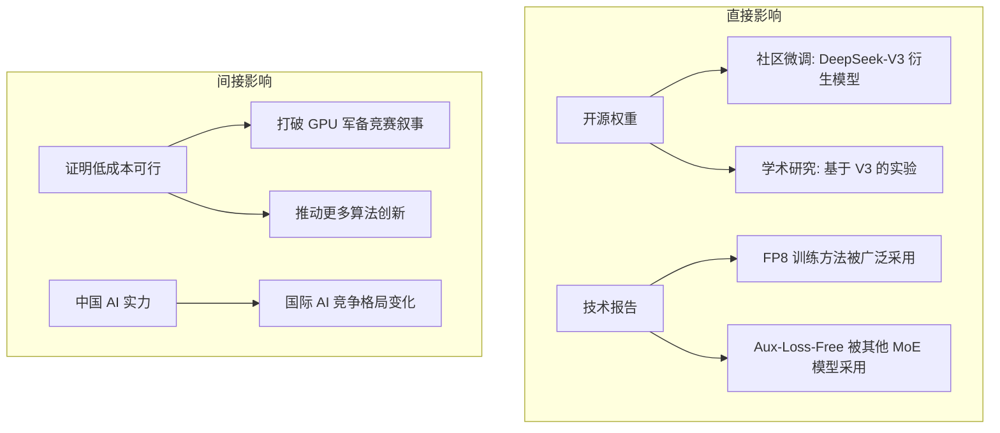

### 9.3 与其他开源模型对比

| 模型 | 参数量 | 训练成本 | 性能 | 开源协议 |
|------|:------:|:-------:|:----:|:-------:|
| LLaMA 3.1 405B | 405B (Dense) | ~$30M | 高 | LLaMA License |
| Qwen 2.5 72B | 72B (Dense) | ~$5M | 中高 | Qwen License |
| Mistral Large 2 | 123B (MoE) | ~$10M | 高 | Apache 2.0 |
| **DeepSeek-V3** | **671B/37B** | **$5.6M** | **高** | **MIT** |

---

## 10. 关键技术深入分析

### 10.1 数据并行与专家并行

DeepSeek-V3 使用了混合并行策略：

| 并行方式 | 使用场景 | 配置 |
|---------|---------|------|
| **数据并行 (DP)** | 同一数据分片 | 节点级 |
| **张量并行 (TP)** | 矩阵分片 | 节点内, TP=4 |
| **专家并行 (EP)** | MoE 专家分布 | 跨节点, EP=256 |
| **流水线并行 (PP)** | 层分布 | 未使用 (单流水线) |

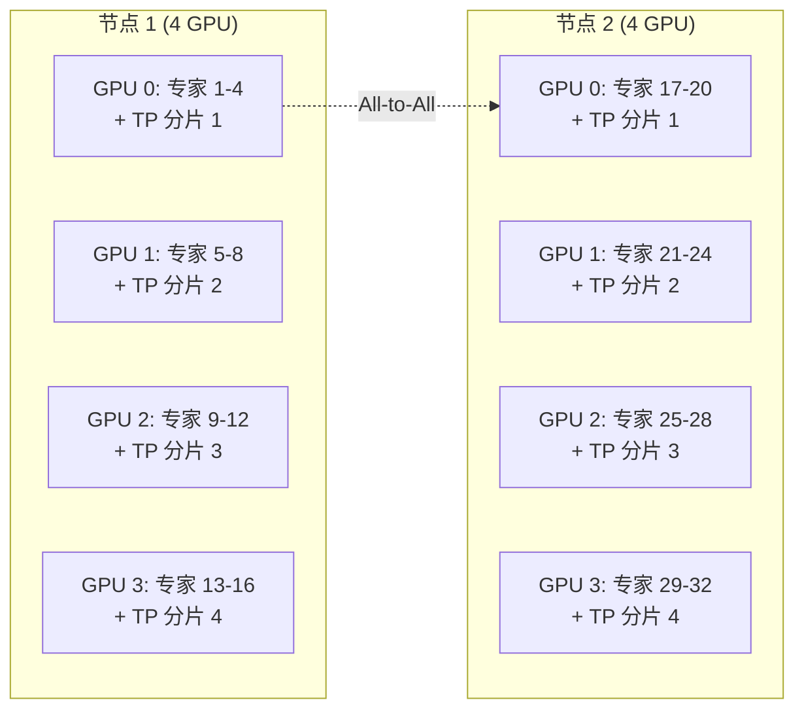

### 10.2 通信优化

| 通信类型 | 优化方法 | 效果 |
|---------|---------|------|
| **All-to-All (MoE)** | 计算-通信重叠 | 减少 60% 通信等待 |
| **梯度同步** | 分桶异步通信 | 隐藏延迟 |
| **MLA 注意力** | Ring Attention 优化 | 减少跨节点通信 |

### 10.3 训练稳定性

在 2048 张 GPU 上训练 671B 参数的模型面临严峻的稳定性挑战：

| 挑战 | 解决方案 |
|------|---------|
| **梯度爆炸** | 梯度裁剪 (max norm = 1.0) + FP32 累加器 |
| **专家负载不均** | Aux-Loss-Free 动态偏置 |
| **FP8 精度损失** | 选择性 FP8 + BF16 敏感操作 |
| **检查点恢复** | 每 1000 步保存 + 异步保存 |
| **NaN/Inf 检测** | 实时监控 + 自动回滚 |

---

## 11. 与其他论文的关系

### 11.1 引用关系

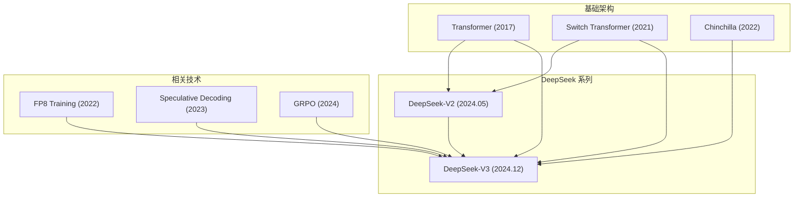

### 11.2 交叉引用

| 相关文档 | 关系 | 详见 |
|---------|------|------|
| DeepSeek 深度解读 | 完整 DeepSeek 生态分析 | [../05_大模型/15_中国LLM生态/08_深度Seek_深入分析.md](05_大模型/15_中国LLM生态/08_深度Seek_深入分析.md) |
| MoE 深度解读 | MoE 架构系统分析 | [06_混合专家_深入分析.md](20_论文精读/02_模型架构/06_混合专家_深入分析.md) |
| Chinchilla 深度解读 | Scaling Laws 基础 | [01_Chinchilla_深入分析.md](20_论文精读/03_规模扩展/01_Chinchilla_深入分析.md) |
| Scaling Laws 深度解读 | Kaplan 原始工作 | [05_扩展定律_深入分析.md](20_论文精读/03_规模扩展/05_扩展定律_深入分析.md) |
| LLaMA 深度解读 | 开源 LLM 对比 | [04_LLaMA_深入分析.md](20_论文精读/02_模型架构/04_LLaMA_深入分析.md) |

---

## 12. 总结

### 12.1 五大核心创新

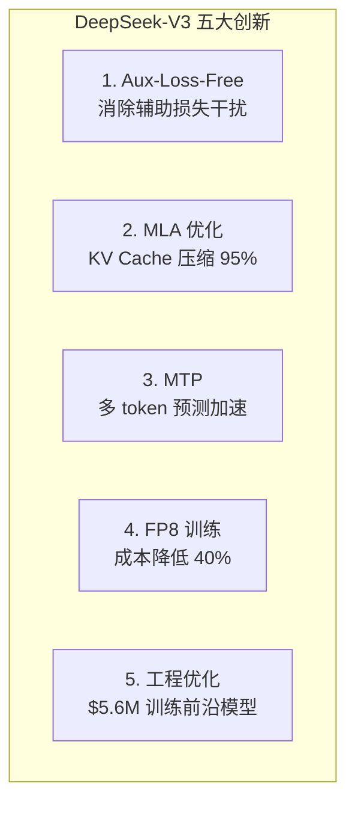

### 12.2 一句话总结

> **DeepSeek-V3 证明了：在 AI 领域，"聪明"比"有钱"更重要——通过算法创新和工程优化，用 1/18 的成本达到了前沿模型的性能。**

### 12.3 给实践者的启示

| 启示 | 说明 |
|------|------|
| MoE 是未来 | 稀疏激活让大模型变得可行 |
| MLA 值得采用 | KV Cache 压缩对长上下文至关重要 |
| FP8 已经成熟 | 前沿模型级别的 FP8 训练已经可行 |
| Aux-Loss-Free 更好 | 简化训练，消除超参数调优 |
| 成本可以降低 10× | 算法创新 > GPU 数量 |

---

## 参考资料

1. DeepSeek-AI. "DeepSeek-V3 Technical Report." arXiv:2412.19437, 2024.
2. DeepSeek-AI. "DeepSeek-V2 Technical Report." arXiv:2405.04434, 2024.
3. Fedus, W. et al. "Switch Transformers." JMLR, 2022.
4. Hoffmann, J. et al. "Training Compute-Optimal Large Language Models." NeurIPS, 2022.
5. Liu, A. et al. "DeepSeek-VL: Towards Real-World Vision-Language Understanding." 2024.

---

*Last updated: 2026-06-12*

## Related

- [[20_论文精读/README|22 经典与必读 AI 论文清单 (Essential AI Papers)]]
