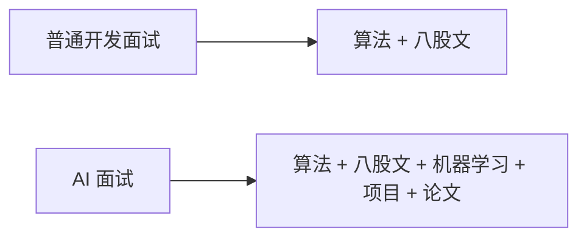
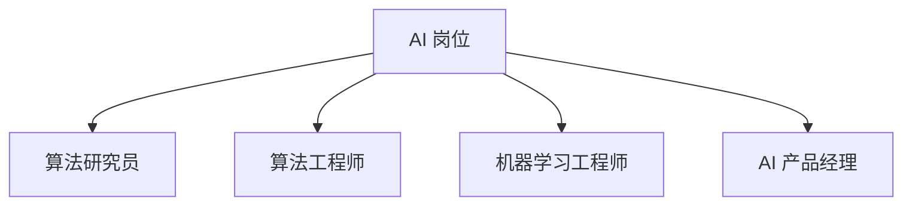
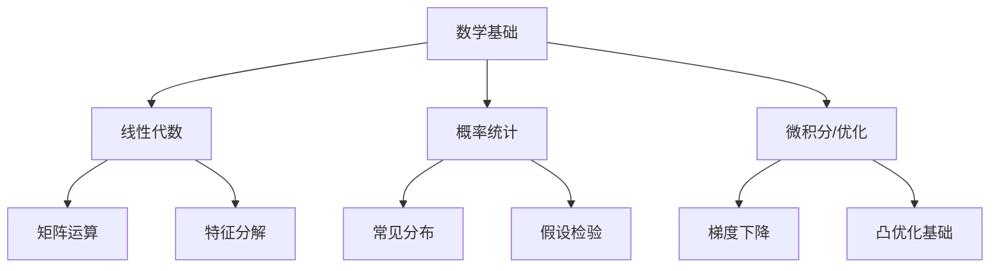
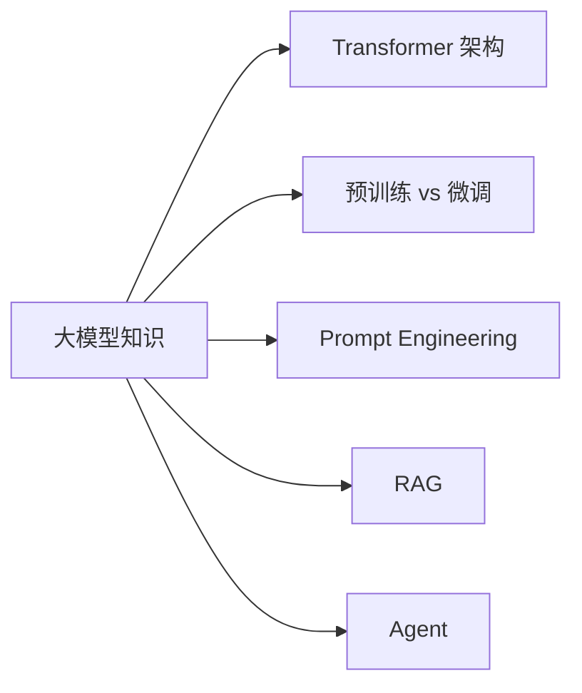
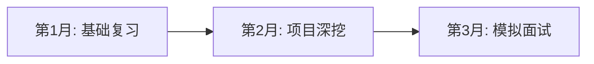
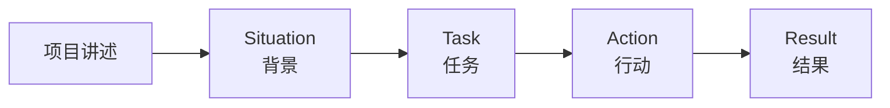

# AI 面试准备 - 小白版

> **一句话理解**: AI 面试就像参加一场综合运动会——不仅要跑得快（算法题），还要投得准（项目经验）、讲得好（沟通表达）、站得稳（基础知识）。

---

## 🤔 为什么要专门准备 AI 面试？

AI 岗位面试和普通程序员面试不一样：



**多了什么？**
- 🧮 数学基础（线性代数、概率统计）
- 🤖 机器学习原理（不是调包，要懂为什么）
- 📊 项目深度（数据怎么处理、模型怎么选型）
- 🔬 前沿了解（大模型、Agent 等最新进展）

---

## 🎯 按岗位类型准备

### 四大 AI 岗位类型



### 1. 🔬 算法研究员 (Research Scientist)

**工作内容**：发论文、探索新技术、提升模型能力

| 考察重点 | 权重 | 准备方法 |
|----------|------|----------|
| 论文阅读 | ⭐⭐⭐⭐⭐ | 精读 5-10 篇经典论文 |
| 数学推导 | ⭐⭐⭐⭐⭐ | 手推注意力机制、反向传播 |
| 编程能力 | ⭐⭐⭐ | LeetCode 中等难度 |
| 研究经历 | ⭐⭐⭐⭐⭐ | 有顶会论文最佳 |

**高频问题**：
```
- Transformer 的 Q/K/V 是什么？手推注意力公式
- 讲一篇你读过的最新论文
- BatchNorm 和 LayerNorm 的区别与适用场景
- 你做过什么原创性研究？
```

---

### 2. ⚙️ 算法工程师 (Algorithm Engineer)

**工作内容**：把论文落地、优化模型、解决业务问题

| 考察重点 | 权重 | 准备方法 |
|----------|------|----------|
| 项目经验 | ⭐⭐⭐⭐⭐ | 准备 2-3 个完整项目 |
| 模型理解 | ⭐⭐⭐⭐⭐ | 懂原理、会调参、知优劣 |
| 编程能力 | ⭐⭐⭐⭐ | LeetCode 中等偏上 |
| 业务思维 | ⭐⭐⭐⭐ | 技术如何创造价值 |

**高频问题**：
```
- 讲一个你最有成就感的项目，数据、模型、结果
- 过拟合了怎么办？列举至少 5 种方法
- 为什么选择 X 模型而不是 Y 模型？
- 如果模型上线后效果下降，怎么排查？
```

---

### 3. 🛠️ 机器学习工程师 (ML Engineer)

**工作内容**：搭训练 pipeline、部署模型、工程化

| 考察重点 | 权重 | 准备方法 |
|----------|------|----------|
| 工程能力 | ⭐⭐⭐⭐⭐ | Docker、K8s、CI/CD |
| 模型部署 | ⭐⭐⭐⭐⭐ | 了解 TensorRT、ONNX、vLLM |
| 系统设计 | ⭐⭐⭐⭐ | 设计推荐系统、搜索系统 |
| 编程能力 | ⭐⭐⭐⭐⭐ | LeetCode 中等偏上 |

**高频问题**：
```
- 设计一个日活百万的推荐系统
- 模型训练和推理分别怎么优化性能？
- 如何处理训练数据和线上数据不一致？
- 模型版本管理和回滚策略
```

---

### 4. 📱 AI 产品经理 (AI PM)

**工作内容**：定义 AI 产品、协调技术资源、推进落地

| 考察重点 | 权重 | 准备方法 |
|----------|------|----------|
| AI 理解 | ⭐⭐⭐⭐ | 知道什么能做、什么不能做 |
| 产品思维 | ⭐⭐⭐⭐⭐ | 用户痛点、价值主张 |
| 数据分析 | ⭐⭐⭐⭐ | 会用数据论证决策 |
| 沟通协调 | ⭐⭐⭐⭐⭐ | 与技术团队高效沟通 |

**高频问题**：
```
- 设计一个 AI 客服产品，怎么做？
- AI 产品的核心指标有哪些？
- 技术说做不了，你怎么判断是真的做不了还是在推诿？
- 讲一个你推动 AI 功能上线的完整过程
```

---

## 📚 核心知识准备清单

### 数学基础（所有岗位都需要）



| 领域 | 必须掌握 | 面试频率 |
|------|----------|----------|
| 线性代数 | 矩阵乘法、特征值、SVD | ⭐⭐⭐⭐ |
| 概率统计 | 条件概率、贝叶斯、常见分布 | ⭐⭐⭐⭐⭐ |
| 微积分 | 导数、链式法则、梯度 | ⭐⭐⭐⭐ |

### 机器学习核心

| 主题 | 重点内容 |
|------|----------|
| **监督学习** | 线性回归、逻辑回归、SVM、决策树、集成学习 |
| **无监督学习** | K-means、PCA、聚类评估 |
| **深度学习** | CNN、RNN、Transformer、训练技巧 |
| **评估指标** | 准确率、精确率、召回率、F1、AUC、混淆矩阵 |
| **优化算法** | SGD、Adam、学习率调度、正则化 |

### 大模型时代新增考点



| 考点 | 掌握程度 |
|------|----------|
| Transformer 自注意力 | 能手推公式 |
| 预训练/微调/SFT/RLHF | 知道流程和区别 |
| Prompt Engineering | 能写复杂 prompt |
| RAG 架构 | 能画流程图 |
| Agent 概念 | 知道 ReAct、Tool Use |

---

## 🗺️ 推荐学习路径

### 时间规划（假设 2-3 个月准备）



| 阶段 | 时间 | 任务 | 每日投入 |
|------|------|------|----------|
| **基础复习** | 4 周 | 数学 + ML 基础 + LeetCode | 3-4 小时 |
| **项目深挖** | 3 周 | 整理项目、准备故事、补前沿 | 3-4 小时 |
| **模拟面试** | 2 周 |  mock interview、查漏补缺 | 2-3 小时 |

### 每日学习计划（参考）

```
上午 (2h):
  - 1h: LeetCode 2-3 题
  - 1h: 机器学习/深度学习复习

下午/晚上 (2h):
  - 1h: 项目整理/论文阅读
  - 1h: 模拟面试/八股文背诵

碎片时间:
  - 看 AI 新闻、公众号、推特
```

---

## 🎤 面试技巧

### STAR 法则讲项目



| 环节 | 说什么 | 示例 |
|------|--------|------|
| **Situation** | 项目背景、团队、你的角色 | "在 XX 公司，负责推荐系统优化" |
| **Task** | 要解决什么问题 | "点击率下降 15%，需要提升推荐质量" |
| **Action** | 你做了什么（重点！） | "我分析数据发现是冷启动问题，于是设计了..." |
| **Result** | 量化结果 | "点击率提升 23%，留存提升 8%" |

### 遇到不会的问题怎么办？

```
❌ 不要:
- 瞎编乱造
- 直接说"不知道"然后沉默
- 转移话题不回答

✅ 要:
- "这个问题我没深入研究过，但我可以从 XX 角度思考..."
- "我了解相关的 YY，它们可能有相似之处..."
- "这确实是我的知识盲区，面试后我会去学习"
```

---

## ❓ 小白常见问题

### Q1: 没有 AI 项目经验怎么办？

**A**: 自己造！

```
快速积累项目的方法:
1. Kaggle 入门赛 —— Titanic、房价预测
2. 复现经典论文 —— 从简单的 ResNet 开始
3. 做一个小工具 —— 情感分析网页、图片分类 App
4. 写技术博客 —— 记录学习过程也是项目

重点不是项目多宏大，
而是你能讲清楚: 
为什么做、遇到什么困难、怎么解决的、结果如何
```

### Q2: 数学不好能搞 AI 吗？

**A**: 看岗位！

| 岗位 | 数学要求 | 建议 |
|------|----------|------|
| 研究员 | 很高 | 需要系统补数学 |
| 算法工程师 | 中高 | 掌握基础即可 |
| ML 工程师 | 中等 | 懂原理公式就行 |
| AI PM | 较低 | 知道概念和限制 |

```
最低要求:
- 知道矩阵乘法是干嘛的
- 理解概率和条件概率
- 知道梯度下降在做什么
- 能看懂论文里的公式
```

### Q3: 大模型时代，传统 ML 知识还要学吗？

**A**: **必须要！**

```
原因:
1. 面试仍然考传统 ML（决策树、SVM 等）
2. 大模型不是万能的，很多场景用小模型更划算
3. 理解传统 ML 有助于理解深度学习
4. 特征工程、评估方法等知识永不过时

学习优先级:
🥇 深度学习 + Transformer
🥈 传统 ML 核心概念
🥉 大模型应用层（RAG、Agent）
```

### Q4: 面试前要不要刷完所有 LeetCode？

**A**: 不需要！抓重点：

```
AI 岗位 LeetCode 重点:
- 数组/字符串操作
- 哈希表应用
- 二分查找
- 二叉树/BFS/DFS
- 动态规划（中等难度）
- 滑动窗口

不需要:
- 困难的 DP
- 复杂的图算法
- 竞赛题

目标: 中等难度 10 分钟内有思路
```

### Q5: 怎么判断一家公司的 AI 团队靠不靠谱？

**A**: 面试是双向的，你可以反问：

```
好信号 ✅:
- 有明确的数据积累
- 技术负责人愿意聊细节
- 有成功的 AI 落地案例
- 团队有工程+算法的配合

危险信号 ❌:
- "我们数据很多，但还没整理"
- "就缺一个算法专家来变现"
- 对 AI 能力有不切实际的期望
- 没有标注预算和算力预算
```

---

## 🔗 推荐资源

- [面试问题库](Data_Engineer/question_bank.md) —— 按岗位分类的问题
- [面试答案参考](Data_Engineer/interview_answers.md) —— 参考回答模板
- [AI 基础 - 小白版](../01_Fundamentals/README_for_dummy.md) —— 补基础知识
- [模型训练速成指南](../07_Model_Training/Model-Training-in-nutshell.md) —— 训练原理
- [模型评估 - 小白版](../08_Model_Evaluation/Model_Evaluation_for_dummy.md) —— 评估指标

---

*Last updated: 2026-05-07*

## Related

- [[21_Interviews/AI_Data_Analyst/company_level_question_bank]] — AI Data Analyst 按公司/级别区分的题库 (共享: career, experience, interviews, practitioners)
- [[21_Interviews/AI_Data_Analyst/interview_answers]] — AI Data Analyst 面试题实例答案 (共享: career, experience, interviews, practitioners)
- [[21_Interviews/AI_Data_Analyst/interview_preparing]] — AI Data Analyst 面试准备 (共享: career, experience, interviews, practitioners)
- [[21_Interviews/AI_Data_Analyst/question_bank]] — AI Data Analyst 题库 (共享: career, experience, interviews, practitioners)
