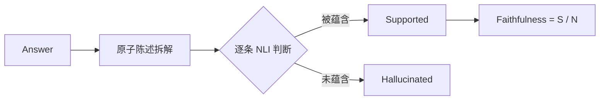
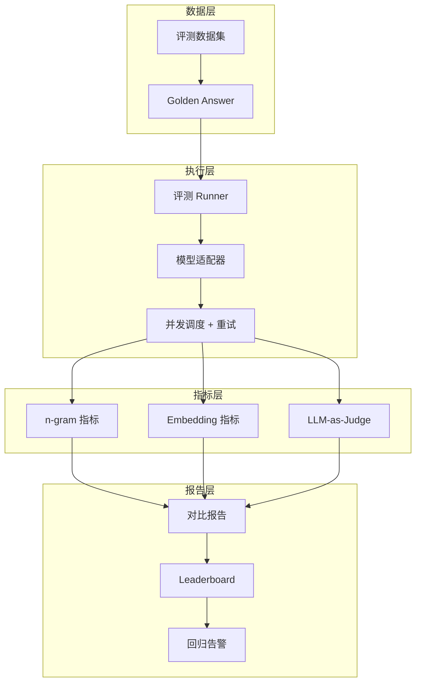

# AI Evaluation Engineer 面试题实例答案

> 每个答案采用 **结论 → 展开 → 代码/示例 → 追问预判** 结构，适合面试场景直接参考。

---

## 评测基础理论

### Q1: 为什么类别极不平衡时 AUC-ROC 会虚高？PR-AUC 在什么情况下更合适？

**结论**: AUC-ROC 的分母包含大量 TN（True Negative），当负样本极多（如 1:1000 的欺诈检测），TN 始终很大，导致 TPR 轻易接近 1 而 FPR 数值极小，曲线"看起来"很完美。PR-AUC 不含 TN，对少数类的预测质量更敏感。

**展开**:
- AUC-ROC = ROC 曲线下面积，横轴 FPR=FP/(FP+TN)，纵轴 TPR=TP/(TP+FN)
- 当负样本 10000 个，即使 FP=500，FPR 也只有 0.05，ROC 看起来仍很好
- PR 曲线横轴 Recall=TP/(TP+FN)，纵轴 Precision=TP/(TP+FP)，FP 的代价被直接体现
- **选择规则**: 正负比 < 1:10 时优先看 PR-AUC

**代码示例（不平衡场景下两者差异）**:
```python
from sklearn.metrics import roc_auc_score, average_precision_score
# y_true: 1000 样本，10 正例
# y_pred: 模型把 50 个负例误判为正，10 个正例全中
y_true = [1]*10 + [0]*990
y_pred = [0.9]*10 + [0.6]*50 + [0.1]*940  # 50 个负例得分偏高
print("AUC-ROC:", roc_auc_score(y_true, y_pred))        # ~0.97 看起来很好
print("PR-AUC :", average_precision_score(y_true, y_pred))  # ~0.17 暴露问题
```

**追问预判**: "如何在不平衡数据上做交叉验证？"
→ 用 Stratified K-Fold 保持每折类别比例；评估时配合 Precision-Recall 曲线选阈值。

---

### Q2: BLEU / ROUGE / BERTScore 的局限和适用场景？

**结论**: BLEU/ROUGE 基于 n-gram 匹配，适合翻译/摘要这类有参考答案的任务，但对语义等价表达无能为力；BERTScore 用 embedding 相似度，能捕捉同义改写，但对事实性错误不敏感。

**展开**:
| 指标 | 原理 | 优点 | 局限 |
|------|------|------|------|
| **BLEU** | n-gram 精确率 + brevity penalty | 翻译任务标准 | 不奖励召回，对词序敏感 |
| **ROUGE-N/L** | n-gram 召回 / 最长公共子序列 | 摘要任务标准 | 同义词无法匹配 |
| **BERTScore** | token embedding 余弦相似度 | 捕捉语义 | 无法检测事实错误 |
| **BLEURT** | 在 BERTScore 上微调质量回归 | 与人工相关性高 | 需要训练数据 |

**追问预判**: "评估开放式对话（如 ChatGPT）为什么这些指标都失效？"
→ 开放式对话没有唯一正确答案，参考答案多样性导致 n-gram 匹配失效，应转向 LLM-as-Judge 或人工偏好对比。

---

## LLM 评测方法论

### Q3: LLM-as-Judge 的 Position Bias 和 Verbosity Bias 如何消除？

**结论**: Position Bias 指 Judge 倾向于选择某个固定位置（常是第一个）的答案；Verbosity Bias 指 Judge 倾向更长的答案。消除方法是位置交换（swap）求平均 + 显式约束长度。

**展开**:
1. **Position Bias 消除**:
   - 对每对 (A, B) 跑两次：一次 A 在前，一次 B 在前
   - 只有两次结果一致才采纳，否则标记为 tie
2. **Verbosity Bias 消除**:
   - 在 Judge Prompt 中显式说明"长度不影响评分"
   - 或对答案做长度归一化后再比较
3. **Self-Enhancement Bias**: 同一模型评自己会偏高，需用不同模型做 Judge

**去除 Position Bias 的 Judge Prompt 设计示例**:
```
你是一个公正的评判者。请评估以下两个回答的质量。
评分维度: 准确性、完整性、清晰度（长度不影响评分）。

[回答A]: {answer_a}
[回答B]: {answer_b}

请输出 JSON: {"winner": "A"|"B"|"tie", "reason": "..."}
```
对同一问题再跑一次 A/B 交换版本，两次结论一致才定论。

**追问预判**: "LLM-as-Judge 和人工评测的相关性通常有多高？"
→ 在成对比较任务上 Spearman 相关性约 0.7-0.85，优于任何单一自动指标，但在专业领域（医疗/法律）需要领域专家校准。

---

### Q4: 如何设计评测数据集防止 Data Contamination？

**结论**: 训练数据泄露到评测集会让指标虚高，需要从"数据隔离、动态生成、私有托管"三个层面防御。

**展开**:
1. **数据隔离**:
   - 评测集严格保密，不在公开渠道发布完整版
   - 采用"私有 Leaderboard"机制（如 LMSYS 私有 split）
2. **动态生成**:
   - 用模板程序化生成题目（如数学题参数随机化）
   - LiveBench 每月更新，用最近新闻/论文题目避免被记住
3. **污染检测**:
   - 用 n-gram 重叠检测评测样本是否出现在预训练语料
   - 检查模型对"改写版本"的表现，若原版远好于改写版 → 已被记住

**污染检测代码示例**:
```python
def detect_contamination(eval_text, pretrain_ngrams, n=13):
    """检查 13-gram 是否出现在预训练语料"""
    tokens = eval_text.split()
    grams = set(tuple(tokens[i:i+n]) for i in range(len(tokens)-n+1))
    overlap = grams & pretrain_ngrams
    return len(overlap) / len(grams)  # >0.2 视为高风险污染
```

**追问预判**: "如果发现你的评测集被污染了，怎么办？"
→ 立即弃用污染样本，重新构建或动态生成替代题，并在评测报告中标注数据日期。

---

## RAG 与 Agent 评测

### Q5: RAGAS 的 Faithfulness 指标如何计算？

**结论**: Faithfulness 衡量"生成的答案是否都能由检索到的上下文支撑"，本质是检测幻觉。流程是：把答案拆成原子陈述 → 逐条判断是否被上下文蕴含 → 取被支撑的比例。

**展开**:
```
Faithfulness = (被上下文支撑的原子陈述数) / (答案中原子陈述总数)

步骤:
1. 用 LLM 把 answer 拆解为原子陈述（atomic claims）
   例: "巴黎是法国首都，人口 200 万" → ["巴黎是法国首都", "巴黎人口 200 万"]
2. 对每条原子陈述，用 LLM/NLI 模型判断 context 是否蕴含它
3. Faithfulness = 支撑数 / 总数
```

**Mermaid 流程图**:


**追问预判**: "Faithfulness 高但答案跑题（低 Answer Relevancy）怎么办？"
→ 两者要一起看，Faithfulness 管"不胡说"，Answer Relevancy 管"切题"，需要分别优化检索和生成。

---

### Q6: Agent 评测的特殊难点是什么？如何设计？

**结论**: Agent 涉及多步规划、工具调用、环境交互，评测难点在于：路径不唯一、状态依赖、环境非确定性、长尾工具失败。

**展开**:
1. **路径非唯一**: 同一目标有多种合法 action 序列，不能只比对精确路径
   - 方案：只评最终状态（end-state evaluation）或关键步骤（milestone-based）
2. **环境交互**: 需要可复现的沙箱环境（如 WebArena、SWE-bench 的 Docker 环境）
3. **指标设计**:
   - Success Rate: 完成任务的比例
   - Steps Efficiency: 实际步数 / 最优步数
   - Tool Accuracy: 正确调用工具的比例
   - Cost: Token / API 调用成本

**追问预判**: "如何评测一个会改代码的 Coding Agent？"
→ 用 SWE-bench 思路：给定 GitHub issue，agent 提交 PR，自动跑测试套件判断是否解决，避免主观评分。

---

## 评测工程实践

### Q7: 如何设计一个支持多模型多数据集的评测平台？

**答题框架**:

```
1. 数据层
   - 评测数据集管理（版本化、权限隔离、私有托管）
   - 标注答案存储（Golden Answer / 参考答案）

2. 执行层
   - 评测 Runner: 支持并发调用多模型，超时重试
   - 模型适配器: 统一 OpenAI / Anthropic / 开源模型的 API
   - 采样控制: temperature / top_p / n_samples 可配置

3. 指标层
   - 可插拔指标（内置 BLEU/ROUGE/BERTScore + 自定义 LLM-as-Judge）
   - 支持成对（pairwise）和单点（pointwise）两种模式

4. 报告层
   - 评测报告自动生成（对比基线、置信区间、细分维度）
   - Leaderboard 可视化 + 回归检测告警
```

**Mermaid 架构图**:


**追问预判**: "如何控制评测成本（LLM API 费用）？"
→ 缓存（prompt+模型 hash）、降采样（先粗筛后精评）、用便宜模型预筛后再用 GPT-4 做关键判断。

---

### Q8: 如何建立评测质量门禁（Quality Gate）？

**结论**: 质量门禁是发布前的硬性检查，核心是定义"不可接受的退化阈值"，结合核心指标 + 安全指标双维度。

**展开**:
| 门禁维度 | 指标 | 阈值示例 | 触发动作 |
|---------|------|---------|---------|
| **核心能力** | 核心数据集 F1 / Pass Rate | 较基线下降 >2% | 阻止发布 |
| **回归** | 回归测试集退化样本比例 | >5% 样本退化 | 人工复核 |
| **安全** | 红队越狱成功率 | 较基线上升 | 阻止发布 |
| **延迟** | P95 推理延迟 | >目标 SLA | 阻止发布 |
| **成本** | 平均 Token 消耗 | 较基线上升 >20% | 告警 |

**追问预判**: "如果核心指标持平但部分用户反馈变差，该不该发布？"
→ 下钻分析：检查是否某个细分维度（如长文本/多语言）退化，若是则针对性补数据或加门禁细分。

---

## 红队与对抗评测

### Q9: 如何系统化测试模型的越狱鲁棒性？

**结论**: 越狱测试应分层：已知攻击库回归 + 自动化红队生成 + 人工专家红队，覆盖角色扮演、编码混淆、多轮诱导等类型。

**展开**:
1. **已知攻击回归（静态）**: 维护越狱 Prompt 库（如 AdvBench、HarmBench），每次模型更新跑回归
2. **自动化红队（动态）**:
   - GCG: 基于梯度的后缀攻击（白盒）
   - PAIR: 用另一个 LLM 迭代优化攻击 prompt（黑盒）
   - 树搜索 + 变异：对成功越狱 prompt 做变异扩展
3. **人工红队（深度）**: 安全专家针对特定危害类别设计定向攻击
4. **评估指标**: Attack Success Rate（ASR），按危害等级加权

**追问预判**: "ASR 多低算可接受？"
→ 取决于危害严重性。低危（如不当言论）ASR <5% 可接受；高危（如生化武器指导）需 ASR <1% 甚至零容忍。

---

### Q10: 描述一次你设计的评测方案发现了模型严重缺陷（行为面试 STAR）

**答题框架**:
```
S: "在 XX 公司，新模型在公开 Leaderboard 上分数领先基线 5%，准备全量发布"

T: "我负责上线前的深度评测，特别是长文本和边界 case"

A:
  - 设计了 500 题的私有长文本推理测试集（未公开，避免污染）
  - 引入对抗性改写测试（把标准题改写成口语化/多轮形式）
  - 用 LLM-as-Judge + 人工抽检双轨验证

R:
  - 发现公开榜单高分来自短题，长文本（>8k token）推理 Pass Rate 实际下降 12%
  - 多轮对话中第 4 轮起指令遵循率从 90% 跌到 60%
  - 推动推迟发布，补充长文本训练数据后重新评测达标上线
  - 建立了"公开榜 + 私有集 + 对抗集"三层评测规范，纳入发布流程
```

---

*Last updated: 2026-07-23*

## Related

- [[21_面试岗位/AI_Evaluation_Engineer/question_bank|AI Evaluation Engineer 题库]]
- [[21_面试岗位/AI_Evaluation_Engineer/company_level_question_bank|AI Evaluation Engineer 按公司/级别区分的题库]]
- [[21_面试岗位/AI_Evaluation_Engineer/index|AI Evaluation Engineer 首页]]
- [[08_模型评估/index|模型评估]]
- [[09_测试/Agent_Evaluation_index|Agent 评测]]
- [[21_面试岗位/Interview_Guide/System_Design_for_AI|AI 系统设计面试]]
- [[21_面试岗位/jobs|AI 相关岗位与工种清单]]
