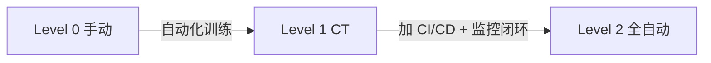
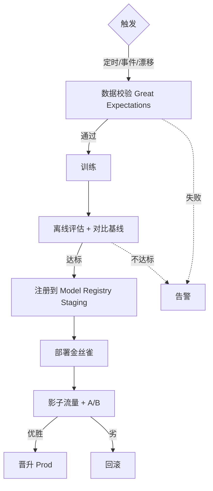
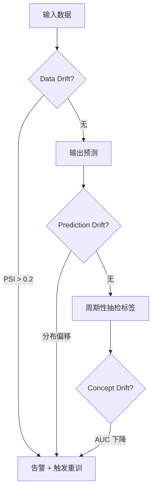

# MLOps Engineer 面试题实例答案

> 每个答案采用 **结论 → 展开 → 代码/架构 → 追问预判** 结构。

---

## MLOps 基础

### Q1: Google MLOps 成熟度 Level 0/1/2 的区别？如何升级？

**结论**: Level 0 是手动流水线（无自动化），Level 1 引入 CT（持续训练）自动化，Level 2 实现 CI/CD/CT 全自动化。升级的核心是逐步把人工环节自动化并加闭环。

**展开**:

**三个 Level**:
| Level | 特征 | 流水线 | 适用 |
|-------|------|--------|------|
| **0** | 全手动 | 训练→手动部署，无自动化 | 实验/小规模 |
| **1** | CT 自动化 | 训练流水线自动化，触发重训 | 中等规模生产 |
| **2** | CI/CD/CT 全自动 | 训练代码 CI → 流水线 CD → 持续训练 | 大规模多模型 |

**升级路径**:


**Level 2 完整闭环**:
```
1. CI: 代码 push → 单元测试 → 数据/模型测试 → 镜像构建
2. CD: 部署训练流水线 → 训练 → 评估 → 注册 → 服务
3. CT: 漂移触发/定时触发 → 自动重训
4. 监控: 在线指标 → 触发 CT/告警/回滚
```

**追问预判**: "不是所有模型都需要 Level 2，如何判断？"
→ 按"变更频率 × 业务重要性"分: 高频变更的核心模型（如推荐）值得 Level 2；低频稳定的模型（如年度风控）Level 1 够用；避免过度工程化。

---

### Q2: LLMOps 与传统 MLOps 的关键差异？

**结论**: LLM 引入了"非确定性输出、Prompt/微调双轨、Token 成本、评测困难"等新挑战，LLMOps 在传统 MLOps 基础上增加了 Prompt 管理、LLM 评测、成本治理。

**展开**:

**差异对比**:
| 维度 | 传统 MLOps | LLMOps |
|------|-----------|--------|
| **模型来源** | 自训练为主 | 多为预训练 + 微调/API |
| **"代码"** | 模型权重 | Prompt + 系统 + (微调权重) |
| **输出** | 确定性（分类/回归） | 非确定性（生成文本） |
| **评测** | 自动指标（AUC/F1） | LLM-as-Judge + 人工 |
| **成本** | 推理算力 | Token 费用（API） |
| **漂移** | 数据漂移 | + Prompt 漂移 + 行为漂移 |

**LLMOps 新增组件**:
```
1. Prompt 管理: 版本化、A/B、灰度
2. LLM 评测: 自动化评测集 + LLM-as-Judge
3. 成本治理: Token 监控 + 预算控制 + 缓存
4. RAG 运维: 知识库索引同步 + 检索质量监控
5. Guardrails: 输入/输出过滤 + 安全
```

**追问预判**: "LLM 的'漂移'如何监控？"
→ 三层：1) 输入漂移（用户 query 分布变化）；2) 行为漂移（同 prompt 输出质量变化，可能模型版本更新）；3) 成本漂移（token 消耗突增）。用抽样人工评估 + 自动分类器。

---

## CI/CD 与流水线

### Q3: 设计一个自动化训练 Pipeline

**结论**: 端到端训练 Pipeline 包含"数据校验 → 训练 → 评估 → 注册 → 发布决策"五阶段，每阶段有质量门禁，触发方式分定时/事件/漂移三种。

**展开**:

**Pipeline 架构**:


**Kubeflow Pipelines 示例（简化）**:
```python
from kfp import dsl

@dsl.component
def validate_data(data_path: str) -> bool:
    # Great Expectations 校验
    ...

@dsl.component
def train(data_path: str) -> str:
    # 训练，返回模型路径
    ...

@dsl.component
def evaluate(model_path: str, threshold: float) -> bool:
    # 评估，返回是否达标
    ...

@dsl.pipeline(name="training-pipeline")
def pipeline(data_path: str, auc_threshold: float = 0.85):
    v = validate_data(data_path=data_path)
    t = train(data_path=data_path).after(v)
    e = evaluate(model_path=t.output, threshold=auc_threshold).after(t)
    # e.output 控制是否继续注册/发布
```

**触发策略**:
- **定时**: 每天/每周重训（稳定业务）
- **事件**: 新数据到达/标注完成
- **漂移**: 监控到 PSI > 阈值自动触发

**追问预判**: "如何避免 Pipeline 把坏模型发布上线？"
→ 多层质量门禁：1) 数据校验阻断脏数据；2) 离线评估对比基线（不达标不发布）；3) 影子流量验证（线上真实流量但不影响用户）；4) 金丝雀小流量 + 自动回滚。

---

### Q4: 训练和推理的特征一致性如何在 CI 中校验？

**结论**: Training-Serving Skew 是 ML 经典坑。CI 中用"特征 schema 校验 + 双路径校验（同输入跑离线/在线，对比输出）"自动化发现不一致。

**展开**:

**Skew 类型**:
| 类型 | 原因 | 校验方法 |
|------|------|---------|
| **特征值不一致** | 离线/在线计算逻辑不同 | 同输入对比 |
| **特征 schema 变更** | 新增/删除特征未同步 | schema diff |
| **数据类型不一致** | 精度差异（Spark vs Python） | 类型校验 |
| **时间偏差** | 训练用 T-1，推理用 T | PIT 校验 |

**CI 校验实现**:
```python
def test_feature_consistency():
    # 1. schema 校验
    offline_schema = get_offline_features_schema()
    online_schema = get_online_features_schema()
    assert offline_schema == online_schema, "schema 不一致"

    # 2. 双路径校验（同一批样本）
    samples = load_test_samples()
    offline_features = compute_offline(samples)  # 训练用的逻辑
    online_features = feature_store.get_online(samples)  # 推理用的逻辑
    diff = np.abs(offline_features - online_features)
    assert diff.max() < 1e-4, f"特征值差异过大: {diff.max()}"
```

**追问预判**: "为什么不能完全消除 Skew？"
→ 离线批处理（Spark）和在线实时（Python/SQL）天然有实现差异（浮点累积顺序、UDF 行为）。目标是"控制在可接受误差内"，而非绝对一致；Feature Store 统一逻辑是最有效手段。

---

## 监控与漂移

### Q5: Data / Concept / Prediction Drift 如何区分检测？

**结论**: 三种漂移本质不同——Data Drift 是输入分布变化、Concept Drift 是输入-输出关系变化、Prediction Drift 是模型输出分布变化。检测策略依赖是否有实时标签。

**展开**:

**三种漂移**:
| 类型 | 定义 | 检测 | 标签需求 |
|------|------|------|---------|
| **Data Drift** | P(X) 变化 | 输入分布对比（PSI/KS） | 无需 |
| **Concept Drift** | P(Y\|X) 变化 | 输入-输出关系变化 | 需标签 |
| **Prediction Drift** | P(Ŷ) 变化 | 输出分布对比 | 无需 |

**检测流程**:


**Concept Drift 检测（有标签场景）**:
```python
def detect_concept_drift(recent_labels, recent_preds, baseline_auc, threshold=0.05):
    recent_auc = roc_auc_score(recent_labels, recent_preds)
    drop = baseline_auc - recent_auc
    return drop > threshold  # AUC 下降超 5% 视为概念漂移
```

**追问预判**: "无标签场景下如何判断是 Data Drift 还是 Concept Drift？"
→ 无法直接区分。Data Drift（输入变）会推论可能 Concept Drift（关系变）；Prediction Drift 是间接信号。无标签下只能假设"输入漂移 → 可能关系也漂移"，触发重训看是否恢复。

---

## 模型部署

### Q6: 金丝雀 / 影子 / MAB 发布如何选？

**结论**: 三者风险递增但信息量也递增——影子最安全（不影响用户）、金丝雀中等（小流量真实暴露）、MAB 最激进（自动调流量）。按模型成熟度和风险承受度选。

**展开**:

| 策略 | 机制 | 风险 | 信息量 | 适用 |
|------|------|------|--------|------|
| **影子（Shadow）** | 新模型跑真实流量但不返回用户 | 零 | 中（无用户反馈） | 上线前验证 |
| **金丝雀（Canary）** | 小比例（1%/5%）流量到新模型 | 低 | 高（真实反馈） | 灰度发布 |
| **A/B** | 固定比例分流对比 | 中 | 高 | 效果验证 |
| **MAB** | 自动按效果调流量分配 | 高（探索期） | 最高 | 持续优化 |

**金丝雀 + 自动回滚**:
```python
def canary_release(new_model, baseline_metrics):
    # 阶梯放量: 1% → 5% → 25% → 100%
    for traffic in [0.01, 0.05, 0.25, 1.0]:
        route_traffic(new_model, traffic)
        metrics = collect_metrics(observation_window="1h")
        if metrics.auc < baseline_metrics.auc * 0.98:
            rollback()  # 自动回滚
            alert("canary 失败，已回滚")
            return
    promote_to_prod(new_model)
```

**追问预判**: "MAB 在什么场景下值得用？"
→ 多个候选模型需要持续选优且反馈快（如推荐），MAB 自动平衡探索/利用，比固定 A/B 更高效；但模型间差异小或反馈慢时收益有限。

---

## LLMOps

### Q7: Prompt 版本管理和 A/B 测试如何做？

**结论**: Prompt 是 LLM 应用的"代码"，需要版本化、评审、A/B、回滚。核心是"Prompt 即代码"理念，用专门的 Prompt 管理工具。

**展开**:

**Prompt 即代码实践**:
```
1. 版本化: Prompt 模板存 Git（或 Prompt 管理平台），每次改动一个版本
2. 评审: Prompt 改动需 PR review（非随意修改）
3. 评测: 改动后跑评测集（回归测试），达标才合并
4. A/B: 上线后灰度对比新/旧 Prompt 的业务效果
5. 回滚: 出问题可秒切回上一版本
```

**Langfuse / LangSmith 核心能力**:
```python
# Langfuse 示例：Prompt 管理 + 追踪
from langfuse import Langfuse
lf = Langfuse()

# 拉取生产环境 Prompt（版本化）
prompt = lf.get_prompt("customer-support-v2")

# 调用 + 全链路追踪
with lf.trace(name="support-call") as trace:
    response = llm.chat(prompt.format(user_query=...))
    trace.generation(prompt=prompt, response=response)
    trace.score(name="helpfulness", value=user_rating)
```

**Prompt A/B 测试**:
```
1. 用户 hash 分桶（A: 旧 prompt, B: 新 prompt）
2. 收集双端业务指标（满意度/解决率）
3. 统计显著性检验
4. 优胜者全量
```

**追问预判**: "Prompt 改动的回归测试集如何维护？"
→ 建立"黄金问题集"（覆盖典型/边界/对抗场景），每次 Prompt 改动自动跑，用 LLM-as-Judge + 人工抽检评估；失败用例进入回归库防止退化。

---

## 行为面试

### Q8: 描述一次你从 0 搭建 MLOps 平台的经历（STAR）

**答题框架**:
```
S: "公司有 20+ 数据科学家，各自手动训练部署，模型上线慢（月级）、事故频发、
   无版本管理"

T: "我负责从 0 搭建公司级 MLOps 平台，目标：上线周期从月降到周，事故减半"

A:
  - 调研: 评估团队痛点和成熟度（Level 0），确定优先级
  - 选型: 开源为主（MLflow + Kubeflow + KServe + Evidently）
  - 分阶段:
    Phase 1: 实验追踪（MLflow）统一实验管理
    Phase 2: 模型注册 + CI/CD（自动化训练流水线）
    Phase 3: 监控 + 自动重训（漂移触发）
    Phase 4: Feature Store（解决特征一致性）
  - 推广: 培训 + 文档 + 试点团队 → 全公司

R:
  - 6 个月内模型上线周期从月降到周
  - 模型事故（线上效果下降）减少 60%
  - 团队满意度提升，科学家专注算法而非工程
  - 沉淀为内部 MLOps 规范，成为新项目默认架构
```

**追问预判**: "如何说服科学家接受规范（怕被束缚）？"
→ 强调"减少重复劳动"而非"管控"；先试点让早期采用者受益（如自动部署省他们时间）；提供易用工具降低门槛；规范聚焦关键风险点（上线/监控），非事无巨细。

---

*Last updated: 2026-07-23*

## Related

- [[面试岗位/MLOps_Engineer/question_bank|MLOps Engineer 题库]]
- [[面试岗位/MLOps_Engineer/company_level_question_bank|MLOps Engineer 按公司/级别区分的题库]]
- [[面试岗位/MLOps_Engineer/index|MLOps Engineer 首页]]
- [[模型运维/index|模型运维]]
- [[部署推理/index|部署推理]]
- [[模型运维/CI_CD/index|CI/CD for ML]]
- [[面试岗位/Interview_Guide/System_Design_for_AI|AI 系统设计面试]]
- [[面试岗位/jobs|AI 相关岗位与工种清单]]
