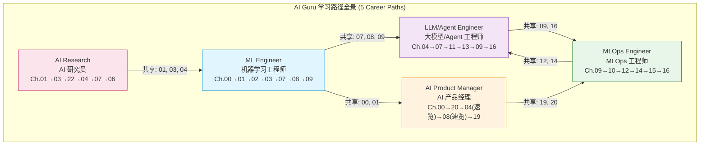
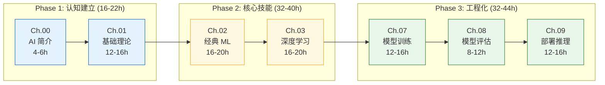
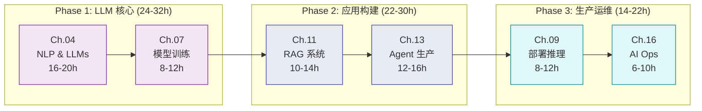
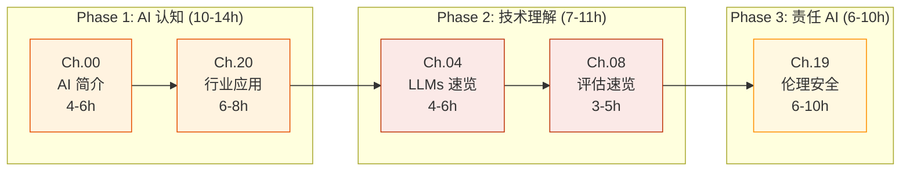
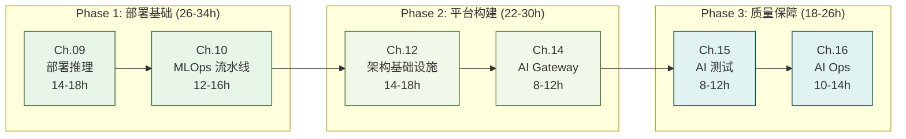
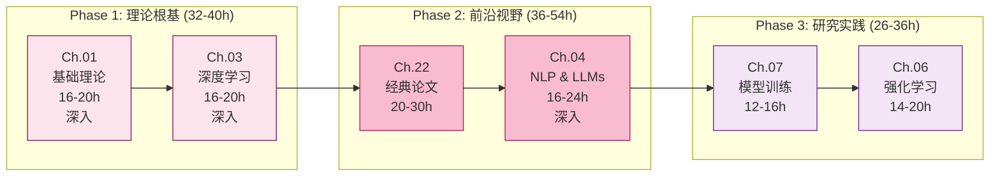
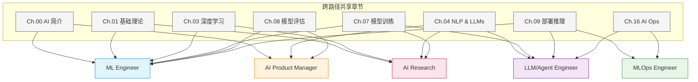

# AI Guru 学习路径指南 (Learning Paths Guide 2026)

> **一句话理解**: 学习路径就像 RPG 游戏中的"职业天赋树"——不同角色有不同的技能加点路线，但某些"通用天赋点"（如数学基础、模型评估）是多个职业共享的。选对路线，事半功倍；盲目加点，事倍功半。

---

## 为什么需要角色化路径？

AI Guru 知识库包含 24 个章节、500+ 文档。本指南基于 **5 个核心 AI 职业角色**，将章节组织为有针对性的学习序列。

**核心原则**:
- **先广后深**：每个路径都从基础开始，逐步聚焦到专业领域
- **章节复用**：同一个章节在不同路径中的深度要求不同（速览 vs 深入）
- **阅读顺序**：每个章节内部遵循 `nutshell → deep → for_dummy` 三阶阅读法
- **实践驱动**：每个阶段都有动手项目，而非纯理论堆砌

---

## 五大路径总览

### 路径速查表

| 路径 | 章节序列 | 预计总时长 | 核心产出 | 适合人群 |
|------|---------|-----------|---------|---------|
| **ML Engineer** | 00→01→02→03→07→08→09 | 80-120h | 端到端 ML 系统构建 | 想系统掌握 ML 全栈的工程师 |
| **LLM/Agent Engineer** | 04→07→11→13→09→16 | 60-90h | 生产级 LLM 应用与 Agent | 专注大模型应用的开发者 |
| **AI Product Manager** | 00→20→04→08→19 | 25-40h | AI 产品规划与评估能力 | 产品经理/运营/管理者 |
| **MLOps Engineer** | 09→10→12→14→15→16 | 70-100h | 企业级 ML 基础设施 | DevOps/SRE 转型 AI 基础设施 |
| **AI Research** | 01→03→22→04→07→06 | 100-150h | 论文阅读与前沿研究能力 | CS/数学背景的研究者 |

---

## 外部精选路线图

> 另一份高质量免费资源路线图：→ [[90_Learn/guides/ai_engineering_roadmap_2026.md|AI 工程学习路线图 2026]]（基于 ashishps1/learn-ai-engineering ⭐5.7k，涵盖课程、论文、书籍、工具）

### 推荐系统课程

| 课程 | 定位 | 适合路径 | 本库索引 |
|------|------|---------|---------|
| **Microsoft AI For Beginners** | 12 周 AI 入门，覆盖符号 AI、神经网络、CV、NLP、RL、伦理，含 PyTorch/TensorFlow 双框架 Notebook | 所有路径的入门阶段 | [[90_Learn/Courses/microsoft/microsoft_ai_for_beginners.md]] |
| **Microsoft AI Agents for Beginners** | 微软官方 16 课 AI Agent 入门（MAF + Azure AI Foundry + .NET/Python） | LLM/Agent Engineer | [[90_Learn/Courses/microsoft/microsoft_ai_agents_for_beginners.md]] |
| **Hello-Agents (Datawhale)** | 中文 Agent 系统教程，16 章 + 综合项目，从零构建 ReAct/LangGraph/AutoGen/MCP/A2A/ANP | LLM/Agent Engineer、中文学习者 | [[90_Learn/Courses/other/hello_agents.md]] |
| **Learn Claude Code** | 20 课渐进式 Claude Code 式 Harness 工程教程 | LLM/Agent Engineer、Agent 工具开发者 | [[90_Learn/Courses/share_ai/learn_claude_code.md]] |
| **Hands-On Large Language Models** | 《图解 LLM》12 章 + 近 300 张图 + Jupyter Notebook，覆盖 Token 到 BERT/生成模型微调 | LLM/Agent Engineer、AI Research | [[90_Learn/Courses/other/hands_on_llms.md]] |
| **ApacheCN AILearning** | 中文全栈 AI 学习资料库（数据分析、线性代数、ML、PyTorch、TensorFlow 2.x、NLP） | ML Engineer、AI Research、中文学习者 | [[90_Learn/Courses/apachecn/ailearning_guide.md]] |
| **500+ AI Projects** | 500+ AI/ML/DL/CV/NLP 实战项目合集索引 | 所有路径项目实践 | [[_references/500-ai-projects.md]] |
| **Hugging Face 官方课程** | Transformer / NLP / RL / Audio 系统课程 | LLM/Agent Engineer、AI Research | [[90_Learn/Courses/hugging_face/official_courses.md]] |
| **DeepLearning.AI 短课程** | 前沿技术短课程集合 | 各路径进阶补充 | [[90_Learn/Courses/deeplearning_ai/short_courses.md]] |

---

## 章节编号速查 (Chapter Quick Reference)

| 编号 | 目录 | 核心主题 |
|------|------|---------|
| 00 | `AI入门` | AI 通识、发展史、能力边界 |
| 01 | `数学基础` | 线性代数、概率统计、数据结构 |
| 02 | `机器学习` | 监督/无监督学习、特征工程 |
| 03 | `深度学习` | 神经网络、反向传播、优化器 |
| 04 | `大模型` | Transformer、GPT/BERT、微调、Prompt |
| 05 | `计算机视觉` | CNN、YOLO、Diffusion、多模态 |
| 06 | `强化学习` | MDP、DQN/PPO、Agent 架构 |
| 07 | `模型训练` | 分布式训练、FSDP、混合精度 |
| 08 | `模型评估` | 评估指标、A/B 测试、Benchmark |
| 09 | `部署推理` | vLLM、量化、推理优化 |
| 10 | `MLOps` | CI/CD、Feature Store、模型版本管理 |
| 11 | `RAG系统` | 向量数据库、Embedding、检索增强 |
| 12 | `架构基建` | Kubernetes、高可用、GPU 集群 |
| 13 | `Agent` | LangGraph、Harness、Agent 框架 |
| 14 | `架构基建/AI_Gateway` | LiteLLM、路由、限流、成本控制 |
| 15 | `AI测试` | Prompt 测试、RAG 评估、合同测试 |
| 16 | `AI运维` | 监控、日志、告警、灾难恢复 |
| 19 | `伦理安全` | RLHF/DPO、红队测试、对齐 |
| 20 | `行业应用` | 10 大行业应用案例 |
| 22 | `20_Papers` | 30+ 篇核心论文精读 |

---

## 阅读方法论：三阶阅读法

| 阶段 | 文档类型 | 目标 | 时间占比 |
|------|---------|------|---------|
| **第 1 阶: 速览** | `*-in-nutshell.md` | 建立全局认知，10 分钟理解核心概念 | 15% |
| **第 2 阶: 深入** | `*.md`（主文档） | 系统学习技术细节和实现原理 | 50% |
| **第 3 阶: 巩固** | `*_for_dummy.md` | 用小白版查缺补漏、加深理解 | 20% |
| **补充** | 动手实践 | 代码实验、项目实战 | 15% |

> **路径中标注 `(速览)` 的章节**：只需阅读 `*-in-nutshell.md` 或 `*_for_dummy.md`，无需深入主文档。

---

## 路径 1: ML Engineer (机器学习工程师)

> **一句话理解**: ML Engineer 就像"全栈厨师"——从采购食材（数据处理）、烹饪料理（模型训练）、品控质检（模型评估）到上菜服务（部署上线），全程把控。

| 属性 | 值 |
|------|---|
| **章节序列** | 00 → 01 → 02 → 03 → 07 → 08 → 09 |
| **前置要求** | Python 基本语法、基础数学概念 |
| **预计时间** | 80-120 小时（每天 2-3 小时，约 2-3 个月） |
| **核心产出** | 端到端 ML 系统：数据处理 → 模型训练 → 评估优化 → 部署上线 |

### 路径流程图

### 阶段详解

**Phase 1: 认知建立（16-22h）**

- **Ch.00** — [AI 简介 - nutshell](../../AI入门/AI_Fundamentals.md) → [主文档](../../AI入门/README.md) → [AI 伦理与社会](../../AI入门/AI_Ethics_Society.md)
- **Ch.01** — [线性代数 for_dummy](../../数学基础/Linear_Algebra/Linear_Algebra_for_dummy.md) → [主文档](../../数学基础/Linear_Algebra/Linear_Algebra.md) → [概率统计](../../数学基础/Probability_Statistics/Probability_Statistics.md)
- **Key Skills**: AI 发展脉络、矩阵运算、概率分布、梯度下降数学原理

**Phase 2: 核心技能（32-40h）**

- **Ch.02** — [监督学习 for_dummy](../../机器学习/Supervised_Learning/Supervised_Learning_for_dummy.md) → [主文档](../../机器学习/Supervised_Learning/Supervised_Learning.md) → [无监督学习](../../机器学习/Unsupervised_Learning/Unsupervised_Learning.md) → [特征工程](../../机器学习/Feature_Engineering/Feature_Engineering_for_dummy.md)
- **Ch.03** — [神经网络 for_dummy](../../深度学习/Neural_Network_Core/Neural_Network_Core_for_dummy.md) → [主文档](../../深度学习/Neural_Network_Core/Neural_Network_Core.md) → [优化与正则化](../../深度学习/Optimization/Optimization.md) → 实践: PyTorch MNIST
- **Key Skills**: 分类/回归/聚类、特征工程、反向传播、Adam/SGD、Dropout

**Phase 3: 工程化（32-44h）**

- **Ch.07** — [Training nutshell](../../模型训练/Model-Training-in-nutshell.md) → [分布式训练](../../模型训练/Distributed_Training/index.md) → [混合精度](../../模型训练/Optimization/Mixed_Precision_Training.md)
- **Ch.08** — [评估 for_dummy](../../模型评估/Model_Evaluation_for_dummy.md) → [主文档](../../模型评估/Model_Evaluation.md) → [A/B 测试](../../AI测试/AB_Testing_AI_Systems.md)
- **Ch.09** — [部署 for_dummy](../../部署推理/Deployment_Inference_for_dummy.md) → [Inference nutshell](../../部署推理/Inference-in-nutshell.md) → [推理引擎选型指南](../../部署推理/Inference_Engines/LLM_Inference_Engine_Selection_Guide.md) → [vLLM](../../部署推理/Inference_Engines/vLLM_Deep_Dive.md) → [推理性能基础](../../部署推理/Inference_Performance/Inference_Performance_Fundamentals.md) → 实践: Docker + FastAPI
- **Key Skills**: FSDP/混合精度、Precision/Recall/F1/AUC、vLLM、推理引擎选型、容器化部署

完成本路径后，参考 [milestones.md](../../90_Learn/guides/milestones.md) Stage 0-3 自测。

---

## 路径 2: LLM/Agent Engineer (大模型/Agent 工程师)

> **一句话理解**: LLM/Agent Engineer 就像"交响乐团指挥"——不需要自己演奏每件乐器（训练底层模型），但必须精通如何让各个声部（RAG、Agent、工具链）协调配合。

| 属性 | 值 |
|------|---|
| **章节序列** | 04 → 07 → 11 → 13 → 09 → 16 |
| **前置要求** | Python 编程、基础 ML 概念、HTTP/API 基础 |
| **预计时间** | 60-90 小时（每天 2-3 小时，约 5-7 周） |
| **核心产出** | 生产级 LLM 应用：RAG 系统、Agent 工作流、模型部署与运维 |

### 路径流程图

### 阶段详解

**Phase 1: LLM 核心（24-32h）**

- **Ch.04** — [LLM nutshell](../../大模型/LLM_Architectures/LLM-Basics-in-nutshell.md) → [Transformer](../../大模型/Transformer_Revolution/Transformer_Revolution.md) → [LLM 架构](../../大模型/LLM_Architectures/LLM_Architectures.md) → [Prompt Engineering](../../大模型/Prompt_Engineering/Prompt_Engineering.md) → [微调 LoRA/QLoRA](../../大模型/Fine_tuning_Techniques/Fine_tuning_Techniques.md) → 选读: [推理模型 2026](../../大模型/LLM_Architectures/Reasoning_Models_2026.md) | [中国大模型](../../大模型/README.md)
- **Ch.07** — [Training nutshell](../../模型训练/Model-Training-in-nutshell.md) → [分布式训练](../../模型训练/Distributed_Training/index.md) → 实践: HuggingFace PEFT LoRA 微调
- **Key Skills**: Transformer/Attention、Prompt Engineering、LoRA 微调、PEFT

**Phase 2: 应用构建（22-30h）**

- **Ch.11** — [RAG for_dummy](../../RAG系统/RAG_Systems_for_dummy.md) → [RAG nutshell](../../RAG系统/RAG-in-nutshell.md) → [主文档](../../RAG系统/RAG_Systems.md) → [向量数据库](../../RAG系统/Vector_Databases/index.md) → 实践: LangChain + Qdrant 知识库问答
- **Ch.13** — [Agent nutshell](../../Agent/Agent_Workflow/Workflow-in-nutshell.md) → [Agent Harness](../../Agent/README.md) → [LangGraph](../../Agent/Agent_Frameworks/LangChain_Deep_Dive.md) → [Agent 记忆](../../Agent/README.md) → 实践: 多步推理 + 工具调用 Agent
- **Key Skills**: 文档切分、Embedding、向量检索、Reranking、LangGraph、MCP 协议、工具编排

**Phase 3: 生产运维（14-22h）**

- **Ch.09** — [Inference nutshell](../../部署推理/Inference-in-nutshell.md) → [推理引擎选型指南](../../部署推理/Inference_Engines/LLM_Inference_Engine_Selection_Guide.md) → [vLLM](../../部署推理/Inference_Engines/vLLM_Deep_Dive.md) → [SGLang](../../部署推理/Inference_Engines/SGLang_Deep_Dive.md) → [量化](../../_concepts/quantization.md) → [推理引擎迁移指南](../../部署推理/Inference_Engines/LLM_Inference_Engine_Migration_Guide.md)
- **Ch.16** — [AI Ops nutshell](../../AI运维/AIOps-in-nutshell.md) → [LLM 可观测性](../../MLOps/Observability/LLM_Observability.md) → [告警与灾难恢复](../../AI运维/SRE_Reliability/AI_Incident_Response_Playbook.md)
- **Key Skills**: vLLM/SGLang 选型、量化 GPTQ/AWQ、KV Cache、LLM 监控、告警策略

完成本路径后，参考 [milestones.md](../../90_Learn/guides/milestones.md) Stage 2-4 自测。

---

## 路径 3: AI Product Manager (AI 产品经理)

> **一句话理解**: AI Product Manager 就像"翻译官"——站在技术团队和业务团队之间，把"业务需要什么"翻译成"AI 能做什么"，再把"AI 做了什么"翻译回"业务得到了什么价值"。

| 属性 | 值 |
|------|---|
| **章节序列** | 00 → 20 → 04(速览) → 08(速览) → 19 |
| **前置要求** | 无硬性技术要求，需有基本业务理解能力 |
| **预计时间** | 25-40 小时（每天 1-2 小时，约 3-4 周） |
| **核心产出** | AI 产品思维、需求评估能力、AI 伦理意识 |

### 路径流程图

### 阶段详解

**Phase 1: AI 认知（10-14h）**

- **Ch.00** — [AI nutshell](../../AI入门/AI_Fundamentals.md) → [主文档](../../AI入门/README.md) → [AI 伦理与社会](../../AI入门/AI_Ethics_Society.md)
- **Ch.20** — [行业应用概览](../../行业应用/README.md) → 选 2-3 个本行业案例深入 → 实践: 分析一个竞品 AI 产品技术选型
- **Key Skills**: AI 发展脉络、能力边界判断、行业应用模式、ROI 评估

**Phase 2: 技术理解（7-11h）**

- **Ch.04 (速览)** — [LLM nutshell](../../大模型/LLM_Architectures/LLM-Basics-in-nutshell.md) → [LLM for_dummy](../../大模型/LLM_Architectures/LLM_Architectures_for_dummy.md) → [Prompt for_dummy](../../大模型/Prompt_Engineering/Prompt_Engineering_for_dummy.md)
- **Ch.08 (速览)** — [评估 for_dummy](../../模型评估/Model_Evaluation_for_dummy.md) → [A/B 测试](../../AI测试/AB_Testing_AI_Systems.md) → [Benchmark](../../模型评估/Benchmarks/index.md)
- **Key Skills**: LLM 能力边界、Token 与成本、Precision/Recall 业务权衡、Benchmark 解读

**Phase 3: 责任 AI（6-10h）**

- **Ch.19** — [伦理 nutshell](../../伦理安全/Ethics-in-nutshell.md) → [AI 对齐](../../伦理安全/Value_Alignment/Value_Alignment.md) → [红队测试](../../伦理安全/README.md) → [安全合规](../../伦理安全/README.md)
- **Key Skills**: RLHF/DPO 概念、偏见检测、数据安全、合规框架

### 产品经理专属决策框架

| 决策环节 | 关键问题 | 参考章节 |
|---------|---------|---------|
| **需求评估** | 这个问题 AI 能解决吗？成本多少？ | Ch.00 + Ch.20 |
| **模型选型** | 用 GPT-4 还是开源模型？延迟和成本如何平衡？ | Ch.04 |
| **质量评估** | 怎么衡量模型效果？什么指标对应业务价值？ | Ch.08 |
| **风险控制** | 幻觉怎么处理？数据隐私如何保障？ | Ch.19 |
| **上线策略** | A/B 测试怎么设计？灰度发布怎么做？ | Ch.08 + Ch.09 |

完成本路径后自测: (1) 列举 5 种 AI 产品商业模式; (2) 解释 Precision/Recall 业务权衡; (3) 描述 AI 产品从需求到上线的完整流程; (4) 列举 3 个伦理风险及应对策略。

---

## 路径 4: MLOps Engineer (MLOps 工程师)

> **一句话理解**: MLOps Engineer 就像"高速公路建设者"——模型是车辆，数据是货物，你的工作是设计、建造和维护让车辆高效安全运行的整条高速公路，包括收费站（Gateway）、监控摄像头（Ops）和质量检测站（Testing）。

| 属性 | 值 |
|------|---|
| **章节序列** | 09 → 10 → 12 → 14 → 15 → 16 |
| **前置要求** | Docker/K8s 基础、CI/CD 概念、Linux 运维、Python |
| **预计时间** | 70-100 小时（每天 2-3 小时，约 6-8 周） |
| **核心产出** | 企业级 ML 基础设施：部署流水线、网关、测试框架、可观测性 |

### 路径流程图

### 阶段详解

**Phase 1: 部署基础（26-34h）**

- **Ch.09** — [Inference nutshell](../../部署推理/Inference-in-nutshell.md) → [主文档](../../部署推理/Deployment_Inference.md) → [推理引擎选型指南](../../部署推理/Inference_Engines/LLM_Inference_Engine_Selection_Guide.md) → [vLLM](../../部署推理/Inference_Engines/vLLM_Deep_Dive.md) → [推理引擎基准测试指南](../../部署推理/Inference_Engines/LLM_Inference_Benchmarking_Guide.md) → [量化](../../_concepts/quantization.md) → 实践: vLLM + Docker 部署
- **Ch.10** — [MLOps for_dummy](../../MLOps/MLOps_Pipeline_for_dummy.md) → [主文档](../../MLOps/MLOps_Pipeline.md) → [Feature Store](../../MLOps/Feature_Store/Feature_Store_Fundamentals.md) → [模型版本管理](../../MLOps/Experiment_Tracking/Model_Registry_and_Cards_Deep_Dive.md)
- **Key Skills**: vLLM/TGI 选型、量化、推理基准测试、CI/CD for ML、DVC、Feature Store、Model Registry

**Phase 2: 平台构建（22-30h）**

- **Ch.12** — [主文档](../../架构基建/README.md) → [K8s for AI](../../架构基建/Kubernetes_Core_Components_Deep_Dive.md) → [GPU 集群](../../架构基建/Architecture_Overview/AI_Infrastructure_2026.md) → [高可用](../../架构基建/Architecture_Overview/High_Availability_2026.md)
- **Ch.14** — [Gateway nutshell](../../架构基建/AI_Gateway/Gateway-in-nutshell.md) → [主文档](../../架构基建/AI_Gateway/AI_Gateway_2026.md) → [LiteLLM](../../架构基建/AI_Gateway/LiteLLM_Deep_Dive.md) → 实践: LiteLLM Proxy 多模型路由
- **Key Skills**: K8s 编排、GPU 调度、自动扩缩容、API 路由、Token 缓存、限流降级

**Phase 3: 质量保障（18-26h）**

- **Ch.15** — [AI 测试主文档](../../AI测试/README.md) → [Prompt 测试](../../AI测试/Testing_Frameworks/Promptfoo_Deep_Dive.md) → [RAG 评估](../../AI测试/RAGAS_Deep_Dive.md) → 实践: Prompt 回归测试套件
- **Ch.16** — [AI Ops nutshell](../../AI运维/AIOps-in-nutshell.md) → [LLM 可观测性](../../MLOps/Observability/LLM_Observability.md) → [日志追踪](../../AI运维/README.md) → [告警恢复](../../AI运维/SRE_Reliability/AI_Incident_Response_Playbook.md) → 实践: Grafana + LangSmith 监控
- **Key Skills**: Prompt 测试、RAG 评估、合同测试、LLM 指标监控、SLO/SLA、灾难恢复

完成本路径后，参考 [milestones.md](../../90_Learn/guides/milestones.md) Stage 3 自测。

---

## 路径 5: AI Research (AI 研究员)

> **一句话理解**: AI Researcher 就像"考古学家兼发明家"——既要深入研究前人留下的"文明遗迹"（经典论文和理论），也要从中发现规律、提出新的"文明假说"（创新方法），并用实验验证。

| 属性 | 值 |
|------|---|
| **章节序列** | 01 → 03 → 22 → 04 → 07 → 06 |
| **前置要求** | 线性代数、概率统计、微积分、Python/PyTorch |
| **预计时间** | 100-150 小时（每天 3-4 小时，约 2-4 个月） |
| **核心产出** | 论文阅读能力、研究问题发现、实验复现与设计 |

### 路径流程图

### 阶段详解

**Phase 1: 理论根基（32-40h）**

- **Ch.01 (深入)** — [线性代数](../../数学基础/Linear_Algebra/Linear_Algebra.md) (5h) → [概率统计](../../数学基础/Probability_Statistics/Probability_Statistics.md) (5h) → [数据结构](../../数学基础/Data_Structures_Algorithms/Data_Structures_Algorithms.md) (4h) → [分布式系统](../../数学基础/Distributed_Systems/Distributed_Systems.md) (3h)
- **Ch.03 (深入)** — [神经网络核心](../../深度学习/Neural_Network_Core/Neural_Network_Core.md) (5h) → [优化与正则化](../../深度学习/Optimization/Optimization.md) (5h) → 实践: NumPy 反向传播 (4h) → 实践: PyTorch ResNet/VGG (3h)
- **Key Skills**: 矩阵分解、概率图模型、信息论、反向传播推导、优化器收敛性分析

**Phase 2: 前沿视野（36-54h）**

- **Ch.22** — [必读书单](../../论文精读/README.md) → 精读: Attention Is All You Need → BERT/GPT → ResNet/BatchNorm → RLHF/DPO → MoE → 选读 5-10 篇
- **Ch.04 (深入)** — [Transformer](../../大模型/Transformer_Revolution/Transformer_Revolution.md) → [LLM 架构](../../大模型/LLM_Architectures/LLM_Architectures.md) → [推理模型](../../大模型/LLM_Architectures/Reasoning_Models_2026.md) → [长上下文](../../大模型/LLM_Architectures/Long_Context_Models_2026.md) → [多模态](../../大模型/Multimodal_Models/Multimodal_Architectures_2026.md) → [微调](../../大模型/Fine_tuning_Techniques/Fine_tuning_Techniques.md)
- **Key Skills**: 论文精读、Attention 变体、Scaling Laws、MoE、推理链、多模态融合

**Phase 3: 研究实践（26-36h）**

- **Ch.07** — [分布式训练](../../模型训练/Distributed_Training/index.md) → [混合精度](../../模型训练/Optimization/Mixed_Precision_Training.md) → 实践: 复现一篇论文训练实验 (6h)
- **Ch.06** — [RL for_dummy](../../强化学习/RL_Foundations/RL_Foundations_for_dummy.md) → [RL 基础](../../强化学习/RL_Foundations/RL_Foundations.md) → [深度 RL](../../强化学习/Deep_RL/Deep_RL.md) → [AI Agent](../../Agent/Agent_Foundations/AI_Agents.md)
- **Key Skills**: 3D 并行、训练稳定性、MDP/Bellman、PPO、RLHF、Agent 推理与规划

完成本路径后，参考 [milestones.md](../../90_Learn/guides/milestones.md) Stage 1-4 自测。

---

## 时间估算矩阵 (Time Estimates Matrix)

| 章节 | 初学者 Beginner | 中级 Intermediate | 高级 Advanced |
|------|:-:|:-:|:-:|
| Ch.00 AI 简介 | 6h | 3h | 1h |
| Ch.01 基础理论 | 20h | 12h | 6h |
| Ch.02 经典 ML | 24h | 16h | 8h |
| Ch.03 深度学习 | 24h | 16h | 8h |
| Ch.04 NLP & LLMs | 28h | 18h | 10h |
| Ch.06 强化学习 | 24h | 16h | 8h |
| Ch.07 模型训练 | 18h | 12h | 6h |
| Ch.08 模型评估 | 14h | 8h | 4h |
| Ch.09 部署推理 | 18h | 12h | 6h |
| Ch.10 MLOps 流水线 | 18h | 12h | 6h |
| Ch.11 RAG 系统 | 16h | 10h | 5h |
| Ch.12 架构基础设施 | 20h | 14h | 8h |
| Ch.13 Agent 生产 | 18h | 12h | 6h |
| Ch.14 AI Gateway | 14h | 8h | 4h |
| Ch.15 AI 测试 | 14h | 8h | 4h |
| Ch.16 AI Ops | 16h | 10h | 5h |
| Ch.19 伦理安全 | 12h | 8h | 4h |
| Ch.20 行业应用 | 10h | 6h | 3h |
| Ch.22 经典论文 | 36h | 24h | 12h |

> **经验水平**: 初学者 = 首次接触 | 中级 = 有相关项目经验 | 高级 = 该领域工作 1 年+

### 各路径总时长

| 路径 | 初学者 | 中级 | 高级 |
|------|:------:|:----:|:----:|
| ML Engineer (00→01→02→03→07→08→09) | ~130h | ~85h | ~45h |
| LLM/Agent Engineer (04→07→11→13→09→16) | ~120h | ~80h | ~42h |
| AI Product Manager (00→20→04速览→08速览→19) | ~50h | ~32h | ~18h |
| MLOps Engineer (09→10→12→14→15→16) | ~100h | ~66h | ~33h |
| AI Research (01→03→22→04→07→06) | ~158h | ~106h | ~58h |

---

## 跨路径共享章节图 (Cross-Path Shared Chapters)

### 共享章节深度要求

| 章节 | ML Eng | LLM/Agent | AI PM | MLOps | Research |
|------|:------:|:---------:|:-----:|:-----:|:--------:|
| Ch.00 | 深入 | - | 深入 | - | - |
| Ch.01 | 深入 | - | - | - | 深入 |
| Ch.02 | 深入 | - | - | - | - |
| Ch.03 | 深入 | - | - | - | 深入 |
| Ch.04 | - | 深入 | 速览 | - | 深入 |
| Ch.07 | 深入 | 聚焦微调 | - | - | 深入 |
| Ch.08 | 深入 | - | 速览 | - | - |
| Ch.09 | 深入 | 聚焦推理 | - | 深入 | - |
| Ch.10 | - | - | - | 深入 | - |
| Ch.11 | - | 深入 | - | - | - |
| Ch.12-15 | - | - | - | 深入 | - |
| Ch.16 | - | 深入 | - | 深入 | - |
| Ch.19 | - | - | 深入 | - | - |
| Ch.20 | - | - | 深入 | - | - |
| Ch.22 | - | - | - | - | 深入 |

> `-` = 不在路径中 | `深入` = 主文档 + 实践 | `速览` = nutshell/for_dummy only | `聚焦X` = 选择性阅读

---

## 技能矩阵 (Skill Matrix)

| 技能领域 | ML Eng | LLM/Agent | AI PM | MLOps | Research |
|---------|:------:|:---------:|:-----:|:-----:|:--------:|
| **数学基础** | 3 | 1 | 1 | 1 | 5 |
| **经典 ML 算法** | 5 | 0 | 0 | 0 | 3 |
| **深度学习理论** | 4 | 2 | 0 | 0 | 5 |
| **LLM 架构** | 2 | 5 | 2 | 1 | 5 |
| **Prompt Engineering** | 1 | 5 | 3 | 1 | 2 |
| **模型微调** | 3 | 4 | 0 | 1 | 4 |
| **RAG 系统** | 0 | 5 | 1 | 2 | 2 |
| **Agent 开发** | 0 | 5 | 1 | 1 | 3 |
| **模型训练工程** | 5 | 3 | 0 | 2 | 5 |
| **模型评估** | 4 | 2 | 3 | 3 | 3 |
| **推理优化** | 4 | 4 | 0 | 5 | 2 |
| **MLOps 流水线** | 2 | 1 | 0 | 5 | 0 |
| **K8s/基础设施** | 1 | 1 | 0 | 5 | 0 |
| **AI Gateway** | 0 | 2 | 0 | 5 | 0 |
| **AI 测试** | 2 | 2 | 2 | 5 | 1 |
| **可观测性/Ops** | 2 | 4 | 0 | 5 | 0 |
| **AI 伦理安全** | 1 | 1 | 5 | 2 | 3 |
| **行业应用** | 2 | 2 | 5 | 1 | 2 |
| **论文阅读** | 2 | 2 | 1 | 1 | 5 |
| **强化学习** | 1 | 2 | 0 | 0 | 5 |

> 评分: 5=专家 | 4=熟练 | 3=了解 | 2=接触过 | 1=知道概念 | 0=不涉及

---

## 路径切换建议 (Path Switching Guide)

| 从 → 到 | 需补章节 | 建议 |
|---------|---------|------|
| ML → LLM/Agent | Ch.04, 11, 13 | 补 RAG + Agent 即可 |
| LLM/Agent → MLOps | Ch.10, 12, 14, 15 | 需大量补基础设施知识 |
| PM → ML Engineer | Ch.01, 02, 03, 07 | 需投入大量时间补技术基础 |
| MLOps → LLM/Agent | Ch.04, 11, 13 | 已有运维基础，补 LLM 应用层 |
| Research → ML Eng | Ch.02, 08, 09 | 理论足够，补工程化实践 |
| 任意 → Research | Ch.01(深), 22 | 需额外数学和论文训练 |

---

## 学习节奏建议

| 模式 | 每日投入 | 适合人群 | ML Engineer 完成时间 |
|------|---------|---------|---------------------|
| **轻松模式** | 30min/天 | 在职、兴趣驱动 | ~6 个月 |
| **标准模式** | 2h/天 | 在职、目标转型 | ~2 个月 |
| **冲刺模式** | 4-6h/天 | 全职学习、求职准备 | ~3-4 周 |

> **核心原则**: 持续性 > 强度。每天 30 分钟坚持 3 个月，远好过每天 8 小时突击 1 周后放弃。

---

## 相关资源

| 资源 | 说明 |
|------|------|
| [概念入门路径](../../README.md) | 按认知层次组织的入门指南（Stage 0-4） |
| [里程碑自测](../../90_Learn/guides/milestones.md) | 每个 Stage 的检查点问题 |
| [概念知识卡片](./_concepts/) | 每个 Stage 的核心概念卡片 |
| [新手导航（章节版）](../../伦理安全/README_for_dummy.md) | 按章节组织的入门指南 |
| [已有路径 (pathways/)](./pathways/) | 原版 6 条路径（按认知层次组织） |

---

## Related

- [[90_Learn/README|Learn — AI Guru 概念入门路径]]
- [[90_Learn/guides/milestones.md|里程碑自测]]
- [[90_Learn/pathways/ml-practitioner.md|ML 从业者路径 (原版)]]
- [[90_Learn/pathways/llm-engineer.md|LLM 工程师路径 (原版)]]
- [[90_Learn/pathways/ai-researcher.md|AI 研究者路径 (原版)]]
- [[90_Learn/pathways/product-manager.md|AI 产品经理路径 (原版)]]
- [[90_Learn/pathways/java-developer.md|Java 开发者 AI 路径 (原版)]]
- [[90_Learn/pathways/absolute-beginner.md|零基础通识路径 (原版)]]
- [[90_Learn/pathways/data-scientist.md|数据科学家路径 (原版)]]
- [[90_Learn/guides/skills_self_assessment|AI 技能自评清单]] — 配合路径使用的技能自评工具

---

*Last updated: 2026-06-05*
