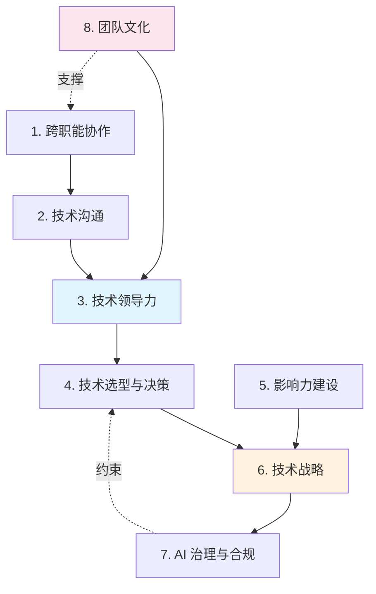

# Stage 5: 职业化

> 中文简称：Stage 5: 职业化

> **"技术能力让你入门，职业素养让你走远——真正的影响力来自把技术转化为团队和业务价值。"**
>
> 本层目标：从"能做 AI"进阶到"能带领团队做 AI"，掌握跨职能协作、技术领导力、影响力建设与技术战略规划。

## 阶段目标

完成本阶段后，你将能够：
1. 在跨职能团队（产品/业务/工程/运维）中有效推进 AI 项目
2. 向非技术干系人（高管、客户）清晰传达 AI 能力与限制
3. 制定团队的技术路线图与技术债务管理策略
4. 通过技术布道、开源贡献、写作建立个人与团队影响力
5. 在 AI 项目中做合理的技术选型与风险权衡
6. 建立团队的 AI 工程文化与最佳实践
7. 评估 AI 项目的 ROI 并做数据驱动的决策
8. 理解 AI 治理、合规与伦理在组织层面的落地

## 本层概要

| 属性 | 值 |
|------|---|
| 包含核心概念 | 8 个 |
| 预计学习时间 | 持续（伴随职业成长） |
| 前置依赖 | [[90_学习/01_概念认知/05_stage3_engineering|Stage 3: 工程实践]] 及以上 |
| 适合人群 | AI 工程师进阶为 Tech Lead / 架构师 / 技术管理者 |

---

## 核心概念清单

| # | 概念 | 类别 | 重要度 | 详解位置 |
|---|------|------|--------|----------|
| 1 | 跨职能协作 (Cross-functional Collaboration) | 团队 | P0 | 下方 |
| 2 | 技术沟通与翻译 (Tech Translation) | 沟通 | P0 | 下方 |
| 3 | 技术领导力 (Technical Leadership) | 领导力 | P0 | 下方 |
| 4 | 技术选型与架构决策 (Tech Decision-making) | 决策 | P0 | 下方 |
| 5 | 影响力建设 (Influence Building) | 个人品牌 | P1 | 下方 |
| 6 | 技术战略与路线图 (Tech Strategy) | 战略 | P1 | 下方 |
| 7 | AI 治理与合规 (AI Governance) | 合规 | P1 | 下方 |
| 8 | 团队文化与工程实践 (Team Culture) | 文化 | P1 | 下方 |

## 概念依赖图



## 概念详解

### 1. 跨职能协作 (Cross-functional Collaboration)

- **一句话定义**：与产品经理、业务方、设计、运维、法务等非 ML 角色协同推进 AI 项目的能力。
- **为什么重要**：AI 项目失败的首要原因不是技术，而是需求错配、沟通不畅、期望失控。工程师若只懂技术不懂协作，项目很难落地。
- **关键协作方与诉求**：

| 角色 | 核心诉求 | 工程师应提供 |
|------|---------|-------------|
| 产品经理 | 功能可行性、ROI、排期 | 技术评估、风险清单、MVP 范围 |
| 业务方 | 效果、成本、上线时间 | 业务指标对齐、成本模型 |
| 设计师 | 交互边界、异常体验 | 失败模式、延迟预期、降级方案 |
| 13_运维/SRE | 稳定性、可观测性 | 监控、告警、容量规划 |
| 法务/合规 | 合规、隐私、风险 | 数据流向、模型行为说明 |

- **实践要点**: 建立"AI 项目画布"——用一页纸讲清楚问题定义、成功指标、数据来源、模型方案、风险与降级。

### 2. 技术沟通与翻译 (Tech Translation)

- **一句话定义**：把复杂的 AI 技术概念转化为非技术干系人能理解的语言，并反向把业务需求翻译为技术方案。
- **为什么重要**: 高管和客户不关心 Transformer 有多少层，他们关心"能解决什么问题、要花多少钱、有什么风险"。
- **沟通框架**:
  - **能力边界**: 诚实说明 AI 能做什么、不能做什么（避免过度承诺）
  - **不确定性量化**: 用置信区间、A/B 测试数据说话，而非"差不多"
  - **成本-收益**: 把技术指标（F1、延迟）翻译为业务影响（转化率、用户体验）
  - **类比与可视化**: 用业务场景类比技术概念（如把 RAG 类比为"开卷考试"）
- **反模式**: 堆砌术语、回避风险、只报喜不报忧。

### 3. 技术领导力 (Technical Leadership)

- **一句话定义**：通过技术判断力、决策力与人才培养，带领团队高质量交付的能力——不是靠职级，而是靠影响力。
- **为什么重要**: AI 领域变化极快，团队需要一个能判断方向、做权衡、培养后继者的技术主心骨。
- **核心能力**:
  - **技术判断力**: 能评估方案优劣、识别技术债、预判风险
  - **决策力**: 在信息不全时做合理决策，并愿意承担后果
  - **人才培养**: 通过 Code Review、Pairing、技术分享提升团队水平
  - **技术愿景**: 为团队描绘 1-2 年的技术方向
- **从 IC 到 Lead 的转变**: 从"自己做得好"到"让团队做得好"；从"写最多代码"到"做最关键决策"。

### 4. 技术选型与架构决策 (Tech Decision-making)

- **一句话定义**：在多个候选技术方案中做合理选择，并记录决策过程与依据。
- **为什么重要**: AI 领域工具/框架爆炸式增长，错误选型会导致后续维护成本高昂甚至推倒重来。
- **决策框架**:

| 维度 | 评估方法 | 决策标准 |
|------|---------|---------|
| 功能匹配 | 需求清单对比 | 覆盖核心需求 |
| 性能表现 | 基准测试 | 满足 SLA |
| 社区生态 | Star/Issue/更新频率 | 活跃维护 |
| 学习成本 | 文档质量 + 上手时间 | 团队可接受 |
| 长期维护 | 路线图 + 兼容性 | 可持续 |
| 供应商锁定 | 协议开放度 | 避免深度锁定 |

- **实践**: 用 ADR（Architecture Decision Record）记录每个重要决策的背景、选项、选择与后果。
- **AI 特有考量**: 模型闭源 vs 开源、数据隐私、推理成本、可替换性。

### 5. 影响力建设 (Influence Building)

- **一句话定义**：通过技术布道、开源贡献、写作分享，在团队内外建立专业声誉与影响。
- **为什么重要**: 影响力带来更好的资源、更多的话语权、更强的人才吸引力。在 AI 这种快速变化的领域，影响力是个人与组织的护城河。
- **建设路径**:
  - **内部**: 技术分享、内部分享会、Code Review 文化、新人导师
  - **外部**: 开源贡献（PR/Issue）、技术博客、会议演讲、社区参与
  - **写作**: 把项目经验沉淀为文档、博客、论文
- **原则**: 先创造价值，再获取影响力；持续性比单次爆发更重要。

### 6. 技术战略与路线图 (Tech Strategy)

- **一句话定义**：为团队/组织制定 1-3 年的技术发展方向与里程碑。
- **为什么重要**: AI 领域充满噪音，没有战略的团队会被新技术牵着走，疲于追热点而无沉淀。
- **战略要素**:
  - **技术雷达**: 跟踪采用/试验/评估/暂缓四个层次的技术
  - **能力地图**: 团队当前能力 vs 目标能力的差距分析
  - **里程碑**: 季度/年度可交付成果
  - **资源分配**: 探索（新方向）vs 开发（产品）vs 维护（存量）的投入比
- **平衡**: 短期业务交付 vs 长期技术投资；前沿追新 vs 稳定性。

### 7. AI 治理与合规 (AI Governance)

- **一句话定义**：在组织层面建立 AI 系统的开发、部署、使用规范，确保合规、公平、可问责。
- **为什么重要**: 随着 EU AI Act 等法规落地，AI 合规已成为不可回避的议题。缺乏治理的组织面临法律、声誉、安全风险。
- **治理框架**:
  - **模型卡 (Model Card)**: 记录模型的能力、限制、训练数据、评估结果
  - **数据卡 (Data Card)**: 记录数据来源、许可、偏见评估
  - **审计日志**: 模型决策可追溯
  - **红队测试**: 主动发现安全漏洞
  - **人审机制**: 高风险决策保留人工复核
- **法规**: EU AI Act、GDPR、各国 AI 监管框架。

### 8. 团队文化与工程实践 (Team Culture)

- **一句话定义**：建立支持学习、鼓励实验、重视质量的团队工程文化。
- **为什么重要**: AI 项目不确定性高，僵化的流程会扼杀创新，而缺乏规范又会积累债务。文化是平衡两者的关键。
- **核心实践**:
  - **实验文化**: 鼓励快速原型、A/B 测试、失败复盘（Blameless Postmortem）
  - **质量文化**: 评估集、CI/CD 质量门禁、模型回归测试
  - **文档文化**: 决策记录、模型卡、Runbook
  - **学习文化**: 定期论文阅读、技术分享、外部培训
- **MLOps 成熟度**: 从手动 → 自动化 → 持续交付 → 持续优化的演进。

---

## 常见误解

| 误解 | 澄清 |
|------|------|
| "技术领导就是技术最强的人" | 领导力在于判断、决策、培养人，而非个人产出最高 |
| "职业化 = 不写代码转管理" | 技术 Lead 仍需保持技术敏锐度，是"带兵打仗"而非"纸上谈兵" |
| "影响力靠刷存在感" | 真正的影响力来自持续创造价值，而非自我营销 |
| "AI 治理是法务的事" | 工程师是治理的第一责任人，法务提供框架 |
| "技术战略 = 追新技术" | 战略是"选择不做什么"，比追新更重要的是聚焦 |
| "跨职能协作就是开会" | 协作的核心是对齐目标与期望，而非会议数量 |

## 学习资源

| 类型 | 资源 | 说明 |
|------|------|------|
| 书籍 | [[90_学习/05_参考资料/books/15_ai_engineering_huyen|AI Engineering]] Ch 11 | 团队协作与系统架构 |
| 书籍 | [[90_学习/05_参考资料/books/10_designing_ml_systems_huyen|Designing ML Systems]] | ML 系统全生命周期 |
| 书籍 | [[90_学习/05_参考资料/books/04_llms_in_production|LLMs in Production]] | 生产化与团队实践 |
| 指南 | [[90_学习/04_实践指南/02_AI工程路线图2026|AI 工程路线图 2026]] | 技术战略参考 |
| 指南 | [[90_学习/04_实践指南/07_milestones|milestones]] | 职业里程碑自测 |
| 文章 | [[90_学习/05_参考资料/Articles/03_chip_huyen_agents_article|Chip Huyen Agents]] | 行业视角 |
| 实践 | [[90_学习/05_参考资料/Projects/03_500_ai_projects|500 AI Projects]] | 项目经验积累 |

## 技术影响力建设路径

影响力不是一天建成的，按层级递进：

| 层级 | 行动 | 标志 |
|------|------|------|
| L1 团队内 | 分享技术决策、写好文档 | 成为团队的"go-to person" |
| L2 跨团队 | 主导跨团队项目、写技术 RFC | 被邀请参与他人项目评审 |
| L3 公司内 | 内部技术大会演讲、制定标准 | 名字与某项实践绑定 |
| L4 行业内 | 开源贡献、技术博客、会议演讲 | 行业内有知名度 |
| L5 思想领导 | 出版书籍、定义新方法/术语 | 影响行业方向 |

**关键心法**: 影响力 = (技术深度 × 沟通能力 × 持续输出)。三者缺一不可。

## 技术决策框架（ADR 实践）

**ADR（Architecture Decision Record）模板**:

```
# ADR-XXX: [决策标题]

## 状态
Proposed / Accepted / Deprecated / Superseded

## 背景
为什么需要这个决策？遇到了什么问题？

## 决策
我们选择了什么？关键理由是什么？

## 备选方案
考虑过哪些其他方案？为什么没选？

## 后果
- 正面影响:
- 负面影响:
- 风险与缓解:

## 相关
- 相关 ADR
- 相关文档
```

**常见 AI 技术决策场景**:
- 开源 vs 闭源模型选型
- 自建 vs 托管推理服务
- RAG vs 微调方案
- 评估指标定义
- 数据合规方案

## AI 治理落地清单

| 维度 | 实践 | 优先级 |
|------|------|--------|
| 透明性 | 模型卡（Model Card）/数据卡（Data Card） | 高 |
| 公平性 | 偏见评估 + 缓解措施 | 高 |
| 鲁棒性 | 红队测试（Red Teaming） | 中 |
| 隐私 | 数据脱敏 + 差分隐私 | 高 |
| 可追溯 | 模型版本 + 数据血缘 + 审计日志 | 中 |
| 合规 | GDPR/AI Act/行业法规对照 | 高 |
| 问责 | 明确的责任人与 escalation 流程 | 高 |

## 跨职能沟通的"翻译术"

| 技术语言 | 业务翻译 |
|---------|---------|
| "F1 score 0.85" | "在 100 个案例中，约 85 个判断准确且完整" |
| "延迟 P99 = 2s" | "99% 的用户在 2 秒内得到响应" |
| "需要微调" | "需要用我们的数据再训练一次，约 X 成本，Y 周期" |
| "幻觉率 5%" | "每 20 次回答约有 1 次可能编造，需人工复核" |
| "上下文窗口 128K" | "能一次处理约 200 页文档" |

**心法**: 用具体数字 + 类比 + 业务影响，避免堆砌术语。

## 学完本层的标志

- [ ] 能在跨职能团队中主导一个 AI 项目从需求到上线
- [ ] 能向高管/客户用非技术语言讲清 AI 方案的价值与风险
- [ ] 为团队制定过技术路线图并推动落地
- [ ] 做过至少一次重要的技术选型并记录 ADR
- [ ] 通过内部分享/外部写作/开源贡献建立过影响力
- [ ] 推动过团队的工程实践改进（评估/CI/CD/文档）
- [ ] 理解 AI 治理框架并在项目中落地至少一项（模型卡/红队/审计）

## 下一步

完成 Stage 5 是一个持续过程，没有"终点"。建议：
- **持续深化技术**: 回顾 [[90_学习/01_概念认知/06_stage4_frontier|Stage 4: 前沿]] 跟踪趋势
- **指导他人**: 成为 [[90_学习/pathways/index|学习路径]] 的导师
- **回看全景**: [[90_学习/concepts/index|概念分阶索引]]
- **关注治理**: 深入 [[17_伦理安全/]] 的合规与对齐内容

## Related

- [[90_学习/concepts/index|概念分阶索引]]
- [[90_学习/01_概念认知/05_stage3_engineering|Stage 3: 工程]]
- [[90_学习/01_概念认知/06_stage4_frontier|Stage 4: 前沿]]
- [[90_学习/pathways/index|学习路径]]
- [[90_学习/04_实践指南/02_AI工程路线图2026|AI 工程路线图 2026]]
- [[12_架构基建/]] — 架构与系统设计
- [[17_伦理安全/]] — AI 治理与合规
- [[11_模型运维/]] — MLOps 与团队实践

> **关联**: → [[90_学习/concepts/index|概念分阶]] | [[90_学习/01_概念认知/06_stage4_frontier|Stage 4 前沿]] | [[90_学习/04_实践指南/02_AI工程路线图2026|AI 工程路线图]] | [[12_架构基建/]] | [[17_伦理安全/]] | [[11_模型运维/]]
