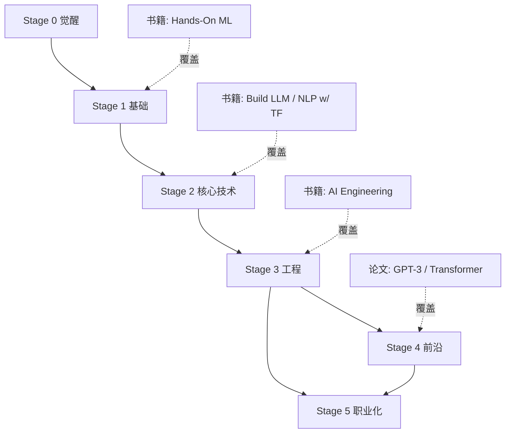

# 学习路径 ↔ 概念交叉映射

> 中文简称：学习路径 ↔ 概念交叉映射

> 本文档是 [[90_学习/pathways/index|学习路径]]（角色路线图）与 [[90_学习/concepts/index|概念分阶]]（知识地图）的交叉引用表。它回答："作为某个角色，我应该掌握哪些阶段的概念，深度如何？"

## 如何使用本映射

- **横向**: 各角色学习路径（LLM 工程师、ML 实践者、产品经理等）
- **纵向**: 六个概念阶段（觉醒 → 基础 → 核心技术 → 工程 → 前沿 → 职业化）
- **单元格**: 该角色对该阶段的掌握深度要求

### 深度等级说明

| 等级 | 含义 | 投入 |
|------|------|------|
| **精通** | 能独立应用并教他人 | 深度学习 + 实战 |
| **掌握** | 能独立完成任务 | 系统学习 |
| **了解** | 能听懂、能讨论 | 快速过一遍 |
| **可选** | 看角色细分方向 | 按需 |

---

## 总览矩阵：角色 × 概念阶段

| 概念阶段 | [[90_学习/02_学习路径/08_llm_engineer|LLM 工程师]] | [[90_学习/02_学习路径/09_ml_practitioner|ML 实践者]] | [[90_学习/02_学习路径/03_ai_researcher|AI 研究员]] | [[90_学习/02_学习路径/10_mlops_engineer|MLOps 工程师]] | [[90_学习/02_学习路径/11_nlp_engineer|NLP 工程师]] | [[90_学习/02_学习路径/04_cv_engineer|CV 工程师]] | [[90_学习/02_学习路径/13_product_manager|产品经理]] | [[90_学习/02_学习路径/01_absolute_beginner|零基础]] |
|---------|-----------|-----------|-----------|-----------|-----------|---------|---------|---------|
| [Stage 0 觉醒](90_学习/01_概念认知/02_stage0_awakening.md) | 掌握 | 掌握 | 掌握 | 掌握 | 掌握 | 掌握 | 掌握 | 掌握 |
| [Stage 1 基础](90_学习/01_概念认知/03_stage1_foundation.md) | 掌握 | 精通 | 精通 | 掌握 | 精通 | 精通 | 了解 | 了解 |
| [Stage 2 核心技术](90_学习/01_概念认知/04_stage2_core_tech.md) | 精通(Transformer/LLM) | 精通 | 精通 | 了解 | 精通(NLP) | 精通(CV) | 了解 | 可选 |
| [Stage 3 工程](90_学习/01_概念认知/05_stage3_engineering.md) | 精通(RAG/Agent) | 掌握 | 了解 | 精通 | 掌握 | 掌握 | 了解 | 可选 |
| [Stage 4 前沿](90_学习/01_概念认知/06_stage4_frontier.md) | 掌握 | 了解 | 精通 | 了解 | 掌握 | 掌握 | 了解 | 可选 |
| [Stage 5 职业化](90_学习/01_概念认知/07_stage5_professional.md) | 掌握 | 掌握 | 可选 | 掌握 | 掌握 | 掌握 | 精通 | 可选 |

---

## 分角色详细映射

### LLM 工程师 (LLM Engineer)

> 聚焦大语言模型应用开发：RAG、Agent、提示工程、微调、部署。

| 阶段 | 深度 | 重点概念 | 推荐资源 |
|------|------|---------|---------|
| Stage 0 | 掌握 | AI 能力边界、工具生态 | [[90_学习/05_参考资料/books/15_ai_engineering_huyen|AI Engineering]] Ch 1 |
| Stage 1 | 掌握 | 训练vs推理、评估指标 | [[90_学习/05_参考资料/books/07_hands_on_ml_geron|Hands-On ML]] Ch 1-3 |
| Stage 2 | **精通** | Transformer、LLM、预训练/微调、Attention | [[90_学习/05_参考资料/books/14_build_llm_from_scratch_raschka|Build LLM]]、[[90_学习/05_参考资料/books/08_hands_on_llms_alammar|Hands-On LLMs]]、[[90_学习/05_参考资料/Papers/04_注意力_Is_All_You_Need_Reading|Transformer 论文]] |
| Stage 3 | **精通** | RAG、向量库、Prompt、Agent、Tool Use、部署 | [[90_学习/05_参考资料/books/15_ai_engineering_huyen|AI Engineering]]、[[90_学习/05_参考资料/books/16_ai_agents_in_action|AI Agents]]、[[90_学习/05_参考资料/books/02_prompt_engineering_for_llms|Prompt Engineering]] |
| Stage 4 | 掌握 | 多模态、Agent 进阶、Scaling Law | [[90_学习/05_参考资料/Papers/02_GPT3_Reading|GPT-3]]、[[90_学习/05_参考资料/books/12_build_reasoning_model|Reasoning Model]] |
| Stage 5 | 掌握 | 跨职能协作、技术选型 | [[90_学习/04_实践指南/02_AI工程路线图2026|路线图 2026]] |

### ML 实践者 (ML Practitioner)

> 聚焦传统机器学习与深度学习的端到端工程。

| 阶段 | 深度 | 重点概念 | 推荐资源 |
|------|------|---------|---------|
| Stage 0 | 掌握 | ML vs 传统编程 | [[90_学习/05_参考资料/books/01_why_machines_learn|Why Machines Learn]] |
| Stage 1 | **精通** | 数据/特征/模型、损失、梯度下降、过拟合、评估 | [[90_学习/05_参考资料/books/07_hands_on_ml_geron|Hands-On ML]] Ch 1-9 |
| Stage 2 | **精通** | 神经网络、反向传播、CNN、RNN | [[90_学习/05_参考资料/books/07_hands_on_ml_geron|Hands-On ML]] Part 2、[[90_学习/05_参考资料/Papers/01_ResNet_Reading|ResNet]] |
| Stage 3 | 掌握 | 部署、MLOps、评估、AI Gateway | [[90_学习/05_参考资料/books/10_designing_ml_systems_huyen|Designing ML Systems]] |
| Stage 4 | 了解 | 世界模型、Scaling Law | [[90_学习/05_参考资料/Projects/01_papers_with_code]] 系列 |
| Stage 5 | 掌握 | 技术战略、团队文化 | [[90_学习/01_概念认知/07_stage5_professional]] |

### AI 研究员 (AI Researcher)

> 聚焦前沿研究与论文复现/创新。

| 阶段 | 深度 | 重点概念 | 推荐资源 |
|------|------|---------|---------|
| Stage 0 | 掌握 | AI 发展史、四次浪潮 | [[90_学习/Courses/microsoft/L01_Introduction_and_History_of_AI|AI 历史]] |
| Stage 1 | **精通** | 全部基础概念（含数学推导） | [[90_学习/05_参考资料/books/11_deep_learning_goodfellow|花书]] |
| Stage 2 | **精通** | 全部核心技术（含从零实现） | [[90_学习/05_参考资料/books/14_build_llm_from_scratch_raschka|Build LLM]]、[[90_学习/05_参考资料/Projects/01_papers_with_code]] 全部 |
| Stage 3 | 了解 | 工程实践（偏理论则可选） | [[90_学习/05_参考资料/books/03_nlp_with_transformers|NLP w/ Transformers]] |
| Stage 4 | **精通** | 多模态、世界模型、AGI、Safety、Scaling Law | [[90_学习/05_参考资料/Papers/02_GPT3_Reading|GPT-3]]、[[90_学习/05_参考资料/Courses/01_sebastian_raschka_articles|Raschka Articles]] |
| Stage 5 | 可选 | 影响力建设（学术发表） | 论文写作资源 |

### MLOps 工程师 (MLOps Engineer)

> 聚焦模型生命周期运维、部署、监控。

| 阶段 | 深度 | 重点概念 | 推荐资源 |
|------|------|---------|---------|
| Stage 0 | 掌握 | AI 能力边界 | 通识资料 |
| Stage 1 | 掌握 | 训练vs推理、评估 | [[90_学习/05_参考资料/books/07_hands_on_ml_geron|Hands-On ML]] Ch 2 |
| Stage 2 | 了解 | 神经网络/Transformer 基础 | [[90_学习/05_参考资料/books/08_hands_on_llms_alammar|Hands-On LLMs]] |
| Stage 3 | **精通** | 部署推理、MLOps、AI Gateway、工作流编排、评估 | [[90_学习/05_参考资料/books/10_designing_ml_systems_huyen|Designing ML Systems]]、[[90_学习/05_参考资料/books/04_llms_in_production|LLMs in Production]] |
| Stage 4 | 了解 | AI 基础设施 2026 | [[90_学习/01_概念认知/06_stage4_frontier]] |
| Stage 5 | 掌握 | 治理合规、团队文化 | [[90_学习/01_概念认知/07_stage5_professional]] |

### NLP 工程师 (NLP Engineer)

> 聚焦自然语言处理：文本分类、NER、翻译、问答。

| 阶段 | 深度 | 重点概念 | 推荐资源 |
|------|------|---------|---------|
| Stage 0 | 掌握 | AI 三大类型 | 通识资料 |
| Stage 1 | **精通** | 数据/特征、三大学习范式 | [[90_学习/05_参考资料/books/07_hands_on_ml_geron|Hands-On ML]] Ch 3 |
| Stage 2 | **精通** | Transformer、LLM、预训练/微调、表示学习、Attention | [[90_学习/05_参考资料/books/03_nlp_with_transformers|NLP w/ Transformers]]、[[90_学习/05_参考资料/Papers/03_BERT_Reading|BERT]]、[[90_学习/05_参考资料/Papers/04_注意力_Is_All_You_Need_Reading|Transformer]] |
| Stage 3 | 掌握 | RAG、Prompt、部署 | [[90_学习/05_参考资料/books/15_ai_engineering_huyen|AI Engineering]] |
| Stage 4 | 掌握 | 多模态、Agent 进阶 | [[90_学习/05_参考资料/Papers/02_GPT3_Reading|GPT-3]] |
| Stage 5 | 掌握 | 跨职能协作 | [[90_学习/01_概念认知/07_stage5_professional]] |

### CV 工程师 (CV Engineer)

> 聚焦计算机视觉：分类、检测、分割、生成。

| 阶段 | 深度 | 重点概念 | 推荐资源 |
|------|------|---------|---------|
| Stage 0 | 掌握 | 经典 AI 案例（ImageNet） | [[90_学习/01_概念认知/02_stage0_awakening]] |
| Stage 1 | **精通** | 数据/特征、评估指标 | [[90_学习/05_参考资料/books/07_hands_on_ml_geron|Hands-On ML]] |
| Stage 2 | **精通** | CNN、神经网络、反向传播、扩散模型 | [[90_学习/05_参考资料/books/07_hands_on_ml_geron|Hands-On ML]] Ch 14、[[90_学习/05_参考资料/Papers/01_ResNet_Reading|ResNet]] |
| Stage 3 | 掌握 | 部署推理、评估 | [[90_学习/05_参考资料/books/10_designing_ml_systems_huyen|Designing ML Systems]] |
| Stage 4 | 掌握 | 多模态、VLA/具身智能、世界模型 | [[90_学习/01_概念认知/06_stage4_frontier]] |
| Stage 5 | 掌握 | 技术选型 | [[90_学习/01_概念认知/07_stage5_professional]] |

### AI 产品经理 (Product Manager)

> 聚焦 AI 产品设计、需求、落地，不深入代码。

| 阶段 | 深度 | 重点概念 | 推荐资源 |
|------|------|---------|---------|
| Stage 0 | 掌握 | AI 能力边界、工具生态、伦理 | [[90_学习/05_参考资料/books/01_why_machines_learn|Why Machines Learn]] |
| Stage 1 | 了解 | 训练vs推理、评估指标 | 通识资料 |
| Stage 2 | 了解 | LLM、Transformer（概念级） | [[90_学习/05_参考资料/books/08_hands_on_llms_alammar|Hands-On LLMs]]（图解） |
| Stage 3 | 了解 | RAG、Agent、评估（产品视角） | [[90_学习/05_参考资料/books/15_ai_engineering_huyen|AI Engineering]]（选读） |
| Stage 4 | 了解 | 多模态、AGI 路径 | [[90_学习/01_概念认知/06_stage4_frontier]] |
| Stage 5 | **精通** | 跨职能协作、技术沟通、技术战略、治理 | [[90_学习/02_学习路径/13_product_manager|PM 路径]] |

### 零基础学习者 (Absolute Beginner)

> 目标是建立通识认知，不深入技术。

| 阶段 | 深度 | 重点概念 | 推荐资源 |
|------|------|---------|---------|
| Stage 0 | 掌握 | 全部（AI 定义、能力边界、历史、伦理） | [[90_学习/03_课程资源/microsoft/02_microsoft_ai_for_beginners|MS AI 入门]] |
| Stage 1 | 了解 | 数据/模型/训练（概念级） | [[90_学习/05_参考资料/books/01_why_machines_learn|Why Machines Learn]] |
| Stage 2 | 可选 | LLM/Transformer（感兴趣再看） | [[90_学习/05_参考资料/books/08_hands_on_llms_alammar|Hands-On LLMs]] |
| Stage 3-5 | 可选 | 按兴趣探索 | [[90_学习/02_学习路径/01_absolute_beginner|零基础路径]] |

---

## 反向映射：概念 × 角色

从概念角度，看哪些角色最需要掌握它：

| 核心概念 | 最相关角色 | 知识库章节 |
|---------|-----------|-----------|
| Transformer/Attention | LLM 工程师、NLP、研究员 | [[05_大模型/01_LLM基础]]、[[90_学习/05_参考资料/Papers/04_注意力_Is_All_You_Need_Reading]] |
| RAG | LLM 工程师、NLP、MLOps | [[14_RAG系统/01_RAG基础/07_RAG_系统]] |
| AI Agent | LLM 工程师、PM | [[15_智能体/]] |
| 部署推理 | MLOps、LLM 工程师 | [[10_部署推理/]] |
| 评估指标 | ML 实践者、MLOps、PM | [[08_模型评估/]] |
| CNN/视觉 | CV 工程师 | [[04_计算机视觉/]] |
| MLOps | MLOps、ML 实践者 | [[11_模型运维/]] |
| Scaling Law | 研究员、LLM 工程师 | [[90_学习/05_参考资料/Papers/02_GPT3_Reading]] |
| AI Safety | 研究员、PM | [[17_伦理安全/]] |
| 职业化/领导力 | 所有高级角色 | [[90_学习/01_概念认知/07_stage5_professional]] |

---

## 资源 ↔ 概念映射

| 资源 | 覆盖的核心概念 |
|------|---------------|
| [[90_学习/05_参考资料/books/15_ai_engineering_huyen|AI Engineering]] | RAG、Agent、部署、评估、安全、架构（Stage 3-4） |
| [[90_学习/05_参考资料/books/07_hands_on_ml_geron|Hands-On ML]] | 数据、训练、CNN/RNN/Transformer、评估（Stage 1-2） |
| [[90_学习/05_参考资料/books/14_build_llm_from_scratch_raschka|Build LLM]] | 分词、Attention、GPT、预训练、微调（Stage 2） |
| [[90_学习/05_参考资料/books/08_hands_on_llms_alammar|Hands-On LLMs]] | Token/Embedding、Transformer、Prompt、RAG、微调（Stage 2-3） |
| [[90_学习/05_参考资料/books/03_nlp_with_transformers|NLP w/ Transformers]] | Transformer、BERT、微调、蒸馏（Stage 2-3） |
| [[90_学习/05_参考资料/books/16_ai_agents_in_action|AI Agents]] | Agent、工具、记忆、规划、多 Agent（Stage 3） |
| [[90_学习/05_参考资料/Papers/04_注意力_Is_All_You_Need_Reading|Transformer 论文]] | Attention、Transformer 架构（Stage 2） |
| [[90_学习/05_参考资料/Papers/03_BERT_Reading|BERT 论文]] | MLM、双向编码器、预训练范式（Stage 2） |
| [[90_学习/05_参考资料/Papers/02_GPT3_Reading|GPT-3 论文]] | Scaling Law、In-Context Learning、Few-Shot（Stage 4） |
| [[90_学习/05_参考资料/Papers/01_ResNet_Reading|ResNet 论文]] | 残差连接、深度网络、CNN（Stage 2） |
| [[90_学习/05_参考资料/books/10_designing_ml_systems_huyen|Designing ML Systems]] | MLOps、系统设计、数据工程（Stage 3） |

---

## 概念依赖与学习顺序建议



## 快速决策树：不知道该学什么？

```
你的目标是什么?
├─ 通识了解 AI → Stage 0 + Stage 1（了解级）→ [[90_学习/pathways/absolute-beginner]]
├─ 做 AI 产品/管理 → Stage 0 + Stage 3（产品视角）+ Stage 5 → [[90_学习/pathways/product-manager]]
├─ 做 LLM 应用 → Stage 1-3（精通）→ [[90_学习/pathways/llm-engineer]]
├─ 做传统 ML → Stage 1-2（精通）+ Stage 3 → [[90_学习/pathways/ml-practitioner]]
├─ 做运维部署 → Stage 1 + Stage 3（精通）→ [[90_学习/pathways/mlops-engineer]]
├─ 做研究/读论文 → Stage 1-4（精通）→ [[90_学习/pathways/ai-researcher]]
└─ 已有经验，查漏补缺 → 查本映射表，定位薄弱阶段
```

## Related

- [[90_学习/concepts/index|概念分阶索引]] — 知识地图
- [[90_学习/pathways/index|学习路径索引]] — 角色路线
- [[90_学习/guides/index|学习指南索引]] — 方法论
- [[90_学习/README.md|书籍参考]] — 书籍库
- [[90_学习/05_参考资料/Projects/01_papers_with_code|论文导读]] — 论文库
- [[90_学习/04_实践指南/02_AI工程路线图2026|AI 工程路线图 2026]]
- [[05_大模型/]] — 大模型章节
- [[03_深度学习/]] — 深度学习章节
- [[15_智能体/]] — Agent 章节

> **关联**: → [[90_学习/concepts/index|概念分阶]] | [[90_学习/pathways/index|学习路径]] | [[90_学习/guides/index|学习指南]] | [[90_学习/README.md|书籍]] | [[90_学习/05_参考资料/Projects/01_papers_with_code|论文]]
