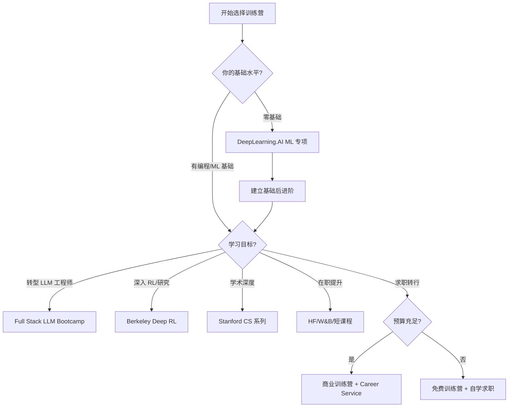

# AI 工程训练营指南 2026 (AI Engineering Bootcamps Guide)

> 中文简称：AI 工程训练营指南 2026

> **一句话理解**: 训练营就像健身房的"私教课"——相比自学（自己摸索器械），训练营提供结构化课程、实战项目与社区氛围，能在短期内高强度建立技能。但私教课不能替你长肌肉，训练营的价值最终取决于你的投入与后续实践。

---

## 为什么需要这份指南？

2025-2026 年，AI 工程训练营迎来爆发式增长：

- **需求侧**: LLM/Agent 工程师缺口巨大，传统 CS 教育跟不上技术迭代
- **供给侧**: 高校（Berkeley、Stanford）、平台（DeepLearning.AI）、社区（Full Stack DL）纷纷推出训练营
- **挑战**: 选择过多、质量参差、价格悬殊（免费 → 数千美元），学习者难以决策

本指南系统梳理主流训练营，提供**对比、选择、路径、价值**四个维度的决策支持。

**适用读者**:
- 想转型 AI 工程的开发者
- 想系统提升的在职工程师
- 评估认证价值的求职者
- 制定团队培训方案的技术负责人

---

## 训练营 vs 自学 vs 学位：三种路径对比

在深入具体训练营前，先理解训练营在整体学习路径中的定位：

| 维度 | 训练营 (Bootcamp) | 自学 (Self-study) | 学位 (Degree) |
|------|------------------|-------------------|---------------|
| **时间投入** | 数周-数月 | 灵活（数月起） | 1-4 年 |
| **成本** | 免费-数千美元 | 低（书籍/课程） | 数万-数十万美元 |
| **结构化程度** | 高（预设路径） | 低（需自律） | 高（系统课程） |
| **实战项目** | 丰富（核心卖点） | 需自驱 | 视项目而定 |
| **社区/人脉** | 强（同期学员） | 弱 | 强（校友网络） |
| **理论深度** | 中（够用即可） | 自控 | 深（学术训练） |
| **就业支持** | 部分提供 | 无 | 强（校招） |
| **认证价值** | 中（技能证明） | 无 | 高（学历） |
| **适合人群** | 转型/速成/在职提升 | 自律强者/预算有限 | 应届生/研究导向 |

**核心洞察**: 训练营最适合"有一定基础、想快速转型或系统提升、需要结构与社区"的学习者。零基础纯新手可能需要先补基础，纯研究者更适合学位。

---

## 主流训练营全景对比

### 1. Full Stack LLM Bootcamp

| 属性 | 说明 |
|------|------|
| **主办方** | UC Berkeley（Full Stack Deep Learning 团队） |
| **形式** | 免费视频课程 + 实操 Notebook |
| **时长** | 约 10-15 小时（自定进度） |
| **成本** | 免费 |
| **难度** | ⭐⭐⭐（中级） |
| **链接** | [fullstackdeeplearning.com](https://fullstackdeeplearning.com/llm-bootcamp/) |

**核心内容**:
- LLM 基础与训练流程
- 提示工程与上下文工程
- RAG 系统构建
- 微调（Fine-tuning）实战
- LLM 评估方法
- 推理优化与部署
- LLM 应用架构（Agent、工具调用）
- 生产化最佳实践

**适合人群**: 有编程基础、想快速掌握 LLM 应用全栈技能的工程师

**优势**:
- 完全免费，质量极高（Berkeley 出品）
- 覆盖 LLM 应用全栈（从训练到部署）
- 实操性强，配套可运行 Notebook
- 讲师来自业界一线（Anyscale、Hugging Face 等）

**局限**:
- 无证书/认证
- 无直播互动（录播为主）
- 需要一定 ML 基础

---

### 2. Berkeley Deep RL Bootcamp

| 属性 | 说明 |
|------|------|
| **主办方** | UC Berkeley（BAIR 实验室） |
| **形式** | 免费视频讲座 + 作业 |
| **时长** | 约 20+ 小时 |
| **成本** | 免费 |
| **难度** | ⭐⭐⭐⭐（中高级） |
| **链接** | Berkeley Deep RL Bootcamp 官网 |

**核心内容**:
- 强化学习基础（MDP、值函数、策略梯度）
- 深度 Q 网络（DQN）
- 策略梯度方法（REINFORCE、Actor-Critic）
- PPO 与近端策略优化
- 模型基础 RL（Model-Based RL）
- 离线 RL 与 RLHF
- 多智能体 RL
- RL 在 LLM 中的应用（推理模型训练）

**适合人群**: 想深入理解 RL（尤其是 RLHF、推理模型训练）的研究者与算法工程师

**优势**:
- 学术权威（Berkeley BAIR，Pieter Abbeel、Sergey Levine 等大神）
- 理论扎实，数学严谨
- 覆盖 RLHF 等前沿（与推理模型训练直接相关）
- 免费且高质量

**局限**:
- 数学门槛高（需概率、优化基础）
- 偏研究/理论，工程实战较少
- 无证书

**与知识库关联**: → [[06_强化学习/]] | [[07_模型训练/]] | [[90_学习/05_参考资料/books/12_build_reasoning_model|Build a Reasoning Model]]

---

### 3. Stanford CS229 / CS224N / CS231N

| 属性 | 说明 |
|------|------|
| **主办方** | Stanford University |
| **形式** | 大学课程（视频 + 作业 + 项目）公开 |
| **时长** | 一学期（约 10 周，每周 5-10 小时） |
| **成本** | 免费（公开材料）/ 付费（选修学分） |
| **难度** | ⭐⭐⭐⭐（高级） |
| **链接** | [cs229.stanford.edu](https://cs229.stanford.edu/) |

**核心课程**:
- **CS229 Machine Learning**: 经典 ML 理论与算法（Andrew Ng 等）
- **CS224N NLP with Deep Learning**: 深度学习与 NLP（含 Transformer、LLM）
- **CS231N CNN for Visual Recognition**: 计算机视觉
- **CS25 Transformers United**: Transformer 专题（前沿）
- **CS336 LLMs From Scratch**: 从零构建 LLM（2025 新开）

**适合人群**: 想获得学术级深度、有较强数学基础的学习者

**优势**:
- 学术深度无出其右
- 教授均为领域顶尖（Ng、Manning、LeCun 客座等）
- 作业与项目质量高
- CS336 等新课紧跟 LLM 前沿

**局限**:
- 数学门槛高（线代、概率、优化）
- 偏理论，工程化不足
- 学习曲线陡峭
- 无结构化"训练营"体验（需自驱）

**与知识库关联**: → [[02_机器学习/]] | [[03_深度学习/]] | [[05_大模型/]] | [[01_数学基础/]]

---

### 4. DeepLearning.AI 专项课程与训练营

| 属性 | 说明 |
|------|------|
| **主办方** | DeepLearning.AI（Andrew Ng 创立） |
| **形式** | 在线课程（Coursera）+ 短课程 + 训练营 |
| **时长** | 短课程 1-3 小时 / 专项课程数周 / 训练营数周 |
| **成本** | 短课程免费 / 专项课程订阅制 / 训练营付费 |
| **难度** | ⭐⭐（入门→中级） |
| **链接** | [deeplearning.ai](https://www.deeplearning.ai/) |

**核心内容**:
- **短课程（Short Courses）**: 与 OpenAI、LangChain、Hugging Face 等合作的 1-2 小时专题（提示工程、RAG、Agent、微调）
- **专项课程（Specializations）**:
  - Machine Learning Specialization（ML 基础）
  - Deep Learning Specialization（深度学习经典）
  - Generative AI 系列
- **AI 工程训练营**: 结构化的 LLM 应用工程训练

**适合人群**: 初学者到中级，想循序渐进、需要证书的学习者

**优势**:
- Andrew Ng 的教学功力（讲解清晰、循序渐进）
- 短课程紧跟前沿（与业界合作，更新快）
- 提供证书（Coursera 认证）
- 入门友好，门槛低

**局限**:
- 深度有限（偏入门与概览）
- 部分短课程"浅尝辄止"
- 证书含金量争议（见后文认证价值分析）

**与知识库关联**: → [[00_入门/]] | [[05_大模型/08_提示工程/16_Prompt工程]] | [[14_RAG系统/]]

---

### 5. 其他值得关注的训练营

#### Hugging Face 课程与训练营

| 属性 | 说明 |
|------|------|
| **形式** | 免费开源课程 + 社区 |
| **核心内容** | NLP 课程、LLM 课程、Agent 课程、RL 课程 |
| **特色** | 紧贴开源生态、动手实操、社区活跃 |
| **适合** | 想用开源工具（Transformers、TRL）实战的开发者 |
| **链接** | Hugging Face Learn |

#### Weights & Biases 训练营

| 属性 | 说明 |
|------|------|
| **形式** | 免费实操课程 |
| **核心内容** | 实验跟踪、LLM 监控、RAG 评估、模型优化 |
| **特色** | 聚焦 MLOps 与可观测性 |
| **适合** | ML 平台工程师、关注实验管理的开发者 |

#### 商业训练营（General Assembly、Springboard 等）

| 属性 | 说明 |
|------|------|
| **形式** | 付费（数千-上万美元）、直播 + 项目 + 就业支持 |
| **核心内容** | ML/AI 工程全栈、求职辅导 |
| **特色** | 就业导向、导师制、Career Service |
| **适合** | 转行者、需要就业支持的求职者 |
| **注意** | 价格高，需评估 ROI |

---

## 训练营横向对比表

| 训练营 | 主办方 | 成本 | 难度 | 时长 | 证书 | 实战 | 理论 | 适合人群 |
|--------|--------|------|------|------|------|------|------|----------|
| **Full Stack LLM** | Berkeley | 免费 | ⭐⭐⭐ | 10-15h | 无 | 强 | 中 | LLM 应用工程师 |
| **Deep RL Bootcamp** | Berkeley | 免费 | ⭐⭐⭐⭐ | 20h+ | 无 | 中 | 强 | RL/研究者 |
| **Stanford CS 系列** | Stanford | 免费/付费 | ⭐⭐⭐⭐ | 10 周 | 选修 | 中 | 极强 | 学术/深度 |
| **DeepLearning.AI** | Andrew Ng | 免费/订阅 | ⭐⭐ | 灵活 | 有 | 中 | 中 | 初学者 |
| **Hugging Face** | HF | 免费 | ⭐⭐⭐ | 灵活 | 有 | 极强 | 中 | 开源实战 |
| **W&B 训练营** | W&B | 免费 | ⭐⭐⭐ | 数小时 | 有 | 强 | 弱 | MLOps |
| **商业训练营** | 各机构 | 高 | ⭐⭐⭐ | 数月 | 有 | 强 | 中 | 转行/求职 |

---

## 选择指南：如何挑选适合你的训练营

### 决策维度

选择训练营时，从以下 6 个维度评估：

1. **当前水平**: 你的数学/16_编程/ML 基础如何？
2. **学习目标**: 转型求职？技能提升？学术研究？兴趣探索？
3. **时间预算**: 能投入多少时间（每周/总计）？
4. **经济预算**: 能接受的成本范围？
5. **学习偏好**: 喜欢理论 vs 实战？自驱 vs 需要结构？
6. **认证需求**: 是否需要证书/就业支持？

### 按场景推荐

#### 场景 A: 零基础想入门 AI

- **首选**: DeepLearning.AI Machine Learning Specialization
- **路径**: ML 基础 → Deep Learning Specialization → 短课程探索方向
- **理由**: 入门友好、循序渐进、有证书激励
- **配套**: [[90_学习/05_参考资料/books/07_hands_on_ml_geron|Hands-On ML]] + [[90_学习/05_参考资料/books/09_dl_with_python_chollet|Deep Learning with Python]]

#### 场景 B: 开发者想转型 LLM 工程师

- **首选**: Full Stack LLM Bootcamp
- **路径**: LLM 基础 → RAG/微调实战 → 部署 → 综合项目
- **理由**: 免费、全栈、实战强、紧跟前沿
- **配套**: [[90_学习/05_参考资料/books/15_ai_engineering_huyen|AI Engineering]] + [[90_学习/05_参考资料/books/05_llm_engineers_handbook|LLM Engineer's Handbook]]

#### 场景 C: 想深入 RL / 推理模型训练

- **首选**: Berkeley Deep RL Bootcamp
- **路径**: RL 基础 → 策略梯度 → PPO → RLHF → 推理模型
- **理由**: 学术权威、覆盖 RLHF 前沿
- **配套**: [[90_学习/05_参考资料/books/12_build_reasoning_model|Build a Reasoning Model]] + [[06_强化学习/]]

#### 场景 D: 追求学术深度 / 研究导向

- **首选**: Stanford CS229 / CS224N / CS336
- **路径**: CS229（ML 理论）→ CS224N（NLP/LLM）→ CS336（LLM 从零）
- **理由**: 学术深度顶尖、教授权威
- **配套**: [[90_学习/05_参考资料/books/11_deep_learning_goodfellow|Deep Learning (花书)]]

#### 场景 E: 需要就业支持 / 转行

- **首选**: 商业训练营（含 Career Service）或 DeepLearning.AI + 求职辅导
- **路径**: 系统课程 → 项目作品集 → 求职辅导 → 面试准备
- **理由**: 就业导向、导师制、结构化
- **配套**: [[21_面试岗位/]] + [[90_学习/04_实践指南/02_AI工程路线图2026|AI 工程路线图]]

#### 场景 F: 在职工程师技能提升

- **首选**: Hugging Face 课程 + W&B 训练营 + 短课程
- **路径**: 按需选择专题（RAG、Agent、评估、MLOps）
- **理由**: 灵活、实战、紧贴工具生态
- **配套**: [[90_学习/05_参考资料/books/04_llms_in_production|LLMs in Production]]

### 决策流程图



---

## 学习路径：训练营组合方案

单一训练营往往不够，以下是经过验证的**组合学习路径**。

### 路径 1: LLM 应用工程师（3-4 个月）

```
阶段 1 (Week 1-2): 基础铺垫
  - DeepLearning.AI 短课程: 提示工程、LangChain 入门
  - 配套: [[prompt-engineering-for-llms]]

阶段 2 (Week 3-6): 核心技能
  - Full Stack LLM Bootcamp (全程)
  - 重点: RAG、微调、评估、部署
  - 配套: [[90_学习/05_参考资料/books/15_ai_engineering_huyen]]

阶段 3 (Week 7-10): 实战深化
  - Hugging Face LLM/Agent 课程
  - 完成 1-2 个完整项目 (RAG 系统 + Agent)
  - 配套: [[llm-engineers-handbook]]

阶段 4 (Week 11-14): 生产化
  - W&B 训练营 (监控/评估)
  - 学习生产化最佳实践
  - 配套: [[llms-in-production]]
```

### 路径 2: ML/AI 研究员（6+ 个月）

```
阶段 1 (Month 1-2): 数学与 ML 基础
  - Stanford CS229
  - 配套: [[deep-learning-goodfellow]] Part 1-2

阶段 2 (Month 3-4): 深度学习
  - Stanford CS224N / CS231N (按方向)
  - 配套: [[dl-with-python-chollet]]

阶段 3 (Month 5): 强化学习
  - Berkeley Deep RL Bootcamp
  - 配套: [[build-reasoning-model]]

阶段 4 (Month 6+): 前沿研究
  - Stanford CS25 / CS336
  - 阅读论文 + 复现
  - 配套: [[20_论文精读/]]
```

### 路径 3: MLOps / AI 平台工程师（2-3 个月）

```
阶段 1 (Week 1-3): ML 系统基础
  - DeepLearning.AI ML 专项 (概览)
  - 配套: [[designing-ml-systems-huyen]]

阶段 2 (Week 4-6): 实验与监控
  - W&B 训练营
  - 配套: [[12_架构基建/]]

阶段 3 (Week 7-10): LLM 生产化
  - Full Stack LLM Bootcamp (部署部分)
  - 配套: [[llms-in-production]]

阶段 4 (Week 11-12): 综合实战
  - 搭建完整 MLOps 管道
  - 配套: [[llm-engineers-handbook]]
```

---

## 2026 新兴训练营趋势

2026 年，AI 工程训练营呈现以下新趋势：

### 趋势 1: Agent 工程训练营崛起

随着 AI Agent 成为应用主流，专门的 Agent 工程训练营大量涌现：
- **多 Agent 系统**: 编排、通信、协作
- **工具调用与 MCP**: Model Context Protocol 集成
- **Agent 评估与可靠性**: 生产级 Agent 的挑战
- **关联**: [[15_智能体/]] | [[90_学习/05_参考资料/books/13_build_multi_agent_system|Build a Multi-Agent System]]

### 趋势 2: 推理模型与 RL 训练实战化

继 DeepSeek-R1、OpenAI o3 之后，推理模型训练从研究走向工程：
- **GRPO/PPO 实战**: 用 TRL/OpenRLHF 训练推理模型
- **奖励建模**: PRM/ORM 工程实践
- **关联**: [[90_学习/05_参考资料/books/12_build_reasoning_model|Build a Reasoning Model]] | [[06_强化学习/]]

### 趋势 3: 上下文工程取代提示工程

"Context Engineering" 成为新热点，训练营开始系统讲解：
- 上下文组装与压缩
- 长上下文管理
- 多源信息融合
- **关联**: [[05_大模型/08_提示工程/16_Prompt工程]]

### 趋势 4: 垂直领域 AI 工程

针对特定行业的训练营增多：
- **AI for 金融**: 风控、量化、合规
- **AI for 医疗**: 诊断辅助、药物发现
- **AI for 法律**: 合同分析、案例检索
- **关联**: [[18_行业应用/]]

### 趋势 5: 企业级 AI 工程训练营

面向企业团队的定制化训练：
- 内部 LLM 平台搭建
- 数据治理与合规
- 成本优化与 ROI
- **关联**: [[治理/]] | [[12_架构基建/]]

### 趋势 6: 开源与社区驱动

免费、开源、社区驱动的训练营越来越受欢迎：
- Hugging Face 社区课程
- 开源项目实战（贡献即学习）
- 社区学习小组（Study Group）

---

## 认证价值分析

### 训练营证书的含金量

训练营证书的价值是学习者最关心的问题之一。客观分析：

#### 证书的实际价值

| 证书类型 | 含金量 | 求职作用 | 说明 |
|----------|--------|----------|------|
| **DeepLearning.AI/Coursera** | ⭐⭐⭐ | 中 | 证明系统学习过，HR 认可度中等 |
| **Stanford/Berkeley 公开课程** | ⭐⭐ | 低-中 | 无正式证书，但课程本身权威 |
| **Hugging Face** | ⭐⭐⭐ | 中 | 业界认可，证明开源工具能力 |
| **商业训练营** | ⭐⭐⭐ | 中 | 视机构声誉，部分有就业合作 |
| **大学学位/学分** | ⭐⭐⭐⭐⭐ | 高 | 学历硬通货 |
| **云厂商认证** (AWS/GCP AI) | ⭐⭐⭐⭐ | 中-高 | 企业认可度高，实用 |

#### 关键认知

1. **证书 ≠ 能力**: 雇主最终看的是**项目作品集**与**实际技能**，证书只是敲门砖
2. **项目 > 证书**: 一个高质量的 GitHub 项目（如完整 RAG 系统）比 10 个证书更有说服力
3. **证书的真正价值**:
   - **结构化学习的承诺机制**: 付费/注册倒逼你完成学习
   - **知识体系的完整性证明**: 证明你系统学过
   - **求职简历的补充**: 锦上添花，非雪中送炭
4. **高 ROI 认证**: 云厂商 AI 认证（AWS ML Specialty、GCP Professional ML）在企业招聘中认可度较高

### 比证书更重要的东西

```
求职竞争力排序 (AI 工程岗):
1. 实战项目作品集 (GitHub + 部署 Demo)
2. 相关工作/实习经验
3. 技术博客/开源贡献
4. 面试表现 (系统设计 + 编码)
5. 训练营证书 / 课程认证
6. 学历 (相关岗位)
```

**建议**: 把训练营当作"学技能 + 做项目"的机会，证书是副产品。学完后产出 1-2 个可展示的项目，远比收集证书有价值。

---

## 训练营学习的最佳实践

### 学习前

- **明确目标**: 为什么学？学完要达成什么？
- **评估基础**: 缺什么补什么（数学/16_编程/ML 基础）
- **预留时间**: 训练营需要持续投入，避免"注册即放弃"
- **准备环境**: GPU 资源（Colab/Kaggle/云）、开发环境

### 学习中

- **动手优先**: 每个 Notebook 亲自跑，而非只看视频
- **做笔记**: 用知识库（如本 Obsidian vault）记录与连接
- **参与社区**: 加入训练营的 Discord/论坛，提问与讨论
- **完成项目**: 必做项目 + 自创扩展项目
- **定期复盘**: 每周总结学到了什么、卡在哪里

### 学习后

- **产出作品**: 把项目整理成 GitHub 作品集
- **写博客**: 输出倒逼输入，加深理解
- **持续实践**: 训练营结束才是真正学习的开始
- **加入社区**: 持续与同行交流，跟上技术迭代
- **反哺知识库**: 把所学沉淀到 [[90_学习/]] 章节

---

## 与知识库的整合

本指南是 [[90_学习/]] 章节的组成部分，与其他学习资源形成完整体系：

### 学习资源矩阵

| 资源类型 | 代表 | 作用 |
|----------|------|------|
| **训练营** | 本指南 | 结构化、高强度、社区 |
| **书籍** | [[90_学习/References/books/index]] | 系统、深入、可反复 |
| **学习路径** | [[90_学习/04_实践指南/05_learning_paths_2026]] | 角色化、序列化 |
| **路线图** | [[90_学习/04_实践指南/02_AI工程路线图2026]] | 全景、里程碑 |
| **项目指南** | [[90_学习/05_参考资料/Projects/03_500_ai_projects]] | 实战、动手 |
| **自我评估** | [[90_学习/04_实践指南/08_skills_self_assessment]] | 定位、查漏补缺 |

### 推荐组合

- **训练营 + 书籍**: 训练营提供结构与节奏，书籍提供深度与参考
  - 例: Full Stack LLM Bootcamp + [[90_学习/05_参考资料/books/15_ai_engineering_huyen]]
- **训练营 + 项目**: 训练营学方法，项目练能力
  - 例: Berkeley Deep RL + 复现一个推理模型
- **训练营 + 知识库**: 训练营输入，知识库沉淀
  - 例: 学完 RAG 训练营 → 完善 [[14_RAG系统/]] 章节

---

## 常见问题 (FAQ)

### Q1: 训练营和看书哪个更好？

**A**: 不是二选一，而是互补。训练营提供**结构、节奏、社区、实战**，适合快速建立框架；书籍提供**深度、系统、可反复查阅**，适合夯实基础。理想组合是"训练营领进门 + 书籍深挖"。

### Q2: 免费训练营质量靠谱吗？

**A**: 顶级免费训练营（Full Stack LLM、Berkeley Deep RL、Stanford CS、Hugging Face）质量极高，甚至超过很多付费课程。免费不等于低质——这些由顶尖高校/机构出品，靠声誉而非学费驱动。

### Q3: 需要辞职全职学习吗？

**A**: 大多数训练营支持在职学习。免费自定进度训练营（Full Stack LLM、HF）尤其适合在职者。商业全职训练营适合需要快速转行且有经济缓冲的人。建议优先尝试在职学习，验证兴趣与适配度。

### Q4: 学完训练营就能找到工作吗？

**A**: 训练营是必要条件，非充分条件。求职成功取决于：项目作品集 + 实战能力 + 面试表现 + 市场状况。把训练营当作"技能加速器"，而非"就业保证"。

### Q5: 数学基础不好能学吗？

**A**: 分情况。LLM 应用工程（Full Stack LLM、DeepLearning.AI）对数学要求不高，编程能力更重要；RL/研究（Berkeley Deep RL、Stanford CS229）需要扎实数学。数学薄弱者可先用 [[90_学习/05_参考资料/books/01_why_machines_learn|Why Machines Learn]] 建立直觉，再补 [[01_数学基础/]]。

### Q6: 如何避免"训练营收集癖"？

**A**: 注册一堆训练营却不完成是常见问题。对策：(1) 一次只学一个；(2) 设定明确截止日期；(3) 以"完成项目"而非"看完视频"为目标；(4) 找学习伙伴互相督促。

---

## 总结

2026 年的 AI 工程训练营生态空前繁荣，从免费顶尖课程（Berkeley、Stanford、Hugging Face）到付费商业训练营，选择丰富。关键不是"选最贵的"或"选最多的"，而是：

1. **明确目标**: 你想成为什么角色？（参考 [[90_学习/04_实践指南/05_learning_paths_2026]]）
2. **匹配基础**: 选难度适配的训练营
3. **组合学习**: 训练营 + 书籍 + 项目 + 知识库
4. **重在实践**: 产出项目作品集，而非收集证书
5. **持续迭代**: 技术变化快，养成终身学习习惯

> **记住**: 训练营是"加速器"，不是"终点站"。真正的能力来自持续的实践与思考。

---

## 延伸阅读

- [[90_学习/04_实践指南/02_AI工程路线图2026|AI 工程路线图 2026]] — 全景技能地图
- [[90_学习/04_实践指南/05_learning_paths_2026|学习路径指南]] — 角色化学习路径
- [[90_学习/05_参考资料/Projects/03_500_ai_projects|AI 项目指南]] — 实战项目
- [[90_学习/04_实践指南/08_skills_self_assessment|技能自我评估]] — 定位与查漏
- [[90_学习/References/books/index|书籍索引]] — 配套参考书
- [[21_面试岗位/]] — 求职与面试

> **关联**: → [[90_学习/04_实践指南/02_AI工程路线图2026|AI 工程路线图]] | [[90_学习/04_实践指南/05_learning_paths_2026|学习路径]] | [[90_学习/References/books/index|书籍索引]] | [[15_智能体/]] | [[06_强化学习/]]
