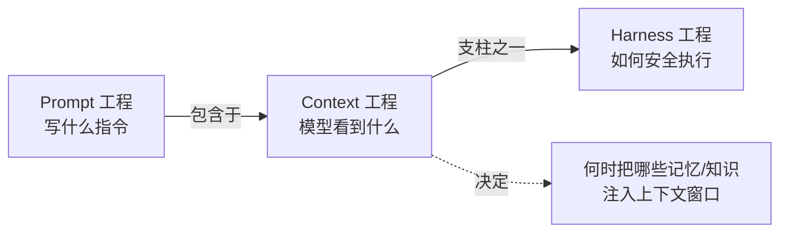
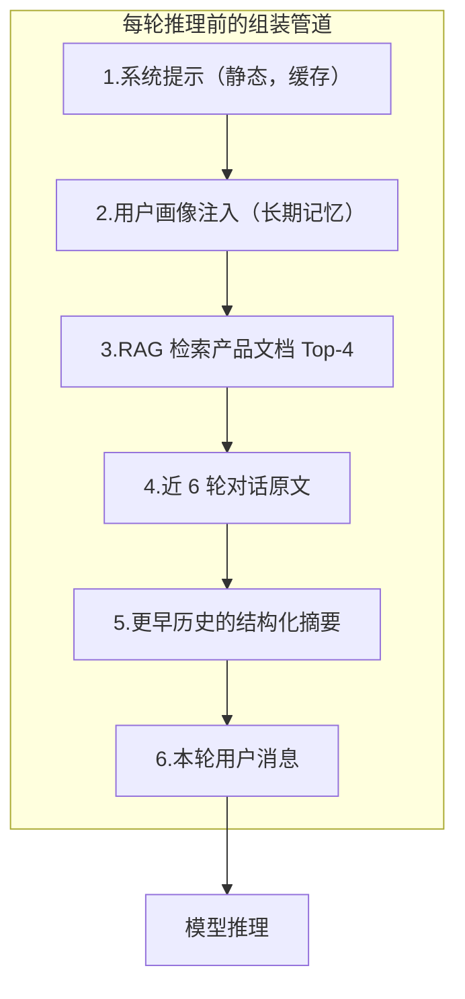

# Context Engineering in Nutshell（Context 工程速成指南）

> 中文简称：Context 工程速成指南

> **一句话理解**: Context 工程就是"管理 AI 的注意力"——决定它在每一步能看到什么，就决定了它能想到什么。

Related: [[05_大模型/07_提示工程/01_Context_工程_指南|Context 工程指南]] | [[05_大模型/07_提示工程/02_Context_工程_模式|Context 工程模式]] | [[15_智能体/01_Agent基础/02_Agent工程_方法论_系统_2026|Agent 工程方法论体系 2026]]

**阅读时间**：约 30 分钟 | **目标读者**：已会写 Prompt、想构建多轮/Agent 系统的人 | **学完能做什么**：设计一套"什么信息、在什么时候、以什么形式进入模型上下文"的管理策略

---

## 1. 从 Prompt 工程到 Context 工程

### 1.1 定义

**Context Engineering（上下文工程）** 是对"模型在每一步推理时能看到的全部信息"进行设计与动态管理的工程方法。它的对象不再是一条静态指令，而是由四部分动态组成的**信息环境**：

```text
上下文窗口 = 系统提示 + 检索内容（RAG/记忆） + 工具定义与结果 + 对话历史
```

### 1.2 为什么 Prompt 工程不够了

| 场景 | Prompt 工程的极限 | Context 工程的做法 |
|------|------------------|-------------------|
| 知识量超过窗口 | 塞不下 | 按需检索（RAG）注入 |
| 多轮对话失忆 | 无法在单条指令中解决 | 历史管理与摘要压缩 |
| 每个用户要不同指令 | 手写 N 份 Prompt | 动态组装管道 |
| Agent 执行 100 步 | 工具输出淹没原始指令 | 输出裁剪 + Compaction |

### 1.3 一句话定位

> Anthropic 的定义：**上下文工程是提示词工程的自然演进**——从"写一条好指令"到"策划整个信息环境"。在 Harness 工程中，它对应"上下文动态管理"这一支柱。



**图表说明**：Context 工程决定"何时、把什么注入窗口"；Harness 工程把它作为子系统纳入更大的执行治理框架。

---

## 2. 三个第一性概念

### 2.1 注意力预算（Attention Budget）

上下文不是越长越好。**上下文越长，关键信息被噪声稀释越严重**——注意力是有限资源，必须像预算一样管理。

| 错误观念 | 正确观念 |
|---------|---------|
| 窗口 200K，全塞进去 | 每个 Token 都在竞争注意力 |
| 信息越多越聪明 | 无关信息是负资产 |
| 长度 = 能力 | 信噪比 = 能力 |

### 2.2 上下文腐烂（Context Rot）

随着 Token 数增加，模型提取关键信息的稳定性下降。典型现象：

- **Lost in the Middle**：长上下文中段的信息最容易被忽略，开头和结尾记得最牢
- **指令漂移**：第 50 轮对话后，模型开始忽略第 1 轮的系统约定
- **近因偏差**：最近的工具输出权重压倒早期证据

工程对策：**关键证据的位置与顺序需要主动设计**——重要约束放开头，关键结论放结尾，长中段只放可检索的索引。

### 2.3 最小高信号 Token 集

上下文工程的目标函数：**找到实现期望结果的最小充分信息集**。

- 反对 **Context Stuffing**（把一切可能相关的东西都塞进去）
- 提倡 **Just-in-Time Context**（任务进行到需要时才注入）

---

## 3. 上下文的四大信息支柱

### 3.1 系统提示（System Prompt）

上下文的"宪法"，全程驻留。设计要点：

1. 静态模块（能力说明、领域知识）放前面，利用提示词缓存
2. 动态模块（当前会话信息）放后面
3. 关键行为约束控制在数百 Token 内，冗长细节交给按需加载的 Skills

### 3.2 检索内容（RAG / 知识库）

把模型不知道的知识在需要时查出来注入：


**图表说明**：检索不是"查回就塞"，重排和裁剪决定进入窗口的信噪比。

| 参数 | 建议起点 | 说明 |
|------|---------|------|
| Top-K | 3-8 条 | 多而杂不如少而准 |
| Chunk 大小 | 200-500 字 | 太小丢语境，太大稀释信号 |
| 重排序 | 必做 | 交叉编码器重排显著提升命中率 |

RAG 深入内容见 [[14_RAG系统/01_RAG基础/README|RAG 基础章节]]。

### 3.3 工具定义与工具输出

Agent 场景下最容易被忽视的"上下文大户"：

| 问题 | 对策 |
|------|------|
| 注册 50 个工具，描述占满窗口 | 渐进式加载，只注册当前任务相关工具 |
| 一次工具调用返回 5 万 Token | **Tool Output Offload**：保留头尾摘要，完整输出落盘存文件，返回文件路径 |
| 工具报错全文进上下文 | 只保留错误类型 + 关键行 |

### 3.4 对话历史

| 策略 | 做法 | 适用 |
|------|------|------|
| 全量保留 | 不处理 | 短会话（<10 轮） |
| **滑动窗口** | 只保留最近 N 轮 | 闲聊类 |
| **Compaction（摘要压缩）** | 历史超阈值时生成摘要替换原文 | 长任务 Agent |
| 外置记忆 | 事实沉淀到文件/向量库，按需检索 | 跨会话长期关系 |

---

## 4. 四大核心管理策略

这是 Harness 系统中上下文层的标准武器库：

| 策略 | 解决的问题 | 实现方式 |
|------|-----------|---------|
| **Compaction** | 上下文快满了 | 智能摘要历史 + 关键状态卸载到文件 |
| **Tool Output Offload** | 大输出污染上下文 | 保留头尾，完整输出存文件，上下文只留路径 |
| **Skills 渐进加载** | 工具/知识太多拖慢启动 | 元数据常驻，正文按需激活 |
| **Memory Injection** | 跨会话记忆 | AGENTS.md 自动注入 + 向量检索召回 |

### 4.1 Compaction 的时机与结构

```python
def maybe_compact(messages, threshold=0.75):
    """当上下文占用超过预算 75% 时触发压缩"""
    if token_count(messages) < threshold * MAX_CONTEXT:
        return messages
    summary = llm.summarize(
        messages[:-KEEP_RECENT],          # 压缩较早的历史
        preserve=["任务目标", "已完成事项", "关键约束", "待办清单"],
    )
    return [system, summary_msg(summary)] + messages[-KEEP_RECENT:]
```

要点：摘要必须**结构化保留关键状态**（目标/进度/约束），纯叙事摘要会丢任务骨架。

### 4.2 记忆注入的分层

| 记忆层 | 生命周期 | 注入方式 |
|--------|---------|---------|
| 工作上下文 | 单次推理 | 上下文窗口本身 |
| 会话状态 | 单次任务 | Plan 文件、检查点 |
| 长期记忆 | 跨会话 | AGENTS.md / MEMORY.md 注入 + 向量检索 |

---

## 5. 实战：设计一个上下文组装管道

以"客服 Agent 回答产品问题"为例：



**图表说明**：顺序即优先级——越靠前越稳定（可缓存），越靠后越动态。关键约束放 S1 开头，最新输入放最后利用近因效应。

### 5.1 预算分配示例（128K 窗口）

| 组成 | 预算 | 占比 |
|------|------|------|
| 系统提示 + 工具定义 | 4K | 3% |
| RAG 检索块 | 8K | 6% |
| 历史摘要 | 4K | 3% |
| 近期对话 | 16K | 13% |
| **预留输出与缓冲** | **96K** | 75% |

> 经验法则：**永远为推理输出和意外长输入留出余量**，把窗口塞满是上下文腐烂的快车道。

---

## 6. 案例实战：客服 Agent 的质量回归排查

**现象**：客服 Agent 上线两周后，长会话（>15 轮）回答质量骤降，开始答非所问，但短会话正常，且无任何报错。

### 排查过程

| 步骤 | 检查项 | 发现 |
|------|--------|------|
| 1 | 检索质量 | Top-4 命中率无变化，排除 RAG |
| 2 | 上下文快照 | 第 15 轮时窗口已占用 78%，其中工具返回的订单详情占 41% |
| 3 | 指令位置 | 系统提示里的"优先推荐官方方案"约束被埋在 9 万 Token 的中段 |
| 4 | 复现验证 | 用同样历史手工构造短窗口输入，回答恢复正常 |

**结论**：典型的上下文腐烂 + 工具输出污染复合故障。

### 修复方案与效果

| 修复 | 做法 | 效果 |
|------|------|------|
| Tool Output Offload | 订单详情只保留摘要，完整数据存文件给路径 | 窗口占用 78% → 34% |
| 关键约束重申 | 在每轮组装时把核心约束附在用户消息前 | 长会话合规率 +22pp |
| 超过 60% 占用触发 Compaction | 结构化摘要早期历史 | 20 轮后质量不再衰减 |

**教训**：上下文问题往往"无报错、静默退化"，必须对长会话用例做定期回归测试，并对每轮上下文做 Token 组成的可观测埋点。

---

## 7. 上下文的可观测与评估

看不见的东西无法管理。上下文工程需要三组指标：

### 7.1 过程指标（每轮埋点）

| 指标 | 计算方式 | 告警阈值参考 |
|------|---------|---------------|
| 窗口占用率 | 实际 Token / 窗口上限 | >70% 预警 |
| 各组成部分占比 | 系统提示/检索/工具/历史分别统计 | 单一来源 >50% 预警 |
| 缓存命中率 | 命中缓存的 Token / 总输入 Token | <50% 说明缓存分层有问题 |
| 检索注入量 | 本轮 RAG 注入 Token 数 | 突增可能意味着检索失控 |

### 7.2 质量评估（离线回归）

| 评估维度 | 方法 |
|---------|------|
| 检索质量 | 黄金问题集上的 Top-K 命中率（Recall@K） |
| 长会话保持力 | 构造 15/30/50 轮对话，检查早期约束是否仍生效 |
| 摘要保真度 | 压缩前后关键状态（目标/约束/进度）的留存率 |
| 注入有效性 | A/B：有检索 vs 无检索的回答正确率差 |

### 7.3 成本指标

提示词缓存的收益必须可量化：缓存读入 Token 单价通常仅为正常输入的 10%，缓存写入约 125%——静态前置设计的回报可以直接用账单验证。

---

## 8. 常见陷阱（防坑清单）

| 陷阱 | 症状 | 修复 |
|------|------|------|
| **Context Stuffing** | 什么都塞，效果反而下降 | 最小高信号集原则，先删再加 |
| **检索不重排** | Top-K 里全是弱相关 | 加交叉编码器重排 |
| **摘要丢骨架** | 压缩后 Agent 忘记目标 | 结构化摘要模板（目标/进度/约束） |
| **工具输出直灌** | 一次调用吃掉 50% 窗口 | Offload 到文件，只留摘要与路径 |
| **关键约束埋中段** | 指令被忽略 | 移到开头/结尾 |
| **无缓存设计** | 每轮都重算巨量静态 Token | 静态前置 + Prompt Caching |
| **记忆无过期** | 过时事实污染回答 | 记忆带时间戳与置信度，定期清理 |
| **只看平均表现** | 长会话才翻车 | 用长程任务用例做回归测试 |

---

## 9. 常见问题 FAQ

**Q1：窗口越来越大（1M Token），上下文工程会过时吗？**
不会。窗口变大只是把"塞不下"的问题延后，注意力稀释与成本问题反而更严重：1M Token 的输入既贵又慢，且中段信息照样被忽略。窗口越大，越需要"按需注入"而非"全量填充"。

**Q2：RAG 和长上下文二选一吗？**
不是对立关系，而是互补：高频/结构化知识用长上下文驻留，长尾/更新频繁的知识用 RAG 按需检索。实践中常见组合是"核心文档进上下文 + 细节知识走检索"。

**Q3：Compaction 会不会丢信息？**
会，所以关键是"结构化保真"：目标、约束、进度、待办必须以结构化字段保留，只允许叙事性内容被压缩。压缩后应能回答"任务目标是什么、做到哪了、还剩什么"。

**Q4：如何判断该不该把某条信息放进上下文？**
三个问题：① 模型此刻的决策需要它吗？② 没有它会错吗？③ 能不能换成一个可检索的指针（文件路径/ID）？三个问题都指向"不需要"，就不放。

**Q5：多模态（图片/音频）也算上下文吗？**
算。多模态输入同样占用注意力预算，且图片 Token 消耗往往远超直觉（一张图可能折合上千 Token）。图片密集场景需要"文字摘要替换原图"的卸载策略。

---

## 10. Context 工程与 Harness 的关系

Context 工程回答"**模型看到什么**"；Harness 工程回答"**模型看到之后如何安全地做**"。在 Harness 的五层架构中，上下文层只是其中一层：

| Harness 层 | 职责 | 与 Context 的关系 |
|-----------|------|------------------|
| 上下文层 | 组装模型输入 | **Context 工程的主场** |
| 编排层 | 模型路由、子 Agent 派生 | 决定谁来消费上下文 |
| 执行层 | 沙箱、工具执行 | 产生需要管理的工具输出 |
| 钩子层 | 压缩、裁剪、续写 | Context 策略的执行时机 |
| 观测层 | 追踪与成本监控 | 度量上下文使用效率 |

👉 下一步阅读：[[90_学习/06_以教代学/03_Harness_Engineering_Nutshell/Harness_Engineering_in-nutshell|Harness 工程速成指南]]

---

## 11. 费曼自检表（以教代学）

| # | 自检问题 | 合格标准 |
|---|---------|---------|
| 1 | Context 工程和 Prompt 工程的区别一句话说清？ | "一条指令" vs "整个信息环境" |
| 2 | 为什么上下文越长不一定越好？ | 能讲出注意力预算与上下文腐烂 |
| 3 | Lost in the Middle 的工程对策是什么？ | 关键信息放首尾 |
| 4 | 上下文的四大支柱是哪四个？ | 系统提示/检索/工具/历史 |
| 5 | Compaction 和 Offload 分别解决什么？ | 历史太长 vs 单次输出太大 |
| 6 | 给一个 128K 窗口做预算分配，你的原则是？ | 静态前置、留输出余量、动态靠后 |
| 7 | 什么时候该从 Prompt 工程升级到 Context 工程？ | 能说出 2 个信号 |
| 8 | 客服 Agent 案例中，质量骤降为什么没有报错？ | 能解释静默退化与可观测盲区 |
| 9 | 窗口涨到 1M，上下文工程还需要吗？ | 能讲清注意力稀释与成本问题 |

**实战作业**：挑一个你正在用的多轮对话或 Agent 应用，画出它当前"每轮上下文由什么组成"的清单，标出每一项的 Token 占比，找出最大的噪声源并提出一条裁剪策略；然后构造一个 15 轮以上的长会话用例验证裁剪前后的质量差异。

---

## 12. 上下文策略快速决策表

遇到具体问题时的速查决策：

| 问题场景 | 首选策略 | 备选 |
|---------|---------|------|
| 模型不知道某个事实 | RAG 检索注入 | 写入长期记忆 |
| 模型忘记了早期约定 | 关键约束重申（附在最新输入前） | Compaction 保留约束字段 |
| 工具输出太长 | Tool Output Offload | 参数限制返回条数 |
| 对话历史太长 | 滑动窗口 + 结构化摘要 | 全量 Compaction |
| 工具太多占窗口 | 渐进式加载（按需注册） | 工具描述瘦身 |
| 跨会话要记住用户 | AGENTS.md/记忆文件注入 | 向量检索召回 |
| 图片太多费 Token | 文字摘要替换原图 | 只传关键裁切区域 |
| 静态内容重复计费 | 静态前置 + Prompt Caching | 缩减静态内容 |

---

## 13. 速查回顾：术语表与上线检查清单

### 13.1 术语表

| 术语 | 一句话解释 |
|------|-----------|
| 注意力预算 | 上下文是有限资源，每个 Token 都在竞争模型注意力 |
| Context Rot | Token 增加导致关键信息提取稳定性下降 |
| Lost in the Middle | 长上下文中段信息最容易被忽略 |
| 最小高信号集 | 实现期望结果的最小充分信息集 |
| Context Stuffing | 把所有可能相关的东西都塞进上下文的反模式 |
| Just-in-Time Context | 任务进行到需要时才注入信息 |
| Compaction | 智能摘要历史对话以释放窗口空间 |
| Tool Output Offload | 大工具输出存文件，上下文只留摘要与路径 |
| Recall@K | 检索质量指标：前 K 条结果命中正确答案的比例 |
| 黄金问题集 | 用于回归评估的固定问答用例集 |

### 13.2 上下文系统上线检查清单

- [ ] 每轮上下文组成的 Token 占比有埋点可查
- [ ] 窗口占用率 >70% 有预警与自动处理（Compaction）
- [ ] 大工具输出有 Offload 机制，不会单次吃掉 >30% 窗口
- [ ] 关键约束位置经过设计（首/尾），且长会话中会重申
- [ ] 摘要压缩有结构化模板，目标/约束/进度不丢
- [ ] 静态内容前置且提示词缓存命中可度量
- [ ] 有 15/30/50 轮长会话回归用例
- [ ] 检索有重排，Top-K 与 Chunk 大小经过黄金集调参

### 13.3 四周学习路径建议

| 周 | 目标 | 交付物 |
|----|------|--------|
| 1 | 读懂本文与《Context 工程指南》，画出自己应用的上下文组成清单 | 上下文组成分析表 |
| 2 | 实施最大噪声源的一条裁剪策略 + 埋点 | Token 占比仪表盘 |
| 3 | 加 Compaction 或 Offload（选最需要的一个） | 长会话不再退化 |
| 4 | 建立黄金问题集 + 长会话回归用例 | 回归报告 |

---

## 14. 问答弹药库（备教用）

讲课时听众最常问的五个犀利问题，附标准答案要点：

**Q："模型窗口都 1M 了，还需要你们这套吗？"**
A：窗口解决容量，不解决注意力。三个事实：① 中段信息照样被忽略（Lost in the Middle 与窗口大小无关）；② 1M Token 的输入成本与延迟不可接受；③ 垃圾进垃圾出，窗口越大越容易无脑填充。窗口越大，越需要"按需注入"的手艺。

**Q："上下文工程和 RAG 是什么关系？"**
A：RAG 是上下文工程的四大支柱之一（检索注入）的实现手段。上下文工程还要管系统提示、工具输出、对话历史——RAG 管不了"工具返回 5 万 Token 怎么办"这类问题。

**Q："怎么证明上下文优化有效果？"**
A：三组证据：① 过程指标（窗口占用率、缓存命中率）；② 质量回归（长会话用例、黄金问题集）；③ 账单（缓存折扣直接体现在成本里）。没有埋点的优化都是玄学。

**Q："历史全部存向量库随时检索，不就不用 Compaction 了吗？"**
A：检索解决"能找到"，不解决"当前步该看什么"。任务目标、约束、当前进度这类状态必须常驻或结构化重申，否则模型每步都要重新"想起来自己在干什么"。

**Q："上下文工程和记忆系统是一回事吗？"**
A：记忆系统是存储层（怎么存、怎么召回），上下文工程是组装层（这一步该把哪些记忆放进窗口）。记忆管"仓库"，上下文管"货架摆什么"。

---

## 15. 延伸阅读

- [[05_大模型/07_提示工程/01_Context_工程_指南|Context 工程指南]] —— 权威完整版
- [[05_大模型/07_提示工程/02_Context_工程_模式|Context 工程模式]] —— 模式库与案例
- [[15_智能体/06_记忆基础设施/README|记忆基础设施]] —— 长期记忆系统架构
- [[15_智能体/04_Agent脚手架/10_脚手架_简明指南|Harness 简明指南]] —— 上下文策略在 Harness 中的落地
- [[90_学习/06_以教代学/README|以教代学目录首页]]

---

*Last updated: 2026-08-26*
