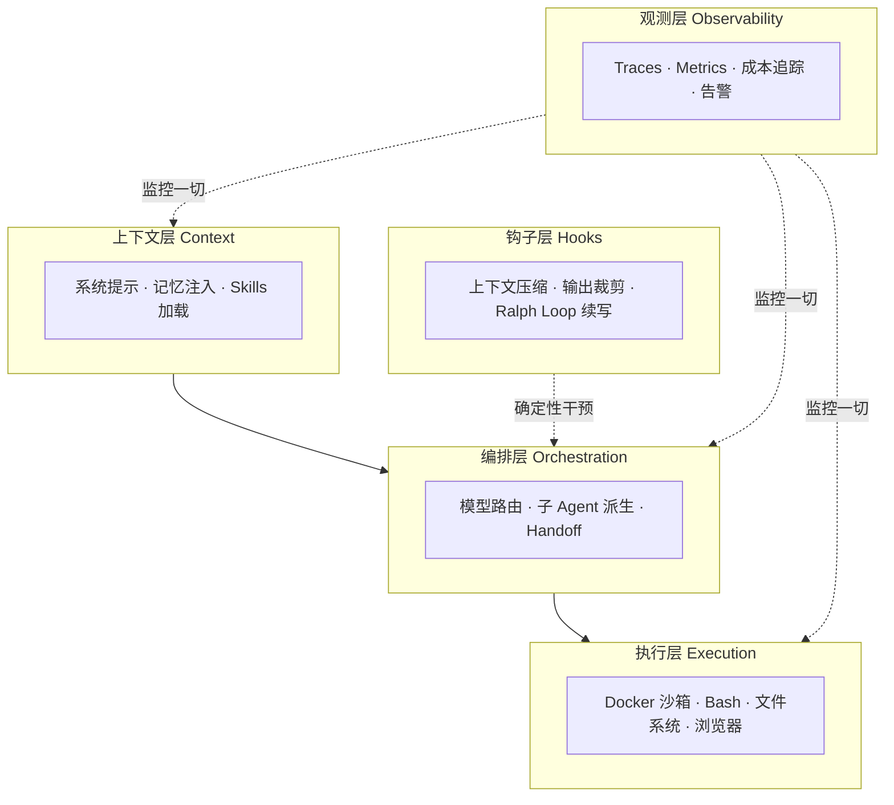
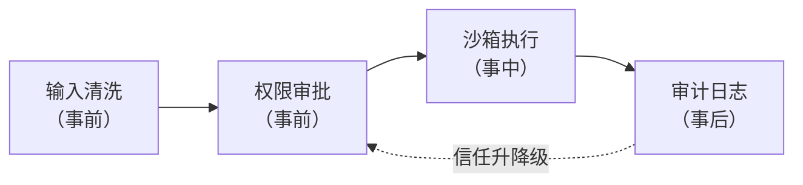

# Harness Engineering in Nutshell（Harness 工程速成指南）

> 中文简称：Harness 工程速成指南

> **一句话理解**: Harness 工程就是"给烈马配马具"——模型是动力，Harness 决定这股动力能不能安全地拉车到达目的地。

Related: [[15_智能体/04_Agent脚手架/05_脚手架_工程_完整_指南|Harness 工程完整指南]] | [[15_智能体/04_Agent脚手架/10_脚手架_简明指南|Harness 简明指南]] | [[15_智能体/01_Agent基础/02_Agent工程_方法论_系统_2026|Agent 工程方法论体系 2026]]

**阅读时间**：约 30 分钟 | **目标读者**：想构建可靠 Agent 系统的工程师 | **学完能做什么**：理解 Harness 的价值与架构，能识别自己系统中缺失的 Harness 组件

---

## 1. Harness 是什么

### 1.1 核心公式

```text
Agent = LLM + Harness
```

**Harness** 是在大语言模型与真实执行环境之间构建的一套系统工程框架。它通过标准化的消息协议、分层的权限管理、多维的执行可见性和完善的错误处理机制，使 LLM 能够在受控约束下安全、可靠地感知环境、执行任务、学习反馈。

一句行业格言：

```text
模型决定了智能体的思维上限，
Harness 决定了智能体的工程下限。
```

### 1.2 "马具"的隐喻

Harness 原意是马具——骑手用来驾驭烈马的缰绳、鞍具和套具系统。它不给马增加力量，而是：

- **引导方向**：缰绳确保力量用在正确方向（任务目标）
- **分散风险**：多个接点均匀分散冲击力（错误隔离）
- **标准化协作**：让骑手与马形成可预期的交互协议（工具接口）

一个没有 Harness 的大模型只是一台**发动机**；一个经过 Harness 工程化的智能体才是一辆**能可靠载人行驶的汽车**。

### 1.3 与传统中间件的本质区别

| 维度 | 传统中间件 | Harness |
|------|-----------|---------|
| 交互假设 | 各方行为确定、可预测 | Agent 决策可能包含错误、偏差甚至不当意图 |
| 请求处理 | 高效转发、协议转换 | 拦截验证、权限审批、智能重试、降级 |
| 审计 | 日志为主 | 完整审计日志 + 执行轨迹重放 |
| 故障处理 | 异常转发 | 智能重试、断路器、检查点恢复 |

### 1.4 职责边界

| Harness 做的事 | Harness 不做的事 |
|---------------|-----------------|
| 工具集成、权限授权 | 推理和决策（LLM 的职责） |
| 执行跟踪与验证 | 工具的实际执行（工具自身的职责） |
| 状态管理、可观测性、审计 | 模型训练与优化 |
| 错误重试与降级 | 业务逻辑定义 |

---

## 2. 为什么 Harness 比模型更重要

### 2.1 四个实证数据

| 实验 | 做法 | 结果 |
|------|------|------|
| **OpenAI Codex 团队** | 引入 Harness 层（语法验证 + 类型检查 + 结果验证），不改模型 | 准确率 **+30-40pp** |
| **Bölük 的 "15-LLM-下午"** | 把"完整文本编辑"改为"行级哈希引用"（Hashline），16 个模型一致提升 | Grok Code Fast 1：6.7% → 68.3%（约 10 倍） |
| **LangChain Deep Agents** | 纯 Harness 层改进，模型不变 | Terminal Bench 2.0：52.8% → 66.5%，排名进全球前 5 |
| **Anthropic 反向验证** | 固定模型，只改基础设施配置 | 成功率漂移 ±6pp |

Anthropic 的结论值得贴在墙上：**排行榜上低于 3pp 的差距，很可能反映的是 Harness 配置差异而非模型能力差异**。

### 2.2 数学论证：为什么多步任务必须靠系统工程

假设任务 N 步，每步 LLM 成功率 p：

- **无系统工程**：整体成功率 = \(p^N\)。N=100 时，要求整体 90% 成功，则单步需要 p ≥ 99.9%——超出任何模型能力
- **有系统工程**：原始 p=90%，每步加验证 + 重试 3 次，有效成功率 \(p' = 1-(1-0.9)^4 = 99.99\%\)，整体 \(0.9999^{100} \approx 99\%\)

结论：**用较弱的模型 + 强系统工程，可以打败较强的模型 + 弱系统工程**。

### 2.3 ROI 判断准则

- 模型准确率达到 85% 以上后，继续优化模型的边际收益递减
- 此时投入系统工程（工具层 → 结果验证 → 重试策略 → 可观测性）的 ROI 更高
- 行业验证：OpenAI Codex 团队 5 个月、3 名工程师、约 100 万行代码、零人工编写

---

## 3. 五层架构总览



**图表说明**：请求自上而下流动；钩子层在各环节做确定性干预（不依赖模型自觉）；观测层横切全链路。

| 层 | 职责 | 关键设计问题 |
|----|------|-------------|
| 上下文层 | 组装模型输入 | 什么信息进窗口？（Context 工程） |
| 编排层 | 决定怎么干 | 用哪个模型？要不要派生子 Agent？ |
| 执行层 | 安全执行 | 沙箱边界？权限粒度？ |
| 钩子层 | 防止跑偏 | 何时压缩/裁剪/续写？ |
| 观测层 | 监控一切 | 出错能否复现现场？ |

---

## 4. 五大子系统详解

### 4.1 运行时引擎（Runtime Engine）

Harness 的心脏，维护 **Agent Loop 主循环**：

```text
感知 → 推理 → 决策 → 执行 → 学习 → 判断（继续/终止）
```

配套一个显式状态机：`Initializing → Executing → Completed → Stopped`，任何时刻系统处于什么状态必须可查询。

### 4.2 工具层（Tool Layer）

每次工具调用走标准生命周期：

```text
参数校验 → 权限检查 → 沙箱执行 → 结果清洗 → 返回（或重试/熔断）
```

| 机制 | 配置示例 | 作用 |
|------|---------|------|
| 参数验证 | JSON Schema 校验 | 拒绝非法调用 |
| 最小权限 | 每会话只授予任务必需工具 | 控制爆炸半径 |
| 超时与熔断 | 单次超时 + 连续失败熔断 | 防止卡死与雪崩 |
| 结果清洗 | 过滤敏感信息、截断超长输出 | 保护上下文与隐私 |

### 4.3 记忆子系统（Memory）

| 记忆层 | 生命周期 | 实现 |
|--------|---------|------|
| 工作上下文 | 单次推理 | 上下文窗口 |
| 会话状态 | 单次任务 | Plan 文件 / 检查点 |
| 长期记忆 | 跨任务 | 向量库 / AGENTS.md |

### 4.4 模型集成与输出治理

- 多模型路由：简单任务走低成本模型，复杂任务走强模型
- 输出解析与结构化约束（约束解码）
- 幻觉防护：每步结果验证后再进入下一步

### 4.5 编排引擎（Orchestration）

支持三种执行形态：**单循环（Loop）**、**图编排（Graph/Workflow）**、**多 Agent 协作**。Loop 与 Graph 的详细机制见：

- [[90_学习/06_以教代学/04_Agent_Loop_Nutshell/Agent_Loop_in-nutshell|Agent Loop 速成指南]]
- [[90_学习/06_以教代学/05_Graph_Workflow_Nutshell/Graph_Workflow_in-nutshell|Graph/Workflow 速成指南]]

---

## 5. 关键机制速查

### 5.1 验证回路（Verification Loop）

```text
Plan → Execute → Verify ──Pass──→ Next Step
                    │ Fail
                    └→ Fix → Execute → Verify
```

| 验证方式 | 适用场景 | 收益 |
|---------|---------|------|
| 测试套件 | 代码修改 | +15-25% 成功率 |
| Lint / 类型检查 | 代码质量 | 快速失败，低成本 |
| 截图比对 | UI 修改 | 视觉回归防护 |
| LLM 自评 | 开放域任务 | 兜底，需防自夸偏差 |

### 5.2 沙箱（安全执行环境）

| 沙箱类型 | 启动时间 | 适用场景 |
|---------|---------|---------|
| Docker 容器 | 1-5s | 通用代码执行 |
| MicroVM（Firecracker） | <1s | 高安全场景 |
| gVisor | <1s | 平衡安全与性能 |
| WebAssembly | <100ms | 轻量工具执行 |
| 远程沙箱（E2B） | 2-10s | 云端大规模评测 |

### 5.3 长程执行（Long-Horizon）

| 模式 | 关键技术 | 收益 |
|------|---------|------|
| **Ralph Loop** | 拦截退出 → 注入原 Prompt 到新上下文 | +20-30% 长任务成功率 |
| **Plan File** | 计划写入文件，每次迭代读取更新 | 跨上下文保持任务骨架 |
| **Git Checkpoint** | 每步自动 commit | 可回滚、可审计 |
| **子 Agent 分工** | 大任务拆分给并行 Agent | 2-5x 效率提升 |

### 5.4 渐进信任（Progressive Trust）

权限不是一次性授予，而是基于证据逐级放权：

```text
Level 0 人工批准每一步
  ↓ 证据：操作数、成功率、持续天数、无严重错误
Level 1 低风险操作自动执行
  ↓
Level 2 高风险操作需确认
  ↓
Level 3 全自主 + 事后审计
```

一次严重错误、短时间多次错误、安全事件，均应触发**信任降级**。

---

## 6. Harness 组件的投入优先级

预算有限时按此顺序建设：

| 优先级 | 组件 | 理由 |
|--------|------|------|
| P0 | 工具层（校验 + 沙箱） | 没有它就不敢上生产 |
| P0 | 结果验证回路 | 性价比最高的质量杠杆 |
| P1 | 重试与降级策略 | 指数退避（max_retries=3）+ 断路器 |
| P1 | 可观测性 | 结构化日志 + trace_id 全链路关联 |
| P2 | 上下文管理 | Compaction + Offload |
| P2 | 长程机制 | Ralph Loop / Plan File |
| P3 | 多 Agent 编排 | 单 Agent 跑顺后再引入 |

---

## 7. 案例实战：Harness 消融实验

**背景**：团队把一个代码修复 Agent 的 Terminal Bench 成绩从 52.8% 提到 66.5%，模型完全没换。他们做了消融实验（每次只拆掉一个组件）来验证每个组件的贡献：

| 消融动作 | 成绩变化 | 结论 |
|---------|---------|------|
| 拆掉文件系统写入能力 | -8.2pp | 持久化是长任务的地基 |
| 拆掉子任务规划 | -4.1pp | 规划减少无效尝试 |
| 拆掉错误回显（工具报错进上下文） | -3.8pp | 看不到错误就无法自纠 |
| 全部拆掉（只剩裸模型 + Bash） | -13.7pp（回到 52.8%） | 组件间有协同效应 |

**三个关键教训**：

1. **每个 Harness 组件的贡献都可以被量化**——先建观测，再做消融，用数据决定取舍
2. **组件间存在协同**：单独看每个组件贡献之和小于总提升，因为文件系统让规划可持久、错误回显让自纠有依据
3. **不要凭直觉砍组件**："看起来用不上"的组件（如错误回显）可能是自修复能力的来源

> 这个方法论同样适用于你自己的系统：任何 Harness 改进，都应该能在基线回归中看到可量化的提升，否则就是无效复杂度。

---

## 8. 安全视角：Harness 的威胁模型

Harness 的安全设计前提是：**假设 Agent 可能犯错，甚至被诱导做坏事**。四类核心威胁：

| 威胁 | 攻击/故障方式 | Harness 对策 |
|------|--------------|---------------|
| 提示注入 | 外部文档/网页内容劫持 Agent 指令 | 输入侧声明 + 输出侧策略引擎审核 |
| 权限越界 | Agent 调用未授权工具 | 每会话最小工具集 + 调用前权限校验 |
| 数据外泄 | 敏感信息经工具调用流出 | 结果清洗（PII 遮蔽）+ 出站白名单 |
| 资源滥用 | 死循环烧 Token/算力 | 双预算 + 熔断 |

分层防御原则（纵深防御）：



**图表说明**：任何单层被突破，下一层仍能拦截；审计结果反哺渐进信任机制，形成闭环。详细的威胁模型与 MCP 安全见 [[15_智能体/04_Agent脚手架/07_脚手架_生产_安全|Harness 生产安全]]。

---

## 9. 从零起步：最小可行 Harness（MVH）路线图

不要试图一次建全五层。按周为单位递进：

| 阶段 | 交付物 | 验收标准 |
|------|--------|---------|
| 第 1 周 | 单循环 + 2 个工具 + 参数校验 | 能完成 5 步任务，非法调用被拒绝 |
| 第 2 周 | 沙箱 + 超时重试 + 结构化日志 | 工具崩溃不影响主循环，出错可查 trace |
| 第 3 周 | 验证回路 + Git 检查点 | 错误能被模型自纠，崩溃可恢复 |
| 第 4 周 | 预算控制 + 可观测仪表盘 | 成本/步数可查，告警生效 |
| 之后 | Compaction、Ralph Loop、多模型路由 | 按长任务需求按需引入 |

每个阶段结束时跑一次基线回归（固定任务集 + 固定模型），用数据确认每个新组件的贡献。

---

## 10. 常见陷阱（防坑清单）

| 陷阱 | 症状 | 修复 |
|------|------|------|
| **只堆模型不堆工程** | 换更贵模型，成功率纹丝不动 | 先建验证回路再谈模型 |
| **无验证直通** | 错误中间结果被后续步骤放大（幻觉传播） | 每步验证后再前进 |
| **权限一次给满** | 一次幻觉删库 | 最小权限 + 渐进信任 |
| **无检查点** | 第 80 步崩溃，80 步全废 | Git Checkpoint / 状态快照 |
| **日志无 trace** | 出错无法复现现场 | 每次调用附带 trace_id |
| **过早多 Agent** | 协作开销大于收益 | 单 Agent + 子任务拆分优先 |
| **用人类工作流束缚 Agent** | 强制按人类步骤执行 | 改用基于风险的约束 |
| **忽视上下文膨胀** | 长任务后期质量骤降 | Compaction + 输出 Offload |

---

## 11. 常见问题 FAQ

**Q1：Harness 和 Agent 框架（LangChain/CrewAI 等）是一回事吗？**
不是。框架是现成的零件库，Harness 是你针对自己场景组装出的完整执行系统。框架可以提供 Loop、工具层等组件，但权限模型、验证策略、信任等级这些"针对你业务的决策"只能你自己设计。用框架可以，但不能代替 Harness 思考。

**Q2：模型越来越强，Harness 会不会变得不需要？**
会变小，但不会消失。类比：汽车发动机越强，底盘/刹车/安全带依然必要。而且 Harness 不仅补模型的短板，还放大模型的长板——好的工具与验证回路让任何模型都更高效。Anthropic 与 LangChain 均判断 Harness 工程会长期存在。

**Q3：我的应用只是一问一答，需要 Harness 吗？**
如果模型不执行任何真实世界操作（不调工具、不改文件、不发请求），只需要 Prompt/Context 工程。Harness 的引入条件是"模型要动手"。

**Q4：Harness 开发会不会比模型调用还重？**
初期确实有工程量，但对比的是事故成本：一次"Agent 幻觉删库"的损失远超建沙箱的投入。且 MVH 路线四周即可交付可用版本，不是大爆炸式工程。

**Q5：如何向管理层论证 Harness 的投入价值？**
用本文的实证数据：不改模型、只改工程，准确率可提升 30-40pp；排行榜上 <3pp 的差距很可能只是配置差异。再结合数学论证：多步任务的成功率衰减只能靠系统工程解决。

---

## 12. 费曼自检表（以教代学）

| # | 自检问题 | 合格标准 |
|---|---------|---------|
| 1 | 用马具类比解释 Harness 是什么？ | 能讲清"不增力量、只增驾驭" |
| 2 | 为什么排行榜上 3pp 以内的差距可能不是模型差异？ | 引用 Anthropic 配置漂移实验 |
| 3 | 用数学说明多步任务为什么必须靠系统工程？ | p^N 衰减 + 重试提升有效 p |
| 4 | Harness 五层架构各层职责？ | 能各举一个组件 |
| 5 | Harness 做什么、不做什么？ | 各说出 3 条边界 |
| 6 | 预算有限，先建哪三个组件？ | 工具层 → 验证 → 重试/可观测 |
| 7 | 渐进信任的升级和降级条件？ | 证据升级 / 错误降级 |
| 8 | 消融实验证明了什么？ | 组件贡献可量化且存在协同 |
| 9 | Harness 四类核心威胁与对策？ | 注入/越权/外泄/滥用各举一策 |

**实战作业**：画出你当前（或设想中）Agent 系统的执行链路，逐层标注"这里出错了会怎样"——凡是答不上来的环节，就是缺失的 Harness 组件；然后按第 9 节路线图给它排一个四周建设计划。

---

## 12. 五大设计原则

《Harness 工程完整指南》提炼的五条设计原则，是评审任何 Harness 设计的标尺：

| 原则 | 含义 | 违反后果 |
|------|------|---------|
| **模型不可信** | 假设模型每一步都可能出错，所有关键输出都需验证 | 幻觉传播、错误滚雪球 |
| **确定性优先** | 能用代码确定性解决的（校验/路由/模板）不用模型概率性解决 | 行为不可复现、成本失控 |
| **状态外置** | 任务进度存文件系统/数据库，不依赖上下文存活 | 崩溃即全废、无法恢复 |
| **可观测内建** | trace 不是事后加的，是每步执行的默认产物 | 事故无法归因 |
| **失败先设计** | 每个组件先问"它失败了怎么办"，再问"它怎么工作" | 异常路径无人看守 |

自查方法：拿五条逐条对照自己的系统，每条都能举出具体实现才算合格。

---

## 13. 速查回顾：术语表与上线检查清单

### 13.1 术语表

| 术语 | 一句话解释 |
|------|-----------|
| Agent = LLM + Harness | 智能体由模型与执行框架共同构成 |
| 思维上限/工程下限 | 模型决定能力天花板，Harness 决定可靠性地板 |
| 验证回路 | 执行后自动验证，失败则修复重试 |
| 渐进信任 | 基于证据逐级放权，出错降级 |
| TCB（可信计算基） | 安全与权限层，所有动作必经的策略引擎 |
| 沙箱 | 隔离的执行环境，限制文件/网络访问 |
| 熔断器 | 连续失败后暂停调用，防止雪崩 |
| 检查点 | 可恢复的状态快照（Git commit / 状态存储） |
| 消融实验 | 逐个移除组件量化其贡献的验证方法 |
| Brain/Hands 解耦 | 推理引擎与执行环境分层虚拟化，可独立替换 |

### 13.2 Harness 上线检查清单

- [ ] 所有工具调用经过参数校验 + 权限检查才进沙箱
- [ ] 高危操作有人工审批或渐进信任拦截
- [ ] 每步带 trace_id 的结构化日志，可回放任意一步
- [ ] 重试有指数退避与次数上限，失败分类区分可重试/安全失败
- [ ] 步数与 Token 双预算硬执行，熔断生效
- [ ] 长任务有检查点，崩溃可从断点恢复
- [ ] 终答后有独立完成度验证，不盲信模型自报
- [ ] 基线回归任务集存在，每次 Harness 变更必跑
- [ ] 成本仪表盘可查每任务/每步消耗

---

## 14. 问答弹药库（备教用）

讲课时听众最常问的六个犀利问题，附标准答案要点：

**Q："这不就是中间件换了个名字吗？"**
A：不是。中间件假设各方行为确定，只做转发与协议转换；Harness 假设 Agent 可能犯错甚至被诱导，默认做拦截验证、权限审批、智能重试与轨迹重放。交互假设不同，设计就完全不同。

**Q："模型越来越强，Harness 会不会淘汰？"**
A：会变小不会消失。两个理由：① Harness 不只补短板，还放大长板（好工具 + 验证让任何模型更高效）；② 安全、审计、权限是业务要求，与模型能力无关——发动机再强也需要刹车。

**Q："排行榜分数高不就是模型好吗？"**
A：不一定。Anthropic 实验：固定模型只改基础设施配置，成功率漂移 ±6pp。低于 3pp 的差距很可能只是 Harness 配置差异——这正是"工程下限"的含义。

**Q："为什么准确率 85% 是个分水岭？"**
A：之前瓶颈在模型，优化模型 ROI 最高；之后单步成功率再提 1pp 很难，但多步任务的 p^N 衰减可以通过验证重试等系统工程大幅缓解——投入方向应该转向工程。

**Q："小团队哪建得起五层架构？"**
A：按 MVH 四周路线：第一周单循环 + 校验，第二周沙箱 + 日志，第三周验证 + 检查点，第四周预算 + 仪表盘。每步都有独立验收标准，不是大爆炸工程。

**Q："怎么说服老板投入？"**
A：算两笔账：① 收益账——不改模型只改工程，准确率可提 30-40pp，等于省下换更大模型的 API 差价；② 风险账——一次"幻觉删库"事故的损失远超建沙箱的投入。

---

## 15. 延伸阅读

- [[15_智能体/04_Agent脚手架/05_脚手架_工程_完整_指南|Harness 工程完整指南]] —— 五大子系统与设计原则完整版
- [[15_智能体/04_Agent脚手架/02_脚手架_核心_Subsystems|Harness 核心子系统]] —— 运行时引擎与工具层实现
- [[15_智能体/04_Agent脚手架/07_脚手架_生产_安全|Harness 生产安全]] —— 编排、MCP、安全威胁模型
- [[15_智能体/04_Agent脚手架/13_The_Anatomy_of_an_Agent_脚手架|The Anatomy of an Agent Harness]] —— LangChain 博客原文解读
- [[15_智能体/03_Agent工作流/03_AgentOps_生产_指南|AgentOps 生产指南]] —— 生产运维视角
- [[90_学习/06_以教代学/README|以教代学目录首页]]

---

*Last updated: 2026-08-26*
