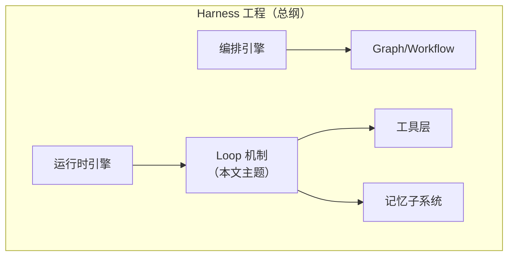
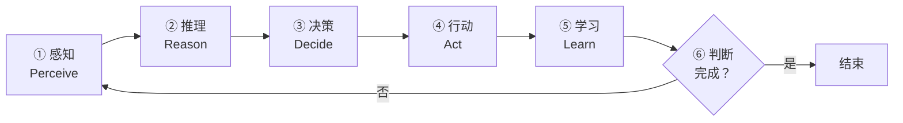
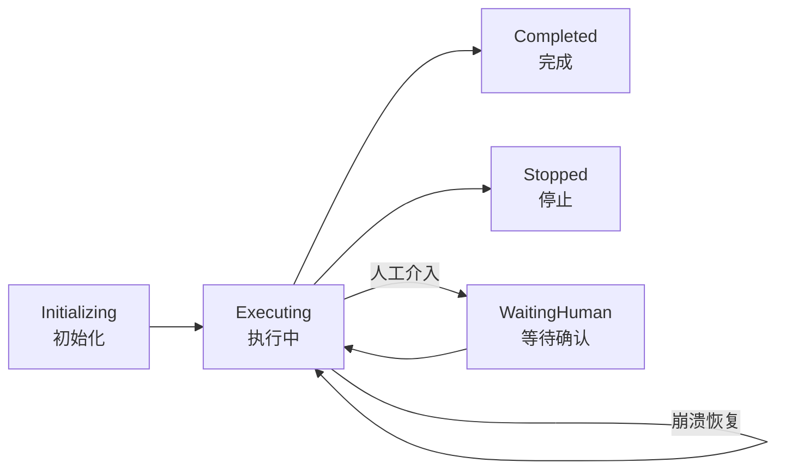
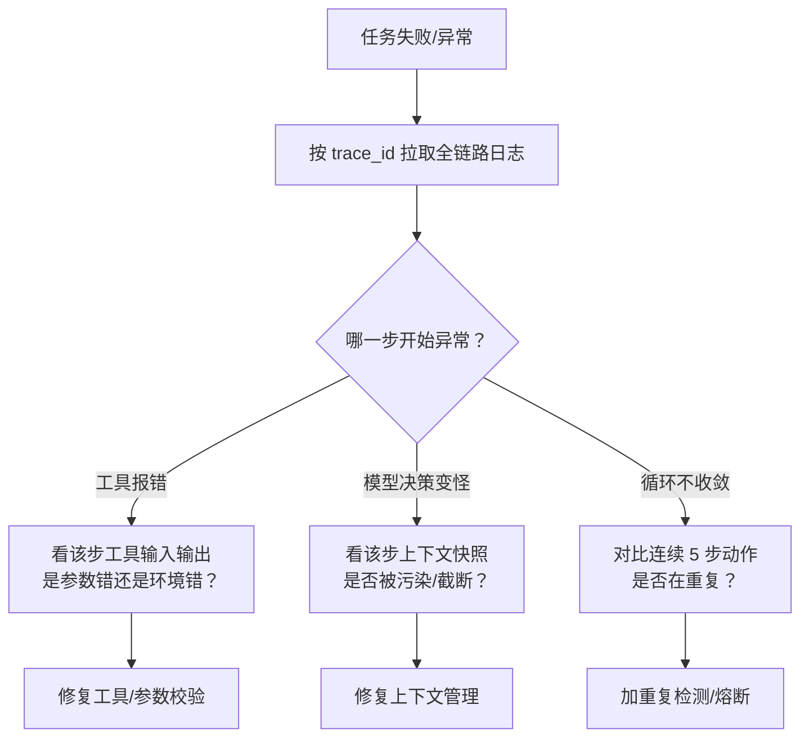

# Agent Loop in Nutshell（Agent Loop 速成指南）

> 中文简称：Agent Loop 速成指南

> **一句话理解**: Agent Loop 就是"给 AI 装上的心跳"——一次一次地看、想、做、查，直到任务完成或预算耗尽。

Related: [[15_智能体/01_Agent基础/02_Agent工程_方法论_系统_2026|Agent 工程方法论体系 2026]] | [[15_智能体/04_Agent脚手架/02_脚手架_核心_Subsystems|Harness 核心子系统]] | [[15_智能体/04_Agent脚手架/06_脚手架_实现_指南|Harness 实现指南]]

**阅读时间**：约 30 分钟 | **目标读者**：理解 LLM 调用、想实现 Agent 运行时的人 | **学完能做什么**：亲手写出一个带预算控制、验证和续写能力的最小 Agent 循环

---

## 1. Loop 是什么，为什么它是根本机制

### 1.1 定义

**Agent Loop（Agent 主循环）** 是运行时引擎维护的核心执行循环，驱动"**感知 → 推理 → 决策 → 执行 → 学习 → 判断**"的反复迭代，直到任务完成、预算耗尽或被外部终止。

它是把 LLM 从**无状态函数**（输入→输出，一问一答）转变为**有状态持续执行引擎**（能干活干到底）的根本机制。

### 1.2 一个类比

| 无 Loop 的 LLM | 有 Loop 的 Agent |
|---------------|-----------------|
| 问路的路人：问一句答一句 | 出租车司机：接单、开、看路牌、绕堵、到达 |
| 一次调用 | 成百上千次调用串成一个任务 |
| 错一步就结束 | 错了能发现、能纠正、能继续 |

### 1.3 Loop 在方法论体系中的定位

> **关键澄清**：Loop 不是与 Harness 平行的独立工程范式，而是 Harness **运行时引擎子系统的核心机制**。讨论"Loop 工程"时，实际讨论的是如何把这个循环设计得可靠、可控、可恢复。



**图表说明**：Loop 消费工具层提供的行动能力与记忆子系统的状态，是 Harness 内部的执行心脏。

---

## 2. 六步主循环解剖



**图表说明**：六个环节中，①④⑤ 与 Harness 交互（读环境、调工具、写状态），②③⑥ 由模型完成。Harness 的价值正体现在对 ①④⑤ 的控制上。

| 环节 | 做什么 | Harness 的控制点 |
|------|--------|-----------------|
| ① 感知 | 读取环境状态、工具结果、用户输入 | 注入哪些信息进上下文（Context 工程） |
| ② 推理 | 模型分析当前状态 | 提示词缓存、模型路由 |
| ③ 决策 | 选择下一步动作（调用哪个工具） | 工具白名单、参数校验 |
| ④ 行动 | 执行工具调用 | 沙箱、权限、超时 |
| ⑤ 学习 | 把结果写回状态（记忆/文件） | 输出裁剪、检查点 |
| ⑥ 判断 | 任务完成？预算耗尽？继续？ | 终止条件、Ralph Loop 拦截 |

---

## 3. 最小可运行实现（伪代码精读）

```python
class AgentLoop:
    """最小生产级 Agent 主循环：预算 + 验证 + 重试缺一不可"""

    def __init__(self, model, tools, max_steps=50, budget_tokens=200_000):
        self.model = model
        self.tools = tools               # 工具注册表（已做权限过滤）
        self.max_steps = max_steps       # 步数预算：防止死循环
        self.budget = budget_tokens      # Token 预算：防止成本失控
        self.state = []                  # 会话状态（消息历史）

    def run(self, task: str):
        self.state.append({"role": "user", "content": task})
        for step in range(self.max_steps):
            # ① 感知：组装上下文（必要时压缩）
            context = self.assemble_context()
            # ②③ 推理 + 决策：模型给出下一步动作
            response = self.model.generate(context)
            self.budget -= response.tokens_used
            if self.budget <= 0:
                return self.finish("budget_exhausted")
            # ⑥ 判断：模型认为任务完成
            if response.is_final_answer:
                return self.finish("completed", response.answer)
            # ④ 行动：执行工具调用（带校验与重试）
            result = self.execute_tool(response.tool_call)
            # ⑤ 学习：结果写回状态
            self.state.append({"role": "tool", "content": result})
        return self.finish("max_steps_reached")

    def execute_tool(self, call, max_retries=3):
        for attempt in range(max_retries):
            try:
                self.tools.validate(call)            # 参数 + 权限校验
                return self.tools.execute_in_sandbox(call)  # 沙箱执行
            except ToolTimeout:
                wait(2 ** attempt)                   # 指数退避重试
            except PermissionDenied:
                return "权限不足，已拒绝该操作"        # 安全失败，不重试
        return "连续失败，该工具已熔断"                 # 熔断降级
```

要点精读：

1. **双预算**：`max_steps` 防死循环，`budget_tokens` 防成本失控——两者都必须有
2. **校验在沙箱之前**：非法调用根本不该碰到执行层
3. **重试要区分错误类型**：超时可重试，权限失败不可重试（安全失败原则）
4. **指数退避**：避免对下游服务雪崩式重试

---

## 4. 状态机：Loop 的骨架

Loop 之外必须有一个显式状态机，让系统任何时刻的状态可查询、可恢复：



**图表说明**：`WaitingHuman` 是高危操作前的暂停态（Human-in-the-Loop）；崩溃后可从检查点恢复到 Executing 而非从头开始。

| 状态 | 进入条件 | 可观测要求 |
|------|---------|-----------|
| Initializing | 任务创建 | 记录任务目标与权限快照 |
| Executing | 开始循环 | 每步写 trace（step_id + tool + 结果） |
| WaitingHuman | 高危操作请求 | 推送审批请求，超时自动取消 |
| Completed | 模型给出终答且通过验证 | 归档完整执行轨迹 |
| Stopped | 预算耗尽/人工终止/熔断 | 记录终止原因与现场 |

---

## 5. 三大 Loop 增强模式

### 5.1 Ralph Loop：长程任务续写

**问题**：复杂任务做到一半，模型说"我做完了"想退出（过早停止）。

**Ralph Loop 方案**：用 Hook 拦截模型的退出请求，在**全新的干净上下文**中重新注入原始任务 Prompt，强迫它对着完成目标继续干。

```python
class RalphLoopHarness(AgentLoop):
    def finish(self, reason, answer=None):
        if reason == "completed" and not self.verify_done():
            # 任务并未真正完成：拦截退出，用新上下文续写
            self.state = self.rebuild_fresh_context()  # 从 Plan 文件恢复状态
            return self.continue_loop()
        return super().finish(reason, answer)
```

为什么有效：每次迭代上下文是干净的（避免腐烂），但**文件系统持久化了进度**——Plan 文件、代码、Git 提交都是跨迭代的共享状态。

| 要素 | 作用 |
|------|------|
| 退出拦截 Hook | 不让模型轻易"下班" |
| 干净上下文重建 | 对抗 Context Rot |
| 文件系统状态 | 进度不随上下文清空而丢失 |
| 完成度验证 | 防止无限循环空转 |

收益：长程任务成功率 **+20-30%**。

### 5.2 Plan File：任务骨架外置

```markdown
# Plan.md（每次迭代开始时读取，完成一步就更新）
## 目标
搭建博客静态站点并部署
## 已完成
- [x] 初始化项目结构
- [x] 写完 3 篇文章模板
## 进行中
- [ ] 配置 CI 部署流水线
## 待办
- [ ] 域名解析验证
## 关键约束
- 部署平台：GitHub Pages；不用付费服务
```

原则：**计划是文件不是记忆**——上下文会清空，文件不会。

### 5.3 验证回路：每步都查

```text
Plan → Execute → Verify ──Pass──→ Next Step
                    │ Fail
                    └→ Fix → Execute → Verify
```

| 验证方式 | 适用 | 成本 |
|---------|------|------|
| 单元测试 | 代码修改 | 低，收益最大 |
| Lint / 类型检查 | 每步兜底 | 极低 |
| 截图比对 | UI 任务 | 中 |
| LLM 自评 | 开放域 | 高，需防自夸 |

收益：+15-25% 任务成功率。详细机制见 [[15_智能体/04_Agent脚手架/10_脚手架_简明指南|Harness 简明指南]]。

---

## 6. 预算控制与终止条件

Loop 设计的第一安全原则：**任何循环都必须有明确的终止边界**。

| 预算维度 | 建议配置 | 触发后行为 |
|---------|---------|-----------|
| 步数 | max_steps=20-100（按任务定） | 保存现场，报告未完成 |
| Token | 按成本上限换算 | 同上 |
| 墙钟时间 | 单任务上限（如 30 分钟） | 同上 |
| 连续失败次数 | 3 次同类失败 | 熔断该工具，换策略或上报 |
| 重复检测 | 最近 N 步动作哈希去重 | 判定死循环，强制改策略 |

**死循环识别**：若连续 3 步执行相同工具 + 相似参数且无状态推进，判定为循环空转——注入"你正在重复相同操作，请换一种方法"的干预，或直接熔断。

---

## 7. 案例实战：三次真实 Loop 故障复盘

### 故障 1：半夜烧掉 800 美元的死循环

| 项 | 内容 |
|----|------|
| 现象 | 夜间任务 Token 消耗异常暴涨，成本告警触发 |
| 根因 | 工具返回的错误信息每轮略有不同，重复检测未命中，模型反复重试同一个必失败的调用 |
| 修复 | 增加"同类错误连续 3 次熔断"规则 + 每日 Token 硬上限 |
| 教训 | 重复检测要按错误类别而非精确参数匹配；预算必须硬执行而非仅告警 |

### 故障 2：模型谎报"完成"

| 项 | 内容 |
|----|------|
| 现象 | Agent 声称部署成功，实际 CI 流水线从未被触发 |
| 根因 | 终止判断完全信任模型的终答，无独立验证 |
| 修复 | 终答后强制跑完成度验证（curl 接口 + 检查流水线状态），不通过则拦截退出并告知验证结果 |
| 教训 | "模型说完成"不是完成，**验证通过才是完成**（Ralph Loop 的核心前提） |

### 故障 3：第 40 步崩溃，40 步全废

| 项 | 内容 |
|----|------|
| 现象 | 长任务跑到第 40 步容器 OOM，重启后只能从头再跑 |
| 根因 | 状态只存在内存与上下文中，无任何检查点 |
| 修复 | 每步完成自动 Git commit + Plan 文件更新，重启后从最后一个干净 commit 恢复 |
| 教训 | 长任务的进度必须外置到文件系统，崩溃恢复是设计问题不是运气问题 |

---

## 8. 调试指南：Loop 的 trace 怎么查

Loop 出问题时的标准排查顺序：



**图表说明**：三类异常对应三类修复面：工具层、上下文层、循环控制层。前提是每个步都带 step_id、工具名、输入输出摘要的结构化日志。

每一步日志的最小字段集：

```json
{
  "trace_id": "task-001",
  "step": 12,
  "action": "run_tests",
  "input_summary": "pytest tests/test_api.py",
  "output_summary": "2 failed, 18 passed",
  "tokens_used": 1840,
  "duration_ms": 3200
}
```

---

## 9. 常见陷阱（防坑清单）

| 陷阱 | 症状 | 修复 |
|------|------|------|
| **无预算循环** | 一晚烧掉数百美元 Token | 双预算（步数 + Token）硬上限 |
| **过早停止** | 模型说"完成"其实没做完 | Ralph Loop + 完成度验证 |
| **死循环空转** | 同一操作反复执行 | 重复检测 + 强制换策略 |
| **状态只在上下文里** | 上下文一压缩就失忆 | Plan File + Git Checkpoint 外置 |
| **所有错误都重试** | 权限错误重试到超时 | 区分可重试/安全失败 |
| **无 trace** | 出错后无法定位哪一步坏的 | 每步 step_id + 工具 + 结果落日志 |
| **验证缺失** | 错误滚雪球到第 30 步 | 每步执行后验证再前进 |
| **心跳无观测** | 跑没跑、跑到哪不知道 | 状态机对外可查询 + 进度指标 |

---

## 10. 常见问题 FAQ

**Q1：Loop 的最大步数设多少合适？**
按任务复杂度标定：交互式小任务 10-20 步，代码类中型任务 30-50 步，长程自主任务可到 100+（配 Ralph Loop）。原则：宁可早终止上报，不可无上限；步数上限是"预期正常完成步数"的 2-3 倍即可。

**Q2：模型不主动调工具、一直聊天怎么办？**
常见于提示词未明确行动期望。修复：① System Prompt 明确"能用工具就不要空谈"；② 连续 2 步无工具调用时注入推动性提示；③ 检查工具描述是否清晰（模型不知道什么时候该用）。

**Q3：一个任务拆成多个子 Loop 还是一个大 Loop？**
默认单 Loop + Plan 文件拆分；当子任务间独立性强、可并行、且上下文互相污染时，才拆子 Agent（每个子 Agent 是一个独立 Loop，结果通过文件系统汇总）。拆分的代价是协调开销，先证明单 Loop 不够用。

**Q4：Loop 和函数式 Agent（一次规划全部执行）怎么选？**
Loop 的优势是每步都能根据真实反馈纠偏；一次性规划适合步骤完全确定、无外部不确定性的流水线。真实世界任务（文件会变、API 会挂）几乎总是 Loop 更稳。

**Q5：怎么测试 Loop 本身（不是测模型）？**
用固定任务集 + 固定模型跑基线回归；用 Mock 工具模拟故障（超时/报错/返回垃圾数据）验证重试、熔断、终止逻辑；死循环和预算逻辑必须有单测，它们不依赖模型行为。

---

## 11. Loop 与 Graph：何时升级

| 判断维度 | 继续用 Loop | 升级到 Graph/Workflow |
|---------|------------|----------------------|
| 任务结构 | 开放探索型（写代码、查资料） | 步骤明确、有分支审批 |
| 可控性要求 | 中等 | 高（企业级合规） |
| 人工介入点 | 偶尔 | 固定节点必须审批 |
| 并发分支 | 不需要 | 需要并行分支再汇聚 |

Loop 是"让模型自己决定下一步"，Graph 是"用图结构规定可能的路径"。两者不是替代关系——Graph 的节点内部往往还跑着小 Loop。

👉 下一步阅读：[[90_学习/06_以教代学/05_Graph_Workflow_Nutshell/Graph_Workflow_in-nutshell|Graph/Workflow 速成指南]]

---

## 12. 费曼自检表（以教代学）

| # | 自检问题 | 合格标准 |
|---|---------|---------|
| 1 | Agent Loop 的六个环节是什么？ | 能默写并各说一句职责 |
| 2 | 为什么说 Loop 让 LLM 从函数变成引擎？ | 讲清"无状态→有状态持续执行" |
| 3 | Loop 与 Harness 是什么关系？ | 子系统机制，非平行范式 |
| 4 | 双预算指什么，缺一个会怎样？ | 步数防死循环，Token 防烧钱 |
| 5 | Ralph Loop 靠什么实现"跨上下文续写"？ | 退出拦截 + 干净上下文 + 文件状态 |
| 6 | 哪类错误不能重试？ | 权限/安全类错误，安全失败原则 |
| 7 | 如何识别和打断死循环？ | 动作哈希去重 + 强制换策略 |
| 8 | 三次故障案例分别对应哪三类缺陷？ | 预算缺失/验证缺失/检查点缺失 |
| 9 | "模型说完成"为什么不能直接信？ | 能举出故障 2 的场景 |

**实战作业**：用第 3 节伪代码实现一个最小 Loop（可用任意 LLM API + 2 个工具如"读文件""写文件"），让它完成一个需要 5 步以上的小任务，然后故意制造一次工具失败，观察你的重试与终止逻辑是否如预期工作；最后给每步加上第 8 节的结构化日志字段。

---

## 12. Loop 关键参数速查表

实现时的默认参数起点（按场景再调）：

| 参数 | 建议起点 | 调整依据 |
|------|---------|---------|
| max_steps | 预期正常步数 × 2-3 | 任务复杂度 |
| Token 预算 | 成本上限 ÷ 单步均价 | 财务约束 |
| 单工具超时 | 10-60s | 工具特性（测试类可更长） |
| 重试次数 | 3 次，指数退避 | 下游稳定性 |
| 重复检测窗口 | 最近 3-5 步 | 循环模式观察 |
| 熔断阈值 | 同类错误连续 3 次 | 错误影响面 |
| Compaction 触发 | 窗口占用 70-75% | 上下文策略 |
| 保留最近轮数 | 压缩时留 4-6 轮原文 | 连贯性需求 |

---

## 13. 速查回顾：术语表与上线检查清单

### 13.1 术语表

| 术语 | 一句话解释 |
|------|-----------|
| Agent Loop | 感知-推理-决策-执行-学习-判断的反复迭代 |
| 状态机 | Initializing/Executing/Completed/Stopped 等显式状态 |
| Ralph Loop | 拦截退出 + 干净上下文重注入，支持长程任务 |
| Plan File | 外置到文件的任务计划，跨迭代保持骨架 |
| Git Checkpoint | 每步自动 commit，可回滚可恢复 |
| 双预算 | 步数上限 + Token 上限两道终止防线 |
| 安全失败 | 权限类错误立即拒绝，不重试 |
| 指数退避 | 重试等待时间按 2^n 增长，防雪崩 |
| 完成度验证 | 终答后独立检查任务是否真的完成 |
| 循环空转 | 重复相同动作无状态推进的死循环 |

### 13.2 Loop 上线检查清单

- [ ] 双预算硬执行，超限能正确终止并保存现场
- [ ] 状态机对外可查询，任意时刻知道"跑到哪了"
- [ ] 每步结构化日志（step/action/输入输出摘要/耗时/Token）
- [ ] 工具校验在沙箱之前，权限失败不重试
- [ ] 重复检测与熔断规则已配置且有单测
- [ ] 终答后独立完成度验证，不盲信模型
- [ ] 长任务有 Plan File + Git Checkpoint，崩溃可恢复
- [ ] 用 Mock 工具模拟过超时/报错/垃圾数据三类故障

---

## 14. 问答弹药库（备教用）

讲课时听众最常问的六个犀利问题，附标准答案要点：

**Q："Loop 不就是个 while 循环吗？有什么好讲的？"**
A：while 只是骨架，生产级 Loop 的难点全在骨头外：双预算、重试分类、重复检测、完成度验证、检查点恢复、状态机可观测——缺任何一项都会在某个深夜用事故教你补课。

**Q："Ralph Loop 不就是强制不让模型休息吗？会不会白烧钱？"**
A：两道防线防白烧：① 每次续写都要过完成度验证，真完成就放行；② 步数与 Token 预算硬上限。它解决的是"模型谎报完成"这个高频故障，+20-30% 的长任务成功率就是它的收益证据。

**Q："为什么状态要外置到文件？放数据库不行吗？"**
A：都可以，关键是"不依赖上下文存活"。文件系统被选中的原因：① 模型天然会读写文件（零学习成本）；② Git 免费获得版本历史与回滚；③ 多 Agent 共享时文件就是共享账本。

**Q："错误都该重试吗？快速失败不是更好？"**
A：按错误分类：瞬时性错误（超时/限流）值得重试，永久错误（权限/参数非法）重试是浪费且有安全风险。原则：可重试的指数退避重试，不可重试的立即安全失败并上报。

**Q："子 Agent 是不是万能扩容方案？"**
A：不是。子 Agent 的代价是协调开销 + 结果汇总风险。默认单 Loop + Plan 文件拆分；只有子任务独立性强、可并行、上下文互相污染时才拆。先证明单 Loop 不够用。

**Q："Loop 和事件驱动/工作流引擎什么区别？"**
A：Loop 的决策者是模型（每步动态决定），工作流引擎的决策者是预定义规则。实践中两者融合：图编排的节点里跑 Loop，即"宏观有规则，微观有智能"。

---

## 15. 延伸阅读

- [[15_智能体/01_Agent基础/02_Agent工程_方法论_系统_2026|Agent 工程方法论体系 2026]] —— Loop 在八大方法论中的定位
- [[15_智能体/04_Agent脚手架/06_脚手架_实现_指南|Harness 实现指南]] —— RalphLoopHarness 完整实现
- [[15_智能体/04_Agent脚手架/13_The_Anatomy_of_an_Agent_脚手架|The Anatomy of an Agent Harness]] —— Ralph Loop 原文出处与文件系统协作
- [[15_智能体/04_Agent脚手架/01_Agent_脚手架_架构_2026|Agent Harness 架构 2026]] —— 五层架构与性能指标
- [[90_学习/06_以教代学/README|以教代学目录首页]]

---

*Last updated: 2026-08-26*
