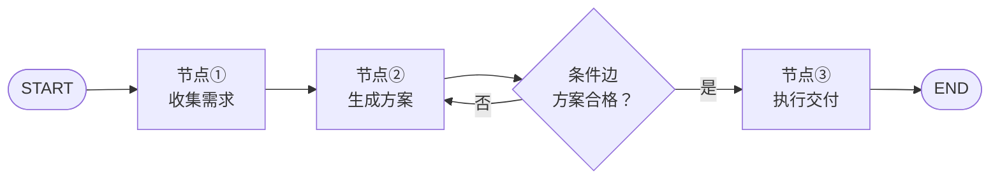
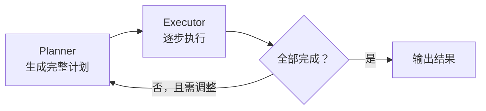
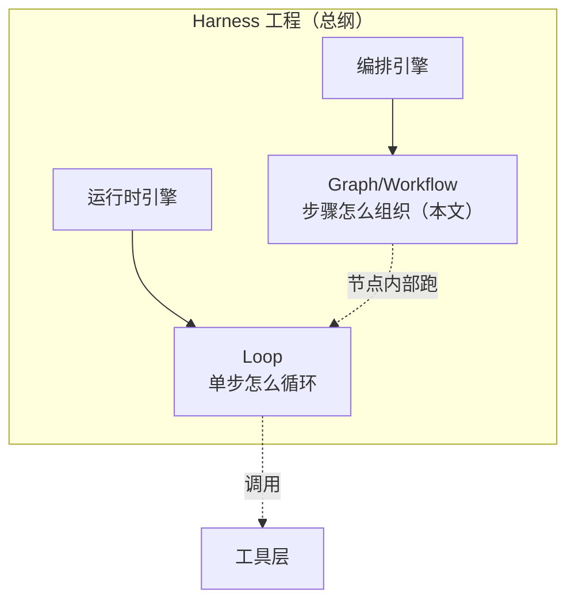
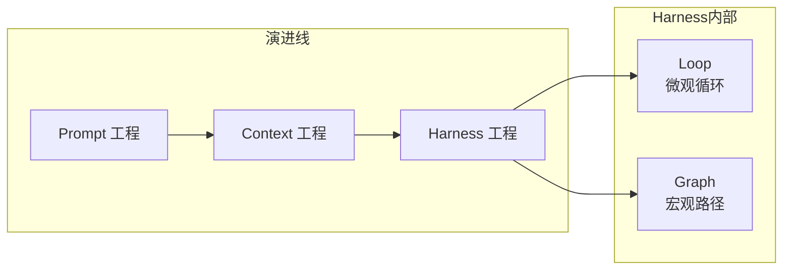

# Graph/Workflow Engineering in Nutshell（Graph/Workflow 工程速成指南）

> 中文简称：Graph/Workflow 工程速成指南

> **一句话理解**: Graph 工程就是"给 AI 画流程图并让它照着走"——把自由发挥变成有状态、可审批、可恢复的图执行。

Related: [[15_智能体/03_Agent工作流/05_LangGraph_深入分析|LangGraph 深入分析]] | [[15_智能体/01_Agent基础/02_Agent工程_方法论_系统_2026|Agent 工程方法论体系 2026]] | [[15_智能体/03_Agent工作流/03_AgentOps_生产_指南|AgentOps 生产指南]]

**阅读时间**：约 30 分钟 | **目标读者**：需要把 Agent 流程变得可控、可审计的工程师 | **学完能做什么**：用图编排重构"面条式"Agent 调用，加入检查点与人工审批

---

## 1. 什么是 Graph/Workflow 工程

### 1.1 定义

**Graph/Workflow 工程（图编排）** 是以 LangGraph 为代表的编排方法论：把 Agent 工作流从"面条式调用"（一连串 if-else 和函数嵌套）变成**有状态的图**——节点是步骤，边是流转规则，状态在节点间显式传递。

### 1.2 在方法论体系中的定位

> **关键澄清**：与 Loop 一样，Graph 工程不是与 Harness 平行的独立范式，而是 Harness **编排引擎子系统的实现形态**。Loop 回答"单步循环怎么跑"，Graph 回答"多个步骤按什么结构组织"。

| 执行形态 | 谁决定下一步 | 可控性 | 灵活性 |
|---------|-------------|--------|--------|
| 纯 Loop | 模型自由决定 | 低 | 高 |
| **Graph 编排** | 图结构 + 条件边 | **高** | 中 |
| 固定链（Chain） | 写死的顺序 | 最高 | 最低 |

### 1.3 什么时候必须上图编排

- 企业级业务流程：有合规审批节点、必须可审计
- 步骤明确但分支复杂：成功/失败/人工介入走不同路径
- 需要中断恢复：跑到一半挂了，能从断点续跑
- 多 Agent 协作：多个角色按拓扑交接任务

---

## 2. 三要素：State / Node / Edge



**图表说明**：状态 State 像一份在流水线上传递的工单，每个节点读取并更新它；条件边根据状态内容决定走向。

### 2.1 State（状态）

强类型的共享数据结构，在节点间传递与更新：

```python
from typing import TypedDict, Annotated
from operator import add

class WorkflowState(TypedDict):
    requirement: str                    # 覆盖语义：后写覆盖先写
    drafts: Annotated[list, add]        # 归约语义：追加而非覆盖
    review_passed: bool
    approval: str | None                # Human-in-the-Loop 写入
```

| 语义 | 行为 | 适用字段 |
|------|------|---------|
| 覆盖 | 新值替换旧值 | 当前步骤结果、标志位 |
| 归约（reducer） | 新值与旧值合并（如列表追加） | 历史消息、中间产物 |

### 2.2 Node（节点）

节点 = 接收状态、返回状态部分更新的函数（一个步骤）：

```python
def generate_draft(state: WorkflowState) -> dict:
    """节点只返回要更新的字段，不必返回完整状态"""
    draft = llm.generate(f"根据需求写方案：{state['requirement']}")
    return {"drafts": [draft]}   # 走归约语义，追加到列表
```

### 2.3 Edge（边）

| 边类型 | 作用 |
|--------|------|
| 普通边 | A 执行完必然到 B |
| **条件边** | 根据状态字段路由（合格→交付，不合格→重做） |
| 入口/出口 | START / END 特殊节点 |

---

## 3. 四大编排模式

### 3.1 ReAct（推理-行动交替）

```text
Thought → Action → Observation → Thought → …… → Final Answer
```

最基础的 Agent 模式，适合开放探索任务。图结构极简：一个"思考+行动"节点自循环。

### 3.2 Plan-and-Execute（先规划后执行）



**图表说明**：规划与执行分离——Planner 用强模型想清楚，Executor 可用便宜模型干活；计划僵化时回到 Planner 重规划。

| 对比 | ReAct | Plan-and-Execute |
|------|-------|------------------|
| 适合 | 步骤无法预知的探索 | 步骤可预判的复杂任务 |
| 成本 | 每步都要"想" | 规划一次，执行便宜 |
| 弱点 | 容易绕路 | 计划僵化，需重规划机制 |

### 3.3 Reflection（反思改进）

```text
生成 → 评审（另一个模型角色）→ 不合格则修改 → 再评审……
```

适合质量敏感任务（代码、文案）。注意：反思层数要设上限（一般 2-3 层），否则成本与延迟失控。

### 3.4 Multi-Agent（多角色协作）

| 拓扑 | 结构 | 适用 |
|------|------|------|
| 主管式（Supervisor） | 一个主管分派，多个工人汇报 | 任务可清晰拆分 |
| 接力式（Handoff） | A 做完交接给 B | 流水线型专业分工 |
| 对等协商 | 多 Agent 对话达成共识 | 辩论/评审场景 |

多 Agent 是依赖链末端，**应最后落地**——先把单 Agent + 图编排做稳。

---

## 4. 三个生产特性

### 4.1 Checkpointing（检查点）

每个节点执行后自动持久化状态：

| 能力 | 价值 |
|------|------|
| 中断恢复 | 进程崩溃后从断点续跑，不必从头开始 |
| 会话续接 | 用 thread_id 追踪，隔天继续同一任务 |
| 时间旅行 | 回到历史检查点重新分叉执行 |

### 4.2 Human-in-the-Loop（人工介入）

```python
graph = builder.compile(
    checkpointer=memory,
    interrupt_before=["execute_payment"],  # 高危节点前暂停
)
```

流程跑到 `execute_payment` 前自动暂停，等待人工确认写入 `approval` 字段后继续。**高危操作永远不该静默自动执行**。

### 4.3 Streaming（流式输出）

- 逐节点输出：让用户看到流程进度
- 逐 Token 输出：改善长生成体验

---

## 5. 编排范式选型对比

| 形态 | 代表框架 | 核心特征 | 适用场景 |
|------|---------|---------|---------|
| 链式编排 | LangChain LCEL | 固定顺序串联 | 简单线性管道 |
| **图编排/状态机** | **LangGraph** | 条件路由、循环、检查点 | 企业级业务流 |
| 多智能体协作 | CrewAI、AG2 | 角色分工、对话编排 | 创意/自动化 |
| 数据/RAG 驱动 | LlamaIndex | 索引检索为一等公民 | 知识密集型 |
| 企业级 SDK | MS Agent Framework | 身份、权限、审计 | 既有系统集成 |

关键维度打分（5 分制参考）：

| 维度 | 链式 | 图编排 | 多智能体 |
|------|------|--------|---------|
| 可控性 | ★★★ | ★★★★★ | ★★★ |
| 易用性 | ★★★★★ | ★★★ | ★★★ |
| 调试难度 | 易 | 中（有状态可查） | 难（涌现行为） |
| 生产就绪 | 中 | **高** | 中 |

选型口诀：**能用链别用图，能用图别用多 Agent**——复杂度是成本，按需升级。

---

## 6. 完整示例：带审批的内容发布流

```python
from langgraph.graph import StateGraph, START, END

builder = StateGraph(WorkflowState)
builder.add_node("draft", generate_draft)        # 生成初稿
builder.add_node("review", quality_review)       # 质量评审
builder.add_node("publish", publish_content)     # 发布（高危）

builder.add_edge(START, "draft")
builder.add_edge("draft", "review")
builder.add_conditional_edges(
    "review",
    lambda s: "publish" if s["review_passed"] else "draft",  # 不合格回炉
)
builder.add_edge("publish", END)

app = builder.compile(
    checkpointer=SqliteSaver("checkpoints.db"),
    interrupt_before=["publish"],                # 发布前人工审批
)

# 运行：跑到 publish 前暂停 → 人工确认 → 从检查点恢复继续
for event in app.stream(initial_state, config={"configurable": {"thread_id": "task-001"}}):
    print(event)
```

这个 30 行的例子集齐了图编排的全部核心价值：状态显式、条件回炉、检查点恢复、人工审批。

---

## 7. 案例实战：从"面条代码"到图编排的重构

**背景**：一个"需求分析 → 方案生成 → 评审 → 交付"的 Agent 流程最初写成链式嵌套：

```python
# 重构前：面条式调用
result1 = analyze(requirement)
result2 = generate(result1)
if not check(result2):
    result2 = generate(result1 + "再试一次")   # 重试逻辑散落各处
    if not check(result2):
        raise Exception("失败")                    # 失败无任何现场
result3 = deliver(result2)                       # 交付无审批，崩了无法恢复
```

**痛点盘点**：

| 痛点 | 具体表现 |
|------|---------|
| 重试逻辑散落 | 每个环节手写 if，策略不一致 |
| 失败无现场 | 抛异常后不知道死在哪个环节、当时状态是什么 |
| 无法中断恢复 | 跑到 deliver 崩了，前面全部重跑 |
| 高危操作无审批 | deliver 直接执行，出事故无法追责 |
| 流程不可视 | 新人接手只能逐行读代码 |

**重构后**（对应第 6 节完整示例）的收益对比：

| 维度 | 重构前 | 重构后 |
|------|--------|--------|
| 失败定位 | 靠日志猜 | 按 thread_id 查检查点，精确到节点 |
| 中断恢复 | 全量重跑 | 从断点续跑，平均省 70% 重跑时间 |
| 交付事故 | 发生过 1 次误发 | 审批拦截后归零 |
| 回炉重试 | 最多 1 次且无记录 | 条件边自动回炉，次数可限、全程可审计 |
| 新人上手 | 读代码半天 | 看图 10 分钟 |

**迁移建议**：不必一步到位。先把最痛的环节（通常是高危操作 + 崩溃恢复）抽成图，其余环节保持原样作为大节点，再逐步细化。

---

## 8. 图编排的可观测与调试

图的最大红利之一是**状态显式**，但要真正受益需要配套观测：

| 观测项 | 做法 | 回答的问题 |
|--------|------|-----------|
| 节点级 trace | 每个节点进出记录输入输出状态 diff | 哪一步把状态改坏了？ |
| 路由决策日志 | 条件边记录判断依据（哪个字段、什么值） | 为什么走了回炉分支？ |
| 检查点快照 | 每次状态变更持久化 | 能否回到事故前重放？ |
| 图结构可视化 | 导出图定义渲染 | 实际拓扑与设计是否一致？ |

调试三板斧：

1. **重放**：从检查点加载事故前状态，单步重跑可疑节点
2. **分叉**：从同一检查点尝试不同路由参数，对比结果
3. **状态断言**：在关键节点加断言（如 review 后 drafts 列表长度 ≤ 5），提前暴露状态污染

### 8.1 状态 Schema 的演进

State 是图的"数据库 Schema"，会随业务演进：

- 字段只增不删（旧检查点要能加载）
- 新字段给默认值，避免旧状态加载报错
- 破坏性变更时升级 thread 命名空间，新旧流程隔离

---

## 9. 常见陷阱（防坑清单）

| 陷阱 | 症状 | 修复 |
|------|------|------|
| **过度图化** | 简单任务也画 10 个节点 | 能用链别用图 |
| **状态字段失控** | State 膨胀成垃圾场 | 明确每个字段的所有者与生命周期 |
| **循环无上限** | review↔draft 无限回炉 | 加重试计数器，超限走兜底边 |
| **无检查点** | 崩溃后全部重跑 | 编译时必配 checkpointer |
| **高危节点无审批** | 自动执行转账/删除类操作 | interrupt_before 强制暂停 |
| **节点内嵌巨型逻辑** | 节点变成黑盒无法调试 | 一个节点只做一件事 |
| **多 Agent 先行** | 单 Agent 没跑顺就上群聊 | 先单 Agent 图编排，最后多 Agent |
| **忽略流式体验** | 用户等 3 分钟看不到进度 | 开启节点级 streaming |

---

## 10. 常见问题 FAQ

**Q1：LangGraph 是必须的吗？能用普通代码实现图吗？**
图编排是思想不是框架。节点 = 函数、状态 = 字典、边 = 路由逻辑，手写完全可行。框架的价值在于现成的检查点、中断恢复、流式与可视化；流程简单时手写更轻，流程复杂、需要崩溃恢复时框架很值。

**Q2：图编排会不会把 Agent 变成"硬编码工作流"，失去智能？**
这是光谱而非二选一：图的**节点内部**依然可以是自由发挥的 Loop（模型自主决策），图只约束宏观路径与关键关卡。企业场景的正确姿势是"宏观可控 + 微观自主"。

**Q3：条件边的路由判断应该用模型还是用代码？**
能用代码判断的（字段值、测试结果、状态标志）一律用代码——确定、免费、可测试；只有语义性判断（"方案质量是否合格"）才用模型，且最好要求模型输出结构化判定理由，便于审计。

**Q4：多 Agent 和图编排什么关系？**
多 Agent 协作本质是一种特殊拓扑的图：节点是不同角色的 Agent，边是交接协议（Handoff/A2A）。先把单 Agent 图跑稳，再考虑把某些节点升级为独立 Agent。

**Q5：如何向团队推广图编排？**
从痛点切入而非从技术切入：先找"崩溃重跑最痛"或"出过误发事故"的流程，用第 7 节的重构案例展示前后对比；图的可视化本身就是最好的推广材料。

---

## 11. Graph 与 Loop、Harness 的三者关系



**图表说明**：Graph 决定宏观路径，Loop 驱动微观循环——Graph 的每个节点内部往往跑着一个 Loop。两者都是 Harness 编排能力的不同粒度。

👉 回顾前置知识：[[90_学习/06_以教代学/04_Agent_Loop_Nutshell/Agent_Loop_in-nutshell|Agent Loop 速成指南]] | [[90_学习/06_以教代学/03_Harness_Engineering_Nutshell/Harness_Engineering_in-nutshell|Harness 工程速成指南]]

---

## 12. 费曼自检表（以教代学）

| # | 自检问题 | 合格标准 |
|---|---------|---------|
| 1 | State/Node/Edge 各是什么？举一个例子 | 能讲清"工单在流水线传递"类比 |
| 2 | 覆盖语义和归约语义的区别？ | 各举一个适用字段 |
| 3 | ReAct 和 Plan-and-Execute 怎么选？ | 说出"步骤可否预知"判据 |
| 4 | 检查点带来哪三个能力？ | 恢复/续接/时间旅行 |
| 5 | 高危节点怎么强制人工审批？ | interrupt_before + 检查点恢复 |
| 6 | 什么时候不该用图编排？ | 简单线性任务用链即可 |
| 7 | Graph、Loop、Harness 三者关系？ | 总纲-宏观路径-微观循环 |
| 8 | 面条代码重构案例中，最大的三个收益是什么？ | 断点恢复/审批拦截/失败定位 |
| 9 | 条件边用模型判断还是代码判断？ | 能确定性的用代码，语义性才用模型 |

**实战作业**：把你熟悉的一个多步业务流程（如"需求→方案→评审→交付"）画成图：标出节点、条件边和至少一个人工审批点，写出它的 State 字段定义；再对照第 7 节案例，找出你现有实现中最痛的一个环节并给出重构方案。

---

## 12. 速查回顾：术语表与上线检查清单

### 12.1 术语表

| 术语 | 一句话解释 |
|------|-----------|
| State | 在节点间传递的强类型共享数据结构 |
| Node | 接收状态、返回状态部分更新的函数（一个步骤） |
| Edge | 节点间的流转规则（普通边/条件边） |
| 归约语义（reducer） | 新值与旧值合并（如列表追加）而非覆盖 |
| Checkpointer | 每节点后持久化状态的组件，支持恢复与续接 |
| thread_id | 一次会话/任务的追踪标识，关联全部检查点 |
| interrupt_before | 在指定节点前暂停等待人工确认 |
| ReAct | 推理与行动交替的基础 Agent 模式 |
| Plan-and-Execute | 先规划后执行，可回炉重规划 |
| Reflection | 生成后自我评审改进，层数需设上限 |
| Handoff | Agent 间的任务交接协议 |
| 面条式调用 | 无状态、if-else 嵌套的原始实现形态 |

### 12.2 图编排上线检查清单

- [ ] State 字段有明确所有者与生命周期，无垃圾字段
- [ ] 编译时配置 checkpointer，中断可从断点恢复
- [ ] 高危节点配置 interrupt_before，审批写入状态后才继续
- [ ] 所有循环路径有次数上限与兜底边
- [ ] 条件边路由决策有日志（依据字段 + 值）
- [ ] 节点级 trace 记录状态 diff，可定位"哪步改坏状态"
- [ ] 图结构可导出可视化，与设计文档一致
- [ ] State Schema 变更遵循"只增不删 + 默认值"规则
- [ ] 节点职责单一，大逻辑已拆分为子节点

### 12.3 三张图记住本系列



**图表说明**：纵向是能力范围逐层扩大的演进包含关系；横向是 Harness 内部两种粒度的执行机制——Loop 管单步循环，Graph 管多步组织。

---

## 13. 问答弹药库（备教用）

讲课时听众最常问的六个犀利问题，附标准答案要点：

**Q："图编排会不会把 Agent 变成僵化工作流？"**
A：这是光谱不是开关。图的节点内部照样可以是自由发挥的 Loop，图只约束宏观路径与关键关卡。企业场景要的是"宏观可控 + 微观自主"，不是二选一。

**Q："为什么不直接全用多 Agent？听起来更先进。"**
A：多 Agent 是依赖链末端：协调开销、通信成本、涌现行为难调试，都是真实代价。选型口诀：能用链别用图，能用图别用多 Agent——复杂度是成本，按需升级。

**Q："检查点会不会把存储打爆？"**
A：三招：① 只存状态 diff 而非全量；② 大产物存文件，状态里只放路径；③ 按保留策略清理过期 thread。相比崩溃重跑的成本，存储是最便宜的部分。

**Q："条件边用 LLM 判断路由，会不会引入新的不确定性？"**
A：会，所以要分级：确定性条件（字段值/测试结果）一律用代码；只有语义判断才用模型，且要求结构化输出判定理由。路由是图的骨架，骨架要尽量硬。

**Q："已有 LangChain 链式代码，迁移成本高吗？"**
A：渐进式迁移：先把最痛环节（高危操作/崩溃恢复）抽成图，其余环节作为大节点原样保留，再逐步细化。不必一步到位，每一步都有独立收益。

**Q："图编排的可观测性和普通服务监控有什么不同？"**
A：多一个维度：状态。普通服务看请求日志，图编排还要看状态演化——哪一步把状态改坏的、当时路由依据是什么、能否回到事故前重放。检查点让"时间旅行调试"成为可能。

---

## 14. 延伸阅读

- [[15_智能体/03_Agent工作流/05_LangGraph_深入分析|LangGraph 深入分析]] —— 图编排核心概念与设计模式完整版
- [[15_智能体/03_Agent工作流/03_AgentOps_生产_指南|AgentOps 生产指南]] —— 编排的生产运维视角
- [[15_智能体/01_Agent基础/02_Agent工程_方法论_系统_2026|Agent 工程方法论体系 2026]] —— 八大方法论全景
- [[12_架构基建/01_架构基础/07_synthesis_architecture_selection_指南|架构选型指南]] —— 五类编排形态横评
- [[90_学习/06_以教代学/README|以教代学目录首页]]

---

*Last updated: 2026-08-26*
