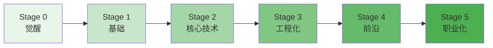

# 学习中心速览 (Learning Hub in a Nutshell)

> 中文简称：学习中心速览

> **一句话理解**: 学 AI 最大的坑不是资料太少而是太多——本章的作用就是帮你"选一条路走到底"，而不是收藏一百门课。

---

## TL;DR

- **五大板块**: concepts（概念阶梯）、Courses（课程库）、pathways（职业路径）、guides（实战指南）、References（参考资料）
- **六阶段概念体系**: 觉醒 → 基础 → 核心技术 → 工程化 → 前沿 → 职业化，逐级进阶
- **11 条职业路径**: 从零基础到 AI 工程师/研究员/MLOps，按背景选路
- **课程精选原则**: 每个阶段只推 1-2 门主课，其余是补充——完成比收藏重要
- **自评先行**: 学之前先做技能自评，定位起点比努力更重要
- **本库即教材**: 路径中的每一步都链接到知识库对应章节，边学边查

---

## 1. 五大板块导航

| 板块 | 定位 | 入口 |
|------|------|------|
| concepts | 六阶段概念阶梯，知识地图 | [[90_学习/concepts/index\|概念体系]] |
| Courses | 精选课程库（Coursera/DeepLearning.AI/HF 等） | [[90_学习/Courses/index\|课程库]] |
| pathways | 11 条按背景定制的职业路径 | [[90_学习/pathways/index\|职业路径]] |
| guides | 路线图、项目指南、里程碑、自评 | [[90_学习/guides/index\|实战指南]] |
| References | 书籍、论文、文章、项目参考 | [[90_学习/References/index\|参考资料]] |

---

## 2. 六阶段概念阶梯

| 阶段 | 主题 | 你能回答的问题 | 入口 |
|------|------|----------------|------|
| Stage 0 | 觉醒 | AI 是什么？我该学吗？ | [[90_学习/concepts/stage0_awakening\|Stage 0]] |
| Stage 1 | 基础 | ML 三大范式？梯度下降？ | [[90_学习/concepts/stage1_foundation\|Stage 1]] |
| Stage 2 | 核心技术 | Transformer 怎么工作？ | [[90_学习/concepts/stage2_core_tech\|Stage 2]] |
| Stage 3 | 工程化 | 怎么训练/部署/监控模型？ | [[90_学习/concepts/stage3_engineering\|Stage 3]] |
| Stage 4 | 前沿 | Agent/RAG/推理模型原理？ | [[90_学习/concepts/stage4_frontier\|Stage 4]] |
| Stage 5 | 职业化 | 怎么把技能变成 offer？ | [[90_学习/concepts/stage5_professional\|Stage 5]] |

---

## 3. 选路决策表

| 你的背景 | 推荐路径 | 关键补课 |
|----------|----------|----------|
| 完全零基础 | [[90_学习/pathways/absolute-beginner\|绝对新手路径]] | Python + 数学直觉 |
| 后端/全栈工程师 | [[90_学习/pathways/ai-engineer\|AI 工程师路径]] | ML 基础 + LLM API 实战 |
| Java 开发者 | [[90_学习/pathways/java-developer\|Java 开发者路径]] | Python 生态 + Spring AI |
| 数据分析师 | [[90_学习/pathways/data-scientist\|数据科学家路径]] | 统计进阶 + 建模实战 |
| 想做研究 | [[90_学习/pathways/ai-researcher\|AI 研究员路径]] | 数学深挖 + 论文复现 |
| 想做基建 | [[90_学习/pathways/mlops-engineer\|MLOps 路径]] | K8s + 分布式系统 |
| 聚焦大模型 | [[90_学习/pathways/llm-engineer\|LLM 工程师路径]] | 微调 + 推理优化 + RAG |

> 选路原则：**从现有技能出发的最短迁移路径**，而不是"最热门的方向"。

---

## 4. 学习执行套件

| 工具 | 用途 | 入口 |
|------|------|------|
| 技能自评 | 定位当前水平，找出短板 | [[90_学习/guides/skills_self_assessment\|技能自评]] |
| 2026 路线图 | 全年学习规划参考 | [[90_学习/guides/ai_engineering_roadmap_2026\|工程路线图 2026]] |
| 学习路径总览 | 各方向路径对比 | [[90_学习/guides/learning_paths_2026\|学习路径 2026]] |
| 项目指南 | 用项目驱动学习 | [[90_学习/guides/ai_project_guide\|AI 项目指南]] |
| 里程碑 | 阶段性检查点 | [[90_学习/guides/milestones\|里程碑]] |
| 训练营对比 | Bootcamp 选择参考 | [[90_学习/guides/AI_Engineering_Bootcamps_2026\|训练营 2026]] |

---

## 5. 三条铁律

1. **一条路径走到底**: 中途换路径的成本远高于坚持一条"次优"路径
2. **项目驱动**: 每个阶段结束必须有一个能演示的产出（notebook/demo/博客）
3. **以查代背**: 概念记不住没关系，知道去哪查（本库对应章节）就够了

---

## 延伸阅读 (Further Reading)

| 主题 | 说明 | 入口 |
|------|------|------|
| 章节总览 | 学习中心完整导航 | [[90_学习/index|学习中心首页]] |
| 课程库 | 平台分类课程清单 | [[90_学习/Courses/index|Courses]] |
| 参考资料 | 书/论文/文章/项目 | [[90_学习/References/index|References]] |

---

*Last updated: 2026-07-27*

## 相关链接

- [[90_学习/index|学习中心首页]] — 章节总览
- [[90_学习/README_for_dummy|学习小白指南]] — 零基础版
- [[00_入门/index|AI 入门]] — 起点章节
- [[21_面试岗位/index|面试岗位]] — 学完之后找工作
- [[20_论文精读/index|论文精读]] — 进阶研究路线
