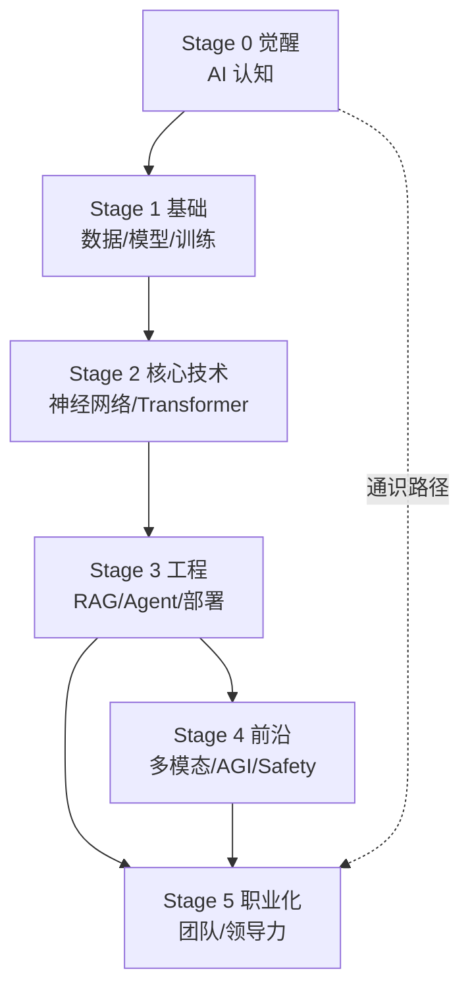
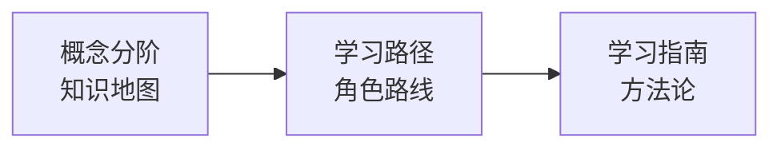

# 概念分阶 (Concepts)

> 中文简称：概念分阶 ｜ English Name: concepts

> AI 核心概念分阶学习 — 从觉醒期到职业化，六个阶段递进式构建完整的 AI 认知与能力体系。每个阶段都有明确目标、核心概念、依赖关系和学习资源。

## 阶段目标总览

本知识库将 AI 学习划分为六个递进阶段，遵循"认知 → 基础 → 技术 → 工程 → 前沿 → 职业化"的路径。每个阶段建立在前一阶段之上，又为下一阶段铺路。

## 六阶段全景

| 阶段 | 主题 | 核心问题 | 预计时间 | 前置依赖 |
|------|------|----------|----------|----------|
| **Stage 0** | [[90_学习/concepts/stage0_awakening\|觉醒]] | AI 是什么？能做什么？ | 3-5 小时 | 无（起点） |
| **Stage 1** | [[90_学习/concepts/stage1_foundation\|基础]] | AI 的通用词汇有哪些？ | 5-8 小时 | Stage 0 |
| **Stage 2** | [[90_学习/concepts/stage2_core_tech\|核心技术]] | 为什么 AI 在 2012 年后爆发？ | 10-15 小时 | Stage 1 |
| **Stage 3** | [[90_学习/concepts/stage3_engineering\|工程]] | 如何把模型变成产品？ | 8-12 小时 | Stage 2 |
| **Stage 4** | [[90_学习/concepts/stage4_frontier\|前沿]] | AI 的边界在哪里？ | 5-8 小时 | Stage 3 |
| **Stage 5** | [[90_学习/concepts/stage5_professional\|职业化]] | 如何在团队中发挥价值？ | 持续 | Stage 3+ |

## 文件导航

| 文件 | 说明 | 核心概念数 |
|------|------|-----------|
| [[90_学习/concepts/stage0_awakening\|Stage 0 · 觉醒]] | AI 认知觉醒，理解基本概念 | 8 |
| [[90_学习/concepts/stage1_foundation\|Stage 1 · 基础]] | 数学与编程基础词汇 | 10 |
| [[90_学习/concepts/stage2_core_tech\|Stage 2 · 核心技术]] | 神经网络到 Transformer | 10 |
| [[90_学习/concepts/stage3_engineering\|Stage 3 · 工程]] | 系统工程与生产实践 | 10 |
| [[90_学习/concepts/stage4_frontier\|Stage 4 · 前沿]] | 大模型与 Agent 前沿 | 8 |
| [[90_学习/concepts/stage5_professional\|Stage 5 · 职业化]] | 团队协作与影响力 | 8 |

## 概念依赖图

## 各阶段核心概念速览

### Stage 0 — 觉醒期核心概念

| 概念 | 一句话定义 | 详细 |
|------|-----------|------|
| AI 定义 | 让机器表现出智能行为的技术总称 | [[90_学习/concepts/stage0_awakening]] |
| AI 三大类型 | ANI / AGI / ASI 的能力分级 | 同上 |
| AI 能力边界 | 当前 AI 擅长与不擅长的分界 | 同上 |
| ML vs 传统编程 | 人写规则 vs 机器学规则 | 同上 |

### Stage 1 — 基础期核心概念

| 概念 | 一句话定义 | 详细 |
|------|-----------|------|
| 数据/特征/模型 | AI 三要素 | [[90_学习/concepts/stage1_foundation]] |
| 训练 vs 推理 | 学习阶段 vs 应用阶段 | 同上 |
| 损失函数/梯度下降 | 优化的指挥棒与方法 | 同上 |
| 过拟合/欠拟合 | ML 最核心的实践问题 | 同上 |
| 三大学习范式 | 监督/无监督/强化 | 同上 |

### Stage 2 — 核心技术期核心概念

| 概念 | 一句话定义 | 详细 |
|------|-----------|------|
| 神经网络/反向传播 | 深度学习的基石与训练法 | [[90_学习/concepts/stage2_core_tech]] |
| CNN | 图像处理的专用架构 | 同上 |
| RNN/LSTM | 序列模型的早期方案 | 同上 |
| Attention/Transformer | 现代 AI 的核心架构 | 同上 |
| LLM/预训练/微调 | 大模型的标准范式 | 同上 |

### Stage 3 — 工程期核心概念

| 概念 | 一句话定义 | 详细 |
|------|-----------|------|
| 部署推理 | 模型上线的工程挑战 | [[90_学习/concepts/stage3_engineering]] |
| RAG | 检索增强生成 | 同上 |
| 向量数据库 | 语义检索基础设施 | 同上 |
| Prompt Engineering | 提示词工程 | 同上 |
| AI Agent | 自主执行任务的智能体 | 同上 |
| MLOps | ML 全生命周期运维 | 同上 |

### Stage 4 — 前沿期核心概念

| 概念 | 一句话定义 | 详细 |
|------|-----------|------|
| 多模态 AI | 跨模态理解与生成 | [[90_学习/concepts/stage4_frontier]] |
| 世界模型/JEPA | 学习物理世界规律 | 同上 |
| VLA/具身智能 | AI 长出手脚 | 同上 |
| AGI 路径 | 通用人工智能的探索 | 同上 |
| AI Safety/对齐 | 确保 AI 行为符合人类价值 | 同上 |
| Scaling Law | 规模法则与数据墙 | 同上 |

### Stage 5 — 职业化期核心概念

| 概念 | 一句话定义 | 详细 |
|------|-----------|------|
| 技术领导力 | 从执行者到决策者 | [[90_学习/concepts/stage5_professional]] |
| 跨职能协作 | 与产品/业务/运维协同 | 同上 |
| 影响力建设 | 技术布道与社区贡献 | 同上 |
| 技术战略 | 长期技术方向规划 | 同上 |

## 如何使用本索引

### 场景 1: 零基础系统学习

按 Stage 0 → 1 → 2 → 3 → 4 顺序，每阶段完成后做自测检查清单，再进入下一阶段。

### 场景 2: 按需查漏补缺

已有一定基础的学习者，可直接跳到薄弱阶段。例如"会用 Transformer 但不懂 RAG"→ 直接读 Stage 3 的 RAG 章节。

### 场景 3: 面试/述职准备

重点: Stage 1（基础词汇）+ Stage 2（核心技术原理）+ Stage 3（工程实践）。

### 场景 4: 技术决策

重点: Stage 0（能力边界）+ Stage 4（前沿趋势）+ Stage 5（战略与影响力）。

## 与学习路径的关系

本概念分阶是**知识地图**，而 [[90_学习/pathways/index|学习路径]] 是**路线图**。概念分阶告诉你"AI 有哪些核心概念、它们如何递进"，学习路径告诉你"作为某个角色（如 LLM 工程师），你应该按什么顺序学哪些"。

详细的交叉映射见 [[90_学习/pathways/pathways_concepts_mapping|路径↔概念映射表]]。

## 常见误解与澄清

| 误解 | 澄清 |
|------|------|
| "Stage 越高越重要" | 每个阶段都不可或缺，基础不牢地动山摇 |
| "必须按顺序学" | 可跳读，但跨阶段跳跃要确认前置概念已掌握 |
| "Stage 4/5 才高级" | Stage 1 的过拟合/评估指标是面试和生产中最常考的 |
| "概念分阶 = 线性课程" | 它是知识地图，可与任意路径组合使用 |

## 各阶段核心问题与产出

每个阶段都有明确的"核心问题"和"学完的产出"，用以检验学习深度：

| 阶段 | 核心问题 | 学完产出 | 验证方式 |
|------|---------|---------|---------|
| Stage 0 | AI 是什么？能做什么？ | 能解释 AI 能力边界 | 用例子说明擅长/不擅长 |
| Stage 1 | AI 通用词汇有哪些？ | 能读懂技术文章骨架 | 解释过拟合、梯度下降 |
| Stage 2 | 为什么 AI 2012 后爆发？ | 理解 Transformer 原理 | 手推注意力公式 |
| Stage 3 | 如何把模型变成产品？ | 能设计 RAG/Agent 系统 | 画出 RAG 完整流程 |
| Stage 4 | AI 的边界在哪？ | 把握前沿趋势 | 讨论 AGI 路径与 Safety |
| Stage 5 | 如何在团队发挥价值？ | 能带领 AI 项目落地 | 主导一次跨职能协作 |

## 概念间的横向关联

某些概念跨阶段出现，理解它们的横向关联能深化认知：

| 概念 | 首次出现 | 深化阶段 | 横向关联 |
|------|---------|---------|---------|
| 损失函数 | Stage 1 | Stage 2（交叉熵）、Stage 3（RLHF） | 贯穿训练全程 |
| 评估 | Stage 1 | Stage 3（LLM 评估）、Stage 5（业务指标） | 从指标到业务价值 |
| Transformer | Stage 2 | Stage 3（部署优化）、Stage 4（架构演进） | 核心架构持续演进 |
| Agent | Stage 3 | Stage 4（自主 Agent）、Stage 5（运维 Agent） | 从工具到自主 |
| 对齐 | Stage 0（伦理） | Stage 4（Safety）、Stage 5（治理） | 从理念到工程落地 |

## 学习节奏建议

不同学习者的节奏不同，以下是三种典型节奏：

**节奏 A — 系统精读（3-6 个月）**:
适合转行/求职者。按 Stage 0→5 顺序，每阶段 2-4 周，配合书籍和实战。

**节奏 B — 按需查漏（持续）**:
适合在职工程师。遇到知识盲点时，查本索引定位对应阶段，定向补课。

**节奏 C — 快速通览（2-4 周）**:
适合管理者/PM。每阶段过一遍核心概念表格，建立词汇量，不深入实现。

## 检查清单：你的 AI 认知水位

用以下清单自测，判断当前所处阶段：

- [ ] **Stage 0 达标**: 能解释 AI 三大类型和能力边界
- [ ] **Stage 1 达标**: 能解释过拟合、梯度下降、评估指标
- [ ] **Stage 2 达标**: 能解释 Transformer 和 Attention 原理
- [ ] **Stage 3 达标**: 能设计 RAG 系统和简单 Agent
- [ ] **Stage 4 达标**: 能讨论 AGI 路径、Scaling Law、Safety
- [ ] **Stage 5 达标**: 能主导跨职能 AI 项目并做技术决策

## 学习资源

### 每阶段配套资源

- **Stage 0-1**: [[90_学习/References/books/why-machines-learn]]（数学科普）、[[90_学习/References/books/hands-on-ml-geron]] 前 3 章
- **Stage 2**: [[90_学习/References/books/hands-on-ml-geron]] Part 2、[[90_学习/References/books/hands-on-llms-alammar]]、[[90_学习/References/Papers/Attention_Is_All_You_Need_Reading]]
- **Stage 3**: [[90_学习/References/books/ai-engineering-huyen]]、[[90_学习/References/books/designing-ml-systems-huyen]]
- **Stage 4**: [[90_学习/References/Papers/]] 论文导读系列、[[90_学习/References/books/build-reasoning-model]]
- **Stage 5**: [[90_学习/guides/ai_engineering_roadmap_2026]]、[[90_学习/References/Articles/]]

### 在线课程

- [[90_学习/References/Courses/anthropic-courses|Anthropic Courses]]
- [[90_学习/References/Courses/llm-course-mlabonne|LLM Course (mlabonne)]]
- [[90_学习/Courses/microsoft/microsoft_ai_for_beginners|Microsoft AI for Beginners]]

## Related

- [[90_学习/pathways/index|学习路径]] — 角色化学习路线
- [[90_学习/guides/index|学习指南]] — 方法论与工具
- [[90_学习/pathways/pathways_concepts_mapping|路径↔概念映射表]] — 交叉引用
- [[05_大模型/]] — 大模型知识章节
- [[03_深度学习/]] — 深度学习知识章节
- [[02_机器学习/]] — 机器学习知识章节
- [[15_智能体/]] — Agent 知识章节

> **关联**: → [[90_学习/pathways/index|学习路径]] | [[90_学习/guides/index|学习指南]] | [[90_学习/pathways/pathways_concepts_mapping|路径↔概念映射]] | [[05_大模型/]] | [[03_深度学习/]]
