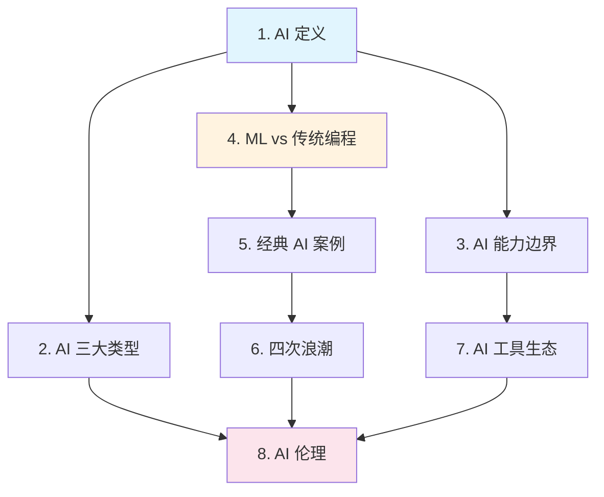

# Stage 0: AI 觉醒

> **"在你学习如何建造之前，先理解你在建造什么。"**
>
> 本层目标：建立对 AI 的直觉认知，消除神秘感，知道 AI 能做什么、不能做什么。这是所有后续学习的起点。

## 阶段目标

完成本阶段后，你将能够：
1. 用自己的话解释什么是 AI，以及它与传统软件的本质区别
2. 正确评估当前 AI 的能力边界（既不神话也不低估）
3. 说出 AI 发展的四次浪潮及代表性技术
4. 识别 2026 年主流 AI 工具生态
5. 理解 AI 伦理与社会影响的核心议题

本阶段**不需要任何编程或数学基础**，只需好奇心和开放心态。

## 本层概要

| 属性 | 值 |
|------|---|
| 包含核心概念 | 8 个 |
| 预计学习时间 | 3-5 小时 |
| 前置依赖 | 无（起点） |
| 适合人群 | 所有人 |

---

## 核心概念清单

| # | 概念 | 类别 | 重要度 | 详解位置 |
|---|------|------|--------|----------|
| 1 | AI 是什么 (Artificial Intelligence) | 定义 | P0 | 下方 |
| 2 | AI 的三大类型 (ANI/AGI/ASI) | 分类 | P0 | 下方 |
| 3 | AI 能力边界 | 认知 | P0 | 下方 |
| 4 | 机器学习 vs 传统编程 | 范式 | P0 | 下方 |
| 5 | 经典 AI 案例 | 历史 | P1 | 下方 |
| 6 | AI 发展历史与四次浪潮 | 历史 | P1 | 下方 |
| 7 | 当前 AI 工具生态 | 工具 | P1 | 下方 |
| 8 | AI 伦理与社会影响 | 伦理 | P1 | 下方 |

## 概念依赖图



## 概念详解

### 1. AI 是什么 (Artificial Intelligence)

- **一句话定义**：让机器表现出需要智能才能完成的行为的技术总称。
- **为什么重要**：这是所有后续学习的出发点。不理解定义，就无法判断什么算 AI、什么不算。
- **通俗类比**：AI 就像教小孩子——不是把答案写进脑子里，而是让它通过"看例子"、"试错"、"得反馈"来自己学会。
- **核心要点**：AI 不是一个单一技术，而是涵盖机器学习、深度学习、规则推理等多种方法的**总称**。今天我们说的 AI，绝大多数指的是基于数据的机器学习方法。

### 2. AI 的三大类型

- **一句话定义**：按能力范围划分 AI 的三个层级。
  - **弱人工智能 (ANI)**：擅长单一任务（如下棋、识图）的 AI —— 现阶段所有 AI 都属于此类
  - **通用人工智能 (AGI)**：具备人类级别全面智能的 AI —— 尚未实现，是研究目标
  - **超人工智能 (ASI)**：远超人类所有认知能力的 AI —— 更遥远的未来概念
- **为什么重要**：帮你正确评估当前 AI 的能力边界。ChatGPT 很强，但它仍然是 ANI。
- **通俗类比**：ANI 是计算器（只会算数），AGI 是一个博学的人（什么都能学），ASI 是爱因斯坦 + 达芬奇 + 所有领域顶尖大脑的总和。
- **2026 现状**: GPT-5.2 / Claude 4.5 在多数知识任务上接近人类专家水平，但仍属 ANI。

### 3. AI 能力边界

- **一句话定义**：当前 AI 擅长和不擅长的领域分界线。
- **为什么重要**：避免过度神话 AI，也避免低估 AI。正确的预期是有效使用 AI 的前提。
- **当前 AI 擅长的**：模式识别（图像/语音/文本）、生成内容（文字/图片/代码）、大规模信息处理、确定性规则的自动化
- **当前 AI 不擅长的**：真正的新颖推理、长期规划、因果理解、常识判断、跨域迁移
- **关键洞察**: AI 的"智能"是统计模式匹配，不是人类意义上的理解。它会犯错，且犯错方式与人类不同（幻觉问题 Hallucination）。

### 4. 机器学习 vs 传统编程

- **一句话定义**：
  - **传统编程**：人写规则 → 计算机执行
  - **机器学习**：人给数据 + 期望输出 → 计算机自己学会规则
- **为什么重要**：这是理解整个 AI 领域最关键的思维转换。
- **通俗类比**：传统编程像给菜谱让厨师照做；机器学习像是让厨师尝了一百道菜后自己总结出做法。
- **代码示例**:
  ```
  传统编程: def is_spam(email): return "免费" in email  # 人写规则
  机器学习: model = train(labeled_emails)              # 机器学规则
           is_spam = model.predict(new_email)
  ```

### 5. 经典 AI 案例

- **一句话定义**：改变历史进程的里程碑式 AI 系统。
- **为什么重要**：通过具体案例建立感性认识，每个案例代表一个技术时代的巅峰。

| 案例 | 年份 | 代表意义 | 关联技术 |
|------|------|---------|---------|
| Deep Blue 击败卡斯帕罗夫 | 1997 | AI 在封闭规则领域超越人类 | 搜索 + 评估函数 |
| ImageNet 分类超越人类 | 2015 | 深度学习在视觉上的突破 | CNN（详见 [[学习/References/Papers/ResNet_Reading]]） |
| AlphaGo 击败李世石 | 2016 | RL + 深度学习的结合 | 强化学习 + 策略网络 |
| GPT-3 / ChatGPT | 2020-2022 | 大语言模型的涌现能力 | Transformer + 预训练 |
| Sora 视频生成 | 2024 | 扩散模型在视频生成上的突破 | Diffusion + Transformer |

### 6. AI 发展历史与四次浪潮

- **一句话定义**：AI 从 1950 年代至今的演进脉络，大致经历了四次主要浪潮。

| 浪潮 | 时期 | 核心技术 | 代表成就 | 兴衰原因 |
|------|------|---------|---------|---------|
| 符号主义 | 1956-1980 | 规则推理、专家系统 | 逻辑理论机、专家系统 | 规则无法穷尽真实世界 → AI 寒冬 |
| 统计学习 | 1980-2010 | SVM、概率图模型、贝叶斯 | 垃圾邮件过滤、推荐系统 | 数据与算力受限 |
| 深度学习 | 2012-2022 | CNN、RNN、Attention、Transformer | AlphaGo、图像识别超人类 | GPU + 大数据突破 |
| 大模型 | 2020-至今 | GPT 系列、预训练+微调、多模态 | ChatGPT、Sora、Claude | 规模法则 (Scaling Law) |

- **关键节点**: 1956 达特茅斯会议（AI 诞生）、2012 AlexNet（深度学习起飞）、2017 Transformer（大模型基石）、2022 ChatGPT（AI 普及）

### 7. 当前 AI 工具生态

- **一句话定义**：2026 年你可以直接使用的 AI 产品和工具矩阵。

| 类别 | 代表工具 | 用途 | 关联知识库 |
|------|---------|------|-----------|
| 对话型 LLM | ChatGPT (GPT-5.2)、Claude (4.5)、Gemini | 对话、写作、分析、编程 | [[大模型/]] |
| 编程助手 | Cursor、Claude Code、Windsurf、Devin | 代码生成、调试、重构 | [[智能体/]] |
| 图像生成 | Midjourney、DALL-E、Stable Diffusion | 图片创作、设计 | [[计算机视觉/]] |
| Agent 平台 | Dify、Coze、LangGraph | 构建 AI Agent 工作流 | [[智能体/]] |
| 开源框架 | PyTorch、Hugging Face、vLLM | 模型训练与部署 | [[部署推理/]] |

### 8. AI 伦理与社会影响

- **一句话定义**：AI 发展带来的社会变革、风险和治理议题。
- **核心议题**：
  - **算法偏见与公平性**: 训练数据中的偏见会被模型放大
  - **隐私保护**: 数据采集与模型记忆的边界
  - **就业影响**: 自动化对劳动力市场的冲击
  - **信息生态**: 深假 (Deepfake)、虚假信息、信息茧房
  - **AI 治理与法规**: EU AI Act、各国 AI 监管框架
- **延伸**: [[伦理安全/Value_Alignment/Value_Alignment_for_dummy]]、[[伦理安全/AI_Safety_RedTeaming/AI_Safety_RedTeaming_for_dummy]]

---

## 常见误解

| 误解 | 澄清 |
|------|------|
| "AI 就是 ChatGPT" | ChatGPT 只是 LLM 的一种应用，AI 还包括 CV、语音、推荐、机器人等众多领域 |
| "AI 什么都会" | 当前 AI 是 ANI，只在特定任务上强；它没有真正的理解和常识 |
| "AI 会取代所有人" | AI 替代的是"任务"而非"职业"；会用 AI 的人将淘汰不会用的人 |
| "AI 是魔法" | AI 本质是数学（统计学习 + 优化），可解释、可复现 |
| "AI 不会有偏见" | AI 会继承甚至放大训练数据中的偏见，公平性是重要议题 |
| "大模型 = AGI" | 即使 GPT-5.2 也只是 ANI，距离 AGI 仍有显著差距（详见 [[学习/concepts/stage4_frontier]]） |

## AI 能力边界的快速判断框架

学会判断"某个任务 AI 能否做好"是本阶段最重要的实践能力。以下是一个简单的判断框架：

```
任务适合 AI 吗?
├─ 是模式识别/分类吗?（图像、语音、文本分类）→ 很适合
├─ 是生成内容吗?（写作、代码、图片）→ 较适合（需人工校验）
├─ 是大规模信息处理吗?（摘要、翻译、提取）→ 很适合
├─ 需要确定性规则吗?（计算、逻辑、检索）→ 适合（用工具增强）
├─ 需要真正新颖推理吗?（科研创新、艺术原创）→ 不太适合
├─ 需要长期可靠规划吗?（多步决策、战略）→ 不太适合
├─ 需要因果理解吗?（为什么发生）→ 不适合
└─ 需要物理交互吗?（操作、运动）→ 具身智能早期，有限
```

**实践建议**: 遇到新任务时，先用这个框架快速判断可行性，再决定是否投入。

## 四次浪潮的关键教训

理解 AI 历史不只是记年代，更重要的是吸取教训：

| 浪潮 | 失败原因 | 教训 |
|------|---------|------|
| 符号主义 | 规则无法穷尽真实世界的模糊性 | 纯规则方法难以泛化 |
| 统计学习 | 算力和数据不足 | 需要规模化基础设施 |
| 深度学习 | （未失败，仍在演进） | 数据 + 算力 + 算法三者缺一不可 |
| 大模型 | 数据墙、成本、对齐 | 规模有上限，需架构与对齐创新 |

**核心教训**: AI 的每次突破都依赖**数据、算力、算法**三者的协同进步。单一突破不足以引爆变革。

## 动手实践建议

本阶段虽不需编程，但亲手体验能大幅加深理解：

| 实践 | 工具 | 目标 |
|------|------|------|
| 与 LLM 对话 | ChatGPT / Claude | 体验上下文学习、发现幻觉 |
| 生成图像 | Midjourney / DALL-E | 体验扩散模型、理解 prompt 影响 |
| 代码助手 | Cursor / Copilot | 体验 AI 辅助编程 |
| 构建 Bot | Dify / Coze（无代码） | 体验 Agent 工作流 |
| 观察 AI 失败 | 故意问刁钻问题 | 理解能力边界与幻觉 |

## 学习资源

| 类型 | 资源 | 说明 |
|------|------|------|
| 书籍 | [[学习/References/books/why-machines-learn\|Why Machines Learn]] | 数学科普，建立直觉 |
| 书籍 | [[学习/References/books/hands-on-ml-geron\|Hands-On ML]] 前两章 | ML 全景与端到端项目 |
| 课程 | [[学习/Courses/microsoft/microsoft_ai_for_beginners\|Microsoft AI for Beginners]] | 免费 12 周入门 |
| 课程 | [[学习/Courses/microsoft/L01_Introduction_and_History_of_AI\|AI 历史与导论]] | 微软 AI 课程第 1 课 |
| 工具 | ChatGPT / Claude / Gemini | 亲手使用，建立感性认识 |

## 学完本层的标志

- [ ] 能用自己的话解释什么是 AI，以及它与传统软件的区别
- [ ] 能说出 AI 目前的能力边界（至少各举 2 例擅长和不擅长的）
- [ ] 能按时间顺序说出 AI 发展的四次浪潮及代表性技术
- [ ] 至少亲手使用过 2 种以上 AI 工具（如 ChatGPT + Cursor）
- [ ] 能列举至少 3 个 AI 伦理相关的真实问题

## 下一步

完成 Stage 0 后：
- **想系统学技术** → 进入 [[学习/concepts/stage1_foundation|Stage 1: 基础概念]]
- **只想通识了解** → 进入 [[学习/pathways/absolute-beginner|零基础通识路径]]
- **想做产品/管理** → 进入 [[学习/pathways/product-manager|AI 产品经理路径]]
- **想看全景** → 回到 [[学习/concepts/index|概念分阶索引]]

## Related

- [[学习/concepts/index|概念分阶索引]]
- [[学习/concepts/stage1_foundation|Stage 1: 基础概念]]
- [[学习/pathways/index|学习路径]]
- [[大模型/]] — 大模型知识章节
- [[伦理安全/Value_Alignment/Value_Alignment_for_dummy|价值对齐]]
- [[入门/Learning_Path/AI_Learning_Resources.md|AI_Learning_Resources]]

> **关联**: → [[学习/concepts/index|概念分阶]] | [[学习/concepts/stage1_foundation|Stage 1 基础]] | [[学习/pathways/absolute-beginner|零基础路径]] | [[大模型/]] | [[伦理安全/]]
