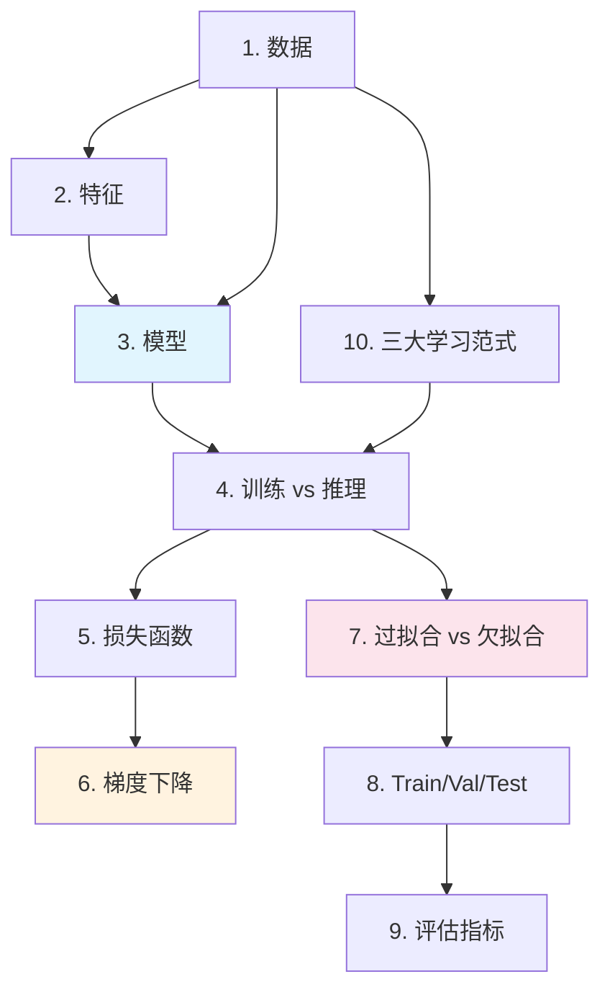

# Stage 1: 基础概念

> **"AI 的地基——不懂这些词，后面所有技术文档都是天书。"**
>
> 本层目标：掌握 AI 领域最核心的通用词汇，能读懂技术文章的骨架。

## 阶段目标

完成本阶段后，你将能够：
1. 解释数据、特征、模型三者之间的关系
2. 清楚说明训练和推理的区别及各自核心关注点
3. 用自己的话解释损失函数和梯度下降的作用
4. 画出过拟合/欠拟合/刚好之间的示意图并说明应对方法
5. 说出 Train/Val/Test 各自用途和黄金法则
6. 根据问题类型选择合适的评估指标
7. 区分三大学习范式并各举一例

## 本层概要

| 属性 | 值 |
|------|---|
| 包含核心概念 | 10 个 |
| 预计学习时间 | 5-8 小时 |
| 前置依赖 | [[学习/concepts/stage0_awakening|Stage 0: AI 觉醒]] |
| 适合人群 | 准备进入技术细节的学习者 |

---

## 核心概念清单

| # | 概念 | 类别 | 重要度 | 详解位置 |
|---|------|------|--------|----------|
| 1 | 数据 (Data) | 输入 | P0 | 下方 |
| 2 | 特征 (Feature) | 表示 | P0 | 下方 |
| 3 | 模型 (Model) | 核心 | P0 | 下方 |
| 4 | 训练 vs 推理 | 流程 | P0 | 下方 |
| 5 | 损失函数 (Loss Function) | 优化目标 | P0 | 下方 |
| 6 | 梯度下降 (Gradient Descent) | 优化方法 | P0 | 下方 |
| 7 | 过拟合 vs 欠拟合 | 实践难题 | P0 | 下方 |
| 8 | Train/Val/Test Split | 评估方法 | P0 | 下方 |
| 9 | 评估指标 (Metrics) | 度量 | P0 | 下方 |
| 10 | 三大学习范式 | 学习方法 | P0 | 下方 |

## 概念依赖图



## 概念详解

### 1. 数据 (Data)

- **一句话定义**：AI 的"燃料"——模型从数据中学习规律，没有数据就没有 AI。
- **为什么重要**：数据质量直接决定模型上限。Garbage In, Garbage Out。
- **关键类型**：
  - **结构化数据**：表格（Excel/数据库），每行一个样本，每列一个特征
  - **非结构化数据**：文本、图像、音频、视频 —— 现代 AI 的主战场
  - **标注数据**：带有人工标签的数据（如"这是猫"），用于监督学习
  - **无标注数据**：没有标签的海量原始数据，用于无监督/自监督学习
- **通俗类比**：数据就像学生用的教材和习题集。教材质量越好、习题越多，学生学得越好。
- **实践要点**: 数据质量 > 数据数量。1000 条干净标注数据胜过 10000 条脏数据。

### 2. 特征 (Feature)

- **一句话定义**：数据的"属性"或"维度"——用来描述一个样本的各个方面的信息。
- **为什么重要**：特征是模型理解世界的"语言"。特征选得好，问题就解决了一半。
- **关键区分**：
  - **手工特征**：人设计的特征（传统 ML 的核心工作，如词频、TF-IDF）
  - **自动特征**：神经网络自己学会的特征表示（深度学习的核心优势）
- **例子**：房价预测中：面积、地段、房龄 → 都是特征；图像分类中：像素 RGB → 原始特征，边缘/纹理 → 工程化特征。
- **演进**: 传统 ML 依赖特征工程（Feature Engineering），深度学习用表示学习（Representation Learning）自动学特征。

### 3. 模型 (Model)

- **一句话定义**：从数据中学到的"规律"的数学表达——输入数据 → 输出预测的函数/映射。
- **为什么重要**：模型是 AI 系统的核心产物。所有训练、调优都是围绕构建更好的模型。
- **模型的本质**：一堆参数（数字）。比如线性模型 `y = wx + b`，`w` 和 `b` 就是参数。深度学习模型可能有 billions 个参数。
- **通俗类比**：模型像一个经验丰富的老师傅——你给他看原材料（输入），他就能告诉你该怎么做（输出）。这个"判断力"就是模型。

### 4. 训练 vs 推理 (Training vs Inference)

- **一句话定义**：
  - **训练 (Training)**：让模型从数据中学习的过程（"上课"）
  - **推理 (Inference)**：用训练好的模型对新数据做预测的过程（"考试/工作"）
- **为什么重要**：这两个阶段的目标、约束、优化方向完全不同。混淆它们会导致很多错误决策。

| 维度 | 训练阶段 | 推理阶段 |
|------|---------|---------|
| 目标 | 学到准确的规律 | 快速给出准确答案 |
| 耗时 | 数小时到数周 | 毫秒到秒级 |
| 算力需求 | GPU 集群 | 可用 CPU / 单卡 GPU |
| 主要挑战 | 过拟合、收敛速度 | 延迟、吞吐量、成本 |
| 发生频率 | 一次或偶尔 | 每次用户请求 |

- **通俗类比**：训练像医生读医学院（长期、高强度）；推理像医生给病人看病（快速、精准）。

### 5. 损失函数 (Loss Function)

- **一句话定义**：衡量"模型预测"和"真实答案"之间差距的评分标准。差距越大，损失越高。
- **为什么重要**：损失函数是训练过程的"指挥棒"。它定义了什么算"好"、什么算"坏"，决定了模型往哪个方向优化。
- **常见损失函数**：

| 名称 | 适用场景 | 直观含义 |
|------|---------|---------|
| MSE (均方误差) | 回归问题 | 预测值和真实值的平均距离平方 |
| 交叉熵 (Cross Entropy) | 分类问题 | 预测概率分布和真实分布的差异 |
| Hinge Loss | SVM 分类 | 分类边界的间隔违反程度 |

- **通俗类比**：损失函数像考试的评分标准——你答错了扣多少分、答偏了怎么扣分，规则不同，学生的应试策略就完全不同。

### 6. 梯度下降 (Gradient Descent)

- **一句话定义**：通过计算损失函数的"坡度"（梯度），一步步往下走找到最低点（最小损失）的优化方法。
- **为什么重要**：几乎所有现代 AI 模型的训练都基于梯度下降及其变体。不理解它就不理解训练过程。
- **直观过程**：
  1. 随机站在山坡上的某个位置（随机初始化参数）
  2. 看看脚下哪边更低（计算梯度）
  3. 往低的方向迈一小步（更新参数）
  4. 重复 2-3 直到到达谷底（收敛）
- **关键概念**：学习率 (Learning Rate) —— 步子大小。太大可能跨过最低点，太小又走得太慢。
- **核心公式**: `θ_next = θ - η · ∇J(θ)`，其中 η 是学习率，∇J 是梯度。

### 7. 过拟合 vs 欠拟合 (Overfitting vs Underfitting)

- **一句话定义**：
  - **欠拟合**：模型太简单，连训练数据都没学好（"差生"）
  - **过拟合**：模型太复杂，把训练数据的噪声也记住了，遇到新数据就不行（"死记硬背的考生"）
  - **刚刚好**：模型学会了真正的规律，泛化能力强（"真正学会的学生"）
- **为什么重要**：这是机器学习中最核心的实践问题。大部分调参工作都在解决这个 trade-off。

```
误差
 ↑
 │    过拟合区         欠拟合区
 │    ╱  训练误差↓     训练误差↑
 │   ╱   测试误差↑     测试误差↑
 │  ╱
 │ ╱   ← 刚刚好的区域在这里
 │╱
 └──────────────────→ 模型复杂度
```

- **解决过拟合的方法**：更多数据、正则化 (L1/L2)、Dropout、早停 (Early Stopping)、数据增强
- **解决欠拟合的方法**：更复杂的模型、更优的特征、更长的训练时间

### 8. 训练集 / 验证集 / 测试集 (Train / Val / Test Split)

- **一句话定义**：将数据分成三份，分别用于"学习"、"调参"、"最终考试"。
- **为什么重要**：这是评估模型真实能力的唯一科学方法。不用测试集做任何决策！

| 数据集 | 用途 | 类比 |
|--------|------|------|
| 训练集 (Train, ~70%) | 让模型学习 | 学生的课本和练习题 |
| 验证集 (Val, ~15%) | 调整超参数、选模型 | 模拟考试（可反复查看错题） |
| 测试集 (Test, ~15%) | 最终评估模型性能 | 正式高考（只能考一次） |

- **黄金法则**：**绝对不能用测试集的结果来调整模型**，否则测试集就失去了"公正性"。

### 9. 评估指标 (Evaluation Metrics)

- **一句话定义**：量化衡量模型"好不好"的标准数值。
- **为什么重要**：没有指标就无法比较模型优劣，也无法知道模型是否达到上线标准。
- **核心指标体系**：
  - **回归**: MAE（平均绝对误差）、MSE（均方误差）、R²（拟合优度）
  - **分类**:
    - **准确率 (Accuracy)**：预测正确的比例 —— 但在数据不均衡时会误导
    - **精确率 (Precision)**：预测为正的里面，真正是正的比例 —— "我说是的，多准？"
    - **召回率 (Recall)**：真正的正例里，被找出来的比例 —— "真实的，我找到了多少？"
    - **F1 分数**：精确率和召回率的调和平均 —— 两者的平衡

### 10. 三大学习范式

- **一句话定义**：根据"数据是否有标签"划分的三种基本学习方法。

| 范式 | 有标签？ | 核心思想 | 典型任务 |
|------|---------|---------|---------|
| **监督学习 (Supervised)** | 有 | 给出输入→输出的示例，让模型学会映射 | 图像分类、房价预测、机器翻译 |
| **无监督学习 (Unsupervised)** | 无 | 让模型自己发现数据中的结构 | 聚类、降维、异常检测 |
| **强化学习 (Reinforcement)** | 有奖励信号 | 通过与环境交互获得的奖励/惩罚来学习 | 游戏 AI、机器人控制、推荐系统 |

- **2026 重要新增范式**：
  - **自监督学习 (Self-Supervised)**：从数据自身生成标签（如把句子遮住一部分让模型补全）—— GPT/BERT 的基础
  - **半监督学习 (Semi-Supervised)**：少量标注 + 大量无标注数据混合使用

---

## 常见误解

| 误解 | 澄清 |
|------|------|
| "模型越大越好" | 模型过大反而过拟合；关键是在偏差与方差间找平衡 |
| "训练误差低 = 模型好" | 训练误差低可能只是过拟合；测试误差才反映真实能力 |
| "数据越多越好" | 数据质量比数量更重要；脏数据会让模型学错 |
| "准确率高就够了" | 不平衡数据下准确率会误导（如 99% 是负样本，全猜负也有 99%） |
| "深度学习不需要特征工程" | 深度学习自动学特征，但数据预处理、清洗仍是关键 |
| "梯度下降一定能找到最优解" | 可能陷入局部最优；需要学习率调优、多次初始化 |

## 偏差-方差权衡的深度理解

这是 ML 最核心的实践概念，值得单独深化：

```
总误差 = 偏差²(Bias²) + 方差(Variance) + 不可约误差

偏差高（欠拟合）:
  - 模型太简单（如用线性模型拟合非线性数据）
  - 特征不够 / 训练时间太短
  解决: 更复杂模型、更多特征、更长训练

方差高（过拟合）:
  - 模型太复杂 / 训练数据太少 / 噪声被当规律
  解决: 更多数据、正则化、Dropout、早停、简化模型
```

**调参的核心就是找这个平衡点**。学习曲线（训练/验证误差 vs 训练量）是诊断工具：
- 两条曲线都高且接近 → 欠拟合（加复杂度）
- 训练低、验证高 → 过拟合（加数据/正则化）
- 两条曲线都低且接近 → 刚刚好

## 评估指标的选择决策树

不同任务用不同指标，这是常考点也是实践必备：

```
预测连续值（回归）?
├─ 是 → MSE / MAE / R²
└─ 否（分类）→
   数据平衡吗?
   ├─ 是 → Accuracy 可用
   └─ 否 →
      关心"找全"还是"找对"?
      ├─ 找全（如疾病筛查）→ Recall 优先
      ├─ 找对（如垃圾邮件）→ Precision 优先
      └─ 平衡 → F1 / ROC-AUC
```

**业务场景示例**:
- 癌症筛查：高 Recall（不漏诊），容忍误诊（低 Precision）
- 垃圾邮件：高 Precision（不误杀），容忍漏网（低 Recall）
- 推荐系统：常用 NDCG / Hit Rate

## 面试高频考点

本阶段概念是 ML 面试的基础，高频考点：

| 考点 | 典型问题 | 答题要点 |
|------|---------|---------|
| 过拟合 | 如何判断和解决？ | 学习曲线诊断 + 5 种解法 |
| 评估指标 | 为什么不用 Accuracy？ | 不平衡数据陷阱，用 F1/AUC |
| 梯度下降 | 学习率太大/小会怎样？ | 震荡 vs 收敛慢 |
| 训练/测试 | 为什么要三份分？ | 防止测试集泄露 |
| 损失函数 | 分类为什么用交叉熵？ | 概率分布的差异度量 |
| 学习范式 | 监督 vs 自监督区别？ | 标签来源：人工 vs 数据自身 |

## 学习资源

| 类型 | 资源 | 说明 |
|------|------|------|
| 书籍 | [[学习/References/books/hands-on-ml-geron\|Hands-On ML]] Ch 1-4 | ML 全景、端到端项目、分类、训练 |
| 书籍 | [[学习/References/books/why-machines-learn\|Why Machines Learn]] | 数学科普直觉 |
| 课程 | [Google ML Crash Course](https://developers.google.com/machine-learning/crash-course) | 免费速成 |
| 课程 | [[学习/Courses/microsoft/microsoft_ai_for_beginners\|Microsoft AI for Beginners]] | 免费 12 周 |
| 实战 | Kaggle 入门竞赛 | 动手练习 |

## 学完本层的标志

- [ ] 能解释数据、特征、模型三者之间的关系
- [ ] 能清楚说明训练和推理的区别，以及各自的核心关注点
- [ ] 能用自己的话解释损失函数和梯度下降的作用
- [ ] 能画出过拟合/欠拟合/刚好之间的示意图并说明如何应对过拟合
- [ ] 能说出 Train/Val/Test 各自的用途和黄金法则
- [ ] 能根据问题类型选择合适的评估指标
- [ ] 能区分三大学习范式并各举一例

## 下一步

完成 Stage 1 后：
- **进入技术核心** → [[学习/concepts/stage2_core_tech|Stage 2: 核心技术]]
- **补充数学基础** → [[数学基础/README_for_dummy|数学基础]]（线性代数、概率统计）
- **回看全景** → [[学习/concepts/index|概念分阶索引]]

## Related

- [[学习/concepts/index|概念分阶索引]]
- [[学习/concepts/stage0_awakening|Stage 0: 觉醒]]
- [[学习/concepts/stage2_core_tech|Stage 2: 核心技术]]
- [[学习/pathways/index|学习路径]]
- [[机器学习/]] — ML 知识章节
- [[数学基础/]] — 数学基础章节
- [[模型评估/]] — 评估指标详解
- [[深度学习/Optimization/Optimization_for_dummy|优化入门]]

> **关联**: → [[学习/concepts/index|概念分阶]] | [[学习/concepts/stage2_core_tech|Stage 2 核心技术]] | [[机器学习/]] | [[数学基础/]] | [[模型评估/]]

## 相关链接

- [[学习/concepts/index|学习概念索引]] — 学习阶段主题导览
- [[学习/concepts/stage0_awakening|Stage 0: AI 觉醒]] — 前置阶段
- [[学习/concepts/stage2_core_tech|Stage 2: 核心技术]] — 下一阶段
- [[概念/General/ai-fundamentals|AI 基础]] — 基础概念卡片
- [[学习/index|学习首页]] — 学习路径总览
- [[学习/pathways/absolute-beginner|零基础学习路径]] — 对应的路径规划
