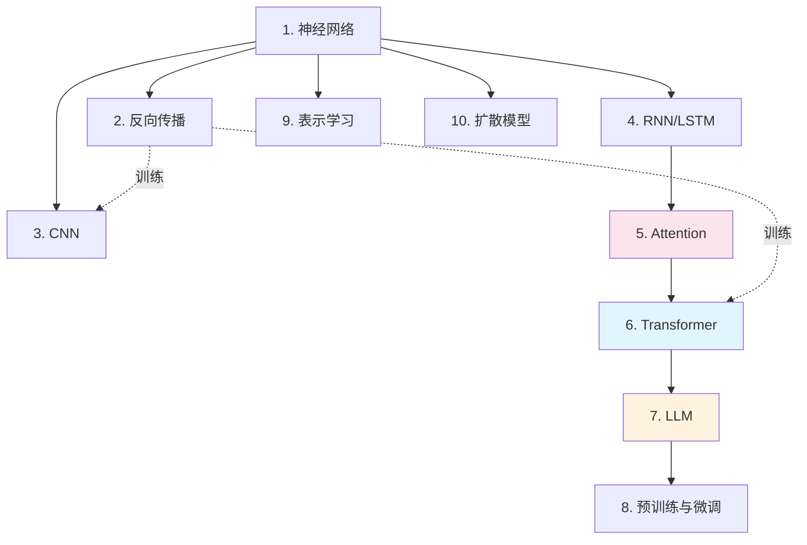

# Stage 2: 核心技术

> **"现代 AI 的引擎——理解这些，你就理解了为什么 AI 在 2012 年后开始爆发。"**
>
> 本层目标：掌握从神经网络到 Transformer 的核心技术栈，理解 LLM 为什么如此强大。

## 阶段目标

完成本阶段后，你将能够：
1. 画出神经网络基本结构并解释前向传播过程
2. 解释反向传播的核心思想（从输出向输入传梯度）
3. 说明 CNN、RNN、Transformer 各自擅长的数据类型
4. 用自己的话解释 Attention 机制解决了什么问题
5. 说明 Transformer 相比 RNN 的主要优势
6. 解释 LLM 的涌现能力是什么意思
7. 说明预训练和微调的区别及常见微调方法
8. 简要描述扩散模型生成图像的基本原理

## 本层概要

| 属性 | 值 |
|------|---|
| 包含核心概念 | 10 个 |
| 预计学习时间 | 10-15 小时 |
| 前置依赖 | [[90_学习/concepts/stage1_foundation|Stage 1: 基础概念]] |
| 适合人群 | 想深入理解 AI 原理的开发者/研究者 |

---

## 核心概念清单

| # | 概念 | 类别 | 重要度 | 详解位置 |
|---|------|------|--------|----------|
| 1 | 神经网络 (Neural Network) | 架构基础 | P0 | 下方 |
| 2 | 反向传播 (Backpropagation) | 训练算法 | P0 | 下方 |
| 3 | CNN（卷积神经网络） | 视觉架构 | P0 | 下方 |
| 4 | RNN / LSTM（序列模型） | 序列架构 | P1 | 下方 |
| 5 | Attention 机制 | 核心突破 | P0 | 下方 |
| 6 | Transformer 架构 | 现代基石 | P0 | 下方 |
| 7 | 大语言模型 (LLM) | 应用核心 | P0 | 下方 |
| 8 | 预训练与微调 | 训练范式 | P0 | 下方 |
| 9 | 表示学习 (Representation Learning) | 核心价值 | P1 | 下方 |
| 10 | 扩散模型 (Diffusion Model) | 生成模型 | P1 | 下方 |

## 概念依赖图



## 概念详解

### 1. 神经网络 (Neural Network)

- **一句话定义**：受人脑启发的计算模型——由大量"神经元"分层连接组成，每个神经元接收输入、做简单计算、输出结果。
- **为什么重要**：神经网络是深度学习和几乎所有现代 AI 的基础架构。没有它就没有 GPT、没有 AlphaFold、没有自动驾驶。
- **核心结构**: 输入层 → 隐藏层（多层）→ 输出层，每层神经元接收上层加权输入，经激活函数输出。
- **关键概念**：
  - **层 (Layer)**：一组神经元，同一层神经元之间没有连接
  - **权重 (Weight)**：神经元之间连接的强弱，决定信息传递的重要程度
  - **激活函数 (Activation Function)**：给输出加非线性，让网络能学复杂模式（如 ReLU、Sigmoid）
- **通俗类比**：神经网络像一座有很多层的工厂流水线。每一层工人都把上层的半成品加工一下，传给下一层。

### 2. 反向传播 (Backpropagation)

- **一句话定义**：计算神经网络中每个参数对最终误差"贡献了多少"的高效算法——从输出层向输入层反向传播梯度。
- **为什么重要**：反向传播让训练深层网络成为可能。1986 年 Rumelhart 等人提出后，深度网络才真正开始学习。
- **直观过程**：
  1. 数据从输入流向输出，得到预测（前向传播）
  2. 计算预测与真实答案的误差（损失函数）
  3. 从输出层反向走，逐层计算每个参数对误差的"责任"（链式法则）
  4. 用梯度下降更新每个参数
- **通俗类比**：反向传播像考试后老师逐题分析——哪道题错了、哪个知识点薄弱，然后把"下次要更注意"的信号传递到每个学生的学习策略中。

### 3. CNN — 卷积神经网络

- **一句话定义**：专门处理网格化数据（如图像）的神经网络——通过"卷积核"扫描图像提取局部特征。
- **为什么重要**：CNN 是计算机视觉的基石，让 AI 第一次在图像识别上超越人类。它让图像识别从"手工设计特征"进化到"自动学习特征"。
- **核心机制**：卷积核（一个小矩阵）在图像上滑动，每滑动一次做一次"局部特征提取"。多个卷积层叠加，从浅层的"边缘/纹理"到深层的"物体部件/整体"。
- **典型应用**：图像分类（ResNet，详见 [[90_学习/References/Papers/ResNet_Reading]]）、目标检测（YOLO）、图像分割（U-Net）
- **通俗类比**：CNN 像用放大镜在不同位置观察一幅画——每次只看一小块，先找线条，再找形状，最后理解画面内容。

### 4. RNN / LSTM — 序列模型

- **一句话定义**：专门处理有顺序的序列数据（文本、时间序列、音频）的神经网络——能"记住"之前的信息来处理当前输入。
- **为什么重要**：RNN 是处理文本/语音等序列数据的早期方案，很多 NLP 任务都建立在这个基础上。
- **核心问题**：RNN 有"梯度消失"问题——太长的序列会让早期信息被"遗忘"。LSTM 和 GRU 通过"门控机制"解决了这个问题。
- **局限性**：RNN 训练慢（无法并行，必须逐步计算）、长序列仍然难以处理 → 这就是 Transformer 出现的原因。
- **通俗类比**：RNN 像读一本小说的读者——读到第10章时，读者脑子里同时记住了前面所有章节的关键情节。LSTM 更聪明，它知道哪些情节重要要记住，哪些可以忘掉。

### 5. Attention 机制

- **一句话定义**：让模型在处理某个元素时，能"关注"到其他所有相关元素，而不是只能按顺序处理。
- **为什么重要**：Attention 是 Transformer 的核心，也是现代 AI 最重要的突破之一。它解决了 RNN 的长序列依赖问题，让并行训练成为可能。
- **直观理解**：阅读一段话时，你不会逐字记忆，而是关注关键词之间的关系。Attention 就是让 AI 做同样的事。
- **核心公式**: `Attention(Q,K,V) = softmax(Q·K^T / √d_k) · V`，其中 Q(Query)=我在找什么，K(Key)=我能提供什么，V(Value)=实际内容。
- **例子**：翻译 "The cat sat on the mat" 时，"sat" 和 "cat" 关系紧密，Attention 机制让模型知道翻译 "sat" 时要特别关注 "cat"。

### 6. Transformer 架构

- **一句话定义**：完全基于 Attention 机制的序列处理架构——丢弃 RNN，用 Self-Attention + 前馈网络处理序列，训练速度大幅提升。
- **为什么重要**：Transformer 是 2017 年 Google 提出的（详见 [[90_学习/References/Papers/Attention_Is_All_You_Need_Reading]]），它是 GPT、BERT、ChatGPT、Sora 等所有大模型的底层架构。可以说没有 Transformer，就没有 2020 年后的大模型爆发。
- **三大关键创新**：
  1. **Self-Attention**：序列内任意两个位置可以直接交互（无 RNN 的递归约束）
  2. **多头注意力 (Multi-Head Attention)**：多个 Attention 并行，关注不同类型的关系
  3. **位置编码 (Positional Encoding)**：用数学方式给序列中的位置信息编码
- **通俗类比**：RNN 像接力赛跑（必须等前一个人跑完才能开始），Transformer 像拔河比赛（所有人同时用力，信息自由传递）。

### 7. 大语言模型 (LLM)

- **一句话定义**：在大规模文本上预训练的、参数规模巨大的 Transformer 模型——具备涌现能力（Emergent Abilities）。
- **为什么重要**：LLM 是 2020-2026 年 AI 领域最重要的事件。GPT、Claude、Gemini 都是 LLM。它们展示了"规模"（更多参数 + 更多数据）带来的质变。
- **涌现能力**：当模型大到一定规模时，突然涌现出在小模型上不存在的能力，如思维链 (Chain-of-Thought)、上下文学习 (In-Context Learning)、零样本推理 (Zero-Shot)。
- **主流 LLM 家族**：GPT 系列 (OpenAI)、Claude 系列 (Anthropic)、Gemini (Google)、LLaMA (Meta)、Qwen/DeepSeek (中国团队)。

### 8. 预训练与微调 (Pretraining & Fine-tuning)

- **一句话定义**：
  - **预训练**：在大规模通用数据上训练模型学"通用能力"（如语言理解）
  - **微调**：在特定任务数据上继续训练，让模型学会"专业技能"
- **为什么重要**：这是现代 LLM 的标准训练范式。预训练成本极高，但微调成本低、速度快，可以在开源模型基础上快速定制。
- **微调技术演进**：
  - **全参数微调 (FFT)**：更新所有参数，效果好但成本高
  - **LoRA**：只训练少量附加低秩矩阵，显存减少 90%+
  - **QLoRA**：在 4-bit 量化的模型上做 LoRA，效率更高
  - **RLHF / DPO**：用人类反馈信号对齐模型输出
- **通俗类比**：预训练像一个人读完了十二年通识教育；微调像去读了职业技能培训班。

### 9. 表示学习 (Representation Learning)

- **一句话定义**：让模型自动学习数据的"最佳表示方式"——把原始数据（如文字、图像）转换成模型"能理解"的数值向量。
- **为什么重要**：这是深度学习最核心的价值——告别手工设计特征，让模型自己发现什么是重要的。
- **里程碑**：Word2Vec (2013, 词的分布式表示)、BERT (2018, 上下文相关词表示)、CLIP (2021, 跨模态统一表示)。

### 10. 扩散模型 (Diffusion Model)

- **一句话定义**：通过"逐步加噪声 → 逐步去噪"学习生成数据的模型——让 AI 能从噪声中"炼"出图像、视频、声音。
- **为什么重要**：扩散模型是 2022 年后图像/视频生成爆炸的核心技术（DALL-E 2、Midjourney、Stable Diffusion、Sora 都基于此）。
- **直观过程**：
  1. **前向过程**：给图片逐步加噪声，直到变成纯噪声
  2. **反向过程**：训练一个神经网络，逐步去噪，最终生成清晰的图片
- **通俗类比**：扩散模型像一位雕塑家——先把这块大理石砸成碎片（加噪声），然后凭感觉一点点拼接回去（去噪），最终雕出艺术品。

---

## 常见误解

| 误解 | 澄清 |
|------|------|
| "神经网络 = 模仿人脑" | 神经网络只是受人脑启发，实际是数学函数，比人脑简单亿万倍 |
| "深度学习就是多层神经网络" | 更准确说是"多层 + 自动特征学习"，层数多但不自动学特征不算 |
| "Transformer 完全取代了 CNN" | 视觉领域 ViT 在崛起，但 CNN 在小数据/边缘设备仍有优势 |
| "LLM 真的'理解'语言" | LLM 做的是统计模式匹配，不是人类意义上的理解（仍有争议） |
| "模型越大越智能" | 规模带来量变，但架构、数据质量、训练方法同样关键 |
| "扩散模型 = GAN" | 两者都是生成模型，但原理不同（扩散是去噪，GAN 是对抗） |

## Attention 公式的手推详解

Attention 是本阶段最核心也最常考的概念。完整推导：

```
输入: 序列 X (n 个 Token，每个 d 维)

步骤 1: 投影到 Q/K/V
  Q = X · W_Q   (Query: "我在找什么")
  K = X · W_K   (Key: "我能提供什么")
  V = X · W_V   (Value: "实际内容")

步骤 2: 计算注意力分数
  scores = Q · K^T            (n×n，两两相似度)
  scaled = scores / √d_k      (缩放防饱和)

步骤 3: 归一化
  weights = softmax(scaled)   (每行和为 1)

步骤 4: 加权求和
  output = weights · V        (n×d，新表示)

为什么除以 √d_k?
  d_k 大时点积值大，softmax 梯度饱和；除以 √d_k 稳定方差
```

## 三大架构的工程选型

| 架构 | 擅长数据 | 核心优势 | 主要局限 | 典型应用 |
|------|---------|---------|---------|---------|
| **CNN** | 网格化（图像） | 局部特征、参数共享 | 长距离依赖弱 | 图像分类、检测 |
| **RNN/LSTM** | 序列 | 能记忆历史 | 无法并行、长程弱 | 早期 NLP、时序 |
| **Transformer** | 任意序列 | 并行、长程强、通用 | O(n²) 复杂度 | LLM、ViT |

## 微调技术演进对比

| 技术 | 原理 | 显存 | 效果 | 适用 |
|------|------|------|------|------|
| **FFT** | 更新所有参数 | 最高 | 最好 | 算力充足 |
| **LoRA** | 低秩附加矩阵 | 降 90%+ | 接近 FFT | 主流选择 |
| **QLoRA** | 4-bit + LoRA | 极低 | 略降 | 消费级 GPU |
| **Adapter** | 插入小模块 | 低 | 良好 | 多任务共享 |

**LoRA 核心**: `W' = W + A·B`（A: d×r, B: r×d, r<<d），参数量从 d² 降到 2dr。

## 面试高频考点

| 考点 | 典型问题 | 答题要点 |
|------|---------|---------|
| Attention | 手推公式 | Q/K/V + 缩放 + softmax |
| Transformer | 为什么比 RNN 好？ | 并行 + 长程 O(1) |
| 多头 | 为什么多头？ | 不同子空间关注不同模式 |
| 位置编码 | 为什么需要？ | Attention 置换不变 |
| LoRA | 原理？ | 低秩分解省显存 |
| 涌现能力 | 是什么？ | 规模超阈值后突然出现 |

## 学习资源

| 类型 | 资源 | 说明 |
|------|------|------|
| 书籍 | [[90_学习/References/books/hands-on-ml-geron\|Hands-On ML]] Part 2 | DL 全栈实战 |
| 书籍 | [[90_学习/References/books/hands-on-llms-alammar\|Hands-On LLMs]] | 图解 LLM 内部机制 |
| 书籍 | [[90_学习/References/books/nlp-with-transformers\|NLP with Transformers]] | HF 生态 Transformer 应用 |
| 书籍 | [[90_学习/References/books/build-llm-from-scratch-raschka\|Build LLM From Scratch]] | 从零实现 GPT |
| 论文 | [[90_学习/References/Papers/Attention_Is_All_You_Need_Reading\|Attention Is All You Need]] | Transformer 原始论文 |
| 论文 | [[90_学习/References/Papers/ResNet_Reading\|ResNet]] | 残差连接与深度网络 |
| 论文 | [[90_学习/References/Papers/BERT_Reading\|BERT]] | 编码器代表 |
| 论文 | [[90_学习/References/Papers/GPT3_Reading\|GPT-3]] | 解码器与规模法则 |

## 学完本层的标志

- [ ] 能画出神经网络的基本结构并解释前向传播过程
- [ ] 能解释反向传播的核心思想（从输出向输入传梯度）
- [ ] 能说明 CNN、RNN、Transformer 各自擅长的数据类型
- [ ] 能用自己的话解释 Attention 机制解决了什么问题
- [ ] 能说明 Transformer 相比 RNN 的主要优势
- [ ] 能解释 LLM 的涌现能力是什么意思
- [ ] 能说明预训练和微调的区别，以及常见的微调方法
- [ ] 能简要描述扩散模型生成图像的基本原理

## 下一步

完成 Stage 2 后：
- **想做工程落地** → [[90_学习/concepts/stage3_engineering|Stage 3: 工程实践]]
- **想深入 LLM / Agent** → [[90_学习/pathways/llm-engineer|LLM 工程师路径]]
- **想读论文做研究** → [[90_学习/pathways/ai-researcher|AI 研究者路径]]
- **回看全景** → [[90_学习/concepts/index|概念分阶索引]]

## Related

- [[90_学习/concepts/index|概念分阶索引]]
- [[90_学习/concepts/stage1_foundation|Stage 1: 基础]]
- [[90_学习/concepts/stage3_engineering|Stage 3: 工程]]
- [[90_学习/pathways/index|学习路径]]
- [[05_大模型/01_LLM_Fundamentals]] — LLM 基础
- [[03_深度学习/]] — 深度学习章节
- [[04_计算机视觉/]] — CV 章节

> **关联**: → [[90_学习/concepts/index|概念分阶]] | [[90_学习/concepts/stage3_engineering|Stage 3 工程]] | [[05_大模型/01_LLM_Fundamentals]] | [[03_深度学习/]] | [[90_学习/References/Papers/]]

## 相关链接

- [[90_学习/concepts/index|学习概念索引]] — 学习阶段主题导览
- [[90_学习/concepts/stage1_foundation|Stage 1: 基础概念]] — 前置阶段
- [[90_学习/concepts/stage3_engineering|Stage 3: 工程实践]] — 下一阶段
- [[05_大模型/04_Transformer_Revolution/Transformer_Revolution|Transformer 革命]] — 核心技术代表
- [[03_深度学习/02_Neural_Network_Core/Neural_Network_Core|神经网络核心]] — 核心技术基础
- [[90_学习/index|学习首页]] — 学习路径总览
