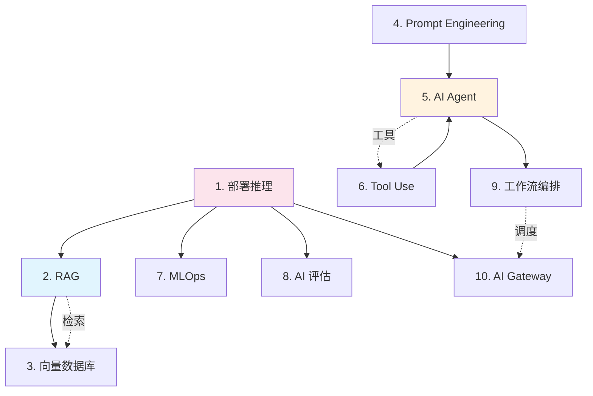

# Stage 3: 工程实践

> **"从实验室模型到线上产品——这一步的差距，淘汰了 90% 的 AI 项目。"**
>
> 本层目标：掌握将 AI 模型变成可用产品的核心工程能力。

## 阶段目标

完成本阶段后，你将能够：
1. 解释 RAG 的完整工作流程及每个环节的核心技术
2. 说出向量数据库和普通数据库的核心区别
3. 用 Prompt Engineering 技巧显著提升 LLM 输出质量
4. 设计一个简单的 AI Agent，包含规划、记忆、工具使用
5. 理解 MLOps 的全流程和核心工具
6. 从质量、安全、性能三个维度评估一个 AI 系统
7. 用 LangGraph 或 Dify 构建一个多步骤 AI 工作流
8. 理解 AI Gateway 的核心价值和主要功能

## 本层概要

| 属性 | 值 |
|------|---|
| 包含核心概念 | 10 个 |
| 预计学习时间 | 8-12 小时 |
| 前置依赖 | [[学习/concepts/stage2_core_tech|Stage 2: 核心技术]] |
| 适合人群 | 准备将 AI 落地的工程师、产品经理 |

---

## 核心概念清单

| # | 概念 | 类别 | 重要度 | 详解位置 |
|---|------|------|--------|----------|
| 1 | 模型部署与推理 (Deployment & Inference) | 基础设施 | P0 | 下方 |
| 2 | RAG（检索增强生成） | 应用架构 | P0 | 下方 |
| 3 | 向量数据库 (Vector Database) | 基础设施 | P0 | 下方 |
| 4 | Prompt Engineering（提示词工程） | 交互技术 | P0 | 下方 |
| 5 | AI Agent（智能体） | 应用架构 | P0 | 下方 |
| 6 | Tool Use / Function Calling | 能力扩展 | P0 | 下方 |
| 7 | MLOps（机器学习运维） | 工程方法论 | P1 | 下方 |
| 8 | AI 评估 (Evaluation) | 质量保障 | P0 | 下方 |
| 9 | AI 工作流与编排 (Orchestration) | 系统设计 | P1 | 下方 |
| 10 | AI Gateway（AI 网关） | 基础设施 | P1 | 下方 |

## 概念依赖图



## 概念详解

### 1. 模型部署与推理 (Deployment & Inference)

- **一句话定义**：把训练好的模型放到服务器/云上，让它能对外提供服务（推理）的过程。
- **为什么重要**：模型训练只是第一步。让模型在生产环境稳定、快速、便宜地跑起来，是工程上最大的挑战。
- **核心挑战**：延迟 (Latency)、吞吐量 (Throughput)、成本、可扩展性。
- **关键技术**：
  - **推理框架**：vLLM（当前最主流 LLM 推理引擎）、TensorRT-LLM、TGI
  - **量化 (Quantization)**：用更少 bit 表示参数，大幅降低显存和加速推理
  - **批处理 (Batching)**：把多个请求合并推理，提高 GPU 利用率
- **通俗类比**：训练像造车（一次性投入），推理像开出租车运营（持续优化效率与成本）。

### 2. RAG — 检索增强生成

- **一句话定义**：让 LLM 在回答问题前，先从外部知识库检索相关资料，再结合资料生成答案的技术。
- **为什么重要**：LLM 的知识有截止日期，且可能"幻觉"。RAG 是让 LLM 获得最新/私有知识的最主流方案。
- **工作流程**：`用户问题 → 检索（从知识库找相关文档）→ 拼接上下文 → LLM 生成答案`
- **核心环节**：文档切分（Chunking）、向量化（Embedding）、向量数据库存储检索、重排序（Reranking）、混合检索（向量 + 关键词）。
- **通俗类比**：RAG 像开卷考试——不是让考生背下所有知识，而是允许他翻书查资料再答题。

### 3. 向量数据库 (Vector Database)

- **一句话定义**：专门存储和检索高维向量（Embedding）的数据库，支持"按语义相似度"搜索。
- **为什么重要**：RAG、语义搜索、推荐系统的核心基础设施。
- **为什么不用普通数据库**：普通数据库做精确匹配（`WHERE name = "张飞"`），无法找到语义相近的内容；向量数据库做近似最近邻搜索（ANN）。
- **主流选择**：Milvus（开源可扩展）、Pinecone（云原生托管）、Weaviate（混合搜索）、Qdrant（Rust 高性能）、FAISS（单机研究）。

### 4. Prompt Engineering — 提示词工程

- **一句话定义**：通过设计更好的输入提示词，最大化激发 LLM 潜力的技术。
- **为什么重要**：同一模型，提示词不同，效果可能相差巨大。好提示词可以让 GPT-3.5 打败 GPT-4。
- **核心技巧**：Few-Shot（给例子）、Chain-of-Thought（一步步思考）、Zero-Shot CoT（"Let's think step by step"）、System Prompt（角色设定）、结构化输出（JSON）。

### 5. AI Agent — 智能体

- **一句话定义**：能自主感知环境、做出决策、执行行动的 AI 系统——不仅仅是回答问题，而是能完成任务。
- **为什么重要**：Agent 是 2024-2026 年 AI 最重要的方向。ChatGPT 只是"会说"，Agent 能"会做"。
- **Agent 的核心能力**：

| 能力 | 说明 | 示例 |
|------|------|------|
| **规划 (Planning)** | 分解复杂任务为子步骤 | "帮我订机票" → 查航班 → 比价 → 下单 |
| **记忆 (Memory)** | 跨会话记住关键信息 | 记住用户的偏好和历史对话 |
| **工具使用 (Tool Use)** | 调用外部工具 | 搜索网页、执行代码、读写文件 |
| **多 Agent 协作** | 多个 Agent 分工合作 | 一个 Agent 写代码，另一个测试 |

- **Agent 框架**：LangGraph、AutoGen、CrewAI、Dify、Coze
- **2026 协议**：MCP (Model Context Protocol)、A2A (Agent-to-Agent)、UCP (Universal Computer Protocol)

### 6. Tool Use / Function Calling

- **一句话定义**：让 LLM 调用外部工具（搜索、计算、数据库查询、API）来扩展其能力边界。
- **为什么重要**：LLM 本身只能生成文本，但 Tool Use 让它能"行动"——查实时天气、操作数据库、控制智能家居。
- **工作原理**：LLM 识别需要调用工具 → 输出工具调用请求（JSON）→ 系统执行工具 → 返回结果 → LLM 结合结果生成回答。

### 7. MLOps — 机器学习运维

- **一句话定义**：将 DevOps 的理念应用到 ML 生命周期——从数据处理、训练、部署到监控的全流程自动化。
- **为什么重要**：ML 系统比传统软件多了"数据"这个输入源，数据会漂移（Data Drift），模型会退化。MLOps 解决"模型上线后怎么持续维护"的问题。
- **核心环节**：数据收集 → 验证 → 特征工程 → 训练 → 评估 → 版本管理 → 部署 → 监控 → 自动触发再训练。
- **关键工具**：MLflow（实验跟踪）、DVC（数据版本控制）、Feast（特征平台）、Kubernetes（模型服务）、Prometheus/Grafana（监控）。

### 8. AI 评估 (AI Evaluation)

- **一句话定义**：系统性地衡量 AI 模型/系统的质量、可靠性、安全性的方法论。
- **为什么重要**：没有评估就没有改进。AI 评估比传统软件测试难得多——因为 AI 的输出常常是概率性的、没有唯一正确答案。
- **评估维度**：质量（BLEU/ROUGE/F1）、安全性（毒性检测）、可靠性（胜率/失败率）、性能（延迟/吞吐）、成本（每千 Token）。
- **2026 新趋势**：Agent 评估框架（RAPS 模型）、自动化红队测试、LLM-as-a-Judge。

### 9. AI 工作流与编排 (AI Workflow & Orchestration)

- **一句话定义**：将多个 AI 组件（LLM 调用、RAG 检索、工具执行、人类审批）组合成自动化流程的框架。
- **为什么重要**：真实 AI 产品往往不是单次 LLM 调用，而是多步骤、多工具、多 Agent 协作的复杂流程。
- **主流工具**：LangGraph（DAG 编排）、Dify（可视化）、Coze（对话 Bot）、Airflow（通用 ETL）、Temporal（微服务）。
- **工作流模式**：DAG（有向无环图）、状态机、事件驱动。

### 10. AI Gateway — AI 网关

- **一句话定义**：AI 应用的流量入口和调度中枢——统一管理对多个 LLM 的访问。
- **为什么重要**：企业往往同时使用多个 LLM，AI Gateway 是统一管理这些调用的基础设施。
- **核心功能**：多模型路由、负载均衡、降级策略、限流、成本控制、缓存、日志监控。
- **主流方案**：Portkey、W&B Inference、MLflow AI Gateway、自建（Nginx/Kong + FastAPI）。

---

## 常见误解

| 误解 | 澄清 |
|------|------|
| "RAG 就是搜索 + LLM" | RAG 是系统工程，检索质量、分块策略、重排序都严重影响效果 |
| "Agent = 多调几次 LLM" | Agent 需要规划、记忆、纠错、工具编排，远比多次调用复杂 |
| "MLOps = DevOps + 模型" | MLOps 多了数据版本、数据漂移、模型退化等独特挑战 |
| "部署就是 docker run" | LLM 部署涉及量化、批处理、KV Cache、显存管理等专项优化 |
| "评估就是跑测试集" | LLM 输出开放，需要 LLM-as-a-Judge、人工评估、对抗测试等多维方法 |
| "用最强模型就够了" | 成本、延迟、隐私都是约束；模型路由（小任务用小模型）是工程智慧 |

## RAG vs 微调 vs 提示的决策框架

这是 AI 工程最核心的决策之一。决策树：

```
任务需要外部/最新知识吗?
├─ 是 → RAG（知识可更新、可溯源）
└─ 否 →
   需要特定风格/格式/领域深度吗?
   ├─ 是 → 微调（内化能力）
   └─ 否 → 提示工程（零成本、即时生效）

三者可组合: 提示 + RAG + 微调
```

| 方法 | 适用 | 优势 | 劣势 |
|------|------|------|------|
| **提示工程** | 通用任务、快速迭代 | 零成本、即时 | 能力有限 |
| **RAG** | 知识密集、需引用 | 可更新、可溯源 | 检索依赖 |
| **微调** | 特定风格/领域 | 内化、推理快 | 成本高 |

**原则**: 优先提示 → 不够再 RAG → 仍不够才微调。

## Agent 设计模式速查

构建 Agent 时常见的设计模式与适用场景：

| 模式 | 结构 | 适用 | 风险 |
|------|------|------|------|
| **ReAct** | Thought→Action→Obs 循环 | 简单 2-5 步任务 | 可能陷入循环 |
| **Plan-Execute** | 先规划再执行 | 复杂多步任务 | 计划脱离实际 |
| **Router** | 按意图路由到不同 Agent | 多技能系统 | 路由错误 |
| **Pipeline** | 串行 Agent 流 | 内容生产流水线 | 级联错误 |
| **Debate** | 多 Agent 辩论 | 需要多方观点 | 成本高 |

## LLM 评估方法矩阵

LLM 评估是开放难题，不同方法各有取舍：

| 方法 | 成本 | 准确性 | 规模化 | 适用 |
|------|------|--------|--------|------|
| 人工评估 | 极高 | 金标准 | 差 | 最终验收 |
| LLM-as-Judge | 中 | 良好 | 好 | 大规模筛选 |
| 规则/正则 | 低 | 窄 | 极好 | 格式/合规检查 |
| 参考答案匹配 | 低 | 中 | 好 | 有标准答案的任务 |
| 对抗测试 | 高 | 针对性 | 中 | 安全/边界 |

**最佳实践**: 多方法组合——规则筛格式 + LLM-Judge 评质量 + 人工抽检校准。

## 开源 vs 闭源模型决策

| 维度 | 闭源 API | 开源模型 |
|------|----------|----------|
| 能力 | 通常最强 | 追赶中 |
| 成本 | 按 Token | 自建基建 |
| 隐私 | 数据出域 | 完全可控 |
| 定制 | 有限 | 可微调 |
| 运维 | 零运维 | 需自建 |

**2026 选型趋势**: 混合架构——闭源做复杂任务，开源做隐私敏感/高频简单任务，AI Gateway 统一调度。

## 生产化检查清单

AI 项目上线前的关键检查项：

- [ ] 评估集覆盖核心场景与边界情况
- [ ] 延迟/吞吐满足 SLA
- [ ] 成本在预算内（Token 消耗监控）
- [ ] 降级/Fallback 方案就绪
- [ ] 监控告警（质量、延迟、成本）
- [ ] 安全护栏（输入/输出过滤）
- [ ] 日志可追溯（每次调用记录）
- [ ] 数据隐私合规
- [ ] 灰度发布机制
- [ ] 回滚方案 |

## 学习资源

| 类型 | 资源 | 说明 |
|------|------|------|
| 书籍 | [[学习/References/books/ai-engineering-huyen\|AI Engineering]] | AI 工程全景（强烈推荐） |
| 书籍 | [[学习/References/books/designing-ml-systems-huyen\|Designing ML Systems]] | ML 系统设计 |
| 书籍 | [[学习/References/books/llm-engineers-handbook\|LLM Engineer's Handbook]] | 工程实现 |
| 书籍 | [[学习/References/books/llms-in-production\|LLMs in Production]] | 生产运维 |
| 书籍 | [[学习/References/books/ai-agents-in-action\|AI Agents in Action]] | Agent 实战 |
| 书籍 | [[学习/References/books/prompt-engineering-for-llms\|Prompt Engineering for LLMs]] | 提示工程 |
| 课程 | [[学习/References/Courses/rag-techniques-nirdiamant\|RAG Techniques]] | RAG 技术集 |
| 课程 | [[学习/References/Courses/genai-agents-nirdiamant\|GenAI Agents]] | Agent 技术 |

## 学完本层的标志

- [ ] 能解释 RAG 的完整工作流程，并知道每个环节的核心技术
- [ ] 能说出向量数据库和普通数据库的核心区别
- [ ] 能用 Prompt Engineering 技巧显著提升 LLM 输出质量
- [ ] 能设计一个简单的 AI Agent，包含规划、记忆、工具使用
- [ ] 能理解 MLOps 的全流程和核心工具
- [ ] 能从质量、安全、性能三个维度评估一个 AI 系统
- [ ] 能用 LangGraph 或 Dify 构建一个多步骤 AI 工作流
- [ ] 理解 AI Gateway 的核心价值和主要功能

## 下一步

完成 Stage 3 后：
- **想深入前沿方向** → [[学习/concepts/stage4_frontier|Stage 4: 前沿探索]]
- **专注 LLM 应用开发** → [[学习/pathways/llm-engineer|LLM 工程师路径]]
- **全面覆盖工程全链路** → [[学习/pathways/ml-practitioner|ML 从业者路径]]
- **走向职业化** → [[学习/concepts/stage5_professional|Stage 5: 职业化]]
- **回看全景** → [[学习/concepts/index|概念分阶索引]]

## Related

- [[学习/concepts/index|概念分阶索引]]
- [[学习/concepts/stage2_core_tech|Stage 2: 核心技术]]
- [[学习/concepts/stage4_frontier|Stage 4: 前沿]]
- [[学习/pathways/index|学习路径]]
- [[智能体/]] — Agent 知识章节
- [[RAG系统/RAG_Systems]] — RAG 专题
- [[部署推理/]] — 部署推理章节
- [[架构基建/]] — 架构基建章节

> **关联**: → [[学习/concepts/index|概念分阶]] | [[学习/concepts/stage4_frontier|Stage 4 前沿]] | [[智能体/]] | [[RAG系统/]] | [[部署推理/]] | [[架构基建/]]
