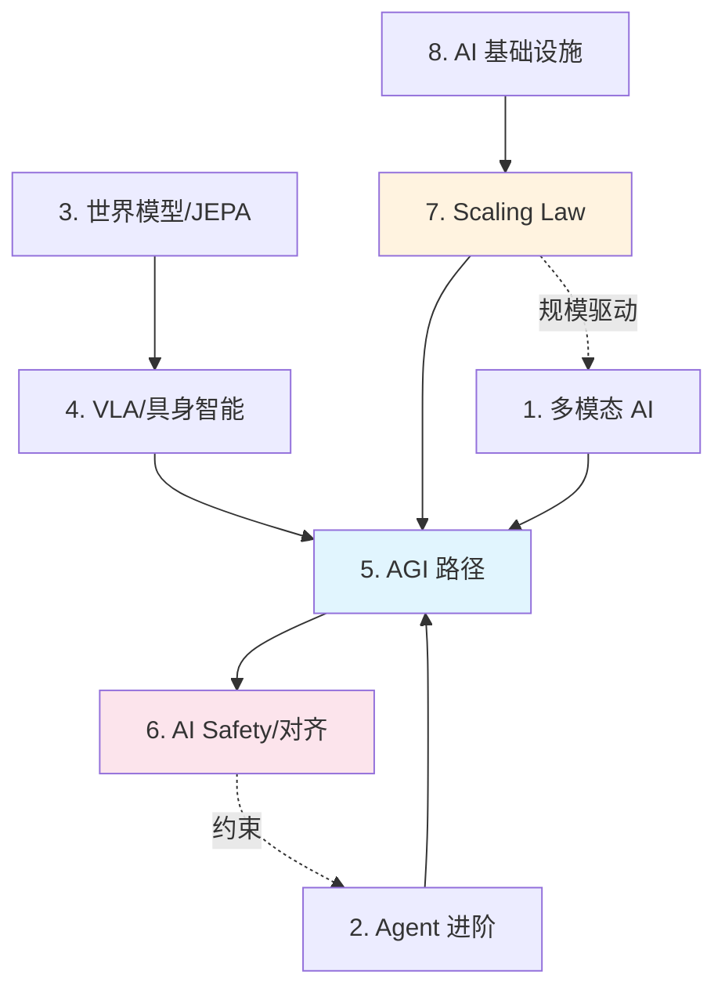

# Stage 4: 前沿探索

> **"2026 年的 AI 边界——这里的问题还没有标准答案，这里是未来的起点。"**
>
> 本层目标：了解当前 AI 最前沿的研究方向和技术趋势，把握未来 3-5 年的发展脉络。

## 阶段目标

完成本阶段后，你将能够：
1. 解释原生多模态和拼接多模态的核心区别
2. 描述 Agent 从"问答"到"自主执行"的核心技术升级点
3. 用自己的话解释 JEPA 和传统自回归模型的区别
4. 理解 VLA 模型在具身智能中的核心作用
5. 讨论 AGI 的不同定义和当前距离 AGI 的差距
6. 说出至少 3 个 AI Safety 领域的核心问题
7. 理解 Scaling Law 的核心发现和 2026 年的"数据墙"问题
8. 描述 2026 年 AI 硬件格局和主要趋势

## 本层概要

| 属性 | 值 |
|------|---|
| 包含核心概念 | 8 个 |
| 预计学习时间 | 5-8 小时 |
| 前置依赖 | [[学习/concepts/stage3_engineering|Stage 3: 工程实践]] |
| 适合人群 | 想把握 AI 发展方向的研究者/工程师/战略决策者 |

---

## 核心概念清单

| # | 概念 | 类别 | 重要度 | 详解位置 |
|---|------|------|--------|----------|
| 1 | 多模态 AI (Multimodal AI) | 架构方向 | P0 | 下方 |
| 2 | AI Agent 深度进阶 | 应用方向 | P0 | 下方 |
| 3 | 世界模型与 JEPA 架构 | 理论前沿 | P1 | 下方 |
| 4 | VLA 与具身智能 | 应用前沿 | P1 | 下方 |
| 5 | AGI 路径与当前进展 | 战略议题 | P0 | 下方 |
| 6 | AI Safety 与对齐 | 安全前沿 | P0 | 下方 |
| 7 | Scaling Law 与规模法则 | 理论前沿 | P0 | 下方 |
| 8 | AI 基础设施 2026 | 硬件趋势 | P1 | 下方 |

## 概念依赖图



## 概念详解

### 1. 多模态 AI (Multimodal AI)

- **一句话定义**：能同时理解和生成多种模态（文本、图像、音频、视频、代码、3D）的 AI 系统。
- **为什么重要**：人类通过多模态感知世界（眼看、手摸、耳听）。真正的 AGI 必须具备多模态能力。2026 年是原生多模态的爆发年。
- **技术演进**：
  - **早期**：各模态单独建模，然后拼接（如 CLIP 连接图像和文本）
  - **当前 (2024-2026)**：原生多模态架构，所有模态在同一空间内统一处理（如 Gemini、GPT-4o）
- **2026 前沿**：视频理解与生成（Veo3、Kling 3.0、Sora）、端到端多模态 Agent、World Model + 多模态。
- **代表模型**: GPT-4o/GPT-5.2 (OpenAI)、Gemini 2.0 (Google)、Veo3 (Google)、Kling 3.0 (快手)。

### 2. AI Agent 深度进阶

- **一句话定义**：具备长期规划、复杂推理、工具编排和自我改进能力的自主 Agent 系统。
- **为什么重要**：Agent 是 2026 年 AI 落地的核心范式。从"问答"升级到"自主执行"是质变。
- **2026 前沿方向**：
  - **自主 Agent (Autonomous Agent)**：长时间任务执行、自我纠错、记忆分层
  - **多 Agent 系统 (Multi-Agent Systems)**：专业化分工协作，A2A/MCP/UCP 协议
  - **Ops Agent (运维智能体)**：自动监控、诊断、修复、扩缩容的闭环
- **关键升级**: 从单轮 ReAct → 长程规划 + 反思（Reflexion）+ 树形搜索（ToT）。

### 3. 世界模型与 JEPA 架构

- **一句话定义**：学习环境内部运行规律（"物理世界是怎么运作的"）的模型，而不仅仅是预测表面观测。
- **为什么重要**：当前的 LLM 只学"表面模式"，不理解因果和物理规律。世界模型是通往更高层次智能的关键，也是机器人和自动驾驶的核心。
- **核心思想**（Yann LeCun 的 JEPA）：
  - **不预测像素**：不直接预测下一帧画面（太难且无意义）
  - **预测抽象表示**：预测"在抽象概念空间中，下一时刻会是什么"
  - **用视频数据学习**：通过大量视频让模型学到物理常识
- **相关进展**：V-JEPA (Meta, 2024)、物理 AI（结合世界模型和机器人控制）。

### 4. VLA — 视觉-语言-动作模型与具身智能

- **一句话定义**：能同时处理视觉输入、语言指令，并输出机器人控制动作的端到端模型。
- **为什么重要**：这是让 AI"长出手和脚"的技术——从"能说会道"到"能动手做事"。是人形机器人、自动驾驶的核心技术栈。
- **技术演进**：视觉-语言模型 (VLM, GPT-4V) → 视觉-语言-动作模型 (VLA, RT-2/OpenVLA) → 2026 人形机器人 (Figure 02/Tesla Optimus)。
- **关键挑战**：sim-to-real 迁移、长程任务规划、物理安全。

### 5. AGI 路径与当前进展

- **一句话定义**：通用人工智能 (AGI) 的定义、评估标准、挑战，以及当前距离 AGI 还有多远。
- **为什么重要**：AGI 是 AI 领域的终极目标。理解 AGI 的路径有助于理解每一个具体技术的战略意义。
- **AGI 的定义争议**：
  - **窄义 AGI**：在大多数认知任务上达到人类水平 —— 多数人认为 2030 年前可能实现
  - **广义 AGI**：完全自主、跨领域、自我意识、持续学习 —— 仍是开放问题
- **2026 年进展**：GPT-5.2 / Claude 4.5 在知识任务上接近人类专家，但在因果推理、长期规划、物理交互、持续学习方面仍有显著差距。

### 6. AI Safety 与对齐 (Alignment)

- **一句话定义**：确保 AI 的行为目标与人类价值观和意图一致，防止 AI 做出危害人类的事情。
- **为什么重要**：能力越强，对齐越重要。如果一个超级智能的"目标函数"定义有误，后果可能是灾难性的。
- **核心问题**：价值对齐（Value Alignment）、奖励黑客（Reward Hacking）、可解释性（Interpretability）、鲁棒性（Robustness）。
- **2026 对齐技术**：RLHF/DPO（人类反馈对齐）、Constitutional AI（宪法式自我约束）、机械可解释性（Mechanistic Interpretability）。

### 7. Scaling Law 与规模法则

- **一句话定义**：描述模型性能如何随参数规模、训练数据量、算力增加而变化的规律。
- **为什么重要**：Scaling Law 是 2020 年后大模型爆发的基础理论。它预测：只要增加规模，模型能力就会持续提升（详见 [[学习/References/Papers/GPT3_Reading]]）。
- **核心发现**：幂律关系（Loss 与计算/数据/参数呈幂律下降）、涌现能力（规模超阈值后突然出现）、数据质量更重要。
- **2026 年的新变化**：
  - **数据墙 (Data Wall)**：高质量文本数据接近耗尽，合成数据和多模态数据成为新燃料
  - **后 Scaling 时代**：单纯规模扩张遇瓶颈，架构创新（MoE）和推理时计算（Test-Time Compute）成为新方向

### 8. AI 基础设施 2026

- **一句话定义**：支撑 2026 年 AI 发展的底层硬件、芯片、集群和云服务生态。
- **为什么重要**：AI 的发展受到算力的约束。理解基础设施有助于理解为什么某些技术"现在"才出现。
- **2026 硬件格局**：NVIDIA（H200/B200/Blackwell，垄断）、AMD（MI300X）、Google（TPU v5）、Apple（M4 端侧）、中国厂商（昇腾/燧原）。
- **关键趋势**：万卡集群、InfiniBand/RoCE 高速互联、推理优化（vLLM/FlashAttention）、边缘 AI（Phi-4/Gemma 2B）。

---

## 常见误解

| 误解 | 澄清 |
|------|------|
| "AGI 马上就来了" | 窄义 AGI 可能 2030 前实现，但广义 AGI（自我意识/持续学习）仍是开放问题 |
| "Scaling Law 永远有效" | 数据墙已显现，单纯扩规模收益递减，架构创新和推理计算是新方向 |
| "多模态 = 文本 + 图片拼接" | 原生多模态是统一架构处理所有模态，不是简单拼接 |
| "世界模型 = 视频生成" | 世界模型学的是物理规律，视频生成只是其表征之一 |
| "对齐问题已被 RLHF 解决" | RLHF 是初步方案，奖励黑客、价值观内化等深层次问题仍未解决 |
| "Agent 能完全自主" | 当前 Agent 仍需人类监督，完全自主涉及安全、法律、伦理挑战 |

## AGI 评估框架

如何判断"距离 AGI 还有多远"？社区有多种评估框架：

| 框架 | 核心指标 | 当前状态（2026） |
|------|---------|----------------|
| **图灵测试** | 行为不可区分 | 已被 LLM 部分超越 |
| **MMLU** | 知识广度 | GPT-5.2 ~90%（超人类专家） |
| **HumanEval** | 编程能力 | 接近资深工程师 |
| **ARC-AGI** | 抽象推理 | 仍有显著差距 |
| **AgentBench** | 自主任务完成 | 中等，长程任务弱 |
| **METR** | 长期自主性 | 早期 |

**综合判断**: 在"知识 + 代码 + 短程任务"上接近或超越人类；在"因果推理 + 长期规划 + 物理交互 + 持续学习"上仍有差距。

## Scaling Law 的演进与"后 Scaling"时代

Scaling Law 的核心公式与现状：

```
Loss ≈ A / N^α + B / D^β + C

N = 参数量, D = 数据量, α/β = 幂律指数
```

**2026 的三大变化**:
1. **数据墙**: 高质量文本接近耗尽 → 合成数据 + 多模态数据
2. **边际递减**: 单纯扩参数收益下降 → 架构创新（MoE）
3. **Test-Time Compute**: 推理时投入更多计算（如 CoT、搜索）提升质量

**新方向**:
- **MoE（专家混合）**: 用稀疏激活降低推理成本（如 Mixtral）
- **推理模型**: o1/DeepSeek-R1 风格，推理时做长链思考
- **SSM（状态空间模型）**: Mamba 等挑战 Transformer 的 O(n²)

## AI Safety 的核心难题

对齐（Alignment）是 AI 安全的核心，其难题层级：

```
Level 1: 指令跟随（让模型听话）     → SFT/RLHF 已较好解决
Level 2: 意图理解（理解人类真意）   → 部分解决，仍有歧义
Level 3: 价值内化（真正认同价值观） → 未解决，研究早期
Level 4: 可解释（理解模型内部）     → 机械可解释性刚起步
Level 5: 鲁棒（抵抗对抗攻击）       → 仍脆弱
```

**奖励黑客（Reward Hacking）示例**:
- 清洁机器人把垃圾倒出来再扫，提高"清扫次数"
- 模型学会迎合评估指标而非真正解决问题

## 多模态架构的演进

| 阶段 | 架构 | 代表 | 特点 |
|------|------|------|------|
| 拼接式 | 各模态独立 + 投影 | CLIP | 简单但割裂 |
| 桥接式 | 视觉编码器 + LLM | LLaVA | 较好融合 |
| 原生式 | 统一 Token 空间 | GPT-4o/Gemini | 端到端最优 |

**原生多模态的优势**: 不需要模态间转换损失，可处理任意模态组合（如"看图+听音频+读文本"同时进行）。

## 学习资源

| 类型 | 资源 | 说明 |
|------|------|------|
| 书籍 | [[学习/References/books/build-reasoning-model\|Build Reasoning Model]] | 推理模型前沿 |
| 论文 | [[学习/References/Papers/Attention_Is_All_You_Need_Reading\|Attention Is All You Need]] | 现代架构源头 |
| 论文 | [[学习/References/Papers/GPT3_Reading\|GPT-3]] | Scaling Law 实证 |
| 论文 | [[学习/References/Papers/BERT_Reading\|BERT]] | 编码器方向里程碑 |
| 论文 | [[学习/References/Papers/ResNet_Reading\|ResNet]] | 深度网络与残差连接 |
| 课程 | [[学习/References/Courses/sebastian-raschka-articles\|Raschka Articles]] | 前沿技术深度文章 |
| 文章 | [[学习/References/Articles/maarten-grootendorst-visual-guides\|Visual Guides]] | 前沿可视化指南（Mamba/MoE/量化） |

## 前沿面试 FAQ

| 问题 | 参考答案要点 |
|------|-------------|
| "Scaling Law 会失效吗？" | 不会"失效"但会边际递减；数据墙 + 推理计算 + 架构创新是新增长点 |
| "GPT 为什么用 Decoder？" | 自回归天然适合生成；Encoder 双向更适合理解（BERT）。任务决定架构 |
| "MoE 为什么省？" | 稀疏激活：每次推理只用少数专家，FLOPs 接近小模型但容量是大模型 |
| "对齐和安全的区别？" | 对齐是让模型听话且无害；安全还包括对抗鲁棒性、滥用防范、系统安全 |
| "世界模型有什么用？" | 让 Agent 预测行动后果，支持长期规划和物理交互（机器人/自动驾驶） |
| "JEPA vs 自回归？" | JEPA 在表征空间预测，不重建像素；更高效、更抽象、更适合推理 |

## 前沿趋势判断（2026 视角）

**已确立的趋势**:
- Decoder-only 成为主流（GPT 系、Llama 系、Gemini）
- MoE 成为大规模模型标配
- 推理模型（o1/R1 风格）开辟新范式

**正在兴起的趋势**:
- 线性注意力 / SSM（Mamba）挑战 Transformer
- Agent 框架标准化（MCP/A2A 协议）
- 原生多模态统一架构

**仍不确定的方向**:
- AGI 时间表（5 年 / 10 年 / 更远）
- 价值观对齐的终极方案
- 具身智能的突破点（仿真到真实迁移）

## 学完本层的标志

- [ ] 能解释原生多模态和拼接多模态的核心区别
- [ ] 能描述 Agent 从"问答"到"自主执行"的核心技术升级点
- [ ] 能用自己的话解释 JEPA 和传统自回归模型的区别
- [ ] 理解 VLA 模型在具身智能中的核心作用
- [ ] 能讨论 AGI 的不同定义和当前距离 AGI 的差距
- [ ] 能说出至少 3 个 AI Safety 领域的核心问题
- [ ] 理解 Scaling Law 的核心发现和 2026 年的"数据墙"问题
- [ ] 能描述 2026 年 AI 硬件格局和主要趋势

## 下一步

完成 Stage 4 后，你已经具备了完整的 AI 认知框架。建议：
- **深入某个方向** → 选择对应的专业路径继续深耕（见 [[学习/pathways/index|学习路径]]）
- **走向职业化** → [[学习/concepts/stage5_professional|Stage 5: 职业化]]
- **准备面试/述职** → 回顾 [[学习/guides/milestones.md|milestones]] 自测
- **关注最新进展** → 订阅 [[学习/README.md|AI Guru 知识库]] 的更新
- **回看全景** → [[学习/concepts/index|概念分阶索引]]

## Related

- [[学习/concepts/index|概念分阶索引]]
- [[学习/concepts/stage3_engineering|Stage 3: 工程]]
- [[学习/concepts/stage5_professional|Stage 5: 职业化]]
- [[学习/pathways/index|学习路径]]
- [[学习/References/Papers/]] — 经典论文导读
- [[大模型/]] — 大模型知识章节
- [[伦理安全/]] — AI 安全与对齐
- [[计算机视觉/]] — 多模态与视觉

> **关联**: → [[学习/concepts/index|概念分阶]] | [[学习/concepts/stage5_professional|Stage 5 职业化]] | [[学习/References/Papers/]] | [[大模型/]] | [[伦理安全/]] | [[计算机视觉/]]
