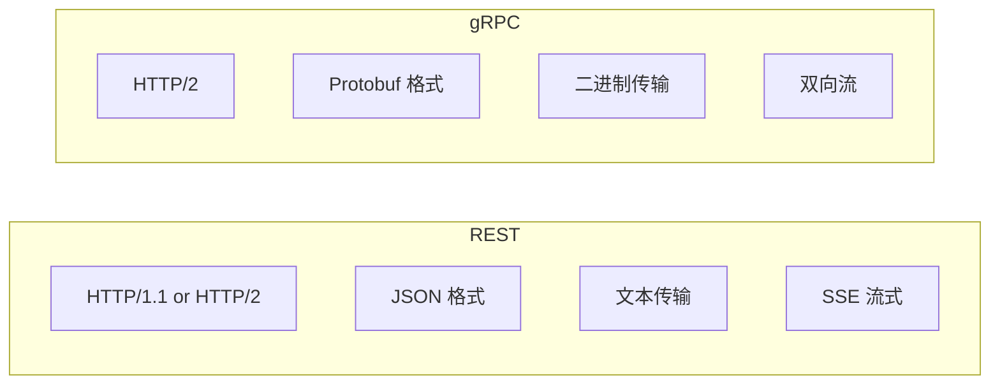
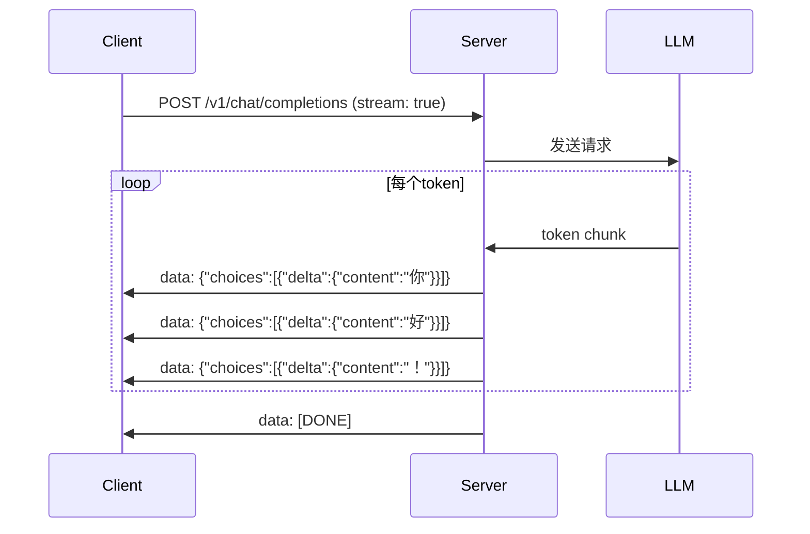
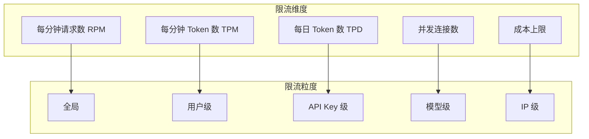
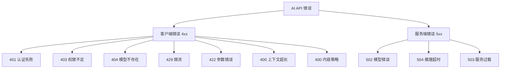
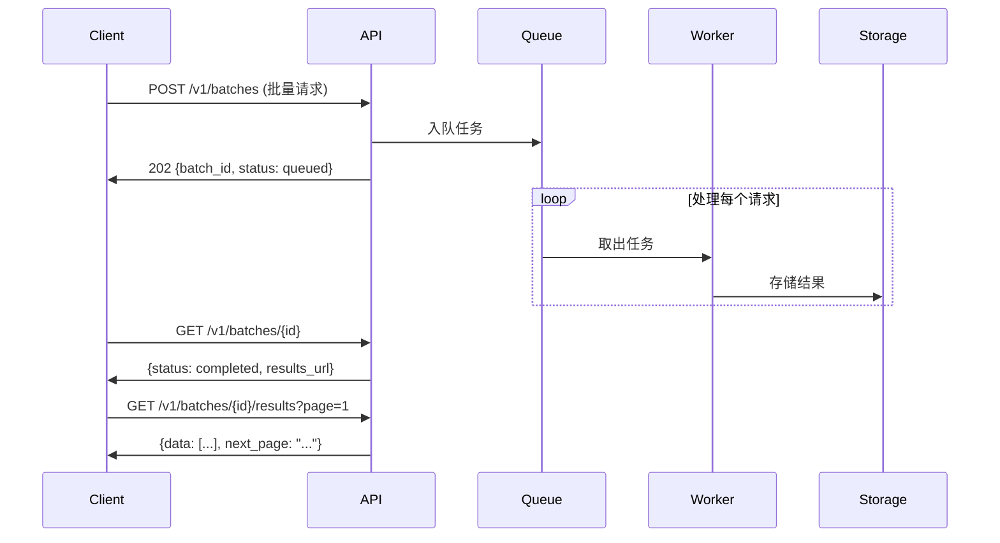
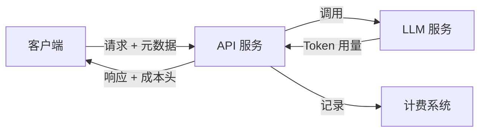

# AI API 设计指南

> **一句话秒懂**: AI API 设计就是定义"客户端如何优雅地调用 AI 服务"的接口规范，核心挑战在于处理流式响应、高延迟和成本控制。

## 目录

- [REST vs gRPC for AI](#rest-vs-grpc-for-ai)
- [OpenAI API 格式分析](#openai-api-格式分析)
- [流式响应 SSE](#流式响应-sse)
- [限流策略](#限流策略)
- [API 版本管理](#api-版本管理)
- [请求响应 Schema](#请求响应-schema)
- [错误处理模式](#错误处理模式)
- [批量预测分页](#批量预测分页)
- [认证模式](#认证模式)
- [成本追踪 Headers](#成本追踪-headers)
- [完整 FastAPI 示例](#完整-fastapi-示例)

---

## REST vs gRPC for AI

### 协议对比



| 维度 | REST + JSON | gRPC + Protobuf |
|------|------------|-----------------|
| **延迟** | 较高（JSON 序列化） | 低（二进制） |
| **流式支持** | SSE（单向） | 双向流（原生） |
| **可读性** | 高 | 低（需要工具） |
| **生态** | 极广泛 | 集中在后端 |
| **浏览器支持** | 原生 | 需要 gRPC-Web |
| **调试难度** | 低 | 中 |
| **代码生成** | 无（OpenAPI 可选） | 强制生成 |
| **适合场景** | 公开 API、Web 前端 | 内部微服务、高性能 |

### 选择建议

```
外部 API（面向开发者）→ REST + OpenAPI 规范
内部服务间调用       → gRPC
需要双向流式         → gRPC
浏览器直接调用       → REST + SSE
```

### gRPC AI 服务示例

```protobuf
// ai_service.proto
syntax = "proto3";

package ai.v1;

service AIService {
    // 同步推理
    rpc Predict(PredictRequest) returns (PredictResponse);

    // 服务端流式推理
    rpc StreamPredict(PredictRequest) returns (stream PredictChunk);

    // 双向流式（可用于对话）
    rpc ChatStream(stream ChatMessage) returns (stream ChatChunk);

    // 批量预测
    rpc BatchPredict(BatchPredictRequest) returns (BatchPredictResponse);
}

message PredictRequest {
    string model = 1;
    repeated Message messages = 2;
    float temperature = 3;
    int32 max_tokens = 4;
    map<string, string> metadata = 5;
}

message Message {
    string role = 1;
    string content = 2;
}

message PredictResponse {
    string id = 1;
    string content = 2;
    string model = 3;
    Usage usage = 4;
    string finish_reason = 5;
}

message PredictChunk {
    string id = 1;
    string delta = 2;
    string finish_reason = 3;
    Usage usage = 4;
}

message Usage {
    int32 prompt_tokens = 1;
    int32 completion_tokens = 2;
    int32 total_tokens = 3;
}

message ChatMessage {
    string session_id = 1;
    string content = 2;
}

message ChatChunk {
    string session_id = 1;
    string delta = 2;
    bool end = 3;
}

message BatchPredictRequest {
    repeated PredictRequest requests = 1;
    string callback_url = 2;
}

message BatchPredictResponse {
    string batch_id = 1;
    int32 total = 2;
    string status = 3;
}
```

---

## OpenAI API 格式分析

### 核心端点

```mermaid
graph TB
    subgraph OpenAI API
        Chat[/v1/chat/completions]
        Comp[/v1/completions]
        Emb[/v1/embeddings]
        Models[/v1/models]
        Files[/v1/files]
        FineTune[/v1/fine_tuning/jobs]
        Batch[/v1/batches]
    end

    subgraph 调用方
        App[应用程序]
        SDK[OpenAI SDK]
    end

    App --> Chat
    App --> Emb
    SDK --> Chat
    SDK --> Comp
    SDK --> Models
    SDK --> Files
    SDK --> FineTune
    SDK --> Batch
```

### Chat Completions 请求格式

```python
# 标准 Chat Completion 请求
import httpx

response = httpx.post(
    "https://api.openai.com/v1/chat/completions",
    headers={
        "Authorization": "Bearer sk-xxx",
        "Content-Type": "application/json",
    },
    json={
        "model": "gpt-4o",
        "messages": [
            {
                "role": "system",
                "content": "你是一个有帮助的助手。"
            },
            {
                "role": "user",
                "content": "解释量子计算。"
            }
        ],
        "temperature": 0.7,
        "max_tokens": 1000,
        "top_p": 1.0,
        "frequency_penalty": 0.0,
        "presence_penalty": 0.0,
        "stream": False,
        "response_format": {"type": "json_object"},
        "seed": 42,
        "tools": [
            {
                "type": "function",
                "function": {
                    "name": "get_weather",
                    "description": "获取天气信息",
                    "parameters": {
                        "type": "object",
                        "properties": {
                            "location": {"type": "string"}
                        },
                        "required": ["location"]
                    }
                }
            }
        ],
        "tool_choice": "auto",
        "metadata": {
            "user_id": "user-123",
            "session_id": "sess-456"
        }
    }
)
```

### 响应格式

```json
{
    "id": "chatcmpl-abc123",
    "object": "chat.completion",
    "created": 1700000000,
    "model": "gpt-4o",
    "choices": [
        {
            "index": 0,
            "message": {
                "role": "assistant",
                "content": "量子计算是...",
                "tool_calls": null
            },
            "finish_reason": "stop"
        }
    ],
    "usage": {
        "prompt_tokens": 25,
        "completion_tokens": 500,
        "total_tokens": 525
    },
    "system_fingerprint": "fp_abc123"
}
```

### 为什么 OpenAI API 成为事实标准

1. **简洁直观**: REST + JSON，上手成本极低
2. **统一接口**: 不同模型共用同一接口
3. **SDK 生态**: 几乎所有语言都有 SDK
4. **兼容层广泛**: 很多厂商提供兼容 API

### 兼容 OpenAI 格式的服务商

| 服务商 | 兼容度 | 特色 |
|--------|--------|------|
| Azure OpenAI | 完全兼容 | 企业级 SLA |
| Anthropic | 部分兼容 | 有自己的 Message API |
| Google Gemini | 部分 | 通过兼容层 |
| DeepSeek | 完全兼容 | 国产模型 |
| Ollama | 完全兼容 | 本地推理 |
| vLLM | 完全兼容 | 高性能推理 |
| LiteLLM | 转换层 | 100+ 模型统一 |

---

## 流式响应 SSE

### SSE 原理



### SSE 数据格式

```
data: {"id":"chatcmpl-123","choices":[{"delta":{"content":"你"},"index":0}]}

data: {"id":"chatcmpl-123","choices":[{"delta":{"content":"好"},"index":0}]}

data: {"id":"chatcmpl-123","choices":[{"delta":{"content":"！"},"index":0,"finish_reason":"stop"}],"usage":{"prompt_tokens":10,"completion_tokens":3,"total_tokens":13}}

data: [DONE]
```

### FastAPI SSE 实现

```python
from fastapi import FastAPI
from fastapi.responses import StreamingResponse
from pydantic import BaseModel
from typing import Optional
import httpx
import json

app = FastAPI()

class ChatRequest(BaseModel):
    model: str = "gpt-4o"
    messages: list[dict]
    temperature: float = 0.7
    max_tokens: int = 1000
    stream: bool = False

async def stream_from_openai(request: ChatRequest):
    """从 OpenAI 流式获取响应"""
    async with httpx.AsyncClient() as client:
        async with client.stream(
            "POST",
            "https://api.openai.com/v1/chat/completions",
            headers={
                "Authorization": f"Bearer {OPENAI_API_KEY}",
                "Content-Type": "application/json",
            },
            json={
                **request.model_dump(),
                "stream": True,
            },
            timeout=60.0,
        ) as response:
            async for line in response.aiter_lines():
                if line.startswith("data: "):
                    data = line[6:]
                    if data == "[DONE]":
                        yield "data: [DONE]\n\n"
                        break
                    yield f"data: {data}\n\n"

@app.post("/v1/chat/completions")
async def chat_completions(request: ChatRequest):
    if request.stream:
        return StreamingResponse(
            stream_from_openai(request),
            media_type="text/event-stream",
            headers={
                "Cache-Control": "no-cache",
                "Connection": "keep-alive",
                "X-Accel-Buffering": "no",
            }
        )
    else:
        async with httpx.AsyncClient() as client:
            response = await client.post(
                "https://api.openai.com/v1/chat/completions",
                headers={"Authorization": f"Bearer {OPENAI_API_KEY}"},
                json=request.model_dump(),
                timeout=60.0,
            )
            return response.json()
```

### Python 客户端处理 SSE

```python
import httpx
import json

async def stream_chat(messages: list[dict]):
    """流式接收 AI 响应"""
    async with httpx.AsyncClient() as client:
        async with client.stream(
            "POST",
            "http://localhost:8000/v1/chat/completions",
            json={
                "model": "gpt-4o",
                "messages": messages,
                "stream": True,
            },
            timeout=60.0,
        ) as response:
            full_content = ""
            async for line in response.aiter_lines():
                if not line.startswith("data: "):
                    continue
                data = line[6:]
                if data == "[DONE]":
                    break
                chunk = json.loads(data)
                delta = chunk["choices"][0].get("delta", {})
                content = delta.get("content", "")
                if content:
                    full_content += content
                    print(content, end="", flush=True)

            print()
            return full_content
```

---

## 限流策略

### 限流维度



### Token 桶限流实现

```python
import time
import threading
from dataclasses import dataclass, field
from typing import Optional

@dataclass
class TokenBucket:
    """Token 桶限流器"""
    rate: float
    capacity: float
    tokens: float = 0
    last_refill: float = field(default_factory=time.time)
    lock: threading.Lock = field(default_factory=threading.Lock, repr=False)

    def _refill(self):
        now = time.time()
        elapsed = now - self.last_refill
        self.tokens = min(self.capacity, self.tokens + elapsed * self.rate)
        self.last_refill = now

    def consume(self, tokens: int = 1) -> bool:
        with self.lock:
            self._refill()
            if self.tokens >= tokens:
                self.tokens -= tokens
                return True
            return False

    def wait_time(self, tokens: int = 1) -> float:
        with self.lock:
            self._refill()
            if self.tokens >= tokens:
                return 0
            return (tokens - self.tokens) / self.rate


class AIRateLimiter:
    """AI API 多维度限流器"""

    def __init__(self):
        self.rpm_buckets: dict[str, TokenBucket] = {}
        self.tpm_buckets: dict[str, TokenBucket] = {}
        self.cost_tracker: dict[str, float] = {}
        self.lock = threading.Lock()

    def configure_user(
        self,
        user_id: str,
        rpm: int = 60,
        tpm: int = 100000,
    ):
        with self.lock:
            self.rpm_buckets[user_id] = TokenBucket(
                rate=rpm / 60.0, capacity=rpm
            )
            self.tpm_buckets[user_id] = TokenBucket(
                rate=tpm / 60.0, capacity=tpm
            )

    def check_rate(self, user_id: str, estimated_tokens: int = 0) -> dict:
        rpm_ok = self.rpm_buckets.get(user_id)
        tpm_ok = self.tpm_buckets.get(user_id)

        result = {"allowed": True, "retry_after": 0}

        if rpm_ok and not rpm_ok.consume():
            result["allowed"] = False
            result["retry_after"] = max(
                result["retry_after"], rpm_ok.wait_time()
            )

        if tpm_ok and estimated_tokens > 0 and not tpm_ok.consume(estimated_tokens):
            result["allowed"] = False
            result["retry_after"] = max(
                result["retry_after"], tpm_ok.wait_time(estimated_tokens)
            )

        return result


# FastAPI 中间件
from fastapi import Request, HTTPException
from starlette.middleware.base import BaseHTTPMiddleware

class RateLimitMiddleware(BaseHTTPMiddleware):
    def __init__(self, app, limiter: AIRateLimiter):
        super().__init__(app)
        self.limiter = limiter

    async def dispatch(self, request: Request, call_next):
        api_key = request.headers.get("X-API-Key", "anonymous")
        body = await request.json() if request.method == "POST" else {}

        prompt_tokens = len(str(body.get("messages", ""))) // 4
        estimated = prompt_tokens + body.get("max_tokens", 500)

        result = self.limiter.check_rate(api_key, estimated)

        if not result["allowed"]:
            raise HTTPException(
                status_code=429,
                detail={
                    "error": "rate_limit_exceeded",
                    "retry_after": result["retry_after"],
                    "message": "请求频率超限，请稍后重试",
                },
                headers={"Retry-After": str(int(result["retry_after"]))}
            )

        response = await call_next(request)
        return response
```

### 限流响应头

```python
def add_rate_limit_headers(response, user_id: str, limiter: AIRateLimiter):
    rpm_bucket = limiter.rpm_buckets.get(user_id)
    if rpm_bucket:
        response.headers["X-RateLimit-Limit-RPM"] = str(int(rpm_bucket.capacity))
        response.headers["X-RateLimit-Remaining-RPM"] = str(int(rpm_bucket.tokens))

    tpm_bucket = limiter.tpm_buckets.get(user_id)
    if tpm_bucket:
        response.headers["X-RateLimit-Limit-TPM"] = str(int(tpm_bucket.capacity))
        response.headers["X-RateLimit-Remaining-TPM"] = str(int(tpm_bucket.tokens))

    return response
```

---

## API 版本管理

### 版本策略对比

| 策略 | 示例 | 优点 | 缺点 |
|------|------|------|------|
| URL 路径 | `/v1/chat/completions` | 简单直观 | URL 膨胀 |
| Header | `API-Version: 2024-01` | URL 干净 | 不够直观 |
| Query 参数 | `?version=v1` | 灵活 | 容易遗漏 |
| Content Negotiation | `Accept: application/vnd.api.v1+json` | RESTful | 复杂 |

### 推荐方案：URL 路径 + 日期版本

```python
# 版本路由
from fastapi import APIRouter

v1_router = APIRouter(prefix="/v1")
v2_router = APIRouter(prefix="/v2")

@v1_router.post("/chat/completions")
async def chat_v1(request: ChatRequestV1):
    """v1: 基础 chat completion"""
    pass

@v2_router.post("/chat/completions")
async def chat_v2(request: ChatRequestV2):
    """v2: 支持多模态 + tool_choice 增强"""
    pass

# 版本迁移提示
@v1_router.post("/chat/completions")
async def chat_v1_deprecated(request: ChatRequestV1):
    response = await chat_v1(request)
    response.headers["Sunset"] = "2026-06-01"
    response.headers["Link"] = '</v2/chat/completions>; rel="successor-version"'
    return response
```

### 版本兼容矩阵

```python
class APIVersion:
    """API 版本管理"""
    versions = {
        "v1": {
            "release_date": "2024-01",
            "sunset_date": "2026-06-01",
            "status": "deprecated",
            "changes": ["基础 chat completion"],
            "models": ["gpt-4", "gpt-3.5-turbo"],
        },
        "v2": {
            "release_date": "2025-03",
            "sunset_date": None,
            "status": "current",
            "changes": [
                "多模态支持",
                "结构化输出",
                "增强 tool_choice",
                "stream_options 参数",
            ],
            "models": ["gpt-4o", "gpt-4o-mini", "o1", "o3"],
        },
    }
```

---

## 请求响应 Schema

### Pydantic 模型定义

```python
from pydantic import BaseModel, Field
from typing import Optional, Literal, Any
from enum import Enum

class ModelEnum(str, Enum):
    gpt4o = "gpt-4o"
    gpt4o_mini = "gpt-4o-mini"
    claude_sonnet = "claude-sonnet-4-20250514"
    deepseek_v3 = "deepseek-v3"

class MessageRole(str, Enum):
    system = "system"
    user = "user"
    assistant = "assistant"
    tool = "tool"

class ContentPart(BaseModel):
    type: Literal["text", "image_url"]
    text: Optional[str] = None
    image_url: Optional[dict] = None

class Message(BaseModel):
    role: MessageRole
    content: str | list[ContentPart]
    name: Optional[str] = None
    tool_calls: Optional[list[dict]] = None
    tool_call_id: Optional[str] = None

class FunctionDefinition(BaseModel):
    name: str
    description: str
    parameters: dict

class ToolDefinition(BaseModel):
    type: Literal["function"]
    function: FunctionDefinition

class ChatRequest(BaseModel):
    model: ModelEnum = ModelEnum.gpt4o
    messages: list[Message] = Field(..., min_length=1)
    temperature: float = Field(0.7, ge=0.0, le=2.0)
    top_p: float = Field(1.0, ge=0.0, le=1.0)
    max_tokens: Optional[int] = Field(None, ge=1, le=128000)
    stream: bool = False
    stream_options: Optional[dict] = None
    stop: Optional[list[str]] = None
    presence_penalty: float = Field(0.0, ge=-2.0, le=2.0)
    frequency_penalty: float = Field(0.0, ge=-2.0, le=2.0)
    seed: Optional[int] = None
    response_format: Optional[dict] = None
    tools: Optional[list[ToolDefinition]] = None
    tool_choice: Optional[str | dict] = None
    user: Optional[str] = None
    metadata: Optional[dict] = None

    model_config = {"extra": "forbid"}

class Usage(BaseModel):
    prompt_tokens: int
    completion_tokens: int
    total_tokens: int

class Choice(BaseModel):
    index: int
    message: Message
    finish_reason: Optional[str] = None

class ChatResponse(BaseModel):
    id: str
    object: Literal["chat.completion"] = "chat.completion"
    created: int
    model: str
    choices: list[Choice]
    usage: Usage
    system_fingerprint: Optional[str] = None
```

---

## 错误处理模式

### 错误类型



### 错误响应格式

```python
from fastapi import HTTPException
from pydantic import BaseModel
from typing import Optional
import time

class ErrorDetail(BaseModel):
    type: str
    code: str
    message: str
    param: Optional[str] = None
    suggestion: Optional[str] = None

class APIError(BaseModel):
    error: ErrorDetail
    request_id: str
    timestamp: int = Field(default_factory=lambda: int(time.time()))

class AIExceptions:
    @staticmethod
    def authentication_error(api_key: str = None):
        return HTTPException(
            status_code=401,
            detail=APIError(
                error=ErrorDetail(
                    type="authentication_error",
                    code="invalid_api_key",
                    message="提供的 API Key 无效",
                    suggestion="请检查 API Key 是否正确"
                ),
                request_id=generate_request_id(),
            ).model_dump()
        )

    @staticmethod
    def rate_limit_error(retry_after: float, limit_type: str = "RPM"):
        return HTTPException(
            status_code=429,
            detail=APIError(
                error=ErrorDetail(
                    type="rate_limit_error",
                    code=f"{limit_type}_limit_exceeded",
                    message=f"{limit_type} 限制已超出，请在 {retry_after:.0f} 秒后重试",
                    suggestion="降低请求频率或升级套餐"
                ),
                request_id=generate_request_id(),
            ).model_dump(),
            headers={"Retry-After": str(int(retry_after))}
        )

    @staticmethod
    def context_length_exceeded(
        requested: int, maximum: int
    ):
        return HTTPException(
            status_code=400,
            detail=APIError(
                error=ErrorDetail(
                    type="invalid_request_error",
                    code="context_length_exceeded",
                    message=f"请求的 {requested} tokens 超过最大上下文长度 {maximum}",
                    param="messages",
                    suggestion="减少消息数量或使用支持更长上下文的模型"
                ),
                request_id=generate_request_id(),
            ).model_dump()
        )

    @staticmethod
    def model_overloaded(model: str):
        return HTTPException(
            status_code=503,
            detail=APIError(
                error=ErrorDetail(
                    type="server_error",
                    code="model_overloaded",
                    message=f"模型 {model} 当前过载",
                    suggestion="请稍后重试或切换到其他模型"
                ),
                request_id=generate_request_id(),
            ).model_dump(),
            headers={"Retry-After": "5"}
        )

    @staticmethod
    def content_policy_violation(reason: str):
        return HTTPException(
            status_code=400,
            detail=APIError(
                error=ErrorDetail(
                    type="invalid_request_error",
                    code="content_policy_violation",
                    message=f"内容违反使用策略: {reason}",
                    suggestion="修改输入内容后重试"
                ),
                request_id=generate_request_id(),
            ).model_dump()
        )
```

### 全局异常处理

```python
from fastapi import FastAPI, Request
from fastapi.responses import JSONResponse
import traceback
import openai

app = FastAPI()

@app.exception_handler(openai.RateLimitError)
async def openai_rate_limit_handler(request: Request, exc: openai.RateLimitError):
    return JSONResponse(
        status_code=429,
        content={
            "error": {
                "type": "upstream_rate_limit",
                "code": "provider_rate_limited",
                "message": "上游服务商限流，请稍后重试",
            },
            "request_id": request.headers.get("X-Request-ID", "unknown"),
        },
        headers={"Retry-After": "10"}
    )

@app.exception_handler(openai.APITimeoutError)
async def timeout_handler(request: Request, exc: openai.APITimeoutError):
    return JSONResponse(
        status_code=504,
        content={
            "error": {
                "type": "timeout",
                "code": "inference_timeout",
                "message": "模型推理超时",
                "suggestion": "减少 max_tokens 或使用更快的模型",
            },
            "request_id": request.headers.get("X-Request-ID", "unknown"),
        }
    )

@app.exception_handler(Exception)
async def global_exception_handler(request: Request, exc: Exception):
    return JSONResponse(
        status_code=500,
        content={
            "error": {
                "type": "internal_error",
                "code": "unexpected_error",
                "message": "服务器内部错误",
            },
            "request_id": request.headers.get("X-Request-ID", "unknown"),
            "debug": str(exc) if app.debug else None,
        }
    )
```

---

## 批量预测分页

### 批量任务架构



### 批量 API 实现

```python
import uuid
import asyncio
from datetime import datetime
from fastapi import FastAPI, BackgroundTasks
from pydantic import BaseModel

app = FastAPI()

class BatchRequest(BaseModel):
    model: str
    requests: list[dict]
    callback_url: str | None = None

class BatchStatus(BaseModel):
    id: str
    status: str  # queued, processing, completed, failed
    total: int
    completed: int = 0
    failed: int = 0
    created_at: str
    completed_at: str | None = None

batches: dict[str, dict] = {}

@app.post("/v1/batches", status_code=202)
async def create_batch(request: BatchRequest, bg: BackgroundTasks):
    batch_id = f"batch_{uuid.uuid4().hex[:16]}"
    batches[batch_id] = {
        "status": BatchStatus(
            id=batch_id,
            status="queued",
            total=len(request.requests),
            created_at=datetime.now().isoformat(),
        ),
        "results": [],
    }
    bg.add_task(process_batch, batch_id, request)
    return {"id": batch_id, "status": "queued", "total": len(request.requests)}

async def process_batch(batch_id: str, request: BatchRequest):
    batches[batch_id]["status"].status = "processing"
    results = []

    semaphore = asyncio.Semaphore(10)

    async def process_one(idx: int, item: dict):
        async with semaphore:
            try:
                result = await call_llm(request.model, item)
                results.append({"index": idx, "status": "success", "result": result})
                batches[batch_id]["status"].completed += 1
            except Exception as e:
                results.append({"index": idx, "status": "failed", "error": str(e)})
                batches[batch_id]["status"].failed += 1

    await asyncio.gather(*[
        process_one(i, item)
        for i, item in enumerate(request.requests)
    ])

    batches[batch_id]["results"] = sorted(results, key=lambda x: x["index"])
    batches[batch_id]["status"].status = "completed"
    batches[batch_id]["status"].completed_at = datetime.now().isoformat()

@app.get("/v1/batches/{batch_id}")
async def get_batch_status(batch_id: str):
    if batch_id not in batches:
        raise HTTPException(status_code=404, detail="Batch not found")
    return batches[batch_id]["status"]

@app.get("/v1/batches/{batch_id}/results")
async def get_batch_results(
    batch_id: str,
    page: int = 1,
    page_size: int = 100,
    status: str | None = None,
):
    if batch_id not in batches:
        raise HTTPException(status_code=404, detail="Batch not found")

    all_results = batches[batch_id]["results"]
    if status:
        all_results = [r for r in all_results if r["status"] == status]

    total = len(all_results)
    start = (page - 1) * page_size
    end = start + page_size
    page_results = all_results[start:end]

    return {
        "data": page_results,
        "pagination": {
            "page": page,
            "page_size": page_size,
            "total": total,
            "total_pages": (total + page_size - 1) // page_size,
            "has_next": end < total,
        }
    }
```

---

## 认证模式

### 认证方案对比

| 方案 | 安全性 | 适用场景 | 复杂度 |
|------|--------|---------|--------|
| API Key (Header) | 中 | 开发者 API | 低 |
| Bearer Token (OAuth2) | 高 | 企业级 | 中 |
| JWT | 高 | 微服务间 | 中 |
| HMAC 签名 | 极高 | 金融级 | 高 |
| mTLS | 极高 | 内部服务 | 高 |

### API Key + JWT 实现

```python
from fastapi import Depends, HTTPException, Security
from fastapi.security import APIKeyHeader, HTTPBearer, HTTPAuthorizationCredentials
import jwt
import hashlib
import hmac
import time

api_key_header = APIKeyHeader(name="X-API-Key")
bearer_scheme = HTTPBearer()

class AuthManager:
    def __init__(self, secret_key: str):
        self.secret_key = secret_key
        self.api_keys: dict[str, dict] = {}

    def register_api_key(self, key: str, user_id: str, tier: str = "standard"):
        key_hash = hashlib.sha256(key.encode()).hexdigest()
        self.api_keys[key_hash] = {
            "user_id": user_id,
            "tier": tier,
            "created_at": time.time(),
            "rate_limits": self._get_limits(tier),
        }

    def _get_limits(self, tier: str) -> dict:
        limits = {
            "free": {"rpm": 10, "tpm": 10000, "daily_cost": 1.0},
            "standard": {"rpm": 60, "tpm": 100000, "daily_cost": 50.0},
            "premium": {"rpm": 300, "tpm": 500000, "daily_cost": 500.0},
            "enterprise": {"rpm": 1000, "tpm": 2000000, "daily_cost": None},
        }
        return limits.get(tier, limits["free"])

    async def verify_api_key(self, api_key: str = Security(api_key_header)):
        key_hash = hashlib.sha256(api_key.encode()).hexdigest()
        if key_hash not in self.api_keys:
            raise HTTPException(status_code=401, detail="无效的 API Key")
        return self.api_keys[key_hash]

    async def verify_jwt(self, credentials: HTTPAuthorizationCredentials = Security(bearer_scheme)):
        try:
            payload = jwt.decode(
                credentials.credentials,
                self.secret_key,
                algorithms=["HS256"]
            )
            return payload
        except jwt.ExpiredSignatureError:
            raise HTTPException(status_code=401, detail="Token 已过期")
        except jwt.InvalidTokenError:
            raise HTTPException(status_code=401, detail="无效的 Token")

    def create_jwt(self, user_id: str, tier: str, expires_in: int = 3600) -> str:
        payload = {
            "sub": user_id,
            "tier": tier,
            "iat": int(time.time()),
            "exp": int(time.time()) + expires_in,
        }
        return jwt.encode(payload, self.secret_key, algorithm="HS256")


auth = AuthManager(secret_key="your-secret-key")

@app.post("/v1/chat/completions")
async def chat_completions(
    request: ChatRequest,
    user_info: dict = Depends(auth.verify_api_key),
):
    # user_info 包含用户等级和限流信息
    if request.model not in get_allowed_models(user_info["tier"]):
        raise HTTPException(status_code=403, detail="当前等级无权使用此模型")

    return await process_chat(request, user_info)
```

---

## 成本追踪 Headers

### 成本追踪架构



### 响应 Headers 设计

```python
from starlette.middleware.base import BaseHTTPMiddleware
from starlette.requests import Request
from starlette.responses import Response
import json

class CostTrackingMiddleware(BaseHTTPMiddleware):
    MODEL_PRICING = {
        "gpt-4o": {"input": 2.50 / 1_000_000, "output": 10.00 / 1_000_000},
        "gpt-4o-mini": {"input": 0.15 / 1_000_000, "output": 0.60 / 1_000_000},
        "claude-sonnet-4-20250514": {"input": 3.00 / 1_000_000, "output": 15.00 / 1_000_000},
    }

    async def dispatch(self, request: Request, call_next):
        response = await call_next(request)

        if hasattr(request.state, "usage"):
            usage = request.state.usage
            model = request.state.model

            pricing = self.MODEL_PRICING.get(model, {"input": 0, "output": 0})
            input_cost = usage["prompt_tokens"] * pricing["input"]
            output_cost = usage["completion_tokens"] * pricing["output"]
            total_cost = input_cost + output_cost

            response.headers["X-Usage-Prompt-Tokens"] = str(usage["prompt_tokens"])
            response.headers["X-Usage-Completion-Tokens"] = str(usage["completion_tokens"])
            response.headers["X-Usage-Total-Tokens"] = str(usage["total_tokens"])
            response.headers["X-Cost-Input"] = f"{input_cost:.8f}"
            response.headers["X-Cost-Output"] = f"{output_cost:.8f}"
            response.headers["X-Cost-Total"] = f"{total_cost:.8f}"
            response.headers["X-Cost-Currency"] = "USD"
            response.headers["X-Model"] = model
            response.headers["X-Request-ID"] = request.state.request_id

        return response
```

---

## 完整 FastAPI 示例

### 最小可用 AI API 服务

```python
"""
完整的 AI API 服务示例
包含：认证、限流、流式、成本追踪、错误处理
"""
from fastapi import FastAPI, Depends, HTTPException, Request
from fastapi.responses import StreamingResponse, JSONResponse
from fastapi.middleware.cors import CORSMiddleware
from pydantic import BaseModel
from typing import Optional
import uuid
import time
import httpx
import json

app = FastAPI(
    title="AI API Gateway",
    version="2.0.0",
    description="兼容 OpenAI 格式的 AI API 网关",
)

app.add_middleware(
    CORSMiddleware,
    allow_origins=["*"],
    allow_methods=["*"],
    allow_headers=["*"],
)

# ============ Models ============

class ChatRequest(BaseModel):
    model: str = "gpt-4o"
    messages: list[dict]
    temperature: float = 0.7
    max_tokens: Optional[int] = None
    stream: bool = False
    user: Optional[str] = None

# ============ Middleware ============

@app.middleware("http")
async def add_tracking(request: Request, call_next):
    request.state.request_id = f"req_{uuid.uuid4().hex[:16]}"
    request.state.start_time = time.time()

    response = await call_next(request)

    elapsed = (time.time() - request.state.start_time) * 1000
    response.headers["X-Request-ID"] = request.state.request_id
    response.headers["X-Response-Time-Ms"] = f"{elapsed:.0f}"
    return response

# ============ Routes ============

@app.post("/v1/chat/completions")
async def chat_completions(request: ChatRequest, api_key: str = Depends(auth.verify_api_key)):
    provider = get_provider(request.model)
    url = provider["base_url"] + "/chat/completions"
    headers = {
        "Authorization": f"Bearer {provider['api_key']}",
        "Content-Type": "application/json",
    }

    payload = {k: v for k, v in request.model_dump().items() if v is not None}

    if request.stream:
        return StreamingResponse(
            _stream_proxy(url, headers, payload, request),
            media_type="text/event-stream",
            headers={"X-Accel-Buffering": "no"},
        )

    async with httpx.AsyncClient(timeout=120.0) as client:
        resp = await client.post(url, headers=headers, json=payload)
        data = resp.json()

    return JSONResponse(
        content=data,
        headers={
            "X-Model": request.model,
            "X-Cost-Total": f"{_calculate_cost(data):.8f}",
        }
    )

async def _stream_proxy(url, headers, payload, request):
    usage_data = {"prompt_tokens": 0, "completion_tokens": 0}
    async with httpx.AsyncClient(timeout=120.0) as client:
        async with client.stream("POST", url, headers=headers, json=payload) as resp:
            async for line in resp.aiter_lines():
                if line.startswith("data: ") and line[6:] != "[DONE]":
                    try:
                        chunk = json.loads(line[6:])
                        if "usage" in chunk:
                            usage_data.update(chunk["usage"])
                    except json.JSONDecodeError:
                        pass
                yield f"{line}\n\n"

    # 流式结束后，异步记录成本
    await record_usage(request.state.request_id, usage_data, request.model)

# ============ Health Check ============

@app.get("/v1/models")
async def list_models():
    return {
        "object": "list",
        "data": [
            {"id": "gpt-4o", "object": "model", "owned_by": "openai"},
            {"id": "gpt-4o-mini", "object": "model", "owned_by": "openai"},
            {"id": "claude-sonnet-4-20250514", "object": "model", "owned_by": "anthropic"},
            {"id": "deepseek-v3", "object": "model", "owned_by": "deepseek"},
        ]
    }

@app.get("/health")
async def health():
    return {"status": "healthy", "version": "2.0.0"}
```

---

## 总结

### 设计检查清单

| 检查项 | 说明 |
|--------|------|
| 兼容 OpenAI 格式 | 降低接入成本 |
| SSE 流式支持 | 长文本必须 |
| 多维限流 | RPM + TPM + 成本 |
| 清晰的错误码 | 包含建议操作 |
| 成本透明 | 响应头附带成本 |
| 版本管理 | URL 路径版本 |
| 请求追踪 | Request ID 全链路 |
| 认证鉴权 | API Key + JWT |

### 相关文档

- [AI Gateway 对比 2026](../14_AI_Gateway/AI_Gateway_Comparison_2026.md)
- [Prompt 管理平台](./Prompt_Management_Platform.md)
- [部署推理 2026](../10_Deployment_Inference/Deployment_Inference_2026.md)
- [Kong AI Gateway 深度解析](../14_AI_Gateway/Kong_AI_Gateway_Deep_Dive.md)

## Related

- [[93_Tools/DOCUMENT_TEMPLATES.md|DOCUMENT_TEMPLATES]]
- [[93_Tools/IMPORT_GUIDE.md|IMPORT_GUIDE]]
- [[93_Tools/README.md|93_Tools README]]
- [[00_AI_Introduction/AI_Tools_Practical_Guide.md|AI_Tools_Practical_Guide]]
