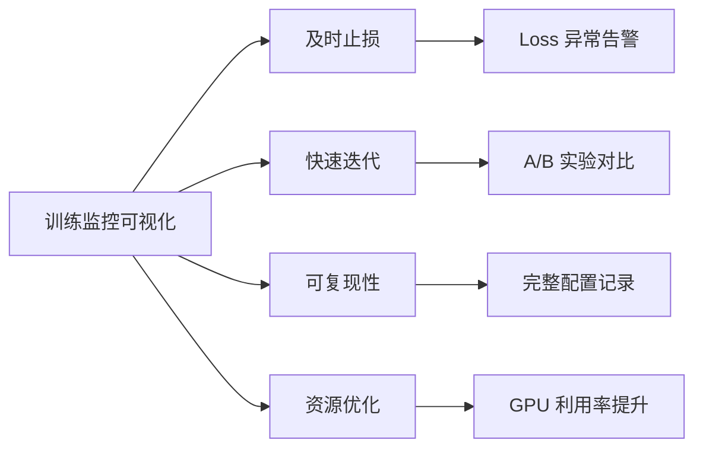
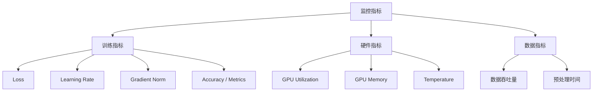
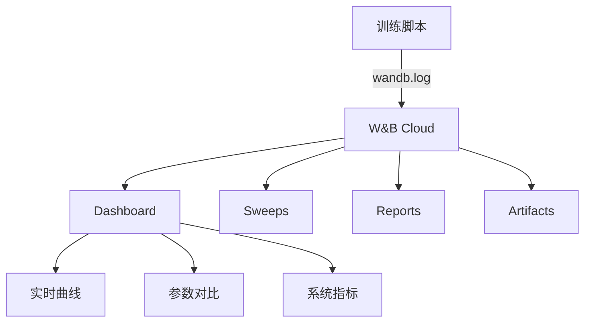
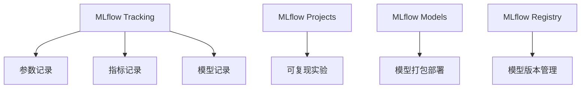
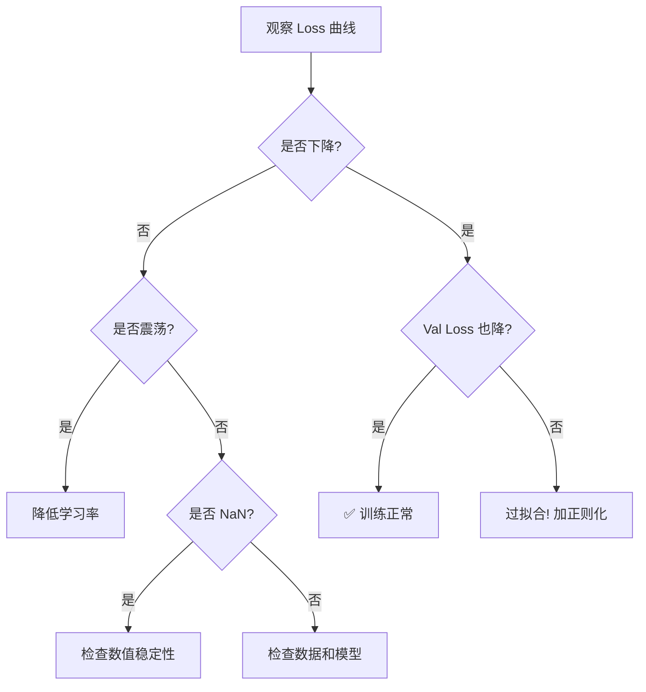
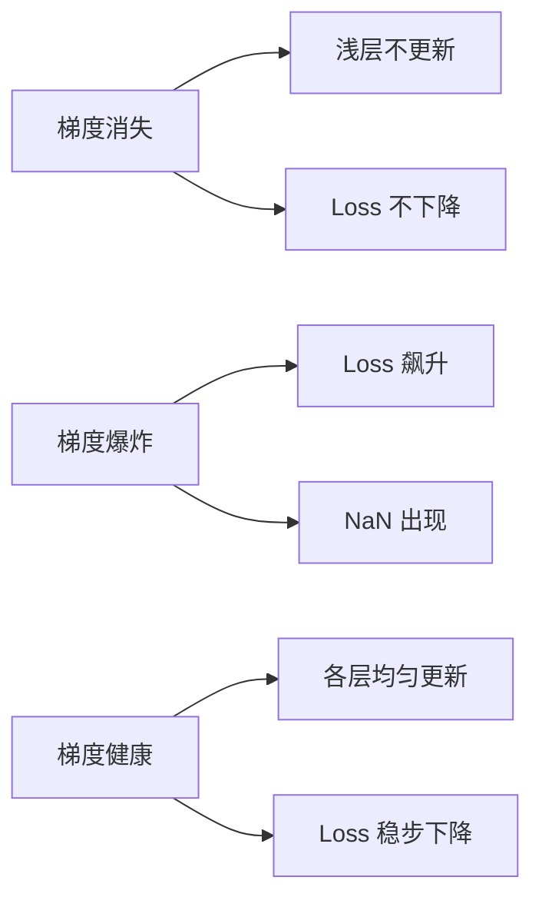

# 训练监控可视化 (Training Monitoring Visualization)

> **一句话理解**: 训练监控可视化是 AI 开发的"黑匣子仪表盘"——实时追踪 Loss、梯度、学习率、GPU 利用率等关键指标，让每一次实验可观测、可诊断、可复现。

---

## 目录

1. [为什么需要训练监控](#1-为什么需要训练监控)
2. [TensorBoard 深度教程](#2-tensorboard-深度教程)
3. [Weights & Biases (W&B)](#3-weights--biases-wb)
4. [MLflow UI](#4-mlflow-ui)
5. [Neptune.ai](#5-neptuneai)
6. [Loss 曲线深度分析](#6-loss-曲线深度分析)
7. [学习率调度可视化](#7-学习率调度可视化)
8. [梯度流可视化](#8-梯度流可视化)
9. [GPU 利用率监控](#9-gpu-利用率监控)
10. [分布式训练可视化](#10-分布式训练可视化)
11. [实时训练仪表盘搭建](#11-实时训练仪表盘搭建)
12. [常见问题 (FAQ)](#12-常见问题-faq)

---

## 1. 为什么需要训练监控

### 1.1 训练失败的代价

| 场景 | 损失估算 | 常见原因 |
|------|----------|----------|
| Loss 爆炸（训练 3 天后）| $50K+ GPU 小时 | 学习率过高、梯度累积错误 |
| NaN 静默传播 | $20K+ GPU 小时 | 混合精度溢出、数据异常 |
| 检查点损坏 | $10K+ GPU 小时 | 存储故障、异步写入失败 |
| 数据管道阻塞 | 30-50% 时间浪费 | CPU 瓶颈、预处理过重 |
| 超参配置丢失 | 无法复现结果 | 未记录随机种子、环境版本 |

### 1.2 监控的核心价值



### 1.3 监控指标体系总览



| 指标 | 正常范围 | 异常信号 | 监控频率 |
|------|----------|----------|----------|
| `train/loss` | 稳定下降 | 上升/NaN/震荡 | 每 step |
| `val/loss` | 略低于 train | 持续上升（过拟合）| 每 epoch |
| `train/lr` | 按 schedule | 突然跳变 | 每 step |
| `train/grad_norm` | 1-100 | >1000 或 <0.001 | 每 step |
| `train/throughput` | 硬件上限 70%+ | 骤降 20%+ | 每 10s |

---

## 2. TensorBoard 深度教程

### 2.1 TensorBoard 架构

```
┌──────────────┐     ┌──────────────┐     ┌──────────────┐
│  训练脚本     │────▶│  事件文件     │────▶│  TensorBoard │
│  (Python)    │     │  (logs/)     │     │  Web UI      │
│              │     │              │     │              │
│ writer.add_* │     │ events.out.* │     │ localhost:6006│
└──────────────┘     └──────────────┘     └──────────────┘

写入器                磁盘存储              浏览器可视化
```

### 2.2 基础用法：标量记录

```python
from torch.utils.tensorboard import SummaryWriter
import torch

writer = SummaryWriter(log_dir="runs/experiment_001")

for epoch in range(100):
    train_loss = train_one_epoch(model, train_loader, optimizer)
    val_loss, val_acc = evaluate(model, val_loader)
    
    writer.add_scalar("Loss/train", train_loss, epoch)
    writer.add_scalar("Loss/val", val_loss, epoch)
    writer.add_scalar("Accuracy/val", val_acc, epoch)
    
    for name, param in model.named_parameters():
        writer.add_histogram(f"Parameters/{name}", param, epoch)
        if param.grad is not None:
            writer.add_histogram(f"Gradients/{name}", param.grad, epoch)

writer.close()
```

### 2.3 高级用法：多实验对比

```python
from torch.utils.tensorboard import SummaryWriter

experiments = {
    "lr_1e-3": {"lr": 1e-3},
    "lr_5e-4": {"lr": 5e-4},
    "lr_1e-4": {"lr": 1e-4},
}

writers = {}
for name in experiments:
    writers[name] = SummaryWriter(log_dir=f"runs/{name}")

for epoch in range(100):
    for name, config in experiments.items():
        loss = train_with_config(config)
        writers[name].add_scalar("Loss/train", loss, epoch)

for w in writers.values():
    w.close()
```

```bash
tensorboard --logdir=runs --port=6006
# 所有实验在同一界面对比
```

### 2.4 自定义图表和 Embedding

```python
writer = SummaryWriter()

writer.add_custom_scalars_multilinechart(
    tags=["Loss/train", "Loss/val"],
    category="Loss Comparison"
)

features = torch.randn(100, 128)
labels = [f"sample_{i}" for i in range(100)]
writer.add_embedding(
    features,
    metadata=labels,
    tag="feature_space"
)

images = torch.randn(16, 3, 64, 64)
writer.add_images("training_samples", images, 0)

writer.add_text(
    "hyperparameters",
    f"lr={0.001}, batch_size=32, epochs=100"
)
```

### 2.5 TensorBoard 的局限性

| 局限 | 影响 | 替代方案 |
|------|------|---------|
| 本地文件存储 | 团队难共享 | W&B / Neptune |
| 无实验管理 | 配置难追踪 | MLflow / W&B |
| 无告警系统 | 异常难发现 | Grafana |
| 对比功能弱 | 多实验对比不便 | W&B Sweeps |

---

## 3. Weights & Biases (W&B)

### 3.1 W&B 核心架构



### 3.2 W&B 集成代码

```python
import wandb
import torch

wandb.init(
    project="my-llm-project",
    name="gpt2-finetune-run1",
    config={
        "learning_rate": 5e-5,
        "architecture": "GPT-2",
        "dataset": "custom-corpus",
        "epochs": 10,
        "batch_size": 32,
        "weight_decay": 0.01,
        "warmup_steps": 500,
    }
)

config = wandb.config

model = create_model(config)
optimizer = torch.optim.AdamW(
    model.parameters(),
    lr=config.learning_rate,
    weight_decay=config.weight_decay
)

for epoch in range(config.epochs):
    total_loss = 0
    for step, batch in enumerate(train_loader):
        loss = model(**batch).loss
        loss.backward()
        optimizer.step()
        optimizer.zero_grad()
        total_loss += loss.item()

        if step % 100 == 0:
            wandb.log({
                "train/loss": loss.item(),
                "train/learning_rate": optimizer.param_groups[0]["lr"],
                "train/step": epoch * len(train_loader) + step,
            })

    val_loss, val_metrics = evaluate(model, val_loader)
    wandb.log({
        "val/loss": val_loss,
        "val/accuracy": val_metrics["accuracy"],
        "val/f1": val_metrics["f1"],
        "epoch": epoch,
    })

    if val_loss < best_val_loss:
        best_val_loss = val_loss
        torch.save(model.state_dict(), "best_model.pt")
        wandb.save("best_model.pt")
        wandb.run.summary["best_val_loss"] = val_loss

wandb.finish()
```

### 3.3 W&B Sweeps（超参搜索可视化）

```python
sweep_config = {
    "method": "bayes",
    "metric": {"name": "val/loss", "goal": "minimize"},
    "parameters": {
        "learning_rate": {
            "values": [1e-5, 5e-5, 1e-4, 5e-4]
        },
        "batch_size": {
            "values": [16, 32, 64]
        },
        "weight_decay": {
            "min": 0.0,
            "max": 0.1
        },
        "warmup_steps": {
            "min": 100,
            "max": 1000
        }
    }
}

sweep_id = wandb.sweep(sweep_config, project="my-llm-project")
wandb.agent(sweep_id, function=train_function, count=20)
```

### 3.4 W&B Artifacts（数据和模型版本管理）

```python
artifact = wandb.Artifact("training-data", type="dataset")
artifact.add_file("data/train.csv")
artifact.add_file("data/val.csv")
wandb.log_artifact(artifact)

model_artifact = wandb.Artifact("model-v1", type="model")
model_artifact.add_file("best_model.pt")
wandb.log_artifact(model_artifact)
```

### 3.5 W&B vs TensorBoard 对比

| 特性 | TensorBoard | W&B |
|------|-------------|-----|
| 部署方式 | 本地 | 云端（可本地） |
| 团队协作 | 需手动共享 | 实时共享 |
| 实验管理 | 基础 | 完善（Sweeps/Artifacts） |
| 告警通知 | 无 | Slack/Email |
| 免费额度 | 完全免费 | 个人免费，团队付费 |
| 数据存储 | 本地磁盘 | 云端 |

---

## 4. MLflow UI

### 4.1 MLflow 架构



### 4.2 MLflow 集成代码

```python
import mlflow
import mlflow.pytorch

mlflow.set_experiment("gpt2-finetune")

with mlflow.start_run(run_name="baseline"):
    mlflow.log_params({
        "learning_rate": 5e-5,
        "batch_size": 32,
        "epochs": 10,
        "model": "GPT-2",
    })

    for epoch in range(10):
        train_loss = train_one_epoch()
        val_loss, metrics = evaluate()
        
        mlflow.log_metrics({
            "train_loss": train_loss,
            "val_loss": val_loss,
            "accuracy": metrics["accuracy"],
        }, step=epoch)

    mlflow.pytorch.log_model(model, "model")
    mlflow.log_artifact("config.yaml")

print(f"Run URL: {mlflow.get_artifact_uri()}")
```

```bash
mlflow ui --port 5000
# 浏览器打开 http://localhost:5000
```

---

## 5. Neptune.ai

### 5.1 Neptune 集成代码

```python
import neptune

run = neptune.init_run(
    project="workspace/my-project",
    tags=["finetune", "gpt2"],
)

run["config/lr"] = 5e-5
run["config/batch_size"] = 32
run["config/model"].upload("config.yaml")

for epoch in range(10):
    train_loss = train_one_epoch()
    run["train/loss"].append(train_loss)
    run["train/epoch"].append(epoch)

run.stop()
```

### 5.2 工具选型对比

| 特性 | TensorBoard | W&B | MLflow | Neptune |
|------|-------------|-----|--------|---------|
| 上手难度 | ⭐ | ⭐⭐ | ⭐⭐ | ⭐⭐ |
| 团队协作 | 弱 | 强 | 中 | 强 |
| 实验对比 | 基础 | 强 | 强 | 强 |
| 模型管理 | 无 | 强 | 强 | 中 |
| 告警通知 | 无 | 有 | 无 | 有 |
| 离线模式 | 原生 | 支持 | 原生 | 支持 |
| 定价 | 免费 | 免费/付费 | 免费 | 免费/付费 |

---

## 6. Loss 曲线深度分析

### 6.1 正常 Loss 曲线模式

```
理想的学习曲线:

Loss │╲
     │ ╲
     │  ╲
     │   ╲___
     │       ╲___
     │           ╲_____
     │                  ╲________
     │___________________________ Step
     → 指数衰减，模型在稳步学习
```

### 6.2 异常模式诊断

#### 模式 1: Loss 震荡

```
Loss │╲  ╱╲  ╱╲  ╱
     │ ╲╱  ╲╱  ╲╱
     │
     │_______________________ Step

诊断: 学习率过大
处方:
  1. 降低学习率 (1/10)
  2. 增大 batch size
  3. 使用学习率 warmup
  4. 启用梯度裁剪
```

#### 模式 2: Loss 突然飙升

```
Loss │╲
     │ ╲
     │  ╲___
     │      ╲___
     │          ╲
     │           ╲  ← 突然飙升！
     │            ╲╲
     │______________╲╲╲________ Step

诊断: 梯度爆炸 / 数据异常
处方:
  1. 梯度裁剪: torch.nn.utils.clip_grad_norm_(model.parameters(), 1.0)
  2. 检查数据是否有 NaN / Inf
  3. 降低学习率
  4. 检查混合精度设置
```

#### 模式 3: Loss 变 NaN

```
Loss │╲
     │ ╲
     │  ╲___
     │      ╲
     │       ╲
     │        NaN ← 完全崩了！
     │        NaN NaN NaN NaN
     │________________________ Step

诊断: 数值溢出
处方:
  1. 降低学习率到 1/100
  2. 检查损失函数是否有 log(0)
  3. 使用 fp32 而非 fp16
  4. 检查数据归一化
```

#### 模式 4: 过拟合

```
Loss │╲
     │ ╲  Train ──
     │  ╲___
     │      ╲_______
     │             ╲________  ← Train Loss 持续降
     │
     │  Val ──
     │   ╲___
     │       ╲___╱╲  ← Val Loss 开始上升！
     │            ╲╱
     │________________________ Step

诊断: 过拟合
处方:
  1. Early Stopping
  2. 增加正则化 (Dropout, Weight Decay)
  3. 数据增强
  4. 减小模型容量
```

#### 模式 5: 训练平台期

```
Loss │╲
     │ ╲
     │  ╲___
     │      ╲___________ ← 卡住了！
     │                  ╲___________
     │______________________________ Step

诊断: 学习率过小 / 陷入局部最优
处方:
  1. 增大学习率
  2. 使用 Cosine Annealing
  3. 增加 warmup
  4. 检查是否需要更大数据量
```

### 6.3 Loss 曲线诊断流程图



---

## 7. 学习率调度可视化

### 7.1 常见调度策略

```
Constant:
LR │──────────────────────────
   │___________________________ Step

Linear Warmup + Decay:
LR │    ╱╲
   │   ╱  ╲
   │  ╱    ╲
   │ ╱      ╲_______________
   │___________________________ Step
   ↑ warmup   ↑ 衰减

Cosine Annealing:
LR │    ╱╲
   │   ╱  ╲
   │  ╱    ╲
   │ ╱      ╲      ╱╲
   │         ╲    ╱  ╲
   │          ╲__╱    ╲___
   │___________________________ Step

Cosine with Restarts:
LR │╱╲    ╱╲    ╱╲
   │  ╲  ╱  ╲  ╱  ╲
   │   ╲╱    ╲╱    ╲
   │___________________________ Step
```

### 7.2 学习率调度代码与可视化

```python
import torch
import matplotlib.pyplot as plt
from torch.optim.lr_scheduler import (
    CosineAnnealingLR,
    CosineAnnealingWarmRestarts,
    OneCycleLR,
    get_linear_schedule_with_warmup,
)

model = torch.nn.Linear(10, 1)
optimizer = torch.optim.AdamW(model.parameters(), lr=1e-3)
total_steps = 10000
warmup_steps = 500

schedulers = {
    "CosineAnnealing": CosineAnnealingLR(optimizer, T_max=total_steps),
    "OneCycle": OneCycleLR(optimizer, max_lr=1e-3, total_steps=total_steps),
}

for name, scheduler in schedulers.items():
    lrs = []
    for step in range(total_steps):
        lrs.append(optimizer.param_groups[0]["lr"])
        optimizer.step()
        scheduler.step()
    plt.plot(lrs, label=name)

plt.xlabel("Step")
plt.ylabel("Learning Rate")
plt.legend()
plt.savefig("lr_schedules.png")
```

### 7.3 学习率 Finder

```python
import torch
from torch_lr_finder import LRFinder

model = create_model()
optimizer = torch.optim.AdamW(model.parameters(), lr=1e-7)
criterion = torch.nn.CrossEntropyLoss()

lr_finder = LRFinder(model, optimizer, criterion, device="cuda")
lr_finder.range_test(train_loader, end_lr=10, num_iter=100)
lr_finder.plot()
lr_finder.reset()

best_lr = lr_finder.suggest_lr()
print(f"Suggested learning rate: {best_lr}")
```

---

## 8. 梯度流可视化

### 8.1 为什么关注梯度



### 8.2 梯度统计监控

```python
import torch
import numpy as np

def log_gradient_stats(model, writer, step):
    for name, param in model.named_parameters():
        if param.grad is not None:
            grad = param.grad.data
            writer.add_scalar(f"GradNorm/{name}", grad.norm().item(), step)
            writer.add_scalar(f"GradMean/{name}", grad.mean().item(), step)
            writer.add_scalar(f"GradStd/{name}", grad.std().item(), step)
            writer.add_histogram(f"GradDist/{name}", grad, step)

def check_gradient_health(model):
    total_norm = 0
    layer_norms = {}
    
    for name, param in model.named_parameters():
        if param.grad is not None:
            norm = param.grad.data.norm(2).item()
            total_norm += norm ** 2
            layer_norms[name] = norm
    
    total_norm = total_norm ** 0.5
    
    print(f"Total gradient norm: {total_norm:.4f}")
    for name, norm in sorted(layer_norms.items(), key=lambda x: x[1]):
        bar = "█" * int(norm * 10)
        print(f"  {name:40s} {norm:8.4f} {bar}")
    
    if total_norm > 1000:
        print("⚠️  梯度爆炸！")
    elif total_norm < 0.001:
        print("⚠️  梯度消失！")
    else:
        print("✅ 梯度正常")
```

### 8.3 梯度流热力图

```python
import matplotlib.pyplot as plt
import seaborn as sns

def plot_gradient_flow(model, step):
    layers = []
    grads = []
    
    for name, param in model.named_parameters():
        if param.grad is not None and "weight" in name:
            layers.append(name)
            grads.append(param.grad.cpu().norm().item())
    
    fig, ax = plt.subplots(figsize=(12, 4))
    sns.heatmap(
        [grads],
        xticklabels=layers,
        cmap="YlOrRd",
        ax=ax,
        annot=True,
        fmt=".3f"
    )
    ax.set_title(f"Gradient Flow at Step {step}")
    ax.set_ylabel("Gradient Norm")
    plt.tight_layout()
    plt.savefig(f"gradient_flow_step_{step}.png")
    plt.close()
```

```
梯度流热力图示意:

Layer 0  Layer 1  Layer 2  Layer 3  Layer 4  Layer 5
██████   █████   ████    ███     ██      █       ← 梯度逐渐消失!

诊断: 深层网络梯度消失
处方: 使用残差连接(ResNet)、LayerNorm、梯度裁剪
```

---

## 9. GPU 利用率监控

### 9.1 GPU 监控指标

```python
import pynvml
import time

pynvml.nvmlInit()

def monitor_gpu(interval=5):
    handle = pynvml.nvmlDeviceGetHandleByIndex(0)
    
    while True:
        util = pynvml.nvmlDeviceGetUtilizationRates(handle)
        mem = pynvml.nvmlDeviceGetMemoryInfo(handle)
        temp = pynvml.nvmlDeviceGetTemperature(handle, pynvml.NVML_TEMPERATURE_GPU)
        power = pynvml.nvmlDeviceGetPowerUsage(handle) / 1000.0
        
        print(f"GPU: {util.gpu}% | Mem: {mem.used/1e9:.1f}/{mem.total/1e9:.1f}GB "
              f"({mem.used/mem.total*100:.0f}%) | Temp: {temp}°C | Power: {power:.0f}W")
        
        time.sleep(interval)

monitor_gpu()
```

### 9.2 GPU 利用率可视化

```
训练过程 GPU 利用率时间线:

GPU%│
100%│   ██                ██
 90%│ ████    ██      ████████
 80%│ ████████████   ████████████
 70%│ ██████████████ ████████████
 60%│ ██████████████████████████
 50%│ ██████████████████████████
    │____________________________ Time
    0s    1h    2h    3h    4h

    ↑ 数据加载瓶颈     ↑ 正常训练

诊断: 0-1h GPU 利用率低 → 数据加载是瓶颈
处方: 增加 DataLoader workers、使用 pinned memory
```

### 9.3 常见 GPU 瓶颈与优化

| GPU 利用率 | 可能原因 | 优化方案 |
|-----------|---------|---------|
| < 50% | 数据加载慢 | 增加 num_workers、prefetch |
| 50-70% | CPU 预处理瓶颈 | 简化预处理、缓存 |
| 70-85% | 基本正常 | 小幅优化 |
| > 85% | ✅ 充分利用 | 保持现状 |
| > 95% 内存 | OOM 风险 | 梯度检查点、减小 batch |
| 温度 > 85°C | 散热不足 | 清灰、降频、改善通风 |

---

## 10. 分布式训练可视化

### 10.1 多 GPU 训练监控

```python
import torch.distributed as dist
import wandb

def log_distributed_metrics(loss, grad_norm, step, local_rank):
    metrics = {
        f"gpu{local_rank}/loss": loss,
        f"gpu{local_rank}/grad_norm": grad_norm,
    }
    
    all_losses = [torch.zeros(1) for _ in range(dist.get_world_size())]
    dist.all_gather(all_losses, torch.tensor([loss]))
    
    avg_loss = sum(l.item() for l in all_losses) / len(all_losses)
    max_loss = max(l.item() for l in all_losses)
    min_loss = min(l.item() for l in all_losses)
    
    metrics["distributed/avg_loss"] = avg_loss
    metrics["distributed/max_loss_diff"] = max_loss - min_loss
    
    if local_rank == 0:
        wandb.log(metrics, step=step)
```

### 10.2 分布式训练指标同步可视化

```
4 GPU 训练 Loss 对比:

Loss │ GPU0 ──── GPU1 ──── GPU2 ──── GPU3 ────
     │ ╲         ╲         ╲         ╲
     │  ╲___      ╲___      ╲___      ╲___
     │      ╲___      ╲___      ╲___      ╲___
     │__________╲__________╲__________╲________ Step

→ 各 GPU Loss 应该接近，差距大说明同步有问题
```

### 10.3 通信开销可视化

```python
import torch.cuda.nvtx as nvtx

def profile_communication():
    for step, batch in enumerate(train_loader):
        nvtx.range_push("forward")
        loss = model(batch)
        nvtx.range_pop()
        
        nvtx.range_push("allreduce")
        dist.all_reduce(grad)
        nvtx.range_pop()
        
        nvtx.range_push("backward")
        loss.backward()
        nvtx.range_pop()
```

---

## 11. 实时训练仪表盘搭建

### 11.1 Streamlit 实时训练看板

```python
import streamlit as st
import pandas as pd
import plotly.graph_objects as go
from plotly.subplots import make_subplots
import json
import time
import os

st.set_page_config(page_title="训练监控仪表盘", layout="wide")

st.title("📊 AI 训练监控仪表盘")

col1, col2, col3, col4 = st.columns(4)
with col1:
    st.metric("当前 Loss", "0.234", "↓ 0.012")
with col2:
    st.metric("验证准确率", "92.3%", "↑ 1.2%")
with col3:
    st.metric("GPU 利用率", "87%", "正常")
with col4:
    st.metric("预计剩余", "3h 24m", "ETA")

loss_data = pd.read_csv("logs/loss_history.csv")

fig = make_subplots(
    rows=2, cols=2,
    subplot_titles=("训练/验证 Loss", "学习率", "梯度范数", "GPU 利用率")
)

fig.add_trace(go.Scatter(y=loss_data["train_loss"], name="Train Loss"), row=1, col=1)
fig.add_trace(go.Scatter(y=loss_data["val_loss"], name="Val Loss"), row=1, col=1)
fig.add_trace(go.Scatter(y=loss_data["lr"], name="LR"), row=1, col=2)
fig.add_trace(go.Scatter(y=loss_data["grad_norm"], name="Grad Norm"), row=2, col=1)
fig.add_trace(go.Scatter(y=loss_data["gpu_util"], name="GPU %"), row=2, col=2)

fig.update_layout(height=800)
st.plotly_chart(fig, use_container_width=True)

st.subheader("📋 实验配置")
config = json.load(open("config.json"))
st.json(config)

st.auto_rerun(interval=30)
```

```bash
streamlit run dashboard.py --server.port 8501
```

### 11.2 完整训练监控框架

```python
import wandb
import torch
from torch.utils.tensorboard import SummaryWriter
from datetime import datetime

class TrainingMonitor:
    def __init__(self, config, use_wandb=True, use_tensorboard=True):
        self.config = config
        
        if use_wandb:
            wandb.init(
                project=config["project"],
                name=config["run_name"],
                config=config,
            )
        
        if use_tensorboard:
            self.writer = SummaryWriter(
                log_dir=f"runs/{config['run_name']}_{datetime.now():%Y%m%d_%H%M%S}"
            )
        
        self.use_wandb = use_wandb
        self.use_tensorboard = use_tensorboard
        self.best_val_loss = float("inf")
    
    def log(self, metrics, step):
        if self.use_wandb:
            wandb.log(metrics, step=step)
        
        if self.use_tensorboard:
            for key, value in metrics.items():
                self.writer.add_scalar(key, value, step)
    
    def log_gradients(self, model, step):
        for name, param in model.named_parameters():
            if param.grad is not None:
                self.log({
                    f"grad_norm/{name}": param.grad.norm().item(),
                }, step)
    
    def log_gpu_stats(self, step):
        import pynvml
        pynvml.nvmlInit()
        handle = pynvml.nvmlDeviceGetHandleByIndex(0)
        util = pynvml.nvmlDeviceGetUtilizationRates(handle)
        mem = pynvml.nvmlDeviceGetMemoryInfo(handle)
        
        self.log({
            "system/gpu_util": util.gpu,
            "system/gpu_mem_pct": mem.used / mem.total * 100,
        }, step)
    
    def check_early_stop(self, val_loss, patience=5):
        if val_loss < self.best_val_loss:
            self.best_val_loss = val_loss
            return False
        
        self.patience_counter = getattr(self, "patience_counter", 0) + 1
        if self.patience_counter >= patience:
            print(f"Early stopping at val_loss={val_loss:.4f}")
            return True
        return False
    
    def finish(self):
        if self.use_wandb:
            wandb.finish()
        if self.use_tensorboard:
            self.writer.close()
```

---

## 12. 常见问题 (FAQ)

### Q1: TensorBoard 和 W&B 该选哪个？

**A**: 个人/学术选 TensorBoard，团队/工业选 W&B。

```
TensorBoard 适合:
- 个人项目、学术研究
- 不想注册账号
- 简单场景够用

W&B 适合:
- 团队协作
- 超参搜索(Sweeps)
- 模型版本管理(Artifacts)
- 需要报告分享
```

### Q2: 训练多久检查一次 Loss？

**A**: 建议频率：

| 指标 | 频率 | 理由 |
|------|------|------|
| Train Loss | 每 100 step | 检查训练是否正常 |
| Val Loss | 每 1 epoch | 检查过拟合 |
| 梯度 | 每 500 step | 检查梯度健康 |
| GPU | 每 10 秒 | 检查硬件瓶颈 |
| 学习率 | 每 100 step | 确认 schedule 正确 |

### Q3: Loss 不下降怎么办？排查清单

```
1. 检查数据: 有没有 NaN？标签对不对？归一化了吗？
2. 检查学习率: 太大(震荡)还是太小(不动)?
3. 检查梯度: 梯度消失还是爆炸?
4. 检查模型: 是不是太简单了？
5. 检查 Loss 函数: 用对了没有?
```

---

## 相关阅读

- [模型可解释性可视化](./Model_Interpretability_Visualization.md) - 深入理解模型内部
- [AI 系统仪表盘](./AI_System_Dashboard.md) - 生产环境监控
- [可视化入门](./Visualization_for_dummy.md) - 可视化基础概念
- [模型训练 - 小白版](../07_Model_Training/Model_Training_for_dummy.md) - 训练基础
- [模型评估 - 小白版](../08_Model_Evaluation/Model_Evaluation_for_dummy.md) - 评估指标
- [Training Monitoring 2026](../07_Model_Training/Training_Monitoring_2026.md) - 训练监控进阶

---

*Last updated: 2026-05-17*

## Related

- [[94_Visualization/README.md|94_Visualization README]]
- [[94_Visualization/atlas/README.md|atlas README]]
- [[94_Visualization/atlas/docs/performance.md|performance]]
- [[07_Model_Training/Distributed_Training_2026.md|Distributed_Training_2026]]
- [[07_Model_Training/Distributed_Training_for_dummy.md|Distributed_Training_for_dummy]]
