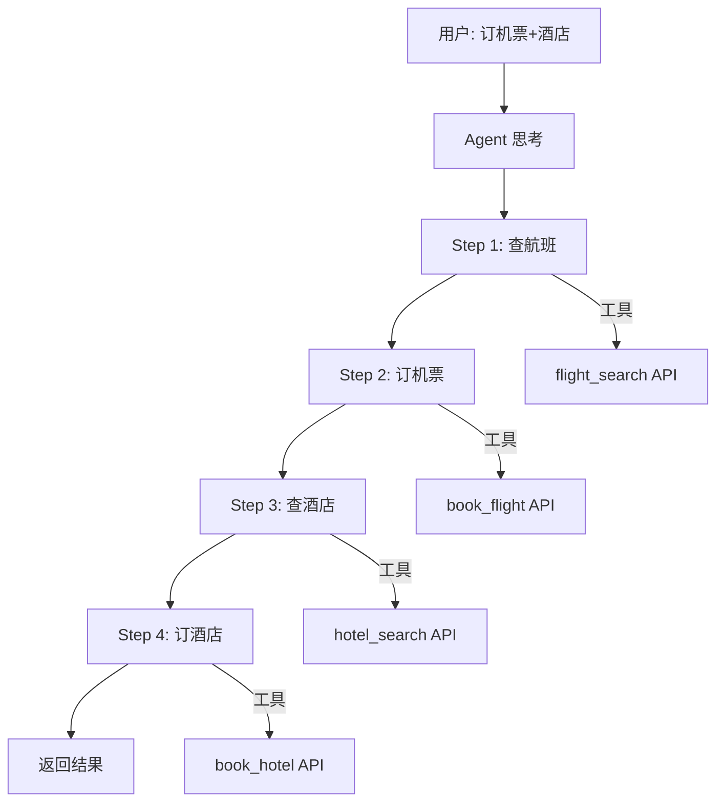

# AI 可视化 - 小白版

> **一句话秒懂**: 可视化就是给 AI 装"透视眼"——让你看见模型在想什么、学得怎样、哪里出了问题，就像给汽车装仪表盘，不用掀开引擎盖也能知道一切！

## 你将学到什么

- **你能够**理解为什么 AI 需要可视化（不可视化就像蒙眼开车）
- **你能够**知道 LLM 可视化有哪些方式（注意力热力图、Token 流、思维链）
- **你能够**掌握训练监控仪表盘（Loss 曲线、指标追踪）
- **你能够**了解模型结构可视化（Netron、torchviz）
- **你能够**明白 RAG 检索和 Agent 执行的可视化方法
- **你能够**动手搭建自己的 AI 可视化看板

## 为什么这个很重要?

### 真实故事:蒙眼调参的惨痛教训

**场景**:小王的第一次模型训练

```
蒙眼模式(没有可视化):
┌─────────────────────────────────────────┐
│ 小王:"模型训练了 3 天了,不知道好不好"     │
│ 同事:"Loss 降到多少了?"                  │
│ 小王:"不知道,我没看..."                  │
│ 同事:"过拟合了吗?"                       │
│ 小王:"不知道..."                        │
│ 同事:"学习率合适吗?"                     │
│ 小王:"不知道..."                        │
│                                         │
│ (训练完发现:严重过拟合,3 天 GPU 白烧了)  │
│ 损失: $2,000                            │
└─────────────────────────────────────────┘
```

```
开眼模式(有可视化):
┌─────────────────────────────────────────┐
│ 小王:"训练了 2 小时"                     │
│ 仪表盘显示:                              │
│   ✅ Loss 稳定下降                       │
│   ⚠️ Val Loss 开始上升 → 过拟合信号!    │
│   ✅ GPU 利用率 85%                      │
│                                         │
│ 小王:"提前停止训练,调整参数"              │
│ 结果:省了 2.5 天 GPU 时间                │
│ 节省: $1,800                            │
└─────────────────────────────────────────┘
```

**教训**: 没有可视化就是蒙眼操作，有了可视化才能心中有数！

## 核心概念

### 1. LLM 可视化：读懂 AI 的"大脑"

**生活中的例子**:
想象你有一个会多国语言的翻译官。你想知道他翻译时：
- 眼睛盯着哪个词最久？（注意力）
- 脑子里按什么顺序翻译？（Token 流）
- 怎么一步步推理的？（思维链）

LLM 可视化就是给这个翻译官装上"脑电波监测器"。

#### 注意力热力图(Attention Heatmap)

**生活类比**: 学生读文章时用荧光笔标记重点词。

```
句子: "小明 喜欢在 公园 里 踢 足球"

注意力热力图(颜色越深 = 注意力越强):

         小明  喜欢  在  公园  里  踢  足球
小明     ████  ░░░  ░░  ░░░  ░░  ░░  ░░░
喜欢     ░░░░  ████ ░░  ░░░  ░░  ██  ████
在       ░░░░  ░░░  ██  ████ ██  ░░  ░░░
公园     ░░░░  ░░░  ██  ████ ██  ░░  ░░░
里       ░░░░  ░░░  ██  ████ ██  ░░  ░░░
踢       ░░░░  ██   ░░  ░░░  ░░  ██  ████
足球     ░░░░  ████ ░░  ░░░  ░░  ██  ████

解读:
- "喜欢"重点关注 "踢"和"足球"(语义关联)
- "公园"和"里"互相关注(位置关系)
- "踢"连接 "喜欢"和"足球"(动宾关系)
```

**简单来说**: 注意力热力图就像学生的荧光笔标记，颜色越深说明 AI 越关注那个词之间的关系。

**记住这个**: 注意力 = AI 分配给每个词的"关注度"，可视化出来就是热力图！

---

#### Token 流可视化(Token Flow)

**生活类比**: 工厂流水线，每个零件（Token）经过一道道工序（Transformer 层）。

```
输入: "今天 天气 真 好"

Token 流经 Transformer 层:

Layer 0:  [今天] [天气] [真] [好]   ← 初始嵌入
   ↓        ↓      ↓     ↓    ↓
Layer 1:  [今·天] [天·气] [真·的] [好·的]  ← 开始关联
   ↓        ↓      ↓     ↓    ↓
Layer 2:  [今天天气] [天气真好] [天气真好] [天气真好]  ← 语义融合
   ↓        ↓      ↓     ↓    ↓
Layer 3:  [今天天气真好!] ← 完整理解

每一层都让 Token 之间产生更多关联
→ 层数越深，理解越深入
```

**简单来说**: Token 流就像文字在流水线上被一层层加工，每经过一层理解就更深一层。

**记住这个**: Token 是 AI 处理文字的最小单位，Token 流展示文字如何在模型中一步步被理解。

---

#### 思维链可视化(Chain-of-Thought)

**生活类比**: 老师让学生"写出解题过程"而不是只写答案。

```
问题: "如果一个苹果 3 元，买 5 个苹果和 2 个香蕉（每个 2 元），总共多少钱？"

AI 的思维链(可视化):
┌──────────────────────────────────────┐
│ Step 1: 苹果花费 = 3 × 5 = 15 元     │
│ Step 2: 香蕉花费 = 2 × 2 = 4 元      │
│ Step 3: 总计 = 15 + 4 = 19 元         │
│                                      │
│ 答案: 19 元                           │
└──────────────────────────────────────┘

每一步的置信度:
Step 1: ████████████████ 99% (非常确定)
Step 2: ███████████████░ 95% (很确定)
Step 3: ████████████████ 99% (非常确定)
→ 整体推理可靠!
```

```
对比 - 没有思维链:
┌──────────────────────────────────────┐
│ 答案: 19 元(?)                        │
│                                      │
│ 怎么算出来的？完全不知道...            │
└──────────────────────────────────────┘
→ 黑盒，无法验证
```

**简单来说**: 思维链可视化让 AI 把"草稿纸"展示给你看，每步怎么推理的一目了然。

**记住这个**: Chain-of-Thought = AI 的"解题过程"，可视化它就能验证 AI 是不是在"胡说八道"！

---

### 2. 训练监控仪表盘：AI 的"体检报告"

**生活中的例子**:
就像体检报告有一系列指标（血压、心率、血糖），训练监控仪表盘展示模型的各项"健康指标"。

#### Loss 曲线——最重要的"心电图"

```
健康的学习曲线:
Loss
  │\
  │ \
  │  \____
  │       \____
  │            \_____
  │                  \___________
  │_______________________________ Epoch
  → 稳步下降，模型在进步！

过拟合的曲线:
Loss
  │\
  │ \  Train ───────
  │  \____          
  │       \_______  _______ Val ───
  │               \/           
  │                /\  ← Val Loss 开始上升!
  │               /  \
  │______________/____\__________ Epoch
  → 训练集好，验证集差 = 死记硬背！

欠拟合的曲线:
Loss
  │\
  │ \
  │  \___
  │      \___    ← Loss 还很高就平了
  │          \___
  │              \___
  │________________\_______________ Epoch
  → 学不动了，模型太简单或学习率太低！
```

**Loss 曲线常见问题速查表**:

| 曲线形状 | 诊断 | 处方 |
|---------|------|------|
| 稳步下降 | ✅ 正常学习 | 继续训练 |
| 震荡剧烈 | ⚠️ 学习率太大 | 降低学习率 |
| 突然飙升 | ❌ 梯度爆炸 | 降低学习率、梯度裁剪 |
| 变 NaN | 💥 数值溢出 | 降低学习率、检查数据 |
| 训练好验证差 | 😵 过拟合 | 加正则化、早停 |
| 都很高不动 | 😴 欠拟合 | 加大模型、调学习率 |

**简单来说**: Loss 曲线就像心电图，看形状就知道模型是在"健康成长"还是"生病了"。

**记住这个**: 每次训练都要看 Loss 曲线！Train 和 Val 两条线一起看，差距大 = 过拟合。

---

#### 指标追踪看板

```
┌─────────────────────────────────────────────────────┐
│              📊 训练监控仪表盘                        │
├─────────────┬─────────────┬─────────────┬───────────┤
│ 训练 Loss    │ 验证 Loss    │ 准确率       │ 学习率     │
│   0.234     │   0.287     │   92.3%     │  0.0001  │
│  ↓ 下降中    │  ↓ 下降中    │  ↑ 上升中    │  📐 衰减  │
├─────────────┼─────────────┼─────────────┼───────────┤
│ GPU 利用率    │ 内存使用     │ 训练速度     │ 剩余时间   │
│   87%       │   42GB/80GB  │  1200 tok/s │  ~3h     │
│  ✅ 正常     │  ✅ 充裕     │  ✅ 正常     │  ⏳ 估算  │
└─────────────┴─────────────┴─────────────┴───────────┘
```

**简单来说**: 指标追踪看板就是模型的"驾驶仪表盘"，所有关键指标一目了然。

**记住这个**: 好的仪表盘应该包含：Loss、准确率、学习率、GPU 使用率——缺一不可！

---

### 3. 模型结构可视化：AI 的"建筑蓝图"

**生活中的例子**:
就像看房屋平面图，你可以看到每个房间（层）的大小、连接方式和布局。

#### Netron —— 最流行的模型结构查看器

```
用 Netron 打开一个模型文件(.onnx / .pt / .h5):

┌──────────────────────────────────────┐
│  Netron - 模型结构查看器              │
│                                      │
│  输入层                               │
│  ┌────────┐                          │
│  │ Input  │ (batch, 3, 224, 224)     │
│  └───┬────┘                          │
│      ↓                               │
│  ┌────────┐                          │
│  │ Conv2D │ 64 filters, 3×3         │
│  └───┬────┘                          │
│      ↓                               │
│  ┌────────┐                          │
│  │ ReLU   │ 激活函数                  │
│  └───┬────┘                          │
│      ↓                               │
│  ┌────────┐                          │
│  │MaxPool │ 2×2 下采样               │
│  └───┬────┘                          │
│      ↓                               │
│     ...                              │
│      ↓                               │
│  ┌────────┐                          │
│  │ Linear │ 1000 classes             │
│  └───┬────┘                          │
│      ↓                               │
│  ┌────────┐                          │
│  │ Output │ (batch, 1000)            │
│  └────────┘                          │
│                                      │
│  点击任一层 → 查看详细参数            │
│  总参数量: 25,557,032                 │
└──────────────────────────────────────┘
```

**使用方法**:
```
1. 安装: pip install netron
2. 运行: netron my_model.onnx
3. 浏览器自动打开 → 可交互查看模型结构
```

#### torchviz —— PyTorch 计算图可视化

```python
import torch
from torchviz import make_dot

model = MyModel()
x = torch.randn(1, 3, 224, 224)
y = model(x)

make_dot(y, params=dict(model.named_parameters())).render("model_graph")
```

**简单来说**: 模型结构可视化就像看建筑蓝图，每一层做什么、参数多少、怎么连接，一眼看清。

**记住这个**: Netron 适合查看已保存的模型文件，torchviz 适合查看 PyTorch 的计算图！

---

### 4. 数据可视化：AI 的"食材检查"

**生活中的例子**:
做菜之前要检查食材新不新鲜、够不够量。数据可视化就是帮你检查 AI 的"食材"。

```
数据分布检查:

特征分布直方图:
    数量
     │ ██
     │ ██ ██
     │ ██ ██ ██
     │ ██ ██ ██ ██
     │ ██ ██ ██ ██ ██
     │ ██ ██ ██ ██ ██ ██
     └──────────────────── 特征值
     → 分布均匀吗？有没有异常值？

类别分布:
    猫: ████████████ 1200 张
    狗: ██████████ 1000 张
    鸟: ██ 200 张      ← 太少了！数据不平衡！
    鱼: █ 50 张         ← 严重不足！

    → 数据不平衡会导致模型偏向多数类
```

**常用的数据可视化工具**:

| 工具 | 用途 | 难度 |
|------|------|------|
| **Matplotlib** | 通用绑图，万能瑞士军刀 | ⭐⭐ |
| **Seaborn** | 统计图表，颜值高 | ⭐ |
| **Plotly** | 交互式图表 | ⭐⭐ |
| **ydata-profiling** | 一键数据报告 | ⭐ |

**简单来说**: 数据可视化就像食材质检，发现问题数据才能训练出好模型。

**记住这个**: 训练前一定要先看数据！数据不好，模型再好也白搭。

---

### 5. RAG 检索可视化：看 AI 怎么"翻书"

**生活中的例子**:
想象你去图书馆查资料，有人全程录像记录你：
- 搜索了什么关键词
- 拿了哪些书
- 翻到了哪一页
- 最后引用了哪些内容

RAG 检索可视化就是给 AI 的"查资料过程"录像。

```
RAG 检索可视化:

用户提问: "Python 如何读取 CSV 文件?"

Step 1: 问题向量化
  "Python 如何读取 CSV 文件?"
       ↓
  [0.23, 0.67, -0.12, 0.45, ...]

Step 2: 向量检索(可视化相似度)
  ┌─────────────────────────────────────┐
  │  知识库向量空间                       │
  │                                     │
  │        ● pandas_read_csv (98%)      │
  │       ╱                             │
  │      ╱  ● csv_module (92%)          │
  │     ╱   ╱                           │
  │   ★ ──╱    ● openpyxl (45%)         │
  │   ↑      ╱                          │
  │  问题   ╱                           │
  │       ● numpy_load (78%)            │
  │                                     │
  │  距离近 = 相似度高                    │
  └─────────────────────────────────────┘

Step 3: 返回结果(可视化)
  ┌─────────────────────────────────────┐
  │ 📄 文档1: pandas.read_csv() 详解    │
  │    相似度: 98% ████████████████      │
  │    摘要: "使用 pandas 读取 CSV..."   │
  │                                     │
  │ 📄 文档2: Python csv 模块教程       │
  │    相似度: 92% ██████████████░░      │
  │    摘要: "Python 内置 csv 模块..."   │
  │                                     │
  │ 📄 文档3: NumPy 数据加载方法        │
  │    相似度: 78% ████████████░░░░      │
  │    摘要: "numpy.loadtxt() 可以..."   │
  └─────────────────────────────────────┘
```

**简单来说**: RAG 检索可视化让你看到 AI 找了哪些资料、按什么顺序、相关度多少——再也不怕它"乱翻书"。

**记住这个**: 好的 RAG 可视化要展示：检索了哪些文档、相关度分数、最终引用了哪些内容。

---

### 6. Agent 执行流可视化：看 AI 怎么"干活"

**生活中的例子**:
想象你给助手布置一个复杂任务："帮我订机票和酒店"。可视化就是展示助手的工作清单：

```
Agent 执行流可视化:

任务: "帮我订一张明天去北京的机票和酒店"

┌──────────────────────────────────────────────┐
│ 🤖 Agent 执行流程                              │
│                                              │
│ [思考] 用户需要: ① 查航班 ② 订机票 ③ 查酒店 ④ 订酒店 │
│                                              │
│ Step 1: 查询航班                               │
│ 🔧 工具: flight_search(出发=上海, 目的=北京, 日期=明天) │
│ 📋 结果: 找到 3 个航班                         │
│   - CA1234 08:00 → 10:30 ¥1200              │
│   - MU5678 14:00 → 16:30 ¥980 ✅ (推荐)      │
│   - CZ9012 20:00 → 22:30 ¥850               │
│                                              │
│ Step 2: 预订机票                               │
│ 🔧 工具: book_flight(航班=MU5678)              │
│ 📋 结果: ✅ 订票成功，票号 TK20260517          │
│                                              │
│ Step 3: 查询酒店                               │
│ 🔧 工具: hotel_search(城市=北京, 日期=明天)     │
│ 📋 结果: 找到 5 家酒店                         │
│   - 如家 ¥299 ✅                              │
│   - 全季 ¥458                                 │
│   - ...                                      │
│                                              │
│ Step 4: 预订酒店                               │
│ 🔧 工具: book_hotel(酒店=如家)                  │
│ 📋 结果: ✅ 预订成功，确认号 HT88820260517      │
│                                              │
│ [总结] 机票和酒店都已预订完成！                   │
│   机票: MU5678 ¥980                           │
│   酒店: 如家 ¥299                             │
│   总计: ¥1279                                 │
└──────────────────────────────────────────────┘
```

**Mermaid 版本**:



**简单来说**: Agent 执行流可视化就是 AI 的"工作日志"，每一步调用了什么工具、返回了什么结果，全部记录在案。

**记住这个**: Agent 可视化要展示三个关键要素：思考过程、工具调用、执行结果！

---

## 图解理解

### AI 可视化全景图

```
┌─────────────────────────────────────────────────────────┐
│                    AI 可视化全景图                        │
│                                                         │
│  ┌─────────────┐  ┌─────────────┐  ┌─────────────────┐ │
│  │ 📊 训练监控  │  │ 🧠 模型理解  │  │ 📐 模型结构     │ │
│  │             │  │             │  │                 │ │
│  │ Loss 曲线   │  │ 注意力热力图 │  │ Netron          │ │
│  │ 指标追踪    │  │ 显著性图     │  │ torchviz        │ │
│  │ GPU 监控    │  │ SHAP 值     │  │ 计算图          │ │
│  │ 学习率曲线  │  │ Embedding   │  │ 参数统计        │ │
│  └─────────────┘  └─────────────┘  └─────────────────┘ │
│                                                         │
│  ┌─────────────┐  ┌─────────────┐  ┌─────────────────┐ │
│  │ 🔍 RAG 检索 │  │ 🤖 Agent 流  │  │ 💰 系统监控     │ │
│  │             │  │             │  │                 │ │
│  │ 文档相关度  │  │ 执行步骤    │  │ Token 用量      │ │
│  │ 检索路径    │  │ 工具调用    │  │ 成本追踪        │ │
│  │ 引用来源    │  │ 决策过程    │  │ 性能对比        │ │
│  └─────────────┘  └─────────────┘  └─────────────────┘ │
└─────────────────────────────────────────────────────────┘
```

### 可视化工具选型指南

```
你需要什么？ ──────────────────────────────────────

训练 Loss 曲线？     → TensorBoard / W&B
模型黑盒想看懂？     → SHAP / LIME / Grad-CAM
模型结构长什么样？   → Netron
数据分布长什么样？   → Matplotlib / Seaborn
Embedding 想看？     → t-SNE / UMAP
RAG 检索效果？       → LangSmith / Phoenix
Agent 流程？         → LangGraph Studio / CrewAI
想搭自己的看板？     → Streamlit / Gradio
```

## 常见问题

### Q1: 我该用哪个可视化工具？

**A**: 看场景选工具！

| 场景 | 推荐工具 | 理由 |
|------|---------|------|
| 刚开始学 AI | TensorBoard | 免费、简单、够用 |
| 团队协作 | Weights & Biases | 云端共享、对比方便 |
| 生产监控 | Grafana + Prometheus | 专业级监控 |
| 模型解释 | SHAP + Matplotlib | 行业标准 |
| 快速原型 | Streamlit | Python 原生、上手快 |
| RAG/Agent 调试 | LangSmith / Phoenix | 专为 LLM 设计 |

---

### Q2: 可视化会影响训练速度吗？

**A**: 几乎不会！

```
可视化开销:
TensorBoard:  < 1% 训练时间
W&B:          < 2% 训练时间
Netron:       离线查看，0 影响

建议:
- 训练时: 每 100 步记录一次（不要每步都记）
- GPU 监控: 每 10 秒采样一次
- 模型结构: 训练前查看，不影响训练
```

---

### Q3: 没有GPU也能做可视化吗？

**A**: 当然可以！大部分可视化在 CPU 上就能跑。

```
CPU 就能做的可视化:
✅ 数据分布图
✅ Loss 曲线绘制
✅ 模型结构查看(Netron)
✅ SHAP / LIME 解释
✅ t-SNE / UMAP 降维
✅ Streamlit 仪表盘

需要 GPU 的:
❌ 大模型推理后的可视化(需要先推理)
→ 但可视化本身不吃 GPU
```

---

### Q4: 如何快速搭建一个训练监控看板？

**A**: 最简单的方式是 TensorBoard + 5 行代码！

```python
from torch.utils.tensorboard import SummaryWriter

writer = SummaryWriter()

for epoch in range(100):
    loss = train_one_epoch()
    acc = evaluate()
    
    writer.add_scalar("Loss/train", loss, epoch)
    writer.add_scalar("Accuracy/val", acc, epoch)

writer.close()
```

```bash
tensorboard --logdir=runs
# 浏览器打开 http://localhost:6006
```

---

### Q5: 可视化和模型可解释性是一回事吗？

**A**: 有联系但不完全相同！

```
可视化(Visualization):
- 把数据/过程用图形展示
- 范围更广:训练监控、数据分布、系统状态
- 目的:让人"看见"

可解释性(Interpretability):
- 理解模型为什么做出某个决策
- 更深入:注意力分析、特征重要性
- 目的:让人"理解"

关系: 可视化是实现可解释性的重要手段!
```

## 想深入了解?

### 📄 进阶阅读
- [训练监控可视化](./Training_Monitoring_Visualization.md) - TensorBoard/W&B 深度教程
- [模型可解释性可视化](./Model_Interpretability_Visualization.md) - 注意力/SHAP/Grad-CAM
- [AI 系统仪表盘](./AI_System_Dashboard.md) - RAG/Agent/成本看板

### 🎓 相关知识
- [模型训练 - 小白版](../07_Model_Training/Model_Training_for_dummy.md) - 训练基础概念
- [模型评估 - 小白版](../08_Model_Evaluation/Model_Evaluation_for_dummy.md) - 评估指标详解
- [RAG 系统 - 小白版](../11_RAG_Systems/RAG_Systems_for_dummy.md) - RAG 原理入门
- [深度学习核心 - 小白版](../03_Deep_Learning/Neural_Network_Core/Neural_Network_Core_for_dummy.md) - 神经网络基础

---

*本文是 AI 可视化的入门版，适合零基础读者。完整技术细节和代码实现请参考本章节其他文档。*
