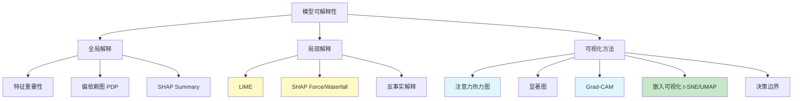
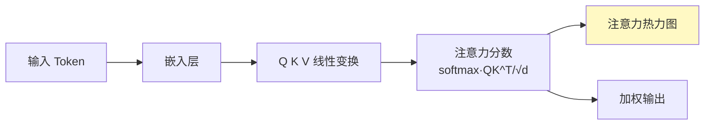
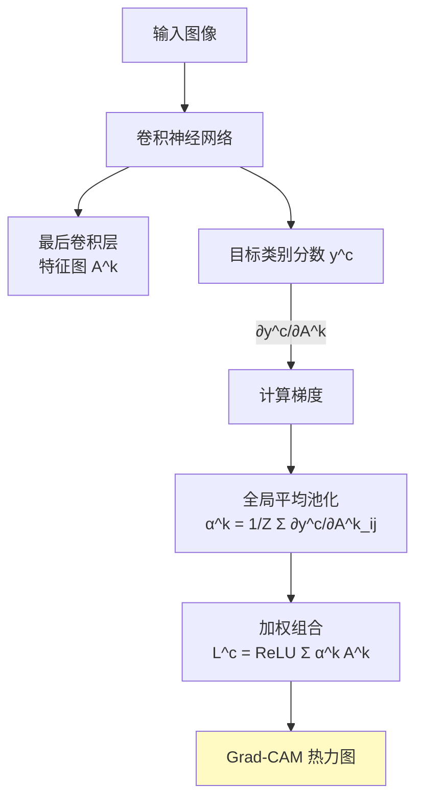
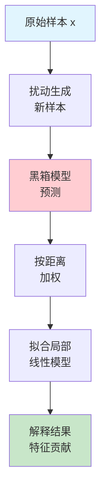
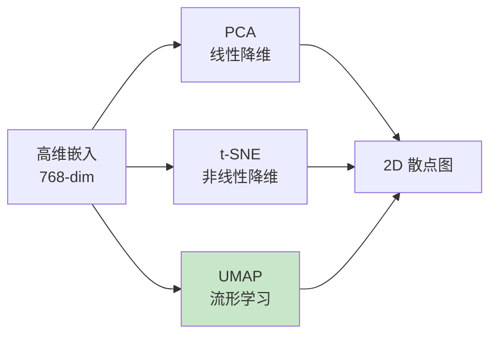
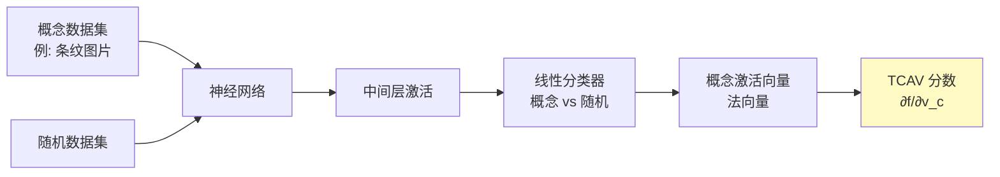
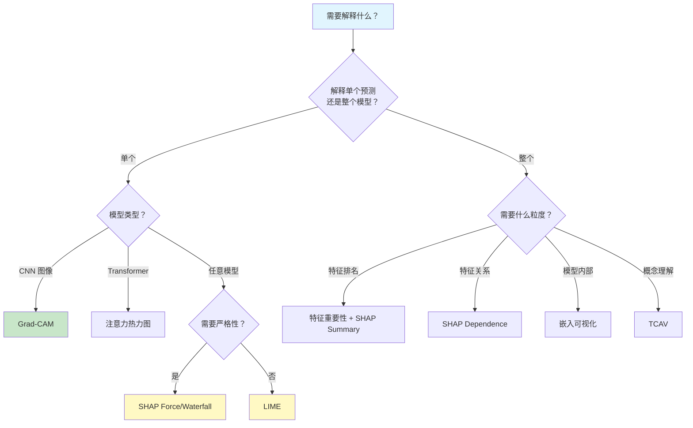

# 模型可解释性可视化

> 中文简称：模型可解释性可视化

> **一句话秒懂**: 模型可解释性可视化就是给"黑箱模型"装上 X 光机——让你看到模型到底在看什么、学了什么、为什么做出这个决定。

## 目录

- [可解释性总览](#可解释性总览)
- [注意力热力图 (Attention Heatmaps)](#注意力热力图)
- [显著图 (Saliency Maps)](#显著图)
- [Grad-CAM](#grad-cam)
- [SHAP 值可视化](#shap-值可视化)
- [LIME 局部解释](#lime-局部解释)
- [嵌入可视化 (Embedding Visualization)](#嵌入可视化)
- [特征重要性图](#特征重要性图)
- [决策边界可视化](#决策边界可视化)
- [概念激活向量 (TCAV)](#概念激活向量)

---

## 可解释性总览



| 方法 | 类型 | 适用模型 | 解释粒度 | 复杂度 |
|------|------|----------|----------|--------|
| 注意力热力图 | 模型特定 | Transformer | 局部 | 低 |
| 显著图 | 梯度方法 | DNN | 局部 | 中 |
| Grad-CAM | 梯度方法 | CNN | 局部 | 中 |
| SHAP | 模型无关 | 全部 | 全局+局部 | 中 |
| LIME | 模型无关 | 全部 | 局部 | 低 |
| t-SNE/UMAP | 降维 | 全部 | 全局 | 中 |
| 特征重要性 | 模型特定 | 树模型 | 全局 | 低 |
| TCAV | 概念解释 | DNN | 全局 | 高 |

---

## 注意力热力图

### 原理

Transformer 模型的注意力权重展示了 token 之间的关注程度，是天然的可解释性来源。



### BertViz 可视化

```python
from transformers import BertTokenizer, BertModel
import torch

tokenizer = BertTokenizer.from_pretrained("bert-base-chinese")
model = BertModel.from_pretrained("bert-base-chinese", output_attentions=True)

text = "自然语言处理是人工智能的重要分支"
inputs = tokenizer(text, return_tensors="pt")
outputs = model(**inputs)

attentions = outputs.attentions  # (num_layers, batch, num_heads, seq_len, seq_len)
print(f"层数: {len(attentions)}, 注意力形状: {attentions[0].shape}")
```

```python
from bertviz import head_view, model_view

head_view(attentions, tokenizer.convert_ids_to_tokens(inputs["input_ids"][0]))
model_view(attentions, tokenizer.convert_ids_to_tokens(inputs["input_ids"][0]))
```

### 自定义注意力热力图

```python
import matplotlib.pyplot as plt
import seaborn as sns
import numpy as np

def plot_attention_heatmap(attention_weights, tokens, head_idx=0, layer_idx=-1):
    attn = attention_weights[layer_idx][0, head_idx].detach().numpy()
    tokens = tokens[:attn.shape[0]]

    fig, ax = plt.subplots(figsize=(10, 8))
    sns.heatmap(
        attn,
        xticklabels=tokens,
        yticklabels=tokens,
        cmap="YlOrRd",
        annot=True,
        fmt=".2f",
        ax=ax,
    )
    ax.set_title(f"注意力热力图 - 层{layer_idx} 头{head_idx}")
    ax.set_xlabel("Key Tokens")
    ax.set_ylabel("Query Tokens")
    plt.tight_layout()
    plt.savefig("attention_heatmap.png", dpi=150)
    plt.show()

tokens = tokenizer.convert_ids_to_tokens(inputs["input_ids"][0])
plot_attention_heatmap(attentions, tokens, head_idx=0, layer_idx=-1)
```

### 注意力头重要性分析

```python
import numpy as np

def analyze_head_importance(attentions, n_layers=12, n_heads=12):
    importance = np.zeros((n_layers, n_heads))
    for layer_idx in range(n_layers):
        for head_idx in range(n_heads):
            attn = attentions[layer_idx][0, head_idx].detach().numpy()
            entropy = -np.sum(attn * np.log(attn + 1e-10), axis=-1).mean()
            importance[layer_idx, head_idx] = -entropy

    fig, ax = plt.subplots(figsize=(12, 6))
    im = ax.imshow(importance, cmap="YlOrRd", aspect="auto")
    ax.set_xlabel("Head Index")
    ax.set_ylabel("Layer Index")
    ax.set_title("注意力头重要性（负熵，越高越重要）")
    plt.colorbar(im, ax=ax)
    plt.tight_layout()
    plt.savefig("head_importance.png", dpi=150)
    plt.show()

analyze_head_importance(attentions)
```

---

## 显著图

### 原理

显著图通过计算输出对输入的梯度，展示输入的哪些部分对模型决策影响最大。


### Vanilla Gradients + SmoothGrad

```python
import torch
import torch.nn as nn
import torchvision.models as models
import torchvision.transforms as transforms
from PIL import Image
import numpy as np
import matplotlib.pyplot as plt

model = models.resnet50(pretrained=True)
model.eval()

preprocess = transforms.Compose([
    transforms.Resize(256),
    transforms.CenterCrop(224),
    transforms.ToTensor(),
    transforms.Normalize(mean=[0.485, 0.456, 0.406], std=[0.229, 0.224, 0.225]),
])

def vanilla_saliency(model, input_tensor, target_class=None):
    input_tensor = input_tensor.requires_grad_(True)
    output = model(input_tensor)
    if target_class is None:
        target_class = output.argmax(1).item()
    output[0, target_class].backward()
    saliency = input_tensor.grad.data.abs().max(1)[0].squeeze().numpy()
    return saliency

def smooth_grad(model, input_tensor, target_class=None, n_samples=50, noise_level=0.1):
    stdev = noise_level * (input_tensor.max() - input_tensor.min())
    total_grads = torch.zeros_like(input_tensor)
    for _ in range(n_samples):
        noise = torch.normal(0, stdev, size=input_tensor.shape)
        noisy_input = input_tensor + noise
        noisy_input = noisy_input.requires_grad_(True)
        output = model(noisy_input)
        if target_class is None:
            target_class = output.argmax(1).item()
        output[0, target_class].backward()
        total_grads += noisy_input.grad.data
    avg_grads = total_grads / n_samples
    saliency = avg_grads.abs().max(1)[0].squeeze().numpy()
    return saliency

img = Image.open("example.jpg")
input_tensor = preprocess(img).unsqueeze(0)

vanilla_sal = vanilla_saliency(model, input_tensor)
smooth_sal = smooth_grad(model, input_tensor, n_samples=50)

fig, axes = plt.subplots(1, 3, figsize=(15, 5))
axes[0].imshow(input_tensor.squeeze().permute(1, 2, 0).numpy() * np.array([0.229, 0.224, 0.225]) + np.array([0.485, 0.456, 0.406]))
axes[0].set_title("原图")
axes[1].imshow(vanilla_sal, cmap="hot")
axes[1].set_title("Vanilla Saliency")
axes[2].imshow(smooth_sal, cmap="hot")
axes[2].set_title("SmoothGrad")
for ax in axes:
    ax.axis("off")
plt.tight_layout()
plt.savefig("saliency_comparison.png", dpi=150)
plt.show()
```

### 使用 Captum 库

```python
from captum.attr import Saliency, IntegratedGradients, NoiseTunnel
from captum.attr import visualization as viz

saliency = Saliency(model)
attributions_sal = saliency.attribute(input_tensor, target=output.argmax(1).item())

integrated_gradients = IntegratedGradients(model)
attributions_ig = integrated_gradients.attribute(
    input_tensor, target=output.argmax(1).item(), n_steps=50
)

noise_tunnel = NoiseTunnel(integrated_gradients)
attributions_nt = noise_tunnel.attribute(
    input_tensor, target=output.argmax(1).item(), nt_type="smoothgrad_sq",
    nt_samples=50, stdevs=0.1,
)

_ = viz.visualize_image_attr_multiple(
    np.transpose(attributions_sal.squeeze().cpu().detach().numpy(), (1, 2, 0)),
    np.transpose(input_tensor.squeeze().cpu().detach().numpy(), (1, 2, 0)),
    methods=["original_image", "heat_map", "blended_heat_map"],
    signs=["all", "absolute_value", "positive"],
    titles=["原图", "Saliency", "Positive Attribution"],
    fig_size=(15, 5),
)
```

---

## Grad-CAM

### 原理

Grad-CAM（Gradient-weighted Class Activation Mapping）利用最后一个卷积层的梯度来生成热力图，展示图像中对分类决策最重要的区域。



### PyTorch 实现

```python
import torch
import torch.nn.functional as F
import torchvision.models as models
import numpy as np
import cv2
import matplotlib.pyplot as plt

class GradCAM:
    def __init__(self, model, target_layer):
        self.model = model
        self.target_layer = target_layer
        self.gradients = None
        self.activations = None
        self._register_hooks()

    def _register_hooks(self):
        def forward_hook(module, input, output):
            self.activations = output.detach()

        def backward_hook(module, grad_input, grad_output):
            self.gradients = grad_output[0].detach()

        self.target_layer.register_forward_hook(forward_hook)
        self.target_layer.register_full_backward_hook(backward_hook)

    def generate(self, input_tensor, target_class=None):
        self.model.eval()
        output = self.model(input_tensor)
        if target_class is None:
            target_class = output.argmax(1).item()

        self.model.zero_grad()
        output[0, target_class].backward()

        weights = self.gradients.mean(dim=(2, 3), keepdim=True)
        cam = (weights * self.activations).sum(dim=1, keepdim=True)
        cam = F.relu(cam)
        cam = F.interpolate(cam, size=input_tensor.shape[2:], mode="bilinear", align_corners=False)
        cam = cam.squeeze().numpy()
        cam = (cam - cam.min()) / (cam.max() - cam.min() + 1e-8)
        return cam

model = models.resnet50(pretrained=True)
model.eval()

target_layer = model.layer4[-1]
grad_cam = GradCAM(model, target_layer)

cam = grad_cam.generate(input_tensor)

def visualize_gradcam(image, cam, alpha=0.5):
    heatmap = cv2.applyColorMap(np.uint8(255 * cam), cv2.COLORMAP_JET)
    heatmap = np.float32(heatmap) / 255
    img_np = np.transpose(image.squeeze().cpu().numpy(), (1, 2, 0))
    img_np = img_np * np.array([0.229, 0.224, 0.225]) + np.array([0.485, 0.456, 0.406])
    img_np = np.clip(img_np, 0, 1)
    overlay = heatmap * alpha + img_np
    overlay = np.clip(overlay, 0, 1)
    return overlay

overlay = visualize_gradcam(input_tensor, cam)

fig, axes = plt.subplots(1, 3, figsize=(15, 5))
axes[0].imshow(np.transpose(input_tensor.squeeze().cpu().numpy(), (1, 2, 0)) * np.array([0.229, 0.224, 0.225]) + np.array([0.485, 0.456, 0.406]))
axes[0].set_title("原图")
axes[1].imshow(cam, cmap="jet")
axes[1].set_title("Grad-CAM 热力图")
axes[2].imshow(overlay)
axes[2].set_title("叠加结果")
for ax in axes:
    ax.axis("off")
plt.tight_layout()
plt.savefig("gradcam_result.png", dpi=150)
plt.show()
```

### Grad-CAM 变体对比

| 变体 | 原理 | 适用场景 |
|------|------|----------|
| **Grad-CAM** | 梯度加权特征图 | 通用 CNN |
| **Grad-CAM++** | 加权梯度 + 像素级权重 | 多实例场景 |
| **XGrad-CAM** | 梯度归一化 | 提高一致性 |
| **Eigen-CAM** | 特征图 PCA | 无需梯度 |
| **Layer-CAM** | 像素级梯度加权 | 高分辨率 |

---

## SHAP 值可视化

### SHAP 原理

SHAP（SHapley Additive exPlanations）基于博弈论 Shapley 值，为每个特征分配对预测的贡献。

```mermaid
graph TD
    Base[基准值<br/>E[f(x)]] --> F1[+ 特征1 贡献<br/>φ₁]
    F1 --> F2[+ 特征2 贡献<br/>φ₂]
    F2 --> F3[+ 特征3 贡献<br/>φ₃]
    F3 --> F4[+ 特征4 贡献<br/>φ₄]
    F4 --> Pred[预测值<br/>f(x)]

    style Base fill:#e1f5fe
    style Pred fill:#c8e6c9
    style F1 fill:#fff9c4
    style F2 fill:#fff9c4
    style F3 fill:#fff9c4
    style F4 fill:#fff9c4
```

### SHAP 核心图表

| 图表类型 | 用途 | 说明 |
|----------|------|------|
| Force Plot | 单样本解释 | 展示各特征如何推动预测偏离基准值 |
| Waterfall Plot | 单样本解释 | Force Plot 的瀑布图版本，更清晰 |
| Summary Plot | 全局解释 | 所有样本的特征重要性排名 |
| Dependence Plot | 特征交互 | 单个特征值与 SHAP 值的关系 |
| Interaction Plot | 特征交互 | 两两特征的交互效应 |
| Decision Plot | 路径解释 | 多样本的决策路径 |
| Embedding Plot | 聚类 | SHAP 值的降维可视化 |

### 完整代码示例

```python
import shap
import xgboost as xgb
from sklearn.datasets import load_breast_cancer
from sklearn.model_selection import train_test_split
import matplotlib.pyplot as plt
import numpy as np

X, y = load_breast_cancer(return_X_y=True, as_frame=True)
X_train, X_test, y_train, y_test = train_test_split(X, y, test_size=0.2, random_state=42)

model = xgb.XGBClassifier(n_estimators=100, max_depth=5, random_state=42)
model.fit(X_train, y_train)

explainer = shap.TreeExplainer(model)
shap_values = explainer.shap_values(X_test)
shap_explanation = explainer(X_test)
```

#### Force Plot — 单样本解释

```python
shap.initjs()

shap.force_plot(
    explainer.expected_value,
    shap_values[0],
    X_test.iloc[0],
    matplotlib=True,
)
```

#### Waterfall Plot — 瀑布图

```python
shap.waterfall_plot(shap_explanation[0])
plt.tight_layout()
plt.savefig("shap_waterfall.png", dpi=150)
plt.show()
```

#### Summary Plot — 全局特征重要性

```python
shap.summary_plot(shap_values, X_test, plot_type="dot", max_display=15)
plt.tight_layout()
plt.savefig("shap_summary_dot.png", dpi=150)
plt.show()

shap.summary_plot(shap_values, X_test, plot_type="bar", max_display=15)
plt.tight_layout()
plt.savefig("shap_summary_bar.png", dpi=150)
plt.show()

shap.summary_plot(shap_values, X_test, plot_type="violin", max_display=15)
plt.tight_layout()
plt.savefig("shap_summary_violin.png", dpi=150)
plt.show()
```

#### Dependence Plot — 特征依赖

```python
shap.dependence_plot("worst radius", shap_values, X_test, interaction_index="worst concave points")
plt.tight_layout()
plt.savefig("shap_dependence.png", dpi=150)
plt.show()
```

#### Interaction Plot — 交互效应

```python
shap_interaction = explainer.shap_interaction_values(X_test.iloc[:100])

shap.summary_plot(shap_interaction, X_test.iloc[:100], max_display=10)
plt.tight_layout()
plt.savefig("shap_interaction.png", dpi=150)
plt.show()
```

#### Decision Plot — 决策路径

```python
shap.decision_plot(
    explainer.expected_value,
    shap_values[:50],
    X_test.iloc[:50],
    highlight=[0, 1, 2],
)
plt.tight_layout()
plt.savefig("shap_decision.png", dpi=150)
plt.show()
```

#### Embedding Plot — SHAP 嵌入

```python
shap.embedding_plot("worst radius", shap_values, X_test)
plt.tight_layout()
plt.savefig("shap_embedding.png", dpi=150)
plt.show()
```

### Deep SHAP（深度学习）

```python
import shap
import torch
import torch.nn as nn

class SimpleNN(nn.Module):
    def __init__(self, input_dim):
        super().__init__()
        self.net = nn.Sequential(
            nn.Linear(input_dim, 64), nn.ReLU(),
            nn.Linear(64, 32), nn.ReLU(),
            nn.Linear(32, 2),
        )
    def forward(self, x):
        return self.net(x)

model = SimpleNN(input_dim=30)
background = torch.FloatTensor(X_train.values[:100])
test_data = torch.FloatTensor(X_test.values[:50])

e = shap.DeepExplainer(model, background)
shap_values = e.shap_values(test_data)

shap.summary_plot(shap_values, X_test.iloc[:50], plot_type="dot")
```

---

## LIME 局部解释

### 原理

LIME（Local Interpretable Model-agnostic Explanations）通过在样本附近扰动数据，拟合一个局部可解释模型（如线性模型）来解释单个预测。



### 表格数据

```python
import lime
import lime.lime_tabular
import numpy as np
from sklearn.ensemble import RandomForestClassifier
from sklearn.datasets import load_breast_cancer
from sklearn.model_selection import train_test_split

X, y = load_breast_cancer(return_X_y=True)
X_train, X_test, y_train, y_test = train_test_split(X, y, test_size=0.2, random_state=42)
feature_names = load_breast_cancer().feature_names

model = RandomForestClassifier(n_estimators=100, random_state=42)
model.fit(X_train, y_train)

explainer = lime.lime_tabular.LimeTabularExplainer(
    X_train,
    feature_names=feature_names,
    class_names=["恶性", "良性"],
    mode="classification",
)

exp = explainer.explain_instance(
    X_test[0],
    model.predict_proba,
    num_features=10,
    top_labels=1,
)

fig = exp.as_pyplot_figure()
plt.tight_layout()
plt.savefig("lime_tabular.png", dpi=150)
plt.show()

exp.show_in_notebook()
```

### 文本数据

```python
import lime.lime_text
from sklearn.pipeline import make_pipeline
from sklearn.feature_extraction.text import TfidfVectorizer
from sklearn.naive_bayes import MultinomialNB

texts = [
    "这个产品太好了，非常满意",
    "质量很差，不推荐购买",
    "服务态度很好，物流也快",
    "完全不值这个价格",
    "超出预期，强烈推荐",
    "太失望了，退货了",
]
labels = [1, 0, 1, 0, 1, 0]

vectorizer = TfidfVectorizer()
clf = MultinomialNB()
pipe = make_pipeline(vectorizer, clf)
pipe.fit(texts, labels)

explainer = lime.lime_text.LimeTextExplainer(class_names=["负面", "正面"])

exp = explainer.explain_instance(
    "这个产品质量一般，但服务很好",
    pipe.predict_proba,
    num_features=6,
)

fig = exp.as_pyplot_figure()
plt.tight_layout()
plt.savefig("lime_text.png", dpi=150)
plt.show()
```

### 图像数据

```python
import lime.lime_image
from skimage.segmentation import mark_boundaries

explainer = lime.lime_image.LimeImageExplainer()

def predict_fn(images):
    input_batch = torch.stack([
        preprocess(Image.fromarray(img)) for img in images
    ])
    with torch.no_grad():
        probs = torch.nn.functional.softmax(model(input_batch), dim=1)
    return probs.numpy()

explanation = explainer.explain_instance(
    img_np,
    predict_fn,
    top_labels=5,
    hide_color=0,
    num_samples=1000,
)

temp, mask = explanation.get_image_and_mask(
    explanation.top_labels[0],
    positive_only=True,
    num_features=5,
    hide_rest=False,
)

fig, axes = plt.subplots(1, 2, figsize=(12, 6))
axes[0].imshow(img_np)
axes[0].set_title("原图")
axes[1].imshow(mark_boundaries(temp / 255.0, mask))
axes[1].set_title("LIME 解释")
for ax in axes:
    ax.axis("off")
plt.tight_layout()
plt.savefig("lime_image.png", dpi=150)
plt.show()
```

### SHAP vs LIME 对比

| 特性 | SHAP | LIME |
|------|------|------|
| 理论基础 | Shapley 值（博弈论） | 局部线性近似 |
| 一致性 | 保证 | 不保证 |
| 计算速度 | 慢（精确）/ 快（近似） | 快 |
| 全局解释 | 支持（Summary Plot） | 不直接支持 |
| 局部解释 | 支持（Force/Waterfall） | 支持 |
| 交互效应 | 支持 | 不支持 |
| 模型支持 | 树模型快，深度学习支持 | 模型无关 |
| 推荐场景 | 需要严谨解释时 | 快速探索时 |

---

## 嵌入可视化

### 原理

将高维嵌入（词向量、句向量、图像特征）降维到 2D/3D 空间，直观观察语义聚类和关系。



### 方法对比

| 方法 | 速度 | 全局结构 | 局部结构 | 适合规模 |
|------|------|----------|----------|----------|
| PCA | 快 | 好 | 差 | 任意 |
| t-SNE | 慢 | 差 | 好 | <50K |
| UMAP | 中 | 好 | 好 | <10M |

### PCA 可视化

```python
from sklearn.decomposition import PCA
from sklearn.datasets import load_digits
import matplotlib.pyplot as plt
import numpy as np

digits = load_digits()
X, y = digits.data, digits.target

pca = PCA(n_components=2)
X_pca = pca.fit_transform(X)

fig, ax = plt.subplots(figsize=(10, 8))
scatter = ax.scatter(X_pca[:, 0], X_pca[:, 1], c=y, cmap="tab10", alpha=0.6, s=20)
ax.set_title(f"PCA 降维 (解释方差: {pca.explained_variance_ratio_.sum():.2%})")
ax.set_xlabel(f"PC1 ({pca.explained_variance_ratio_[0]:.2%})")
ax.set_ylabel(f"PC2 ({pca.explained_variance_ratio_[1]:.2%})")
plt.colorbar(scatter, label="数字类别")
plt.tight_layout()
plt.savefig("pca_digits.png", dpi=150)
plt.show()
```

### t-SNE 可视化

```python
from sklearn.manifold import TSNE

tsne = TSNE(
    n_components=2,
    perplexity=30,
    learning_rate=200,
    n_iter=1000,
    random_state=42,
)
X_tsne = tsne.fit_transform(X)

fig, ax = plt.subplots(figsize=(10, 8))
scatter = ax.scatter(X_tsne[:, 0], X_tsne[:, 1], c=y, cmap="tab10", alpha=0.6, s=20)
ax.set_title("t-SNE 降维")
plt.colorbar(scatter, label="数字类别")
plt.tight_layout()
plt.savefig("tsne_digits.png", dpi=150)
plt.show()
```

### UMAP 可视化

```python
import umap

reducer = umap.UMAP(
    n_components=2,
    n_neighbors=15,
    min_dist=0.1,
    metric="cosine",
    random_state=42,
)
X_umap = reducer.fit_transform(X)

fig, ax = plt.subplots(figsize=(10, 8))
scatter = ax.scatter(X_umap[:, 0], X_umap[:, 1], c=y, cmap="tab10", alpha=0.6, s=20)
ax.set_title("UMAP 降维")
plt.colorbar(scatter, label="数字类别")
plt.tight_layout()
plt.savefig("umap_digits.png", dpi=150)
plt.show()
```

### 句子嵌入可视化

```python
from sentence_transformers import SentenceTransformer
import umap
import matplotlib.pyplot as plt

model = SentenceTransformer("paraphrase-multilingual-MiniLM-L12-v2")

sentences = [
    "今天天气真好", "阳光明媚的一天", "外面的天气很棒",
    "股票市场大跌", "投资者损失惨重", "金融危机来了",
    "新手机发布了", "苹果推出新机型", "科技产品更新",
    "足球比赛很精彩", "世界杯开始了", "运动员表现优秀",
    "人工智能快速发展", "大模型技术突破", "AI 改变世界",
]

embeddings = model.encode(sentences)

reducer = umap.UMAP(n_components=2, n_neighbors=5, min_dist=0.3, random_state=42)
coords = reducer.fit_transform(embeddings)

labels = ["天气"] * 3 + ["金融"] * 3 + ["科技产品"] * 3 + ["体育"] * 3 + ["AI"] * 3
colors = ["#e74c3c", "#3498db", "#2ecc71", "#f39c12", "#9b59b6"]
color_map = {label: colors[i] for i, label in enumerate(sorted(set(labels)))}

fig, ax = plt.subplots(figsize=(12, 8))
for label in sorted(set(labels)):
    idx = [i for i, l in enumerate(labels) if l == label]
    ax.scatter(coords[idx, 0], coords[idx, 1], c=color_map[label], label=label, s=100, alpha=0.8)
    for i in idx:
        ax.annotate(sentences[i], (coords[i, 0], coords[i, 1]), fontsize=8, ha="center", va="bottom")

ax.set_title("句子嵌入 UMAP 可视化")
ax.legend(loc="best")
plt.tight_layout()
plt.savefig("sentence_embeddings.png", dpi=150)
plt.show()
```

---

## 特征重要性图

### 基于不纯度的重要性（Impurity-based）

```python
from sklearn.ensemble import RandomForestClassifier
from sklearn.datasets import load_breast_cancer
import matplotlib.pyplot as plt
import numpy as np

X, y = load_breast_cancer(return_X_y=True)
feature_names = load_breast_cancer().feature_names
model = RandomForestClassifier(n_estimators=100, random_state=42)
model.fit(X, y)

importances = model.feature_importances_
indices = np.argsort(importances)[::-1][:15]

fig, ax = plt.subplots(figsize=(10, 6))
ax.barh(range(len(indices)), importances[indices], align="center")
ax.set_yticks(range(len(indices)))
ax.set_yticklabels(feature_names[indices])
ax.set_xlabel("特征重要性")
ax.set_title("随机森林 - 特征重要性（基于不纯度）")
ax.invert_yaxis()
plt.tight_layout()
plt.savefig("impurity_importance.png", dpi=150)
plt.show()
```

### 排列重要性（Permutation Importance）

```python
from sklearn.inspection import permutation_importance
from sklearn.model_selection import train_test_split

X_train, X_test, y_train, y_test = train_test_split(X, y, test_size=0.2, random_state=42)
model.fit(X_train, y_train)

perm_importance = permutation_importance(model, X_test, y_test, n_repeats=30, random_state=42)
sorted_idx = perm_importance.importances_mean.argsort()[::-1][:15]

fig, ax = plt.subplots(figsize=(10, 6))
ax.boxplot(
    perm_importance.importances[sorted_idx].T,
    vert=False,
    labels=feature_names[sorted_idx],
)
ax.set_title("排列重要性（Permutation Importance）")
ax.set_xlabel("重要性变化")
plt.tight_layout()
plt.savefig("permutation_importance.png", dpi=150)
plt.show()
```

### 重要性方法对比

| 方法 | 原理 | 优点 | 缺点 |
|------|------|------|------|
| 不纯度重要性 | 分裂时的信息增益 | 快、无需额外数据 | 高基数特征偏倚 |
| 排列重要性 | 打乱特征看性能变化 | 模型无关、可靠 | 慢、相关特征互相影响 |
| SHAP 重要性 | Shapley 值平均 | 最严谨、考虑交互 | 慢 |

---

## 决策边界可视化

```python
import numpy as np
import matplotlib.pyplot as plt
from sklearn.datasets import make_moons
from sklearn.ensemble import RandomForestClassifier
from sklearn.svm import SVC
from sklearn.neighbors import KNeighborsClassifier
from sklearn.neural_network import MLPClassifier

X, y = make_moons(n_samples=500, noise=0.3, random_state=42)

classifiers = {
    "随机森林": RandomForestClassifier(n_estimators=100, random_state=42),
    "SVM (RBF)": SVC(kernel="rbf", random_state=42),
    "KNN (k=5)": KNeighborsClassifier(n_neighbors=5),
    "神经网络": MLPClassifier(hidden_layer_sizes=(32, 16), max_iter=500, random_state=42),
}

fig, axes = plt.subplots(2, 2, figsize=(14, 12))
axes = axes.ravel()

for idx, (name, clf) in enumerate(classifiers.items()):
    clf.fit(X, y)

    h = 0.05
    x_min, x_max = X[:, 0].min() - 0.5, X[:, 0].max() + 0.5
    y_min, y_max = X[:, 1].min() - 0.5, X[:, 1].max() + 0.5
    xx, yy = np.meshgrid(np.arange(x_min, x_max, h), np.arange(y_min, y_max, h))
    Z = clf.predict(np.c_[xx.ravel(), yy.ravel()])
    Z = Z.reshape(xx.shape)

    axes[idx].contourf(xx, yy, Z, alpha=0.3, cmap="RdBu")
    axes[idx].scatter(X[:, 0], X[:, 1], c=y, cmap="RdBu", edgecolors="black", s=20)
    axes[idx].set_title(name)
    score = clf.score(X, y)
    axes[idx].text(
        0.05, 0.95, f"准确率: {score:.2%}",
        transform=axes[idx].transAxes, fontsize=10, verticalalignment="top",
        bbox=dict(boxstyle="round", facecolor="white", alpha=0.8),
    )

plt.suptitle("决策边界可视化对比", fontsize=14)
plt.tight_layout()
plt.savefig("decision_boundaries.png", dpi=150)
plt.show()
```

---

## 概念激活向量

### 原理

TCAV（Testing with Concept Activation Vectors）衡量一个高层概念（如"条纹"、"颜色"）对模型预测的敏感度。



```python
import torch
import torch.nn as nn
import numpy as np
from sklearn.linear_model import SGDClassifier

class TCAV:
    def __init__(self, model, target_layer, concept_data, random_data):
        self.model = model
        self.target_layer = target_layer
        self.activations = {}
        self.target_layer.register_forward_hook(self._hook_fn)
        self.concept_activations = self._get_activations(concept_data)
        self.random_activations = self._get_activations(random_data)

    def _hook_fn(self, module, input, output):
        self.activations["target"] = output.detach()

    def _get_activations(self, data_loader):
        all_acts = []
        self.model.eval()
        with torch.no_grad():
            for batch in data_loader:
                if isinstance(batch, (list, tuple)):
                    batch = batch[0]
                _ = self.model(batch)
                act = self.activations["target"]
                act = act.view(act.size(0), -1)
                all_acts.append(act.cpu().numpy())
        return np.concatenate(all_acts, axis=0)

    def get_cav(self):
        X = np.concatenate([self.concept_activations, self.random_activations])
        y = np.concatenate([
            np.ones(len(self.concept_activations)),
            np.zeros(len(self.random_activations)),
        ])
        clf = SGDClassifier(loss="hinge", random_state=42)
        clf.fit(X, y)
        cav = clf.coef_[0]
        cav = cav / np.linalg.norm(cav)
        return cav

    def tcav_score(self, data_loader, target_class, num_runs=10):
        cav = self.get_cav()
        scores = []
        self.model.eval()

        for batch in data_loader:
            if isinstance(batch, (list, tuple)):
                batch = batch[0]
            batch = batch.requires_grad_(True)
            output = self.model(batch)
            output[0, target_class].backward()

            act = self.activations["target"]
            grad = act.grad
            if grad is None:
                batch.grad = None
                continue
            grad_flat = grad.view(grad.size(0), -1)
            sensitivity = torch.matmul(grad_flat, torch.FloatTensor(cav))
            score = (sensitivity > 0).float().mean().item()
            scores.append(score)
            batch.grad = None

        return np.mean(scores)
```

---

## 方法选择指南



---

## 参考资料

- [SHAP 官方文档](https://shap.readthedocs.io/)
- [LIME 论文](https://arxiv.org/abs/1602.04938)
- [Grad-CAM 论文](https://arxiv.org/abs/1610.02391)
- [Captum 文档](https://captum.ai/)
- [BertViz](https://github.com/jessevig/bertviz)
- [UMAP 文档](https://umap-learn.readthedocs.io/)
- [TCAV 论文](https://arxiv.org/abs/1711.11279)

## Related

- [[94_可视化/README.md|94_Visualization README]]
- [[前端应用/atlas/README.md|atlas README]]
- [[前端应用/atlas/docs/performance.md|performance]]
- [[94_可视化/01_最佳实践/04_Visualization_简明指南|神经网络可视化指南]] — 架构图、特征图与注意力可视化
