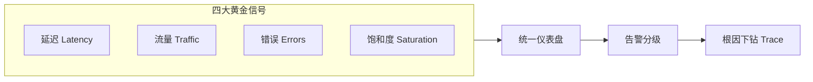

# 系统可视化（System Visualization）

> 中文简称：系统可视化 ｜ English Name: System Viz

> **一句话理解**: 系统可视化让 AI 系统从黑盒变白盒——用仪表盘、架构图与知识图谱，把延迟、吞吐、请求链路、模型结构与实体关系一目了然地呈现给平台工程师与架构师。

系统可视化（System Visualization）覆盖 AI 系统的运行时监控（dashboard）、推理服务可视化、模型架构可视化与知识图谱可视化。本子域面向平台工程师、推理工程师与架构师，是保障系统稳定、排查故障、理解结构的核心手段。

---

## 一、为什么需要系统可视化

| 关注点 | 没有可视化的风险 | 可视化价值 |
|--------|------------------|------------|
| 系统健康 | 故障滞后发现 | 实时仪表盘+告警 |
| 推理性能 | P95 尾延迟难定位 | 延迟分布与链路追踪 |
| 模型结构 | 架构复杂难沟通 | 架构图直观呈现 |
| 知识资产 | 图谱关系不可见 | 图谱交互式探索 |
| 资源利用 | 成本失控 | GPU/显存/吞吐监控 |

---

## 二、文件导航

| 文件 | 说明 | 适用人群 |
|------|------|----------|
| [[94_可视化/System_Viz/AI_System_Dashboard\|AI System Dashboard]] | 监控、告警与运维仪表盘设计 | 平台工程师 / 运维仪表盘设计者 |
| [[94_可视化/System_Viz/Inference_Serving_Visualization\|Inference Serving Visualization]] | 推理服务延迟、吞吐与链路可视化 | 推理工程师 |
| [[94_可视化/System_Viz/Knowledge_Graph_Visualization\|Knowledge Graph Visualization]] | 知识图谱布局、交互与探索 | 知识图谱工程师 / 可视化开发者 |
| [[94_可视化/04_系统可视化/05_模型_架构_Viz|Model Architecture Viz]] | 模型架构可视化（结构图/计算图） | 架构师 / 研究员 |

---

## 三、核心可视化类型

### 3.1 运维仪表盘（Dashboard）

| 面板 | 指标 | 用途 |
|------|------|------|
| 概览 | QPS/成功率/延迟 | 系统健康 |
| 延迟 | P50/P95/P99 | 尾延迟排查 |
| 资源 | GPU/显存/CPU | 容量与成本 |
| 错误 | 错误率/告警 | 故障发现 |
| 链路 | Trace 考察 | 定位慢环节 |

### 3.2 推理服务可视化

详见 [[94_可视化/System_Viz/Inference_Serving_Visualization|推理服务可视化]]。

### 3.3 模型架构可视化

详见 [[94_可视化/04_系统可视化/05_模型_架构_Viz|模型架构可视化]]。

### 3.4 知识图谱可视化

详见 [[94_可视化/System_Viz/Knowledge_Graph_Visualization|知识图谱可视化]]。

---

## 四、仪表盘设计原则

| 原则 | 说明 |
|------|------|
| 分层 | 概览 → 下钻 → 根因，由粗到细 |
| 黄金信号 | 延迟/流量/错误/饱和度四件套 |
| 告警可操作 | 每条告警对应明确动作 |
| 时序对齐 | 多面板时间范围一致 |
| 色彩语义 | 红=危险/绿=正常，色彩克制 |

---

## 五、工具与平台

| 工具 | 强项 | 适用 |
|------|------|------|
| Grafana | 通用仪表盘+告警 | 运维监控 |
| Prometheus | 指标采集+时序 | 后端 |
| Jaeger/Tempo | 分布式追踪 | 链路 |
| Netron | 模型结构可视化 | 架构 |
| TensorBoard Graph | 计算图 | 训练架构 |
| Neo4j/Gephi/cytoscape | 图数据库与图谱可视化 | 知识图谱 |
| ECharts/D3.js | 自定义 Web 可视化 | 仪表盘 |

---

## 六、常见陷阱

| 陷阱 | 后果 | 正确做法 |
|------|------|----------|
| 仪表盘信息过载 | 关键指标被淹没 | 分层+聚焦黄金信号 |
| 只看平均值 | 尾延迟被掩盖 | 看 P95/P99 分布 |
| 告警风暴 | 告警疲劳 | 告警聚合+分级 |
| 架构图过时 | 误导排查 | 图与代码/IaC 联动 |
| 图谱布局杂乱 | 难以理解 | 力导向+聚类+过滤 |

---

## 七、术语速查

| 术语 | 含义 |
|------|------|
| Golden Signals | 延迟/流量/错误/饱和度 |
| Trace | 单次请求的链路记录 |
| SLO/SLI | 服务等级目标/指标 |
| Force-directed | 力导向图布局 |
| Compute Graph | 模型计算图 |

---

## 八、黄金信号监控面板设计

| 信号 | 关键指标 | 告警阈值示例 |
|------|----------|--------------|
| 延迟 | P95/P99 | P99 > 500ms |
| 流量 | QPS/吞吐 | 突增 > 3σ |
| 错误 | 错误率/5xx | > 1% |
| 饱和度 | GPU/显存利用率 | > 85% |

---

## 九、架构图层次

| 层次 | 内容 | 受众 |
|------|------|------|
| 概念层 | 业务/数据流 | 决策者 |
| 逻辑层 | 组件/服务关系 | 架构师 |
| 物理层 | 部署/网络拓扑 | 运维 |
| 实现层 | 计算图/模块 | 工程师 |

---

## 十、学习路径

| 阶段 | 内容 | 产出 |
|------|------|------|
| 入门 | AI 系统仪表盘 | 搭监控大盘 |
| 基础 | 推理服务可视化 | 排查尾延迟 |
| 进阶 | 架构图/知识图谱 | 沟通与探索 |
| 实战 | 黄金信号+告警 | 生产级可观测 |

---

## 十一、常见问题（FAQ）

| 问题 | 解答 |
|------|------|
| 仪表盘放多少面板？ | 概览页 ≤ 6 个，详情页可下钻。 |
| P99 告警总响怎么办？ | 区分系统噪声与真实异常，调阈值+告警聚合。 |
| 架构图怎么保持不过时？ | 与 IaC/代码联动，定期 review。 |
| 知识图谱节点太多看不清？ | 聚类+过滤+按需展开。 |
| Trace 采样率设多少？ | 故障期提高采样，常态低采样控成本。 |
| GPU 利用率低是坏事吗？ | 视瓶颈而定，可能是数据加载或 CPU 瓶颈。 |

---

## 十二、系统可视化检查清单

- [ ] 黄金信号四件套已上盘
- [ ] P50/P95/P99 延迟分布可见
- [ ] 告警已分级且可操作
- [ ] Trace 链路追踪已开启
- [ ] 资源利用率面板齐全
- [ ] 架构图与代码/部署对齐
- [ ] 知识图谱可交互探索

---

## 关联

- [[94_可视化/index|可视化首页]]
- [[94_可视化/Best_Practices/index|Best Practices]]
- [[12_架构基建/index|架构基建]]
- [[11_模型运维/index|模型运维]]
- [[10_部署推理/index|部署推理]]
- [[14_RAG系统/index|RAG 系统]]
- [[工具/index|工具]]

---

*Last updated: 2026-07-23*
