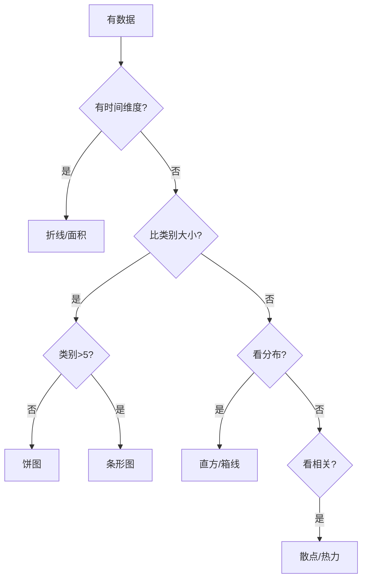

# 数据可视化最佳实践深度解析 (Data Viz Best Practices)

> **一句话理解**: 数据可视化最佳实践是"图表的宪法"——选对图、配好色、标清楚、讲成故事，让数据从"看得见"升级为"看得懂、用得上、能决策"。

---

## 目录

1. [背景与动机](#1-背景与动机)
2. [第一原则：明确目的与受众](#2-第一原则明确目的与受众)
3. [图表选择体系](#3-图表选择体系)
4. [配色科学](#4-配色科学)
5. [标注与版面](#5-标注与版面)
6. [数据叙事](#6-数据叙事)
7. [反模式图鉴](#7-反模式图鉴)
8. [可访问性与无障碍](#8-可访问性与无障碍)
9. [工具与实现](#9-工具与实现)
10. [对比表](#10-对比表)
11. [应用场景](#11-应用场景)
12. [局限与误区](#12-局限与误区)
13. [关联](#关联)

---

## 1. 背景与动机

数据本身不会说话，**图表**才是它的嗓子。但一张糟糕的图表比没有图表更糟——它误导决策。数据可视化最佳实践（Data Visualization Best Practices）汇总了图表选择、配色、标注、叙事与无障碍的成熟原则，目标是让每一张图都**诚实、清晰、有说服力**。

### 1.1 好图 vs 坏图

| 维度 | 好图 | 坏图 |
|------|------|------|
| 诚实 | 比例真实、不截断误导 | 截断 y 轴夸大差异 |
| 清晰 | 一图一观点 | 信息过载 |
| 可读 | 字号/对比足够 | 字小、色弱 |
| 美观 | 克制、留白 | chartjunk 堆砌 |
| 可信 | 标注来源 | 来源不明 |

### 1.2 本篇定位

本篇是可视化最佳实践的**深度版**，与 [[可视化/Best_Practices/Data_Visualization_Best_Practices|速查版]] 互补，提供更完整的方法论、反模式与实现指引。

---

## 2. 第一原则：明确目的与受众

### 2.1 先问三个问题

| 问题 | 答案决定 |
|------|----------|
| 给谁看？ | 详细程度、术语、交互 |
| 看什么？ | 图表类型、强调 |
| 看完做什么？ | 结论式标题、行动呼吁 |

### 2.2 受众矩阵

| 受众 | 详细度 | 交互 | 术语 |
|------|--------|------|------|
| 决策者 | 低（结论） | 低 | 少 |
| 技术同行 | 高 | 中 | 多 |
| 大众 | 低-中 | 中 | 少 |
| 自己探索 | 最高 | 高 | 多 |

### 2.3 目的分类

| 目的 | 推荐策略 |
|------|----------|
| 解释（Explain） | 简洁、标注、结论标题 |
| 探索（Explore） | 交互、多维、可下钻 |
| 记录（Record） | 完整、可追溯、含元数据 |
| 说服（Persuade） | 强对比、突出关键 |

---

## 3. 图表选择体系

### 3.1 按数据关系

| 关系 | 推荐图 | 避免 |
|------|--------|------|
| 比较（类别） | 柱状/条形 | 饼图（>5 类） |
| 趋势（时序） | 折线/面积 | 柱状（连续） |
| 占比 | 饼/堆叠条（≤5） | 3D 饼 |
| 分布 | 直方/箱线/小提琴 | 折线 |
| 相关 | 散点/热力 | 折线 |
| 层级 | 树图/旭日 | 表格 |
| 地理 | 地图/choropleth | 散点 |
| 网络 | 力导向/矩阵 | 表格 |

### 3.2 按数据类型

| 数据类型 | 推荐 |
|----------|------|
| 单变量 | 直方/箱线 |
| 双变量 | 散点/折线 |
| 多变量 | 平行坐标/雷达/热力 |
| 时序 | 折线/流图 |
| 地理 | 地图 |

### 3.3 选择决策树



### 3.4 常见误选

| 误选 | 问题 | 正确 |
|------|------|------|
| 用饼图比 8 类 | 难比较 | 条形 |
| 用折线表类别 | 暗示虚假趋势 | 柱状 |
| 用 3D 柱状 | 误读数值 | 2D |
| 用堆叠面积比趋势 | 中间层难读 | 折线 |

---

## 4. 配色科学

### 4.1 色彩的类型

| 类型 | 用途 | 示例 |
|------|------|------|
| 顺序型（sequential） | 有序数据 | Viridis |
| 发散型（diverging） | 有正负/中点 | 蓝-白-红 |
| 分类型（qualitative） | 无序类别 | ColorBrewer Set |
| 色盲安全 | 无障碍 | Viridis/Cividis |

### 4.2 配色原则

| 原则 | 说明 |
|------|------|
| 色盲安全 | 避免纯红绿组合 |
| 语义一致 | 红色=危险/下降 |
| 克制 | 类别 ≤ 7，多了用形状 |
| 强调 | 只高亮一个系列，其余灰化 |
| 顺序渐变 | 有序数据用渐变色板 |
| 中性背景 | 浅灰背景突出数据 |

### 4.3 色板推荐

| 色板 | 类型 | 适用 |
|------|------|------|
| Viridis | 顺序/色盲安全 | 默认首选 |
| Cividis | 顺序/色盲安全 | 学术 |
| ColorBrewer | 全类型 | 地图/分类 |
| Tableau 10 | 分类 | 商业 |
| 苏打/Okabe-Ito | 分类/色盲 | 论文 |

### 4.4 渐变与风险

- 彩虹色板（jet）不感知均匀且色盲不友好，应避免。
- 红绿同图必须搭配形状/纹理冗余编码。

---

## 5. 标注与版面

### 5.1 标注要素

| 要素 | 作用 | 规范 |
|------|------|------|
| 标题 | 点明观点 | 结论式 |
| 副标题 | 背景 | 来源/时间 |
| 轴标签 | 说明量纲 | 含单位 |
| 刻度 | 读数 | 不截断（柱） |
| 图例 | 区分系列 | 直接标注优先 |
| 注释 | 突出关键 | 箭头+文字 |
| 来源 | 可追溯 | 角注 |

### 5.2 版面原则

| 原则 | 说明 |
|------|------|
| 数据墨水比 | 最大化数据墨水，最小化装饰 |
| 留白 | 避免拥挤 |
| 对齐 | 元素网格对齐 |
| 层次 | 标题/数据/注释分明 |
| 一致 | 同系列多图同尺度同色 |

### 5.3 字体与可读

| 项 | 建议 |
|----|------|
| 字号 | 最小 9pt，标题更大 |
| 字体 | 无衬线清晰 |
| 对比 | 文字与背景对比 ≥ 4.5:1 |
| 方向 | 避免旋转标签，横排 |

---

## 6. 数据叙事

### 6.1 叙事五步

| 步骤 | 内容 |
|------|------|
| 1. 受众 | 给谁、关心什么 |
| 2. 观点 | 一图一结论 |
| 3. 证据 | 图表支撑 |
| 4. 对比 | 与基准/历史比 |
| 5. 行动 | 引出决策 |

### 6.2 叙事结构

| 结构 | 适用 |
|------|------|
| 倒金字塔 | 先结论后证据（决策者） |
| 时间线 | 演化故事 |
| 对比 | A vs B |
| 问题-解决 | 提问题给方案 |

### 6.3 标题写法

| 类型 | 示例 |
|------|------|
| 描述式（弱） | "Q3 收入图" |
| 结论式（强） | "Q3 收入环比涨 20%" |
| 行动式（强） | "建议加投品类 A" |

---

## 7. 反模式图鉴

| 反模式 | 问题 | 改进 |
|--------|------|------|
| 截断 y 轴 | 夸大差异 | 柱状从 0 起 |
| 3D 图表 | 误读数值 | 用 2D |
| 双 Y 轴误导 | 假关联 | 拆双图或明确 |
| 饼图过多扇区 | 难比较 | 条形 |
| 无序条形 | 找不到重点 | 排序 |
| 彩虹色板 | 色盲不友好 | Viridis |
| 渐变填充 | 干扰读数 | 纯色 |
| 动画过度 | 分散注意 | 克制 |
| 缺单位 | 读不懂 | 标全单位 |
| 默认配色 | 不美观/不安全 | 主题色板 |
| 信息过载 | 看不出重点 | 一图一观点 |
| 无标注 | 不可读 | 关键点注释 |

---

## 8. 可访问性与无障碍

### 8.1 色盲友好

- 约 8% 男性色盲，避免纯红绿。
- 用色盲安全色板（Viridis/Okabe-Ito）。
- 冗余编码：颜色+形状/纹理/标签。

### 8.2 屏幕阅读器

- 为图表加 `alt` 文本描述。
- 关键数据提供表格备选。

### 8.3 可读性

- 高对比度（WCAG AA ≥ 4.5:1）。
- 足够字号。
- 避免纯色彩传达唯一信息。

### 8.4 响应式

- 移动端简化、横排改纵排。
- 交互图降级为静态关键帧。

---

## 9. 工具与实现

### 9.1 工具选型

| 工具 | 强项 | 适用 |
|------|------|------|
| Matplotlib | 静态科学图 | 研究 |
| Seaborn | 统计图 | 数据分析 |
| Plotly/Bokeh | 交互 | 探索 |
| ECharts/D3.js | Web 可视化 | 仪表盘 |
| ggplot2 | 语法化 | R |
| Tableau/PowerBI | BI | 业务 |
| Altair | 声明式 | 快速原型 |

### 9.2 实现示例

```python
import matplotlib.pyplot as plt
import numpy as np

# 结论式标题 + 色盲安全 + 标注
fig, ax = plt.subplots(figsize=(8,5))
cats = ["A","B","C","D"]
vals = [23, 45, 31, 12]
bars = ax.bar(cats, vals, color="#4C72B0")
ax.set_title("品类 B 销售额领先（单位：万元）", fontsize=14)
ax.set_ylabel("销售额（万元）")
ax.set_ylim(0, max(vals)*1.15)
# 直接标注
for b, v in zip(bars, vals):
    ax.text(b.get_x()+b.get_width()/2, v+1, str(v), ha="center")
# 来源
fig.text(0.99, 0.01, "来源：示例数据 2026Q3", ha="right", fontsize=8, color="gray")
plt.show()
```

---

## 10. 对比表

### 10.1 图表类型速查

| 任务 | 首选 | 备选 |
|------|------|------|
| 比大小 | 柱状 | 条形 |
| 看趋势 | 折线 | 面积 |
| 看构成 | 饼/堆叠 | 树图 |
| 看分布 | 直方/箱线 | 小提琴 |
| 看相关 | 散点 | 热力 |
| 看多维 | 雷达/平行 | 热力 |
| 看地理 | 地图 | choropleth |

### 10.2 工具能力对比

| 工具 | 交互 | 统计图 | Web | 学习成本 |
|------|------|--------|-----|----------|
| Matplotlib | 否 | 中 | 否 | 中 |
| Seaborn | 否 | 高 | 否 | 低 |
| Plotly | ✅ | 高 | ✅ | 中 |
| ECharts | ✅ | 中 | ✅ | 中 |
| D3.js | ✅ | 定制 | ✅ | 高 |
| Tableau | ✅ | 高 | ✅ | 低 |

---

## 11. 应用场景

| 场景 | 关键实践 |
|------|----------|
| 学术论文 | 结论标题+色盲安全+来源 |
| 商业汇报 | 一图一观点+强调+行动 |
| 仪表盘 | 交互+下钻+实时 |
| 数据新闻 | 强叙事+易懂+无障碍 |
| 监控告警 | 语义色+可操作 |
| 教学 | 简化+动画+对比 |

---

## 12. 局限与误区

| 局限/误区 | 说明 |
|-----------|------|
| 过度规范扼杀创意 | 原则为指导非教条 |
| 美观 vs 准确 | 准确优先 |
| 交互图难印刷 | 准备静态版 |
| 默认配置够用 | 默认常不达标 |
| 一图万能 | 不同目的不同图 |
| 自动生成可读 | 仍需人工调标注 |
| 色彩万能 | 需冗余编码 |


---

## 附录 A：图表自查清单（增强版）

### 内容层

- [ ] 图表类型匹配数据关系
- [ ] 一图一核心观点
- [ ] 关键数据点已标注

### 视觉层

- [ ] 配色色盲安全且克制
- [ ] 坐标轴含单位、未误导截断
- [ ] 字号/对比足够可读
- [ ] 无 chartjunk（3D/渐变/阴影）

### 语义层

- [ ] 标题是结论式
- [ ] 副标题含背景/来源
- [ ] 图例清晰或直接标注
- [ ] 颜色有语义

### 无障碍层

- [ ] 有 alt 文本
- [ ] 冗余编码（色+形状）
- [ ] 对比度达标
- [ ] 移动端可读

---

## 附录 B：配色速查表

| 场景 | 推荐色板 | 备注 |
|------|----------|------|
| 顺序数据 | Viridis | 色盲安全 |
| 发散数据 | RdBu / Coolwarm | 中点明确 |
| 分类（≤7） | Tableau 10 / Set2 | 克制 |
| 分类（色盲） | Okabe-Ito | 学术首选 |
| 强调 | 灰底+1 强调色 | 突出关键 |

---

## 附录 C：叙事模板

### 模板 1：结论先行（决策者）

> 【结论】Q3 品类 B 销售额环比 +20%，建议加投。
> 【证据】（折线图：近 4 季度品类 B vs 其他）
> 【对比】较品类 A 高出 35%。
> 【行动】追加预算 15%。

### 模板 2：问题-解决（项目汇报）

> 【问题】P95 延迟超标（>500ms）。
> 【归因】（热力图：各服务耗时）
> 【方案】优化服务 X。
> 【效果】（前后对比柱状）P95 降至 280ms。

---

## 关联

- [[可视化/index|可视化首页]]
- [[可视化/Best_Practices/index|Best Practices]]
- [[可视化/Best_Practices/Data_Visualization_Best_Practices|数据可视化最佳实践（速查）]]
- [[可视化/Best_Practices/Visualization_for_dummy|Visualization for dummy]]
- [[可视化/Training_Viz/index|Training Viz]]
- [[可视化/Evaluation_Viz/index|Evaluation Viz]]
- [[模型评估/index|模型评估]]
- [[机器学习/index|机器学习]]
- [[行业应用/index|行业应用]]

---

*Last updated: 2026-07-23*
